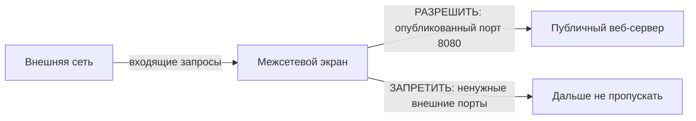
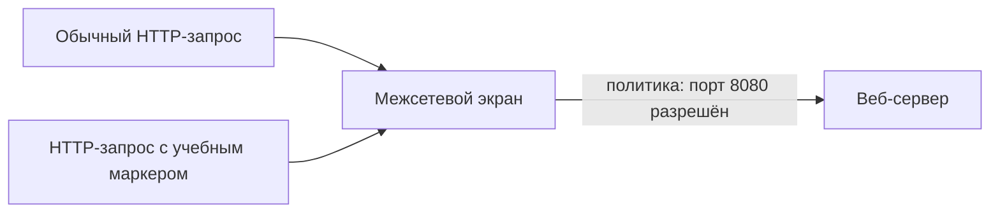
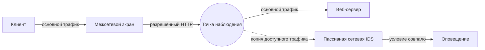
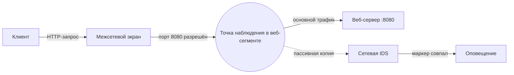

# Глава 1. Что такое IDS/IPS и зачем они нужны

Информационная система уже защищена межсетевым экраном. Из внешней сети разрешён доступ только к публичному веб-сервису, остальные ненужные взаимодействия запрещены.

Но остаётся ключевой вопрос: <strong>что произойдёт, если нежелательная активность будет использовать именно тот путь, который системе необходимо оставить доступным?</strong>

В названии дисциплины используются две международно распространённые аббревиатуры: **система обнаружения вторжений (Intrusion Detection System, IDS)** и **система предотвращения вторжений (Intrusion Prevention System, IPS)**. Английские названия приведены здесь только для происхождения сокращений `IDS` и `IPS`; их функциональное различие последовательно разбирается ниже.

<strong>После изучения главы студент должен уметь:</strong>

объяснить назначение IDS и IPS; отличить обнаружение от предотвращения; объяснить, почему межсетевой экран и IDS/IPS решают разные защитные задачи; на базовом уровне отличить межсетевой экран веб-приложений от IDS/IPS; объяснить, почему оповещение само по себе ещё не означает компрометацию.

---

## 1. Сначала обычная информационная система

СХЕМА 1 · БАЗОВЫЙ СЕТЕВОЙ КОНТУР

Схема показывает два возможных результата политики доступа: запрос к публичному сервису разрешается, а ненужные внешние пути не пропускаются дальше межсетевого экрана.

Веб-сервер должен быть доступен пользователям. Полностью запретить обращения к нему нельзя, иначе сервис перестанет выполнять свою функцию.

  
Внешняя сеть → веб-сервер<strong>РАЗРЕШИТЬ</strong>

  
Внешняя сеть → база данных<strong>ЗАПРЕТИТЬ</strong>

  
Внешняя сеть → административный доступ<strong>ЗАПРЕТИТЬ</strong>

Если взаимодействие не требуется для работы системы, его следует ограничить политикой доступа, а не оставлять открытым в надежде, что IDS обнаружит каждую попытку атаки.

Но разрешённый веб-сервис всё равно остаётся доступным для взаимодействия.

  
РАЗРЕШЕНО<b>≠</b>БЕЗОПАСНО

  
Разрешённое взаимодействие не обязательно является безопасным взаимодействием.

---

## 2. Какую задачу решает межсетевой экран

**Межсетевой экран** контролирует прохождение сетевого трафика в соответствии с установленной политикой безопасности. В англоязычной документации для него часто используется слово *firewall*; оно приведено здесь только для узнавания документации, а далее в курсе используется русский термин.

Важно не сводить его работу к формуле `межсетевой экран = только адрес + порт`. Простейшие механизмы фильтрации действительно могут принимать решения на основании адресов, протокола, портов и направления. Межсетевой экран с **контролем состояния соединений** также учитывает состояние соединения, поэтому ответный трафик установленной допустимой сессии рассматривается в контексте этого соединения. В документации такой подход часто называется *stateful inspection*; английское название нужно только для связи с первичными источниками.

Современные **межсетевые экраны следующего поколения (Next-Generation Firewall, NGFW)** могут учитывать приложения, пользователей и свойства прикладных протоколов. Английское название приведено только потому, что от него образована широко используемая аббревиатура `NGFW`; далее достаточно этой аббревиатуры или русского названия. Поэтому противопоставление «межсетевой экран работает только с сетевым и транспортным уровнями, а IDS — только с прикладным» некорректно.

  <article class="idps-card idps-card--primary">
    МЕЖСЕТЕВОЙ ЭКРАН
    <strong class="idps-card__title">Допустимо ли данное сетевое взаимодействие?</strong>
    
Решение принимается в контексте политики доступа.

  </article>
  <article class="idps-card idps-card--sensor">
    IDS/IPS
    <strong class="idps-card__title">Есть ли в наблюдаемой активности признаки, требующие обнаружения?</strong>
    
Это уже другая защитная задача.

  </article>

Например, `Внешняя сеть → база данных:5432` может быть запрещено вообще, независимо от того, содержит ли соединение атаку. А обращение к публичному веб-сервису может быть разрешено, потому что без него система не выполняет свою функцию.

  

    <strong>Один сетевой поток — два разных защитных вопроса</strong>
    
Переключатель меняет только рассматриваемую функцию защиты. Конкретный продукт может совмещать несколько функций.

  

  

    <button id="chapter1-control-access" class="idps-switcher__button" type="button" aria-controls="chapter1-panel-access" data-idps-switch="access">Контроль доступа</button>
    <button id="chapter1-control-detection" class="idps-switcher__button" type="button" aria-controls="chapter1-panel-detection" data-idps-switch="detection">Обнаружение</button>
  

  

    <section id="chapter1-panel-access" class="idps-switcher__panel" data-idps-panel="access">
      <h3 class="idps-switcher__panel-title">Контроль доступа</h3>
      

        
Вопрос<strong>Допустимо ли данное сетевое взаимодействие по политике?</strong>

        
Основание решения<strong>Политика доступа и доступный системе контекст соединения</strong>

        
Результат<strong>Например: разрешить или запретить взаимодействие</strong>

        
<strong>Граница вывода:</strong> разрешение сетевого пути само по себе не доказывает безопасность конкретного содержимого запроса.

      

    </section>
    <section id="chapter1-panel-detection" class="idps-switcher__panel" data-idps-panel="detection">
      <h3 class="idps-switcher__panel-title">Обнаружение</h3>
      

        
Вопрос<strong>Есть ли в доступных данных признак, удовлетворяющий логике обнаружения?</strong>

        
Основание решения<strong>Доступные системе данные и заданная логика обнаружения</strong>

        
Результат<strong>Результат обнаружения, например оповещение</strong>

        
<strong>Граница вывода:</strong> результат обнаружения сам по себе не доказывает успешную эксплуатацию или компрометацию.

      

    </section>
  

---

## 3. Где возникает задача обнаружения

!!! note "Учебная модель / синтетический сценарий"
    В этой главе намеренно используется обычный **HTTP (Hypertext Transfer Protocol)** без защиты протоколом **TLS (Transport Layer Security)**. Эти английские названия приведены только потому, что `HTTP` и `TLS` — стандартные обозначения протоколов в технических спецификациях и документации; далее используются их общепринятые сокращения. Здесь мы изолируем один механизм: различие между контролем допустимости взаимодействия и обнаружением. Ограничения видимости зашифрованного трафика будут изучаться позднее.

СХЕМА 2 · РАЗРЕШЁННЫЙ ВЕБ-ПУТЬ

Политика разрешает сам сетевой путь к сервису. Смысл конкретного HTTP-запроса — отдельный вопрос, который требует наблюдения и анализа.

  <article class="idps-card idps-code-card">
    ШТАТНЫЙ ЗАПРОС
    <pre><code>GET /lab-test HTTP/1.1
Host: web.lab</code></pre>
    
Запрос использует разрешённый веб-сервис.

  </article>
  <article class="idps-card idps-card--primary idps-code-card">
    ЗАПРОС С УЧЕБНЫМ МАРКЕРОМ
    <pre><code>GET /admin-test?marker=ATTACK-LAB HTTP/1.1
Host: web.lab</code></pre>
    
Сетевой путь тот же, но наблюдаемая активность отличается.

  </article>

С точки зрения рассмотренной сетевой политики оба запроса используют разрешённое взаимодействие с опубликованным сервисом.

Мы не предполагаем, что межсетевой экран умеет только проверять номер порта. В конкретной инфраструктуре он может обладать дополнительными функциями инспекции. Но сам факт разрешённости взаимодействия не отвечает на другой вопрос:

> **Содержит ли наблюдаемая активность признаки, которые система безопасности должна обнаружить?**

Это уже задача **обнаружения вторжений**.

---

## 4. Что такое IDS

**IDS — система обнаружения вторжений** — автоматизирует задачу обнаружения.

В общем виде IDS получает доступные ей сведения о происходящей активности и анализирует их на наличие заданных признаков возможных инцидентов или иной активности, значимой для безопасности.

  
1<strong>Активность</strong><small>в системе или сети</small>

  <b class="idps-process__arrow" aria-hidden="true">→</b>
  
2<strong>Доступные данные</strong><small>то, что реально получает IDS</small>

  <b class="idps-process__arrow" aria-hidden="true">→</b>
  
3<strong>Анализ</strong><small>применение логики обнаружения</small>

  <b class="idps-process__arrow" aria-hidden="true">→</b>
  
4<strong>Результат</strong><small>например, оповещение</small>

Ключевое выражение — **«доступные системе данные»**. IDS не обладает абсолютной наблюдаемостью. Что именно она сможет получить, зависит от типа системы, места размещения, способа получения данных, шифрования и конфигурации.

---

## 5. Событие и оповещение — не одно и то же

  <article class="idps-card">
    СОБЫТИЕ
    <strong class="idps-card__title">Зафиксированное событие</strong>
    
Например: соединение установлено, запрос к службе доменных имён получен, процесс запущен, файл изменён.

  </article>
  <article class="idps-card idps-card--result">
    ОПОВЕЩЕНИЕ
    <strong class="idps-card__title">Выделенный результат обнаружения</strong>
    
Наблюдаемая активность удовлетворила условию, которое требует внимания или дальнейшей обработки.

  </article>

В англоязычной документации результаты работы средств обнаружения могут называться `event`, `alert`, `finding` или `detection`. Эти слова приведены только потому, что студент встретит их в документации разных продуктов. В курсе основными остаются русские термины: **событие**, **оповещение** и **результат обнаружения**. Для первой главы достаточно различать факт наблюдения и результат работы детектора.

---

## 6. Что означает оповещение

Добавим к стенду пассивный сетевой сенсор.

СХЕМА 3 · ПАССИВНАЯ СЕТЕВАЯ IDS НЕ НАХОДИТСЯ В ТРАНЗИТНОМ ПУТИ

Сплошные стрелки — физический путь основного трафика. Пунктирная стрелка — копия данных в пассивную сетевую IDS. Оповещение является результатом анализа копии и не находится в пути передачи.

Пусть детектор ищет маркер `ATTACK-LAB` в определённом поле HTTP-запроса. При получении запроса с этим маркером система формирует оповещение.

  РЕЗУЛЬТАТ ОБНАРУЖЕНИЯ
  <strong>LAB1: обнаружен учебный HTTP-маркер</strong>
  <code>идентификатор правила: 1000001 · маркер: ATTACK-LAB</code>

  <article class="idps-evidence idps-evidence--supported">
    ПОДТВЕРЖДЕНО
    
В анализируемом системой представлении запроса присутствовал признак, удовлетворивший условию детектора.

  </article>
  <article class="idps-evidence idps-evidence--not-proven">
    НЕ ПОДТВЕРЖДЕНО
    
Что приложение уязвимо, эксплуатация была успешной, атакующий получил доступ или сервер был скомпрометирован.

  </article>

  
ОПОВЕЩЕНИЕ<b>≠</b>КОМПРОМЕТАЦИЯ

  
Оповещение сообщает о результате обнаружения, но само по себе не доказывает успешный взлом.

---

## 7. Что такое IPS

**IPS — система предотвращения вторжений** — выполняет обнаружение и дополнительно может инициировать действие, направленное на предотвращение или прекращение обнаруженной нежелательной активности.

Когда нужно говорить об IDS и IPS как об общем классе, в курсе используется сокращение **IDPS** от английского *Intrusion Detection and Prevention Systems* — «системы обнаружения и предотвращения вторжений». Английская форма приведена только для происхождения сокращения; она не вводит отдельный тип системы.

  <article class="idps-card idps-card--sensor">
    IDS
    <strong class="idps-card__title">Обнаружить</strong>
    
Получить данные, применить логику обнаружения, сформировать результат.

  </article>
  
→

  <article class="idps-card idps-card--warning">
    IPS
    <strong class="idps-card__title">Обнаружить + воздействовать</strong>
    
После обнаружения система может инициировать действие по предотвращению.

  </article>

Не следует запоминать формулу «IDS находится сбоку, а IPS обязательно подключена в разрыв». В документации сетевых средств для подключения в разрыв часто используется термин `inline`; далее он применяется только как обозначение такого режима. Упрощённая формула смешивает две характеристики: **как система получает данные** и **может ли она инициировать воздействие**.

Система, включённая в разрыв, может работать только в режиме оповещения и ничего не блокировать. А пассивный детектор в некоторых архитектурах может инициировать действие через другой механизм управления, например программный интерфейс приложения (Application Programming Interface, API) межсетевого экрана. Аббревиатура `API` сохраняется, потому что именно так такие интерфейсы обозначаются в технической документации; далее используется `API` или русское «программный интерфейс».

  
ОБНАРУЖЕНИЕ<b>≠</b>ПРЕДОТВРАЩЕНИЕ

  
Обнаружение и воздействие — разные операции и имеют разную цену ошибки.

---

## 8. Почему ошибка предотвращения имеет другую цену

  <article class="idps-card idps-card--result">
    ТОЛЬКО ОПОВЕЩЕНИЕ
    <strong class="idps-card__title">Цена ошибочного решения</strong>
    
Может создать лишнее оповещение и потребовать дополнительной проверки.

  </article>
  <article class="idps-card idps-card--warning">
    АВТОМАТИЧЕСКОЕ ПРЕДОТВРАЩЕНИЕ
    <strong class="idps-card__title">Цена ошибочного решения</strong>
    
Может отбросить легитимный трафик, прервать сессию или нарушить бизнес-процесс.

  </article>

Это не означает, что IPS «опасен». Вывод другой:

> **Автоматическое предотвращение требует более строгой проверки логики обнаружения и понимания последствий ошибочного воздействия.**

Ложноположительные и ложноотрицательные результаты, а также методы оценки качества появятся позднее, когда у студента уже будет базовая модель IDS/IPS.

---

## 9. Межсетевой экран и IDS/IPS не заменяют друг друга

Если внешний доступ по протоколу **SSH (Secure Shell)** не требуется, правильное решение — запретить его политикой доступа. Английское название сохраняется только потому, что `SSH` — стандартное имя протокола защищённого удалённого доступа:

<code>Внешняя сеть → сервер:22</code><strong>ЗАПРЕТИТЬ</strong>ненужный путь закрывается

IDS/IPS не должна подменять возможность устранить ненужный сетевой путь.

Но если публичный сервис должен обслуживать клиентов, некоторый набор взаимодействий необходимо разрешить. После этого остаётся задача наблюдения за активностью, значимой для безопасности внутри доступной системе области.

  
МЕЖСЕТЕВОЙ ЭКРАН<b>≠</b>IDS/IPS

  
Это разные защитные функции, даже когда они реализованы внутри одного продукта.

---

## 10. Функция и продукт — разные вещи

Одна платформа NGFW может совмещать несколько функций.

  ЕДИНАЯ ПЛАТФОРМА NGFW
  
Политика межсетевого экрана

  
IPS

  
Распознавание приложений

  
Фильтрация веб-адресов

  
Журналирование

Нужно отличать **физическое устройство или программный продукт** от **защитной функции**. Если IPS встроена в NGFW, функция предотвращения вторжений никуда не исчезла — она реализована внутри той же платформы.

---

## 11. А где здесь межсетевой экран веб-приложений

**Межсетевой экран веб-приложений (Web Application Firewall, WAF)** — специализированное средство защиты веб-приложений и связанного с ними веб-трафика. Английское название сохраняется только потому, что из него образована общепринятая аббревиатура `WAF`.

  <article class="idps-card idps-card--primary">
    WAF
    <strong class="idps-card__title">Трафик веб-приложения</strong>
    
Работает с доступными ему элементами HTTP-транзакций и применяет политику защиты веб-приложения.

  </article>
  <article class="idps-card idps-card--sensor">
    IDS/IPS
    <strong class="idps-card__title">Более широкий класс</strong>
    
Сетевые, хостовые и беспроводные IDS/IPS используют разные источники данных и не ограничиваются веб-трафиком.

  </article>

Возможности могут пересекаться. Например, WAF и сетевая IDS могут одновременно анализировать один HTTP-запрос и обнаружить в нём один и тот же интересующий признак. Это не делает их одним и тем же классом средств.

---

## 12. Соберём пример целиком

СХЕМА 4 · ОТ РАЗРЕШЁННОГО ТРАФИКА К ОПОВЕЩЕНИЮ

Сплошной путь показывает разрешённое взаимодействие. Пунктир показывает копию данных в сетевую IDS. Межсетевой экран применяет политику доступа, а сетевая IDS — логику обнаружения.

Клиент отправляет запрос с `ATTACK-LAB`. Межсетевой экран применяет политику доступа и допускает взаимодействие с опубликованным сервисом. Сетевая IDS получает доступную ей копию активности. Условие обнаружения совпадает с признаком, и система формирует оповещение.

  <article class="idps-evidence idps-evidence--supported">МОЖНО СКАЗАТЬ
Детектор получил достаточное представление запроса и его условие выполнилось.
</article>
  <article class="idps-evidence idps-evidence--not-proven">ЭТО ОПОВЕЩЕНИЕ НЕ ДОКАЗЫВАЕТ
Кто именно отправил запрос, уязвимо ли приложение, был ли достигнут нежелательный результат и произошла ли компрометация.
</article>

---

## 13. Четыре идеи первой главы

  <article class="idps-summary-card">01<strong>РАЗРЕШЕНО ≠ БЕЗОПАСНО</strong>
Политика разрешила путь, но не доказала безопасность активности.
</article>
  <article class="idps-summary-card">02<strong>МЕЖСЕТЕВОЙ ЭКРАН ≠ IDS/IPS</strong>
Разные защитные функции могут находиться в одном продукте.
</article>
  <article class="idps-summary-card">03<strong>ОБНАРУЖЕНИЕ ≠ ПРЕДОТВРАЩЕНИЕ</strong>
Обнаружить и воздействовать — разные действия.
</article>
  <article class="idps-summary-card">04<strong>ОПОВЕЩЕНИЕ ≠ КОМПРОМЕТАЦИЯ</strong>
Срабатывание детектора не равно доказанному взлому.
</article>

Если эти четыре отношения понятны, первая глава выполнила свою задачу.

---

## 14. Проверка понимания

!!! info "Формат проверки"
    Это **самопроверка после лекции**, а не отдельная практическая работа. Баллы за неё не выставляются. Оценочная часть модуля — воспроизводимая лабораторная работа и её подтверждающие материалы.

  
<strong>Публичный веб-сервис разрешён политикой межсетевого экрана. Какой вывод корректен?</strong>

  <button data-choice="a">A. Любая активность внутри разрешённого соединения считается безопасной</button>
  <button data-choice="b" data-correct="true">B. Политика допустила взаимодействие, но безопасность конкретной активности требует отдельного анализа</button>
  <button data-choice="c">C. Любой запрос к разрешённому порту автоматически является доверенным</button>
  <button data-choice="d">D. Наличие межсетевого экрана с контролем состояния исключает необходимость обнаружения</button>
  

  
<strong>Сетевая IDS сформировала оповещение по условию детектора. Что подтверждено этим фактом?</strong>

  <button data-choice="a">A. Сервер успешно скомпрометирован</button>
  <button data-choice="b">B. Уязвимость на сервере существует</button>
  <button data-choice="c" data-correct="true">C. Наблюдаемая активность удовлетворила заданному условию обнаружения</button>
  <button data-choice="d">D. Инцидент полностью расследован</button>
  

  
<strong>На сервере открыт ненужный внешний SSH. Какой защитный контроль непосредственно устраняет этот ненужный сетевой путь?</strong>

  <button data-choice="a">A. Добавить больше сигнатур IDS</button>
  <button data-choice="b" data-correct="true">B. Ограничить ненужный путь политикой доступа</button>
  <button data-choice="c">C. Оставить IPS только в режиме оповещения</button>
  <button data-choice="d">D. Перенести сетевую IDS ближе к серверу</button>
  

  
<strong>NGFW содержит функцию межсетевого экрана и механизм IPS. Что это означает?</strong>

  <button data-choice="a">A. Межсетевой экран и IPS стали одной и той же функцией</button>
  <button data-choice="b" data-correct="true">B. Одна физическая платформа реализует несколько различных защитных функций</button>
  <button data-choice="c">C. IPS больше не относится к IDPS</button>
  <button data-choice="d">D. Любой разрешённый трафик автоматически проходит IPS без анализа</button>
  

  
<strong>Система, включённая в разрыв, настроена только на оповещение и ничего не блокирует. Какой вывод корректен?</strong>

  <button data-choice="a">A. Само размещение в разрыве автоматически превращает любое оповещение в блокирование</button>
  <button data-choice="b">B. Такая система не может выполнять обнаружение</button>
  <button data-choice="c" data-correct="true">C. Способ размещения и функция предотвращения — разные характеристики</button>
  <button data-choice="d">D. Система в разрыве обязательно является межсетевым экраном</button>
  

  
<strong>WAF защищает публичное веб-приложение. Что из этого НЕ следует?</strong>

  <button data-choice="a">A. WAF может анализировать доступные ему веб-транзакции</button>
  <button data-choice="b">B. Его возможности могут пересекаться с сетевой IDS при анализе HTTP</button>
  <button data-choice="c" data-correct="true">C. WAF обеспечивает полную наблюдаемость всей сетевой и хостовой инфраструктуры</button>
  <button data-choice="d">D. WAF специализирован на веб-приложениях</button>
  

<strong>Перед первой лабораторной:</strong> подготовьте <a href="../../labs/environment/">двухмашинный стенд</a> и пройдите <a href="../../labs/orientation/">Практикум 0 — знакомство с рабочей IDPS</a>. Это вводная подготовка, а не оценочная лабораторная работа.

<strong>Следующая теория:</strong> затем переходите к <a href="../02-classification/">Главе 2 — «Какие виды IDS/IPS существуют»</a>. После неё начинается первый контролируемый сетевой эксперимент.

---

## Источники и статус утверждений

- NIST (National Institute of Standards and Technology) SP 800-94, *Guide to Intrusion Detection and Prevention Systems (IDPS)* — фундаментальные определения IDS/IPS и функций обнаружения/предотвращения. Документ используется как исторический фундаментальный источник, а не как описание современных продуктов.
- NIST SP 800-41 Rev.1, *Guidelines on Firewalls and Firewall Policy* — базовая роль межсетевого экрана и фильтрации с учётом состояния.
- OWASP (Open Worldwide Application Security Project), *Web Application Firewall* — специализированная роль WAF для HTTP-приложений и применение правил к HTTP-взаимодействиям.
- Учебный HTTP-сценарий `ATTACK-LAB` — **синтетический**, создан специально для курса и не является реальным примером эксплуатации уязвимости или реальным инцидентным сценарием.

Актуальные ссылки собраны в разделе [«Источники курса»](../../resources/sources/).
