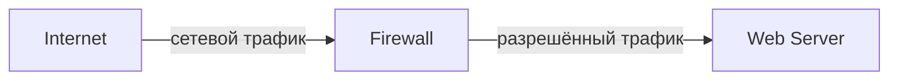
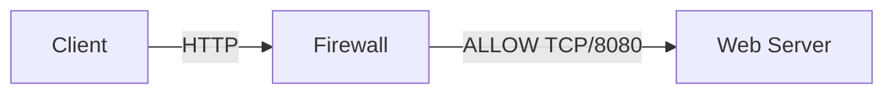
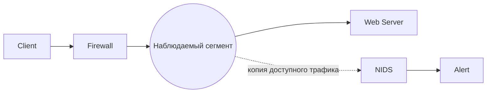
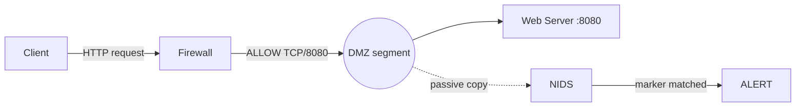

# Глава 1. Что такое IDS/IPS и зачем они нужны

Информационная система уже защищена межсетевым экраном. Из внешней сети разрешён доступ только к публичному веб-сервису, остальные ненужные взаимодействия запрещены.

Но остаётся ключевой вопрос: <strong>что произойдёт, если нежелательная активность будет использовать именно тот путь, который системе необходимо оставить доступным?</strong>

<strong>После изучения главы студент должен уметь:</strong>

объяснить назначение IDS и IPS; отличить detection от prevention; объяснить, почему firewall и IDS/IPS решают разные защитные задачи; на базовом уровне отличить WAF от IDS/IPS; объяснить, почему alert сам по себе ещё не означает компрометацию.

---

## 1. Сначала обычная информационная система

СХЕМА 1 · БАЗОВЫЙ СЕТЕВОЙ КОНТУР

Firewall находится на пути сетевого взаимодействия и применяет установленную политику доступа.

Веб-сервер должен быть доступен пользователям. Полностью запретить обращения к нему нельзя, иначе сервис перестанет выполнять свою функцию.

  
Internet → Web Server<strong>ALLOW</strong>

  
Internet → Database<strong>DENY</strong>

  
Internet → SSH Management<strong>DENY</strong>

Если взаимодействие не требуется для работы системы, его следует ограничить политикой доступа, а не оставлять открытым в надежде, что IDS обнаружит каждую попытку атаки.

Но разрешённый веб-сервис всё равно остаётся доступным для взаимодействия.

  ALLOWED
  ≠
  SAFE
  
Разрешённое взаимодействие не обязательно является безопасным взаимодействием.

---

## 2. Какую задачу решает Firewall

**Firewall** контролирует прохождение сетевого трафика в соответствии с установленной политикой безопасности.

Важно не сводить его работу к формуле `Firewall = IP + Port`. Простейшие механизмы фильтрации действительно могут принимать решения на основании адресов, протокола, портов и направления. Stateful firewall также учитывает состояние соединения, поэтому ответный трафик установленной допустимой сессии рассматривается в контексте этого соединения.

Современные NGFW могут учитывать приложения, пользователей и свойства прикладных протоколов. Поэтому противопоставление `Firewall = L3/L4`, а `IDS = L7` некорректно.

  <article class="control-question firewall-question">
    FIREWALL
    <strong>Допустимо ли данное сетевое взаимодействие?</strong>
    
Решение принимается в контексте политики доступа.

  </article>
  <article class="control-question detection-question">
    IDS/IPS
    <strong>Есть ли в наблюдаемой активности признаки, требующие detection?</strong>
    
Это уже другая защитная задача.

  </article>

Например, `Internet → Database:5432` может быть запрещено вообще, независимо от того, содержит ли соединение атаку. А обращение к публичному веб-сервису может быть разрешено, потому что без него система не выполняет свою функцию.

---

## 3. Где возникает задача обнаружения

!!! note "Учебная модель / синтетический сценарий"
    В этой главе намеренно используется обычный HTTP без TLS. Мы изолируем один механизм: различие между контролем допустимости взаимодействия и обнаружением. Ограничения видимости зашифрованного трафика будут изучаться позднее.

СХЕМА 2 · РАЗРЕШЁННЫЙ WEB-ПУТЬ

Оба запроса ниже проходят по одному и тому же разрешённому сетевому пути.

  <article class="example-card normal-example">
    ШТАТНЫЙ ЗАПРОС
    <pre><code>GET /lab-test HTTP/1.1
Host: web.lab</code></pre>
    
Запрос использует разрешённый web-сервис.

  </article>
  <article class="example-card signal-example">
    ЗАПРОС С УЧЕБНЫМ МАРКЕРОМ
    <pre><code>GET /admin-test?marker=ATTACK-LAB HTTP/1.1
Host: web.lab</code></pre>
    
Сетевой путь тот же, но наблюдаемая активность отличается.

  </article>

С точки зрения рассмотренной сетевой политики оба запроса используют разрешённое взаимодействие с опубликованным сервисом.

Мы не предполагаем, что firewall умеет только проверять номер порта. В конкретной инфраструктуре он может обладать дополнительными функциями инспекции. Но сам факт разрешённости взаимодействия не отвечает на другой вопрос:

> **Содержит ли наблюдаемая активность признаки, которые система безопасности должна обнаружить?**

Это уже задача intrusion detection.

---

## 4. Что такое IDS

**IDS — Intrusion Detection System — система обнаружения вторжений.**

В общем виде IDS получает доступные ей сведения о происходящей активности и анализирует их на наличие заданных признаков возможных инцидентов или иной security-relevant activity.

  
1<strong>Активность</strong><small>в системе или сети</small>

  <b>→</b>
  
2<strong>Доступные данные</strong><small>то, что реально получает IDS</small>

  <b>→</b>
  
3<strong>Анализ</strong><small>применение detection logic</small>

  <b>→</b>
  
4<strong>Результат</strong><small>например, alert</small>

Ключевое выражение — **«доступные системе данные»**. IDS не обладает абсолютной наблюдаемостью. Что именно она сможет получить, зависит от типа системы, места размещения, способа получения данных, шифрования и конфигурации.

---

## 5. Event и Alert — не одно и то же

  <article class="concept-card">
    EVENT
    <h3>Зафиксированное событие</h3>
    
Например: соединение установлено, DNS-запрос получен, процесс запущен, файл изменён.

  </article>
  <article class="concept-card accent-card">
    ALERT
    <h3>Выделенный результат detection</h3>
    
Наблюдаемая активность удовлетворила условию, которое требует внимания или дальнейшей обработки.

  </article>

Конкретные продукты могут использовать термины `event`, `alert`, `finding` и `detection` по-разному. Для первой главы достаточно различать факт наблюдения и результат работы детектора.

---

## 6. Что означает Alert

Добавим к стенду пассивный сетевой сенсор.

СХЕМА 3 · ПАССИВНЫЙ NIDS НЕ НАХОДИТСЯ В ТРАНЗИТНОМ ПУТИ

Основной трафик направляется к серверу. NIDS получает копию доступной ему активности из выбранной точки наблюдения.

Пусть detector ищет маркер `ATTACK-LAB` в определённом поле HTTP-запроса. При получении запроса с этим маркером система формирует alert.

  DETECTION RESULT
  <strong>LAB1 HTTP marker observed</strong>
  <code>sid: 1000001 · marker: ATTACK-LAB</code>

  <article class="evidence-supported">
    ПОДТВЕРЖДЕНО
    
В анализируемом системой представлении запроса присутствовал признак, удовлетворивший условию detector.

  </article>
  <article class="evidence-not-proven">
    НЕ ПОДТВЕРЖДЕНО
    
Что приложение уязвимо, эксплуатация была успешной, атакующий получил доступ или сервер был скомпрометирован.

  </article>

  ALERT
  ≠
  COMPROMISE
  
Alert сообщает о результате обнаружения, но сам по себе не доказывает успешный взлом.

---

## 7. Что такое IPS

**IPS — Intrusion Prevention System — система предотвращения вторжений.** Она выполняет detection и дополнительно может инициировать действие, направленное на предотвращение или прекращение обнаруженной нежелательной активности.

  <article>
    IDS
    <strong>Обнаружить</strong>
    
Получить данные, применить detection logic, сформировать результат.

  </article>
  
→

  <article class="ips-card">
    IPS
    <strong>Обнаружить + воздействовать</strong>
    
После detection система может инициировать prevention action.

  </article>

Не следует запоминать `IDS = сбоку`, `IPS = inline`. Это смешивает две характеристики: **как система получает данные** и **может ли она инициировать воздействие**.

Inline-система может работать в режиме `alert-only`. А пассивный detector в некоторых архитектурах может инициировать действие через другой control, например firewall API.

  DETECTION
  ≠
  PREVENTION
  
Обнаружение и воздействие — разные операции и имеют разную цену ошибки.

---

## 8. Почему ошибка Prevention имеет другую цену

  <article>
    ALERT-ONLY
    <strong>Ошибочное решение</strong>
    
Может создать лишнее оповещение и потребовать дополнительной проверки.

  </article>
  <article class="impact-active">
    AUTOMATIC PREVENTION
    <strong>Ошибочное решение</strong>
    
Может отбросить легитимный трафик, прервать сессию или нарушить бизнес-процесс.

  </article>

Это не означает, что IPS «опасен». Вывод другой:

> **Автоматическое предотвращение требует более строгой проверки detection logic и понимания последствий ошибочного воздействия.**

FP/FN и методы оценки качества появятся позднее, когда у студента уже будет базовая модель IDS/IPS.

---

## 9. Firewall и IDS/IPS не заменяют друг друга

Если внешний SSH-доступ не требуется, правильное решение — запретить его политикой доступа:

<code>Internet → Server:22</code><strong>DENY</strong>ненужный путь закрывается

IDS/IPS не должна подменять возможность устранить ненужный сетевой путь.

Но если публичный сервис должен обслуживать клиентов, некоторый набор взаимодействий необходимо разрешить. После этого остаётся задача наблюдения за security-relevant activity внутри доступной системе области.

  FIREWALL
  ≠
  IDS/IPS
  
Это разные защитные функции, даже когда они реализованы внутри одного продукта.

---

## 10. Функция и продукт — разные вещи

Одна NGFW-платформа может совмещать несколько функций.

  NGFW platform
  
Firewall policy

  
IPS

  
Application identification

  
URL filtering

  
Logging

Нужно отличать **физический продукт** от **защитной функции**. Если IPS встроена в NGFW, intrusion prevention никуда не исчезла — она реализована внутри той же платформы.

---

## 11. А где здесь WAF

**WAF — Web Application Firewall** — специализированное средство защиты веб-приложений и связанного с ними web-трафика.

  <article>
    WAF
    <strong>Web application traffic</strong>
    
Работает с доступными ему элементами HTTP/web-транзакций и применяет web-specific policy.

  </article>
  <article>
    IDS/IPS
    <strong>Более широкий класс</strong>
    
Network-, host- и wireless-based системы используют разные источники данных и не ограничиваются web-трафиком.

  </article>

Возможности могут пересекаться. Например, WAF и NIDS могут одновременно анализировать один HTTP-запрос и обнаружить в нём один и тот же интересующий признак. Это не делает их одним и тем же классом средств.

---

## 12. Соберём пример целиком

СХЕМА 4 · ОТ РАЗРЕШЁННОГО ТРАФИКА К ALERT

Схема показывает разные функции: policy допускает взаимодействие, NIDS наблюдает доступную копию и применяет detection logic.

Клиент отправляет запрос с `ATTACK-LAB`. Firewall применяет policy и допускает взаимодействие с опубликованным сервисом. NIDS получает доступную ему копию активности. Detection condition совпадает с признаком, и система формирует alert.

  <article class="evidence-supported">МОЖНО СКАЗАТЬ
Detector получил достаточное представление запроса и его условие выполнилось.
</article>
  <article class="evidence-not-proven">НЕЛЬЗЯ ДОКАЗАТЬ ЭТИМ ALERT
Кто именно отправил запрос, уязвимо ли приложение, был ли достигнут нежелательный результат и произошла ли компрометация.
</article>

---

## 13. Четыре идеи первой главы

  <article class="axiom-card">01<strong>ALLOWED ≠ SAFE</strong>
Policy разрешила путь, но не доказала безопасность активности.
</article>
  <article class="axiom-card">02<strong>FIREWALL ≠ IDS/IPS</strong>
Разные защитные функции могут находиться в одном продукте.
</article>
  <article class="axiom-card">03<strong>DETECTION ≠ PREVENTION</strong>
Обнаружить и воздействовать — разные действия.
</article>
  <article class="axiom-card">04<strong>ALERT ≠ COMPROMISE</strong>
Срабатывание detector не равно доказанному взлому.
</article>

Если эти четыре отношения понятны, первая глава выполнила свою задачу.

---

## 14. Проверка понимания

!!! info "Формат проверки"
    Это **самопроверка после лекции**, а не отдельная практическая работа. Баллы за неё не выставляются. Оценочная часть модуля — воспроизводимая лабораторная работа и короткая защита evidence.

  
<strong>Публичный web-сервис разрешён политикой firewall. Какой вывод корректен?</strong>

  <button data-choice="a">A. Любая активность внутри разрешённого соединения считается безопасной</button>
  <button data-choice="b" data-correct="true">B. Policy допустила взаимодействие, но безопасность конкретной активности требует отдельного анализа</button>
  <button data-choice="c">C. Любой запрос к разрешённому порту автоматически является доверенным</button>
  <button data-choice="d">D. Наличие stateful firewall исключает необходимость detection</button>
  

  
<strong>NIDS сформировала alert по условию detector. Что подтверждено этим фактом?</strong>

  <button data-choice="a">A. Сервер успешно скомпрометирован</button>
  <button data-choice="b">B. Уязвимость на сервере существует</button>
  <button data-choice="c" data-correct="true">C. Наблюдаемая активность удовлетворила заданному условию detection</button>
  <button data-choice="d">D. Инцидент полностью расследован</button>
  

  
<strong>На сервере открыт ненужный внешний SSH. Какое действие должно быть первым?</strong>

  <button data-choice="a">A. Добавить больше IDS signatures</button>
  <button data-choice="b" data-correct="true">B. Ограничить ненужный путь политикой доступа</button>
  <button data-choice="c">C. Включить alert-only режим IPS</button>
  <button data-choice="d">D. Перенести NIDS ближе к серверу</button>
  

  
<strong>NGFW содержит firewall policy и IPS engine. Что это означает?</strong>

  <button data-choice="a">A. Firewall и IPS стали одной и той же функцией</button>
  <button data-choice="b" data-correct="true">B. Одна физическая платформа реализует несколько различных защитных функций</button>
  <button data-choice="c">C. IPS больше не относится к IDPS</button>
  <button data-choice="d">D. Любой разрешённый traffic автоматически проходит IPS без анализа</button>
  

  
<strong>Inline-система настроена только на alert и ничего не блокирует. Какой вывод корректен?</strong>

  <button data-choice="a">A. Само inline-размещение автоматически превращает любой alert в prevention</button>
  <button data-choice="b">B. Такая система не может выполнять detection</button>
  <button data-choice="c" data-correct="true">C. Способ размещения и функция prevention — разные характеристики</button>
  <button data-choice="d">D. Inline-система обязательно является firewall</button>
  

  
<strong>WAF защищает публичное web-приложение. Что из этого НЕ следует?</strong>

  <button data-choice="a">A. WAF может анализировать доступные ему web-транзакции</button>
  <button data-choice="b">B. Его возможности могут пересекаться с NIDS при анализе HTTP</button>
  <button data-choice="c" data-correct="true">C. WAF обеспечивает полную наблюдаемость всей сетевой и хостовой инфраструктуры</button>
  <button data-choice="d">D. WAF специализирован на web-приложениях</button>
  

  ОЦЕНИВАЕТСЯ НЕ ТЕСТ
  <strong>Доказательство в лаборатории + короткая защита</strong>
  
На защите студент должен показать собственный traffic/evidence и объяснить, почему наблюдаемый alert не равен compromise. Это сложнее подменить готовым ответом из ИИ.

<strong>Следующий шаг:</strong> переходите прямо к <a href="../../labs/lab01/">ЛР №1 — «Первый NIDS: visibility → alert → interpretation»</a>.

<strong>Следующая теория:</strong> после лаборатории разберём, <a href="../02-classification/">какие виды IDS/IPS существуют и почему разные системы наблюдают разные следы</a>.

---

## Источники и статус утверждений

- NIST SP 800-94, *Guide to Intrusion Detection and Prevention Systems (IDPS)* — фундаментальные определения IDS/IPS и функций detection/prevention. Документ используется как исторический foundational source, а не как описание современных продуктов.
- NIST SP 800-41 Rev.1, *Guidelines on Firewalls and Firewall Policy* — базовая роль firewall и stateful filtering.
- Учебный HTTP-сценарий `ATTACK-LAB` — **SYNTHETIC**, создан специально для курса и не является реальным exploit/case.

Актуальные ссылки собраны в разделе [«Источники курса»](../../resources/sources/).
