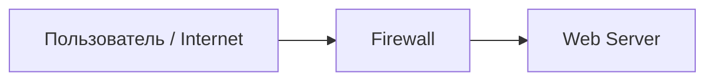
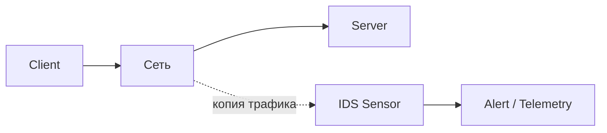
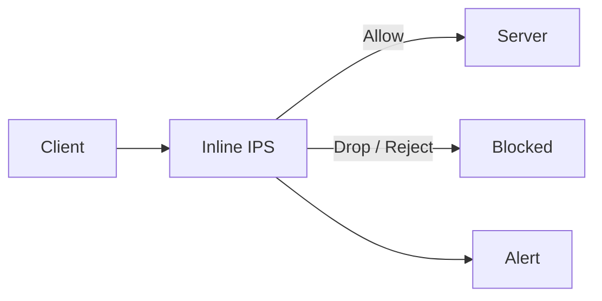
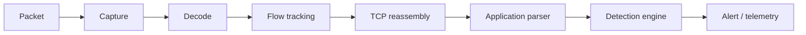
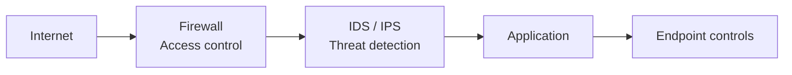

# Что такое IDS и IPS — и зачем они вообще нужны

<div class="page-goal">
<strong>После этого раздела вы должны уметь:</strong> объяснить, какую проблему решают IDS/IPS, почему одного firewall недостаточно, чем detection отличается от prevention и где эти знания используются на реальной работе.
</div>

## Начнём не с определения, а с ситуации

Представьте, что вы пришли младшим специалистом в SOC или команду сетевой безопасности.

У компании есть публичный веб-сервис:



На firewall настроено правило:

```text
Internet → Web Server → TCP/443 → ALLOW
```

Это нормальное правило. Если закрыть `443/tcp`, сайт перестанет работать.

Но теперь возникает ключевой вопрос:

> **Если соединение разрешено firewall, означает ли это, что действия внутри соединения безопасны?**

Нет.

Через разрешённый порт могут проходить:

- обычные запросы пользователей;
- попытки эксплуатации веб-приложения;
- автоматическое сканирование;
- обращения к запрещённым URL;
- команды вредоносного ПО;
- передача данных после компрометации.

Firewall решил только одну задачу:

> **разрешено ли этому источнику установить такое сетевое соединение согласно политике доступа?**

Он не обязательно отвечает на вопрос:

> **что именно происходит внутри этого разрешённого взаимодействия и похоже ли это на угрозу?**

Вот здесь и появляется IDPS.

---

# 1. IDS: «я увидел подозрительное событие»

**IDS — Intrusion Detection System**.

Главная идея IDS:

> наблюдать за событиями и сообщать, когда наблюдаемая активность соответствует условиям обнаружения.



В пассивной схеме основной трафик идёт независимо от сенсора.

IDS получает:

- копию сетевого трафика;
- события операционной системы;
- журналы приложений;
- другую telemetry;

и применяет к ним detection logic.

### Пример

Suricata получает HTTP-запрос:

```http
GET /download?file=../../etc/passwd HTTP/1.1
Host: target.lab
```

и имеет правило, ищущее определённый признак в URI.

Если условие совпало:

```text
наблюдаемое событие
        ↓
проверка правила
        ↓
MATCH
        ↓
alert
```

!!! warning "Критически важно"
    `Alert` означает: **условие правила выполнилось**.  
    Он не означает автоматически: **«сервер взломан»**.

---

# 2. IPS: «я могу вмешаться»

**IPS — Intrusion Prevention System**.

Она использует похожую detection logic, но располагается так, чтобы иметь возможность воздействовать на трафик.



Если система решила, что пакет/поток необходимо остановить, она может:

- `drop` — отбросить;
- `reject` — активно отклонить;
- разорвать соединение;
- вызвать другой enforcement-механизм.

## Почему это принципиально отличается от IDS

Пассивная IDS ошиблась:

```text
False Positive
     ↓
лишний alert
```

Inline IPS ошиблась:

```text
False Positive
     ↓
легитимный трафик заблокирован
     ↓
пользователь не может работать
```

Поэтому качество правил в prevention-режиме особенно важно.

---

# 3. Что происходит «под капотом»

Система IDPS — это не просто программа, которая ищет слова вроде `attack`.

Для сетевой IDS упрощённый путь выглядит так:



### Capture
Получение пакетов с интерфейса, SPAN/TAP или inline-path.

### Decode
Разбор Ethernet, IP, TCP/UDP и других сетевых заголовков.

### Flow tracking
Понимание того, какие пакеты относятся к одному соединению.

### TCP reassembly
Восстановление потока из отдельных TCP-сегментов.

### Application parser
Определение и разбор HTTP, DNS, TLS и других протоколов.

### Detection engine
Применение правил, состояний, протокольных условий и других механизмов.

Именно поэтому современная NIDS значительно сложнее простого:

```text
grep "bad-string"
```

---

# 4. Почему это нужно в профессии

## SOC Analyst

Вы будете видеть alerts и должны будете ответить:

- что сработало;
- почему;
- является ли это атакой;
- есть ли дополнительные подтверждения;
- требуется ли escalation.

## Security / Detection Engineer

Вы будете:

- писать и тестировать правила;
- снижать False Positives;
- искать False Negatives;
- настраивать сенсоры;
- выбирать telemetry;
- проверять coverage.

## Network Security Engineer

Вы будете решать:

- где разместить NIDS/NIPS;
- как получить трафик;
- где нужен inline;
- как избежать single point of failure;
- как учитывать throughput и encryption.

## Auditor / Security Architect

Вы должны понимать не только:

> «IDS установлена».

Но и:

> где она установлена, что видит, какие сегменты покрывает, кто обрабатывает alerts и является ли контроль вообще эффективным.

---

# 5. Firewall и IDS/IPS — не конкуренты

Неправильная модель:

```text
Firewall ИЛИ IDS
```

Правильнее:



Каждый уровень решает свою задачу.

Современный NGFW может объединять firewall и IPS в одном продукте, но **логические функции остаются различными**.

---

# 6. Мини-кейс

Компания публикует API:

```text
Internet → TCP/443 → API
```

Вопросы инженеру:

1. Можно ли закрыть 443?  
   **Нет**, сервис нужен бизнесу.

2. Значит ли разрешение 443, что трафик безопасен?  
   **Нет**.

3. Может ли IDS увидеть подозрительное поведение и сформировать alert?  
   **Да**, если нужная telemetry доступна.

4. Может ли пассивная IDS сама остановить трафик?  
   **Обычно нет**.

5. Что потребуется для автоматического blocking?  
   **Inline IPS или интеграция с enforcement point.**

---

## Интерактивная самопроверка

<div class="quiz" data-question-id="intro-real-1">
  <p><strong>Firewall разрешил соединение на TCP/443. Какой вывод корректен?</strong></p>
  <button data-choice="a">A. Соединение безопасно</button>
  <button data-choice="b">B. Внутри соединения нет вредоносной активности</button>
  <button data-choice="c" data-correct="true">C. Соединение разрешено политикой доступа, но его содержимое/поведение всё ещё может быть опасным</button>
  <button data-choice="d">D. IDS больше не нужна</button>
  <div class="quiz-feedback"></div>
</div>

<div class="quiz" data-question-id="intro-real-2">
  <p><strong>Что можно утверждать после срабатывания IDS-сигнатуры?</strong></p>
  <button data-choice="a">A. Хост точно скомпрометирован</button>
  <button data-choice="b" data-correct="true">B. Наблюдаемая активность совпала с условиями detection logic</button>
  <button data-choice="c">C. Трафик обязательно заблокирован</button>
  <button data-choice="d">D. Инцидент расследован</button>
  <div class="quiz-feedback"></div>
</div>

??? question "Почему мы начинаем курс именно с этого?"
    Потому что практически все дальнейшие темы — сигнатуры, TLS, Evasion, HIDS, Zeek, False Positive, Zero Trust — бессмысленны, если вы не понимаете различие между **наблюдением**, **детектированием**, **решением** и **предотвращением**.

<div class="next-step">
<strong>Дальше:</strong> одна IDS не может одинаково хорошо наблюдать сеть, endpoint и Wi‑Fi. Поэтому следующий вопрос — <a href="../02-classification/">почему существуют разные классы IDPS?</a>
</div>
