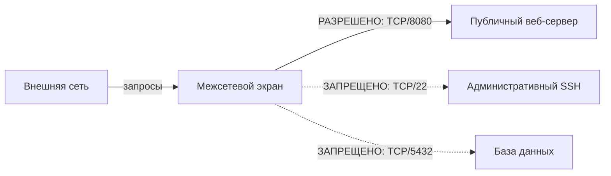
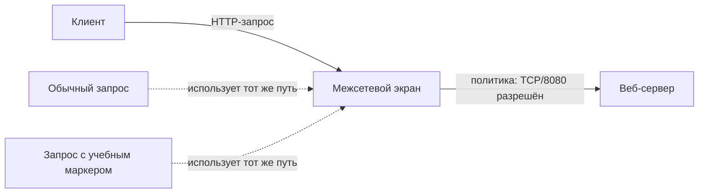
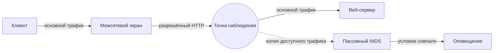
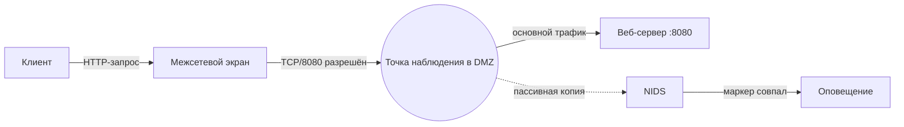

# Глава 1. Что такое IDS/IPS и зачем они нужны

Информационная система уже защищена межсетевым экраном. Из внешней сети разрешён доступ только к публичному веб-сервису, остальные ненужные взаимодействия запрещены.

Но остаётся ключевой вопрос: <strong>что произойдёт, если нежелательная активность будет использовать именно тот путь, который системе необходимо оставить доступным?</strong>

<strong>После изучения главы студент должен уметь:</strong>

объяснить назначение IDS и IPS; отличить обнаружение от предотвращения; объяснить, почему межсетевой экран и IDS/IPS решают разные защитные задачи; на базовом уровне отличить межсетевой экран веб-приложений (WAF) от IDS/IPS; объяснить, почему оповещение само по себе ещё не означает компрометацию.

---

## 1. Сначала обычная информационная система

СХЕМА 1 · БАЗОВЫЙ СЕТЕВОЙ КОНТУР

Сплошная стрелка показывает разрешённый путь к публичному сервису. Пунктирные стрелки показывают взаимодействия, которые политика доступа не должна пропускать.

Веб-сервер должен быть доступен пользователям. Полностью запретить обращения к нему нельзя, иначе сервис перестанет выполнять свою функцию.

  
Внешняя сеть → веб-сервер<strong>РАЗРЕШИТЬ</strong>

  
Внешняя сеть → база данных<strong>ЗАПРЕТИТЬ</strong>

  
Внешняя сеть → административный SSH<strong>ЗАПРЕТИТЬ</strong>

Если взаимодействие не требуется для работы системы, его следует ограничить политикой доступа, а не оставлять открытым в надежде, что IDS обнаружит каждую попытку атаки.

Но разрешённый веб-сервис всё равно остаётся доступным для взаимодействия.

  РАЗРЕШЕНО
  ≠
  БЕЗОПАСНО
  
Разрешённое взаимодействие не обязательно является безопасным взаимодействием.

---

## 2. Какую задачу решает межсетевой экран

**Межсетевой экран (firewall)** контролирует прохождение сетевого трафика в соответствии с установленной политикой безопасности.

Важно не сводить его работу к формуле `межсетевой экран = только IP + порт`. Простейшие механизмы фильтрации действительно могут принимать решения на основании адресов, протокола, портов и направления. Межсетевой экран с контролем состояния (stateful inspection) также учитывает состояние соединения, поэтому ответный трафик установленной допустимой сессии рассматривается в контексте этого соединения.

Современные межсетевые экраны следующего поколения (NGFW) могут учитывать приложения, пользователей и свойства прикладных протоколов. Поэтому противопоставление `межсетевой экран = L3/L4`, а `IDS = L7` некорректно.

  <article class="control-question firewall-question">
    МЕЖСЕТЕВОЙ ЭКРАН
    <strong>Допустимо ли данное сетевое взаимодействие?</strong>
    
Решение принимается в контексте политики доступа.

  </article>
  <article class="control-question detection-question">
    IDS/IPS
    <strong>Есть ли в наблюдаемой активности признаки, требующие обнаружения?</strong>
    
Это уже другая защитная задача.

  </article>

Например, `Внешняя сеть → база данных:5432` может быть запрещено вообще, независимо от того, содержит ли соединение атаку. А обращение к публичному веб-сервису может быть разрешено, потому что без него система не выполняет свою функцию.

---

## 3. Где возникает задача обнаружения

!!! note "Учебная модель / синтетический сценарий"
    В этой главе намеренно используется обычный HTTP без TLS. Мы изолируем один механизм: различие между контролем допустимости взаимодействия и обнаружением. Ограничения видимости зашифрованного трафика будут изучаться позднее.

СХЕМА 2 · РАЗРЕШЁННЫЙ WEB-ПУТЬ

Политика разрешает сам сетевой путь к сервису. Смысл конкретного HTTP-запроса — отдельный вопрос, который требует наблюдения и анализа.

  <article class="example-card normal-example">
    ШТАТНЫЙ ЗАПРОС
    <pre><code>GET /lab-test HTTP/1.1
Host: web.lab</code></pre>
    
Запрос использует разрешённый web-сервис.

  </article>
  <article class="example-card signal-example">
    ЗАПРОС С УЧЕБНЫМ МАРКЕРОМ
    <pre><code>GET /admin-test?marker=ATTACK-LAB HTTP/1.1
Host: web.lab</code></pre>
    
Сетевой путь тот же, но наблюдаемая активность отличается.

  </article>

С точки зрения рассмотренной сетевой политики оба запроса используют разрешённое взаимодействие с опубликованным сервисом.

Мы не предполагаем, что межсетевой экран умеет только проверять номер порта. В конкретной инфраструктуре он может обладать дополнительными функциями инспекции. Но сам факт разрешённости взаимодействия не отвечает на другой вопрос:

> **Содержит ли наблюдаемая активность признаки, которые система безопасности должна обнаружить?**

Это уже задача **обнаружения вторжений**.

---

## 4. Что такое IDS

**Система обнаружения вторжений (Intrusion Detection System, IDS)** автоматизирует задачу обнаружения.

В общем виде IDS получает доступные ей сведения о происходящей активности и анализирует их на наличие заданных признаков возможных инцидентов или иной активности, значимой для безопасности.

  
1<strong>Активность</strong><small>в системе или сети</small>

  <b>→</b>
  
2<strong>Доступные данные</strong><small>то, что реально получает IDS</small>

  <b>→</b>
  
3<strong>Анализ</strong><small>применение логики обнаружения</small>

  <b>→</b>
  
4<strong>Результат</strong><small>например, оповещение</small>

Ключевое выражение — **«доступные системе данные»**. IDS не обладает абсолютной наблюдаемостью. Что именно она сможет получить, зависит от типа системы, места размещения, способа получения данных, шифрования и конфигурации.

---

## 5. Событие и оповещение — не одно и то же

  <article class="concept-card">
    СОБЫТИЕ
    <h3>Зафиксированное событие</h3>
    
Например: соединение установлено, DNS-запрос получен, процесс запущен, файл изменён.

  </article>
  <article class="concept-card accent-card">
    ОПОВЕЩЕНИЕ
    <h3>Выделенный результат обнаружения</h3>
    
Наблюдаемая активность удовлетворила условию, которое требует внимания или дальнейшей обработки.

  </article>

В англоязычной документации могут встречаться термины `event`, `alert`, `finding` и `detection`. В курсе основными остаются русские термины: **событие**, **оповещение**, **результат обнаружения**. Для первой главы достаточно различать факт наблюдения и результат работы детектора.

---

## 6. Что означает оповещение

Добавим к стенду пассивный сетевой сенсор.

СХЕМА 3 · ПАССИВНЫЙ NIDS НЕ НАХОДИТСЯ В ТРАНЗИТНОМ ПУТИ

Сплошные стрелки — физический путь основного трафика. Пунктирная стрелка — копия данных в пассивный NIDS. Оповещение является результатом анализа копии и не находится в пути передачи.

Пусть детектор ищет маркер `ATTACK-LAB` в определённом поле HTTP-запроса. При получении запроса с этим маркером система формирует оповещение.

  РЕЗУЛЬТАТ ОБНАРУЖЕНИЯ
  <strong>LAB1: обнаружен учебный HTTP-маркер</strong>
  <code>sid: 1000001 · marker: ATTACK-LAB</code>

  <article class="evidence-supported">
    ПОДТВЕРЖДЕНО
    
В анализируемом системой представлении запроса присутствовал признак, удовлетворивший условию детектора.

  </article>
  <article class="evidence-not-proven">
    НЕ ПОДТВЕРЖДЕНО
    
Что приложение уязвимо, эксплуатация была успешной, атакующий получил доступ или сервер был скомпрометирован.

  </article>

  ОПОВЕЩЕНИЕ
  ≠
  КОМПРОМЕТАЦИЯ
  
Оповещение сообщает о результате обнаружения, но само по себе не доказывает успешный взлом.

---

## 7. Что такое IPS

**Система предотвращения вторжений (Intrusion Prevention System, IPS)** Она выполняет обнаружение и дополнительно может инициировать действие, направленное на предотвращение или прекращение обнаруженной нежелательной активности.

  <article>
    IDS
    <strong>Обнаружить</strong>
    
Получить данные, применить логику обнаружения, сформировать результат.

  </article>
  
→

  <article class="ips-card">
    IPS
    <strong>Обнаружить + воздействовать</strong>
    
После обнаружения система может инициировать действие по предотвращению.

  </article>

Не следует запоминать `IDS = сбоку`, `IPS = inline`. Это смешивает две характеристики: **как система получает данные** и **может ли она инициировать воздействие**.

Система, включённая в разрыв, может работать только в режиме оповещения и ничего не блокировать. А пассивный детектор в некоторых архитектурах может инициировать действие через другой механизм управления, например API межсетевого экрана.

  ОБНАРУЖЕНИЕ
  ≠
  ПРЕДОТВРАЩЕНИЕ
  
Обнаружение и воздействие — разные операции и имеют разную цену ошибки.

---

## 8. Почему ошибка предотвращения имеет другую цену

  <article>
    ОПОВЕЩЕНИЕ-ONLY
    <strong>Ошибочное решение</strong>
    
Может создать лишнее оповещение и потребовать дополнительной проверки.

  </article>
  <article class="impact-active">
    AUTOMATIC ПРЕДОТВРАЩЕНИЕ
    <strong>Ошибочное решение</strong>
    
Может отбросить легитимный трафик, прервать сессию или нарушить бизнес-процесс.

  </article>

Это не означает, что IPS «опасен». Вывод другой:

> **Автоматическое предотвращение требует более строгой проверки логики обнаружения и понимания последствий ошибочного воздействия.**

FP/FN и методы оценки качества появятся позднее, когда у студента уже будет базовая модель IDS/IPS.

---

## 9. Межсетевой экран и IDS/IPS не заменяют друг друга

Если внешний SSH-доступ не требуется, правильное решение — запретить его политикой доступа:

<code>Внешняя сеть → сервер:22</code><strong>ЗАПРЕТИТЬ</strong>ненужный путь закрывается

IDS/IPS не должна подменять возможность устранить ненужный сетевой путь.

Но если публичный сервис должен обслуживать клиентов, некоторый набор взаимодействий необходимо разрешить. После этого остаётся задача наблюдения за активностью, значимой для безопасности внутри доступной системе области.

  МЕЖСЕТЕВОЙ ЭКРАН
  ≠
  IDS/IPS
  
Это разные защитные функции, даже когда они реализованы внутри одного продукта.

---

## 10. Функция и продукт — разные вещи

Одна платформа NGFW может совмещать несколько функций.

  ЕДИНАЯ ПЛАТФОРМА NGFW
  
Политика межсетевого экрана

  
IPS

  
Распознавание приложений

  
URL filtering

  
Logging

Нужно отличать **физическое устройство или программный продукт** от **защитной функции**. Если IPS встроена в NGFW, функция предотвращения вторжений никуда не исчезла — она реализована внутри той же платформы.

---

## 11. А где здесь межсетевой экран веб-приложений (WAF)

**Межсетевой экран веб-приложений (Web Application Firewall, WAF)** — специализированное средство защиты веб-приложений и связанного с ними веб-трафика.

  <article>
    WAF
    <strong>Трафик веб-приложения</strong>
    
Работает с доступными ему элементами HTTP-транзакций и применяет политику защиты веб-приложения.

  </article>
  <article>
    IDS/IPS
    <strong>Более широкий класс</strong>
    
Сетевые, хостовые и беспроводные IDS/IPS используют разные источники данных и не ограничиваются веб-трафиком.

  </article>

Возможности могут пересекаться. Например, WAF и NIDS могут одновременно анализировать один HTTP-запрос и обнаружить в нём один и тот же интересующий признак. Это не делает их одним и тем же классом средств.

---

## 12. Соберём пример целиком

СХЕМА 4 · ОТ РАЗРЕШЁННОГО ТРАФИКА К ОПОВЕЩЕНИЮ

Сплошной путь показывает разрешённое взаимодействие. Пунктир показывает копию данных в NIDS. Межсетевой экран применяет политику доступа, а NIDS — логику обнаружения.

Клиент отправляет запрос с `ATTACK-LAB`. Межсетевой экран применяет политику доступа и допускает взаимодействие с опубликованным сервисом. NIDS получает доступную ему копию активности. Условие обнаружения совпадает с признаком, и система формирует оповещение.

  <article class="evidence-supported">МОЖНО СКАЗАТЬ
Детектор получил достаточное представление запроса и его условие выполнилось.
</article>
  <article class="evidence-not-proven">ЭТО ОПОВЕЩЕНИЕ НЕ ДОКАЗЫВАЕТ
Кто именно отправил запрос, уязвимо ли приложение, был ли достигнут нежелательный результат и произошла ли компрометация.
</article>

---

## 13. Четыре идеи первой главы

  <article class="axiom-card">01<strong>РАЗРЕШЕНО ≠ БЕЗОПАСНО</strong>
Политика разрешила путь, но не доказала безопасность активности.
</article>
  <article class="axiom-card">02<strong>МЕЖСЕТЕВОЙ ЭКРАН ≠ IDS/IPS</strong>
Разные защитные функции могут находиться в одном продукте.
</article>
  <article class="axiom-card">03<strong>ОБНАРУЖЕНИЕ ≠ ПРЕДОТВРАЩЕНИЕ</strong>
Обнаружить и воздействовать — разные действия.
</article>
  <article class="axiom-card">04<strong>ОПОВЕЩЕНИЕ ≠ КОМПРОМЕТАЦИЯ</strong>
Срабатывание детектора не равно доказанному взлому.
</article>

Если эти четыре отношения понятны, первая глава выполнила свою задачу.

---

## 14. Проверка понимания

!!! info "Формат проверки"
    Это **самопроверка после лекции**, а не отдельная практическая работа. Баллы за неё не выставляются. Оценочная часть модуля — воспроизводимая лабораторная работа и короткая защита подтверждающих материалов.

  
<strong>Публичный веб-сервис разрешён политикой межсетевого экрана. Какой вывод корректен?</strong>

  <button data-choice="a">A. Любая активность внутри разрешённого соединения считается безопасной</button>
  <button data-choice="b" data-correct="true">B. Политика допустила взаимодействие, но безопасность конкретной активности требует отдельного анализа</button>
  <button data-choice="c">C. Любой запрос к разрешённому порту автоматически является доверенным</button>
  <button data-choice="d">D. Наличие межсетевого экрана с контролем состояния исключает необходимость обнаружения</button>
  

  
<strong>NIDS сформировала оповещение по условию детектора. Что подтверждено этим фактом?</strong>

  <button data-choice="a">A. Сервер успешно скомпрометирован</button>
  <button data-choice="b">B. Уязвимость на сервере существует</button>
  <button data-choice="c" data-correct="true">C. Наблюдаемая активность удовлетворила заданному условию обнаружения</button>
  <button data-choice="d">D. Инцидент полностью расследован</button>
  

  
<strong>На сервере открыт ненужный внешний SSH. Какое действие должно быть первым?</strong>

  <button data-choice="a">A. Добавить больше IDS signatures</button>
  <button data-choice="b" data-correct="true">B. Ограничить ненужный путь политикой доступа</button>
  <button data-choice="c">C. Оставить IPS только в режиме оповещения</button>
  <button data-choice="d">D. Перенести NIDS ближе к серверу</button>
  

  
<strong>NGFW содержит функцию межсетевого экрана и механизм IPS. Что это означает?</strong>

  <button data-choice="a">A. Межсетевой экран и IPS стали одной и той же функцией</button>
  <button data-choice="b" data-correct="true">B. Одна физическая платформа реализует несколько различных защитных функций</button>
  <button data-choice="c">C. IPS больше не относится к IDPS</button>
  <button data-choice="d">D. Любой разрешённый трафик автоматически проходит IPS без анализа</button>
  

  
<strong>Система, включённая в разрыв, настроена только на оповещение и ничего не блокирует. Какой вывод корректен?</strong>

  <button data-choice="a">A. Само размещение в разрыве автоматически превращает любое оповещение в блокирование</button>
  <button data-choice="b">B. Такая система не может выполнять обнаружение</button>
  <button data-choice="c" data-correct="true">C. Способ размещения и функция предотвращения — разные характеристики</button>
  <button data-choice="d">D. Система в разрыве обязательно является межсетевым экраном</button>
  

  
<strong>WAF защищает публичное веб-приложение. Что из этого НЕ следует?</strong>

  <button data-choice="a">A. WAF может анализировать доступные ему веб-транзакции</button>
  <button data-choice="b">B. Его возможности могут пересекаться с NIDS при анализе HTTP</button>
  <button data-choice="c" data-correct="true">C. WAF обеспечивает полную наблюдаемость всей сетевой и хостовой инфраструктуры</button>
  <button data-choice="d">D. WAF специализирован на web-приложениях</button>
  

  ОЦЕНИВАЕТСЯ НЕ ТЕСТ
  <strong>Доказательство в лаборатории + короткая защита</strong>
  
На защите студент должен показать собственный трафик и подтверждающие материалы и объяснить, почему наблюдаемое оповещение не равно компрометации. Это сложнее подменить готовым ответом из ИИ.

<strong>Перед первой лабораторной:</strong> подготовьте <a href="../../labs/environment/">двухмашинный стенд</a> и пройдите <a href="../../labs/orientation/">Практикум 0 — знакомство с рабочей IDPS</a>. Это вводная подготовка, а не оценочная лабораторная работа.

<strong>Следующая теория:</strong> затем переходите к <a href="../02-classification/">Главе 2 — «Какие виды IDS/IPS существуют»</a>. После неё начинается первый контролируемый сетевой эксперимент.

---

## Источники и статус утверждений

- NIST SP 800-94, *Guide to Intrusion Detection and Prevention Systems (IDPS)* — фундаментальные определения IDS/IPS и функций обнаружения/предотвращения. Документ используется как исторический фундаментальный источник, а не как описание современных продуктов.
- NIST SP 800-41 Rev.1, *Guidelines on Firewalls and Firewall Policy* — базовая роль межсетевого экрана и фильтрации с учётом состояния.
- Учебный HTTP-сценарий `ATTACK-LAB` — **SYNTHETIC**, создан специально для курса и не является реальным exploit/case.

Актуальные ссылки собраны в разделе [«Источники курса»](../../resources/sources/).
