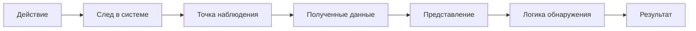

# Контекст угроз: от события безопасности к наблюдаемому следу

<div class="chapter-lead">
<p>IDS/IPS не существует отдельно от угроз, уязвимостей и защищаемых активов. Чтобы корректно интерпретировать оповещение, сначала нужно понимать, <strong>что именно может быть атаковано, какое условие делает атаку возможной и какой след действие оставляет в системе</strong>.</p>
<p>Этот модуль даёт базовый контекст, без которого трудно корректно рассуждать об обнаружении. Его задача — не перечислить все виды угроз, а показать, как перейти от общего описания нежелательного сценария к данным, которые реально может получить IDPS.</p>
</div>

<div class="chapter-outcomes">
<strong>После изучения модуля студент должен уметь:</strong>
<p>различать актив, угрозу, уязвимость, атаку и риск; объяснить цели конфиденциальности, целостности и доступности; привести примеры распространённых классов киберугроз и интернет-преступности; связать действие нарушителя с возможным сетевым, хостовым или прикладным следом; объяснить, почему IDPS наблюдает не «угрозу вообще», а доступные ей данные.</p>
</div>

---

## 1. Что именно мы защищаем

В информационной безопасности обычно защищают **активы**: данные, учётные записи, сервисы, вычислительные ресурсы, сетевую инфраструктуру, программное обеспечение и другие элементы, имеющие ценность для организации или пользователя.

Три базовые цели защиты удобно описывать через свойства информации и системы:

<div class="idps-grid idps-grid--3">
  <article class="idps-card idps-card--primary"><span class="idps-card__eyebrow">КОНФИДЕНЦИАЛЬНОСТЬ</span><strong class="idps-card__title">Кто может получить данные?</strong><p>Несанкционированное раскрытие информации нарушает конфиденциальность.</p></article>
  <article class="idps-card idps-card--sensor"><span class="idps-card__eyebrow">ЦЕЛОСТНОСТЬ</span><strong class="idps-card__title">Можно ли доверять содержимому?</strong><p>Несанкционированное изменение данных или состояния системы нарушает целостность.</p></article>
  <article class="idps-card idps-card--warning"><span class="idps-card__eyebrow">ДОСТУПНОСТЬ</span><strong class="idps-card__title">Можно ли воспользоваться ресурсом?</strong><p>Отказ в обслуживании или уничтожение критичного ресурса нарушают доступность.</p></article>
</div>

Эти свойства не являются классификацией IDS/IPS. Они отвечают на другой вопрос: **какое защищаемое свойство может пострадать**.

---

## 2. Угроза, уязвимость, атака и риск — разные понятия

Удобнее не строить линейную цепочку «угроза → уязвимость → риск», а разделить сам сценарий и его оценку:

```text
защищаемый актив
      │
      ├── сценарий угрозы / источник угрозы
      │
      └── уязвимость, слабость или небезопасное условие
                    │
                    ↓
         возможное нежелательное событие
                    │
                    ↓
          потенциальное воздействие

Риск оценивается для такого сценария с учётом
правдоподобия/вероятности его реализации и последствий.
```

**Угроза** — обстоятельство или событие, способное неблагоприятно повлиять на активы или деятельность. **Уязвимость** — слабость или условие, которое источник угрозы может эксплуатировать либо которое может быть случайно активировано. **Атака** — намеренное действие или последовательность действий, направленных на достижение нежелательного результата. **Риск** — оценка того, насколько организация подвержена потенциальному событию; обычно при этом учитываются возможное воздействие и вероятность/правдоподобие его реализации.

!!! warning "Не превращайте модель в формулу"
    Риск существует до того, как событие действительно произошло: это оценка потенциального сценария, а не финальный шаг после последствия. В реальной практике используются разные методики оценки риска. IDS/IPS не «измеряет риск» автоматически только потому, что сформировала оповещение.

<div class="idps-equation">
  <div class="idps-equation__expression"><span>ALERT</span><b>≠</b><span>РИСК</span></div>
  <p>Оповещение подтверждает выполнение конкретного условия детектора. Для оценки риска нужны контекст актива, сценарий угрозы, вероятность/условия реализации и последствия.</p>
</div>

---

## 3. Где здесь появляется IDPS

IDPS не получает абстрактный объект «атака» в готовом виде. Она получает **следы**, которые доступны её источнику данных и точке наблюдения.

<div class="idps-figure" markdown="1">
<div class="idps-figure__label">СХЕМА · ОТ ДЕЙСТВИЯ К ДАННЫМ ДЕТЕКТОРА</div>



<div class="idps-figure__caption">Курс будет постоянно возвращаться к этой цепочке. Между реальным действием и результатом IDPS есть несколько этапов, на каждом из которых возможны ограничения и потери наблюдаемости.</div>
</div>

Например, подбор паролей к веб-сервису может оставить серию HTTP-запросов, записи об ошибках аутентификации и события учётной записи. Сетевой сенсор, журнал приложения и хостовый агент получают **разные представления одного эпизода**. Ни одно из них автоматически не становится полной истиной о происходящем.

---

## 4. Типы угроз полезны только тогда, когда мы понимаем их следы

В реальной инфраструктуре специалист сталкивается с вредоносным ПО, фишингом и социальной инженерией, сетевыми атаками, внутренними угрозами, облачными и IoT-сценариями. Для нашего курса полезнее сразу связать каждый класс с наблюдаемыми последствиями.

| Класс угрозы / сценария | Возможный наблюдаемый след | Какие источники могут помочь |
|---|---|---|
| Вредоносное ПО | сетевое соединение, запуск процесса, изменение файла, необычная последовательность действий | NIDS/NDR, HIDS/EDR, журналы ОС и приложений |
| Фишинг / кража учётных данных | переход на ресурс, последующая аутентификация, нетипичный вход | почтовая телеметрия, прокси-сервер/DNS, приложение, журналы аутентификации |
| Сканирование и разведка | множество обращений к адресам/портам, необычная последовательность запросов | сетевой сенсор, межсетевой экран, сервисные журналы |
| DoS/DDoS | рост числа запросов/потоков, перегрузка ресурса, ошибки доступности | сетевой сенсор, балансировщик, приложение, метрики инфраструктуры |
| Несанкционированный доступ | успешная/неуспешная аутентификация, изменение привилегий, доступ к необычному ресурсу | журналы аутентификации, ОС, приложение, сетевой источник |
| Внутренняя угроза | действия легитимной учётной записи, массовый доступ/копирование, изменение конфигурации | журналы учётных записей, EDR, журналы приложений и ОС, сетевые источники |

Таблица не является универсальной картой «атака → один правильный сенсор». Она показывает главное: **один сценарий может оставлять несколько следов, а один источник видеть только часть эпизода**.

---

## 5. Киберпреступность и интернет-преступность: контекст действий, а не метод обнаружения

Компьютерные и интернет-преступления могут включать несанкционированный доступ, кражу или уничтожение данных, интернет-мошенничество, фишинг, распространение вредоносного ПО, кибершпионаж, DDoS и другие формы противоправной деятельности. Для общего контекста полезно различать также кибербуллинг и онлайн-угрозы, нарушения интеллектуальной собственности и финансовые преступления.

Для курса по IDPS важно сразу разделить два уровня:

```text
правовая / социальная квалификация действия
                    ≠
технический наблюдаемый след
```

IDPS работает со вторым уровнем. Она может предоставить технические факты для анализа, но не определяет автоматически юридическую квалификацию события, мотив нарушителя или состав правонарушения.

| Форма / сценарий | Что может происходить технически | Какие следы потенциально доступны |
|---|---|---|
| Несанкционированный доступ | подбор учётных данных, использование украденной учётной записи, обход контроля доступа | события аутентификации, сетевые соединения, журналы приложения и ОС |
| Фишинг, вишинг, смишинг | получение учётных данных через обман пользователя | почтовая/веб-телеметрия, DNS/прокси, последующие события входа; сам социальный контакт может быть вне видимости IDPS |
| Интернет-мошенничество | взаимодействие с поддельным ресурсом, перевод средств, использование похищенных данных | веб/DNS-телеметрия, журналы приложения и аутентификации; бизнес-факт мошенничества требует дополнительного контекста |
| Кибершпионаж | несанкционированный сбор и передача информации | доступ к файлам/данным, процессы, сетевые соединения, события приложений |
| Вредоносное ПО | запуск кода, изменение файлов, сетевые обращения, закрепление | хостовые события, файлы, процессы, сетевые признаки, журналы защитных средств |
| DDoS | массовая или распределённая нагрузка на ресурс | рост числа потоков/запросов, ошибки доступности, инфраструктурные метрики |
| Кибербуллинг и онлайн-угрозы | сообщения, публикации, действия пользователей на цифровой платформе | журналы конкретной платформы, если они доступны; сетевой IDPS обычно не содержит достаточной семантики для правовой оценки |
| Нарушение интеллектуальной собственности | распространение или получение защищаемого контента | сетевые и прикладные факты передачи могут быть наблюдаемы, но сам факт нарушения прав требует внешнего контекста |
| Финансовое / криптовалютное мошенничество | использование платёжных, учётных или криптовалютных механизмов | журналы бизнес-систем, аутентификация, транзакционные и сетевые данные; IDPS не заменяет антифрод |

В учебной литературе также удобно различать **источник/субъект действий**: внешний нарушитель, инсайдер, организованная группа и другие участники. Но по одному техническому оповещению нельзя надёжно вывести личность, мотивацию или организационную принадлежность субъекта.

Рассмотрим последовательность, которая непосредственно связана с задачами нашего курса:

```text
фишинговое сообщение
      ↓
кража учётных данных
      ↓
вход под легитимной учётной записью
      ↓
доступ к внутреннему сервису
      ↓
копирование данных
```

Для специалиста по IDPS полезны вопросы:

1. Какой технический факт должен произойти на каждом этапе?
2. Какой след он оставит?
3. Где этот след можно наблюдать?
4. Какой источник данных способен его представить?
5. Какое условие обнаружения можно проверить?
6. Какой вывод будет обоснован полученными подтверждающими данными, а какой — нет?

Так общий контекст киберпреступности превращается в инженерную задачу наблюдения и обнаружения, не подменяя право, антифрод, модерацию платформ или расследование.

---

## 6. Проверьте, что вы поняли

После этого модуля студент должен без заучивания списка уметь объяснить:

- три базовые цели защиты: конфиденциальность, целостность, доступность;
- различие между угрозой, уязвимостью, атакой и риском;
- несколько классов современных киберугроз и форм интернет-преступности;
- почему технический сценарий может оставлять сетевые, хостовые и прикладные следы;
- почему `alert` не является автоматическим доказательством атаки, преступления, компрометации или уровня риска.

<div class="evidence-boundary">
  <article class="evidence-supported"><span>КУРС УЧИТ</span><strong>Связывать угрозу с наблюдаемым поведением</strong><p>От сценария — к следу, источнику данных, представлению данных и проверяемому выводу.</p></article>
  <article class="evidence-not-proven"><span>КУРС НЕ ПОДМЕНЯЕТ</span><strong>Право, управление рисками и отдельные дисциплины по тестированию безопасности</strong><p>Эти области дают контекст, но предмет курса остаётся IDS/IPS и доказательное обнаружение.</p></article>
</div>

---

<div class="next-step">
<strong>Дальше:</strong> подготовьте <a href="../../labs/environment/">лабораторную среду</a> и пройдите <a href="../../labs/orientation/">Практикум 0</a>. После этого переходите к <a href="../02-classification/">Главе 2 — «Какие виды IDS/IPS существуют»</a>.
</div>
