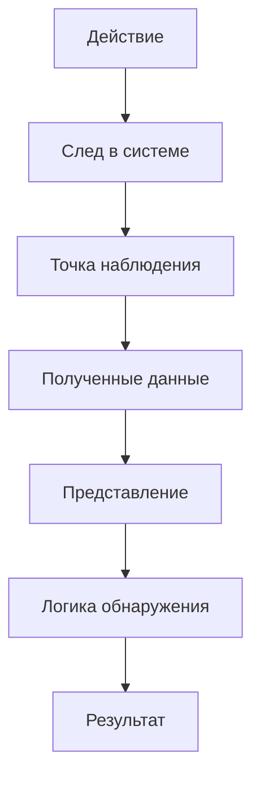

# Контекст кибербезопасности: угрозы, риск и наблюдаемые следы

<div class="chapter-lead">
<p>IDS/IPS не существует отдельно от защищаемых активов, угроз, уязвимостей и последствий. Чтобы корректно интерпретировать оповещение, нужно понимать <strong>что защищается, от какого сценария, почему он возможен и какой технический след он способен оставить</strong>.</p>
<p>Этот модуль связывает базовую кибербезопасность с задачами обнаружения: от целей защиты и типов угроз — к оценке риска, мерам противодействия, формам киберпреступности и данным, которые реально может получить IDPS.</p>
</div>

<div class="chapter-outcomes">
<strong>После изучения модуля студент должен уметь:</strong>
<p>объяснить конфиденциальность, целостность и доступность; различать актив, источник угрозы, угрозу, уязвимость, атаку, последствие и риск; классифицировать типовые технические, организационные и физические слабости; разобрать простой сценарий риска и предложить меры его обработки; назвать основные классы киберугроз и формы интернет-преступности; различать техническую фиксацию события и его правовую/социальную квалификацию; связать действие с сетевым, хостовым или прикладным следом.</p>
</div>

---

## 1. Что такое кибербезопасность и что именно мы защищаем

В рамках этого курса **кибербезопасность** рассматривается как совокупность организационных и технических мер, направленных на защиту информационных систем, сетей, сервисов и данных от нежелательных событий и действий. Защищаются не абстрактные «компьютеры вообще», а конкретные **активы**: данные, учётные записи, сервисы, вычислительные ресурсы, сетевые устройства, программное обеспечение, конфигурация и другие элементы, имеющие ценность для организации или пользователя.

Три базовые цели защиты удобно описывать через свойства информации и системы:

<div class="idps-grid idps-grid--3">
  <article class="idps-card idps-card--primary"><span class="idps-card__eyebrow">КОНФИДЕНЦИАЛЬНОСТЬ</span><strong class="idps-card__title">Кто может получить данные?</strong><p>Несанкционированное раскрытие информации нарушает конфиденциальность.</p></article>
  <article class="idps-card idps-card--sensor"><span class="idps-card__eyebrow">ЦЕЛОСТНОСТЬ</span><strong class="idps-card__title">Можно ли доверять содержимому?</strong><p>Несанкционированное изменение данных, конфигурации или состояния системы нарушает целостность.</p></article>
  <article class="idps-card idps-card--warning"><span class="idps-card__eyebrow">ДОСТУПНОСТЬ</span><strong class="idps-card__title">Можно ли воспользоваться ресурсом?</strong><p>Отказ в обслуживании, уничтожение ресурса или критический сбой нарушают доступность.</p></article>
</div>

Эти свойства не являются классификацией IDS/IPS. Они отвечают на другой вопрос: **какое защищаемое свойство может пострадать**.

### Защита не сводится к одному средству

Один и тот же сценарий может требовать нескольких мер. Типовые меры включают:

- управление доступом и многофакторную аутентификацию;
- безопасную конфигурацию, обновления и исправления;
- сегментацию и межсетевое экранирование;
- шифрование данных при хранении и передаче;
- мониторинг, IDS/IPS и анализ журналов;
- резервное копирование и восстановление;
- обучение пользователей и организационные правила.

<div class="principle-box">
<strong>ЗАЩИТА ≠ ОДНА «КОРОБКА»</strong>
<p>Меры предотвращения, обнаружения, реагирования и восстановления работают совместно. IDPS отвечает только за часть этой системы и не заменяет управление доступом, патчи, резервное копирование или обучение сотрудников.</p>
</div>

---

## 2. Угроза, уязвимость, атака и риск — разные понятия

Удобнее не строить линейную цепочку «угроза → уязвимость → риск», а разделить сам сценарий и его оценку:

```text
защищаемый актив
      │
      ├── источник / сценарий угрозы
      │
      └── уязвимость, слабость или небезопасное условие
                    │
                    ↓
         возможное нежелательное событие
                    │
                    ↓
          потенциальное воздействие

Риск оценивается для такого сценария с учётом
правдоподобия/вероятности реализации и последствий.
```

**Источник угрозы** — субъект, обстоятельство или явление, способное инициировать нежелательный сценарий. **Угроза** — потенциальная причина нежелательного события. **Уязвимость** — слабость или условие, которое может быть использовано либо случайно активировано. **Атака** — намеренное действие или последовательность действий, направленных на достижение нежелательного результата. **Последствие** — влияние события на актив, процесс или организацию. **Риск** — оценка подверженности потенциальному событию с учётом условий его реализации и возможного воздействия.

!!! warning "Не превращайте модель в формулу"
    Риск существует до того, как событие действительно произошло: это оценка потенциального сценария, а не финальный шаг после последствия. В реальной практике используются разные методики оценки риска. IDS/IPS не «измеряет риск» автоматически только потому, что сформировала оповещение.

### Какие бывают уязвимости и слабости

Для первичного анализа полезно различать как минимум три группы:

| Группа | Что это означает | Примеры |
|---|---|---|
| Технические | слабость в программном обеспечении, оборудовании или конфигурации | уязвимый сервис, ошибка аутентификации, небезопасная конфигурация, отсутствие исправления |
| Организационные | слабость процесса, правил или управления | избыточные права, отсутствие контроля изменений, слабая политика паролей, недостаточное обучение |
| Физические | слабость, связанная с физическим доступом и средой | неограниченный доступ к серверной, незащищённый носитель, отсутствие контроля доступа к оборудованию |

Граница между категориями не всегда идеальна. Например, слабый пароль может быть одновременно технической характеристикой учётной записи и следствием организационной политики.

### Как выглядит минимальный анализ риска

Рассмотрим веб-сервис с административной учётной записью без MFA:

```text
актив
→ административный доступ к сервису

источник / сценарий угрозы
→ внешний нарушитель получает пароль

слабость
→ отсутствует MFA

возможное действие
→ вход под скомпрометированной учётной записью

последствие
→ изменение конфигурации / доступ к данным

оценка риска
→ зависит от вероятности сценария и тяжести воздействия
```

После этого выбираются меры обработки: уменьшить вероятность, уменьшить воздействие, исключить сценарий либо осознанно принять остаточный риск в допустимых рамках. Для данного примера возможны MFA, ограничение административного доступа, мониторинг аутентификации и резервное копирование конфигурации.

<div class="idps-equation">
  <div class="idps-equation__expression"><span>ALERT</span><b>≠</b><span>РИСК</span></div>
  <p>Оповещение подтверждает выполнение конкретного условия детектора. Для оценки риска нужны контекст актива, сценарий угрозы, условия реализации и последствия.</p>
</div>

---

## 3. От сценария угрозы к наблюдаемому следу

IDPS не получает абстрактный объект «атака» в готовом виде. Она получает **следы**, которые доступны её источнику данных и точке наблюдения.

<div class="idps-figure" markdown="1">
<div class="idps-figure__label">СХЕМА · ОТ ДЕЙСТВИЯ К ДАННЫМ ДЕТЕКТОРА</div>



<div class="idps-figure__caption">Курс будет постоянно возвращаться к этой цепочке. Между реальным действием и результатом IDPS есть несколько этапов, на каждом из которых возможны ограничения и потери наблюдаемости.</div>
</div>

Например, подбор паролей к веб-сервису может оставить серию HTTP-запросов, записи об ошибках аутентификации и события учётной записи. Сетевой сенсор, журнал приложения и хостовый агент получают **разные представления одного эпизода**. Ни одно из них автоматически не становится полной истиной о происходящем.

---

## 4. Основные классы угроз и атак

Для базового анализа полезно различать не только названия атак, но и **какое свойство они затрагивают, какие слабости используют и какие следы оставляют**.

| Класс угрозы / сценария | Что происходит | Возможный наблюдаемый след | Какие меры могут снижать риск |
|---|---|---|---|
| Вредоносное ПО | запуск или распространение вредоносного кода | процесс, файл, сетевое соединение, изменение системы | обновления, защита конечных систем, ограничение привилегий, сегментация |
| Фишинг / социальная инженерия | пользователя убеждают раскрыть данные или выполнить действие | почтовые/веб-события, последующая аутентификация; сам разговор может быть вне телеметрии | обучение, MFA, фильтрация, контроль аутентификации |
| Подбор учётных данных | многократные попытки получить доступ | серия ошибок входа, множество запросов, блокировка учётной записи | MFA, rate limiting, блокировки, мониторинг |
| Перехват / подмена трафика | чтение или изменение сетевого обмена | изменения маршрута/сертификата/сеанса, необычные сетевые события — если источник способен их показать | шифрование, аутентификация узлов, защищённые протоколы |
| Инъекционные атаки | данные ввода интерпретируются как команда или запрос; типовой пример — SQL-инъекция | необычные HTTP/API-поля, ошибки приложения, SQL-журнал | безопасная разработка, параметризация, WAF как дополнительный слой |
| DoS / DDoS | ресурс перегружается запросами или потоками | рост частоты/объёма, исчерпание ресурсов, ошибки доступности | фильтрация, rate limiting, резервирование, anti-DDoS |
| Внутренняя угроза | легитимный пользователь злоупотребляет доступом или ошибается | массовый доступ, копирование, изменение конфигурации | наименьшие привилегии, аудит, DLP/EDR, разделение обязанностей |
| Облачный сценарий | ошибки доступа, секретов, конфигурации или внешних зависимостей | облачные audit logs, события IAM/API, сетевые и прикладные логи | IAM, MFA, безопасная конфигурация, журналирование, шифрование |
| IoT-сценарий | слабозащищённое устройство используется для доступа или ботнета | новые соединения, необычный трафик, изменение поведения устройства | инвентаризация, сегментация, обновления, контроль доступа |

### Атака и нарушаемое свойство

Один сценарий может затрагивать несколько свойств сразу. Но для первичного объяснения полезна такая карта:

- атаки на **конфиденциальность**: несанкционированное чтение, кража данных, шпионаж;
- атаки на **целостность**: изменение данных, конфигурации, маршрутизации или программного состояния; примером сетевой подмены может быть изменение DNS-ответа/направления разрешения имён;
- атаки на **доступность**: DoS/DDoS, уничтожение ресурсов, блокирование данных;
- атаки на **контроль доступа**: подбор паролей, кража учётных данных, обход аутентификации.

Не следует превращать эту карту в жёсткую классификацию: например, ransomware одновременно затрагивает доступность, целостность и иногда конфиденциальность.

---

## 5. Киберпреступность: объект, способ и мотивация

**Киберпреступность** в учебном контексте охватывает противоправные действия, где компьютер, сеть, данные или цифровой сервис выступают целью, средством или средой совершения действия. Для специалиста важно не смешивать техническую фиксацию события с юридической квалификацией.

```text
правовая / социальная квалификация действия
                    ≠
технический наблюдаемый след
```

IDPS может предоставить технические факты для анализа, но не определяет автоматически состав правонарушения, виновность, мотив или личность нарушителя.

### Что может быть объектом или результатом киберпреступления

- несанкционированный доступ к системе или данным;
- кража, изменение, уничтожение или блокирование информации;
- мошенническое получение денег или учётных данных;
- распространение вредоносного ПО;
- шпионаж и скрытый сбор информации;
- использование цифровых сервисов для угроз, шантажа или преследования;
- незаконное распространение защищаемого контента;
- злоупотребление платёжными и цифровыми финансовыми механизмами.

### Кто может выступать источником действий

В учебных сценариях встречаются внешний нарушитель, инсайдер и организованная группа. Мотивация может быть финансовой, личной, конкурентной, идеологической или иной. Но эти характеристики **не выводятся из одного alert**: для атрибуции требуются дополнительные независимые данные.

### Противодействие киберпреступности не только техническое

Комплексный ответ включает:

- технические меры: MFA, шифрование, межсетевое экранирование, IDPS, защита конечных систем;
- организационные меры: политики, управление доступом, обучение, процессы реагирования;
- расследование и сохранение доказательств;
- правовые процедуры и взаимодействие компетентных органов;
- международное сотрудничество, когда действия и инфраструктура находятся в разных юрисдикциях.

Для международного контекста часто рассматривается Будапештская конвенция о киберпреступности, а в трансграничных расследованиях могут участвовать национальные органы и международные структуры сотрудничества, включая INTERPOL и Europol. Требования к обработке и защите данных зависят от юрисдикции; например, GDPR регулирует защиту персональных данных в Европейском союзе, но не является «законом о киберпреступности». В этом курсе такие примеры нужны только для понимания правового и трансграничного контекста; курс не заменяет юридическую дисциплину.

---

## 6. Основные формы интернет-преступности и их технический след

| Форма / сценарий | Что происходит | Что потенциально можно наблюдать | Чего IDPS не доказывает |
|---|---|---|---|
| Фишинг, вишинг, смишинг | человека обманом склоняют раскрыть данные или выполнить действие | письмо/URL/DNS/прокси, последующий вход; голосовой контакт может отсутствовать в телеметрии | факт обмана конкретного человека только по сетевому alert |
| Интернет-мошенничество | используются поддельные ресурсы, объявления или похищенные данные | веб- и DNS-события, аутентификация, бизнес-журналы | сам факт финансового ущерба без транзакционного контекста |
| Кибершпионаж | скрыто собираются конфиденциальные сведения | доступ к файлам, процессы, сетевые соединения, выгрузка данных | организационную принадлежность и мотив субъекта |
| Кибербуллинг / онлайн-угрозы | сообщения и действия направлены против человека | журналы платформы, если они доступны | правовую квалификацию содержания из обычного сетевого трафика |
| Вредоносное ПО | устройство заражается или используется для дальнейших действий | файлы, процессы, persistence, сетевые соединения | что конкретный образец автоматически относится к определённому семейству без анализа |
| DDoS | множество источников или потоков создают отказ в обслуживании | частота, объём, число источников, ошибки сервиса, инфраструктурные метрики | мотивацию и заказчика атаки |
| Несанкционированный доступ | обходится контроль доступа или используются похищенные учётные данные | аутентификация, сессии, изменения прав, доступ к ресурсам | личность пользователя за учётной записью без дополнительных данных |
| Нарушение интеллектуальной собственности | защищаемый контент распространяется или используется без разрешения | факт передачи или публикации в конкретной системе | наличие/отсутствие прав на этот контент без внешнего контекста |
| Финансовые / криптовалютные преступления | похищаются средства либо используются мошеннические схемы | транзакции, аутентификация, устройства, сетевые и бизнес-события | мошеннический характер операции только по сетевой телеметрии |

Рассмотрим последовательность, которая непосредственно связана с задачами нашего курса:

```text
фишинговое сообщение
      ↓
кража учётных данных
      ↓
вход под легитимной учётной записью
      ↓
доступ к внутреннему сервису
      ↓
копирование данных
```

Для специалиста по IDPS полезны вопросы:

1. Какой технический факт должен произойти на каждом этапе?
2. Какой след он оставит?
3. Где этот след можно наблюдать?
4. Какой источник данных способен его представить?
5. Какое условие обнаружения можно проверить?
6. Какой вывод обоснован evidence, а какой требует внешнего контекста?

---

## 7. Мини-кейс: от угрозы до решения по защите

**Ситуация:** организация публикует веб-сервис. Пользователь получает фишинговое письмо, вводит пароль на поддельной странице, после чего злоумышленник входит в сервис и начинает массово выгружать данные.

Разложим сценарий:

| Вопрос | Ответ в кейсе |
|---|---|
| Актив | учётная запись и данные веб-сервиса |
| Угроза | несанкционированный доступ и кража данных |
| Слабость / условие | украденный пароль, отсутствие MFA, возможно избыточные права |
| Действие | вход и массовый доступ к данным |
| Воздействие | нарушение конфиденциальности, возможный финансовый/репутационный ущерб |
| Возможные меры | MFA, least privilege, мониторинг входов, rate/behavior controls, реагирование |
| Сетевой след | HTTP/TLS-сеансы, адреса, частота запросов — в зависимости от точки наблюдения |
| Прикладной след | успешная аутентификация, обращения к объектам, объём выгрузки |
| Что может сделать IDPS | обнаружить доступный технический признак и сформировать результат |
| Чего IDPS не решает одна | юридическую квалификацию, полный риск, личность и мотив нарушителя |

Этот кейс связывает базовую кибербезопасность с основной моделью курса:

```text
сценарий угрозы
→ действие
→ след
→ наблюдение
→ представление
→ логика обнаружения
→ результат
→ интерпретация / реагирование
```

---

## Проверка понимания

Студент должен уметь без подсказки ответить на следующие вопросы:

1. Что такое кибербезопасность и какие три базовые свойства она защищает?
2. Чем актив, угроза, источник угрозы, уязвимость, атака, последствие и риск отличаются друг от друга?
3. Чем техническая уязвимость отличается от организационной и физической?
4. Как перейти от сценария угрозы к оценке риска и выбору мер обработки?
5. Назовите не менее пяти классов киберугроз и объясните возможный технический след каждого.
6. Чем киберпреступность отличается от технического понятия «атака»?
7. Назовите основные формы интернет-преступности и объясните, какие их части вообще могут быть доступны IDPS.
8. Почему `alert` не является автоматическим доказательством атаки, преступления, компрометации или уровня риска?

<div class="evidence-boundary">
  <article class="evidence-supported"><span>КУРС УЧИТ</span><strong>Связывать угрозу с наблюдаемым поведением</strong><p>От актива, риска и сценария — к следу, источнику данных, логике обнаружения и обоснованному выводу.</p></article>
  <article class="evidence-not-proven"><span>КУРС НЕ ПОДМЕНЯЕТ</span><strong>Право, полноценную методологию управления рисками и отдельные дисциплины по тестированию безопасности</strong><p>Эти области дают обязательный контекст, но предмет курса остаётся IDS/IPS и доказательное обнаружение.</p></article>
</div>

---

<div class="next-step">
<strong>Дальше:</strong> подготовьте <a href="../../labs/environment/">лабораторную среду</a> и пройдите <a href="../../labs/orientation/">Практикум 0</a>. После этого переходите к <a href="../02-classification/">Главе 2 — «Какие виды IDS/IPS существуют»</a>.
</div>
