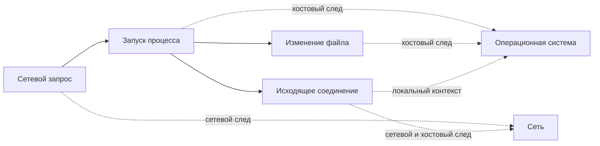
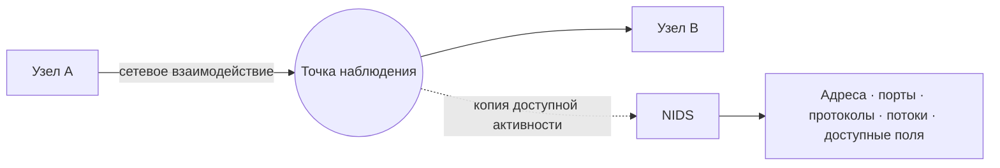
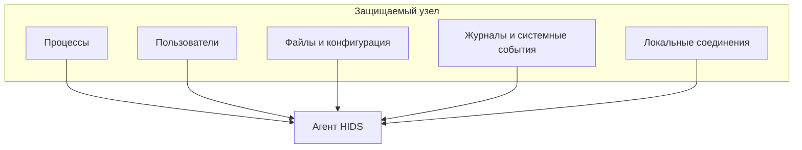
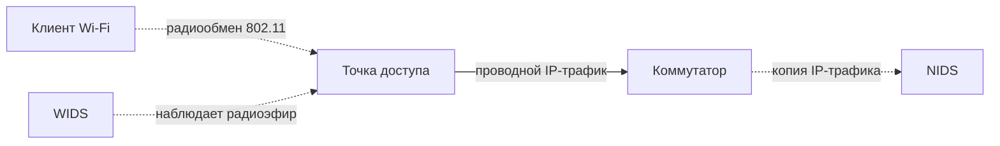
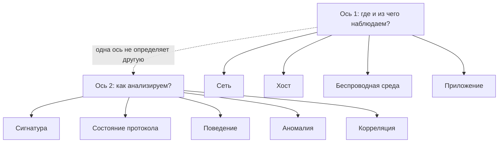
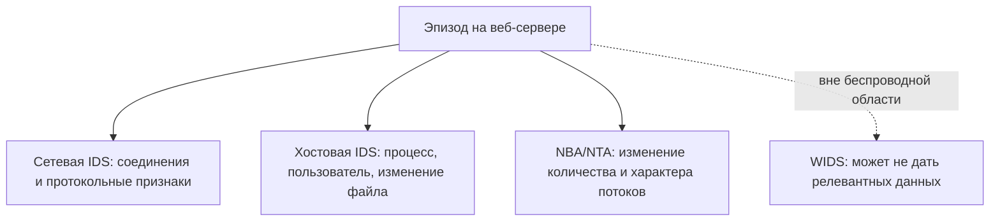
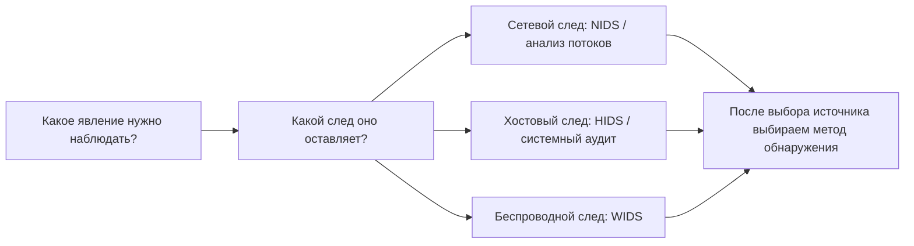

# Глава 2. Какие виды IDS/IPS существуют и что они могут наблюдать

В первой главе сетевой сенсор получил копию HTTP-трафика и сформировал оповещение. Но вторжение не обязательно оставляет только сетевые следы.

Запуск процесса, изменение файла, неизвестная точка Wi‑Fi и необычный сетевой обмен — разные явления. <strong>Один источник данных не обязан одинаково хорошо показывать их все.</strong>

<strong>После изучения главы студент должен уметь:</strong>

объяснить различия между сетевыми, хостовыми и беспроводными IDS/IPS; объяснить место анализа сетевого поведения (NBA) в классической классификации; определить, какие сведения потенциально доступны каждому типу; не путать источник данных с методом обнаружения.

---

## 1. Почему одной IDS недостаточно

Рассмотрим один эпизод:

СХЕМА 1 · ОДИН ЭПИЗОД ОСТАВЛЯЕТ СЛЕДЫ В РАЗНЫХ СРЕДАХ

Одно действие может оставлять несколько следов. Сетевой сенсор и агент на хосте получают не одинаковые представления одного эпизода.

В сети могут быть видны адреса, порты, соединения, протоколы, объёмы и время передачи. На самом узле возникают другие сведения: процессы, пользователи, файлы, системные события.

  РАЗНЫЕ СЛЕДЫ
  →
  РАЗНЫЕ ИСТОЧНИКИ НАБЛЮДЕНИЯ
  
Чтобы увидеть разные стороны эпизода, могут потребоваться разные источники данных. Это не означает, что один источник автоматически «лучше» другого.

---

## 2. Классическая классификация IDPS

В NIST SP 800-94 выделялись четыре основных типа IDPS:

  <article><strong>Сетевая</strong>Network-Based
наблюдает доступную сетевую активность
</article>
  <article><strong>Беспроводная</strong>Wireless
наблюдает радиообмен и протоколы беспроводной сети
</article>
  <article><strong>Анализ сетевого поведения</strong>Network Behavior Analysis, NBA
делает акцент на потоках, статистике и изменениях сетевого поведения
</article>
  <article><strong>Хостовая</strong>Host-Based
наблюдает события и характеристики конкретного узла
</article>

Эту классификацию важно знать, потому что она встречается в учебной литературе. Но она не идеально симметрична: сетевая, хостовая и беспроводная категории в основном различаются средой наблюдения, тогда как NBA сильнее характеризует вид сетевой телеметрии и характер анализа.

  ИСТОЧНИК ДАННЫХ
  ≠
  МЕТОД АНАЛИЗА
  
Откуда система получает сведения и как она принимает решение — два разных вопроса.

---

## 3. Сетевая IDS/IPS — NIDS/NIPS

**Сетевая IDS/IPS (Network-Based IDS/IPS, NIDS/NIPS)** анализирует доступную ей сетевую активность.

СХЕМА 2 · СЕТЕВОЙ ВЗГЛЯД

NIDS получает только ту сетевую активность, которая доступна в выбранной точке наблюдения и фактически захвачена системой.

В зависимости от точки наблюдения, конфигурации и возможностей системы NIDS может получать адреса, порты, признаки TCP/UDP/ICMP, DNS- и HTTP-поля, сведения о TLS-сеансе, характеристики сетевых потоков и другие доступные признаки.

Но сетевое наблюдение само по себе не сообщает автоматически, какой локальный процесс создал соединение. Если NIDS увидела `10.10.1.15 → 10.10.2.20:445`, из этого ещё не следует, что соединение создал конкретный процесс.

---

## 4. Хостовая IDS/IPS — HIDS/HIPS

**Хостовая IDS/IPS (Host-Based IDS/IPS, HIDS/HIPS)** работает с событиями и характеристиками конкретного вычислительного узла.

СХЕМА 3 · ХОСТОВЫЙ ВЗГЛЯД

HIDS потенциально получает контекст самого узла, но только через реально настроенные источники аудита и доступные агенту данные.

Наличие агента не означает автоматической доступности любой телеметрии. Реальный набор данных зависит от продукта, операционной системы, настроек аудита, прав и конфигурации.

### Один эпизод глазами NIDS и HIDS

Пусть веб-сервер устанавливает соединение `Web Server → 203.0.113.50:443`.

  <article>NIDS<strong>Сетевой контекст</strong>
Кто с кем взаимодействовал, когда, по какому протоколу, какие доступные сетевые признаки наблюдались.
</article>
  <article>HIDS<strong>Контекст узла</strong>
Какой процесс инициировал действие, от какого пользователя, какой файл или конфигурация были затронуты — если эти данные собираются.
</article>

Один источник не является автоматически «лучше» другого: они отвечают на разные вопросы.

---

## 5. Беспроводная IDS/IPS — WIDS/WIPS

**Беспроводная IDS/IPS (Wireless IDS/IPS, WIDS/WIPS)** наблюдает беспроводную среду и протоколы семейства IEEE 802.11.

СХЕМА 4 · ПРОВОДНАЯ И БЕСПРОВОДНАЯ НАБЛЮДАЕМОСТЬ НЕ ТOЖДЕСТВЕННЫ

NIDS за точкой доступа может видеть часть IP-трафика, но не получает автоматически то же представление радиообмена, что и WIDS.

WIDS/WIPS может использоваться для выявления неизвестных точек доступа, неожиданных беспроводных клиентов, подозрительных управляющих кадров и других событий беспроводной среды. Её ограничения связаны с радиопокрытием, каналами, способом сканирования и возможностями оборудования.

---

## 6. Анализ сетевого поведения — NBA

**Анализ сетевого поведения (Network Behavior Analysis, NBA)** рассматривает сетевой трафик или статистику сетевой активности, делая акцент на необычных потоках и изменениях поведения.

  <article>ОБЫЧНО<strong>20 внешних соединений в час</strong>
Наблюдаемая активность соответствует ожидаемому профилю для данного узла и периода.
</article>
  <article>ИЗМЕНЕНИЕ<strong>12 000 соединений за несколько минут</strong>
Изменение масштаба или структуры сетевого поведения становится признаком для анализа.
</article>

NIDS и NBA оба используют сетевые данные, поэтому граница между ними не абсолютна. Исторически NIDS чаще ассоциировалась с более глубоким анализом пакетов и протоколов, а NBA — с потоками, статистикой и изменениями поведения. Современные продукты могут совмещать эти возможности.

Современные названия NTA и NDR встречаются часто, но их границы зависят от конкретного продукта. В курсе мы будем оценивать не маркетинговое название, а реальные источники данных и функции.

---

## 7. Прикладная IDS — это пятый тип?

В литературе встречается **прикладная IDS (Application-Based IDPS)**, ориентированная на конкретный сервис, например веб-сервер или СУБД. В классической модели NIST она рассматривается как разновидность хостовой IDS/IPS.

Поэтому мы не создаём отдельную пятую равноправную категорию, но фиксируем идею: источник данных может находиться очень близко к самому приложению.

---

## 8. Тип системы и метод обнаружения — не одно и то же

СХЕМА 5 · ДВЕ НЕЗАВИСИМЫЕ ОСИ

Например, сетевая IDS может использовать сигнатуры, анализ состояния протокола, поведенческие признаки и статистические модели. «Сетевая» и «поведенческая» — не категории одной оси.

Методы обнаружения подробно рассматриваются в Главе 5.

---

## 9. Один эпизод — разные взгляды

!!! note "Учебная модель / синтетический сценарий"
    На веб-сервере выполняется неизвестный процесс, который изменяет файл и устанавливает множество исходящих соединений.

СХЕМА 6 · ОДИН ЭПИЗОД, РАЗНЫЕ ДОКАЗАТЕЛЬСТВА

Каждый источник поддерживает разные выводы. Отсутствие данных у одного источника не означает отсутствие самого события.

Больше телеметрии — не автоматически лучше: дополнительные источники требуют хранения, настройки, вычислительных ресурсов и сопровождения. Цель — достаточная наблюдаемость для конкретной задачи безопасности.

---

## 10. Как выбирать источник наблюдения

Вместо вопроса «какая IDS лучше?» сначала задаётся вопрос:

> **Какое явление требуется наблюдать и где существует нужный след?**

  <article>Изменение критичного файла<strong>Типичный источник: хост</strong>
События файловой системы или контроль целостности дают прямой контекст изменения.
</article>
  <article>Внутреннее сетевое сканирование<strong>Типичный источник: сеть</strong>
Множество сетевых взаимодействий может наблюдаться NIDS или средствами анализа потоков.
</article>
  <article>Неизвестная точка Wi‑Fi<strong>Типичный источник: беспроводная среда</strong>
Радиообмен и служебные кадры 802.11 требуют соответствующей беспроводной наблюдаемости.
</article>

Выбор конкретного продукта появляется после понимания задачи и доступных источников данных.

---

## 11. Сводная карта главы

К этому моменту мы рассмотрели четыре типа, которые студент встретит в классической литературе по IDPS. Вместо набора лозунгов сведём их к одному вопросу: **какие данные получает система и какие выводы эти данные позволяют поддержать?**

| Тип | Основная область наблюдения | Что может дать | Чего не следует автоматически заключать |
|---|---|---|---|
| **NIDS/NIPS** | Сетевой трафик в доступной точке наблюдения | Адреса, соединения, протоколы, доступные поля и характеристики потоков | Какой локальный процесс создал соединение или что произошло внутри ОС |
| **HIDS/HIPS** | События и характеристики конкретного узла | Процессы, пользователи, файлы, конфигурация, локальные события — если эти источники настроены | Что происходило на других узлах или в сегментах, которые агент не наблюдает |
| **WIDS/WIPS** | Беспроводная среда и протоколы 802.11 | Радиообмен, точки доступа, клиенты и события беспроводной среды | Полную картину проводной сети или внутреннего состояния конечного узла |
| **NBA** | Сетевые потоки и статистика сетевой активности | Изменение объёма, частоты, направлений и структуры сетевых взаимодействий | Причину изменения без дополнительного контекста |

СХЕМА 7 · ЛОГИКА ВЫБОРА ИСТОЧНИКА

Сначала определяется нужный след и источник данных. Только после этого выбирается способ анализа. Поэтому тип системы и метод обнаружения нельзя смешивать в одну классификацию.

Из всей главы следуют два общих вывода.

  ОДИН ЭПИЗОД
  →
  РАЗНЫЕ СЛЕДЫ
  
Сетевой, хостовый и беспроводной источники могут описывать разные стороны одного события.

  ИСТОЧНИК ДАННЫХ
  ≠
  МЕТОД ОБНАРУЖЕНИЯ
  
«Откуда получены данные?» и «как система решила, что событие интересно?» — разные вопросы.

Эти два вывода подготавливают две последовательные работы. В ЛР №1 студент сначала получает базовый опыт с одним сетевым источником, а в ЛР №2 один контролируемый эпизод уже сравнивается по сетевому и хостовому следу.

---

## 12. Проверка понимания

  
<strong>NIDS зафиксировала соединение 10.0.10.15 → 203.0.113.50:443. Можно ли только по этому событию утверждать, что его создал процесс powershell.exe?</strong>

  <button data-choice="a">A. Да, NIDS автоматически получает контекст процессов узла</button>
  <button data-choice="b" data-correct="true">B. Нет, для этого нужен соответствующий хостовый источник данных</button>
  <button data-choice="c">C. Да, если соединение использует TCP</button>
  <button data-choice="d">D. Да, если порт назначения равен 443</button>
  

  
<strong>В чём ошибка фразы «поведенческая IDS — четвёртый тип наряду с сетевой, хостовой и беспроводной»?</strong>

  <button data-choice="a">A. Поведенческого обнаружения не существует</button>
  <button data-choice="b" data-correct="true">B. Смешиваются источник наблюдения и метод анализа</button>
  <button data-choice="c">C. Хостовая IDS всегда использует только поведенческий анализ</button>
  <button data-choice="d">D. Беспроводная IDS относится только к межсетевым экранам</button>
  

  
<strong>Нужно обнаруживать неизвестные точки Wi‑Fi рядом с офисом. Достаточно ли NIDS на интернет-шлюзе?</strong>

  <button data-choice="a">A. Да, если добавить больше HTTP-правил</button>
  <button data-choice="b">B. Да, если увеличить объём хранилища журналов</button>
  <button data-choice="c" data-correct="true">C. Нет, нужен источник данных из беспроводной среды</button>
  <button data-choice="d">D. Да, если отключить TLS</button>
  

<strong>Практическое закрепление:</strong> сначала выполните <a href="../../labs/lab01/">ЛР №1 — «Первое сетевое обнаружение»</a>, затем <a href="../../labs/lab02/">ЛР №2 — «Один эпизод, два источника данных»</a>. После двух экспериментов переходите к <a href="../03-detection/">Главе 3</a>, где формализуем функциональное устройство IDS/IPS.

---

## Источники и статус классификации

- NIST SP 800-94 — источник классической четырёхчастной классификации: Network-Based, Wireless, NBA, Host-Based.
- В курсе эта классификация рассматривается как **историческая фундаментальная модель**. NBA/NTA/NDR не выдаются за современный универсальный набор взаимно исключающих категорий.
- Application-Based IDPS в NIST рассматривается как разновидность хостового мониторинга для конкретного прикладного сервиса.

Актуальные ссылки собраны в разделе [«Источники курса»](../../resources/sources/).
