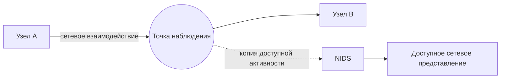
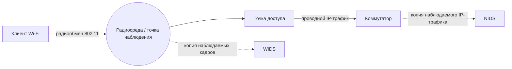
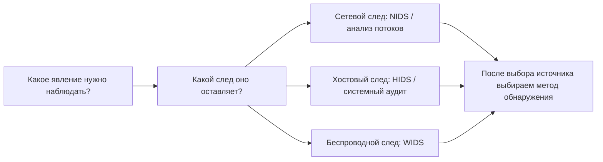

# Глава 2. Какие виды IDS/IPS существуют и что они могут наблюдать

В первой главе сетевой сенсор получил копию HTTP-трафика и сформировал оповещение. Но вторжение не обязательно оставляет только сетевые следы.

Запуск процесса, изменение файла, неизвестная точка Wi‑Fi и необычный сетевой обмен — разные явления. <strong>Один источник данных не обязан одинаково хорошо показывать их все.</strong>

<strong>После изучения главы студент должен уметь:</strong>

объяснить различия между сетевыми, хостовыми и беспроводными IDS/IPS; объяснить место анализа сетевого поведения в классической классификации; определить, какие сведения потенциально доступны каждому типу; не путать источник данных с методом обнаружения.

---

## 1. Почему одной IDS недостаточно

Рассмотрим один эпизод: сетевой запрос приводит к запуску процесса на сервере, процесс изменяет файл и устанавливает исходящее соединение.

  
СХЕМА 1 · ОДИН ЭПИЗОД ОСТАВЛЯЕТ РАЗНЫЕ СЛЕДЫ

  <article class="idps-card idps-card--primary">
    УЧЕБНЫЙ ЭПИЗОД
    <strong class="idps-card__title">Запрос → запуск процесса → изменение файла + исходящее соединение</strong>
    
Это одна причинная цепочка в учебном сценарии, но наблюдать её части можно в разных средах.

  </article>
  

    <article class="idps-card idps-card--source">
      СЕТЕВОЙ СЛЕД
      <strong class="idps-card__title">Сеть</strong>
      
Адреса, порты, соединения, протоколы, объёмы, время передачи и другие доступные сетевые признаки.

    </article>
    <article class="idps-card idps-card--source">
      ХОСТОВЫЙ СЛЕД
      <strong class="idps-card__title">Операционная система</strong>
      
Процессы, пользователи, файлы, системные события и локальный контекст — если соответствующая телеметрия собирается.

    </article>
  

  
Сетевой сенсор и агент на хосте получают не одинаковые представления одного эпизода. Каждый источник подтверждает только тот факт, который реально зафиксирован.

  
РАЗНЫЕ СЛЕДЫ<b>→</b>РАЗНЫЕ ИСТОЧНИКИ НАБЛЮДЕНИЯ

  
Чтобы увидеть разные стороны эпизода, могут потребоваться разные источники данных. Это не означает, что один источник автоматически «лучше» другого.

---

## 2. Классическая классификация IDPS

**NIST** — Национальный институт стандартов и технологий США (National Institute of Standards and Technology). Английское название приведено для происхождения аббревиатуры, под которой публикуются документы института. В NIST SP 800-94 выделялись четыре основных типа IDPS. Эту классификацию важно знать, потому что она встречается в учебной и профессиональной литературе. В оригинале используются названия `Network-Based`, `Wireless`, `Network Behavior Analysis` и `Host-Based`; английские формы приведены здесь один раз, потому что от них образованы распространённые сокращения NIDS/NIPS, WIDS/WIPS, NBA и HIDS/HIPS. Далее в объяснении используются русские названия и сокращения.

  

    <strong>Четыре типа в классической модели NIST</strong>
    
Переключатель показывает область наблюдения, типичные данные и границу допустимого вывода для каждого класса.

  

  

    <button id="chapter2-control-network" class="idps-switcher__button" type="button" aria-controls="chapter2-panel-network" data-idps-switch="network">Сетевая</button>
    <button id="chapter2-control-wireless" class="idps-switcher__button" type="button" aria-controls="chapter2-panel-wireless" data-idps-switch="wireless">Беспроводная</button>
    <button id="chapter2-control-nba" class="idps-switcher__button" type="button" aria-controls="chapter2-panel-nba" data-idps-switch="nba">NBA</button>
    <button id="chapter2-control-host" class="idps-switcher__button" type="button" aria-controls="chapter2-panel-host" data-idps-switch="host">Хостовая</button>
  

  

    <section id="chapter2-panel-network" class="idps-switcher__panel" data-idps-panel="network">
      <h3 class="idps-switcher__panel-title">Сетевая IDS/IPS</h3>
      

        
Область наблюдения<strong>Доступная сетевой системе активность в конкретной точке наблюдения</strong>

        
Типичные данные<strong>Адреса, порты, протоколы, поля сообщений, характеристики потоков</strong>

        
Класс<strong>Сетевая IDS/IPS — NIDS/NIPS</strong>

        
<strong>Граница вывода:</strong> сетевые данные сами по себе не раскрывают автоматически локальный процесс, пользователя или изменение файла на узле.

      

    </section>
    <section id="chapter2-panel-wireless" class="idps-switcher__panel" data-idps-panel="wireless">
      <h3 class="idps-switcher__panel-title">Беспроводная IDS/IPS</h3>
      

        
Область наблюдения<strong>Радиосреда и протоколы семейства IEEE 802.11</strong>

        
Типичные данные<strong>Точки доступа, клиенты, служебные кадры и другие доступные признаки радиообмена</strong>

        
Класс<strong>Беспроводная IDS/IPS — WIDS/WIPS</strong>

        
<strong>Граница вывода:</strong> представление радиообмена не тождественно картине проводного сетевого трафика за точкой доступа.

      

    </section>
    <section id="chapter2-panel-nba" class="idps-switcher__panel" data-idps-panel="nba">
      <h3 class="idps-switcher__panel-title">Анализ сетевого поведения</h3>
      

        
Область наблюдения<strong>Сетевой трафик, потоки и статистика сетевой активности</strong>

        
Акцент анализа<strong>Объём, частота, направления, структура и изменения поведения</strong>

        
Класс NIST<strong>Анализ сетевого поведения — NBA</strong>

        
<strong>Важная оговорка:</strong> NBA не образует идеально независимую от NIDS «среду». Здесь класс сильнее характеризует вид сетевой телеметрии и характер анализа.

      

    </section>
    <section id="chapter2-panel-host" class="idps-switcher__panel" data-idps-panel="host">
      <h3 class="idps-switcher__panel-title">Хостовая IDS/IPS</h3>
      

        
Область наблюдения<strong>События и характеристики конкретного вычислительного узла</strong>

        
Типичные данные<strong>Процессы, пользователи, файлы, конфигурация, журналы и локальные соединения</strong>

        
Класс<strong>Хостовая IDS/IPS — HIDS/HIPS</strong>

        
<strong>Граница вывода:</strong> агент видит только реально доступные ему и настроенные источники данных на конкретном узле.

      

    </section>
  

Классификация NIST не идеально симметрична: сетевая, хостовая и беспроводная категории в основном различаются средой наблюдения, тогда как NBA сильнее характеризует вид сетевой телеметрии и характер анализа.

  
ИСТОЧНИК ДАННЫХ<b>≠</b>МЕТОД АНАЛИЗА

  
Откуда система получает сведения и как она принимает решение — два разных вопроса.

---

## 3. Сетевая IDS/IPS — NIDS/NIPS

**Сетевая IDS/IPS (NIDS/NIPS)** анализирует доступную ей сетевую активность.

В сетевых примерах дальше используются стандартные обозначения протоколов из сетевого пререквизита курса: **IP (Internet Protocol)**, **TCP (Transmission Control Protocol)**, **UDP (User Datagram Protocol)**, **ICMP (Internet Control Message Protocol)** и **DNS (Domain Name System)**. Английские названия приведены только для происхождения официальных сокращений из спецификаций; далее используются сами сокращения. `HTTP` и `TLS` уже были введены в Главе 1.

СХЕМА 2 · СЕТЕВОЙ ВЗГЛЯД

Сплошные стрелки показывают основной путь сетевого взаимодействия. Пунктир означает копию наблюдаемых данных в NIDS. Система получает только ту активность, которая доступна в выбранной точке и фактически захвачена.

В зависимости от точки наблюдения, конфигурации и возможностей системы NIDS может получать адреса, порты, признаки TCP/UDP/ICMP, DNS- и HTTP-поля, сведения о TLS-сеансе, характеристики сетевых потоков и другие доступные признаки.

  <article class="idps-evidence idps-evidence--supported">СЕТЕВОЙ ИСТОЧНИК МОЖЕТ ПОДДЕРЖАТЬ ВЫВОД
Наблюдалось соединение <code>10.10.1.15 → 10.10.2.20:445</code> — если соответствующий обмен действительно попал в точку наблюдения и был захвачен.
</article>
  <article class="idps-evidence idps-evidence--not-proven">ЭТО НЕ ДОКАЗЫВАЕТ АВТОМАТИЧЕСКИ
Какой локальный процесс создал соединение, от какого пользователя он работал и что произошло внутри операционной системы.
</article>

---

## 4. Хостовая IDS/IPS — HIDS/HIPS

**Хостовая IDS/IPS (HIDS/HIPS)** работает с событиями и характеристиками конкретного вычислительного узла.

  
СХЕМА 3 · ХОСТОВЫЕ ИСТОЧНИКИ СХОДЯТСЯ К АГЕНТУ, НО НЕ ПОЯВЛЯЮТСЯ АВТОМАТИЧЕСКИ

  

    

      
<strong>Процессы</strong><small>Запуск, завершение и доступный контекст процесса.</small>

      
<strong>Пользователи</strong><small>Аутентификация и действия, если соответствующие события формируются.</small>

      
<strong>Файлы и конфигурация</strong><small>Изменения объектов, которые включены в контроль.</small>

      
<strong>Журналы и аудит</strong><small>Системные и прикладные события, которые реально журналируются.</small>

      
<strong>Локальные соединения</strong><small>Сетевой контекст, доступный на самом наблюдаемом узле.</small>

    

    
→

    
<strong>Агент HIDS/HIPS</strong><small>Получает только доступную и настроенную телеметрию. Конкретный продукт может собирать не все перечисленные источники.</small>

    
<strong>Граница наблюдаемости</strong><small>Установленный агент ≠ полная видимость узла. Реальный набор данных определяется ОС, правами, аудитом, конфигурацией и возможностями реализации.</small>

  

  
Схема показывает отношение «источники → агент», а не обязательную внутреннюю архитектуру продукта. Каждый показанный источник должен существовать и быть доступен отдельно.

### Один эпизод глазами NIDS и HIDS

Пусть веб-сервер устанавливает соединение `Веб-сервер → 203.0.113.50:443`.

  <article class="idps-card idps-card--sensor">NIDS<strong class="idps-card__title">Сетевой контекст</strong>
Кто с кем взаимодействовал, когда, по какому протоколу и какие доступные сетевые признаки наблюдались.
</article>
  <article class="idps-card idps-card--source">HIDS<strong class="idps-card__title">Контекст узла</strong>
Какой процесс инициировал действие, от какого пользователя, какой файл или конфигурация были затронуты — если эти данные собираются.
</article>

Один источник не является автоматически «лучше» другого: они отвечают на разные вопросы.

---

## 5. Беспроводная IDS/IPS — WIDS/WIPS

**Беспроводная IDS/IPS (WIDS/WIPS)** наблюдает беспроводную среду и протоколы семейства IEEE 802.11.

СХЕМА 4 · ПРОВОДНАЯ И БЕСПРОВОДНАЯ НАБЛЮДАЕМОСТЬ НЕ ТОЖДЕСТВЕННЫ

Сплошные стрелки показывают основной обмен. Пунктир используется только для копии наблюдаемых данных. NIDS за точкой доступа и WIDS в радиоэфире получают разные представления.

WIDS/WIPS может использоваться для выявления неизвестных точек доступа, неожиданных беспроводных клиентов, подозрительных управляющих кадров и других событий беспроводной среды. Её ограничения связаны с радиопокрытием, каналами, способом сканирования и возможностями оборудования.

---

## 6. Анализ сетевого поведения — NBA

**Анализ сетевого поведения (NBA)** рассматривает сетевой трафик или статистику сетевой активности, делая акцент на необычных потоках и изменениях поведения.

  
ВИЗУАЛЬНЫЙ ПРИМЕР · СРАВНЕНИЕ В ОДИНАКОВОМ ОКНЕ НАБЛЮДЕНИЯ

  

    

      БАЗОВЫЙ ПРОФИЛЬ
      <strong>18–22</strong>
      <b>внешних соединения / 5 минут</b>
      <small>Диапазон, полученный по выбранным опорным окнам.</small>
    

    
→

    

      ТЕКУЩЕЕ ОКНО
      <strong>180</strong>
      <b>внешних соединений / 5 минут</b>
      <small>Наблюдаемое значение существенно выше выбранного базового диапазона.</small>
    

  

  
Обе величины относятся к одинаковым пятиминутным окнам, поэтому сравнение имеет одну измерительную рамку. NBA фиксирует изменение относительно выбранной модели; причина изменения требует дополнительного контекста.

  <article class="idps-evidence idps-evidence--supported">НАБЛЮДЕНИЕ
Количество, частота или структура сетевых взаимодействий изменились относительно выбранной модели или базового профиля.
</article>
  <article class="idps-evidence idps-evidence--not-proven">НЕ ДОКАЗЫВАЕТ ПРИЧИНУ
Само изменение не объясняет, было ли оно атакой, обновлением, резервным копированием или другой легитимной активностью.
</article>

NIDS и NBA оба используют сетевые данные, поэтому граница между ними не абсолютна. Исторически NIDS чаще ассоциировалась с более глубоким анализом пакетов и протоколов, а NBA — с потоками, статистикой и изменениями поведения. Современные продукты могут совмещать эти возможности.

В современных продуктах также встречаются названия **анализ сетевого трафика (Network Traffic Analysis, NTA)** и **сетевое обнаружение и реагирование (Network Detection and Response, NDR)**. Английские названия приведены только для происхождения распространённых сокращений `NTA` и `NDR`; границы этих классов зависят от конкретного продукта. В курсе мы оцениваем не маркетинговое название, а реальные источники данных и функции.

---

## 7. Прикладная IDS — это пятый тип?

В NIST SP 800-94 встречается категория **прикладной IDPS** (`Application-Based IDPS`), ориентированная на конкретный сервис, например веб-сервер или СУБД. Английское название приведено только потому, что именно так категория названа в первичном источнике. В классической модели NIST она рассматривается как разновидность хостовой IDS/IPS.

Поэтому мы не создаём отдельную пятую равноправную категорию, но фиксируем идею: источник данных может находиться очень близко к самому приложению.

---

## 8. Тип системы и метод обнаружения — не одно и то же

  
СХЕМА 5 · ИСТОЧНИК ДАННЫХ И СПОСОБ АНАЛИЗА — ДВЕ РАЗНЫЕ ОСИ

  

    <table class="idps-axis-table">
      <thead>
        <tr><th>Источник / область наблюдения ↓</th><th>Известный признак</th><th>Состояние / семантика</th><th>Отклонение от ожидаемой модели</th></tr>
      </thead>
      <tbody>
        <tr><th>Сетевые данные</th><td data-label="Известный признак">Возможна комбинация
Например, условие по доступному сетевому признаку.
</td><td data-label="Состояние / семантика">Возможна комбинация
Если реализация строит нужный протокольный контекст.
</td><td data-label="Отклонение от ожидаемой модели">Возможна комбинация
Потоки и статистика могут сравниваться с моделью поведения.
</td></tr>
        <tr><th>Хостовые данные</th><td data-label="Известный признак">Возможна комбинация
Например, известный признак в событии или объекте.
</td><td data-label="Состояние / семантика">Возможна комбинация
Анализ последовательности или контекста событий узла.
</td><td data-label="Отклонение от ожидаемой модели">Возможна комбинация
Сравнение активности узла с ожидаемым профилем.
</td></tr>
        <tr><th>Беспроводные данные</th><td data-label="Известный признак">Возможна комбинация
Известные признаки кадров, точек доступа или клиентов.
</td><td data-label="Состояние / семантика">Возможна комбинация
Контекст состояния беспроводного протокола.
</td><td data-label="Отклонение от ожидаемой модели">Возможна комбинация
Отклонения от ожидаемой картины радиоокружения.
</td></tr>
      </tbody>
    </table>
  

  
Матрица показывает логическую независимость осей, а не обещает наличие каждой комбинации в любом продукте. Реальная возможность зависит от доступных данных, представления и реализации детектора.

  
ТИП ИСТОЧНИКА<b>≠</b>МЕТОД ОБНАРУЖЕНИЯ

  
Например, хостовые и сетевые данные могут анализироваться разными методами. Нельзя строить одну плоскую классификацию из понятий разных уровней.

---

## 9. Один эпизод — разные взгляды

!!! note "Учебная модель / синтетический сценарий"
    На веб-сервере выполняется неизвестный процесс, который изменяет файл и устанавливает множество исходящих соединений.

  

    <strong>СХЕМА 6 · ОДИН ЭПИЗОД, РАЗНЫЕ ДОКАЗАТЕЛЬСТВА</strong>
    <small>Выберите источник, чтобы подсветить его вклад в общую картину наблюдения.</small>
  

  

    <button class="idps-focus-map__button" type="button" data-idps-focus="all" aria-pressed="true">Все источники</button>
    <button class="idps-focus-map__button" type="button" data-idps-focus="nids" aria-pressed="false">NIDS</button>
    <button class="idps-focus-map__button" type="button" data-idps-focus="hids" aria-pressed="false">HIDS</button>
    <button class="idps-focus-map__button" type="button" data-idps-focus="nba" aria-pressed="false">NBA / NTA</button>
  

  

    

      
Источник

      
Входящий HTTP-запрос

      
Запуск процесса

      
Изменение файла

      
Много исходящих соединений

      
NIDS

      
СЕТЕВОЙ СЛЕД<strong>Может наблюдать запрос</strong><small>Если он проходит через выбранную точку и доступен анализу.</small>

      
ГРАНИЦА<strong>Не подтверждает процесс напрямую</strong><small>Сетевой артефакт сам по себе не называет локальный процесс.</small>

      
ГРАНИЦА<strong>Не подтверждает изменение файла</strong><small>Для этого нужен соответствующий хостовый или прикладной источник.</small>

      
СЕТЕВОЙ СЛЕД<strong>Может видеть исходящие соединения</strong><small>В пределах своей точки наблюдения.</small>

      
HIDS

      
ЗАВИСИТ ОТ ТЕЛЕМЕТРИИ<strong>Может дать локальный контекст</strong><small>Например, через журнал приложения или локальные сетевые события, если они собираются.</small>

      
ХОСТОВЫЙ СЛЕД<strong>Может подтвердить запуск</strong><small>Если события процессов доступны агенту или аудиту.</small>

      
ХОСТОВЫЙ СЛЕД<strong>Может подтвердить изменение</strong><small>Если объект контролируется механизмом контроля целостности файлов, аудитом или другим настроенным источником.</small>

      
ЛОКАЛЬНЫЙ КОНТЕКСТ<strong>Может связать соединение с процессом</strong><small>Только если такая телеметрия реально собирается.</small>

      
NBA / NTA

      
АГРЕГИРОВАННЫЙ ВЗГЛЯД<strong>Содержание запроса может быть не нужно</strong><small>Анализ может опираться на потоки и статистику, а не на содержимое конкретного прикладного запроса.</small>

      
ГРАНИЦА<strong>Не устанавливает локальный процесс</strong><small>Это не хостовый источник.</small>

      
ГРАНИЦА<strong>Не подтверждает изменение файла</strong><small>Нужен дополнительный контекст.</small>

      
ИЗМЕНЕНИЕ СЕТЕВОЙ АКТИВНОСТИ<strong>Хорошо показывает изменение масштаба</strong><small>Но само изменение ещё не объясняет его причину.</small>

    

  

  
WIDS здесь намеренно не включена в матрицу: учебный эпизод не задаёт беспроводную область наблюдения. Отсутствие релевантного WIDS-события в таком сценарии ожидаемо и ничего не говорит о фактах на сервере.

Больше телеметрии — не автоматически лучше: дополнительные источники требуют хранения, настройки, вычислительных ресурсов и сопровождения. Цель — достаточная наблюдаемость для конкретной задачи безопасности.

---

## 10. Как выбирать источник наблюдения

Вместо вопроса «какая IDS лучше?» сначала задаётся вопрос:

> **Какое явление требуется наблюдать и где существует нужный след?**

  <article class="idps-card idps-card--source">ИЗМЕНЕНИЕ КРИТИЧНОГО ФАЙЛА<strong class="idps-card__title">Типичный источник: хост</strong>
События файловой системы или контроль целостности могут дать прямой контекст изменения.
</article>
  <article class="idps-card idps-card--sensor">ВНУТРЕННЕЕ СЕТЕВОЕ СКАНИРОВАНИЕ<strong class="idps-card__title">Типичный источник: сеть</strong>
Множество сетевых взаимодействий может наблюдаться NIDS или средствами анализа потоков.
</article>
  <article class="idps-card idps-card--observation">НЕИЗВЕСТНАЯ ТОЧКА WI-FI<strong class="idps-card__title">Типичный источник: беспроводная среда</strong>
Радиообмен и служебные кадры 802.11 требуют соответствующей беспроводной наблюдаемости.
</article>

Выбор конкретного продукта появляется после понимания задачи и доступных источников данных.

---

## 11. Сводная карта главы

К этому моменту мы рассмотрели четыре типа, которые студент встретит в классической литературе по IDPS. Вместо набора лозунгов сведём их к одному вопросу: **какие данные получает система и какие выводы эти данные позволяют поддержать?**

| Тип | Основная область наблюдения | Что может дать | Чего не следует автоматически заключать |
|---|---|---|---|
| **NIDS/NIPS** | Сетевой трафик в доступной точке наблюдения | Адреса, соединения, протоколы, доступные поля и характеристики потоков | Какой локальный процесс создал соединение или что произошло внутри ОС |
| **HIDS/HIPS** | События и характеристики конкретного узла | Процессы, пользователи, файлы, конфигурация, локальные события — если эти источники настроены | Что происходило на других узлах или в сегментах, которые агент не наблюдает |
| **WIDS/WIPS** | Беспроводная среда и протоколы 802.11 | Радиообмен, точки доступа, клиенты и события беспроводной среды | Полную картину проводной сети или внутреннего состояния конечного узла |
| **NBA** | Сетевые потоки и статистика сетевой активности | Изменение объёма, частоты, направлений и структуры сетевых взаимодействий | Причину изменения без дополнительного контекста |

СХЕМА 7 · ЛОГИКА ВЫБОРА ИСТОЧНИКА

Сначала определяется нужный след и источник данных. Только после этого выбирается способ анализа. Поэтому тип системы и метод обнаружения нельзя смешивать в одну классификацию.

  <article class="idps-summary-card">01<strong>ОДИН ЭПИЗОД → РАЗНЫЕ СЛЕДЫ</strong>
Сетевой, хостовый и беспроводной источники могут описывать разные стороны одного события.
</article>
  <article class="idps-summary-card">02<strong>ИСТОЧНИК ДАННЫХ ≠ МЕТОД ОБНАРУЖЕНИЯ</strong>
«Откуда получены данные?» и «как система решила, что событие интересно?» — разные вопросы.
</article>

Эти два вывода используются далее в лабораторных работах. Перед практикой нужно изучить функциональное устройство IDS/IPS в Главе 3: студент должен понимать, как полученные данные проходят от источника к логике обнаружения и результату.

---

## 12. Проверка понимания

  
<strong>NIDS зафиксировала соединение 10.0.10.15 → 203.0.113.50:443. Можно ли только по этому событию утверждать, что его создал процесс powershell.exe?</strong>

  <button data-choice="a">A. Да, NIDS автоматически получает контекст процессов узла</button>
  <button data-choice="b" data-correct="true">B. Нет, для этого нужен соответствующий хостовый источник данных</button>
  <button data-choice="c">C. Да, если соединение использует TCP</button>
  <button data-choice="d">D. Да, если порт назначения равен 443</button>
  

  
<strong>В чём ошибка фразы «поведенческая IDS — четвёртый тип наряду с сетевой, хостовой и беспроводной»?</strong>

  <button data-choice="a">A. Поведенческого обнаружения не существует</button>
  <button data-choice="b" data-correct="true">B. Смешиваются источник наблюдения и метод анализа</button>
  <button data-choice="c">C. Хостовая IDS всегда использует только поведенческий анализ</button>
  <button data-choice="d">D. Беспроводная IDS относится только к межсетевым экранам</button>
  

  
<strong>Нужно обнаруживать неизвестные точки Wi‑Fi рядом с офисом. Достаточно ли NIDS на интернет-шлюзе?</strong>

  <button data-choice="a">A. Да, если добавить больше HTTP-правил</button>
  <button data-choice="b">B. Да, если увеличить объём хранилища журналов</button>
  <button data-choice="c" data-correct="true">C. Нет, нужен источник данных из беспроводной среды</button>
  <button data-choice="d">D. Да, если отключить TLS</button>
  

<strong>Следующий шаг:</strong> переходите к <a href="../03-detection/">Главе 3 — «Из чего состоит IDS/IPS и как она работает»</a>. После неё теоретический фундамент для ЛР №1 и ЛР №2 будет завершён.

---

## Источники и статус классификации

- NIST SP 800-94 — источник классической четырёхчастной классификации: Network-Based, Wireless, NBA, Host-Based.
- В курсе эта классификация рассматривается как **историческая фундаментальная модель**. NBA/NTA/NDR не выдаются за современный универсальный набор взаимно исключающих категорий.
- Application-Based IDPS в NIST рассматривается как разновидность хостового мониторинга для конкретного прикладного сервиса.

Актуальные ссылки собраны в разделе [«Источники курса»](../../resources/sources/).
