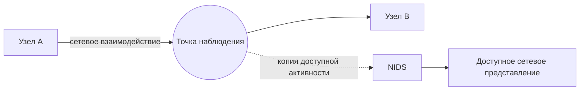
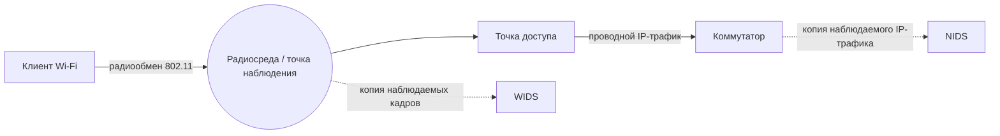
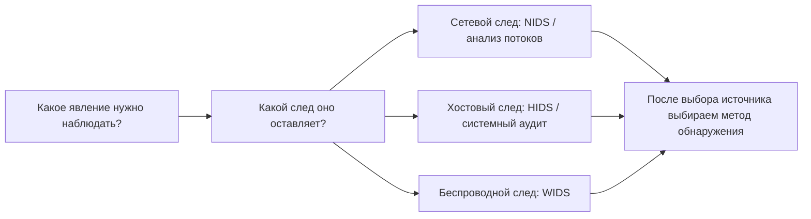

# Глава 2. Какие виды IDS/IPS существуют и что они могут наблюдать

В первой главе сетевой сенсор получил копию HTTP-трафика и сформировал оповещение. Но вторжение не обязательно оставляет только сетевые следы.

Запуск процесса, изменение файла, неизвестная точка Wi‑Fi и необычный сетевой обмен — разные явления. <strong>Один источник данных не обязан одинаково хорошо показывать их все.</strong>

<strong>После изучения главы студент должен уметь:</strong>

объяснить различия между сетевыми, хостовыми и беспроводными IDS/IPS; объяснить место анализа сетевого поведения (NBA) в классической классификации; определить, какие сведения потенциально доступны каждому типу; не путать источник данных с методом обнаружения.

---

## 1. Почему одной IDS недостаточно

Рассмотрим один эпизод: сетевой запрос приводит к запуску процесса на сервере, процесс изменяет файл и устанавливает исходящее соединение.

  
СХЕМА 1 · ОДИН ЭПИЗОД ОСТАВЛЯЕТ РАЗНЫЕ СЛЕДЫ

  <article class="idps-card idps-card--primary">
    УЧЕБНЫЙ ЭПИЗОД
    <strong class="idps-card__title">Запрос → запуск процесса → изменение файла + исходящее соединение</strong>
    
Это одна причинная цепочка в учебном сценарии, но наблюдать её части можно в разных средах.

  </article>
  

    <article class="idps-card idps-card--source">
      СЕТЕВОЙ СЛЕД
      <strong class="idps-card__title">Сеть</strong>
      
Адреса, порты, соединения, протоколы, объёмы, время передачи и другие доступные сетевые признаки.

    </article>
    <article class="idps-card idps-card--source">
      ХОСТОВЫЙ СЛЕД
      <strong class="idps-card__title">Операционная система</strong>
      
Процессы, пользователи, файлы, системные события и локальный контекст — если соответствующая телеметрия собирается.

    </article>
  

  
Сетевой сенсор и агент на хосте получают не одинаковые представления одного эпизода. Каждый источник подтверждает только тот факт, который реально зафиксирован.

  
РАЗНЫЕ СЛЕДЫ<b>→</b>РАЗНЫЕ ИСТОЧНИКИ НАБЛЮДЕНИЯ

  
Чтобы увидеть разные стороны эпизода, могут потребоваться разные источники данных. Это не означает, что один источник автоматически «лучше» другого.

---

## 2. Классическая классификация IDPS

В NIST SP 800-94 выделялись четыре основных типа IDPS. Эту классификацию важно знать, потому что она встречается в учебной и профессиональной литературе.

  

    <strong>Четыре типа в классической модели NIST</strong>
    
Переключатель показывает область наблюдения, типичные данные и границу вывода. Без JavaScript все четыре блока остаются доступны как обычный текст.

  

  

    <button id="chapter2-control-network" class="idps-switcher__button" type="button" aria-controls="chapter2-panel-network" data-idps-switch="network">Сетевая</button>
    <button id="chapter2-control-wireless" class="idps-switcher__button" type="button" aria-controls="chapter2-panel-wireless" data-idps-switch="wireless">Беспроводная</button>
    <button id="chapter2-control-nba" class="idps-switcher__button" type="button" aria-controls="chapter2-panel-nba" data-idps-switch="nba">NBA</button>
    <button id="chapter2-control-host" class="idps-switcher__button" type="button" aria-controls="chapter2-panel-host" data-idps-switch="host">Хостовая</button>
  

  

    <section id="chapter2-panel-network" class="idps-switcher__panel" data-idps-panel="network">
      <h3 class="idps-switcher__panel-title">Сетевая IDS/IPS</h3>
      

        
Область наблюдения<strong>Доступная сетевой системе активность в конкретной точке наблюдения</strong>

        
Типичные данные<strong>Адреса, порты, протоколы, поля сообщений, характеристики потоков</strong>

        
Класс<strong>Network-Based IDS/IPS — NIDS/NIPS</strong>

        
<strong>Граница вывода:</strong> сетевые данные сами по себе не раскрывают автоматически локальный процесс, пользователя или изменение файла на узле.

      

    </section>
    <section id="chapter2-panel-wireless" class="idps-switcher__panel" data-idps-panel="wireless">
      <h3 class="idps-switcher__panel-title">Беспроводная IDS/IPS</h3>
      

        
Область наблюдения<strong>Радиосреда и протоколы семейства IEEE 802.11</strong>

        
Типичные данные<strong>Точки доступа, клиенты, служебные кадры и другие доступные признаки радиообмена</strong>

        
Класс<strong>Wireless IDS/IPS — WIDS/WIPS</strong>

        
<strong>Граница вывода:</strong> представление радиообмена не тождественно картине проводного IP-трафика за точкой доступа.

      

    </section>
    <section id="chapter2-panel-nba" class="idps-switcher__panel" data-idps-panel="nba">
      <h3 class="idps-switcher__panel-title">Анализ сетевого поведения</h3>
      

        
Область наблюдения<strong>Сетевой трафик, потоки и статистика сетевой активности</strong>

        
Акцент анализа<strong>Объём, частота, направления, структура и изменения поведения</strong>

        
Класс NIST<strong>Network Behavior Analysis — NBA</strong>

        
<strong>Важная оговорка:</strong> NBA не образует идеально независимую от NIDS «среду». Здесь класс сильнее характеризует вид сетевой телеметрии и характер анализа.

      

    </section>
    <section id="chapter2-panel-host" class="idps-switcher__panel" data-idps-panel="host">
      <h3 class="idps-switcher__panel-title">Хостовая IDS/IPS</h3>
      

        
Область наблюдения<strong>События и характеристики конкретного вычислительного узла</strong>

        
Типичные данные<strong>Процессы, пользователи, файлы, конфигурация, журналы и локальные соединения</strong>

        
Класс<strong>Host-Based IDS/IPS — HIDS/HIPS</strong>

        
<strong>Граница вывода:</strong> агент видит только реально доступные ему и настроенные источники данных на конкретном узле.

      

    </section>
  

Классификация NIST не идеально симметрична: сетевая, хостовая и беспроводная категории в основном различаются средой наблюдения, тогда как NBA сильнее характеризует вид сетевой телеметрии и характер анализа.

  
ИСТОЧНИК ДАННЫХ<b>≠</b>МЕТОД АНАЛИЗА

  
Откуда система получает сведения и как она принимает решение — два разных вопроса.

---

## 3. Сетевая IDS/IPS — NIDS/NIPS

**Сетевая IDS/IPS (Network-Based IDS/IPS, NIDS/NIPS)** анализирует доступную ей сетевую активность.

СХЕМА 2 · СЕТЕВОЙ ВЗГЛЯД

Сплошные стрелки показывают основной путь сетевого взаимодействия. Пунктир означает копию наблюдаемых данных в NIDS. Система получает только ту активность, которая доступна в выбранной точке и фактически захвачена.

В зависимости от точки наблюдения, конфигурации и возможностей системы NIDS может получать адреса, порты, признаки TCP/UDP/ICMP, DNS- и HTTP-поля, сведения о TLS-сеансе, характеристики сетевых потоков и другие доступные признаки.

  <article class="idps-evidence idps-evidence--supported">СЕТЕВОЙ ИСТОЧНИК МОЖЕТ ПОДДЕРЖАТЬ ВЫВОД
Наблюдалось соединение <code>10.10.1.15 → 10.10.2.20:445</code> — если соответствующий обмен действительно попал в точку наблюдения и был захвачен.
</article>
  <article class="idps-evidence idps-evidence--not-proven">ЭТО НЕ ДОКАЗЫВАЕТ АВТОМАТИЧЕСКИ
Какой локальный процесс создал соединение, от какого пользователя он работал и что произошло внутри операционной системы.
</article>

---

## 4. Хостовая IDS/IPS — HIDS/HIPS

**Хостовая IDS/IPS (Host-Based IDS/IPS, HIDS/HIPS)** работает с событиями и характеристиками конкретного вычислительного узла.

  
СХЕМА 3 · ХОСТОВЫЙ ВЗГЛЯД

  

    <article class="idps-card idps-card--source">ИСТОЧНИК<strong class="idps-card__title">Процессы</strong>
Запуск, завершение и доступный контекст процесса.
</article>
    <article class="idps-card idps-card--source">ИСТОЧНИК<strong class="idps-card__title">Пользователи</strong>
Учётные записи и доступные события аутентификации/действий.
</article>
    <article class="idps-card idps-card--source">ИСТОЧНИК<strong class="idps-card__title">Файлы и конфигурация</strong>
Изменения объектов, если они контролируются.
</article>
    <article class="idps-card idps-card--source">ИСТОЧНИК<strong class="idps-card__title">Журналы и аудит</strong>
Системные и прикладные события, которые реально журналируются.
</article>
    <article class="idps-card idps-card--source">ИСТОЧНИК<strong class="idps-card__title">Локальные соединения</strong>
Сетевой контекст, доступный на самом узле.
</article>
    <article class="idps-card idps-card--sensor">СБОР / АНАЛИЗ<strong class="idps-card__title">Агент HIDS</strong>
Получает только те данные, к которым имеет доступ и которые настроены для сбора.
</article>
  

  
Наличие агента не означает автоматической доступности любой телеметрии. Реальный набор данных зависит от продукта, ОС, настроек аудита, прав и конфигурации.

### Один эпизод глазами NIDS и HIDS

Пусть веб-сервер устанавливает соединение `Web Server → 203.0.113.50:443`.

  <article class="idps-card idps-card--sensor">NIDS<strong class="idps-card__title">Сетевой контекст</strong>
Кто с кем взаимодействовал, когда, по какому протоколу и какие доступные сетевые признаки наблюдались.
</article>
  <article class="idps-card idps-card--source">HIDS<strong class="idps-card__title">Контекст узла</strong>
Какой процесс инициировал действие, от какого пользователя, какой файл или конфигурация были затронуты — если эти данные собираются.
</article>

Один источник не является автоматически «лучше» другого: они отвечают на разные вопросы.

---

## 5. Беспроводная IDS/IPS — WIDS/WIPS

**Беспроводная IDS/IPS (Wireless IDS/IPS, WIDS/WIPS)** наблюдает беспроводную среду и протоколы семейства IEEE 802.11.

СХЕМА 4 · ПРОВОДНАЯ И БЕСПРОВОДНАЯ НАБЛЮДАЕМОСТЬ НЕ ТОЖДЕСТВЕННЫ

Сплошные стрелки показывают основной обмен. Пунктир используется только для копии наблюдаемых данных. NIDS за точкой доступа и WIDS в радиоэфире получают разные представления.

WIDS/WIPS может использоваться для выявления неизвестных точек доступа, неожиданных беспроводных клиентов, подозрительных управляющих кадров и других событий беспроводной среды. Её ограничения связаны с радиопокрытием, каналами, способом сканирования и возможностями оборудования.

---

## 6. Анализ сетевого поведения — NBA

**Анализ сетевого поведения (Network Behavior Analysis, NBA)** рассматривает сетевой трафик или статистику сетевой активности, делая акцент на необычных потоках и изменениях поведения.

  <article class="idps-card idps-card--source">БАЗОВЫЙ ПРОФИЛЬ<strong class="idps-card__title">20 внешних соединений в час</strong>
Наблюдаемая активность соответствует ожидаемому профилю для данного узла и периода.
</article>
  <article class="idps-card idps-card--warning">НАБЛЮДАЕМОЕ ИЗМЕНЕНИЕ<strong class="idps-card__title">12 000 соединений за несколько минут</strong>
Изменение масштаба или структуры сетевого поведения становится признаком, который требует анализа.
</article>

  <article class="idps-evidence idps-evidence--supported">НАБЛЮДЕНИЕ
Количество, частота или структура сетевых взаимодействий изменились относительно выбранной модели или базового профиля.
</article>
  <article class="idps-evidence idps-evidence--not-proven">НЕ ДОКАЗЫВАЕТ ПРИЧИНУ
Само изменение не объясняет, было ли оно атакой, обновлением, резервным копированием или другой легитимной активностью.
</article>

NIDS и NBA оба используют сетевые данные, поэтому граница между ними не абсолютна. Исторически NIDS чаще ассоциировалась с более глубоким анализом пакетов и протоколов, а NBA — с потоками, статистикой и изменениями поведения. Современные продукты могут совмещать эти возможности.

Современные названия NTA и NDR встречаются часто, но их границы зависят от конкретного продукта. В курсе мы оцениваем не маркетинговое название, а реальные источники данных и функции.

---

## 7. Прикладная IDS — это пятый тип?

В литературе встречается **прикладная IDS (Application-Based IDPS)**, ориентированная на конкретный сервис, например веб-сервер или СУБД. В классической модели NIST она рассматривается как разновидность хостовой IDS/IPS.

Поэтому мы не создаём отдельную пятую равноправную категорию, но фиксируем идею: источник данных может находиться очень близко к самому приложению.

---

## 8. Тип системы и метод обнаружения — не одно и то же

  
СХЕМА 5 · ДВЕ НЕЗАВИСИМЫЕ ОСИ

  

    <article class="idps-card idps-card--source">
      ОСЬ 1 · ОТКУДА ПОЛУЧЕНЫ ДАННЫЕ?
      <strong class="idps-card__title">Источник / область наблюдения</strong>
      
Сеть · хост · беспроводная среда · приложение.

    </article>
    <article class="idps-card idps-card--sensor">
      ОСЬ 2 · КАК ДАННЫЕ АНАЛИЗИРУЮТСЯ?
      <strong class="idps-card__title">Метод / условие обнаружения</strong>
      
Например: заранее известный признак, анализ состояния и семантики, сравнение с ожидаемой моделью.

    </article>
  

  
Одна ось не определяет другую. Здесь приведены только примеры способов анализа; основания обнаружения подробно разбираются в Главе 5.

  
ТИП ИСТОЧНИКА<b>≠</b>МЕТОД ОБНАРУЖЕНИЯ

  
Например, хостовые и сетевые данные могут анализироваться разными методами. Нельзя строить одну плоскую классификацию из понятий разных уровней.

---

## 9. Один эпизод — разные взгляды

!!! note "Учебная модель / синтетический сценарий"
    На веб-сервере выполняется неизвестный процесс, который изменяет файл и устанавливает множество исходящих соединений.

  
СХЕМА 6 · ОДИН ЭПИЗОД, РАЗНЫЕ ДОКАЗАТЕЛЬСТВА

  

    <article class="idps-card idps-card--sensor">NIDS<strong class="idps-card__title">Соединения и протокольные признаки</strong>
Поддерживает сетевые выводы в пределах доступной точки наблюдения.
</article>
    <article class="idps-card idps-card--source">HIDS<strong class="idps-card__title">Процесс, пользователь, изменение файла</strong>
Может дать локальный контекст узла, если соответствующая телеметрия собирается.
</article>
    <article class="idps-card idps-card--warning">NBA / NTA<strong class="idps-card__title">Изменение количества и характера потоков</strong>
Показывает изменение поведения, но не устанавливает его причину автоматически.
</article>
    <article class="idps-card">WIDS<strong class="idps-card__title">Может не дать релевантных данных</strong>
Если эпизод не затрагивает беспроводную область наблюдения, отсутствие релевантного события здесь ожидаемо.
</article>
  

  
Каждый источник поддерживает разные выводы. Отсутствие данных у одного источника не означает отсутствие самого события.

Больше телеметрии — не автоматически лучше: дополнительные источники требуют хранения, настройки, вычислительных ресурсов и сопровождения. Цель — достаточная наблюдаемость для конкретной задачи безопасности.

---

## 10. Как выбирать источник наблюдения

Вместо вопроса «какая IDS лучше?» сначала задаётся вопрос:

> **Какое явление требуется наблюдать и где существует нужный след?**

  <article class="idps-card idps-card--source">ИЗМЕНЕНИЕ КРИТИЧНОГО ФАЙЛА<strong class="idps-card__title">Типичный источник: хост</strong>
События файловой системы или контроль целостности могут дать прямой контекст изменения.
</article>
  <article class="idps-card idps-card--sensor">ВНУТРЕННЕЕ СЕТЕВОЕ СКАНИРОВАНИЕ<strong class="idps-card__title">Типичный источник: сеть</strong>
Множество сетевых взаимодействий может наблюдаться NIDS или средствами анализа потоков.
</article>
  <article class="idps-card idps-card--observation">НЕИЗВЕСТНАЯ ТОЧКА WI-FI<strong class="idps-card__title">Типичный источник: беспроводная среда</strong>
Радиообмен и служебные кадры 802.11 требуют соответствующей беспроводной наблюдаемости.
</article>

Выбор конкретного продукта появляется после понимания задачи и доступных источников данных.

---

## 11. Сводная карта главы

К этому моменту мы рассмотрели четыре типа, которые студент встретит в классической литературе по IDPS. Вместо набора лозунгов сведём их к одному вопросу: **какие данные получает система и какие выводы эти данные позволяют поддержать?**

| Тип | Основная область наблюдения | Что может дать | Чего не следует автоматически заключать |
|---|---|---|---|
| **NIDS/NIPS** | Сетевой трафик в доступной точке наблюдения | Адреса, соединения, протоколы, доступные поля и характеристики потоков | Какой локальный процесс создал соединение или что произошло внутри ОС |
| **HIDS/HIPS** | События и характеристики конкретного узла | Процессы, пользователи, файлы, конфигурация, локальные события — если эти источники настроены | Что происходило на других узлах или в сегментах, которые агент не наблюдает |
| **WIDS/WIPS** | Беспроводная среда и протоколы 802.11 | Радиообмен, точки доступа, клиенты и события беспроводной среды | Полную картину проводной сети или внутреннего состояния конечного узла |
| **NBA** | Сетевые потоки и статистика сетевой активности | Изменение объёма, частоты, направлений и структуры сетевых взаимодействий | Причину изменения без дополнительного контекста |

СХЕМА 7 · ЛОГИКА ВЫБОРА ИСТОЧНИКА

Сначала определяется нужный след и источник данных. Только после этого выбирается способ анализа. Поэтому тип системы и метод обнаружения нельзя смешивать в одну классификацию.

  <article class="idps-summary-card">01<strong>ОДИН ЭПИЗОД → РАЗНЫЕ СЛЕДЫ</strong>
Сетевой, хостовый и беспроводной источники могут описывать разные стороны одного события.
</article>
  <article class="idps-summary-card">02<strong>ИСТОЧНИК ДАННЫХ ≠ МЕТОД ОБНАРУЖЕНИЯ</strong>
«Откуда получены данные?» и «как система решила, что событие интересно?» — разные вопросы.
</article>

Эти два вывода подготавливают будущие лабораторные работы. Но перед ними нужно изучить функциональное устройство IDS/IPS в Главе 3: студент должен понимать, как полученные данные проходят от источника к логике обнаружения и результату.

---

## 12. Проверка понимания

  
<strong>NIDS зафиксировала соединение 10.0.10.15 → 203.0.113.50:443. Можно ли только по этому событию утверждать, что его создал процесс powershell.exe?</strong>

  <button data-choice="a">A. Да, NIDS автоматически получает контекст процессов узла</button>
  <button data-choice="b" data-correct="true">B. Нет, для этого нужен соответствующий хостовый источник данных</button>
  <button data-choice="c">C. Да, если соединение использует TCP</button>
  <button data-choice="d">D. Да, если порт назначения равен 443</button>
  

  
<strong>В чём ошибка фразы «поведенческая IDS — четвёртый тип наряду с сетевой, хостовой и беспроводной»?</strong>

  <button data-choice="a">A. Поведенческого обнаружения не существует</button>
  <button data-choice="b" data-correct="true">B. Смешиваются источник наблюдения и метод анализа</button>
  <button data-choice="c">C. Хостовая IDS всегда использует только поведенческий анализ</button>
  <button data-choice="d">D. Беспроводная IDS относится только к межсетевым экранам</button>
  

  
<strong>Нужно обнаруживать неизвестные точки Wi‑Fi рядом с офисом. Достаточно ли NIDS на интернет-шлюзе?</strong>

  <button data-choice="a">A. Да, если добавить больше HTTP-правил</button>
  <button data-choice="b">B. Да, если увеличить объём хранилища журналов</button>
  <button data-choice="c" data-correct="true">C. Нет, нужен источник данных из беспроводной среды</button>
  <button data-choice="d">D. Да, если отключить TLS</button>
  

<strong>Следующий шаг:</strong> переходите к <a href="../03-detection/">Главе 3 — «Из чего состоит IDS/IPS и как она работает»</a>. После неё теоретический фундамент для ЛР №1 и ЛР №2 будет завершён.

---

## Источники и статус классификации

- NIST SP 800-94 — источник классической четырёхчастной классификации: Network-Based, Wireless, NBA, Host-Based.
- В курсе эта классификация рассматривается как **историческая фундаментальная модель**. NBA/NTA/NDR не выдаются за современный универсальный набор взаимно исключающих категорий.
- Application-Based IDPS в NIST рассматривается как разновидность хостового мониторинга для конкретного прикладного сервиса.

Актуальные ссылки собраны в разделе [«Источники курса»](../../resources/sources/).
