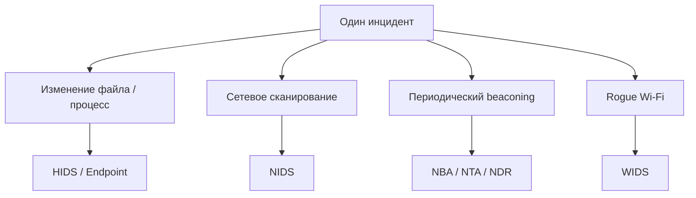
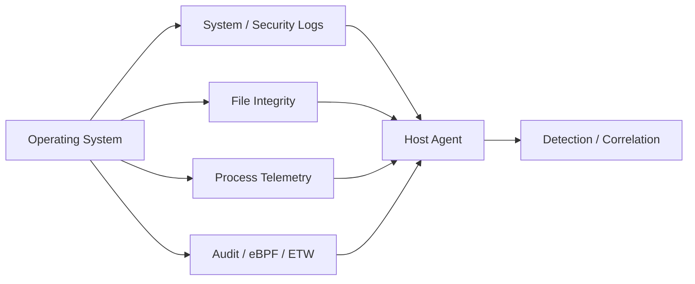
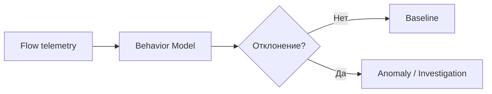

# Классификация IDPS: почему одной системы недостаточно

<div class="page-goal">
<strong>После раздела:</strong> вы должны понимать не только названия NIDS/HIDS/WIDS/NBA, но и <em>что каждая система реально видит, откуда получает данные, как работает под капотом, что в ней настраивается и где находится её слепая зона</em>.
</div>

## Сначала проблема

Представим один инцидент.

На рабочей станции пользователя:

1. появился вредоносный процесс;
2. он изменил конфигурационный файл;
3. затем начал сканировать внутреннюю сеть;
4. после этого каждые 45 секунд устанавливает HTTPS-соединение наружу;
5. атакующий одновременно поднял rogue Wi‑Fi AP рядом с офисом.

Один сенсор не имеет полной видимости всех этих событий.



Именно **источник telemetry** определяет сильные и слабые стороны каждого класса.

---

# 1. NIDS / NIPS — Network-based

## Что она наблюдает

NIDS видит данные, проходящие через точку сетевого наблюдения:

- Ethernet/IP;
- TCP/UDP;
- сетевые потоки;
- HTTP;
- DNS;
- TLS metadata;
- признаки сканирования;
- сигнатуры атак;
- протокольные аномалии.

## Как это работает под капотом


NIDS должна решить несколько сложных задач:

- восстановить поток из пакетов;
- понять направление;
- определить приложение;
- нормализовать данные;
- применить правила.

## Где её ставят

Примеры:

```text
Internet edge
DMZ
граница critical segment
между пользовательской и серверной сетью
```

## Что настраивает инженер

Например в Suricata:

- interfaces;
- `HOME_NET`;
- capture mode;
- rule files;
- flow/stream settings;
- protocol parsers;
- logging;
- thresholds;
- IPS mode.

## Сильная сторона

> Видит сетевое взаимодействие сразу многих узлов.

## Слабая сторона

> Не знает всего, что происходит внутри endpoint, и видит только тот трафик, который действительно проходит через сенсор.

В курсе: **Suricata**.

---

# 2. HIDS / HIPS — Host-based

## Что она наблюдает

HIDS находится ближе к самому endpoint.

Она может получать:

- process creation;
- file modifications;
- authentication events;
- users;
- registry/configuration changes;
- system calls/audit;
- FIM;
- security logs.

## Под капотом



### Пример

Атакующий изменил:

```text
/etc/ssh/sshd_config
```

Сетевая NIDS может вообще не увидеть сам факт изменения файла.

HIDS/FIM может сообщить:

```text
file modified
old hash
new hash
timestamp
user/process context
```

## Что настраивает инженер

- monitored paths;
- exclusions;
- audit rules;
- log sources;
- FIM frequency/realtime;
- detection rules;
- agent/server communication;
- active response.

## Сильная сторона

> Глубокая видимость конкретного хоста.

## Слабая сторона

> Требует deployment/agents и не заменяет network-wide visibility.

В курсе: **Wazuh**.

---

# 3. WIDS / WIPS — Wireless

Wi‑Fi — это отдельная среда со своими объектами:

- access points;
- BSSID/SSID;
- management frames;
- channels;
- association;
- authentication;
- deauthentication.

Обычная NIDS на Ethernet не даёт полной картины радиоэфира.

```mermaid
flowchart LR
    AP1[Corporate AP] -. 802.11 .-> STA[Client]
    ROGUE[Rogue AP] -. radio .-> STA
    WIDS[WIDS Sensor] -. monitors .-> AP1
    WIDS -. monitors .-> ROGUE
```

## Что можно обнаруживать

- Rogue AP;
- unauthorized SSID;
- подозрительные deauthentication frames;
- нарушения политики WLAN;
- неизвестные устройства.

## Что настраивается

- разрешённые SSID/BSSID;
- каналы;
- policies;
- sensor coverage;
- alert thresholds.

## Ограничение

Нужна подходящая беспроводная telemetry и hardware support.

Поэтому в нашем курсе теория будет полноценной, а практику WIDS мы сделаем через PCAP/802.11 traces либо отдельный стенд при наличии Wi‑Fi hardware.

---

# 4. NBA / NTA / NDR — поведение сети

Теперь представим, что payload зашифрован и нет известной сигнатуры.

Но host делает:

```text
10:00:00 → C2
10:00:45 → C2
10:01:29 → C2
10:02:15 → C2
```

Это может быть интересно даже без знания HTTP payload.

## Что анализируется

- source/destination;
- ports;
- duration;
- bytes;
- packet counts;
- periodicity;
- unusual peers;
- direction;
- baseline deviations.



## Что настраивается

Зависит от продукта:

- monitored networks;
- flow sources;
- retention;
- baselines;
- thresholds;
- behavioral analytics;
- enrichment/context.

В курсе часть таких задач будем изучать с **Zeek** и flow telemetry.

---

# 5. Принципиальное отличие — не бренд, а vantage point

Сравним одно событие:

> На сервере появился web shell, затем сервер начал соединяться наружу.

| Источник | Что может увидеть |
|---|---|
| NIDS | входящий exploit-like request, новый outbound connection |
| HIDS | создание/изменение файла, процесс, пользователя |
| NBA/NDR | новый peer, необычную периодичность/объём |
| WIDS | почти ничего, если событие не связано с Wi‑Fi |

Главная мысль:

> **Каждая система видит мир из своей точки наблюдения.**

---

# 6. Что выбрать в реальной инфраструктуре

Неправильный вопрос:

> Какая IDS самая лучшая?

Правильные вопросы:

1. Какие активы защищаем?
2. Какие угрозы рассматриваем?
3. Какая telemetry нужна?
4. Где её можно получить?
5. Какие слепые зоны останутся?
6. Что требуется обнаруживать автоматически?
7. Где prevention допустим?

---

## Профессиональный кейс

В SOC пришёл alert:

> `Internal host performed network scan`

NIDS видит scan.

Что ещё может понадобиться?

- HIDS: какой процесс запустил соединения?
- Identity: какой пользователь вошёл?
- EDR: был ли process suspicious?
- Asset context: насколько важен host?
- Zeek/flows: куда ещё он обращался?

Так из **одного сетевого сигнала** строится контекст расследования.

---

## Самопроверка

<div class="quiz" data-question-id="class-real-1">
  <p><strong>Какой источник лучше всего подтвердит, что файл `/etc/passwd` был изменён?</strong></p>
  <button data-choice="a">A. Только NIDS</button>
  <button data-choice="b" data-correct="true">B. HIDS/FIM или host audit telemetry</button>
  <button data-choice="c">C. WIDS</button>
  <button data-choice="d">D. Только NetFlow</button>
  <div class="quiz-feedback"></div>
</div>

<div class="quiz" data-question-id="class-real-2">
  <p><strong>Почему NIDS на интернет-периметре может не увидеть lateral movement между двумя внутренними серверами?</strong></p>
  <button data-choice="a">A. NIDS не умеет TCP</button>
  <button data-choice="b">B. Внутренний трафик всегда шифруется</button>
  <button data-choice="c" data-correct="true">C. Этот трафик может вообще не проходить через точку наблюдения сенсора</button>
  <button data-choice="d">D. Потому что lateral movement обнаруживается только WIDS</button>
  <div class="quiz-feedback"></div>
</div>

??? question "Что из этого реально будем настраивать руками?"
    В первой части курса — **Suricata NIDS/NIPS**. Затем **Wazuh HIDS/FIM**. Позже — **Zeek/flow telemetry** для сетевого поведения. Это позволит не просто запомнить классификацию, а сравнить источники данных практически.

<div class="next-step">
<strong>Дальше:</strong> разберём, <a href="../03-detection/">как NIDS превращает реальные пакеты в протокольные данные и alert</a>.
</div>
