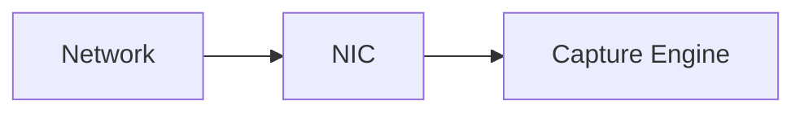
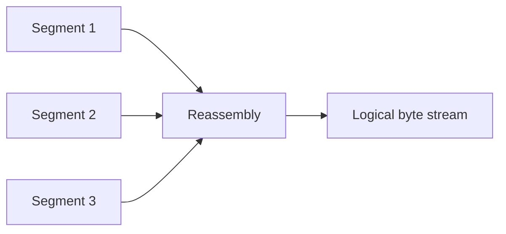
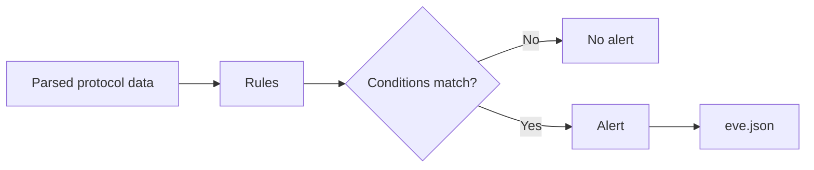

# Как работает обнаружение: от сетевой карты до alert

<div class="page-goal">
<strong>Зачем это знать:</strong> если вы не понимаете detection pipeline, вы не сможете объяснить, почему правило не сработало, почему сработало дважды, почему IDS пропустила атаку или почему разные инструменты видят один пакет по-разному.
</div>

## Ситуация из работы

Вы написали сигнатуру:

```text
content:"/etc/passwd";
```

Отправили тестовый запрос.

Alert не появился.

Новичок говорит:

> «Suricata сломалась».

Инженер начинает задавать вопросы:

- сенсор вообще получил пакет?
- пакет относится к нужному flow?
- TCP-поток собран?
- Suricata определила HTTP?
- URI был нормализован?
- правило загружено?
- направление `to_server` правильное?
- трафик не был TLS-encrypted?

Чтобы так рассуждать, нужно понимать pipeline.

---

# 1. Packet Capture

Первый вопрос:

> **Получил ли сенсор данные?**

Источники могут быть разными:

- физический интерфейс;
- SPAN;
- TAP;
- AF_PACKET;
- NFQUEUE;
- PCAP offline.

Если пакет до сенсора не дошёл — никакая сигнатура не поможет.



---

# 2. Decode

Система должна разобрать заголовки:

```text
Ethernet
  ↓
IPv4 / IPv6
  ↓
TCP / UDP / ICMP
```

Проверяются:

- адреса;
- флаги;
- длины;
- protocol numbers;
- checksums/структура;
- encapsulation.

Это фундамент дальнейшего анализа.

---

# 3. Flow Tracking

IDS рассматривает не только отдельный пакет.

Она связывает пакеты в логическое взаимодействие.

Упрощённый tuple:

```text
src_ip
src_port
dst_ip
dst_port
protocol
```

Suricata присваивает событиям одного взаимодействия `flow_id`, что позволяет связать:

```text
flow
http
tls
alert
```

---

# 4. TCP Stream Reassembly

HTTP request может быть разбит между несколькими TCP-сегментами.

Например:

```text
Segment 1: GET /download?file=../
Segment 2: ../etc/passwd HTTP/1.1
```

Если система искала бы только в отдельных пакетах, строка могла бы никогда не встретиться целиком.

Поэтому IDS восстанавливает TCP stream.



Позже мы увидим, что именно на reassembly построена часть IDS evasion-техник.

---

# 5. Application Layer Parser

После восстановления потока нужно понять приложение.

HTTP содержит логические элементы:

```text
Method
URI
Host
Headers
Body
Status
```

Вместо поиска по произвольному payload правило может сказать:

> анализировать именно нормализованный HTTP URI.

Например:

```text
http.uri;
content:"/etc/passwd";
```

Это называется **protocol-aware detection**.

---

# 6. Detection Engine

Упрощённо:



Правило может учитывать:

- protocol;
- direction;
- flow state;
- IP/port;
- content;
- normalized fields;
- PCRE;
- threshold;
- metadata.

---

# 7. Разберём одно правило

```text
alert http any any -> $HOME_NET 80 (
    msg:"LAB Test HTTP Detection";
    flow:established,to_server;
    http.uri;
    content:"/lab-test";
    sid:1000001;
    rev:1;
)
```

```yaml
# Ментальная модель правила
action: alert
protocol: http
source: any:any
direction: to protected network
destination_port: 80
flow: established, to_server
buffer: http.uri
condition: contains "/lab-test"
sid: 1000001
revision: 1
```

### `alert`
Что сделать при совпадении.

### `http`
На каком протокольном уровне применять правило.

### `$HOME_NET`
К защищаемой области.

### `flow:established,to_server`
Не любой пакет, а установленный поток в сторону сервера.

### `http.uri`
Работать с URI, который выделил HTTP parser.

### `content`
Условие match.

### `sid`
Уникальный ID нашего правила.

---

# 8. Что появляется в EVE JSON

Один alert может содержать:

```json
{
  "event_type": "alert",
  "src_ip": "192.168.50.10",
  "dest_ip": "192.168.50.20",
  "dest_port": 80,
  "flow_id": 123456,
  "alert": {
    "signature_id": 1000001,
    "signature": "LAB Test HTTP Detection"
  }
}
```

В реальной работе это важно, потому что JSON может отправляться дальше:

```text
Suricata
  ↓
EVE JSON
  ↓
Log collector / SIEM
  ↓
Correlation
  ↓
SOC analyst
```

---

# 9. Почему правило может не сработать

### Visibility problem
Сенсор не получил трафик.

### Direction problem
Неправильно задан `to_server` / `to_client`.

### Protocol problem
Трафик не распознан как HTTP.

### Encryption
HTTP находится внутри TLS.

### Normalization
Вы ищете representation, которое parser преобразовал.

### Rule management
Файл правила не подключён или rule disabled.

### Flow state
Условие `established` не выполняется.

Именно поэтому debugging IDS — это последовательная инженерная проверка, а не случайное редактирование сигнатуры.

---

## Профессиональная задача

На собеседовании или в работе вас могут спросить:

> Почему IDS не увидела строку, которая точно была «в сети»?

Сильный ответ:

> Я сначала проверю capture/visibility, затем flow/stream reconstruction, protocol identification, нужный sticky buffer, normalization, direction и только потом саму content-condition.

Вот зачем нужно понимать pipeline.

---

## Самопроверка

<div class="quiz" data-question-id="det-real-1">
  <p><strong>HTTP URI разделён между несколькими TCP-сегментами. Какой механизм позволяет IDS анализировать его как единый поток?</strong></p>
  <button data-choice="a">A. DNS resolver</button>
  <button data-choice="b" data-correct="true">B. TCP stream reassembly</button>
  <button data-choice="c">C. WIDS</button>
  <button data-choice="d">D. Только firewall state table</button>
  <div class="quiz-feedback"></div>
</div>

<div class="quiz" data-question-id="det-real-2">
  <p><strong>Почему `http.uri` полезнее поиска строки по любому payload?</strong></p>
  <button data-choice="a">A. Он отключает TCP</button>
  <button data-choice="b" data-correct="true">B. Он ограничивает detection логическим HTTP-полем, выделенным протокольным parser-ом</button>
  <button data-choice="c">C. Он автоматически расшифровывает TLS</button>
  <button data-choice="d">D. Он заменяет HOME_NET</button>
  <div class="quiz-feedback"></div>
</div>

<div class="next-step">
<strong>Дальше:</strong> теперь можно осмысленно сравнить <a href="../04-firewall-vs-idps/">контроль доступа firewall и detection/prevention в IDPS</a>.
</div>
