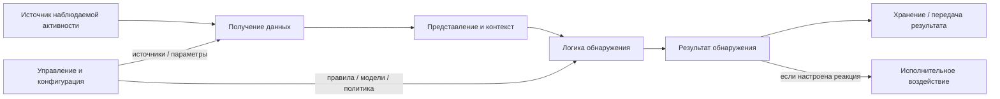
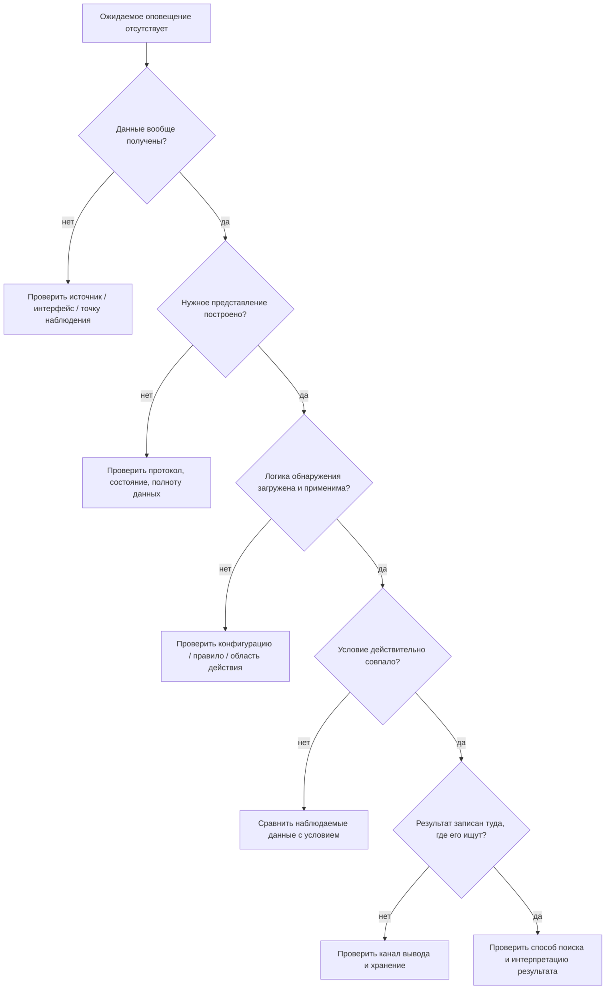

# Глава 3. Из чего состоит IDS/IPS и как она работает

<div class="chapter-lead">
<p>Теперь мы знаем, зачем нужны IDS/IPS и почему существуют разные виды систем наблюдения. Но пока сама IDS остаётся для нас «чёрным ящиком»: данные каким-то образом попадают внутрь, после чего появляется оповещение.</p>
<p>В этой главе разберём <strong>функциональное устройство IDS/IPS</strong>: кто получает данные, где выполняется анализ, где хранятся правила и настройки, как формируется результат и как система управляется.</p>
</div>

<div class="chapter-outcomes">
<strong>После изучения главы студент должен уметь:</strong>
<p>объяснить роль сенсора и агента; отличить сбор данных от анализа; объяснить назначение правил, моделей и настроек; различать результат обнаружения, хранение событий и управление системой; понимать, что функциональные компоненты не обязаны быть отдельными физическими устройствами.</p>
</div>

---

## 1. IDS/IPS — это не одна «коробка»

В первой главе мы использовали простую схему:

```text
трафик → IDS → оповещение
```

Она полезна для знакомства с идеей обнаружения, но ничего не говорит о внутреннем устройстве системы.

В реальной IDS/IPS можно выделить несколько **функциональных задач**.

<div class="idps-figure" markdown="1">
<div class="idps-figure__label">СХЕМА 1 · ФУНКЦИОНАЛЬНАЯ ДЕКОМПОЗИЦИЯ IDS/IPS</div>



<p class="idps-figure__caption">Это функциональная схема, а не обязательная внутренняя цепочка конкретного продукта. Реализация может объединять функции в одном процессе или распределять их между несколькими компонентами.</p>
</div>

Главная идея:

<div class="idps-equation idps-equation--primary">
  <div class="idps-equation__expression">
    <span>ФУНКЦИЯ</span><b>≠</b><span>ФИЗИЧЕСКИЙ КОМПОНЕНТ</span>
  </div>
  <p>Несколько функций могут выполняться одним процессом или устройством, а одна функция может быть распределена между несколькими узлами.</p>
</div>

В блоке хранения ниже используется аббревиатура **SIEM** — система централизованного управления информацией и событиями безопасности (Security Information and Event Management). Английское раскрытие приведено только для происхождения общепринятой аббревиатуры; далее достаточно `SIEM`.

<div class="idps-switcher" data-idps-switcher>
  <div class="idps-switcher__header">
    <strong>Разберите функциональную схему по одной задаче</strong>
    <p>Переключатель не показывает обязательный порядок исполнения конкретного продукта. Он помогает отделить назначение функций и границы выводов.</p>
  </div>
  <div class="idps-switcher__controls" aria-label="Функциональные задачи IDS/IPS">
    <button id="chapter3-control-acquire" class="idps-switcher__button" type="button" aria-controls="chapter3-panel-acquire" data-idps-switch="acquire">Получение</button>
    <button id="chapter3-control-represent" class="idps-switcher__button" type="button" aria-controls="chapter3-panel-represent" data-idps-switch="represent">Представление</button>
    <button id="chapter3-control-detect" class="idps-switcher__button" type="button" aria-controls="chapter3-panel-detect" data-idps-switch="detect">Обнаружение</button>
    <button id="chapter3-control-result" class="idps-switcher__button" type="button" aria-controls="chapter3-panel-result" data-idps-switch="result">Результат</button>
    <button id="chapter3-control-store" class="idps-switcher__button" type="button" aria-controls="chapter3-panel-store" data-idps-switch="store">Хранение</button>
    <button id="chapter3-control-act" class="idps-switcher__button" type="button" aria-controls="chapter3-panel-act" data-idps-switch="act">Воздействие</button>
  </div>
  <div class="idps-switcher__panels">
    <section id="chapter3-panel-acquire" class="idps-switcher__panel" data-idps-panel="acquire"><h3 class="idps-switcher__panel-title">Получение данных</h3><div class="idps-question-model"><div class="idps-question-model__cell"><span>Вход</span><strong>Трафик, события ОС, журналы, радиокадры или другой доступный источник</strong></div><div class="idps-question-model__cell"><span>Функция</span><strong>Доставить наблюдаемое представление в систему</strong></div><div class="idps-question-model__cell"><span>Не доказывает</span><strong>Что угроза уже обнаружена</strong></div><div class="idps-question-model__boundary"><strong>Проверяемый вопрос:</strong> нужные данные вообще дошли до системы?</div></div></section>
    <section id="chapter3-panel-represent" class="idps-switcher__panel" data-idps-panel="represent"><h3 class="idps-switcher__panel-title">Представление и контекст</h3><div class="idps-question-model"><div class="idps-question-model__cell"><span>Вход</span><strong>Полученные данные</strong></div><div class="idps-question-model__cell"><span>Функция</span><strong>Сформировать подходящее представление: пакет, поток, событие, протокольный контекст и т. п.</strong></div><div class="idps-question-model__cell"><span>Не доказывает</span><strong>Что условие обнаружения совпало</strong></div><div class="idps-question-model__boundary"><strong>Проверяемый вопрос:</strong> существует ли представление, к которому применима нужная логика?</div></div></section>
    <section id="chapter3-panel-detect" class="idps-switcher__panel" data-idps-panel="detect"><h3 class="idps-switcher__panel-title">Логика обнаружения</h3><div class="idps-question-model"><div class="idps-question-model__cell"><span>Вход</span><strong>Подходящее представление данных</strong></div><div class="idps-question-model__cell"><span>Функция</span><strong>Применить правило, условие или модель</strong></div><div class="idps-question-model__cell"><span>Не доказывает</span><strong>Инцидент или компрометацию</strong></div><div class="idps-question-model__boundary"><strong>Проверяемый вопрос:</strong> логика загружена, применима и её условие действительно совпало?</div></div></section>
    <section id="chapter3-panel-result" class="idps-switcher__panel" data-idps-panel="result"><h3 class="idps-switcher__panel-title">Результат обнаружения</h3><div class="idps-question-model"><div class="idps-question-model__cell"><span>Форма</span><strong>Оповещение, событие, оценка, метка или дополнительный контекст</strong></div><div class="idps-question-model__cell"><span>Функция</span><strong>Зафиксировать вывод детектора относительно доступных данных</strong></div><div class="idps-question-model__cell"><span>Не равно</span><strong>Месту хранения результата</strong></div><div class="idps-question-model__boundary"><strong>Проверяемый вопрос:</strong> какой именно результат сформирован и на основании каких данных?</div></div></section>
    <section id="chapter3-panel-store" class="idps-switcher__panel" data-idps-panel="store"><h3 class="idps-switcher__panel-title">Хранение и передача</h3><div class="idps-question-model"><div class="idps-question-model__cell"><span>Вход</span><strong>Сформированный результат и сопутствующие события</strong></div><div class="idps-question-model__cell"><span>Функция</span><strong>Записать или передать их в файл, хранилище, SIEM, консоль или API</strong></div><div class="idps-question-model__cell"><span>Не является</span><strong>Самим механизмом обнаружения</strong></div><div class="idps-question-model__boundary"><strong>Проверяемый вопрос:</strong> где искать результат и мог ли он потеряться на этапе вывода?</div></div></section>
    <section id="chapter3-panel-act" class="idps-switcher__panel" data-idps-panel="act"><h3 class="idps-switcher__panel-title">Исполнительное воздействие</h3><div class="idps-question-model"><div class="idps-question-model__cell"><span>Основание</span><strong>Результат обнаружения + политика реакции</strong></div><div class="idps-question-model__cell"><span>Функция</span><strong>Выполнить предусмотренное действие локально или через внешний механизм</strong></div><div class="idps-question-model__cell"><span>Не обязано</span><strong>Находиться в том же компоненте, где выполнено обнаружение</strong></div><div class="idps-question-model__boundary"><strong>Проверяемый вопрос:</strong> какое средство реально выполнило воздействие и подтверждено ли оно?</div></div></section>
  </div>
</div>

Например, небольшая IDS может работать на одной машине: она получает трафик, анализирует его и пишет события локально. В крупной инфраструктуре сенсоры могут передавать результаты на отдельные серверы управления и хранения.

---

## 2. Сенсор и агент: кто получает наблюдаемую активность

В классической терминологии IDPS обычно используют два слова:

<div class="idps-grid idps-grid--2">
  <article class="idps-card idps-card--sensor">
    <span class="idps-card__eyebrow">СЕНСОР</span>
    <strong class="idps-card__title">Наблюдает среду</strong>
    <p>Чаще используется для сетевых и беспроводных систем: получает доступное представление трафика или радиообмена.</p>
  </article>
  <article class="idps-card idps-card--sensor">
    <span class="idps-card__eyebrow">АГЕНТ</span>
    <strong class="idps-card__title">Работает на узле</strong>
    <p>Чаще используется для хостовых систем: получает доступ к настроенным событиям конкретной операционной системы или приложения.</p>
  </article>
</div>

В NIST SP 800-94 используются соответствующие английские термины `sensor` и `agent`; далее в курсе мы используем русские термины **сенсор** и **агент**.

Но важно не превращать терминологию в физический закон. Нас интересует функция:

> **какой компонент реально получает данные о наблюдаемой активности?**

### Сетевой пример

<div class="idps-grid idps-grid--3">
  <article class="idps-card idps-card--endpoint">
    <span class="idps-card__eyebrow">ОСНОВНОЙ ПОТОК</span>
    <strong class="idps-card__title">Клиент ↔ сервер</strong>
    <p>Сетевое взаимодействие существует независимо от сенсора.</p>
  </article>
  <article class="idps-card idps-card--observation">
    <span class="idps-card__eyebrow">ТОЧКА НАБЛЮДЕНИЯ</span>
    <strong class="idps-card__title">Доступный сетевой след</strong>
    <p>Именно здесь определяется, какое представление трафика вообще может быть передано сенсору.</p>
  </article>
  <article class="idps-card idps-card--sensor">
    <span class="idps-card__eyebrow">СЕНСОР NIDS</span>
    <strong class="idps-card__title">Получает доступные данные</strong>
    <p>Сенсор не создаёт сетевое событие: он анализирует доступное ему представление уже происходящего взаимодействия.</p>
  </article>
</div>

### Хостовый пример

<div class="idps-grid idps-grid--3">
  <article class="idps-card idps-card--source">
    <span class="idps-card__eyebrow">ИСТОЧНИК</span>
    <strong class="idps-card__title">ОС и приложения</strong>
    <p>Процессы, файлы, аудит, журналы и другие локальные события существуют на наблюдаемом узле.</p>
  </article>
  <article class="idps-card idps-card--sensor">
    <span class="idps-card__eyebrow">АГЕНТ HIDS</span>
    <strong class="idps-card__title">Получает настроенную телеметрию</strong>
    <p>Агент имеет только тот доступ и тот набор источников, которые реально предоставлены ему конфигурацией.</p>
  </article>
  <article class="idps-card idps-card--interpretation">
    <span class="idps-card__eyebrow">ГРАНИЦА</span>
    <strong class="idps-card__title">Установлен ≠ видит всё</strong>
    <p>Наличие агента само по себе не доказывает наблюдаемость всех процессов, файлов и действий пользователя.</p>
  </article>
</div>

### Один эпизод — несколько наблюдаемых следов

Один и тот же HTTP-запрос может быть представлен разными артефактами в зависимости от точки наблюдения и включённых источников данных. При этом результат обнаружения, запись приложения и событие аудита — не одно и то же: каждый артефакт имеет собственную доказательную силу и должен интерпретироваться в контексте своей точки наблюдения. В примере хостовым источником выступает **подсистема аудита Linux**; в англоязычной документации она называется `Linux Audit`, поэтому это название приводится один раз для узнавания источника.

<div class="idps-figure">
  <div class="idps-figure__label">СХЕМА · ОДИН HTTP-ЗАПРОС — ТРИ НЕЗАВИСИМЫХ СВИДЕТЕЛЬСТВА</div>
  <div class="idps-observation-story">
    <div class="idps-observation-story__path">
      <div class="idps-route-node idps-route-node--endpoint">Клиент<br><small>отправляет HTTP-запрос</small></div>
      <div class="idps-route-arrow">→</div>
      <div class="idps-route-node idps-route-node--observation">Точка наблюдения<br><small>видит сетевой путь</small></div>
      <div class="idps-route-arrow">→</div>
      <div class="idps-route-node idps-route-node--endpoint">Сервер / приложение<br><small>получает запрос</small></div>
    </div>
    <div class="idps-observation-story__evidence">
      <article class="idps-card idps-card--sensor">
        <span class="idps-card__eyebrow">СЕТЕВОЕ СВИДЕТЕЛЬСТВО</span>
        <strong class="idps-card__title">Копия трафика → NIDS</strong>
        <p>При совпадении условия система может сформировать оповещение. Оно подтверждает результат обнаружения, а не инцидент сам по себе.</p>
      </article>
      <article class="idps-card idps-card--source">
        <span class="idps-card__eyebrow">ПРИКЛАДНОЕ СВИДЕТЕЛЬСТВО</span>
        <strong class="idps-card__title">Лог приложения</strong>
        <p>Может подтвердить получение или обработку запроса, если соответствующее событие действительно журналируется.</p>
      </article>
      <article class="idps-card idps-card--source">
        <span class="idps-card__eyebrow">ХОСТОВОЕ СВИДЕТЕЛЬСТВО</span>
        <strong class="idps-card__title">Подсистема аудита Linux</strong>
        <p>Может подтвердить действие процесса или изменение объекта, если это действие входит в настроенную область аудита.</p>
      </article>
    </div>
    <div class="idps-observation-story__boundary">
      <strong>Интерпретация:</strong>
      <span>каждый артефакт подтверждает только зафиксированный им факт; оповещение ≠ инцидент; отсутствие оповещения ≠ отсутствие трафика; причинную связь между артефактами нужно обосновывать отдельно.</span>
    </div>
  </div>
  <div class="idps-figure__caption">Точка наблюдения — логическое место на пути трафика. NIDS, журнал приложения и подсистема аудита Linux дают разные виды свидетельств и не заменяют друг друга.</div>
</div>

---

## 3. Получение данных и обнаружение — не одно и то же

Пусть NIDS подключена к нужному сетевому сегменту.

Это означает только, что система **может получить** некоторый трафик при корректной конфигурации.

Но ещё не означает, что выполнены все условия, необходимые для ожидаемого результата.

<div class="idps-figure">
  <div class="idps-figure__label">ДИАГНОСТИЧЕСКИЕ ВОРОТА · ЧТО ПРОВЕРЯЕТСЯ ПЕРЕД ВЫВОДОМ «ДЕТЕКТОР НЕ СРАБОТАЛ»</div>
  <div class="idps-gates">
    <div class="idps-gate"><span>1 · ИСТОЧНИК</span><strong>Нужная активность доступна?</strong><small>Событие вообще проходит через выбранную область наблюдения.</small></div>
    <div class="idps-gate"><span>2 · ПОЛУЧЕНИЕ</span><strong>Данные реально захвачены?</strong><small>Выбран правильный интерфейс, агент или другой источник.</small></div>
    <div class="idps-gate"><span>3 · ПРЕДСТАВЛЕНИЕ</span><strong>Есть нужный контекст?</strong><small>Система смогла сформировать представление, требуемое условию.</small></div>
    <div class="idps-gate"><span>4 · ЛОГИКА</span><strong>Детектор загружен и применим?</strong><small>Правило, модель или другая логика действительно активны.</small></div>
    <div class="idps-gate"><span>5 · СОВПАДЕНИЕ</span><strong>Условие выполнено?</strong><small>Наблюдаемые значения действительно соответствуют условию.</small></div>
  </div>
  <div class="idps-figure__caption">Это порядок диагностических вопросов для конкретного ожидаемого результата, а не утверждение об обязательном внутреннем конвейере обработки каждой IDS/IPS.</div>
</div>

Поэтому полезно разделять два вопроса:

<div class="idps-grid idps-grid--2">
  <article class="idps-card idps-card--source">
    <span class="idps-card__eyebrow">СБОР</span>
    <strong class="idps-card__title">Какие данные получила система?</strong>
    <p>Интерфейс, агент, журнал, поток событий, радиоканал, API или другой источник.</p>
  </article>
  <article class="idps-card">
    <span class="idps-card__eyebrow">АНАЛИЗ</span>
    <strong class="idps-card__title">Что система сделала с полученными данными?</strong>
    <p>Построила контекст, применила правило или модель, сформировала результат.</p>
  </article>
</div>

<div class="idps-equation idps-equation--warning">
  <div class="idps-equation__expression">
    <span>ДАННЫЕ ПОЛУЧЕНЫ</span><b>≠</b><span>УГРОЗА ОБНАРУЖЕНА</span>
  </div>
  <p>Система может успешно собирать телеметрию и не иметь условия, которое выделяет конкретную активность.</p>
</div>

И наоборот, корректная логика обнаружения бесполезна для конкретного события, если нужные данные до механизма анализа не дошли.

---

## 4. Представление данных: система анализирует не только «сырые пакеты»

Полученная информация часто преобразуется в более удобную структуру.

Для сети одно и то же полученное взаимодействие может быть представлено на разных уровнях — в зависимости от возможностей реализации и задачи детектора.

<div class="idps-figure">
  <div class="idps-figure__label">СЕТЕВЫЕ ПРЕДСТАВЛЕНИЯ · ВЕТВЛЕНИЕ, А НЕ ОБЯЗАТЕЛЬНЫЙ ЛИНЕЙНЫЙ КОНВЕЙЕР</div>
  <div class="idps-fanout">
    <div class="idps-fanout__origin"><strong>Полученные сетевые данные</strong><small>То, что реально доступно системе в выбранной точке наблюдения.</small></div>
    <div class="idps-fanout__arrow" aria-hidden="true">↠</div>
    <div class="idps-fanout__targets">
      <div class="idps-fanout__target"><strong>Поля пакета</strong><small>Адреса, флаги, типы и другие доступные признаки.</small></div>
      <div class="idps-fanout__target"><strong>Поток / состояние соединения</strong><small>Агрегированный или контекстный взгляд на взаимодействие.</small></div>
      <div class="idps-fanout__target"><strong>Восстановленные TCP-данные</strong><small>Контекст, формируемый из нескольких сегментов, если это требуется и возможно.</small></div>
      <div class="idps-fanout__target"><strong>Прикладной контекст</strong><small>Например, HTTP, DNS или доступные свойства TLS-сеанса.</small></div>
    </div>
  </div>
  <div class="idps-figure__caption">Стрелка означает «из доступных данных могут быть получены разные представления», а не «каждый пакет обязан последовательно пройти все четыре стадии».</div>
</div>

Для хоста действует тот же принцип: агент или другой механизм может работать с несколькими типами локальных представлений.

<div class="idps-fanout">
  <div class="idps-fanout__origin"><strong>Доступная хостовая телеметрия</strong><small>Набор зависит от ОС, аудита, прав и конфигурации.</small></div>
  <div class="idps-fanout__arrow" aria-hidden="true">↠</div>
  <div class="idps-fanout__targets">
    <div class="idps-fanout__target"><strong>Событие аудита</strong><small>Зафиксированное действие, если соответствующий аудит включён.</small></div>
    <div class="idps-fanout__target"><strong>Сведения о процессе</strong><small>Процесс, пользователь и другие доступные атрибуты.</small></div>
    <div class="idps-fanout__target"><strong>Изменение файла</strong><small>Событие или состояние контролируемого объекта.</small></div>
    <div class="idps-fanout__target"><strong>Журнал / аутентификация</strong><small>Запись, которую реально сформировал и сохранил источник.</small></div>
  </div>
</div>

Это исправляет распространённую ошибку: обнаружение не обязано начинаться только после восстановления TCP-потока и разбора прикладного протокола. В документации сетевых движков восстановление потока часто называется `reassembly`; английский термин нужен только для чтения такой документации. Например, интересующее условие может относиться непосредственно к IP/TCP-полям или событию декодирования.

---

## 5. Где находится логика обнаружения

После того как системе доступно нужное представление, применяется **логика обнаружения**.

Она отвечает на вопрос:

> **какое условие должно быть выполнено, чтобы система выделила активность как интересующую?**

Логика может быть представлена в разных формах:

<div class="idps-chip-list" aria-label="Примеры форм логики обнаружения">
  <span class="idps-chip">правило</span>
  <span class="idps-chip">сигнатура</span>
  <span class="idps-chip">пороговое условие</span>
  <span class="idps-chip">модель состояния протокола</span>
  <span class="idps-chip">поведенческая последовательность</span>
  <span class="idps-chip">статистическая или иная модель</span>
</div>

Подробно методы обнаружения разбираются в Главе 5. Здесь важно другое:

<div class="idps-equation idps-equation--primary">
  <div class="idps-equation__expression">
    <span>ЛОГИКА ОБНАРУЖЕНИЯ</span><b>+</b><span>ПОДХОДЯЩИЕ ДАННЫЕ</span>
  </div>
  <p>Ожидаемый результат возможен только тогда, когда системе одновременно доступны нужное представление и применимая к нему логика.</p>
</div>

### Почему правила вообще нужны

Без формализованного условия система не знает, какую активность из огромного потока данных необходимо выделить.

Простейший учебный пример:

```text
если путь HTTP-запроса содержит LAB-MARKER
→ сформировать оповещение
```

Сейчас нас не интересует синтаксис Suricata. Важно понять назначение правила: оно превращает человеческую идею «обрати внимание на такой признак» в условие, которое может выполнить машина.

---

## 6. Результат обнаружения и хранение — разные функции

Когда условие выполнено, система формирует результат.

Это может быть:

<div class="idps-chip-list" aria-label="Примеры результатов обнаружения">
  <span class="idps-chip">событие</span><span class="idps-chip">оповещение</span><span class="idps-chip">оценка риска</span><span class="idps-chip">метка</span><span class="idps-chip">дополнительный контекст</span>
</div>

После этого результат можно передать или сохранить в одном или нескольких местах.

<div class="idps-figure">
  <div class="idps-figure__label">РЕЗУЛЬТАТ И КАНАЛЫ ВЫВОДА · ОДИН РЕЗУЛЬТАТ МОЖЕТ ИМЕТЬ НЕСКОЛЬКО НАЗНАЧЕНИЙ</div>
  <div class="idps-fanout">
    <div class="idps-fanout__origin idps-fanout__origin--result"><strong>Результат обнаружения</strong><small>Вывод детектора относительно доступных данных.</small></div>
    <div class="idps-fanout__arrow" aria-hidden="true">↠</div>
    <div class="idps-fanout__targets">
      <div class="idps-fanout__target"><strong>Файл / журнал</strong><small>Например, структурированная запись события.</small></div>
      <div class="idps-fanout__target"><strong>SIEM / центральное хранилище</strong><small>Передача для последующей корреляции и поиска.</small></div>
      <div class="idps-fanout__target"><strong>Консоль / интерфейс</strong><small>Отображение результата оператору.</small></div>
      <div class="idps-fanout__target"><strong>API / другая система</strong><small>Передача результата внешнему потребителю или механизму реакции.</small></div>
    </div>
  </div>
  <div class="idps-figure__caption">Формирование результата и место, где этот результат оказался записан или показан, — разные функции.</div>
</div>

Например, в наших лабораториях Suricata формирует структурированные записи в `eve.json`. Сам файл не является «детектором»: это один из каналов вывода результата.

<div class="idps-equation idps-equation--warning">
  <div class="idps-equation__expression">
    <span>РЕЗУЛЬТАТ ОБНАРУЖЕНИЯ</span><b>≠</b><span>МЕСТО ХРАНЕНИЯ</span>
  </div>
  <p>Файл, база данных или SIEM могут содержать результат, но не становятся от этого механизмом, который его сформировал.</p>
</div>

---

## 7. Управление: откуда берутся конфигурация и правила

IDS/IPS должна быть настроена.

Управляющая часть задаёт параметры, которые влияют на несколько разных функций системы.

<div class="idps-figure">
  <div class="idps-figure__label">УПРАВЛЕНИЕ И КОНФИГУРАЦИЯ · ОДНА ПОЛИТИКА ВЛИЯЕТ НА НЕСКОЛЬКО ФУНКЦИЙ</div>
  <div class="idps-fanout">
    <div class="idps-fanout__origin"><strong>Управление / конфигурация</strong><small>Локальная конфигурация или централизованный сервер — в зависимости от реализации.</small></div>
    <div class="idps-fanout__arrow" aria-hidden="true">↠</div>
    <div class="idps-fanout__targets">
      <div class="idps-fanout__target"><strong>Источники и параметры сбора</strong><small>Какой интерфейс, агент, журнал или другой источник используется.</small></div>
      <div class="idps-fanout__target"><strong>Правила, модели и область действия</strong><small>Какая логика загружена и к каким данным она применима.</small></div>
      <div class="idps-fanout__target"><strong>Каналы вывода</strong><small>Куда отправляются события и результаты.</small></div>
      <div class="idps-fanout__target"><strong>Политика реакции</strong><small>Разрешено ли исполнительное воздействие и каким механизмом.</small></div>
    </div>
  </div>
</div>

<div class="idps-grid idps-grid--3 idps-grid--compact">
  <article class="idps-card idps-card--sensor"><span class="idps-card__eyebrow">СЕНСОРЫ / АГЕНТЫ</span><strong class="idps-card__title">Получают доступные данные</strong><p>Анализ может выполняться здесь же или в другом компоненте.</p></article>
  <article class="idps-card"><span class="idps-card__eyebrow">ХРАНЕНИЕ</span><strong class="idps-card__title">События и результаты</strong><p>Могут храниться локально или централизованно.</p></article>
  <article class="idps-card idps-card--interpretation"><span class="idps-card__eyebrow">КОНСОЛЬ</span><strong class="idps-card__title">Управление и просмотр</strong><p>Интерфейс оператора не обязан быть местом, где физически выполняется обнаружение.</p></article>
</div>

Классический NIST SP 800-94 перечисляет типичные компоненты IDPS: сенсоры или агенты, серверы управления, серверы хранения событий и консоли. При этом небольшие системы могут работать без отдельного сервера управления.

---

## 8. Где появляется предотвращение

Предотвращение требует не только результата обнаружения, но и **решения о реакции** и механизма, способного выполнить воздействие.

<div class="idps-process">
  <div class="idps-process__step idps-process__step--source"><span>1</span><strong>Наблюдаемая активность</strong><small>Доступные системе данные о происходящем событии.</small></div>
  <div class="idps-process__arrow">→</div>
  <div class="idps-process__step idps-process__step--result"><span>2</span><strong>Результат обнаружения</strong><small>Условие выделило активность как интересующую.</small></div>
  <div class="idps-process__arrow">→</div>
  <div class="idps-process__step"><span>3</span><strong>Решение о реакции</strong><small>Политика определяет, требуется ли воздействие.</small></div>
  <div class="idps-process__arrow">→</div>
  <div class="idps-process__step"><span>4</span><strong>Исполнительное воздействие</strong><small>Локальное отбрасывание/отклонение пакета (`drop`/`reject`) или команда внешнему средству — если архитектура это поддерживает.</small></div>
</div>

<div class="idps-evidence-grid idps-evidence-grid--compact">
  <article class="idps-evidence idps-evidence--supported"><span>МОЖЕТ БЫТЬ ЛОКАЛЬНО</span><p>Компонент обнаружения сам способен выполнить предусмотренное действие, например отбросить трафик в поддерживаемом режиме.</p></article>
  <article class="idps-evidence idps-evidence--not-proven"><span>НЕ ОБЯЗАНО БЫТЬ В ОДНОМ МЕСТЕ</span><p>Обнаружение и исполнительное воздействие могут быть распределены между разными компонентами системы.</p></article>
</div>

Поэтому нельзя определять IPS только формулой «сенсор подключён в разрыв (`inline`)». Подробно размещение и режимы подключения разбираются в Главе 4.

---

## 9. Как это выглядит на примере Suricata

Suricata в нашем курсе — не определение IDS, а удобная реализация для экспериментов. В её документации структурированный формат событий называется **EVE JSON**; это буквальное имя формата продукта, поэтому оно сохраняется без перевода. Файл `eve.json` — один из возможных каналов записи таких событий, а не сам механизм обнаружения.

Упрощённое соответствие функций выглядит так:

<div class="idps-axis-table-wrap">
  <table class="idps-axis-table">
    <thead><tr><th>Функциональная задача</th><th>Пример в Suricata</th><th>Что важно не перепутать</th></tr></thead>
    <tbody>
      <tr><th>Получение данных</th><td data-label="Пример в Suricata">Сетевой интерфейс или файл захвата пакетов в формате pcap (`PCAP`, от англ. *packet capture*; обозначение сохраняется для связи с инструментами и документацией анализа трафика)</td><td data-label="Что важно не перепутать">Сам источник трафика ещё не является детектором.</td></tr>
      <tr><th>Представление</th><td data-label="Пример в Suricata">Пакеты, потоки, состояние, доступный протокольный контекст</td><td data-label="Что важно не перепутать">Это не один универсальный обязательный путь для каждого условия.</td></tr>
      <tr><th>Обнаружение</th><td data-label="Пример в Suricata">Правила и встроенная логика движка</td><td data-label="Что важно не перепутать">Условие работает только с тем представлением, к которому оно применимо.</td></tr>
      <tr><th>Результат обнаружения</th><td data-label="Пример в Suricata">Сформированное движком оповещение, событие или иной результат выполненной логики</td><td data-label="Что важно не перепутать">Результат — это семантический итог детектора, а не имя файла или канала вывода.</td></tr>
      <tr><th>Вывод / хранение</th><td data-label="Пример в Suricata">EVE JSON и другие настроенные выходы</td><td data-label="Что важно не перепутать"><code>eve.json</code> сериализует и хранит настроенные записи; сам файл не выполняет обнаружение.</td></tr>
    </tbody>
  </table>
</div>

Это не означает, что каждый блок соответствует отдельному процессу ОС. Это **функциональное отображение**, помогающее понять эксперимент.

---

## 10. Почему отсутствие оповещения нельзя объяснять одной причиной

Представим:

> тестовый HTTP-запрос отправлен, но ожидаемого оповещения нет.

Возможны совершенно разные причины:

<div class="idps-figure" markdown="1">
<div class="idps-figure__label">СХЕМА 3 · ГДЕ МОЖЕТ РАЗОРВАТЬСЯ ОЖИДАЕМАЯ ЦЕПОЧКА</div>



<p class="idps-figure__caption">Одинаковый внешний симптом — «нет оповещения» — может возникать на разных функциональных уровнях. Поэтому диагностика начинается не с хаотичного переписывания правила, а с последовательной проверки фактов.</p>
</div>

Эта схема станет основой дальнейших лабораторных работ.

---

## 11. Что нужно запомнить

<div class="idps-summary-grid">
  <article class="idps-summary-card"><span>01</span><strong>СЕНСОР / АГЕНТ ≠ ВСЯ IDS</strong><p>Получение данных — только одна функция системы.</p></article>
  <article class="idps-summary-card"><span>02</span><strong>СБОР ДАННЫХ ≠ ОБНАРУЖЕНИЕ</strong><p>Телеметрия может поступать, но нужного детектора может не быть.</p></article>
  <article class="idps-summary-card"><span>03</span><strong>ОБНАРУЖЕНИЕ ≠ ХРАНЕНИЕ</strong><p>Решение детектора и запись результата в журнал или SIEM — разные функции.</p></article>
  <article class="idps-summary-card"><span>04</span><strong>ФУНКЦИОНАЛЬНАЯ СХЕМА ≠ ФИЗИЧЕСКАЯ ТОПОЛОГИЯ</strong><p>Компоненты могут быть объединены или распределены в зависимости от реализации.</p></article>
</div>

---

## 12. Проверка понимания

<div class="quiz" data-question-id="chapter3-v220-q1">
  <p><strong>Suricata успешно получает HTTP-трафик с интерфейса, но нужное правило не загружено. Какой вывод корректен?</strong></p>
  <button data-choice="a">A. Получение трафика автоматически означает, что атака будет обнаружена</button>
  <button data-choice="b" data-correct="true">B. Сбор данных работает, но требуемая логика обнаружения отсутствует</button>
  <button data-choice="c">C. Нужно обязательно менять точку наблюдения</button>
  <button data-choice="d">D. Это доказывает неисправность сетевого интерфейса</button>
  <div class="quiz-feedback"></div>
</div>

<div class="quiz" data-question-id="chapter3-v220-q2">
  <p><strong>Почему схема «пакет → TCP-поток → HTTP → обнаружение» не является универсальным устройством любой NIDS?</strong></p>
  <button data-choice="a">A. TCP не используется в сетях</button>
  <button data-choice="b">B. HTTP всегда анализируется до IP</button>
  <button data-choice="c" data-correct="true">C. Разные детекторы могут работать на разных представлениях данных</button>
  <button data-choice="d">D. IDS анализирует только файлы журналов</button>
  <div class="quiz-feedback"></div>
</div>

<div class="quiz" data-question-id="chapter3-v220-q3">
  <p><strong>Какую функцию выполняет файл eve.json в нашей лаборатории Suricata?</strong></p>
  <button data-choice="a">A. Он является точкой захвата сетевого трафика</button>
  <button data-choice="b">B. Он заменяет правило обнаружения</button>
  <button data-choice="c" data-correct="true">C. Он является одним из каналов записи структурированных результатов работы системы</button>
  <button data-choice="d">D. Он автоматически подтверждает успешную компрометацию</button>
  <div class="quiz-feedback"></div>
</div>

<div class="next-step">
<strong>Практическое закрепление:</strong> теперь выполните <a href="../../labs/lab01/">ЛР №1 — «Первое сетевое обнаружение»</a>, затем <a href="../../labs/lab02/">ЛР №2 — «Один эпизод, два источника данных»</a>. После них переходите к <a href="../04-detection-methods/">Главе 4</a>, где функциональная модель связывается с физической сетью и появляется вопрос, <strong>в какой точке сенсор вообще может получить нужный трафик</strong>.
</div>

---

## Источники и границы главы

- NIST SP 800-94 — классическая функциональная модель компонентов IDPS: сенсор/агент, сервер управления, сервер хранения событий, консоль.
- Suricata User Guide — источник для конкретных механизмов запуска и EVE JSON, используемых в лабораториях.
- Схемы этой главы являются **учебной функциональной декомпозицией**, а не утверждением о внутреннем устройстве каждого продукта.

Актуальные ссылки собраны в разделе [«Источники курса»](../../resources/sources/).
