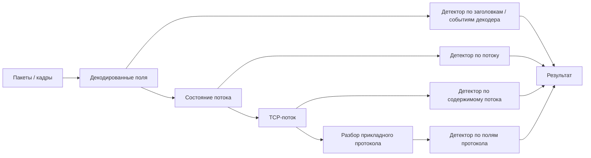

# Глава 3. Как из данных получается обнаружение

<div class="chapter-lead">
<p>В предыдущей главе мы разобрали, откуда IDPS получает данные. Но наличие пакетов, журналов или событий ещё ничего не обнаруживает само по себе. Между «система увидела данные» и «аналитик получил оповещение» находится целая цепочка обработки.</p>

<p>Эта глава отвечает на один центральный вопрос: <strong>как система превращает сырые наблюдения в решение о том, что событие заслуживает внимания?</strong></p>
</div>

<div class="chapter-outcomes">
<strong>После этой главы вы должны уметь объяснить:</strong>
<p>почему IDPS сначала должна понять структуру данных, зачем восстанавливается состояние сетевого взаимодействия, чем отличается разбор протокола от собственно детектирования, почему одно и то же правило может сработать или не сработать в зависимости от того, какие данные дошли до движка, и на каком этапе искать причину отсутствующего оповещения.</p>
</div>

---

## 1. Почему нельзя просто искать «опасную строку» в каждом пакете

Для первого знакомства с IDS часто приводят упрощённый пример:

```text
если встретилась строка "../" → создать alert
```

Он полезен, чтобы показать сам принцип правила, но реальная система работает сложнее.

Представим HTTP-запрос:

```http
X-Lab-Marker: ATTACK-LAB-STREAM-MARKER HTTP/1.1
Host: example.local
```

В сети этот запрос может быть разбит на несколько TCP-сегментов. Часть строки окажется в одном сегменте, часть — в другом. Кроме того, сенсор должен понять, что перед ним именно HTTP-запрос, где находится URI, к какому соединению относятся пакеты и в каком порядке их нужно рассматривать.

Поэтому часть задач требует предварительного построения контекста — например восстановления TCP-потока или разбора HTTP. Но это **не универсальная граница начала обнаружения**: отдельные детекторы могут работать уже по полям заголовков, событиям декодера или характеристикам пакета. Глубина необходимого представления зависит от конкретной задачи.

---

## 2. Не единый pipeline, а несколько представлений данных

Сетевой движок не обязан всегда проходить одну линейную цепочку «packet → stream → HTTP → detection». Разные детекторы могут работать на разных представлениях.

<div class="teaching-figure" markdown="1">
<div class="figure-label">СХЕМА · НА КАКОМ ПРЕДСТАВЛЕНИИ МОЖЕТ РАБОТАТЬ ДЕТЕКТОР</div>



<div class="figure-caption">Это не обязательная последовательность стадий. Схема показывает семейства представлений: конкретный детектор использует только те из них, которые нужны его условию.</div>
</div>

Следовательно, отсутствие оповещения нужно диагностировать относительно **конкретного представления**, которое требуется детектору: пакет, поток, восстановленный TCP-поток, поле прикладного протокола и т. д.

---

## 3. Первый этап: система должна получить данные

Начнём с самого очевидного шага, который на практике часто оказывается причиной проблем.

Если нужный трафик не доходит до сенсора, движок обнаружения не может ничего с ним сделать.

Например, правило должно обнаруживать HTTP-запрос к веб-серверу, но сенсор подключён к участку сети, через который этот трафик вообще не проходит. Сервис IDS может быть запущен, правила загружены, журналирование работает — а ожидаемого события всё равно не будет.

Поэтому первая проверка инженера звучит не:

> «Правильная ли у меня сигнатура?»

а:

> **«Получает ли система те данные, в которых я ожидаю увидеть событие?»**

Именно поэтому в следующих главах мы отдельно разберём размещение сенсоров и способы подачи трафика.

---

## 4. Декодирование: из байтов в структуру сети

Получив кадр, система должна понять его структуру.

На этом этапе из последовательности байтов извлекаются значения полей сетевых протоколов:

```text
Ethernet
   ↓
IP
   ↓
TCP / UDP
   ↓
дальнейший анализ
```

Например, из IP-заголовка можно получить адрес источника и назначения, а из TCP — порты и управляющие признаки соединения.

Декодирование не следует считать стадией, на которой обнаружение «ещё невозможно». Некорректное или запрещённое значение заголовка само может быть объектом детектора. Для других задач декодированные поля лишь становятся основой более глубокого контекста.

На этом уровне система отвечает на вопрос:

> **Какие сетевые структуры и значения доступны для дальнейшего анализа?**

Если входные данные повреждены, протокол не поддерживается или пакет не удаётся корректно разобрать, дальнейшая обработка может измениться или завершиться раньше ожидаемого.

---

## 5. Поток и состояние: пакеты нужно связать между собой

Сетевое взаимодействие почти никогда не состоит из одного изолированного пакета.

Поэтому IDS объединяет связанные пакеты в **сетевой поток (flow)** — логическое представление взаимодействия между двумя сторонами.

Для TCP этого недостаточно: прикладные данные могут быть разделены между несколькими сегментами. Чтобы анализировать их как единое содержимое, система восстанавливает последовательность TCP-данных. Этот процесс называют **реассемблированием TCP-потока (TCP stream reassembly)**.

Представим, что опасная строка передана так:

```text
TCP segment 1:  X-Lab-Marker: ATTACK-LAB-
TCP segment 2:  STREAM-MARKER
```

Если искать только внутри каждого отдельного сегмента, нужная последовательность может вообще не существовать ни в одном из них целиком.

После восстановления система получает логическую последовательность:

```text
GET /download?file=../../etc/passwd
```

И только теперь дальнейший анализ становится намного надёжнее.

Это также объясняет, почему техники уклонения часто атакуют не саму сигнатуру, а **способ, которым сенсор восстанавливает поток**. К этой проблеме мы вернёмся позже отдельно.

---

## 6. Разбор прикладного протокола: контекст важнее строки

После восстановления потока система может распознать прикладной протокол.

Для HTTP она способна разделить запрос на смысловые части:

```text
method      → GET
uri         → /download?file=../../etc/passwd
host        → example.local
user-agent  → ...
```

Это принципиально отличается от поиска текста во всём сетевом потоке.

Если правило говорит:

> искать `../` именно в URI HTTP-запроса,

оно работает с **контекстом протокола**, а не с любой случайной строкой `../`, которая встретилась где угодно.

Это помогает уменьшить количество ненужных совпадений и позволяет писать правила точнее.

В продуктах конкретные названия нормализованных полей и внутренних буферов отличаются. В практической части мы увидим их на примере Suricata, но принцип остаётся общим:

> **сначала система понимает структуру протокола, затем правило обращается к нужной части этой структуры.**

---

## 7. Логика обнаружения может работать на разных представлениях

Когда требуемое для конкретной задачи представление доступно, к нему применяется **логика обнаружения**. Для одного правила достаточно полей IP/TCP, другому нужен поток, третьему — URI HTTP-запроса.

Она может быть разной.

Сигнатурный подход ищет заранее определённые признаки. Например, сочетание протокола, направления, URI и конкретной последовательности.

Поведенческий подход может оценивать уже не одну строку, а характер взаимодействия: частоту, последовательность событий, отклонение от нормального поведения.

Проверка состояния протокола может выявлять действия, которые не соответствуют ожидаемой логике его работы.

Несмотря на различия, общий принцип один:

```text
подготовленные данные
        ↓
условие / правило / модель
        ↓
совпало?
   ┌────┴────┐
   │         │
  нет        да
   │         │
дальше     результат
```

И здесь важно не смешивать два понятия.

**Разбор данных** отвечает на вопрос:

> что произошло технически?

**Детектирование** отвечает:

> соответствует ли это интересующему нас условию?

---

## 8. Что именно создаёт система после совпадения

Когда условие выполнено, появляется результат обработки.

В режиме IDS это обычно **оповещение (alert)** или другое зарегистрированное событие.

В режиме IPS к результату может добавляться действие: например, пакет или соединение не пропускаются дальше.

Но даже здесь система не превращается в следователя.

Если правило обнаружило:

```text
../../etc/passwd
```

это означает:

> наблюдаемые данные совпали с условием обнаружения.

Чтобы утверждать, что файл действительно был прочитан, сервер уязвим или произошла компрометация, нужны дополнительные данные: ответ сервера, журналы приложения, хостовая телеметрия и контекст инцидента.

---

## 9. Почему правило может не сработать, хотя «атака была»

Теперь у нас есть модель, которая позволяет диагностировать проблему без гадания.

Предположим, тестовый запрос отправлен, но оповещения нет.

Вместо того чтобы сразу переписывать правило, инженер проверяет цепочку по порядку:

```text
Данные дошли до сенсора?
        ↓
Пакет корректно декодирован?
        ↓
Поток и направление определены?
        ↓
TCP-данные восстановлены?
        ↓
Протокол распознан?
        ↓
Нужное поле действительно содержит искомое значение?
        ↓
Правило загружено и применимо к этому трафику?
        ↓
Оповещение записывается туда, где мы его ищем?
```

Это гораздо полезнее, чем вопрос:

> «Почему Suricata не работает?»

Потому что теперь проблема разбита на проверяемые технические этапы.

<div class="diagnostic-chain">
  <button data-diagnostic="capture">1. Есть данные?</button>
  <button data-diagnostic="decode">2. Понятна структура?</button>
  <button data-diagnostic="flow">3. Собран поток?</button>
  <button data-diagnostic="parser">4. Распознан протокол?</button>
  <button data-diagnostic="rule">5. Применилось правило?</button>
  <button data-diagnostic="output">6. Есть результат?</button>

  <div class="diagnostic-result">
    Выберите этап — здесь появится вопрос, который инженер должен проверить.
  </div>
</div>

---

## 10. Что инженер должен уметь после понимания этой цепочки

Теперь установка и настройка IDS/IPS перестают быть набором команд.

Когда инженер меняет конфигурацию, он должен понимать, **на какой этап обработки влияет параметр**.

Настройка интерфейса влияет на получение данных. Настройка отслеживания потоков влияет на состояние соединений. Включение или отключение разборщика протокола влияет на доступный контекст. Правила влияют уже на этап детектирования. Настройки журналирования определяют, где окажется результат.

Поэтому грамотная эксплуатация строится не вокруг запоминания всех параметров, а вокруг понимания пути данных.

> Если вы знаете, на каком этапе возникла проблема, вы уже значительно сузили область поиска.

---

## 11. Инженерный кейс: почему реконструкция потока действительно важна

Проблема несовпадения того, что «видит» сетевой IDS, и того, что в итоге обрабатывает конечный хост, известна давно.

В исторически важной работе **Thomas Ptacek и Timothy Newsham, _Insertion, Evasion, and Denial of Service: Eluding Network Intrusion Detection_**, исследователи анализировали способы расхождения между тем, как сетевой IDS и конечный хост интерпретируют IP/TCP-трафик. Работа относится к IDS и сетевым стекам своего времени; мы используем её как фундаментальный пример проблемы неоднозначного представления трафика, а не как утверждение о наличии тех же конкретных уязвимостей в современных версиях Suricata.

Практический смысл исследования очень близок к тому, что мы разобрали в этой главе.

Если IDS реконструирует поток одним способом, а конечная операционная система — другим, злоумышленник может попытаться добиться ситуации:

```text
IDS видит:   безопасная последовательность
Host видит:  другая последовательность
```

Исследователи показали, что проверенные ими IDS того времени были уязвимы к различным insertion/evasion-подходам. Важность этой работы в том, что она продемонстрировала: **корректный detection зависит не только от текста сигнатуры, но и от точности всей предшествующей реконструкции протокольного состояния**.

<div class="real-case-lesson">
  <strong>Инженерный вывод</strong>
  <p>Если движок неверно собрал поток, идеальная сигнатура будет применена к неверному представлению данных. Поэтому troubleshooting и тестирование должны включать packet capture, state tracking и reassembly, а не только проверку файла правил.</p>
</div>

Современные NIDS значительно сложнее систем конца 1990-х, но сам класс проблемы не исчез. Хорошая практика включает stateful analysis, корректную обработку reassembly, учёт особенностей защищаемых хостов и тестирование детекторов на фрагментированных, out-of-order и других нетривиальных потоках.

<div class="real-case-source">
<strong>Источник:</strong>
<a href="https://www.cerias.purdue.edu/apps/reports_and_papers/view/1397">Ptacek &amp; Newsham — Insertion, Evasion and Denial of Service: Eluding Network Intrusion Detection</a>
</div>


## 12. Проверьте понимание на практике

<div class="quiz" data-question-id="chapter3-q1">
  <p><strong>Правило ищет строку, которая разделена между двумя TCP-сегментами. Какой механизм особенно важен для корректного обнаружения?</strong></p>
  <button data-choice="a">A. Только DNS-кэш</button>
  <button data-choice="b" data-correct="true">B. Восстановление TCP-потока</button>
  <button data-choice="c">C. Только изменение уровня severity</button>
  <button data-choice="d">D. FIM</button>
  <div class="quiz-feedback"></div>
</div>

<div class="quiz" data-question-id="chapter3-q2">
  <p><strong>Зачем правилу работать с разобранным полем URI, а не искать строку во всём потоке без контекста?</strong></p>
  <button data-choice="a">A. Чтобы полностью отключить TCP</button>
  <button data-choice="b">B. Чтобы IDS могла видеть процессы ОС</button>
  <button data-choice="c" data-correct="true">C. Чтобы искать признак именно в нужной части протокольного сообщения и уменьшать случайные совпадения</button>
  <button data-choice="d">D. Чтобы заменить межсетевой экран</button>
  <div class="quiz-feedback"></div>
</div>

<div class="quiz" data-question-id="chapter3-q3">
  <p><strong>Тестовый запрос отправлен, но alert отсутствует. Какой подход наиболее правильный?</strong></p>
  <button data-choice="a">A. Сразу переписать правило</button>
  <button data-choice="b">B. Увеличить severity</button>
  <button data-choice="c" data-correct="true">C. Последовательно проверить путь данных от получения трафика до формирования результата</button>
  <button data-choice="d">D. Установить второй экземпляр IDS</button>
  <div class="quiz-feedback"></div>
</div>

<div class="next-step">
<strong>Следующий вопрос курса:</strong> мы уже знаем, как данные доходят до движка обнаружения. Теперь разберём, <a href="../04-detection-methods/">по какому принципу система решает, что наблюдаемое событие является подозрительным</a>.
</div>
