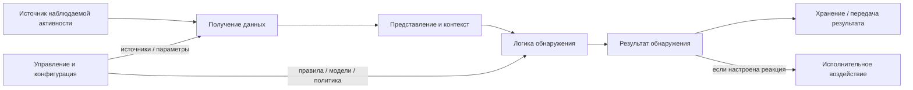
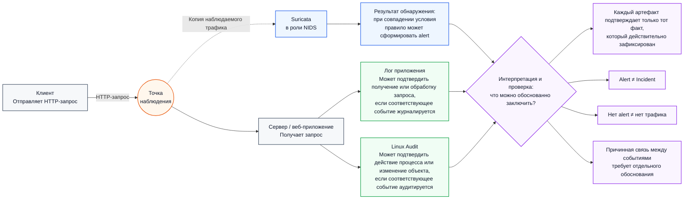
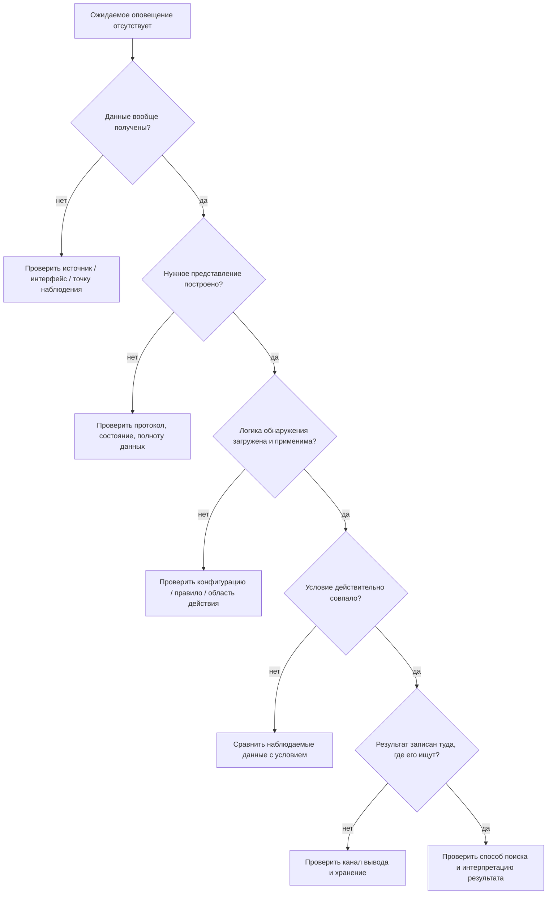

# Глава 3. Из чего состоит IDS/IPS и как она работает

<div class="chapter-lead">
<p>Теперь мы знаем, зачем нужны IDS/IPS и почему существуют разные виды систем наблюдения. Но пока сама IDS остаётся для нас «чёрным ящиком»: данные каким-то образом попадают внутрь, после чего появляется оповещение.</p>
<p>В этой главе разберём <strong>функциональное устройство IDS/IPS</strong>: кто получает данные, где выполняется анализ, где хранятся правила и настройки, как формируется результат и как система управляется.</p>
</div>

<div class="chapter-outcomes">
<strong>После изучения главы студент должен уметь:</strong>
<p>объяснить роль сенсора и агента; отличить сбор данных от анализа; объяснить назначение правил, моделей и настроек; различать результат обнаружения, хранение событий и управление системой; понимать, что функциональные компоненты не обязаны быть отдельными физическими устройствами.</p>
</div>

---

## 1. IDS/IPS — это не одна «коробка»

В первой главе мы использовали простую схему:

```text
трафик → IDS → оповещение
```

Она полезна для знакомства с идеей обнаружения, но ничего не говорит о внутреннем устройстве системы.

В реальной IDS/IPS можно выделить несколько **функциональных задач**.

<div class="idps-figure" markdown="1">
<div class="idps-figure__label">СХЕМА 1 · ФУНКЦИОНАЛЬНАЯ ДЕКОМПОЗИЦИЯ IDS/IPS</div>



<p class="idps-figure__caption">Это функциональная схема, а не обязательная внутренняя цепочка конкретного продукта. Реализация может объединять функции в одном процессе или распределять их между несколькими компонентами.</p>
</div>

Главная идея:

<div class="idps-equation idps-equation--primary">
  <div class="idps-equation__expression">
    <span>ФУНКЦИЯ</span><b>≠</b><span>ФИЗИЧЕСКИЙ КОМПОНЕНТ</span>
  </div>
  <p>Несколько функций могут выполняться одним процессом или устройством, а одна функция может быть распределена между несколькими узлами.</p>
</div>

Например, небольшая IDS может работать на одной машине: она получает трафик, анализирует его и пишет события локально. В крупной инфраструктуре сенсоры могут передавать результаты на отдельные серверы управления и хранения.

---

## 2. Сенсор и агент: кто получает наблюдаемую активность

В классической терминологии IDPS обычно используют два слова:

<div class="idps-grid idps-grid--2">
  <article class="idps-card idps-card--sensor">
    <span class="idps-card__eyebrow">СЕНСОР</span>
    <strong class="idps-card__title">Наблюдает среду</strong>
    <p>Чаще используется для сетевых и беспроводных систем: получает доступное представление трафика или радиообмена.</p>
  </article>
  <article class="idps-card idps-card--sensor">
    <span class="idps-card__eyebrow">АГЕНТ</span>
    <strong class="idps-card__title">Работает на узле</strong>
    <p>Чаще используется для хостовых систем: получает доступ к настроенным событиям конкретной операционной системы или приложения.</p>
  </article>
</div>

В NIST SP 800-94 используются соответствующие английские термины `sensor` и `agent`; далее в курсе мы используем русские термины **сенсор** и **агент**.

Но важно не превращать терминологию в физический закон. Нас интересует функция:

> **какой компонент реально получает данные о наблюдаемой активности?**

### Сетевой пример

<div class="idps-grid idps-grid--3">
  <article class="idps-card idps-card--endpoint">
    <span class="idps-card__eyebrow">ОСНОВНОЙ ПОТОК</span>
    <strong class="idps-card__title">Клиент ↔ сервер</strong>
    <p>Сетевое взаимодействие существует независимо от сенсора.</p>
  </article>
  <article class="idps-card idps-card--observation">
    <span class="idps-card__eyebrow">ТОЧКА НАБЛЮДЕНИЯ</span>
    <strong class="idps-card__title">Доступный сетевой след</strong>
    <p>Именно здесь определяется, какое представление трафика вообще может быть передано сенсору.</p>
  </article>
  <article class="idps-card idps-card--sensor">
    <span class="idps-card__eyebrow">СЕНСОР NIDS</span>
    <strong class="idps-card__title">Получает доступные данные</strong>
    <p>Сенсор не создаёт сетевое событие: он анализирует доступное ему представление уже происходящего взаимодействия.</p>
  </article>
</div>

### Хостовый пример

<div class="idps-grid idps-grid--3">
  <article class="idps-card idps-card--source">
    <span class="idps-card__eyebrow">ИСТОЧНИК</span>
    <strong class="idps-card__title">ОС и приложения</strong>
    <p>Процессы, файлы, аудит, журналы и другие локальные события существуют на наблюдаемом узле.</p>
  </article>
  <article class="idps-card idps-card--sensor">
    <span class="idps-card__eyebrow">АГЕНТ HIDS</span>
    <strong class="idps-card__title">Получает настроенную телеметрию</strong>
    <p>Агент имеет только тот доступ и тот набор источников, которые реально предоставлены ему конфигурацией.</p>
  </article>
  <article class="idps-card idps-card--interpretation">
    <span class="idps-card__eyebrow">ГРАНИЦА</span>
    <strong class="idps-card__title">Установлен ≠ видит всё</strong>
    <p>Наличие агента само по себе не доказывает наблюдаемость всех процессов, файлов и действий пользователя.</p>
  </article>
</div>

### Один эпизод — несколько наблюдаемых следов

Один и тот же HTTP-запрос может быть представлен разными артефактами в зависимости от точки наблюдения и включённых источников данных. При этом результат обнаружения, запись приложения и событие аудита — не одно и то же: каждый артефакт имеет собственную доказательную силу и должен интерпретироваться в контексте своей точки наблюдения.

<div class="idps-figure" markdown="1">
<div class="idps-figure__label">СХЕМА 2 · ОДИН HTTP-ЗАПРОС — РАЗНЫЕ ТОЧКИ НАБЛЮДЕНИЯ</div>



<p class="idps-figure__caption">Точка наблюдения обозначает логическое место на пути трафика, а не конкретный способ получения копии. Suricata формирует результат обнаружения из доступного сетевого представления; лог приложения и Linux Audit являются отдельными источниками хостовых и прикладных свидетельств. Совместная интерпретация этих артефактов не создаёт причинную связь автоматически.</p>
</div>

---

## 3. Получение данных и обнаружение — не одно и то же

Пусть NIDS подключена к нужному сетевому сегменту.

Это означает только, что система **может получить** некоторый трафик при корректной конфигурации.

Но ещё не означает, что:

```text
нужный интерфейс выбран;
пакеты действительно захватываются;
протокол распознан;
нужное правило загружено;
условие обнаружения совпало.
```

Поэтому полезно разделять два вопроса:

<div class="idps-grid idps-grid--2">
  <article class="idps-card idps-card--source">
    <span class="idps-card__eyebrow">СБОР</span>
    <strong class="idps-card__title">Какие данные получила система?</strong>
    <p>Интерфейс, агент, журнал, поток событий, радиоканал, API или другой источник.</p>
  </article>
  <article class="idps-card">
    <span class="idps-card__eyebrow">АНАЛИЗ</span>
    <strong class="idps-card__title">Что система сделала с полученными данными?</strong>
    <p>Построила контекст, применила правило или модель, сформировала результат.</p>
  </article>
</div>

<div class="idps-equation idps-equation--warning">
  <div class="idps-equation__expression">
    <span>ДАННЫЕ ПОЛУЧЕНЫ</span><b>≠</b><span>УГРОЗА ОБНАРУЖЕНА</span>
  </div>
  <p>Система может успешно собирать телеметрию и не иметь условия, которое выделяет конкретную активность.</p>
</div>

И наоборот, корректная логика обнаружения бесполезна для конкретного события, если нужные данные до механизма анализа не дошли.

---

## 4. Представление данных: система анализирует не только «сырые пакеты»

Полученная информация часто преобразуется в более удобную структуру.

Для сети это могут быть:

```text
поля пакета;
состояние соединения;
сетевой поток;
восстановленная последовательность TCP-данных;
HTTP-запрос;
DNS-запрос;
TLS-сеанс.
```

Для хоста это могут быть:

```text
событие аудита;
сведения о процессе;
изменение файла;
запись журнала;
событие аутентификации.
```

<div class="idps-figure">
  <div class="idps-figure__label">ПРЕДСТАВЛЕНИЯ ДАННЫХ · ОДИН ИСТОЧНИК НЕ ОЗНАЧАЕТ ОДИН ФОРМАТ АНАЛИЗА</div>
  <div class="idps-grid idps-grid--4 idps-grid--compact">
    <article class="idps-card"><span class="idps-card__eyebrow">ПАКЕТ</span><strong class="idps-card__title">Поля и признаки пакета</strong><p>Например, адреса, флаги, тип или код протокола.</p></article>
    <article class="idps-card"><span class="idps-card__eyebrow">ПОТОК</span><strong class="idps-card__title">Состояние взаимодействия</strong><p>Характеристики соединения или последовательности обмена.</p></article>
    <article class="idps-card"><span class="idps-card__eyebrow">ВОССТАНОВЛЕННЫЕ ДАННЫЕ</span><strong class="idps-card__title">Последовательность TCP-данных</strong><p>Контекст, полученный из нескольких сетевых сегментов.</p></article>
    <article class="idps-card"><span class="idps-card__eyebrow">ПРИКЛАДНОЙ КОНТЕКСТ</span><strong class="idps-card__title">HTTP, DNS, TLS и др.</strong><p>Структура протокола, если она доступна и распознана.</p></article>
  </div>
  <p class="idps-figure__caption">Конкретный детектор использует то представление, которое требуется его условию. Нет универсального требования «сначала полностью разобрать приложение, затем начинать обнаружение».</p>
</div>

Это исправляет распространённую ошибку: обнаружение не обязано начинаться только после TCP reassembly и разбора прикладного протокола. Например, интересующее условие может относиться непосредственно к IP/TCP-полям или событию декодирования.

---

## 5. Где находится логика обнаружения

После того как системе доступно нужное представление, применяется **логика обнаружения**.

Она отвечает на вопрос:

> **какое условие должно быть выполнено, чтобы система выделила активность как интересующую?**

Логика может быть представлена в разных формах:

```text
правило;
сигнатура;
пороговое условие;
модель состояния протокола;
поведенческая последовательность;
статистическая или иная модель.
```

Подробно методы обнаружения разбираются в Главе 5. Здесь важно другое:

<div class="idps-equation idps-equation--primary">
  <div class="idps-equation__expression">
    <span>ЛОГИКА ОБНАРУЖЕНИЯ</span><b>+</b><span>ПОДХОДЯЩИЕ ДАННЫЕ</span>
  </div>
  <p>Ожидаемый результат возможен только тогда, когда системе одновременно доступны нужное представление и применимая к нему логика.</p>
</div>

### Почему правила вообще нужны

Без формализованного условия система не знает, какую активность из огромного потока данных необходимо выделить.

Простейший учебный пример:

```text
если URI HTTP-запроса содержит LAB-MARKER
→ сформировать оповещение
```

Сейчас нас не интересует синтаксис Suricata. Важно понять назначение правила: оно превращает человеческую идею «обрати внимание на такой признак» в условие, которое может выполнить машина.

---

## 6. Результат обнаружения и хранение — разные функции

Когда условие выполнено, система формирует результат.

Это может быть:

```text
событие;
оповещение;
оценка риска;
метка;
дополнительный контекст.
```

После этого результат нужно куда-то передать или сохранить.

<div class="idps-grid idps-grid--3">
  <article class="idps-card idps-card--primary">
    <span class="idps-card__eyebrow">1 · ОБНАРУЖЕНИЕ</span>
    <strong class="idps-card__title">Механизм применяет условие</strong>
    <p>Здесь формируется решение детектора относительно доступных данных.</p>
  </article>
  <article class="idps-card idps-card--result">
    <span class="idps-card__eyebrow">2 · РЕЗУЛЬТАТ</span>
    <strong class="idps-card__title">Событие / оповещение / метка</strong>
    <p>Результат обнаружения — отдельный артефакт, а не место его хранения.</p>
  </article>
  <article class="idps-card">
    <span class="idps-card__eyebrow">3 · ВЫВОД И ХРАНЕНИЕ</span>
    <strong class="idps-card__title">Журнал · хранилище · SIEM · консоль</strong>
    <p>Один и тот же результат может быть записан или передан в несколько систем.</p>
  </article>
</div>

Например, в наших лабораториях Suricata формирует структурированные записи в `eve.json`. Сам файл не является «детектором»: это один из каналов вывода результата.

<div class="idps-equation idps-equation--warning">
  <div class="idps-equation__expression">
    <span>РЕЗУЛЬТАТ ОБНАРУЖЕНИЯ</span><b>≠</b><span>МЕСТО ХРАНЕНИЯ</span>
  </div>
  <p>Файл, база данных или SIEM могут содержать результат, но не становятся от этого механизмом, который его сформировал.</p>
</div>

---

## 7. Управление: откуда берутся конфигурация и правила

IDS/IPS должна быть настроена.

Управляющая часть может определять:

```text
какие источники данных использовать;
какие правила и политики загрузить;
какие сети считать внутренними;
какие протоколы и функции включить;
куда отправлять результаты;
разрешены ли действия предотвращения.
```

В небольшой системе настройки могут храниться локально. В крупном развёртывании возможна централизованная архитектура.

<div class="idps-grid idps-grid--4">
  <article class="idps-card">
    <span class="idps-card__eyebrow">УПРАВЛЕНИЕ</span>
    <strong class="idps-card__title">Сервер или локальная конфигурация</strong>
    <p>Определяет параметры, правила и политики, используемые системой.</p>
  </article>
  <article class="idps-card idps-card--sensor">
    <span class="idps-card__eyebrow">СБОР / АНАЛИЗ</span>
    <strong class="idps-card__title">Сенсоры и агенты</strong>
    <p>Получают доступные данные; в зависимости от реализации анализ может выполняться здесь же или в другом компоненте.</p>
  </article>
  <article class="idps-card">
    <span class="idps-card__eyebrow">ХРАНЕНИЕ</span>
    <strong class="idps-card__title">События и результаты</strong>
    <p>Могут храниться локально или централизованно в отдельной системе.</p>
  </article>
  <article class="idps-card">
    <span class="idps-card__eyebrow">ИНТЕРФЕЙС</span>
    <strong class="idps-card__title">Консоль оператора</strong>
    <p>Предоставляет доступ к управлению, наблюдению и просмотру результатов.</p>
  </article>
</div>

Классический NIST SP 800-94 перечисляет типичные компоненты IDPS: сенсоры или агенты, серверы управления, серверы хранения событий и консоли. При этом небольшие системы могут работать без отдельного сервера управления.

---

## 8. Где появляется предотвращение

Предотвращение требует не только результата обнаружения, но и **решения о реакции** и механизма, способного выполнить воздействие.

<div class="idps-process">
  <div class="idps-process__step idps-process__step--source"><span>1</span><strong>Наблюдаемая активность</strong><small>Доступные системе данные о происходящем событии.</small></div>
  <div class="idps-process__arrow">→</div>
  <div class="idps-process__step idps-process__step--result"><span>2</span><strong>Результат обнаружения</strong><small>Условие выделило активность как интересующую.</small></div>
  <div class="idps-process__arrow">→</div>
  <div class="idps-process__step"><span>3</span><strong>Решение о реакции</strong><small>Политика определяет, требуется ли воздействие.</small></div>
  <div class="idps-process__arrow">→</div>
  <div class="idps-process__step"><span>4</span><strong>Исполнительное воздействие</strong><small>Локальный drop/reject или команда внешнему средству — если архитектура это поддерживает.</small></div>
</div>

<div class="idps-evidence-grid idps-evidence-grid--compact">
  <article class="idps-evidence idps-evidence--supported"><span>МОЖЕТ БЫТЬ ЛОКАЛЬНО</span><p>Компонент обнаружения сам способен выполнить предусмотренное действие, например отбросить трафик в поддерживаемом режиме.</p></article>
  <article class="idps-evidence idps-evidence--not-proven"><span>НЕ ОБЯЗАНО БЫТЬ В ОДНОМ МЕСТЕ</span><p>Обнаружение и исполнительное воздействие могут быть распределены между разными компонентами системы.</p></article>
</div>

Поэтому нельзя определять IPS только формулой «сенсор стоит inline». Подробно размещение и режимы подключения разбираются в Главе 4.

---

## 9. Как это выглядит на примере Suricata

Suricata в нашем курсе — не определение IDS, а удобная реализация для экспериментов.

Упрощённое соответствие функций выглядит так:

<div class="idps-grid idps-grid--4">
  <article class="idps-card idps-card--source"><span class="idps-card__eyebrow">ПОЛУЧЕНИЕ ДАННЫХ</span><strong class="idps-card__title">Интерфейс / PCAP</strong><p>Suricata получает сетевой трафик из выбранного источника.</p></article>
  <article class="idps-card"><span class="idps-card__eyebrow">ПРЕДСТАВЛЕНИЕ</span><strong class="idps-card__title">Пакеты · потоки · протоколы</strong><p>Движок формирует представления, необходимые различным механизмам анализа.</p></article>
  <article class="idps-card idps-card--primary"><span class="idps-card__eyebrow">ОБНАРУЖЕНИЕ</span><strong class="idps-card__title">Правила и встроенная логика</strong><p>Условия применяются к подходящим представлениям данных.</p></article>
  <article class="idps-card idps-card--result"><span class="idps-card__eyebrow">ВЫВОД</span><strong class="idps-card__title">EVE JSON и другие выходы</strong><p>Результаты фиксируются в выбранных каналах вывода.</p></article>
</div>

Это не означает, что каждый блок соответствует отдельному процессу ОС. Это **функциональное отображение**, помогающее понять эксперимент.

---

## 10. Почему отсутствие оповещения нельзя объяснять одной причиной

Представим:

> тестовый HTTP-запрос отправлен, но ожидаемого оповещения нет.

Возможны совершенно разные причины:

<div class="idps-figure" markdown="1">
<div class="idps-figure__label">СХЕМА 3 · ГДЕ МОЖЕТ РАЗОРВАТЬСЯ ОЖИДАЕМАЯ ЦЕПОЧКА</div>



<p class="idps-figure__caption">Одинаковый внешний симптом — «нет оповещения» — может возникать на разных функциональных уровнях. Поэтому диагностика начинается не с хаотичного переписывания правила, а с последовательной проверки фактов.</p>
</div>

Эта схема станет основой дальнейших лабораторных работ.

---

## 11. Что нужно запомнить

<div class="idps-summary-grid">
  <article class="idps-summary-card"><span>01</span><strong>СЕНСОР / АГЕНТ ≠ ВСЯ IDS</strong><p>Получение данных — только одна функция системы.</p></article>
  <article class="idps-summary-card"><span>02</span><strong>СБОР ДАННЫХ ≠ ОБНАРУЖЕНИЕ</strong><p>Телеметрия может поступать, но нужного детектора может не быть.</p></article>
  <article class="idps-summary-card"><span>03</span><strong>ОБНАРУЖЕНИЕ ≠ ХРАНЕНИЕ</strong><p>Решение детектора и запись результата в журнал или SIEM — разные функции.</p></article>
  <article class="idps-summary-card"><span>04</span><strong>ФУНКЦИОНАЛЬНАЯ СХЕМА ≠ ФИЗИЧЕСКАЯ ТОПОЛОГИЯ</strong><p>Компоненты могут быть объединены или распределены в зависимости от реализации.</p></article>
</div>

---

## 12. Проверка понимания

<div class="quiz" data-question-id="chapter3-v220-q1">
  <p><strong>Suricata успешно получает HTTP-трафик с интерфейса, но нужное правило не загружено. Какой вывод корректен?</strong></p>
  <button data-choice="a">A. Получение трафика автоматически означает, что атака будет обнаружена</button>
  <button data-choice="b" data-correct="true">B. Сбор данных работает, но требуемая логика обнаружения отсутствует</button>
  <button data-choice="c">C. Нужно обязательно менять точку наблюдения</button>
  <button data-choice="d">D. Это доказывает неисправность сетевого интерфейса</button>
  <div class="quiz-feedback"></div>
</div>

<div class="quiz" data-question-id="chapter3-v220-q2">
  <p><strong>Почему схема «пакет → TCP-поток → HTTP → обнаружение» не является универсальным устройством любой NIDS?</strong></p>
  <button data-choice="a">A. TCP не используется в сетях</button>
  <button data-choice="b">B. HTTP всегда анализируется до IP</button>
  <button data-choice="c" data-correct="true">C. Разные детекторы могут работать на разных представлениях данных</button>
  <button data-choice="d">D. IDS анализирует только файлы журналов</button>
  <div class="quiz-feedback"></div>
</div>

<div class="quiz" data-question-id="chapter3-v220-q3">
  <p><strong>Какую функцию выполняет файл eve.json в нашей лаборатории Suricata?</strong></p>
  <button data-choice="a">A. Он является точкой захвата сетевого трафика</button>
  <button data-choice="b">B. Он заменяет правило обнаружения</button>
  <button data-choice="c" data-correct="true">C. Он является одним из каналов записи структурированных результатов работы системы</button>
  <button data-choice="d">D. Он автоматически подтверждает успешную компрометацию</button>
  <div class="quiz-feedback"></div>
</div>

<div class="next-step">
<strong>Практическое закрепление:</strong> теперь выполните <a href="../../labs/lab01/">ЛР №1 — «Первое сетевое обнаружение»</a>, затем <a href="../../labs/lab02/">ЛР №2 — «Один эпизод, два источника данных»</a>. После них переходите к <a href="../04-detection-methods/">Главе 4</a>, где функциональная модель связывается с физической сетью и появляется вопрос, <strong>в какой точке сенсор вообще может получить нужный трафик</strong>.
</div>

---

## Источники и границы главы

- NIST SP 800-94 — классическая функциональная модель компонентов IDPS: сенсор/агент, сервер управления, сервер хранения событий, консоль.
- Suricata User Guide — источник для конкретных механизмов запуска и EVE JSON, используемых в лабораториях.
- Схемы этой главы являются **учебной функциональной декомпозицией**, а не утверждением о внутреннем устройстве каждого продукта.

Актуальные ссылки собраны в разделе [«Источники курса»](../../resources/sources/).
