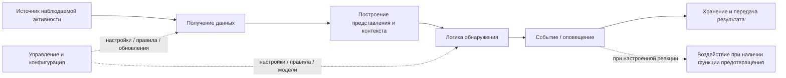
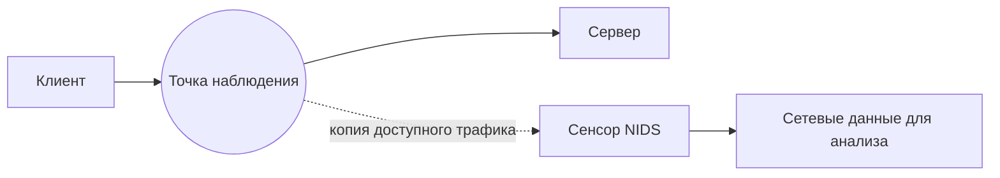
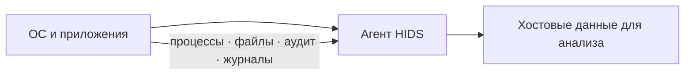
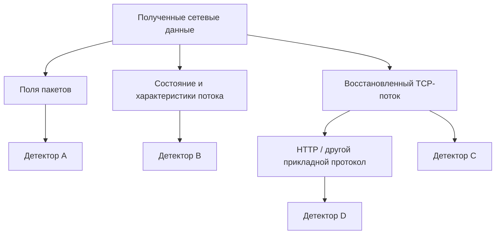
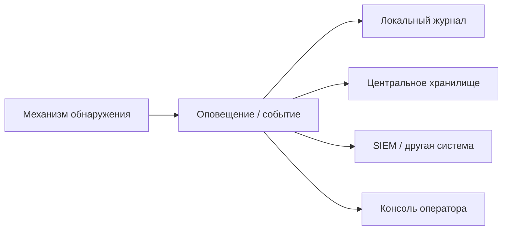
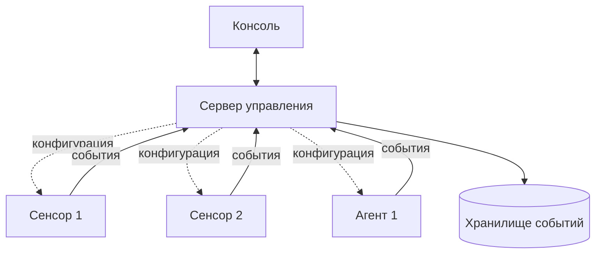
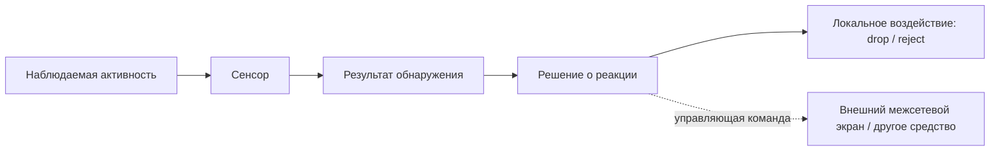
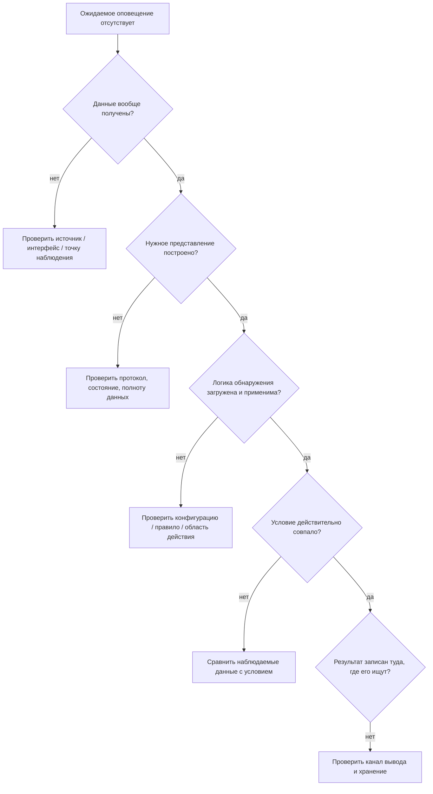

# Глава 3. Из чего состоит IDS/IPS и как она работает

<div class="chapter-lead">
<p>Теперь мы знаем, зачем нужны IDS/IPS и почему существуют разные виды систем наблюдения. Но пока сама IDS остаётся для нас «чёрным ящиком»: данные каким-то образом попадают внутрь, после чего появляется оповещение.</p>
<p>В этой главе разберём <strong>функциональное устройство IDS/IPS</strong>: кто получает данные, где выполняется анализ, где хранятся правила и настройки, как формируется результат и как система управляется.</p>
</div>

<div class="chapter-outcomes">
<strong>После изучения главы студент должен уметь:</strong>
<p>объяснить роль сенсора и агента; отличить сбор данных от анализа; объяснить назначение правил, моделей и настроек; различать результат обнаружения, хранение событий и управление системой; понимать, что функциональные компоненты не обязаны быть отдельными физическими устройствами.</p>
</div>

---

## 1. IDS/IPS — это не одна «коробка»

В первой главе мы использовали простую схему:

```text
трафик → IDS → оповещение
```

Она полезна для знакомства с идеей обнаружения, но ничего не говорит о внутреннем устройстве системы.

В реальной IDS/IPS можно выделить несколько **функциональных задач**.

<div class="teaching-figure" markdown="1">
<div class="figure-label">СХЕМА 1 · ФУНКЦИОНАЛЬНАЯ ДЕКОМПОЗИЦИЯ IDS/IPS</div>



<div class="figure-caption">Это функциональная схема, а не обязательная внутренняя цепочка обработки конкретного продукта. Разные реализации могут объединять, разделять или переставлять отдельные функции.</div>
</div>

Главная идея:

<div class="concept-formula primary-formula">
  <span class="formula-left">ФУНКЦИЯ</span>
  <span class="formula-sign">≠</span>
  <span class="formula-right">ФИЗИЧЕСКИЙ КОМПОНЕНТ</span>
  <p>Несколько функций могут выполняться одним процессом или устройством, а одна функция может быть распределена между несколькими узлами.</p>
</div>

Например, небольшая IDS может работать на одной машине: она получает трафик, анализирует его и пишет события локально. В крупной инфраструктуре сенсоры могут передавать результаты на отдельные серверы управления и хранения.

---

## 2. Сенсор и агент: кто получает наблюдаемую активность

В классической терминологии IDPS обычно используют два слова:

<div class="scope-compare">
  <article><span>СЕНСОР</span><strong>Наблюдает среду</strong><p>Чаще используется для сетевых и беспроводных систем: получает доступный трафик или радиообмен.</p></article>
  <article><span>АГЕНТ</span><strong>Работает на узле</strong><p>Чаще используется для хостовых систем: получает доступ к событиям конкретной операционной системы или приложения.</p></article>
</div>

В NIST SP 800-94 используются соответствующие английские термины `sensor` и `agent`; далее в курсе мы используем русские термины **сенсор** и **агент**.

Но важно не превращать терминологию в физический закон. Нас интересует функция:

> **какой компонент реально получает данные о наблюдаемой активности?**

### Сетевой пример

<div class="teaching-figure" markdown="1">
<div class="figure-label">СХЕМА 2 · СЕТЕВОЙ СЕНСОР</div>



<div class="figure-caption">Сенсор не создаёт сетевое событие: он получает доступное ему представление уже происходящего взаимодействия.</div>
</div>

### Хостовый пример

<div class="teaching-figure" markdown="1">
<div class="figure-label">СХЕМА 3 · ХОСТОВЫЙ АГЕНТ</div>



<div class="figure-caption">Агент получает только те сведения, к которым имеет доступ и которые реально включены в конфигурацию сбора.</div>
</div>

Поэтому наличие установленного агента ещё не означает, что система автоматически видит все процессы, файлы и действия пользователя.

---

## 3. Получение данных и обнаружение — не одно и то же

Пусть NIDS подключена к нужному сетевому сегменту.

Это означает только, что система **может получить** некоторый трафик при корректной конфигурации.

Но ещё не означает, что:

```text
нужный интерфейс выбран;
пакеты действительно захватываются;
протокол распознан;
нужное правило загружено;
условие обнаружения совпало.
```

Поэтому полезно разделять два вопроса:

<div class="scope-compare">
  <article><span>СБОР</span><strong>Какие данные получила система?</strong><p>Интерфейс, агент, журнал, поток событий, радиоканал, API или другой источник.</p></article>
  <article><span>АНАЛИЗ</span><strong>Что система сделала с полученными данными?</strong><p>Построила контекст, применила правило или модель, сформировала результат.</p></article>
</div>

<div class="concept-formula neutral-formula">
  <span class="formula-left">ДАННЫЕ ПОЛУЧЕНЫ</span>
  <span class="formula-sign">≠</span>
  <span class="formula-right">УГРОЗА ОБНАРУЖЕНА</span>
  <p>Система может успешно собирать телеметрию и не иметь условия, которое выделяет конкретную активность.</p>
</div>

И наоборот, идеальное правило бесполезно, если нужные данные до механизма анализа не дошли.

---

## 4. Представление данных: система анализирует не только «сырые пакеты»

Полученная информация часто преобразуется в более удобную структуру.

Для сети это могут быть:

```text
поля пакета;
состояние соединения;
сетевой поток;
восстановленная последовательность TCP-данных;
HTTP-запрос;
DNS-запрос;
TLS-сеанс.
```

Для хоста это могут быть:

```text
событие аудита;
сведения о процессе;
изменение файла;
запись журнала;
событие аутентификации.
```

<div class="teaching-figure" markdown="1">
<div class="figure-label">СХЕМА 4 · ОДНИ И ТЕ ЖЕ ИСХОДНЫЕ ДАННЫЕ МОГУТ ДАТЬ НЕСКОЛЬКО ПРЕДСТАВЛЕНИЙ</div>



<div class="figure-caption">Нет обязательного правила «сначала полностью разобрать приложение, потом начинать обнаружение». Конкретный детектор использует то представление, которое требуется его условию.</div>
</div>

Это исправляет распространённую ошибку: обнаружение не обязано начинаться только после TCP reassembly и разбора прикладного протокола. Например, интересующее условие может относиться непосредственно к IP/TCP-полям или событию декодирования.

---

## 5. Где находится логика обнаружения

После того как системе доступно нужное представление, применяется **логика обнаружения**.

Она отвечает на вопрос:

> **какое условие должно быть выполнено, чтобы система выделила активность как интересующую?**

Логика может быть представлена в разных формах:

```text
правило;
сигнатура;
пороговое условие;
модель состояния протокола;
поведенческая последовательность;
статистическая или иная модель.
```

Подробно методы обнаружения разбираются в Главе 5. Здесь важно другое:

<div class="concept-formula primary-formula">
  <span class="formula-left">ПРАВИЛО / МОДЕЛЬ</span>
  <span class="formula-sign">+</span>
  <span class="formula-right">ПОДХОДЯЩИЕ ДАННЫЕ</span>
  <p>Только совместное наличие логики и нужного представления позволяет получить ожидаемый результат обнаружения.</p>
</div>

### Почему правила вообще нужны

Без формализованного условия система не знает, какую активность из огромного потока данных необходимо выделить.

Простейший учебный пример:

```text
если URI HTTP-запроса содержит LAB-MARKER
→ сформировать оповещение
```

Сейчас нас не интересует синтаксис Suricata. Важно понять назначение правила: оно превращает человеческую идею «обрати внимание на такой признак» в условие, которое может выполнить машина.

---

## 6. Результат обнаружения и хранение — разные функции

Когда условие выполнено, система формирует результат.

Это может быть:

```text
событие;
оповещение;
оценка риска;
метка;
дополнительный контекст.
```

После этого результат нужно куда-то передать или сохранить.

<div class="teaching-figure" markdown="1">
<div class="figure-label">СХЕМА 5 · ОБНАРУЖЕНИЕ И ХРАНЕНИЕ НЕ НУЖНО СМЕШИВАТЬ</div>



<div class="figure-caption">Детектор принимает решение, а журнал, база данных или SIEM сохраняют и предоставляют результат. Это разные функции, даже если технически они объединены в одном продукте.</div>
</div>

Например, в наших лабораториях Suricata формирует структурированные записи в `eve.json`. Сам файл не является «детектором»: это один из каналов вывода результата.

---

## 7. Управление: откуда берутся конфигурация и правила

IDS/IPS должна быть настроена.

Управляющая часть может определять:

```text
какие источники данных использовать;
какие правила и политики загрузить;
какие сети считать внутренними;
какие протоколы и функции включить;
куда отправлять результаты;
разрешены ли действия предотвращения.
```

В небольшой системе настройки могут храниться локально.

В крупном развёртывании возможна централизованная архитектура.

<div class="teaching-figure" markdown="1">
<div class="figure-label">СХЕМА 6 · ПРИМЕР РАСПРЕДЕЛЁННОЙ IDS/IPS</div>



<div class="figure-caption">Это пример архитектуры, а не обязательная схема. Небольшая IDS может обходиться без отдельного сервера управления или отдельной базы данных.</div>
</div>

Классический NIST SP 800-94 перечисляет типичные компоненты IDPS: сенсоры или агенты, серверы управления, серверы хранения событий и консоли. При этом небольшие системы могут работать без отдельного сервера управления.

---

## 8. Где появляется предотвращение

Функция предотвращения возникает **после решения о реакции**, но не обязана находиться физически там же, где выполнено обнаружение.

<div class="teaching-figure" markdown="1">
<div class="figure-label">СХЕМА 7 · ОБНАРУЖЕНИЕ И ТОЧКА ВОЗДЕЙСТВИЯ МОГУТ БЫТЬ РАЗНЕСЕНЫ</div>



<div class="figure-caption">Размещение сенсора и место применения воздействия — разные архитектурные решения. Подробно это разбирается в Главе 4.</div>
</div>

Поэтому нельзя определять IPS только формулой «сенсор стоит inline».

---

## 9. Как это выглядит на примере Suricata

Suricata в нашем курсе — не определение IDS, а удобная реализация для экспериментов.

Упрощённое соответствие функций выглядит так:

<div class="source-type-grid">
  <article><strong>Получение данных</strong><span>Интерфейс / PCAP</span><p>Suricata получает сетевой трафик из выбранного источника.</p></article>
  <article><strong>Построение контекста</strong><span>Пакеты · потоки · протоколы</span><p>Движок формирует представления, необходимые различным механизмам анализа.</p></article>
  <article><strong>Обнаружение</strong><span>Правила и встроенная логика</span><p>Условия применяются к подходящим представлениям данных.</p></article>
  <article><strong>Вывод</strong><span>EVE JSON и другие выходы</span><p>Результаты фиксируются в выбранных каналах вывода.</p></article>
</div>

Это не означает, что каждый блок соответствует отдельному процессу ОС. Это **функциональное отображение**, помогающее понять эксперимент.

---

## 10. Почему отсутствие оповещения нельзя объяснять одной причиной

Представим:

> тестовый HTTP-запрос отправлен, но ожидаемого оповещения нет.

Возможны совершенно разные причины:

<div class="teaching-figure" markdown="1">
<div class="figure-label">СХЕМА 8 · ГДЕ МОЖЕТ РАЗОРВАТЬСЯ ОЖИДАЕМАЯ ЦЕПОЧКА</div>



<div class="figure-caption">Одинаковый внешний симптом — «нет оповещения» — может возникать на разных функциональных уровнях. Поэтому диагностика начинается не с хаотичного переписывания правила.</div>
</div>

Эта схема станет основой дальнейших лабораторных работ.

---

## 11. Что нужно запомнить

<div class="axiom-grid">
  <article class="axiom-card"><span>01</span><strong>СЕНСОР / АГЕНТ ≠ ВСЯ IDS</strong><p>Получение данных — только одна функция системы.</p></article>
  <article class="axiom-card"><span>02</span><strong>СБОР ДАННЫХ ≠ ОБНАРУЖЕНИЕ</strong><p>Телеметрия может поступать, но нужного детектора может не быть.</p></article>
  <article class="axiom-card"><span>03</span><strong>ОБНАРУЖЕНИЕ ≠ ХРАНЕНИЕ</strong><p>Решение детектора и запись результата в журнал или SIEM — разные функции.</p></article>
  <article class="axiom-card"><span>04</span><strong>ФУНКЦИОНАЛЬНАЯ СХЕМА ≠ ФИЗИЧЕСКАЯ ТОПОЛОГИЯ</strong><p>Компоненты могут быть объединены или распределены в зависимости от реализации.</p></article>
</div>

---

## 12. Проверка понимания

<div class="quiz" data-question-id="chapter3-v220-q1">
  <p><strong>Suricata успешно получает HTTP-трафик с интерфейса, но нужное правило не загружено. Какой вывод корректен?</strong></p>
  <button data-choice="a">A. Получение трафика автоматически означает, что атака будет обнаружена</button>
  <button data-choice="b" data-correct="true">B. Сбор данных работает, но требуемая логика обнаружения отсутствует</button>
  <button data-choice="c">C. Нужно обязательно менять точку наблюдения</button>
  <button data-choice="d">D. Это доказывает неисправность сетевого интерфейса</button>
  <div class="quiz-feedback"></div>
</div>

<div class="quiz" data-question-id="chapter3-v220-q2">
  <p><strong>Почему схема «пакет → TCP-поток → HTTP → обнаружение» не является универсальным устройством любой NIDS?</strong></p>
  <button data-choice="a">A. TCP не используется в сетях</button>
  <button data-choice="b">B. HTTP всегда анализируется до IP</button>
  <button data-choice="c" data-correct="true">C. Разные детекторы могут работать на разных представлениях данных</button>
  <button data-choice="d">D. IDS анализирует только файлы журналов</button>
  <div class="quiz-feedback"></div>
</div>

<div class="quiz" data-question-id="chapter3-v220-q3">
  <p><strong>Какую функцию выполняет файл eve.json в нашей лаборатории Suricata?</strong></p>
  <button data-choice="a">A. Он является точкой захвата сетевого трафика</button>
  <button data-choice="b">B. Он заменяет правило обнаружения</button>
  <button data-choice="c" data-correct="true">C. Он является одним из каналов записи структурированных результатов работы системы</button>
  <button data-choice="d">D. Он автоматически подтверждает успешную компрометацию</button>
  <div class="quiz-feedback"></div>
</div>

<div class="next-step">
<strong>Следующий шаг:</strong> переходите к <a href="../04-detection-methods/">Главе 4</a>: там функциональная модель связывается с физической сетью и появляется вопрос, <strong>в какой точке сенсор вообще может получить нужный трафик</strong>. ЛР №2 по маршруту курса уже должна быть выполнена после Главы 2; если она была пропущена, вернитесь к ней до перехода к практической работе по размещению.
</div>

---

## Источники и границы главы

- NIST SP 800-94 — классическая функциональная модель компонентов IDPS: сенсор/агент, сервер управления, сервер хранения событий, консоль.
- Suricata User Guide — источник для конкретных механизмов запуска и EVE JSON, используемых в лабораториях.
- Схемы этой главы являются **учебной функциональной декомпозицией**, а не утверждением о внутреннем устройстве каждого продукта.

Актуальные ссылки собраны в разделе [«Источники курса»](../../resources/sources/).
