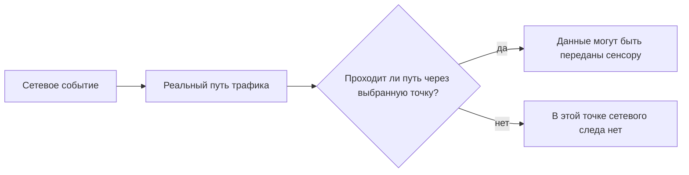
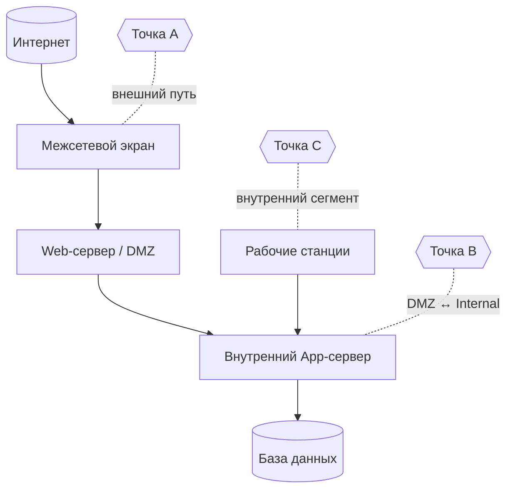
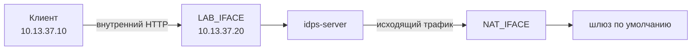
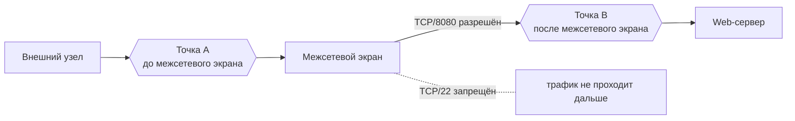
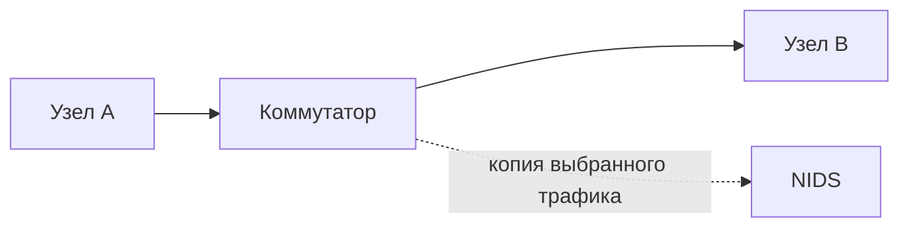
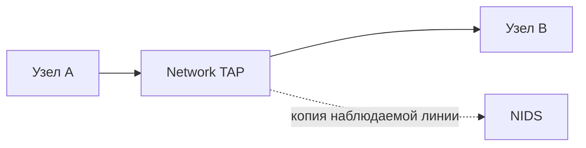
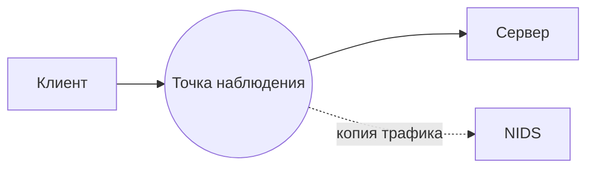
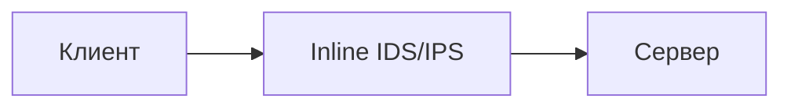
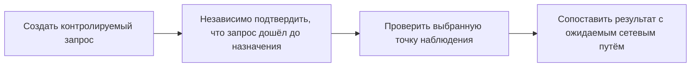
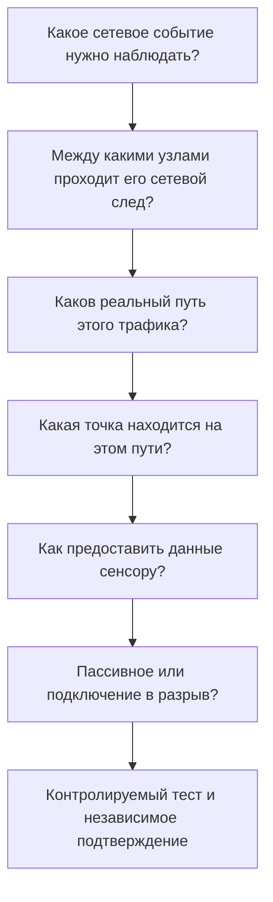

# Глава 4. Где и как размещают IDS/IPS

<div class="chapter-lead">
<p>Даже корректно настроенная IDS бесполезна для конкретного сетевого события, если нужные данные не попадают в её точку наблюдения. Поэтому размещение начинается не с вопроса «куда поставить сенсор», а с более строгого вопроса: <strong>какой сетевой след мы хотим наблюдать и через какую точку он действительно проходит?</strong></p>
</div>

<div class="chapter-outcomes">
<strong>После этой главы вы должны уметь:</strong>
<p>определять точку наблюдения по реальному пути трафика; отличать точку наблюдения от способа доставки копии трафика; различать пассивное подключение и подключение в разрыв (inline); объяснять, почему сенсор на периметре не обеспечивает автоматически видимость внутренних взаимодействий; и проверять размещение контролируемым экспериментом.</p>
</div>

---

## 1. Размещение определяет, какие данные вообще могут попасть в систему

В предыдущих главах мы разделили источник данных, обработку и логику обнаружения. Теперь появляется ещё одно условие, которое предшествует анализу:

<div class="teaching-figure" markdown="1">
<div class="figure-label">СХЕМА 1 · УСЛОВИЕ СЕТЕВОЙ НАБЛЮДАЕМОСТИ</div>



<div class="figure-caption">Сначала проверяется физический или логический путь трафика. Настройка правила имеет смысл только после того, как нужные данные доступны в выбранной точке.</div>
</div>

Это не означает, что любое событие, прошедшее через точку, обязательно будет обнаружено. Между «трафик доступен» и «оповещение сформировано» остаются обработка данных и логика обнаружения.

Поэтому нельзя смешивать два разных вопроса:

```text
Видит ли сенсор нужный трафик?

и

Срабатывает ли на нём нужный детектор?
```

Первый вопрос относится к размещению и получению данных. Второй — к обнаружению.

---

## 2. Что такое точка наблюдения

**Точка наблюдения** — конкретное место, в котором система получает интересующие данные о сетевом взаимодействии.

Для инженерного описания фразы «IDS стоит в сети» недостаточно. Необходимо уточнить как минимум:

```text
сегмент или интерфейс;
направление интересующего трафика;
положение относительно сетевых устройств и границ;
какой именно поток должен здесь проходить.
```

Например, запись:

```text
NIDS на сервере
```

почти ничего не объясняет.

Гораздо точнее:

```text
интерфейс учебной сети idps-server;
сегмент 10.13.37.0/24;
наблюдается трафик idps-client → idps-server:8080.
```

<div class="callout-banner">
<strong>Главное правило:</strong> точку наблюдения выбирают относительно конкретного сетевого пути, а не относительно абстрактного понятия «периметр» или «серверная».
</div>

---

## 3. Один и тот же сенсор не видит автоматически все сетевые пути

Рассмотрим упрощённую инфраструктуру.

<div class="teaching-figure" markdown="1">
<div class="figure-label">СХЕМА 2 · ТРИ РАЗНЫХ СЕТЕВЫХ ПУТИ</div>



<div class="figure-caption">Точки A, B и C — не «правильные места для IDS», а возможные точки для разных сетевых путей.</div>
</div>

Теперь изменим не сенсор, а задачу.

### Сценарий 1. Внешний клиент обращается к Web-серверу

Интересующий путь:

```text
Интернет → межсетевой экран → Web
```

Полезна точка, через которую проходит именно этот поток.

### Сценарий 2. Web-сервер обращается к внутреннему App-серверу

Интересующий путь уже другой:

```text
Web → App
```

Наличие сенсора на внешнем периметре само по себе не подтверждает, что этот внутренний поток попадёт в него.

### Сценарий 3. Рабочая станция взаимодействует с внутренним сервером

Путь может вообще не пересекать внешний периметр:

```text
Workstation → Internal Server
```

Отсюда следует:

<div class="principle-box">
<strong>ПЕРИМЕТРОВЫЙ СЕНСОР ≠ ПОЛНАЯ ВИДИМОСТЬ СЕТИ</strong>
<p>Наличие NIDS на одной границе подтверждает возможность наблюдать только те потоки, которые действительно проходят через предоставленную ему точку наблюдения.</p>
</div>

### Одна точка может быть подходящей для одного потока и неподходящей для другого

Даже на одном узле разные взаимодействия могут идти через разные интерфейсы. Например, сервер может принимать внутренний HTTP-трафик через учебный интерфейс и одновременно отправлять исходящий трафик через интерфейс с маршрутом по умолчанию.

<div class="teaching-figure" markdown="1">
<div class="figure-label">СХЕМА 2А · РАЗМЕЩЕНИЕ ОЦЕНИВАЕТСЯ ОТНОСИТЕЛЬНО КОНКРЕТНОГО ПОТОКА</div>



<div class="figure-caption">LAB_IFACE может быть правильной точкой для внутреннего HTTP-потока, но неправильной для исходящего потока через NAT. Для NAT_IFACE верно обратное. Поэтому фраза «сенсор слеп» без указания конкретного потока слишком сильна.</div>
</div>

Корректная формулировка всегда привязана к объекту наблюдения:

> В условиях данного эксперимента поток X наблюдается в точке A и не наблюдается в точке B выбранным способом захвата.

Это сильнее и точнее, чем общее утверждение «интерфейс B ничего не видит».

---

## 4. До и после межсетевого экрана — разные наборы наблюдений

Пусть внешний узел отправляет два соединения:

```text
TCP/8080 → разрешено
TCP/22   → запрещено
```

Сравним две точки.

<div class="teaching-figure" markdown="1">
<div class="figure-label">СХЕМА 3 · ДО И ПОСЛЕ ПРИМЕНЕНИЯ ПОЛИТИКИ</div>



<div class="figure-caption">В точке A доступны попытки, дошедшие до внешней границы. В точке B — только трафик, который прошёл применённую политику для этого пути.</div>
</div>

Ни одна точка не является «всегда лучшей».

Если задача — наблюдать общий фон внешних попыток, полезной может быть точка до фильтрации.

Если задача — анализировать только взаимодействия, которые реально прошли к защищаемому сервису, полезной может быть точка после фильтрации.

Поэтому неверно утверждать:

```text
сенсор всегда нужно ставить до межсетевого экрана
```

или:

```text
сенсор всегда нужно ставить после межсетевого экрана
```

Правильный вопрос:

> **Какой набор сетевых событий нужен для нашей задачи обнаружения?**

---

## 5. Точка наблюдения и способ получения трафика — не одно и то же

После выбора точки нужно решить, **как предоставить данные сенсору**.

Для пассивного сетевого сенсора распространены способы, при которых он получает копию трафика. NIST SP 800-94 рассматривает, среди прочего, зеркалирование порта коммутатора и сетевой ответвитель как варианты подключения пассивного сенсора.

### Зеркалирование порта коммутатора (SPAN)

<div class="teaching-figure" markdown="1">
<div class="figure-label">СХЕМА 4 · SPAN: КОПИЯ СОЗДАЁТСЯ КОММУТАТОРОМ</div>



<div class="figure-caption">Основной поток продолжает идти между узлами. Сенсор получает копию, сформированную согласно конфигурации коммутатора.</div>
</div>

### Сетевой ответвитель (TAP)

<div class="teaching-figure" markdown="1">
<div class="figure-label">СХЕМА 5 · TAP: ОТДЕЛЬНАЯ КОПИЯ С ЛИНИИ</div>



<div class="figure-caption">SPAN и TAP отвечают на вопрос «как получить копию в выбранной точке», а не на вопрос «какое событие обнаруживать».</div>
</div>

Эти механизмы не следует превращать в универсальную шкалу «плохой/хороший». Выбор зависит от архитектуры, требуемой полноты наблюдения, оборудования и эксплуатационных ограничений.

---

## 6. Пассивное и подключение в разрыв — ещё одна отдельная характеристика

В Главе 1 мы уже разделили обнаружение и предотвращение. Теперь закрепим это на уровне топологии.

### Пассивный сенсор



Основной поток не обязан проходить через сенсор.

### Подключение в разрыв (inline)



Основной поток проходит через систему.

Но нельзя автоматически делать вывод:

```text
пассивный = IDS
в разрыв = IPS
```

Inline-система может работать в режиме только оповещения. Пассивный сенсор, в свою очередь, может инициировать действие через другое средство контроля.

Поэтому разделяем три вопроса:

<div class="visual-grid">
  <div class="visual-card"><strong>Где?</strong><p>В какой точке существует нужный сетевой след?</p></div>
  <div class="visual-card"><strong>Как получаем?</strong><p>Копия через SPAN/TAP, локальный интерфейс или другой механизм?</p></div>
  <div class="visual-card"><strong>Какова роль?</strong><p>Только наблюдение или система находится в пути и может непосредственно влиять на поток?</p></div>
</div>

---

## 7. Виртуальный интерфейс тоже влияет на наблюдение

В виртуальной машине между приложением и средством захвата находится сетевой стек гостевой ОС. Он может использовать механизмы разгрузки: объединять пакеты, откладывать вычисление контрольных сумм или выполнять часть обработки не в том месте, где её ожидает средство анализа.

Для учебного стенда это важно по двум причинам:

```text
tcpdump может показать пакет и отметить некорректную checksum;
представление пакетов, получаемое IDS, может отличаться от «кадров на проводе».
```

Поэтому лабораторные не должны молча полагаться на настройки виртуального адаптера. В нашем стенде используются две меры:

1. перед экспериментом скрипт пытается отключить GRO/LRO/GSO/TSO и checksum offloading на наблюдаемых интерфейсах, если драйвер это поддерживает;
2. Suricata в учебных live-запусках стартует с `-k none`, то есть проверка контрольных сумм отключается только для конкретного учебного процесса, а не глобально в конфигурации системы.

!!! note
    Это решение относится к воспроизводимости виртуального учебного стенда. Оно не является универсальной рекомендацией для промышленного развёртывания. Настройки захвата и offloading в рабочей системе подбираются с учётом драйвера, метода захвата и требований производительности.

---

## 8. Почему «сенсор запущен» ещё ничего не доказывает

Команда может показать:

```text
Suricata: running
```

но это не подтверждает, что нужный поток проходит через выбранный интерфейс.

Точно так же отсутствие оповещения не позволяет сразу утверждать:

```text
атаки не было
```

или:

```text
сенсор не видит этот сегмент
```

Причиной могут быть разные вещи:

```text
не тот интерфейс;
не тот маршрут;
ошибка фильтра захвата;
потеря данных;
неподходящее правило;
не то представление данных.
```

Поэтому размещение проверяется экспериментом.

---

## 9. Как доказать, что выбрана правильная точка

Надёжная проверка требует как минимум двух независимых фактов:

<div class="teaching-figure" markdown="1">
<div class="figure-label">СХЕМА 6 · ПРОВЕРКА ТОЧКИ НАБЛЮДЕНИЯ</div>



<div class="figure-caption">Отсутствие записи у сенсора имеет смысл только тогда, когда независимо подтверждено, что контролируемое событие действительно произошло.</div>
</div>

Например:

```text
1. Клиент отправляет корректный HTTP-запрос серверу.
2. Журнал приложения подтверждает, что этот HTTP-запрос был собран и обработан на прикладном уровне.
3. На интерфейсе A соответствующий сетевой поток не наблюдается.
4. На интерфейсе B тот же поток наблюдается.
```

Журнал приложения здесь используется как **независимое подтверждение именно прикладной доставки**. Он не является универсальным доказательством существования любого сетевого события. Если интересующее действие происходит только на L3/L4, запрос повреждён до уровня HTTP или приложение не дошло до стадии журналирования, в веб-журнале может не быть записи, хотя пакеты на интерфейсе присутствовали.

Поэтому вид независимого подтверждения выбирают под проверяемое событие. Для HTTP это может быть application log; для низкоуровневого сетевого теста потребуется другой источник.

Тогда можно сделать ограниченный и корректный вывод:

> В условиях данного эксперимента поток `клиент → сервер` проходит через интерфейс B и не наблюдается на интерфейсе A выбранным способом захвата.

Но нельзя превращать этот вывод в более сильное утверждение:

> «Интерфейс A вообще ничего не видит».

Это уже другая гипотеза и другой эксперимент.

---

## 10. Что мы пока намеренно не добавляем

На реальную полезность точки наблюдения дополнительно влияют:

```text
шифрование;
асимметричная маршрутизация;
NAT и другие преобразования адресов;
потеря пакетов;
нагрузка;
особенности реконструкции потока.
```

Эти факторы важны, но сейчас они только усложнили бы базовый вопрос размещения. Мы вернёмся к ним в Главе 7, когда будем разбирать ограничения и причины пропусков.

---

## 11. Сводная логика главы

<div class="teaching-figure" markdown="1">
<div class="figure-label">СХЕМА 7 · КАК ВЫБИРАЕТСЯ РАЗМЕЩЕНИЕ</div>



<div class="figure-caption">Сначала определяется нужный путь и точка. Только затем выбираются способ подключения и режим работы системы.</div>
</div>

Главная мысль главы:

<div class="principle-box">
<strong>РАЗМЕЩЕНИЕ ≠ «ПОСТАВИТЬ IDS РЯДОМ С МЕЖСЕТЕВЫМ ЭКРАНОМ»</strong>
<p>Размещение — это обоснованный выбор точки, в которой существует нужный наблюдаемый сетевой след, плюс способ получить этот след и проверить, что предположение действительно выполняется.</p>
</div>

---

## 12. Проверка понимания

<div class="quiz" data-question-id="chapter4-v224-q1">
  <p><strong>Внешний NIDS установлен перед межсетевым экраном. Можно ли из этого сделать вывод, что он наблюдает взаимодействие Web → App внутри сети?</strong></p>
  <button data-choice="a">A. Да, любой NIDS видит все сегменты организации</button>
  <button data-choice="b" data-correct="true">B. Нет, сначала нужно установить, проходит ли поток Web → App через его точку наблюдения</button>
  <button data-choice="c">C. Да, если у NIDS достаточно сигнатур</button>
  <button data-choice="d">D. Нет, потому что сетевой IDS не умеет анализировать внутренний трафик</button>
  <div class="quiz-feedback"></div>
</div>

<div class="quiz" data-question-id="chapter4-v224-q2">
  <p><strong>Что корректнее всего описывает SPAN?</strong></p>
  <button data-choice="a">A. Метод определения вредоносности HTTP-запроса</button>
  <button data-choice="b">B. Обязательное место установки IPS</button>
  <button data-choice="c" data-correct="true">C. Способ предоставить пассивному сенсору копию выбранного сетевого трафика</button>
  <button data-choice="d">D. Механизм подтверждения успешной компрометации</button>
  <div class="quiz-feedback"></div>
</div>

<div class="quiz" data-question-id="chapter4-v224-q3">
  <p><strong>Запрос подтверждён журналом веб-сервера, но на одном интерфейсе tcpdump его не показывает. Какой вывод допустим?</strong></p>
  <button data-choice="a">A. Запроса не существовало</button>
  <button data-choice="b">B. Сервер обязательно скомпрометирован</button>
  <button data-choice="c" data-correct="true">C. В условиях теста этот запрос не наблюдался на выбранном интерфейсе данным способом захвата; нужно сопоставить результат с маршрутом</button>
  <button data-choice="d">D. Любая IDS на этом сервере неисправна</button>
  <div class="quiz-feedback"></div>
</div>

<div class="quiz" data-question-id="chapter4-v224-q4">
  <p><strong>Почему точка наблюдения после межсетевого экрана не является автоматически «лучше» точки до него?</strong></p>
  <button data-choice="a">A. Потому что после межсетевого экрана сетевого трафика не бывает</button>
  <button data-choice="b" data-correct="true">B. Эти точки предоставляют разные наборы наблюдений, и выбор зависит от задачи обнаружения</button>
  <button data-choice="c">C. Потому что NIDS может работать только перед межсетевым экраном</button>
  <button data-choice="d">D. Потому что после межсетевого экрана всегда используется только HIDS</button>
  <div class="quiz-feedback"></div>
</div>

<div class="quiz" data-question-id="chapter4-v225-q5">
  <p><strong>Сервер принимает внутренний HTTP через LAB_IFACE и отправляет другой поток через NAT_IFACE. Какой вывод корректен?</strong></p>
  <button data-choice="a">A. LAB_IFACE является лучшей точкой наблюдения для сервера вообще</button>
  <button data-choice="b">B. NAT_IFACE является слепой зоной IDS</button>
  <button data-choice="c" data-correct="true">C. Пригодность точки определяется отдельно для каждого интересующего сетевого пути</button>
  <button data-choice="d">D. Оба интерфейса обязаны видеть каждый пакет сервера</button>
  <div class="quiz-feedback"></div>
</div>

---

## Практическое закрепление

В [ЛР №3](../../labs/lab03/) проверяются **два разных сетевых пути** одного сервера:

```text
внутренний HTTP: idps-client → LAB_IFACE → idps-server;
исходящий ICMP: idps-server → NAT_IFACE → шлюз по умолчанию.
```

Это делает эксперимент симметричным: `LAB_IFACE` подходит для первого потока и не подходит для второго, а `NAT_IFACE` — наоборот. Поэтому студент доказывает не тезис «один интерфейс хороший, другой плохой», а более общий принцип: **точка наблюдения всегда оценивается относительно конкретного сетевого пути**.

Для HTTP-теста журнал учебного веб-сервиса используется как независимое подтверждение прикладной доставки. Одновременно в лабораторной отдельно оговорено, что журнал приложения не заменяет наблюдение сетевого уровня и не может служить универсальным эталоном истинного состояния для любого сетевого события.

<div class="next-step">
<strong>Следующая теоретическая тема:</strong> после того как источник и точка наблюдения выбраны, нужно понять, <strong>какими методами IDS/IPS определяет подозрительную активность</strong>. Этому будет посвящена Глава 5.
</div>

---

## Источники и границы главы

- NIST SP 800-94 — исторический фундаментальный источник для различия пассивных и inline-сенсоров и вариантов подключения пассивных сенсоров через сетевой ответвитель (TAP) или зеркалирование порта коммутатора (SPAN).
- William Stallings, *Computer Security: Principles and Practice* — учебное описание пассивных NIDS и NIDS, подключённых в разрыв и типовых вариантов размещения.
- Wireshark User’s Guide, раздел *Checksum Offloading* — источник для пояснения, почему локальный захват на виртуальном/физическом хосте может показывать частичные или кажущиеся некорректными контрольные суммы до обработки сетевым оборудованием.
- Схемы A/B/C и алгоритм проверки точки наблюдения являются учебной синтезированной моделью курса.
- TLS, асимметричная маршрутизация, NAT и другие ограничения сознательно перенесены в Главу 7, чтобы не смешивать базовый выбор точки с более сложными причинами потери видимости.

Актуальные ссылки и статус источников собраны в разделе [«Источники курса»](../../resources/sources/).
