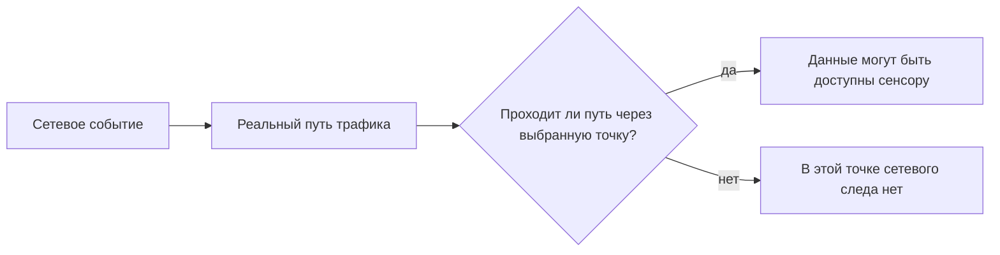

# Глава 4. Где и как размещают IDS/IPS

<div class="chapter-lead">
<p>Даже корректно настроенная IDS бесполезна для конкретного сетевого события, если нужные данные не попадают в её точку наблюдения. Поэтому размещение начинается не с вопроса «куда поставить сенсор», а с более строгого вопроса: <strong>какой сетевой след мы хотим наблюдать и через какую точку он действительно проходит?</strong></p>
</div>

<div class="chapter-outcomes">
<strong>После этой главы вы должны уметь:</strong>
<p>определять точку наблюдения по реальному пути трафика; отличать точку наблюдения от способа доставки копии трафика; различать пассивное подключение и подключение в разрыв (inline); объяснять, почему сенсор на периметре не обеспечивает автоматически видимость внутренних взаимодействий; и проверять размещение контролируемым экспериментом.</p>
</div>

---

## 1. Размещение определяет, какие данные вообще могут попасть в систему

В предыдущих главах мы разделили источник данных, обработку и логику обнаружения. Теперь появляется ещё одно условие, которое предшествует анализу.

<div class="idps-figure" markdown="1">
<div class="idps-figure__label">СХЕМА 1 · УСЛОВИЕ СЕТЕВОЙ НАБЛЮДАЕМОСТИ</div>



<div class="idps-figure__caption">Сначала проверяется физический или логический путь трафика. Настройка правила имеет смысл только после того, как нужные данные доступны в выбранной точке.</div>
</div>

Это не означает, что любое событие, прошедшее через точку, обязательно будет обнаружено. Между «трафик доступен» и «оповещение сформировано» остаются получение данных, представление и логика обнаружения.

<div class="idps-contrast">
  <div class="idps-card idps-card--observation">
    <span class="idps-card__eyebrow">РАЗМЕЩЕНИЕ</span>
    <strong class="idps-card__title">Видит ли выбранная точка нужный поток?</strong>
    <p>Это вопрос маршрута, интерфейса и способа получения данных.</p>
  </div>
  <div class="idps-contrast__arrow">≠</div>
  <div class="idps-card idps-card--sensor">
    <span class="idps-card__eyebrow">ОБНАРУЖЕНИЕ</span>
    <strong class="idps-card__title">Сработает ли на этих данных нужный детектор?</strong>
    <p>Это отдельный вопрос условий, правил и доступного представления данных.</p>
  </div>
</div>

Первый вопрос относится к размещению и получению данных. Второй — к обнаружению. Смешение этих вопросов приводит к типичной ошибке: отсутствие alert принимают за доказательство отсутствия трафика.

---

## 2. Что такое точка наблюдения

**Точка наблюдения** — конкретное место, в котором система получает интересующие данные о сетевом взаимодействии.

Для инженерного описания фразы «IDS стоит в сети» недостаточно. Нужно описать точку так, чтобы другой специалист понимал, **какой именно поток и где мы ожидаем увидеть**.

<div class="idps-figure">
  <div class="idps-figure__label">СХЕМА · ПАСПОРТ ТОЧКИ НАБЛЮДЕНИЯ</div>
  <div class="idps-placement-spec">
    <div><span>01</span><strong>Сегмент / интерфейс</strong><small>Где физически или логически получаются данные?</small></div>
    <div><span>02</span><strong>Направление</strong><small>Какой обмен нас интересует: A → B, B → A или оба направления?</small></div>
    <div><span>03</span><strong>Положение</strong><small>До/после какого сетевого устройства или границы находится точка?</small></div>
    <div><span>04</span><strong>Конкретный поток</strong><small>Какой адрес, сервис или сетевое взаимодействие должно здесь проходить?</small></div>
  </div>
  <div class="idps-figure__caption">Название продукта или сервера не описывает точку наблюдения. Нужна привязка к пути конкретного трафика.</div>
</div>

Например, запись:

```text
NIDS на сервере
```

почти ничего не объясняет.

Гораздо точнее:

```text
интерфейс учебной сети idps-server;
сегмент 10.13.37.0/24;
наблюдается трафик idps-client → idps-server:8080.
```

<div class="callout-banner">
<strong>Главное правило:</strong> точку наблюдения выбирают относительно конкретного сетевого пути, а не относительно абстрактного понятия «периметр» или «серверная».
</div>

---

## 3. Один и тот же сенсор не видит автоматически все сетевые пути

Рассмотрим три взаимодействия в одной инфраструктуре. Переключайте поток: подсветка показывает, какие элементы относятся именно к выбранному пути. Это **не карта «где обязательно ставить IDS»**, а способ увидеть, что у разных взаимодействий разные маршруты.

<div class="idps-focus-map idps-figure" data-idps-focus-map>
  <div class="idps-figure__label">СХЕМА · ТРИ СЕТЕВЫХ ПУТИ — ТРИ ТОЧКИ НАБЛЮДЕНИЯ</div>
  <div class="idps-focus-map__controls" aria-label="Выбор сетевого пути">
    <button class="idps-focus-map__button" type="button" data-idps-focus="all" aria-pressed="true">Все пути</button>
    <button class="idps-focus-map__button" type="button" data-idps-focus="external" aria-pressed="false">Internet → Web</button>
    <button class="idps-focus-map__button" type="button" data-idps-focus="webapp" aria-pressed="false">Web → App</button>
    <button class="idps-focus-map__button" type="button" data-idps-focus="workapp" aria-pressed="false">Workstation → App</button>
  </div>
  <div class="idps-route-map">
    <div class="idps-route-map__row" data-idps-focus-target="external">
      <div class="idps-route-node idps-route-node--endpoint">Интернет</div><div class="idps-route-arrow">→</div>
      <div class="idps-route-node idps-route-node--observation">Точка A</div><div class="idps-route-arrow">→</div>
      <div class="idps-route-node">Межсетевой экран</div><div class="idps-route-arrow">→</div>
      <div class="idps-route-node idps-route-node--endpoint">Web / DMZ</div>
    </div>
    <div class="idps-route-map__row" data-idps-focus-target="webapp">
      <div class="idps-route-node idps-route-node--endpoint">Web / DMZ</div><div class="idps-route-arrow">→</div>
      <div class="idps-route-node idps-route-node--observation">Точка B</div><div class="idps-route-arrow">→</div>
      <div class="idps-route-node">Внутренняя граница</div><div class="idps-route-arrow">→</div>
      <div class="idps-route-node idps-route-node--endpoint">App-сервер</div>
    </div>
    <div class="idps-route-map__row" data-idps-focus-target="workapp">
      <div class="idps-route-node idps-route-node--endpoint">Рабочая станция</div><div class="idps-route-arrow">→</div>
      <div class="idps-route-node idps-route-node--observation">Точка C</div><div class="idps-route-arrow">→</div>
      <div class="idps-route-node">Внутренний сегмент</div><div class="idps-route-arrow">→</div>
      <div class="idps-route-node idps-route-node--endpoint">App-сервер</div>
    </div>
  </div>
  <div class="idps-figure__caption">Пригодность точки определяется относительно интересующего потока. Точка A может быть полезна для внешнего пути и одновременно ничего не доказывать о внутреннем Web → App или Workstation → App.</div>
</div>

### Сценарий 1. Внешний клиент обращается к Web-серверу

Интересующий путь — `Интернет → межсетевой экран → Web`. Полезна точка, через которую проходит именно этот поток.

### Сценарий 2. Web-сервер обращается к внутреннему App-серверу

Интересующий путь уже другой — `Web → App`. Наличие сенсора на внешнем периметре само по себе не подтверждает, что внутренний поток попадёт в него.

### Сценарий 3. Рабочая станция взаимодействует с внутренним сервером

Путь `Workstation → Internal Server` может вообще не пересекать внешний периметр.

<div class="principle-box">
<strong>ПЕРИМЕТРОВЫЙ СЕНСОР ≠ ПОЛНАЯ ВИДИМОСТЬ СЕТИ</strong>
<p>Наличие NIDS на одной границе подтверждает возможность наблюдать только те потоки, которые действительно проходят через предоставленную ему точку наблюдения.</p>
</div>

### Одна точка может быть подходящей для одного потока и неподходящей для другого

Даже на одном узле разные взаимодействия могут идти через разные интерфейсы. В нашем стенде сервер принимает внутренний HTTP через учебный интерфейс и использует другой интерфейс для маршрута по умолчанию.

<div class="idps-figure">
  <div class="idps-figure__label">СХЕМА · ОДИН СЕРВЕР — ДВА СЕТЕВЫХ ПУТИ</div>
  <div class="idps-dual-path">
    <div class="idps-dual-path__lane idps-dual-path__lane--lab">
      <span>ВНУТРЕННИЙ HTTP</span>
      <div class="idps-route-node idps-route-node--endpoint">idps-client<br><small>10.13.37.10</small></div>
      <div class="idps-route-arrow">→</div>
      <div class="idps-route-node idps-route-node--observation">LAB_IFACE<br><small>10.13.37.20</small></div>
      <div class="idps-route-arrow">→</div>
      <div class="idps-route-node idps-route-node--endpoint">idps-server</div>
    </div>
    <div class="idps-dual-path__lane idps-dual-path__lane--nat">
      <span>ИСХОДЯЩИЙ ПОТОК</span>
      <div class="idps-route-node idps-route-node--endpoint">idps-server</div>
      <div class="idps-route-arrow">→</div>
      <div class="idps-route-node idps-route-node--observation">NAT_IFACE</div>
      <div class="idps-route-arrow">→</div>
      <div class="idps-route-node idps-route-node--endpoint">шлюз по умолчанию</div>
    </div>
  </div>
  <div class="idps-figure__caption">LAB_IFACE может быть правильной точкой для внутреннего HTTP-потока, но неправильной для исходящего потока через NAT. Для NAT_IFACE верно обратное.</div>
</div>

Корректная формулировка всегда привязана к объекту наблюдения:

> В условиях данного эксперимента поток X наблюдается в точке A и не наблюдается в точке B выбранным способом захвата.

Это сильнее и точнее, чем общее утверждение «интерфейс B ничего не видит».

---

## 4. До и после межсетевого экрана — разные наборы наблюдений

Пусть внешний узел отправляет два соединения: `TCP/8080` разрешён политикой, а `TCP/22` запрещён. Точки до и после фильтрации отвечают на разные вопросы.

<div class="idps-switcher" data-idps-switcher>
  <div class="idps-switcher__header">
    <strong>СХЕМА · ДО И ПОСЛЕ ПРИМЕНЕНИЯ ПОЛИТИКИ</strong>
    <p>Переключите точку и сравните набор доступных наблюдений.</p>
  </div>
  <div class="idps-switcher__controls">
    <button id="ch4-fw-before-tab" class="idps-switcher__button" type="button" data-idps-switch="before" aria-controls="ch4-fw-before" aria-selected="true">Точка A · до фильтрации</button>
    <button id="ch4-fw-after-tab" class="idps-switcher__button" type="button" data-idps-switch="after" aria-controls="ch4-fw-after" aria-selected="false">Точка B · после фильтрации</button>
  </div>
  <div class="idps-switcher__panels">
    <section id="ch4-fw-before" class="idps-switcher__panel" data-idps-panel="before">
      <h4 class="idps-switcher__panel-title">Точка A · до фильтрации</h4>
      <div class="idps-policy-view">
        <div class="idps-route-node idps-route-node--endpoint">Внешний узел</div><div class="idps-route-arrow">→</div>
        <div class="idps-route-node idps-route-node--observation">Точка A</div><div class="idps-route-arrow">→</div>
        <div class="idps-route-node">Firewall</div>
      </div>
      <div class="idps-policy-list">
        <div class="idps-policy-item idps-policy-item--allow"><span>TCP/8080</span><strong>попытка наблюдаема до решения firewall</strong></div>
        <div class="idps-policy-item idps-policy-item--deny"><span>TCP/22</span><strong>попытка тоже наблюдаема до решения firewall</strong></div>
      </div>
    </section>
    <section id="ch4-fw-after" class="idps-switcher__panel" data-idps-panel="after">
      <h4 class="idps-switcher__panel-title">Точка B · после фильтрации</h4>
      <div class="idps-policy-view">
        <div class="idps-route-node">Firewall</div><div class="idps-route-arrow">→</div>
        <div class="idps-route-node idps-route-node--observation">Точка B</div><div class="idps-route-arrow">→</div>
        <div class="idps-route-node idps-route-node--endpoint">Web-сервер</div>
      </div>
      <div class="idps-policy-list">
        <div class="idps-policy-item idps-policy-item--allow"><span>TCP/8080</span><strong>разрешённый поток может быть наблюдаем после firewall</strong></div>
        <div class="idps-policy-item idps-policy-item--deny"><span>TCP/22</span><strong>запрещённый поток дальше по этому пути не проходит</strong></div>
      </div>
    </section>
  </div>
</div>

Ни одна точка не является «всегда лучшей». Если задача — наблюдать общий фон внешних попыток, полезной может быть точка до фильтрации. Если задача — анализировать только взаимодействия, которые реально прошли к защищаемому сервису, полезной может быть точка после фильтрации.

<div class="idps-evidence-grid idps-evidence-grid--compact">
  <div class="idps-evidence idps-evidence--supported"><span>КОРРЕКТНЫЙ ВОПРОС</span><p>Какой набор сетевых событий нужен для нашей задачи обнаружения?</p></div>
  <div class="idps-evidence idps-evidence--not-proven"><span>НЕКОРРЕКТНОЕ УНИВЕРСАЛЬНОЕ ПРАВИЛО</span><p>«Сенсор всегда нужно ставить только до» или «только после» межсетевого экрана.</p></div>
</div>

---

## 5. Точка наблюдения и способ получения трафика — не одно и то же

После выбора точки нужно решить, **как предоставить данные сенсору**. Для пассивного сетевого сенсора распространены способы, при которых он получает копию трафика. NIST SP 800-94 рассматривает, среди прочего, зеркалирование порта коммутатора и сетевой ответвитель как варианты подключения пассивного сенсора.

<div class="idps-grid idps-grid--2 idps-grid--diagram-pair">
  <div class="idps-figure idps-figure--flush">
    <div class="idps-figure__label">СХЕМА · SPAN</div>
    <div class="idps-copy-diagram">
      <div class="idps-copy-diagram__main">
        <div class="idps-route-node idps-route-node--endpoint">Узел A</div><div class="idps-route-arrow">→</div>
        <div class="idps-route-node">Коммутатор</div><div class="idps-route-arrow">→</div>
        <div class="idps-route-node idps-route-node--endpoint">Узел B</div>
      </div>
      <div class="idps-copy-diagram__branch"><span>копия выбранного трафика</span><div class="idps-route-arrow idps-route-arrow--down">↓</div><div class="idps-route-node idps-route-node--sensor">NIDS</div></div>
    </div>
    <div class="idps-figure__caption">Копию формирует коммутатор согласно конфигурации зеркалирования.</div>
  </div>
  <div class="idps-figure idps-figure--flush">
    <div class="idps-figure__label">СХЕМА · NETWORK TAP</div>
    <div class="idps-copy-diagram">
      <div class="idps-copy-diagram__main">
        <div class="idps-route-node idps-route-node--endpoint">Узел A</div><div class="idps-route-arrow">→</div>
        <div class="idps-route-node idps-route-node--observation">Network TAP</div><div class="idps-route-arrow">→</div>
        <div class="idps-route-node idps-route-node--endpoint">Узел B</div>
      </div>
      <div class="idps-copy-diagram__branch"><span>копия наблюдаемой линии</span><div class="idps-route-arrow idps-route-arrow--down">↓</div><div class="idps-route-node idps-route-node--sensor">NIDS</div></div>
    </div>
    <div class="idps-figure__caption">Ответвитель предоставляет отдельную копию с выбранной линии.</div>
  </div>
</div>

<div class="idps-equation idps-equation--warning">
  <div class="idps-equation__expression"><span>точка наблюдения</span><b>≠</b><span>способ получения копии</span></div>
  <p>SPAN и TAP отвечают на вопрос «как получить данные в выбранной точке», а не на вопрос «какое событие обнаруживать».</p>
</div>

Эти механизмы не следует превращать в универсальную шкалу «плохой/хороший». Выбор зависит от архитектуры, требуемой полноты наблюдения, оборудования и эксплуатационных ограничений.

---

## 6. Пассивное и подключение в разрыв — ещё одна отдельная характеристика

В Главе 1 мы уже разделили обнаружение и предотвращение. Теперь закрепим это на уровне топологии.

<div class="idps-grid idps-grid--2 idps-grid--diagram-pair">
  <div class="idps-figure idps-figure--flush">
    <div class="idps-figure__label">СХЕМА · ПАССИВНОЕ ПОДКЛЮЧЕНИЕ</div>
    <div class="idps-copy-diagram">
      <div class="idps-copy-diagram__main">
        <div class="idps-route-node idps-route-node--endpoint">Клиент</div><div class="idps-route-arrow">→</div>
        <div class="idps-route-node idps-route-node--observation">Точка</div><div class="idps-route-arrow">→</div>
        <div class="idps-route-node idps-route-node--endpoint">Сервер</div>
      </div>
      <div class="idps-copy-diagram__branch"><span>копия</span><div class="idps-route-arrow idps-route-arrow--down">↓</div><div class="idps-route-node idps-route-node--sensor">Сенсор</div></div>
    </div>
    <div class="idps-figure__caption">Основной поток не обязан проходить через сенсор.</div>
  </div>
  <div class="idps-figure idps-figure--flush">
    <div class="idps-figure__label">СХЕМА · ПОДКЛЮЧЕНИЕ В РАЗРЫВ</div>
    <div class="idps-inline-path">
      <div class="idps-route-node idps-route-node--endpoint">Клиент</div><div class="idps-route-arrow">→</div>
      <div class="idps-route-node idps-route-node--sensor">Inline IDS/IPS</div><div class="idps-route-arrow">→</div>
      <div class="idps-route-node idps-route-node--endpoint">Сервер</div>
    </div>
    <div class="idps-figure__caption">Основной поток проходит через систему, поэтому топология допускает непосредственное воздействие на этот поток — если оно действительно настроено.</div>
  </div>
</div>

Но нельзя автоматически делать вывод `пассивный = IDS`, `в разрыв = IPS`. Inline-система может работать только в режиме оповещения. Пассивный сенсор, в свою очередь, может инициировать действие через другое средство контроля.

<div class="idps-question-model">
  <div class="idps-question-model__cell"><span>ГДЕ?</span><strong>В какой точке существует нужный сетевой след?</strong></div>
  <div class="idps-question-model__cell"><span>КАК ПОЛУЧАЕМ?</span><strong>Копия через SPAN/TAP, локальный интерфейс или иной механизм?</strong></div>
  <div class="idps-question-model__cell"><span>КАКОВА РОЛЬ?</span><strong>Только наблюдение или система находится в пути и может воздействовать на поток?</strong></div>
  <div class="idps-question-model__boundary"><strong>Эти три характеристики связаны, но не являются синонимами.</strong></div>
</div>

---

## 7. Виртуальный интерфейс тоже влияет на наблюдение

В виртуальной машине между приложением и средством захвата находится сетевой стек гостевой ОС. Он может использовать механизмы разгрузки: объединять сегменты, откладывать вычисление контрольных сумм или выполнять часть обработки не в том месте, где её ожидает средство анализа.

<div class="idps-figure">
  <div class="idps-figure__label">СХЕМА · ГДЕ МОЖЕТ ИЗМЕНИТЬСЯ ПРЕДСТАВЛЕНИЕ ПАКЕТА</div>
  <div class="idps-layer-chain">
    <div class="idps-layer-chain__item"><span>1</span><strong>Приложение</strong><small>создаёт данные</small></div>
    <div class="idps-route-arrow">→</div>
    <div class="idps-layer-chain__item idps-layer-chain__item--emphasis"><span>2</span><strong>Сетевой стек ОС</strong><small>GRO/GSO/TSO, checksum offloading</small></div>
    <div class="idps-route-arrow">→</div>
    <div class="idps-layer-chain__item"><span>3</span><strong>Виртуальный адаптер</strong><small>точка локального захвата</small></div>
    <div class="idps-route-arrow">→</div>
    <div class="idps-layer-chain__item"><span>4</span><strong>Виртуальная сеть</strong><small>дальнейшая передача</small></div>
  </div>
  <div class="idps-figure__caption">Локальный capture может видеть представление, отличающееся от того, что инженер интуитивно представляет как «кадр на проводе». Это важно для воспроизводимости учебного эксперимента.</div>
</div>

Для учебного стенда это важно по двум причинам:

<div class="idps-grid idps-grid--2 idps-grid--compact">
  <div class="idps-card idps-card--warning"><strong class="idps-card__title">tcpdump</strong><p>может показать пакет и отметить кажущуюся некорректной checksum из-за места вычисления контрольной суммы;</p></div>
  <div class="idps-card idps-card--sensor"><strong class="idps-card__title">IDS</strong><p>может получить представление пакетов, отличающееся от ожидаемого «проводного» вида.</p></div>
</div>

Поэтому лабораторные не должны молча полагаться на настройки виртуального адаптера. В нашем стенде используются две меры: скрипт пытается отключить поддерживаемые механизмы offloading на наблюдаемых интерфейсах, а Suricata в учебных live-запусках стартует с `-k none`.

!!! note
    Это решение относится к воспроизводимости виртуального учебного стенда. Оно не является универсальной рекомендацией для промышленного развёртывания. Настройки захвата и offloading в рабочей системе подбираются с учётом драйвера, метода захвата и требований производительности.

---

## 8. Почему «сенсор запущен» ещё ничего не доказывает

Команда может показать `Suricata: running`, но это подтверждает состояние процесса, а не маршрут интересующего потока.

<div class="idps-evidence-grid">
  <div class="idps-evidence idps-evidence--supported"><span>ФАКТ, КОТОРЫЙ МЫ НАБЛЮДАЛИ</span><p>Процесс Suricata запущен и не завершился в момент проверки.</p></div>
  <div class="idps-evidence idps-evidence--not-proven"><span>ЭТО ЕЩЁ НЕ ДОКАЗАНО</span><p>Нужный поток проходит через выбранный интерфейс, корректно захватывается и подходит под условие обнаружения.</p></div>
</div>

Точно так же отсутствие оповещения не позволяет сразу утверждать «атаки не было» или «сенсор не видит этот сегмент». Возможны разные причины.

<div class="idps-chip-list">
  <span class="idps-chip">не тот интерфейс</span>
  <span class="idps-chip">не тот маршрут</span>
  <span class="idps-chip">ошибка фильтра захвата</span>
  <span class="idps-chip">потеря данных</span>
  <span class="idps-chip">неподходящее правило</span>
  <span class="idps-chip">не то представление данных</span>
</div>

Поэтому размещение проверяется экспериментом, а не состоянием процесса IDS.

---

## 9. Как доказать, что выбрана правильная точка

Надёжная проверка строится как цепочка наблюдаемых фактов.

<div class="idps-process">
  <div class="idps-process__step idps-process__step--source"><span>1</span><strong>Создать событие</strong><small>Сформировать контролируемый запрос или пакет.</small></div>
  <div class="idps-process__arrow">→</div>
  <div class="idps-process__step idps-process__step--source"><span>2</span><strong>Подтвердить событие независимо</strong><small>Использовать источник, подходящий именно для проверяемого факта.</small></div>
  <div class="idps-process__arrow">→</div>
  <div class="idps-process__step idps-process__step--sensor"><span>3</span><strong>Проверить точку</strong><small>Наблюдать выбранный интерфейс или иной источник сетевых данных.</small></div>
  <div class="idps-process__arrow">→</div>
  <div class="idps-process__step idps-process__step--result"><span>4</span><strong>Сопоставить с маршрутом</strong><small>Сделать ограниченный вывод только для данного потока и условий теста.</small></div>
</div>

Например:

```text
1. Клиент отправляет корректный HTTP-запрос серверу.
2. Журнал приложения подтверждает получение/обработку этого запроса на прикладном уровне.
3. На интерфейсе A соответствующий сетевой поток не наблюдается.
4. На интерфейсе B тот же поток наблюдается.
```

<div class="idps-figure">
  <div class="idps-figure__label">СХЕМА · КАК СОБРАТЬ ОГРАНИЧЕННОЕ ДОКАЗАТЕЛЬСТВО</div>
  <div class="idps-proof-map">
    <div class="idps-proof-map__fact idps-proof-map__fact--source"><strong>Application log</strong><span>подтверждает прикладную доставку конкретного HTTP-запроса</span></div>
    <div class="idps-proof-map__operator">+</div>
    <div class="idps-proof-map__fact idps-proof-map__fact--observation"><strong>Capture на B</strong><span>поток наблюдается в точке B</span></div>
    <div class="idps-proof-map__operator">+</div>
    <div class="idps-proof-map__fact idps-proof-map__fact--observation"><strong>Capture на A</strong><span>в условиях теста поток не наблюдался в точке A</span></div>
    <div class="idps-proof-map__operator">⇒</div>
    <div class="idps-proof-map__conclusion"><strong>Допустимый вывод</strong><span>для данного потока и способа захвата B подходит как точка наблюдения, A — нет</span></div>
  </div>
  <div class="idps-figure__caption">Каждый артефакт подтверждает только свой факт. Совместно они поддерживают ограниченный вывод о конкретном маршруте, но не доказывают свойства интерфейсов «вообще».</div>
</div>

Журнал приложения здесь используется как **независимое подтверждение именно прикладной доставки**. Он не является универсальным доказательством существования любого сетевого события. Если интересующее действие происходит только на L3/L4, запрос повреждён до уровня HTTP или приложение не дошло до стадии журналирования, в веб-журнале может не быть записи, хотя пакеты на интерфейсе присутствовали.

Поэтому вид независимого подтверждения выбирают под проверяемое событие. Для HTTP это может быть application log; для низкоуровневого сетевого теста потребуется другой источник.

Корректный вывод:

> В условиях данного эксперимента поток `клиент → сервер` проходит через интерфейс B и не наблюдается на интерфейсе A выбранным способом захвата.

Но нельзя превращать его в более сильное утверждение: «Интерфейс A вообще ничего не видит». Это уже другая гипотеза и другой эксперимент.

---

## 10. Что мы пока намеренно не добавляем

На реальную полезность точки наблюдения дополнительно влияют шифрование, асимметричная маршрутизация, NAT и другие преобразования адресов, потеря пакетов, нагрузка и особенности реконструкции потока.

<div class="idps-grid idps-grid--3 idps-grid--compact">
  <div class="idps-card idps-card--interpretation"><strong class="idps-card__title">Шифрование</strong><p>может ограничивать доступность содержимого, даже когда сам поток наблюдаем.</p></div>
  <div class="idps-card idps-card--interpretation"><strong class="idps-card__title">Асимметрия / NAT</strong><p>может менять то, где и в каком виде наблюдаются направления одного взаимодействия.</p></div>
  <div class="idps-card idps-card--interpretation"><strong class="idps-card__title">Потери / нагрузка</strong><p>могут ухудшать полноту доступных данных в выбранной точке.</p></div>
</div>

Эти факторы важны, но сейчас они только усложнили бы базовый вопрос размещения. Мы вернёмся к ним в Главе 7, когда будем разбирать ограничения и причины пропусков.

---

## 11. Сводная логика главы

Вместо правила «поставить IDS рядом с firewall» используйте последовательность инженерных вопросов.

<div class="idps-placement-ladder">
  <div><span>1</span><strong>Какое событие?</strong><small>Что именно нужно наблюдать?</small></div>
  <div><span>2</span><strong>Какие узлы?</strong><small>Между какими участниками существует сетевой след?</small></div>
  <div><span>3</span><strong>Какой маршрут?</strong><small>Где реально проходит этот трафик?</small></div>
  <div><span>4</span><strong>Какая точка?</strong><small>Какое место находится на этом пути?</small></div>
  <div><span>5</span><strong>Как получить данные?</strong><small>Интерфейс, SPAN, TAP или иной механизм?</small></div>
  <div><span>6</span><strong>Какова роль?</strong><small>Пассивное наблюдение или подключение в разрыв?</small></div>
  <div><span>7</span><strong>Как проверить?</strong><small>Контролируемый тест и независимое подтверждение.</small></div>
</div>

<div class="principle-box">
<strong>РАЗМЕЩЕНИЕ ≠ «ПОСТАВИТЬ IDS РЯДОМ С МЕЖСЕТЕВЫМ ЭКРАНОМ»</strong>
<p>Размещение — это обоснованный выбор точки, в которой существует нужный наблюдаемый сетевой след, плюс способ получить этот след и проверить, что предположение действительно выполняется.</p>
</div>

---

## 12. Проверка понимания

<div class="quiz" data-question-id="chapter4-v224-q1">
  <p><strong>Внешний NIDS установлен перед межсетевым экраном. Можно ли из этого сделать вывод, что он наблюдает взаимодействие Web → App внутри сети?</strong></p>
  <button data-choice="a">A. Да, любой NIDS видит все сегменты организации</button>
  <button data-choice="b" data-correct="true">B. Нет, сначала нужно установить, проходит ли поток Web → App через его точку наблюдения</button>
  <button data-choice="c">C. Да, если у NIDS достаточно сигнатур</button>
  <button data-choice="d">D. Нет, потому что сетевой IDS не умеет анализировать внутренний трафик</button>
  <div class="quiz-feedback"></div>
</div>

<div class="quiz" data-question-id="chapter4-v224-q2">
  <p><strong>Что корректнее всего описывает SPAN?</strong></p>
  <button data-choice="a">A. Метод определения вредоносности HTTP-запроса</button>
  <button data-choice="b">B. Обязательное место установки IPS</button>
  <button data-choice="c" data-correct="true">C. Способ предоставить пассивному сенсору копию выбранного сетевого трафика</button>
  <button data-choice="d">D. Механизм подтверждения успешной компрометации</button>
  <div class="quiz-feedback"></div>
</div>

<div class="quiz" data-question-id="chapter4-v224-q3">
  <p><strong>Запрос подтверждён журналом веб-сервера, но на одном интерфейсе tcpdump его не показывает. Какой вывод допустим?</strong></p>
  <button data-choice="a">A. Запроса не существовало</button>
  <button data-choice="b">B. Сервер обязательно скомпрометирован</button>
  <button data-choice="c" data-correct="true">C. В условиях теста этот запрос не наблюдался на выбранном интерфейсе данным способом захвата; нужно сопоставить результат с маршрутом</button>
  <button data-choice="d">D. Любая IDS на этом сервере неисправна</button>
  <div class="quiz-feedback"></div>
</div>

<div class="quiz" data-question-id="chapter4-v224-q4">
  <p><strong>Почему точка наблюдения после межсетевого экрана не является автоматически «лучше» точки до него?</strong></p>
  <button data-choice="a">A. Потому что после межсетевого экрана сетевого трафика не бывает</button>
  <button data-choice="b" data-correct="true">B. Эти точки предоставляют разные наборы наблюдений, и выбор зависит от задачи обнаружения</button>
  <button data-choice="c">C. Потому что NIDS может работать только перед межсетевым экраном</button>
  <button data-choice="d">D. Потому что после межсетевого экрана всегда используется только HIDS</button>
  <div class="quiz-feedback"></div>
</div>

<div class="quiz" data-question-id="chapter4-v225-q5">
  <p><strong>Сервер принимает внутренний HTTP через LAB_IFACE и отправляет другой поток через NAT_IFACE. Какой вывод корректен?</strong></p>
  <button data-choice="a">A. LAB_IFACE является лучшей точкой наблюдения для сервера вообще</button>
  <button data-choice="b">B. NAT_IFACE является слепой зоной IDS</button>
  <button data-choice="c" data-correct="true">C. Пригодность точки определяется отдельно для каждого интересующего сетевого пути</button>
  <button data-choice="d">D. Оба интерфейса обязаны видеть каждый пакет сервера</button>
  <div class="quiz-feedback"></div>
</div>

---

## Практическое закрепление

В [ЛР №3](../../labs/lab03/) проверяются **два разных сетевых пути** одного сервера:

```text
внутренний HTTP: idps-client → LAB_IFACE → idps-server;
исходящий ICMP: idps-server → NAT_IFACE → шлюз по умолчанию.
```

Это делает эксперимент симметричным: `LAB_IFACE` подходит для первого потока и не подходит для второго, а `NAT_IFACE` — наоборот. Поэтому студент доказывает не тезис «один интерфейс хороший, другой плохой», а более общий принцип: **точка наблюдения всегда оценивается относительно конкретного сетевого пути**.

Для HTTP-теста журнал учебного веб-сервиса используется как независимое подтверждение прикладной доставки. Одновременно в лабораторной отдельно оговорено, что журнал приложения не заменяет наблюдение сетевого уровня и не может служить универсальным эталоном истинного состояния для любого сетевого события.

<div class="next-step">
<strong>Следующая теоретическая тема:</strong> после того как источник и точка наблюдения выбраны, нужно понять, <strong>какими методами IDS/IPS определяет подозрительную активность</strong>. Этому будет посвящена Глава 5.
</div>

---

## Источники и границы главы

- NIST SP 800-94 — исторический фундаментальный источник для различия пассивных и inline-сенсоров и вариантов подключения пассивных сенсоров через сетевой ответвитель (TAP) или зеркалирование порта коммутатора (SPAN).
- William Stallings, *Computer Security: Principles and Practice* — учебное описание пассивных NIDS и NIDS, подключённых в разрыв, и типовых вариантов размещения.
- Wireshark User’s Guide, раздел *Checksum Offloading* — источник для пояснения, почему локальный захват на виртуальном/физическом хосте может показывать частичные или кажущиеся некорректными контрольные суммы до обработки сетевым оборудованием.
- Визуальные модели маршрутов, «паспорт точки», доказательная цепочка и алгоритм выбора размещения являются учебной синтезированной моделью курса.
- TLS, асимметричная маршрутизация, NAT и другие ограничения сознательно перенесены в Главу 7, чтобы не смешивать базовый выбор точки с более сложными причинами потери видимости.

Актуальные ссылки и статус источников собраны в разделе [«Источники курса»](../../resources/sources/).
