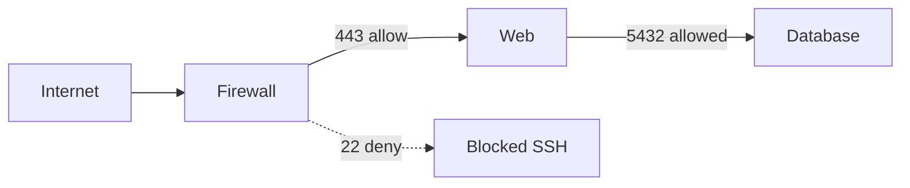
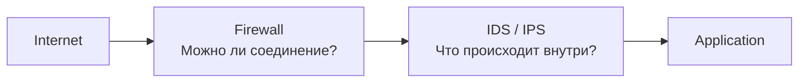
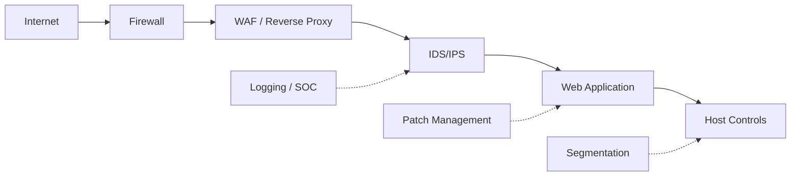

# Firewall и IDPS: кто за что отвечает

<div class="page-goal">
<strong>Зачем это знать:</strong> в реальной инфраструктуре вы почти никогда не защищаете сеть одним механизмом. Нужно понимать, какой контроль предотвращает ненужное соединение, а какой анализирует разрешённую активность.
</div>

## Практическая ситуация

Компания имеет:

- публичный сайт;
- SSH для администрирования;
- внутреннюю БД.

Политика:

```text
Internet → Web:443   ALLOW
Internet → Web:22    DENY
Web → Database:5432  ALLOW only required path
```

Firewall прекрасно подходит для этого.



Но допустим, злоумышленник отправляет exploit-like HTTP request на разрешённый `443`.

С точки зрения базового access rule:

```text
destination = Web
port = 443
state = valid
policy = allow
```

Соединение легитимно **по сетевой политике**, но его содержимое может быть вредоносным.

---

# 1. Firewall отвечает на вопрос доступа

Классический stateful firewall опирается на:

- source/destination;
- protocol;
- port;
- connection state;
- policy;
- zones/interfaces.

Это мощный preventive control.

Если сервис не нужен извне — лучше вообще не давать к нему доступ.

!!! important
    Самая хорошая IDS-сигнатура не заменяет принцип: **ненужный сервис не должен быть доступен атакующему**.

---

# 2. IDPS отвечает на вопрос активности

NIDS/NIPS анализирует контекст:

- сетевой поток;
- протокол;
- application metadata;
- content;
- известные attack patterns;
- anomalies;
- behavior.



---

# 3. Почему нельзя говорить «Firewall vs IDS»

Современные NGFW могут включать:

- stateful filtering;
- application identification;
- URL filtering;
- TLS inspection;
- IPS;
- malware controls.

То есть физически это может быть одно устройство.

Но логически всё равно существуют разные решения:

```text
Access decision
Threat detection
Prevention
Logging
Application control
```

На работе важно понимать **функцию**, а не только название продукта.

---

# 4. Defense-in-Depth

Реальная защита публичного приложения может выглядеть так:



Нет одного «магического» устройства.

---

# 5. Где firewall сильнее IDS

Если бизнесу не нужен:

```text
Internet → SSH
```

лучшее решение:

```text
DENY
```

Не нужно оставлять SSH открытым и надеяться, что IDS заметит brute force.

Это называется **attack surface reduction**.

---

# 6. Где IDPS добавляет ценность

Если:

```text
Internet → HTTPS
```

обязательно разрешён, IDPS может искать:

- exploit patterns;
- protocol anomalies;
- known malicious indicators;
- suspicious sequences;
- unexpected flows.

Но и здесь есть ограничения: например, TLS может скрывать L7 payload от пассивного NIDS.

Это отдельная тема курса.

---

# 7. Что это значит для архитектора

При проектировании задайте:

1. Какие соединения вообще нужны?
2. Что можно запретить на firewall?
3. Какой разрешённый трафик остаётся рискованным?
4. Где нужен detection?
5. Где допустим automatic prevention?
6. Где нужна endpoint telemetry?
7. Какие сегменты необходимо разделить?

---

## Мини-кейс

У вас есть внутренний DB Server.

Что лучше?

### Вариант A

```text
Internet → DB:5432 ALLOW
+ IDS rule на PostgreSQL attacks
```

### Вариант B

```text
Internet -X-> Database
Web/App → Database only required port
+ IDS monitoring
```

**B** архитектурно сильнее, потому что сначала уменьшается сама поверхность атаки.

---

## Самопроверка

<div class="quiz" data-question-id="fw-real-1">
  <p><strong>Публичному сайту нужен TCP/443. Какой подход наиболее корректен?</strong></p>
  <button data-choice="a">A. Запретить 443 и считать сервис защищённым</button>
  <button data-choice="b">B. Разрешить весь трафик без monitoring</button>
  <button data-choice="c" data-correct="true">C. Разрешить необходимый доступ и дополнить его защитой/monitoring соответствующего уровня</button>
  <button data-choice="d">D. Заменить firewall на Wireshark</button>
  <div class="quiz-feedback"></div>
</div>

??? question "А если у нас NGFW?"
    Тогда firewall и IPS-функции могут находиться в одном продукте. Но при проектировании и troubleshooting всё равно полезно разделять **access-control decision** и **intrusion detection/prevention logic**.

<div class="next-step">
<strong>Дальше:</strong> даже правильный механизм detection способен ошибаться. Разберём <a href="../05-detection-quality/">True/False Positives и False Negatives</a>.
</div>
