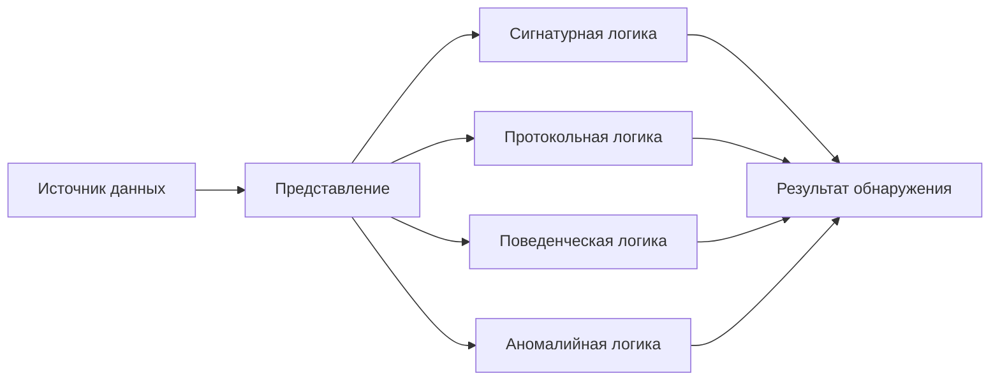
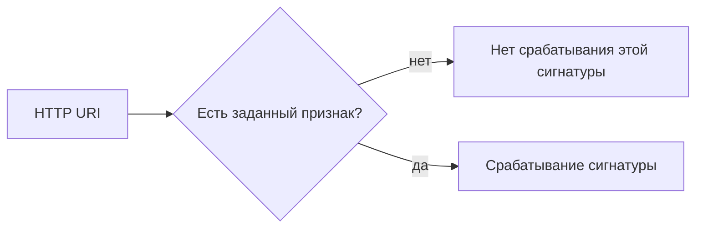
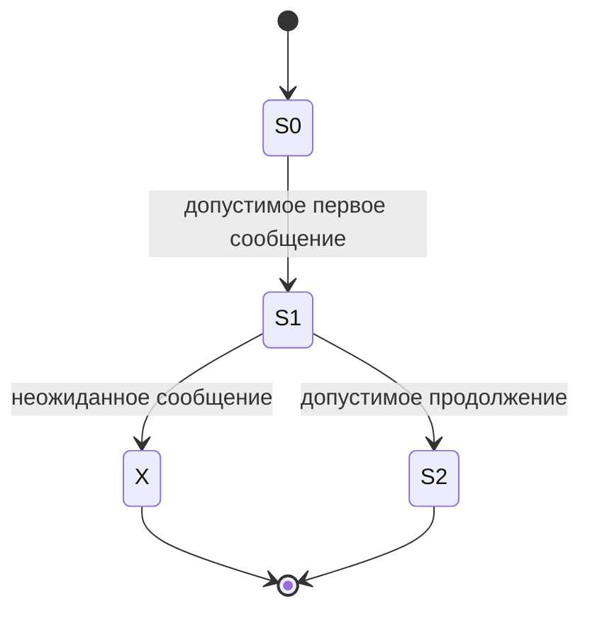
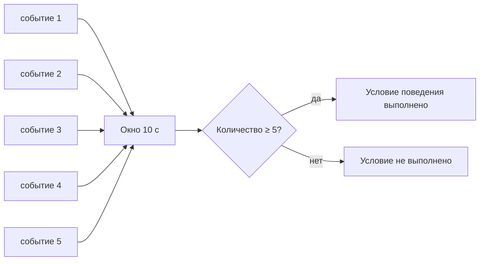

# Глава 5. Как IDS/IPS обнаруживает подозрительную активность

<div class="chapter-lead">
<p>В предыдущих главах мы ответили на три базовых вопроса: <strong>какие данные доступны системе</strong>, <strong>из каких компонентов она состоит</strong> и <strong>где должна находиться точка наблюдения</strong>. Теперь возникает следующий вопрос: <strong>как из доступных данных вообще получается решение «это стоит выделить»?</strong></p>

<p>Ответ не сводится к слову «сигнатура». Разные системы используют разные способы анализа, а один продукт может сочетать несколько способов одновременно.</p>
</div>

<div class="chapter-outcomes">
<strong>После этой главы вы должны уметь объяснить:</strong>
<p>чем источник данных отличается от метода обнаружения; как работает сигнатурный метод; что означает анализ состояния протокола; чем поведенческая логика отличается от аномалийного метода; почему отклонение от нормы не равно атаке; и почему реальные IDS/IPS часто объединяют несколько способов анализа.</p>
</div>

---

## 1. Источник данных и метод обнаружения — разные вопросы

После Главы 2 мы уже знаем, что система может получать сведения из сети, с хоста или из беспроводной среды.

Но один и тот же источник можно анализировать по-разному.

<div class="teaching-figure" markdown="1">
<div class="figure-label">СХЕМА 1 · ОТ ИСТОЧНИКА К РЕШЕНИЮ</div>



<div class="figure-caption">Сетевой трафик сам по себе не определяет метод обнаружения. Сначала система получает и представляет данные, затем применяет к ним одну или несколько логик анализа.</div>
</div>

Поэтому неверно ставить в один ряд:

```text
сетевая область наблюдения
хостовая область наблюдения
беспроводная область наблюдения
ПОВЕДЕНЧЕСКИЙ МЕТОД
```

Первые три понятия в основном описывают область или источник наблюдения. Поведенческая логика описывает уже способ анализа данных.

---

## 2. Удобная абстракция: детектор как условие над наблюдаемыми данными

Для курса введём простую абстракцию.

Пусть:

```text
R — представление наблюдаемой активности;
C — дополнительный контекст;
D — логика обнаружения.
```

Тогда детектор можно представить как функцию:

!!! abstract "Учебная модель детектора"
    `D(R, C) → {0, 1}`

где:

```text
0 — условие не выполнено;
1 — условие выполнено.
```

Это **не формула конкретного продукта**. Реальный механизм может выдавать не только бинарное решение, но и оценку, категорию события или несколько связанных результатов. Здесь бинарная форма нужна только как учебная абстракция, чтобы отделить условие обнаружения от источника данных.

Она помогает разделить три вопроса:

```text
что наблюдаем?
      ↓
в каком виде это доступно?
      ↓
какое условие применяем?
```

Именно последний вопрос является предметом этой главы.

---

# 3. Сигнатурный метод

**Сигнатурный метод** ищет заранее известный признак, который разработчик детектора решил считать значимым.

Признаком может быть не только буквальная строка. Это может быть комбинация полей, последовательность байтов, значение заголовка, тип команды, характеристика файла или другой заранее описанный шаблон.

Для простейшего случая:

!!! abstract "Сигнатурное условие"
    `Dsig(R) = 1`, если заранее заданный признак `P` найден в доступном представлении `R`.

Например, учебная сигнатура может искать маркер:

```text
ATTACK-LAB
```

в URI HTTP-запроса.

<div class="teaching-figure" markdown="1">
<div class="figure-label">СХЕМА 2 · СИГНАТУРНОЕ СОПОСТАВЛЕНИЕ</div>



<div class="figure-caption">Сигнатурный детектор отвечает только на вопрос, выполнено ли его конкретное условие. Он не доказывает успешность атаки и не гарантирует, что событие вредоносно.</div>
</div>

Классический NIST SP 800-94 описывает сигнатурное обнаружение как сравнение текущей единицы активности с известными сигнатурами. В простых случаях это действительно похоже на сопоставление шаблона. При этом даже сигнатурное правило может работать уже не с «сырыми байтами», а с разобранным полем протокола.

### Сильная сторона

Если признак хорошо известен и доступен системе, условие можно описать очень точно.

### Ограничение

Если значимый признак изменился так, что условие больше не выполняется, конкретная сигнатура может не сработать.

Например:

```text
правило ищет: freepics.exe
наблюдается:  freepics2.exe
```

Сам факт изменения имени ещё не говорит, что это тот же вредоносный объект. Пример показывает только ограничение точного сопоставления: **условие и наблюдаемые данные больше не совпадают**.

---

# 4. Анализ состояния протокола

Некоторые решения нельзя принять по одному изолированному фрагменту данных.

Система может учитывать:

- направление обмена;
- состояние соединения;
- очередность сообщений;
- допустимые значения полей;
- соответствие наблюдаемой последовательности модели протокола.

Упрощённо протокол можно представить как переходы между состояниями:

```text
S0 --сообщение A--> S1 --сообщение B--> S2
```

Модель состояния позволяет интерпретировать сообщение с учётом того, **что происходило до него**. Один из возможных результатов такого анализа — обнаружение неожиданного или недопустимого перехода. Другой вариант — проверка условия, смысл которого зависит от текущего состояния протокола.

Поэтому анализ состояния протокола нельзя сводить только к поиску «нарушений протокола».

<div class="teaching-figure" markdown="1">
<div class="figure-label">СХЕМА 3 · РЕШЕНИЕ ЗАВИСИТ ОТ СОСТОЯНИЯ</div>



<div class="figure-caption">Здесь важен не только сам фрагмент данных, но и то, в каком состоянии находился обмен до его появления.</div>
</div>

В NIST SP 800-94 этот класс описывается как **stateful protocol analysis**. Он отделён от сигнатурного и аномалийного методов, хотя в реальных продуктах эти механизмы могут быть тесно переплетены.

Это важная оговорка:

> Использование анализатора HTTP или состояния TCP само по себе ещё не превращает любое правило в отдельный «протокольный метод».

Парсер может всего лишь подготовить представление, которым затем воспользуется обычная сигнатура.

---

# 5. Поведенческая логика

!!! note "Почему здесь появляется отдельная категория"
    Классическая модель NIST SP 800-94 выделяет три основных метода: сигнатурный, аномалийный и анализ состояния протокола. Термин **«поведенческая логика»** в этом курсе используется как учебная инженерная категория для детерминированных условий над серией событий — например, «не менее пяти событий за десять секунд». Мы вводим её отдельно, чтобы не называть любое условие над поведением аномалийным обнаружением. Это не попытка добавить «четвёртый официальный метод NIST».

Теперь рассмотрим условие, в котором один отдельный запрос не является достаточным признаком.

Например:

```text
одна неудачная попытка входа
```

может быть обычной ошибкой пользователя.

Но условие:

```text
5 неудачных попыток одного источника за 10 секунд
```

описывает уже **поведение во времени**.

Для такого учебного детектора можно записать:

!!! abstract "Поведенческое условие"
    `Dbeh(E, Δt) = 1`, если `count(E, Δt) ≥ k`.

где:

```text
E  — интересующее событие;
Δt — временное окно;
k  — заданный порог.
```

<div class="teaching-figure" markdown="1">
<div class="figure-label">СХЕМА 4 · ЗНАЧИМА НЕ ОДНА ЗАПИСЬ, А СЕРИЯ</div>



<div class="figure-caption">Поведенческое условие может быть полностью детерминированным: заранее заданы событие, окно времени и порог.</div>
</div>

Именно поэтому в этом курсе мы **не будем автоматически считать поведенческое обнаружение аномалийным**.

---

# 6. Аномалийный метод

**Аномалийный метод** требует представления о том, что считается нормальным или ожидаемым состоянием.

NIST SP 800-94 определяет аномалийное обнаружение через сравнение наблюдаемой активности с профилем нормального поведения и поиск существенных отклонений.

Обобщённо:

!!! abstract "Аномалийная оценка"
    `A(x) = d(x, B)`, а срабатывание происходит при `A(x) > θ`.

где:

```text
x — текущее наблюдение;
B — профиль / базовая линия;
d — выбранная мера отличия.
```

где `θ` — выбранный порог.

<div class="teaching-figure" markdown="1">
<div class="figure-label">СХЕМА 5 · АНОМАЛИЯ ТРЕБУЕТ БАЗОВОЙ ЛИНИИ</div>


<div class="figure-caption">Без выбранной базовой линии, признака и меры отклонения нельзя строго сказать, что именно система считает аномалией.</div>
</div>

---

## 7. Поведение и аномалия — не одно и то же

Это различие принципиально.

### Поведенческое условие без базовой линии

```text
если источник сделал ≥ 5 неудачных входов за 10 секунд → выделить событие
```

Здесь нет обучения «норме». Порог задан заранее.

### Аномалийное условие

```text
обычно этот источник делает 1–2 попытки входа в час;
сейчас наблюдается 40;
отклонение превышает допустимый порог.
```

Здесь решение зависит от модели ожидаемого поведения.

<div class="scope-compare">
  <article>
    <span>ПОВЕДЕНЧЕСКАЯ ЛОГИКА</span>
    <strong>Условие над последовательностью или частотой</strong>
    <p>Может быть полностью задано инженером заранее и не требовать профиля нормы.</p>
  </article>
  <article>
    <span>АНОМАЛИЙНАЯ ЛОГИКА</span>
    <strong>Отклонение от выбранной базовой линии</strong>
    <p>Требует определить, что считается ожидаемым поведением и насколько сильное отклонение значимо.</p>
  </article>
</div>

Поэтому выражение:

```text
ПОВЕДЕНЧЕСКОЕ = АНОМАЛИЙНОЕ
```

в рамках курса считается некорректным.

---

# 8. «Необычно» не означает «вредоносно»

Аномалия означает только:

> наблюдение существенно отличается от выбранной модели ожидаемого поведения.

Причиной может быть:

- атака;
- обновление приложения;
- резервное копирование;
- нагрузочное тестирование;
- изменение бизнес-процесса;
- ошибочно построенная базовая линия.

Поэтому:

```text
АНОМАЛИЯ ≠ АТАКА
```

Точно так же:

```text
СРАБАТЫВАНИЕ СИГНАТУРЫ ≠ УСПЕШНАЯ КОМПРОМЕТАЦИЯ
```

и:

```text
НАРУШЕНИЕ ПРОТОКОЛЬНОГО ОЖИДАНИЯ ≠ ДОКАЗАННЫЙ ВЗЛОМ
```

Метод определяет способ выделения события, но не отменяет необходимость корректной интерпретации результата.

---

# 9. Реальные системы могут сочетать методы

Не нужно представлять методы как четыре независимые «коробки».

NIST прямо отмечает, что в сетевых IDPS методы могут быть тесно переплетены: протокольный анализ может разобрать запрос и ответ, после чего полученные представления проверяются другими условиями.

Например:

```text
TCP stream
   ↓
анализатор HTTP
   ↓
поле URI
   ↓
сигнатурное условие
```

или:

```text
события входа
   ↓
группировка по пользователю
   ↓
счётчик за окно времени
   ↓
поведенческое условие
```

или:

```text
сетевые потоки
   ↓
признаки за сутки
   ↓
базовая линия
   ↓
оценка отклонения
```

Один продукт может использовать несколько таких путей одновременно.

---

# 10. Один набор данных — разные вопросы

Рассмотрим HTTP-журнал:

```text
10.13.37.10 GET /login?result=fail
10.13.37.10 GET /login?result=fail
10.13.37.10 GET /login?result=fail
10.13.37.10 GET /login?result=fail
10.13.37.10 GET /login?result=fail
```

Разные детекторы могут задать к одним данным разные вопросы.

| Логика | Вопрос |
|---|---|
| Сигнатурная | Есть ли известный маркер или конкретное значение? |
| Протокольная | Соответствует ли обмен ожидаемому состоянию протокола? |
| Поведенческая | Сколько таких событий произошло за заданное окно? |
| Аномалийная | Насколько текущее значение отличается от базовой линии? |

Следовательно:

> **Метод обнаружения определяется не названием источника, а тем, какое условие применяется к доступному представлению данных.**

---

# 11. Сводная карта методов

| Метод | На чём основано решение | Нужна базовая линия | Нужен контекст нескольких событий | Что означает срабатывание |
|---|---|---:|---:|---|
| Сигнатурный | заранее заданный признак | нет | не обязательно | найдено заданное условие |
| Анализ состояния протокола | модель протокола и его состояния | нет | часто да | наблюдаемая последовательность удовлетворила протокольному условию или нарушила ожидание |
| Поведенческая логика | последовательность, частота, связь событий | нет, не обязательно | обычно да | выполнено заранее заданное условие поведения |
| Аномалийный | отклонение от профиля нормы | да | зависит от модели | наблюдение вышло за выбранную границу нормы |

Эта таблица не утверждает, что все продукты используют именно четыре независимых модуля. Она нужна для того, чтобы не смешивать разные основания решения.

---

# 12. Проверка понимания

**Ситуация 1**

Правило ищет строку `LAB-MARKER` в URI.

Какой это принцип?

> Сигнатурный: заранее известный признак сопоставляется с доступным представлением URI.

---

**Ситуация 2**

Система выделяет источник только после пятой неудачной попытки входа за десять секунд. Профиль обычной активности не строится.

Можно ли автоматически назвать это аномалийным обнаружением?

> Нет. Здесь достаточно заранее заданного поведенческого порога. Базовая линия нормы не используется.

---

**Ситуация 3**

Обычно длина определённого параметра находится около 5–10 символов, а сейчас получено 500 символов. Система сравнила значение с обученным профилем и отметила сильное отклонение.

Что можно утверждать?

> Наблюдение является аномальным относительно выбранной модели. Из этого ещё не следует, что запрос вредоносный.

---

**Ситуация 4**

Suricata разобрала HTTP и правило проверило `http.uri`.

Означает ли это, что правило автоматически реализует отдельный метод анализа состояния протокола?

> Нет. Парсер мог лишь предоставить структурированное представление URI, а итоговое условие оставаться сигнатурным.

---

# Переход к Главе 6

После этой главы мы понимаем, **какие основания решения вообще бывают**.

Но пока условия записывались в человеческом виде:

```text
если в URI есть маркер;
если событий ≥ 5 за 10 секунд;
если значение существенно отклоняется от нормы.
```

Следующий вопрос:

> **Как такое условие выражается в реальной IDS/IPS?**

В Главе 6 мы впервые системно разберём правила: действие, направление, протокол, адреса, порты, поля приложения, идентификатор правила и контекст состояния.

До этого момента студент не обязан был уметь писать правила Suricata самостоятельно. Теперь для этого появляется теоретическая основа.
