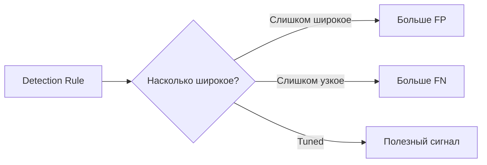

# Качество детектирования: почему больше alerts — не значит лучше

<div class="page-goal">
<strong>Зачем это знать:</strong> на реальной работе вы будете бороться не только с атаками, но и с плохими детектами. Низкое качество правил перегружает SOC, а в IPS может непосредственно ломать бизнес.
</div>

## Ситуация

Вы написали правило:

```text
если URI содержит "admin" → alert
```

Оно ловит:

```text
/admin/login
```

Но также ловит:

```text
/admin-guide
/docs/admin_manual.pdf
```

Количество alerts выросло.

Стала ли система лучше?

**Нет.**

---

# 1. Четыре возможных результата

| Реальность | Детектор сработал | Детектор не сработал |
|---|---|---|
| Угроза есть | **True Positive (TP)** | **False Negative (FN)** |
| Угрозы нет | **False Positive (FP)** | **True Negative (TN)** |

---

# 2. True Positive

Есть реальная угроза, и правило её обнаружило.

```text
Threat present
     +
Detection fired
     =
True Positive
```

Это желаемый результат.

---

# 3. False Positive

Угрозы нет, но система сработала.

```text
Legitimate activity
       ↓
Rule matched
       ↓
Alert
```

Последствия для IDS:

- лишняя работа;
- alert fatigue;
- потеря времени аналитика;
- риск игнорировать действительно важные события.

Последствия для IPS:

```text
False Positive
       ↓
automatic block
       ↓
legitimate traffic denied
```

Поэтому FP в IPS способен стать инцидентом доступности.

---

# 4. False Negative

Угроза есть, но система её не увидела.

Причины:

- слишком узкая сигнатура;
- новая техника;
- encoding/evasion;
- encryption;
- неправильное sensor placement;
- отсутствующая telemetry;
- parser limitation;
- misconfiguration.

FN опасен тем, что система создаёт **иллюзию отсутствия угрозы**.

---

# 5. True Negative

Нормальная активность корректно не вызывает срабатывание.

Это тоже важный результат.

Хорошее правило должно не только ловить:

```text
malicious
```

но и корректно пропускать:

```text
benign
```

---

# 6. Почему tuning — инженерная работа

Начальное правило:

```text
content:"admin";
```

слишком широкое.

Уточнённая detection logic может учитывать:

```text
method = POST
URI = /admin/login
direction = to_server
flow = established
additional headers/context
```

Цель:

```text
attack → detect
normal → no alert
```

Но слишком сильное сужение повышает риск FN.

---

# 7. Ментальная модель



Не существует универсальной «идеальной чувствительности».

Она зависит от:

- критичности актива;
- стоимости пропуска;
- стоимости ложной блокировки;
- качества telemetry;
- процесса response.

---

# 8. Почему это важно для SOC

Допустим, IDS генерирует:

```text
50 000 alerts/day
```

а команда способна качественно проверить:

```text
500
```

Тогда даже технически работающий detector может быть практически бесполезен.

Отсюда появляются:

- rule tuning;
- suppression;
- thresholding;
- correlation;
- prioritization;
- asset context;
- severity;
- enrichment.

---

# 9. Base Rate — интуитивно

Если реальных атак очень мало относительно миллионов нормальных событий, даже небольшой процент FP способен создать огромное количество ложных alerts.

Это одна из причин, почему:

> «наш detector имеет 99% accuracy»

— недостаточная характеристика.

Нужно знать отдельно:

- TPR;
- FPR;
- precision;
- prevalence/base rate.

Математически мы вернёмся к этому в лекции о Denning и Base-Rate Fallacy.

---

# 10. Как тестируют detection rule

Перед включением в prevention:

| Test | Expected |
|---|---|
| Known malicious sample | Alert |
| Normal request | No alert |
| Similar benign request | No alert |
| Encoded/modified malicious request | желательно alert |
| High-volume normal traffic | без чрезмерного FP |

Это уже напоминает software testing.

Detection engineering действительно во многом является **инженерией правил и тестов**.

---

## Профессиональный вопрос

Вас спрашивают:

> Что хуже: False Positive или False Negative?

Слабый ответ:

> FN хуже.

Сильный:

> Зависит от контекста. FN может пропустить компрометацию, но FP в inline IPS может остановить критичный production-сервис. Нужно учитывать риск, impact и назначение контроля.

---

## Самопроверка

<div class="quiz" data-question-id="quality-real-1">
  <p><strong>Легитимный `/admin-guide` был заблокирован IPS правилом `content:"admin"`. Как классифицировать результат?</strong></p>
  <button data-choice="a">A. True Positive</button>
  <button data-choice="b" data-correct="true">B. False Positive</button>
  <button data-choice="c">C. False Negative</button>
  <button data-choice="d">D. True Negative</button>
  <div class="quiz-feedback"></div>
</div>

<div class="quiz" data-question-id="quality-real-2">
  <p><strong>Почему правило нельзя считать хорошим только потому, что оно поймало тестовую атаку?</strong></p>
  <button data-choice="a">A. Нужно проверить только CPU</button>
  <button data-choice="b" data-correct="true">B. Нужно проверить и malicious, и benign scenarios, включая риск FP/FN</button>
  <button data-choice="c">C. Любой alert означает идеальную сигнатуру</button>
  <button data-choice="d">D. Правила IDS не тестируются</button>
  <div class="quiz-feedback"></div>
</div>

<div class="next-step">
<strong>Дальше:</strong> даже идеальная сигнатура бесполезна, если сенсор не видит нужный трафик. Поэтому разберём <a href="../06-placement/">Sensor Placement</a>.
</div>
