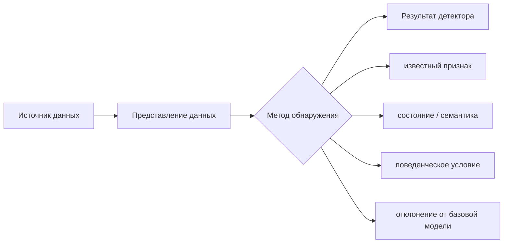
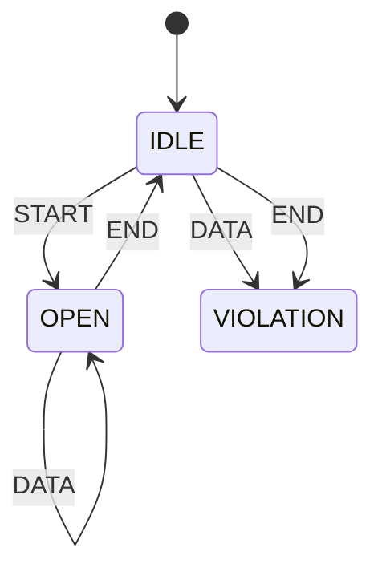
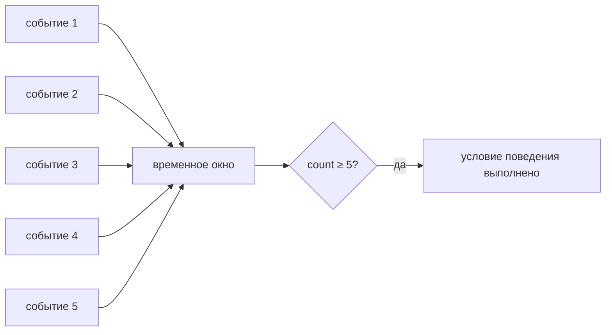
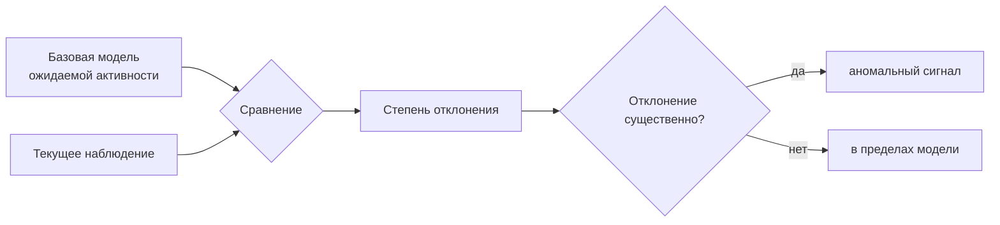
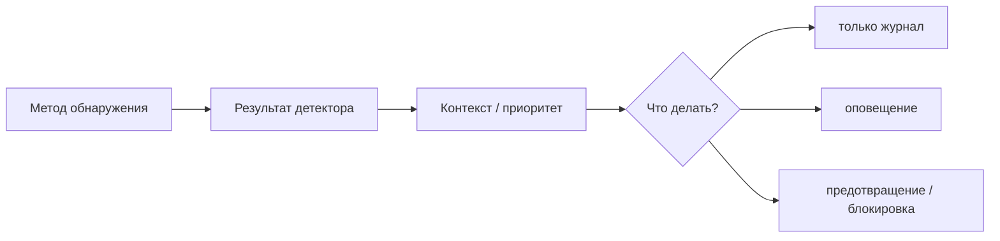
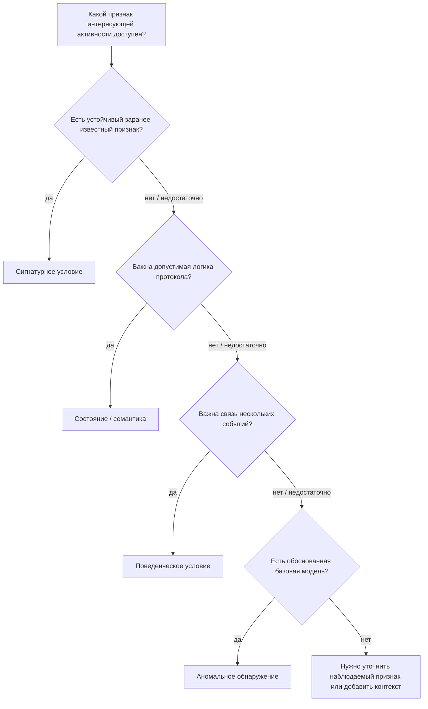

# Глава 5. Как IDS/IPS обнаруживает подозрительную активность

<div class="chapter-lead">
<p>К этому моменту мы уже знаем, <strong>какие данные</strong> может получить IDS/IPS, <strong>как они представлены</strong> и <strong>где</strong> должна находиться точка наблюдения. Теперь можно задать следующий вопрос: имея наблюдаемые данные, <strong>по какому принципу система решает, что активность требует внимания?</strong></p>
</div>

<div class="chapter-outcomes">
<strong>После этой главы вы должны уметь:</strong>
<p>различать сигнатурное обнаружение, анализ состояния и семантики протокола, поведенческий анализ и аномальное обнаружение; объяснять, почему поведенческий анализ не равен аномальному; понимать, что несколько методов могут применяться к одному событию одновременно; и отделять метод обнаружения от источника данных, синтаксиса правила, приоритета оповещения и действия предотвращения.</p>
</div>

---

## 1. Метод обнаружения — это принцип принятия решения

Пусть система уже получила данные о событии. Например, ей доступны:

```text
HTTP-запрос;
состояние TCP-соединения;
последовательность событий аутентификации;
изменения файла;
статистика сетевых потоков.
```

Само наличие данных ещё не объясняет, почему система должна выделить конкретное наблюдение среди остальных.

Нужен **метод обнаружения** — принцип, по которому наблюдаемые признаки превращаются в решение:

> **«это событие или последовательность событий соответствует условию, которое требует внимания».**

<div class="teaching-figure" markdown="1">
<div class="figure-label">СХЕМА 1 · ИСТОЧНИК, ПРЕДСТАВЛЕНИЕ И МЕТОД — РАЗНЫЕ ВОПРОСЫ</div>



<div class="figure-caption">Один и тот же источник может поддерживать несколько методов обнаружения. Метод отвечает на вопрос «по какому принципу принимается решение», а не «откуда пришли данные».</div>
</div>

Поэтому нельзя строить классификацию так:

```text
сетевая IDS
хостовая IDS
поведенческая IDS
```

Первые два определения описывают прежде всего источник наблюдения, а «поведенческий» — способ анализа.

---

## 2. Сигнатурное обнаружение: известный признак

**Сигнатурное обнаружение (signature-based detection)** сравнивает наблюдаемую активность с заранее определённым признаком или условием, связанным с известным интересующим событием.

Простейший учебный пример:

```text
если HTTP URI содержит LAB-KNOWN-BAD
→ сформировать оповещение
```

Смысл метода не в буквальной строке. Сигнатура может учитывать:

```text
значение поля протокола;
последовательность байтов;
адрес или домен;
комбинацию нескольких признаков;
контекст направления или состояния соединения.
```

<div class="concept-formula primary-formula">
  <span class="formula-left">НАБЛЮДАЕМЫЙ ПРИЗНАК</span>
  <span class="formula-sign">=</span>
  <span class="formula-right">ЗАРАНЕЕ ОПРЕДЕЛЁННОЕ УСЛОВИЕ</span>
  <p>Детектор сообщает о совпадении с известным условием. Само совпадение ещё не доказывает успешную атаку или компрометацию.</p>
</div>

Сильная сторона сигнатурного подхода — понятная причина срабатывания. Если условие достаточно специфично, аналитик может точно увидеть, **какой признак совпал**.

Ограничение очевидно: если интересующая активность не содержит предусмотренного признака, конкретная сигнатура может её не выделить.

Это не означает, что сигнатурный метод «видит только старые атаки». Хорошая сигнатура может описывать устойчивое свойство целого класса событий. Но её логика всё равно должна быть определена заранее.

---

## 3. Анализ состояния и семантики протокола

Некоторые события становятся понятны только тогда, когда система знает **смысл полей** и **допустимую последовательность состояний** протокола.

Например, отдельные сообщения могут выглядеть допустимо по отдельности, но их порядок нарушает ожидаемую логику обмена.

<div class="teaching-figure" markdown="1">
<div class="figure-label">СХЕМА 2 · СОСТОЯНИЕ МЕНЯЕТ СМЫСЛ ОДНОГО И ТОГО ЖЕ СООБЩЕНИЯ</div>



<div class="figure-caption">Это синтетическая модель протокола для объяснения принципа. Сообщение DATA допустимо в состоянии OPEN, но является нарушением модели в состоянии IDLE.</div>
</div>

В реальной системе такой анализ может использовать:

```text
состояние сетевого или транспортного протокола;
связь запроса и ответа;
тип сообщения и допустимое направление;
смысл полей прикладного протокола;
ожидаемые переходы между состояниями.
```

NIST SP 800-94 исторически выделяет **stateful protocol analysis** как один из основных классов методов обнаружения: система сопоставляет наблюдаемую активность с моделью допустимого использования протокола и отслеживает его состояние.

При этом важно не сделать слишком сильный вывод:

<div class="principle-box">
<strong>НАРУШЕНИЕ ПРОТОКОЛЬНОЙ МОДЕЛИ ≠ ДОКАЗАННАЯ АТАКА</strong>
<p>Необычная или недопустимая с точки зрения модели последовательность требует внимания, но её причина может быть связана с ошибкой клиента, несовместимостью реализации, повреждением данных или атакой.</p>
</div>

Качество такого метода зависит от того, насколько корректно система распознаёт протокол и насколько точна используемая модель его состояния.

---

## 4. Поведенческий анализ: условие над несколькими событиями

Одного события часто недостаточно. Значимым становится **отношение между событиями во времени**.

Например:

```text
одна неуспешная аутентификация
```

обычно не представляет интереса сама по себе.

Но условие:

```text
5 неуспешных аутентификаций
от одного источника
за 30 секунд
```

уже описывает поведение.

<div class="teaching-figure" markdown="1">
<div class="figure-label">СХЕМА 3 · ПОВЕДЕНЧЕСКОЕ УСЛОВИЕ ИСПОЛЬЗУЕТ СВЯЗЬ МЕЖДУ СОБЫТИЯМИ</div>



<div class="figure-caption">Здесь нет необходимости сначала изучать «нормальное» поведение. Детектор применяет заранее заданное условие к серии событий.</div>
</div>

Поведенческим признаком могут быть:

```text
частота событий;
повторяемость;
последовательность действий;
fan-out к множеству узлов;
редкое сочетание действий одной сущности;
изменение поведения во времени.
```

Главное: поведенческий анализ **не обязан** строить базовую модель нормального состояния.

Фиксированное правило:

```text
если один источник создаёт ≥ 5 событий за 30 секунд
→ выделить эпизод
```

уже является анализом поведения, хотя никакого обучения на норме не происходило.

---

## 5. Аномальное обнаружение: отклонение от ожидаемого

**Аномальное обнаружение (anomaly-based detection)** использует другую логику: сначала определяется некоторое представление **ожидаемой или нормальной активности**, а затем текущие наблюдения сравниваются с этой моделью.

<div class="teaching-figure" markdown="1">
<div class="figure-label">СХЕМА 4 · АНОМАЛИЯ ТРЕБУЕТ ТОЧКИ СРАВНЕНИЯ</div>



<div class="figure-caption">Без базовой модели, профиля или иного ожидаемого диапазона нельзя говорить об аномалии в строгом смысле: не определено, относительно чего измеряется отклонение.</div>
</div>

Базовая модель может быть простой:

```text
обычно 1–2 запроса в секунду;
```

или значительно сложнее:

```text
типичная активность пользователя по времени суток;
обычный объём сетевых потоков между сегментами;
статистическое распределение признаков;
модель, построенная алгоритмом машинного обучения.
```

Но принцип остаётся тем же:

<div class="concept-formula neutral-formula">
  <span class="formula-left">ТЕКУЩЕЕ НАБЛЮДЕНИЕ</span>
  <span class="formula-sign">vs</span>
  <span class="formula-right">ОЖИДАЕМАЯ МОДЕЛЬ</span>
  <p>Аномалия — это значимое отклонение от выбранной модели, а не синоним вредоносности.</p>
</div>

Отсюда следует важное ограничение:

> **НЕОБЫЧНО ≠ ВРЕДОНОСНО.**

Резкое увеличение трафика может быть атакой, но может быть и легитимной нагрузкой. И наоборот, вредоносное действие может выглядеть достаточно «обычно» и не выйти за границы профиля.

---

## 6. Поведенческий анализ и аномальное обнаружение — не синонимы

Это одно из ключевых различий курса.

<div class="scope-compare">
  <article><span>ПОВЕДЕНЧЕСКИЙ</span><strong>≥ 5 запросов за 2 секунды</strong><p>Порог задан заранее. Детектор проверяет, произошло ли определённое поведение.</p></article>
  <article><span>АНОМАЛЬНЫЙ</span><strong>в 6 раз быстрее базового профиля</strong><p>Решение зависит от ранее измеренного ожидаемого поведения.</p></article>
</div>

Оба метода могут использовать одинаковые признаки — например, количество запросов во времени. Различается **принцип решения**.

```text
Поведенческий анализ:
наблюдения → фиксированное условие → результат

Аномальное обнаружение:
базовая модель + наблюдения → оценка отклонения → результат
```

Поэтому утверждение:

```text
Behavioral = Anomaly
```

неверно.

Поведение — это то, **какую структуру активности** мы рассматриваем. Аномальность — это то, **как мы оцениваем эту активность относительно ожидания**.

---

## 7. Один набор событий можно анализировать несколькими методами

Методы не обязаны быть взаимоисключающими.

Представим один контролируемый набор событий:

```text
обычная серия запросов;
запрос с известным маркером;
сообщение в недопустимом состоянии учебного протокола;
короткий всплеск частоты запросов.
```

К нему можно применить разные вопросы.

<div class="method-demo" data-method="signature">
  <div class="method-demo__controls">
    <button class="method-choice active" data-method-choice="signature">Сигнатура</button>
    <button class="method-choice" data-method-choice="protocol">Состояние протокола</button>
    <button class="method-choice" data-method-choice="behavior">Поведение</button>
    <button class="method-choice" data-method-choice="anomaly">Аномалия</button>
  </div>
  <div class="method-demo__scene">
    <div class="method-demo__event">
      <span>Один набор наблюдений</span>
      <strong>URI, состояния, временные метки и повторяющиеся запросы</strong>
    </div>
    <div class="method-demo__question">
      <span class="method-demo__label">Вопрос детектора</span>
      <h3 class="method-demo__title"></h3>
      <p class="method-demo__text"></p>
    </div>
    <div class="method-demo__result">
      <span>Граница вывода</span>
      <strong class="method-demo__outcome"></strong>
    </div>
  </div>
</div>

Один и тот же эпизод может одновременно:

```text
совпасть с известной сигнатурой;
нарушить модель состояния;
выполнить поведенческий порог;
сильно отклониться от базового профиля.
```

Это не четыре взаимоисключающих «типа атак». Это четыре разных основания для решения детектора.

---

## 8. Сигнатура или правило — не то же самое, что метод

Здесь легко смешать два уровня.

**Метод обнаружения** отвечает на вопрос:

> по какому принципу активность считается интересующей?

**Правило** или другая машинно-исполняемая конструкция отвечает на вопрос:

> как этот принцип выражен в конкретном движке?

Например, один rule engine может уметь выразить:

```text
совпадение известной строки;
проверку нормализованного поля HTTP;
условие по состоянию flow;
порог количества совпадений во времени.
```

Поэтому нельзя автоматически считать любое правило «сигнатурным методом» только потому, что оно записано в синтаксисе rules.

В Suricata, например, правило может обращаться к разобранным полям HTTP и состоянию потока, а механизмы вроде `flowbits` позволяют сохранять состояние внутри flow. Это показывает, что **язык правил и принцип обнаружения — разные уровни модели**.

Синтаксис правил и самостоятельное написание Suricata rules будут темой Главы 6.

---

## 9. Приоритет и предотвращение появляются после решения детектора

Метод обнаружения не определяет автоматически:

```text
насколько событие критично;
нужно ли блокировать трафик;
нужно ли открыть инцидент;
кому отправить уведомление.
```

<div class="teaching-figure" markdown="1">
<div class="figure-label">СХЕМА 5 · ОБНАРУЖЕНИЕ, ПРИОРИТИЗАЦИЯ И ВОЗДЕЙСТВИЕ — РАЗНЫЕ ЭТАПЫ</div>



<div class="figure-caption">Одинаковое основание обнаружения может приводить к разным действиям в зависимости от политики, режима работы и дополнительного контекста.</div>
</div>

Поэтому фраза:

```text
аномалия обнаружена → соединение нужно заблокировать
```

не является универсальным правилом.

Сначала система выделяет активность. Затем другие механизмы и политика определяют её приоритет и возможную реакцию.

---

## 10. Что именно доказывает результат каждого метода

В предыдущих главах мы уже отделяли оповещение от компрометации. Здесь это правило нужно сделать ещё точнее.

<div class="evidence-boundary">
  <article class="evidence-supported"><span>СИГНАТУРА</span><strong>Поддерживает вывод</strong><p>наблюдение совпало с заранее определённым условием.</p></article>
  <article class="evidence-not-proven"><span>НЕ ДОКАЗЫВАЕТ</span><strong>Само по себе</strong><p>что атака была успешной или что узел скомпрометирован.</p></article>
</div>

<div class="evidence-boundary">
  <article class="evidence-supported"><span>СОСТОЯНИЕ / СЕМАНТИКА</span><strong>Поддерживает вывод</strong><p>наблюдаемая последовательность не соответствует используемой модели протокола.</p></article>
  <article class="evidence-not-proven"><span>НЕ ДОКАЗЫВАЕТ</span><strong>Само по себе</strong><p>что причиной нарушения является злоумышленник.</p></article>
</div>

<div class="evidence-boundary">
  <article class="evidence-supported"><span>ПОВЕДЕНИЕ</span><strong>Поддерживает вывод</strong><p>выполнено заданное условие над несколькими событиями.</p></article>
  <article class="evidence-not-proven"><span>НЕ ДОКАЗЫВАЕТ</span><strong>Само по себе</strong><p>что это поведение отклоняется от реальной нормы среды.</p></article>
</div>

<div class="evidence-boundary">
  <article class="evidence-supported"><span>АНОМАЛИЯ</span><strong>Поддерживает вывод</strong><p>наблюдение существенно отклонилось от выбранной базовой модели.</p></article>
  <article class="evidence-not-proven"><span>НЕ ДОКАЗЫВАЕТ</span><strong>Само по себе</strong><p>что отклонение является вредоносным.</p></article>
</div>

---

## 11. Как выбирать метод обнаружения

Выбор начинается не с названия продукта и не с желания «включить ML».

<div class="teaching-figure" markdown="1">
<div class="figure-label">СХЕМА 6 · ОТ НАБЛЮДАЕМОГО ПРИЗНАКА К МЕТОДУ</div>



<div class="figure-caption">Это не жёсткая последовательность выбора и не утверждение, что методы взаимоисключающие. Схема помогает понять, какое основание решения вообще доступно для конкретной задачи.</div>
</div>

В реальной IDPS методы часто комбинируются. NIST SP 800-94 прямо отмечает, что продукты могут использовать несколько методологий отдельно или совместно.

---

## 12. Что нужно запомнить

<div class="axiom-grid">
  <div class="axiom-card"><span>01</span><strong>Источник данных ≠ метод обнаружения</strong><p>Сетевые, хостовые или прикладные данные могут анализироваться разными способами.</p></div>
  <div class="axiom-card"><span>02</span><strong>Behavioral ≠ Anomaly</strong><p>Поведенческий детектор может использовать фиксированное условие и вообще не иметь обученной модели нормы.</p></div>
  <div class="axiom-card"><span>03</span><strong>Методы могут комбинироваться</strong><p>Один эпизод может одновременно удовлетворять нескольким независимым условиям обнаружения.</p></div>
  <div class="axiom-card"><span>04</span><strong>Detection result ≠ verdict о компрометации</strong><p>Каждый метод сообщает только то, что следует из его собственного условия и доступных данных.</p></div>
</div>

---

## 13. Проверка понимания

<div class="quiz" data-question-id="chapter5-v227-q1">
  <p><strong>Детектор формирует событие, когда один источник выполняет не менее пяти попыток входа за 30 секунд. Базовый профиль нормальной активности не строится. Как точнее описать этот принцип?</strong></p>
  <button data-choice="a">A. Обязательно аномальное обнаружение</button>
  <button data-choice="b" data-correct="true">B. Поведенческое условие с заранее заданным порогом</button>
  <button data-choice="c">C. Только анализ состояния протокола</button>
  <button data-choice="d">D. Источник данных NIDS</button>
  <div class="quiz-feedback"></div>
</div>

<div class="quiz" data-question-id="chapter5-v227-q2">
  <p><strong>Что необходимо, чтобы утверждение «активность аномальна» имело определённый смысл?</strong></p>
  <button data-choice="a">A. Любая строковая сигнатура</button>
  <button data-choice="b">B. Только inline-размещение</button>
  <button data-choice="c" data-correct="true">C. Модель, профиль или иной ожидаемый диапазон, относительно которого измеряется отклонение</button>
  <button data-choice="d">D. Обязательное блокирование события</button>
  <div class="quiz-feedback"></div>
</div>

<div class="quiz" data-question-id="chapter5-v227-q3">
  <p><strong>Два сообщения допустимы по отдельности, но второе пришло в состоянии, где протокол его не допускает. Какое основание обнаружения здесь главное?</strong></p>
  <button data-choice="a">A. Только адрес источника</button>
  <button data-choice="b" data-correct="true">B. Состояние и семантика протокола</button>
  <button data-choice="c">C. Обязательно статистическая аномалия</button>
  <button data-choice="d">D. Приоритет alert</button>
  <div class="quiz-feedback"></div>
</div>

<div class="quiz" data-question-id="chapter5-v227-q4">
  <p><strong>Почему правило Suricata нельзя автоматически приравнять к сигнатурному методу?</strong></p>
  <button data-choice="a">A. Потому что Suricata не поддерживает сигнатуры</button>
  <button data-choice="b">B. Потому что rules используются только для блокировки</button>
  <button data-choice="c" data-correct="true">C. Потому что язык правил может выражать разные условия: содержимое, состояние, протокольный контекст и пороговую логику</button>
  <button data-choice="d">D. Потому что метод обнаружения определяется только местом установки сенсора</button>
  <div class="quiz-feedback"></div>
</div>

---

## Практическое закрепление

В [ЛР №4](../../labs/lab04/) источник данных и сценарий намеренно фиксированы. Один контролируемый набор событий анализируется четырьмя способами:

```text
известный маркер                → сигнатурный метод;
нарушение состояния             → анализ состояния/семантики;
фиксированный порог по времени  → поведенческий метод;
отклонение от измеренной нормы  → аномальный метод.
```

Студент не пишет собственные rules. Цель работы — увидеть различия между основаниями обнаружения и границами допустимого вывода. Самостоятельное выражение detection logic в синтаксисе Suricata переносится в Главу 6.

<div class="next-step">
<strong>Следующая теоретическая тема:</strong> теперь, когда принципы обнаружения разделены, можно разбирать, <strong>как конкретное условие выражается в правиле</strong>, из каких частей оно состоит и как движок применяет его к данным.
</div>

---

## Источники и границы главы

- NIST SP 800-94, раздел 2.3 — исторический фундаментальный источник для сигнатурного, аномального и stateful protocol analysis. Публикация 2007 года используется как основа принципов, а не как исчерпывающая современная продуктовая taxonomy.
- Suricata 8.0.7 documentation — подтверждает, что современный rule engine может использовать состояние потока, разобранные поля прикладного протокола и сохраняемое состояние (`flowbits`), поэтому синтаксис правила нельзя считать отдельным методом обнаружения.
- В курсе **поведенческий анализ** используется как более широкое описание условий над последовательностями, частотой и отношениями между событиями. Он намеренно не отождествляется с anomaly-based detection: фиксированное поведенческое условие может не использовать профиль нормальной активности.
- Учебная state-machine `START → DATA → END` является **SYNTHETIC ENGINEERING** и создана для ЛР №4. Она демонстрирует принцип анализа состояния, но не является моделью стандарта HTTP.

Актуальные ссылки и статус источников собраны в разделе [«Источники курса»](../../resources/sources/).
