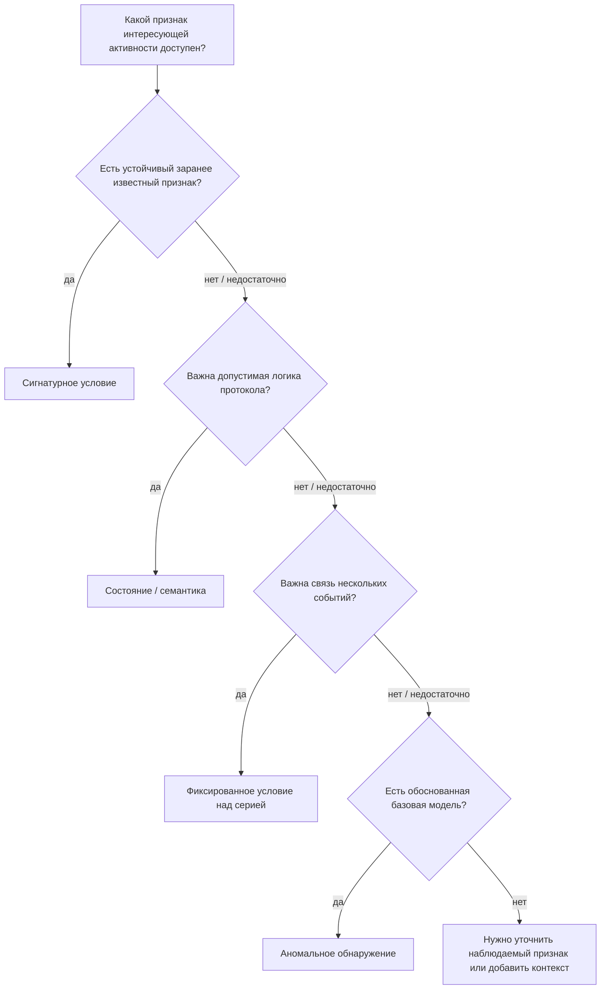

# Глава 5. Как IDS/IPS обнаруживает подозрительную активность

<div class="chapter-lead">
<p>К этому моменту мы уже знаем, <strong>какие данные</strong> может получить IDS/IPS, <strong>как они представлены</strong> и <strong>где</strong> должна находиться точка наблюдения. Теперь можно задать следующий вопрос: имея наблюдаемые данные, <strong>по какому принципу система решает, что активность требует внимания?</strong></p>
</div>

<div class="chapter-outcomes">
<strong>После этой главы вы должны уметь:</strong>
<p>различать сигнатурное обнаружение, анализ состояния и семантики протокола, фиксированное условие над серией событий и аномальное обнаружение; понимать, что эти основания решения не являются четырьмя типами IDS; объяснять, какой факт поддерживает результат каждого детектора; и связывать теорию с ЛР №4, где один набор событий анализируется четырьмя разными способами.</p>
</div>

---

## 1. Основание обнаружения — это отдельный уровень модели

Пусть система уже получила данные о событии. Например, ей доступны:

```text
HTTP-запрос;
состояние TCP-соединения;
последовательность событий аутентификации;
изменения файла;
статистика сетевых потоков.
```

Само наличие данных ещё не объясняет, почему система должна выделить конкретное наблюдение среди остальных. Нужен **принцип принятия решения** — основание, по которому наблюдаемые признаки превращаются в результат обнаружения.

<div class="idps-figure">
<div class="idps-figure__label">ВИЗУАЛЬНАЯ МОДЕЛЬ · ОТ ДАННЫХ К РЕЗУЛЬТАТУ</div>
<div class="idps-process">
  <div class="idps-process__step idps-process__step--source"><span>1</span><strong>Источник данных</strong><small>сеть, хост, приложение, потоковая статистика</small></div>
  <div class="idps-process__arrow">→</div>
  <div class="idps-process__step"><span>2</span><strong>Представление</strong><small>поле протокола, событие, последовательность, числовой признак</small></div>
  <div class="idps-process__arrow">→</div>
  <div class="idps-process__step idps-process__step--sensor"><span>3</span><strong>Основание решения</strong><small>по какому условию детектор выделяет активность</small></div>
  <div class="idps-process__arrow">→</div>
  <div class="idps-process__step idps-process__step--result"><span>4</span><strong>Результат детектора</strong><small>условие выполнено / отклонение зафиксировано / нарушение модели найдено</small></div>
</div>
<div class="idps-figure__caption">Источник данных отвечает на вопрос «что наблюдается», а основание решения — «почему это наблюдение выделено». Эти уровни нельзя смешивать.</div>
</div>

В этой главе мы будем использовать четыре вопроса детектора:

<div class="idps-grid idps-grid--4 idps-grid--compact">
  <div class="idps-card idps-card--primary"><span class="idps-card__eyebrow">ИЗВЕСТНЫЙ ПРИЗНАК</span><strong class="idps-card__title">Совпало ли наблюдение с заранее определённым условием?</strong><p>Основа сигнатурного обнаружения.</p></div>
  <div class="idps-card idps-card--sensor"><span class="idps-card__eyebrow">СОСТОЯНИЕ / СЕМАНТИКА</span><strong class="idps-card__title">Допустимо ли событие в текущем состоянии протокола?</strong><p>Основа анализа состояния и семантики.</p></div>
  <div class="idps-card idps-card--warning"><span class="idps-card__eyebrow">СЕРИЯ СОБЫТИЙ</span><strong class="idps-card__title">Выполнено ли заранее заданное условие над несколькими событиями?</strong><p>Например, порог в заданном временном окне.</p></div>
  <div class="idps-card idps-card--result"><span class="idps-card__eyebrow">ОТКЛОНЕНИЕ ОТ НОРМЫ</span><strong class="idps-card__title">Насколько текущее наблюдение отличается от ожидаемой модели?</strong><p>Основа аномального обнаружения.</p></div>
</div>

Поэтому нельзя строить классификацию так:

```text
сетевая IDS
хостовая IDS
поведенческая IDS
```

Первые два определения описывают прежде всего **область источника данных**, а «поведенческий» в разных источниках может обозначать разные способы анализа. Источник данных и метод обнаружения — разные оси классификации.

---

## 2. Сигнатурное обнаружение: известный признак

В NIST SP 800-94 и другой англоязычной литературе встречаются названия `signature-based detection`, `stateful protocol analysis` и `anomaly-based detection`. Они приводятся в этой главе только для связи с первичным источником; далее используются русские названия соответствующих подходов.

**Сигнатурное обнаружение** сравнивает наблюдаемую активность с заранее определённым признаком или условием, связанным с интересующим событием.

В ЛР №4 таким признаком будет специально созданный учебный путь:

```text
/download/LAB4-KNOWN-BAD
```

<div class="idps-figure">
<div class="idps-figure__label">ВИЗУАЛЬНАЯ МОДЕЛЬ · СИГНАТУРНОЕ СОВПАДЕНИЕ</div>
<div class="idps-process">
  <div class="idps-process__step idps-process__step--source"><span>1</span><strong>Наблюдаемое поле</strong><small>путь HTTP-запроса = /download/LAB4-KNOWN-BAD</small></div>
  <div class="idps-process__arrow">→</div>
  <div class="idps-process__step idps-process__step--sensor"><span>2</span><strong>Заранее заданное условие</strong><small>путь запроса == /download/LAB4-KNOWN-BAD</small></div>
  <div class="idps-process__arrow">→</div>
  <div class="idps-process__step idps-process__step--result"><span>3</span><strong>Совпадение</strong><small>условие выполнено</small></div>
  <div class="idps-process__arrow">→</div>
  <div class="idps-process__step"><span>4</span><strong>Интерпретация</strong><small>подтверждено совпадение с условием, но не компрометация</small></div>
</div>
<div class="idps-figure__caption">В лаборатории маркер синтетический. Он нужен, чтобы сделать причину результата полностью прозрачной и воспроизводимой.</div>
</div>

Сигнатура не обязана быть буквальной строкой. Она может учитывать:

<div class="idps-chip-list">
  <span class="idps-chip">значение поля протокола</span>
  <span class="idps-chip">последовательность байтов</span>
  <span class="idps-chip">адрес, домен или путь к ресурсу</span>
  <span class="idps-chip">комбинацию признаков</span>
  <span class="idps-chip">направление и состояние потока</span>
</div>

<div class="idps-equation idps-equation--primary">
  <div class="idps-equation__expression"><span>НАБЛЮДАЕМЫЙ ПРИЗНАК</span><b>=</b><span>ЗАРАНЕЕ ОПРЕДЕЛЁННОЕ УСЛОВИЕ</span></div>
  <p>Детектор подтверждает совпадение с условием. Само совпадение ещё не доказывает успешную атаку, вредоносность файла или компрометацию узла.</p>
</div>

Сильная сторона сигнатурного подхода — понятная причина срабатывания. Ограничение состоит в том, что конкретная сигнатура не выделит активность, если нужный признак отсутствует, изменился или недоступен в наблюдаемом представлении.

Это не означает, что сигнатурный метод «видит только старые атаки». Хорошая сигнатура может описывать устойчивое свойство целого класса событий. Но её логика всё равно должна быть определена заранее.

---

## 3. Анализ состояния и семантики протокола

Некоторые события становятся понятны только тогда, когда система знает **смысл сообщений** и **допустимую последовательность состояний**.

В ЛР №4 используется синтетический прикладной протокол поверх HTTP-маршрутов. Имена `START`, `DATA` и `END` ниже — буквальные названия учебных сообщений, а `IDLE`, `OPEN` и `VIOLATION` — буквальные метки состояний и результата в артефактах лаборатории. Английские слова здесь сохраняются только для точного совпадения теории с тем, что студент увидит в файлах и выводе лабораторного стенда.

```text
IDLE --START--> OPEN
OPEN --DATA--> OPEN
OPEN --END--> IDLE
```

<div class="idps-figure">
<div class="idps-figure__label">СХЕМА · ОДНО СООБЩЕНИЕ, РАЗНЫЙ СМЫСЛ В РАЗНЫХ СОСТОЯНИЯХ</div>
<div class="idps-state-table" role="table" aria-label="Переходы состояний учебного протокола">
  <div class="idps-state-table__row idps-state-table__head" role="row">
    <span>Текущее состояние</span><span>Сообщение</span><span>Следующее состояние</span><span>Смысл</span>
  </div>
  <div class="idps-state-table__row" role="row"><strong>IDLE</strong><code>START</code><strong>OPEN</strong><span class="idps-state-table__ok">допустимый переход</span></div>
  <div class="idps-state-table__row" role="row"><strong>OPEN</strong><code>DATA</code><strong>OPEN</strong><span class="idps-state-table__ok">данные допустимы</span></div>
  <div class="idps-state-table__row" role="row"><strong>OPEN</strong><code>END</code><strong>IDLE</strong><span class="idps-state-table__ok">сеанс завершён</span></div>
  <div class="idps-state-table__row idps-state-table__row--violation" role="row"><strong>IDLE</strong><code>DATA / END</code><strong>VIOLATION</strong><span>сообщение не соответствует ожидаемому состоянию</span></div>
</div>
<div class="idps-figure__caption">Ключевой принцип: значение сообщения определяется не только его содержимым, но и предыдущим состоянием. Это синтетическая учебная модель, а не модель стандарта HTTP.</div>
</div>

В реальной системе анализ состояния может учитывать:

<div class="idps-grid idps-grid--2 idps-grid--compact">
  <div class="idps-card idps-card--sensor"><strong class="idps-card__title">Состояние соединения</strong><p>Например, допустимый этап сетевого или транспортного обмена.</p></div>
  <div class="idps-card idps-card--sensor"><strong class="idps-card__title">Связь запроса и ответа</strong><p>Смысл сообщения зависит от предыдущего контекста.</p></div>
  <div class="idps-card idps-card--sensor"><strong class="idps-card__title">Семантика полей</strong><p>Важно не только значение байтов, но и роль конкретного поля.</p></div>
  <div class="idps-card idps-card--sensor"><strong class="idps-card__title">Допустимые переходы</strong><p>Порядок событий может быть значимее каждого события по отдельности.</p></div>
</div>

NIST SP 800-94 исторически выделяет **анализ состояния протокола** как один из основных классов методов обнаружения: система сопоставляет наблюдаемую активность с моделью допустимого использования протокола и отслеживает состояние.

<div class="principle-box">
<strong>НАРУШЕНИЕ ПРОТОКОЛЬНОЙ МОДЕЛИ ≠ ДОКАЗАННАЯ АТАКА</strong>
<p>Необычная или недопустимая с точки зрения модели последовательность требует внимания, но её причиной может быть ошибка клиента, несовместимость реализации, повреждение данных или атака.</p>
</div>

---

## 4. Фиксированное условие над серией событий

Одного события часто недостаточно. Значимым может стать **отношение между несколькими событиями во времени**.

В ЛР №4 используется условие:

```text
один источник
+ путь /catalog
+ не менее 5 запросов
+ в пределах 2 секунд
```

<div class="idps-figure">
<div class="idps-figure__label">СХЕМА · ПОРОГ В ФИКСИРОВАННОМ ВРЕМЕННОМ ОКНЕ</div>
<div class="idps-event-window" aria-label="Пять событий попадают в двухсекундное временное окно">
  <div class="idps-event-window__axis"><span>0 с</span><span>0.4</span><span>0.8</span><span>1.2</span><span>1.6</span><span>2.0 с</span></div>
  <div class="idps-event-window__track">
    <span class="idps-event-window__event" style="--idps-pos: 5%">1</span>
    <span class="idps-event-window__event" style="--idps-pos: 22%">2</span>
    <span class="idps-event-window__event" style="--idps-pos: 39%">3</span>
    <span class="idps-event-window__event" style="--idps-pos: 57%">4</span>
    <span class="idps-event-window__event" style="--idps-pos: 76%">5</span>
    <span class="idps-event-window__event idps-event-window__event--outside" style="--idps-pos: 96%">6</span>
  </div>
  <div class="idps-event-window__window"><strong>окно 2 с</strong><span>счётчик = 5 → условие выполнено</span></div>
</div>
<div class="idps-figure__caption">Порог и окно заданы заранее. Для самого решения не требуется сначала строить модель нормальной активности.</div>
</div>

Подобный детектор может учитывать частоту, повторяемость, последовательность или сочетание нескольких событий. В литературе и продуктах для таких механизмов встречается английское слово <em>behavioral</em> («поведенческий»), но оно используется неодинаково. Оно приведено здесь только потому, что студент встретит его в документации и литературе; в курсе оно не становится отдельным универсальным методом обнаружения.

Чтобы не вводить ложную четвёртую универсальную методологию, в этом курсе мы называем конкретный механизм по существу: **фиксированное условие над серией событий**.

<div class="idps-equation idps-equation--warning">
  <div class="idps-equation__expression"><span>СЕРИЯ СОБЫТИЙ</span><b>→</b><span>ЗАРАНЕЕ ЗАДАННЫЙ ПОРОГ</span></div>
  <p>Наличие счётчика или временного окна ещё не делает детектор аномальным.</p>
</div>

---

## 5. Аномальное обнаружение: отклонение от ожидаемого

**Аномальное обнаружение** использует другую логику: сначала определяется представление **ожидаемой или нормальной активности**, затем текущее наблюдение сравнивается с этой моделью.

В ЛР №4 базовая линия и всплеск строятся на одном и том же пути `/catalog`, но имеют разную временную структуру.

<div class="idps-figure">
<div class="idps-figure__label">СХЕМА · БАЗОВЫЙ ТЕМП И ВСПЛЕСК НА ОДНОЙ ШКАЛЕ ВРЕМЕНИ</div>
<div class="idps-tempo-compare" aria-label="Сравнение базового темпа запросов и всплеска">
  <div class="idps-tempo-compare__lane">
    <div><strong>Базовый профиль</strong><small>6 запросов распределены примерно по 4 секундам</small></div>
    <div class="idps-tempo-compare__track">
      <span style="--idps-pos: 3%">1</span><span style="--idps-pos: 21%">2</span><span style="--idps-pos: 39%">3</span><span style="--idps-pos: 57%">4</span><span style="--idps-pos: 75%">5</span><span style="--idps-pos: 93%">6</span>
    </div>
  </div>
  <div class="idps-tempo-compare__lane idps-tempo-compare__lane--burst">
    <div><strong>Текущий всплеск</strong><small>8 запросов сгруппированы в коротком интервале</small></div>
    <div class="idps-tempo-compare__track">
      <span style="--idps-pos: 3%">1</span><span style="--idps-pos: 7%">2</span><span style="--idps-pos: 11%">3</span><span style="--idps-pos: 15%">4</span><span style="--idps-pos: 19%">5</span><span style="--idps-pos: 23%">6</span><span style="--idps-pos: 27%">7</span><span style="--idps-pos: 31%">8</span>
    </div>
  </div>
  <div class="idps-tempo-compare__scale"><span>0 с</span><span>единая условная шкала времени</span><span>4 с</span></div>
</div>
<div class="idps-figure__caption">Здесь сравнивается не «высота» запроса, а расстояние между событиями во времени. Аномальность появляется только относительно выбранного базового профиля и конкретного признака сравнения.</div>
</div>

Базовая модель может быть простой:

```text
обычно 1–2 запроса в секунду;
```

или значительно сложнее:

```text
типичная активность пользователя по времени суток;
обычный объём сетевых потоков между сегментами;
статистическое распределение признаков;
модель, построенная алгоритмом машинного обучения.
```

<div class="idps-equation idps-equation--danger">
  <div class="idps-equation__expression"><span>ТЕКУЩЕЕ НАБЛЮДЕНИЕ</span><b>↔</b><span>ОЖИДАЕМАЯ МОДЕЛЬ</span></div>
  <p>Аномалия — это значимое отклонение от выбранной модели, а не синоним вредоносности.</p>
</div>

> **НЕОБЫЧНО ≠ ВРЕДОНОСНО.**

Резкое увеличение трафика может быть атакой, но может быть и легитимной нагрузкой. И наоборот, вредоносное действие может выглядеть достаточно обычно и не выйти за границы выбранного профиля.

---

## 6. Фиксированный порог и аномальное обнаружение — разные основания решения

Оба детектора могут использовать один и тот же числовой признак — например, частоту запросов. Отличается **точка сравнения**.

<div class="idps-grid idps-grid--2">
  <div class="idps-card idps-card--warning"><span class="idps-card__eyebrow">ФИКСИРОВАННОЕ УСЛОВИЕ</span><strong class="idps-card__title">≥ 5 запросов за 2 секунды</strong><p>Порог задан до эксперимента. Решение не требует ранее измеренной нормы.</p></div>
  <div class="idps-card idps-card--result"><span class="idps-card__eyebrow">АНОМАЛЬНОЕ ОБНАРУЖЕНИЕ</span><strong class="idps-card__title">Всплеск существенно быстрее базовой линии</strong><p>Решение зависит от измеренной или заданной модели ожидаемого поведения.</p></div>
</div>

<div class="idps-contrast">
  <div class="idps-node idps-node--sensor"><strong>Фиксированный порог</strong><small>наблюдения → заранее заданное условие → результат</small></div>
  <div class="idps-contrast__arrow">≠</div>
  <div class="idps-node idps-node--result"><strong>Аномалия</strong><small>базовая модель + наблюдения → оценка отклонения → результат</small></div>
</div>

Поэтому временное окно, счётчик или термин <em>behavioral</em> сами по себе не определяют методологию. Нужно смотреть, **с чем сравниваются наблюдения и как принимается решение**.

---

## 7. Вредоносное ПО — объект наблюдения, а не отдельный метод обнаружения

При анализе вредоносного ПО важно не смешивать два разных вопроса:

```text
что делает потенциально вредоносная программа?
и
по какому основанию детектор выделяет оставленный ею след?
```

IDPS не получает «вредоносность» как готовый факт. Она получает **наблюдаемые следы**, доступные в конкретной точке и конкретном источнике данных.

<div class="idps-figure">
<div class="idps-figure__label">ВИЗУАЛЬНАЯ МОДЕЛЬ · ОДНА АКТИВНОСТЬ МОЖЕТ ОСТАВИТЬ РАЗНЫЕ СЛЕДЫ</div>
<div class="idps-source-hub">
  <div class="idps-source-hub__sources">
    <div class="idps-source-hub__source"><strong>Сетевой след</strong><small>путь к ресурсу, домен, адрес, последовательность обмена, объём или частота</small></div>
    <div class="idps-source-hub__source"><strong>Хостовый след</strong><small>процесс, файл, журнал ОС, изменение объекта</small></div>
    <div class="idps-source-hub__source"><strong>Временной след</strong><small>повторяемость, интервалы, серия однотипных событий</small></div>
    <div class="idps-source-hub__source"><strong>Прикладной след</strong><small>событие сервиса, HTTP/API-поле, журнал приложения</small></div>
  </div>
  <div class="idps-source-hub__arrow">→</div>
  <div class="idps-source-hub__core"><strong>Детектор</strong><small>применяет конкретное основание решения к доступному представлению</small></div>
  <div class="idps-source-hub__boundary"><strong>Граница вывода</strong><small>сигнатура, состояние, порог или аномалия подтверждают только своё условие. Для вывода «это вредоносное ПО» нужен дополнительный контекст и независимые свидетельства.</small></div>
</div>
</div>

Например, один и тот же эпизод потенциально может:

<div class="idps-grid idps-grid--4 idps-grid--compact">
  <div class="idps-card idps-card--primary"><strong class="idps-card__title">Совпасть с известным признаком</strong><p>Если доступен заранее определённый индикатор или условие.</p></div>
  <div class="idps-card idps-card--sensor"><strong class="idps-card__title">Нарушить ожидаемую семантику</strong><p>Если действия не соответствуют допустимой модели протокола.</p></div>
  <div class="idps-card idps-card--warning"><strong class="idps-card__title">Выполнить порог</strong><p>Если серия событий удовлетворяет заранее заданному условию.</p></div>
  <div class="idps-card idps-card--result"><strong class="idps-card__title">Отклониться от профиля</strong><p>Если наблюдаемая активность отличается от выбранной нормы.</p></div>
</div>

То есть **вредоносное ПО ≠ метод обнаружения**. Оно является возможным источником событий, а метод определяет, почему конкретный наблюдаемый след был выделен.

---

## 8. Один набор событий можно проверять по нескольким основаниям

В ЛР №4 источник данных и сценарий специально фиксированы. Это позволяет менять только вопрос детектора.

<div class="idps-switcher" data-idps-switcher>
  <div class="idps-switcher__header">
    <strong>Один набор событий — четыре вопроса</strong>
    <p>Переключатель меняет только основание решения. Набор наблюдений остаётся тем же.</p>
  </div>
  <div class="idps-switcher__controls" role="tablist" aria-label="Основание решения">
    <button class="idps-switcher__button" type="button" role="tab" data-idps-switch="signature" aria-controls="ch5-signature">Сигнатура</button>
    <button class="idps-switcher__button" type="button" role="tab" data-idps-switch="protocol" aria-controls="ch5-protocol">Состояние</button>
    <button class="idps-switcher__button" type="button" role="tab" data-idps-switch="threshold" aria-controls="ch5-threshold">Фиксированный порог</button>
    <button class="idps-switcher__button" type="button" role="tab" data-idps-switch="anomaly" aria-controls="ch5-anomaly">Аномалия</button>
  </div>
  <div class="idps-switcher__panels">
    <section class="idps-switcher__panel" id="ch5-signature" data-idps-panel="signature" role="tabpanel">
      <h3 class="idps-switcher__panel-title">Сигнатура</h3>
      <div class="idps-question-model">
        <div class="idps-question-model__cell"><span>Наблюдение</span><strong>/download/LAB4-KNOWN-BAD</strong></div>
        <div class="idps-question-model__cell"><span>Вопрос</span><strong>Совпадает ли путь запроса с известным условием?</strong></div>
        <div class="idps-question-model__cell"><span>Результат</span><strong>Сигнатурное совпадение</strong></div>
        <div class="idps-question-model__boundary"><strong>Поддерживает:</strong> условие совпало. <strong>Не доказывает:</strong> успешную атаку или компрометацию.</div>
      </div>
    </section>
    <section class="idps-switcher__panel" id="ch5-protocol" data-idps-panel="protocol" role="tabpanel">
      <h3 class="idps-switcher__panel-title">Состояние и семантика</h3>
      <div class="idps-question-model">
        <div class="idps-question-model__cell"><span>Наблюдение</span><strong>DATA пришёл в состоянии IDLE</strong></div>
        <div class="idps-question-model__cell"><span>Вопрос</span><strong>Допустимо ли сообщение в текущем состоянии?</strong></div>
        <div class="idps-question-model__cell"><span>Результат</span><strong>Нарушение модели состояния</strong></div>
        <div class="idps-question-model__boundary"><strong>Поддерживает:</strong> модель состояния нарушена. <strong>Не доказывает:</strong> что причиной является злоумышленник.</div>
      </div>
    </section>
    <section class="idps-switcher__panel" id="ch5-threshold" data-idps-panel="threshold" role="tabpanel">
      <h3 class="idps-switcher__panel-title">Фиксированный порог</h3>
      <div class="idps-question-model">
        <div class="idps-question-model__cell"><span>Наблюдение</span><strong>≥ 5 /catalog за 2 секунды</strong></div>
        <div class="idps-question-model__cell"><span>Вопрос</span><strong>Выполнено ли заранее заданное условие?</strong></div>
        <div class="idps-question-model__cell"><span>Результат</span><strong>Сработало пороговое условие</strong></div>
        <div class="idps-question-model__boundary"><strong>Поддерживает:</strong> порог выполнен. <strong>Не доказывает:</strong> что активность отклоняется от реальной нормы среды.</div>
      </div>
    </section>
    <section class="idps-switcher__panel" id="ch5-anomaly" data-idps-panel="anomaly" role="tabpanel">
      <h3 class="idps-switcher__panel-title">Аномалия</h3>
      <div class="idps-question-model">
        <div class="idps-question-model__cell"><span>Наблюдение</span><strong>всплеск быстрее измеренного базового профиля</strong></div>
        <div class="idps-question-model__cell"><span>Вопрос</span><strong>Насколько активность отклоняется от выбранной модели?</strong></div>
        <div class="idps-question-model__cell"><span>Результат</span><strong>Аномалия: да / нет</strong></div>
        <div class="idps-question-model__boundary"><strong>Поддерживает:</strong> измеренное отклонение. <strong>Не доказывает:</strong> вредоносность наблюдаемой активности.</div>
      </div>
    </section>
  </div>
</div>

Один и тот же эпизод может одновременно удовлетворять нескольким основаниям. Это не четыре взаимоисключающих «типа атак» и не четыре взаимоисключающих «типа IDS».

---

## 9. Правило — не то же самое, что принцип обнаружения

Здесь легко смешать два уровня.

**Принцип обнаружения** отвечает на вопрос:

> по какому основанию активность считается интересующей?

**Правило** или другая машинно-исполняемая конструкция отвечает на вопрос:

> как конкретное условие выражено в движке?

<div class="idps-grid idps-grid--2">
  <div class="idps-card idps-card--sensor"><span class="idps-card__eyebrow">ПРИНЦИП</span><strong class="idps-card__title">Что проверяем и почему?</strong><p>Известный признак, состояние, порог над серией или отклонение от модели.</p></div>
  <div class="idps-card idps-card--primary"><span class="idps-card__eyebrow">РЕАЛИЗАЦИЯ</span><strong class="idps-card__title">Как это выражено в конкретной системе?</strong><p>Правило, запрос, модель, счётчик, состояние или другой исполняемый механизм.</p></div>
</div>

В Suricata правило может обращаться к разобранным полям HTTP, состоянию потока и сохраняемому состоянию. Поэтому нельзя автоматически считать любое правило «просто строковой сигнатурой» только потому, что оно записано в языке правил.

Синтаксис и самостоятельное написание правил Suricata будут темой Главы 6.

---

## 10. Приоритет и предотвращение появляются после результата детектора

Основание обнаружения не определяет автоматически:

```text
насколько событие критично;
нужно ли блокировать трафик;
нужно ли открыть инцидент;
кому отправить уведомление.
```

<div class="idps-figure">
<div class="idps-figure__label">ВИЗУАЛЬНАЯ МОДЕЛЬ · ОБНАРУЖЕНИЕ И РЕАКЦИЯ — НЕ ОДНО И ТО ЖЕ</div>
<div class="idps-process">
  <div class="idps-process__step idps-process__step--sensor"><span>1</span><strong>Основание обнаружения</strong><small>какое условие проверяется</small></div>
  <div class="idps-process__arrow">→</div>
  <div class="idps-process__step idps-process__step--result"><span>2</span><strong>Результат детектора</strong><small>условие выполнено / отклонение найдено</small></div>
  <div class="idps-process__arrow">→</div>
  <div class="idps-process__step"><span>3</span><strong>Контекст и политика</strong><small>приоритет, режим, дополнительные свидетельства</small></div>
  <div class="idps-process__arrow">→</div>
  <div class="idps-process__step"><span>4</span><strong>Реакция</strong><small>журнал, оповещение, расследование или исполнительное воздействие</small></div>
</div>
<div class="idps-figure__caption">Даже одинаковый результат обнаружения может приводить к разным действиям в зависимости от конфигурации и политики.</div>
</div>

Поэтому фраза:

```text
аномалия обнаружена → соединение нужно заблокировать
```

не является универсальным правилом.

---

## 11. Что именно поддерживает результат каждого основания

<div class="idps-evidence-grid">
  <div class="idps-evidence idps-evidence--supported"><span>СИГНАТУРА · ПОДДЕРЖИВАЕТ</span><strong>Наблюдение совпало с заранее определённым условием.</strong></div>
  <div class="idps-evidence idps-evidence--not-proven"><span>СИГНАТУРА · НЕ ДОКАЗЫВАЕТ</span><strong>Успешную атаку или компрометацию узла.</strong></div>

  <div class="idps-evidence idps-evidence--supported"><span>СОСТОЯНИЕ · ПОДДЕРЖИВАЕТ</span><strong>Последовательность не соответствует используемой модели протокола.</strong></div>
  <div class="idps-evidence idps-evidence--not-proven"><span>СОСТОЯНИЕ · НЕ ДОКАЗЫВАЕТ</span><strong>Что причиной нарушения является злоумышленник.</strong></div>

  <div class="idps-evidence idps-evidence--supported"><span>ПОРОГ · ПОДДЕРЖИВАЕТ</span><strong>Выполнено заранее заданное условие над серией событий.</strong></div>
  <div class="idps-evidence idps-evidence--not-proven"><span>ПОРОГ · НЕ ДОКАЗЫВАЕТ</span><strong>Что поведение отклоняется от реальной нормы среды.</strong></div>

  <div class="idps-evidence idps-evidence--supported"><span>АНОМАЛИЯ · ПОДДЕРЖИВАЕТ</span><strong>Наблюдение отклонилось от выбранной базовой модели по заданному критерию.</strong></div>
  <div class="idps-evidence idps-evidence--not-proven"><span>АНОМАЛИЯ · НЕ ДОКАЗЫВАЕТ</span><strong>Что отклонение является вредоносным.</strong></div>
</div>

---

## 12. Как выбирать основание обнаружения

Выбор начинается не с названия продукта и не с желания «включить ML».

<div class="idps-figure" markdown="1">
<div class="idps-figure__label">СХЕМА · ОТ НАБЛЮДАЕМОГО ПРИЗНАКА К ОСНОВАНИЮ РЕШЕНИЯ</div>



<div class="idps-figure__caption">Это не обязательная последовательность и не утверждение, что основания взаимоисключающие. Схема помогает задать правильный инженерный вопрос: какое решение вообще поддерживается доступными признаками?</div>
</div>

В реальной IDPS несколько методологий и условий могут использоваться совместно. NIST SP 800-94 отмечает, что сигнатурная, аномальная методологии и анализ состояния протокола могут применяться отдельно или в сочетании.

---

## 13. Что нужно запомнить

<div class="idps-summary-grid">
  <div class="idps-summary-card"><span>01</span><strong>Источник данных ≠ метод обнаружения</strong><p>Сетевые, хостовые и прикладные данные могут анализироваться разными способами.</p></div>
  <div class="idps-summary-card"><span>02</span><strong>Фиксированный порог ≠ аномалия</strong><p>Порог над серией событий может быть задан заранее и не требовать модели нормальной активности.</p></div>
  <div class="idps-summary-card"><span>03</span><strong>Вредоносное ПО ≠ отдельный метод</strong><p>Детектор анализирует доступные следы активности, а не получает вредоносность как готовый факт.</p></div>
  <div class="idps-summary-card"><span>04</span><strong>Результат детектора ≠ доказанная компрометация</strong><p>Результат поддерживает только тот вывод, который следует из конкретного условия и доступных данных.</p></div>
</div>

---

## 14. Проверка понимания

<div class="quiz" data-question-id="chapter5-v229-q1">
  <p><strong>Детектор формирует событие, когда один источник выполняет не менее пяти запросов за две секунды. Базовый профиль нормальной активности не строится. Что можно утверждать точно?</strong></p>
  <button data-choice="a">A. Это обязательно аномальное обнаружение</button>
  <button data-choice="b" data-correct="true">B. Применяется заранее заданное условие над серией событий; сравнение с нормой для решения не требуется</button>
  <button data-choice="c">C. Это обязательно анализ состояния протокола</button>
  <button data-choice="d">D. Из условия следует, что источником данных является NIDS</button>
  <div class="quiz-feedback"></div>
</div>

<div class="quiz" data-question-id="chapter5-v229-q2">
  <p><strong>Что необходимо, чтобы утверждение «активность аномальна» имело определённый смысл?</strong></p>
  <button data-choice="a">A. Любая строковая сигнатура</button>
  <button data-choice="b">B. Только подключение в разрыв</button>
  <button data-choice="c" data-correct="true">C. Модель, профиль или иной ожидаемый диапазон, относительно которого измеряется отклонение</button>
  <button data-choice="d">D. Обязательное блокирование события</button>
  <div class="quiz-feedback"></div>
</div>

<div class="quiz" data-question-id="chapter5-v229-q3">
  <p><strong>Сообщение DATA пришло до START и поэтому оказалось недопустимым в текущем состоянии учебного протокола. Какое основание решения здесь главное?</strong></p>
  <button data-choice="a">A. Только адрес источника</button>
  <button data-choice="b" data-correct="true">B. Состояние и семантика протокола</button>
  <button data-choice="c">C. Обязательно статистическая аномалия</button>
  <button data-choice="d">D. Приоритет оповещения</button>
  <div class="quiz-feedback"></div>
</div>

<div class="quiz" data-question-id="chapter5-v229-q4">
  <p><strong>Почему обнаруженный след потенциально вредоносной программы нельзя автоматически считать доказательством заражения вредоносным ПО?</strong></p>
  <button data-choice="a">A. Потому что IDS вообще не анализирует сетевые данные</button>
  <button data-choice="b">B. Потому что вредоносное ПО всегда обнаруживается только антивирусом</button>
  <button data-choice="c" data-correct="true">C. Потому что конкретный детектор подтверждает только своё условие, а вывод о вредоносности требует дополнительного контекста и свидетельств</button>
  <button data-choice="d">D. Потому что все сетевые события являются ложноположительными</button>
  <div class="quiz-feedback"></div>
</div>

---

## Практическое закрепление

В [ЛР №4](../../labs/lab04/) источник данных, точка наблюдения и сценарий намеренно фиксированы. Один контролируемый набор событий проверяется по четырём разным основаниям:

```text
/download/LAB4-KNOWN-BAD        → сигнатурное совпадение;
DATA в состоянии IDLE           → нарушение модели состояния;
≥ 5 /catalog за 2 секунды       → фиксированный порог;
всплеск против базового профиля → аномальное отклонение.
```

Перед экспериментом студент уже должен понимать:

<div class="idps-grid idps-grid--2 idps-grid--compact">
  <div class="idps-card idps-card--source"><strong class="idps-card__title">Что не меняется</strong><p>Среда, сервис, исходный журнал событий и контролируемый сценарий.</p></div>
  <div class="idps-card idps-card--sensor"><strong class="idps-card__title">Что меняется</strong><p>Только основание, по которому один и тот же набор данных анализируется.</p></div>
  <div class="idps-card idps-card--result"><strong class="idps-card__title">Артефакты</strong><p>Исходный файл событий и вывод каждого из четырёх детекторов.</p></div>
  <div class="idps-card idps-card--interpretation"><strong class="idps-card__title">Главная граница</strong><p>Ни один из четырёх результатов сам по себе не доказывает компрометацию или вредоносность.</p></div>
</div>

Студент не пишет собственные правила. Цель работы — увидеть различия между основаниями обнаружения и границами допустимого вывода. Самостоятельное выражение логики обнаружения в синтаксисе Suricata переносится в Главу 6.

<div class="next-step">
<strong>Следующая теоретическая тема:</strong> переходите к <a href="../06-rules/">Главе 6 — «Что такое правила и как они устроены»</a>. Теперь, когда основания обнаружения разделены, можно разбирать, <strong>как конкретное условие выражается в правиле</strong>, из каких частей оно состоит и как движок применяет его к данным.
</div>

---

## Источники и границы главы

- NIST SP 800-94, раздел 2.3 — исторический фундаментальный источник для трёх выделенных в документе методологий: signature-based detection, anomaly-based detection и stateful protocol analysis. Публикация 2007 года используется как основа принципов, а не как исчерпывающая современная классификация продуктов.
- Документация Suricata 8.0.7 — подтверждает, что движок правил может использовать состояние потока, разобранные поля прикладного протокола и сохраняемое состояние (`flowbits`), поэтому синтаксис правила нельзя считать отдельным методом обнаружения.
- Английское слово `behavioral` («поведенческий») в литературе и продуктах употребляется неодинаково. Поэтому курс не вводит его как отдельную четвёртую универсальную методологию: для сценария без базовой модели используется точное описание **фиксированное условие над серией событий**.
- Учебная модель состояний `START → DATA → END` является **синтетической учебной моделью** и создана для ЛР №4. Она демонстрирует принцип анализа состояния, но не является моделью стандарта HTTP.

Актуальные ссылки и статус источников собраны в разделе [«Источники курса»](../../resources/sources/).
