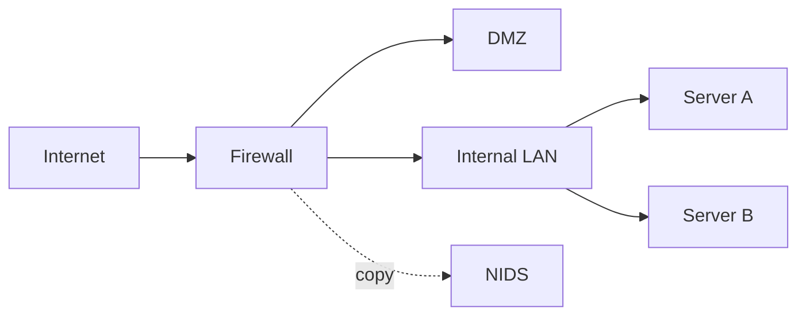
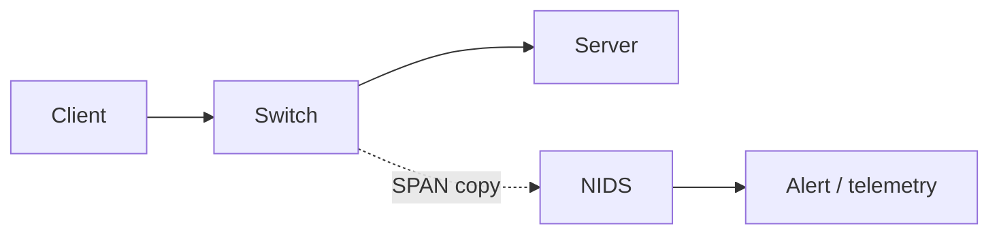
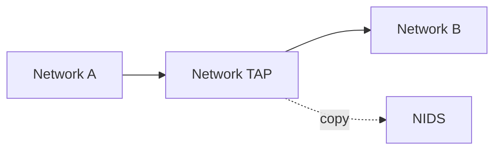
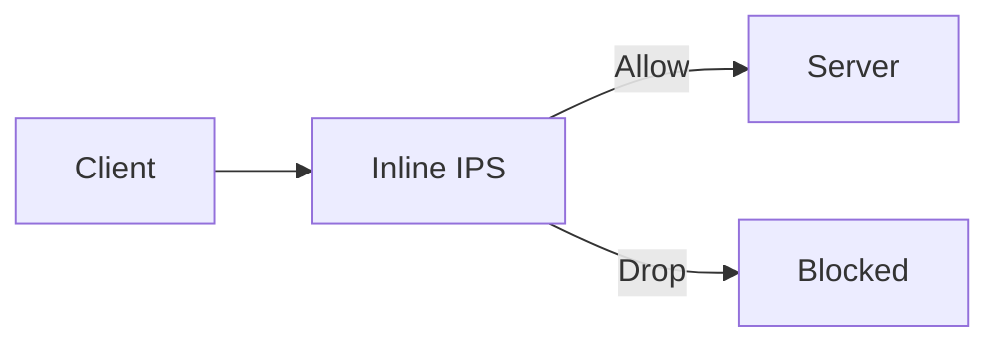
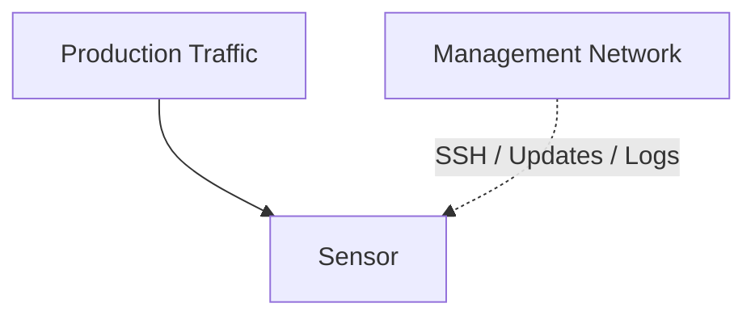

# Где размещать IDS/IPS: visibility начинается с топологии

<div class="page-goal">
<strong>Зачем это знать:</strong> IDS не обладает магической видимостью всей сети. Неправильно установленный сенсор может работать идеально и при этом не видеть именно те соединения, ради которых его покупали.
</div>

## Ключевой принцип

> **Сенсор видит только то, что физически или логически доставлено в его точку наблюдения.**

Представим:



Сенсор на firewall может прекрасно видеть:

```text
Internet ↔ DMZ
Internet ↔ LAN
```

Но если:

```text
Server A ↔ Server B
```

общаются внутри switch/VLAN и трафик не проходит через наблюдаемую точку, NIDS его может не увидеть.

---

# 1. Passive NIDS



Плюсы:

- не в основном data path;
- отказ sensor обычно не останавливает связь;
- удобно для мониторинга.

Минусы:

- не может сам гарантированно остановить packet;
- качество зависит от полноты копии;
- возможна потеря visibility.

---

# 2. SPAN

**SPAN / Port Mirroring** — switch копирует выбранный traffic на sensor port.

Что настраивается:

- source ports/VLAN;
- direction;
- destination monitor port;
- иногда RSPAN/ERSPAN.

## Почему это удобно

Не требуется ставить устройство в разрыв.

## Почему это не идеально

При высокой нагрузке:

- mirror traffic может быть oversubscribed;
- packets могут теряться;
- не весь switch traffic обязательно зеркалируется так, как ожидает инженер.

---

# 3. Network TAP

TAP создаёт отдельную копию сетевого сигнала/трафика для monitoring.



TAP часто используется там, где важна высокая fidelity наблюдения.

Но говорить:

> «TAP всегда лучше SPAN»

тоже неправильно.

Нужно учитывать:

- стоимость;
- физическую инфраструктуру;
- скорость;
- redundancy;
- тип link;
- эксплуатацию.

---

# 4. Inline IPS



Все пакеты проходят через IPS.

Это даёт:

- prevention;
- immediate enforcement.

Но создаёт новые требования:

- throughput;
- latency;
- fail-open/fail-close;
- HA;
- bypass;
- careful tuning.

---

# 5. North-South и East-West

## North-South

Обычно:

```text
Internet ↔ Internal/DMZ
```

## East-West

```text
Internal host ↔ Internal host
Server ↔ Server
Workstation ↔ Server
```

После initial compromise атакующий часто перемещается именно east-west.

Если архитектура мониторинга видит только Internet edge, lateral movement может остаться в blind spot.

---

# 6. Где ставить сенсоры

Не существует одного правильного ответа.

Возможные точки:

```text
before firewall
after firewall
DMZ boundary
internal server segment
critical systems boundary
data center core
remote site
cloud VPC/VNet traffic point
```

Каждая отвечает на разные вопросы.

### До firewall

Вы видите больше «грязного» Internet traffic.

Минус — огромное количество шума.

### После firewall

Вы видите трафик, который прошёл policy.

Это часто полезнее для анализа реального exposure.

### Между сегментами

Даёт visibility на lateral/east-west communications.

---

# 7. Encryption тоже влияет на placement

Допустим:

```text
Client → TLS → Reverse Proxy → Application
```

Если NIDS стоит **до TLS termination**, L7 HTTP payload может быть скрыт.

Если мониторинг расположен там, где трафик доступен после termination/re-encryption architecture, visibility будет другой.

Поэтому placement — это не только:

> «на каком switch port?»

Но и:

> «в какой точке протокольного жизненного цикла мы наблюдаем traffic?»

---

# 8. Асимметричная маршрутизация

Ещё одна реальная проблема.

Если один сенсор видит:

```text
Client → Server
```

но обратный путь:

```text
Server → Client
```

идёт другим маршрутом, stateful analysis может усложниться.

IDPS должна понимать обе стороны flow или архитектура должна учитывать asymmetric routing.

---

# 9. Управление самим сенсором

Management traffic лучше отделять от monitored traffic.



Это даёт:

- меньше смешения;
- более безопасное администрирование;
- возможность OOB management.

---

# 10. Как это понадобится на работе

## При внедрении

Вам дадут сетевую схему и спросят:

> куда поставить сенсор?

Нужно аргументировать coverage.

## При расследовании

Если alert отсутствует:

> был ли вообще этот flow виден sensor-у?

## При аудите

Недостаточно показать:

> «Suricata установлена».

Нужно показать:

- monitored segments;
- topology;
- traffic acquisition;
- critical paths;
- redundancy;
- operational monitoring.

---

## Интерактивная задача

<div class="quiz" data-question-id="placement-real-1">
  <p><strong>Два сервера общаются внутри одного VLAN. NIDS установлен только на интернет-периметре. Что корректно?</strong></p>
  <button data-choice="a">A. Он обязательно увидит соединение</button>
  <button data-choice="b" data-correct="true">B. Он может не увидеть его, если трафик не проходит через точку наблюдения и не зеркалируется туда</button>
  <button data-choice="c">C. NIDS не умеет видеть серверы</button>
  <button data-choice="d">D. Нужно только увеличить RAM</button>
  <div class="quiz-feedback"></div>
</div>

<div class="quiz" data-question-id="placement-real-2">
  <p><strong>Почему inline IPS требует более серьёзного HA/availability design, чем passive IDS?</strong></p>
  <button data-choice="a">A. Потому что у IDS нет IP</button>
  <button data-choice="b" data-correct="true">B. Потому что IPS находится в data path и её отказ/ошибка может влиять на прохождение трафика</button>
  <button data-choice="c">C. Потому что IPS не пишет alerts</button>
  <button data-choice="d">D. Потому что SPAN всегда быстрее</button>
  <div class="quiz-feedback"></div>
</div>

??? question "Как мы проверим это практически?"
    В LabBox студент увидит контролируемый path `Client → Suricata → Target`, а позже сравнит passive/tap и inline/IPS режимы. На более поздних лабораторных появятся DMZ и internal segment, чтобы показать north-south и east-west visibility.

<div class="next-step">
<strong>Теперь база собрана:</strong> можно пройти <a href="../../prelab/">Pre-Lab Test №1</a> и переходить к первой практической работе.
</div>
