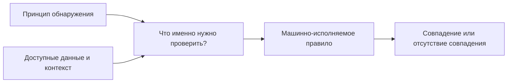
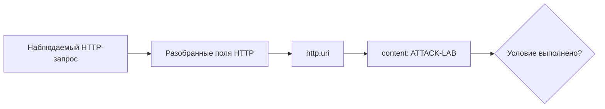
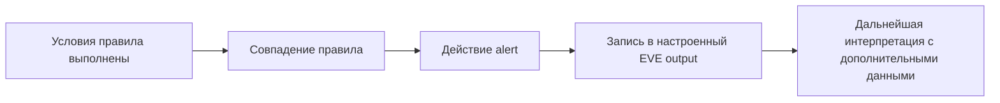
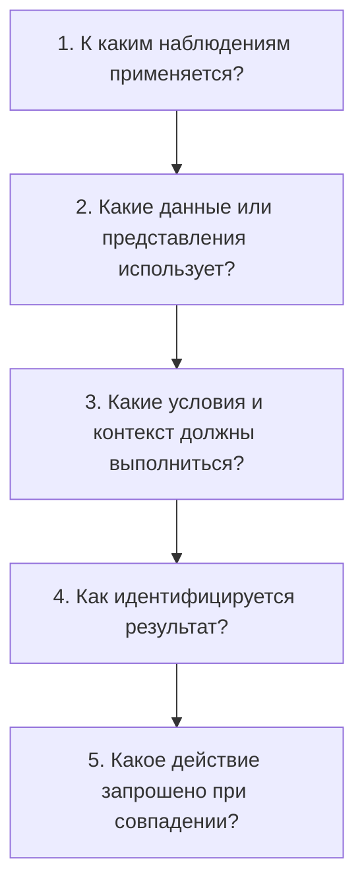

# Глава 6. Что такое правила и как они устроены

<div class="chapter-lead">
<p>В Главе 5 мы отделили <strong>принцип обнаружения</strong> от источника данных и точки наблюдения. Теперь можно перейти на следующий уровень: как конкретный движок превращает выбранный принцип в <strong>машинно-исполняемое условие</strong>, которое можно загрузить, проверить и воспроизвести?</p>
</div>

<div class="chapter-outcomes">
<strong>После этой главы вы должны уметь:</strong>
<p>объяснить назначение правила обнаружения; разбирать правило Suricata на действие, заголовок и параметры; отличать область применения правила от проверяемого условия; понимать роль контекста потока и прикладных представлений данных; различать условие совпадения, идентификационные метаданные, частоту оповещений и предотвращающее действие; а также объяснять, что именно доказывает срабатывание конкретного правила.</p>
</div>

---

## 1. Метод обнаружения отвечает «почему», правило — «как именно проверить»

Пусть после Главы 5 мы уже решили, что интересующий признак известен заранее:

```text
HTTP-запрос к учебному серверу
с URI, содержащим ATTACK-LAB
```

Сигнатурный принцип здесь понятен: нужно проверить наличие заранее известного признака.

Но этого ещё недостаточно для движка обнаружения. Ему необходимо точно указать:

```text
к какому трафику применять проверку;
какое представление данных использовать;
какое условие считать совпадением;
какой результат сформировать при совпадении;
как идентифицировать это правило.
```

Это и есть задача правила.

<div class="teaching-figure" markdown="1">
<div class="figure-label">СХЕМА 1 · ОТ ПРИНЦИПА ОБНАРУЖЕНИЯ К ПРАВИЛУ</div>



<div class="figure-caption">Правило не создаёт новый метод обнаружения. Оно формализует конкретную проверку над теми данными и контекстом, которые движок реально способен использовать.</div>
</div>

Поэтому:

<div class="principle-box">
<strong>МЕТОД ОБНАРУЖЕНИЯ ≠ СИНТАКСИС ПРАВИЛА</strong>
<p>Один язык правил может выражать проверки содержимого, состояния потока, разобранных полей протокола и условий над сериями событий. Название ключевого слова само по себе не определяет методологию обнаружения.</p>
</div>

---

## 2. Полезная общая модель правила

Разные продукты используют разные языки. Поэтому нельзя объявлять синтаксис Suricata универсальной структурой всех IDS/IPS.

Для курса полезна более общая модель:

```text
ОБЛАСТЬ ПРИМЕНЕНИЯ
        +
ПРОВЕРЯЕМЫЕ УСЛОВИЯ
        +
КОНТЕКСТ / СОСТОЯНИЕ, ЕСЛИ НУЖНО
        +
ИДЕНТИФИКАЦИЯ И РЕЗУЛЬТАТ
```

Здесь четыре разных вопроса:

| Вопрос | Что он означает |
|---|---|
| Где применять? | К какому классу наблюдений относится правило |
| Что проверить? | Какие признаки должны удовлетворять условию |
| Какой контекст учитывать? | Направление, состояние потока, прикладное представление и другие доступные свойства |
| Что получить при совпадении? | Идентифицируемый результат и, если настроено, действие движка |

Это **учебная логическая декомпозиция**, а не утверждение о внутреннем порядке обработки любого продукта.

---

## 3. Вернёмся к правилу из ЛР №1

В первой лабораторной вы уже использовали готовое правило:

```suricata
alert http 10.13.37.10 any -> 10.13.37.20 8080 (
    msg:"LAB1 HTTP marker observed";
    flow:established,to_server;
    http.uri;
    content:"ATTACK-LAB";
    sid:1000001;
    rev:3;
)
```

Тогда вам не требовалось понимать его синтаксис. Теперь разберём его по частям.

Официальная документация Suricata описывает обычное правило как сочетание:

```text
действие + заголовок + параметры правила
```

Для нашего примера:

```text
alert
│
├─ действие
│
http 10.13.37.10 any -> 10.13.37.20 8080
│
├─ заголовок: протокол, адреса, порты, направление
│
(msg:...; flow:...; http.uri; content:...; sid:...; rev:...;)
│
└─ параметры правила
```

Важно: эта структура описывает **язык правил Suricata**, а не универсальную грамматику всех IDPS.

---

## 4. Действие не равно условию обнаружения

Первое слово правила Suricata — **action**, то есть действие движка при совпадении.

В нашем примере:

```suricata
alert
```

означает: при совпадении сформировать оповещение.

Suricata также поддерживает другие действия, в том числе `pass`, `drop` и `reject`. Но из этого нельзя делать вывод:

```text
drop в тексте правила
=
трафик гарантированно заблокирован в любом развёртывании
```

Официальная документация Suricata отдельно указывает, что `drop` относится к IPS/inline-режиму. Следовательно, реальное предотвращающее воздействие зависит не только от текста правила, но и от режима работы и размещения системы.

<div class="concept-formula primary-formula">
  <span class="formula-left">УСЛОВИЕ СОВПАЛО</span>
  <span class="formula-sign">≠</span>
  <span class="formula-right">ПРЕДОТВРАЩЕНИЕ ГАРАНТИРОВАНО</span>
  <p>Условие определяет, когда правило совпало. Реальное действие зависит от action, режима работы и конфигурации движка.</p>
</div>

Это продолжает разграничение из Главы 1:

```text
обнаружение ≠ предотвращение
```

---

## 5. Заголовок задаёт область применения правила

Рассмотрим заголовок:

```suricata
http 10.13.37.10 any -> 10.13.37.20 8080
```

В нём определены:

```text
http             → класс трафика / протокол правила;
10.13.37.10      → адрес источника;
any              → любой порт источника;
->               → направление;
10.13.37.20      → адрес назначения;
8080             → порт назначения.
```

Заголовок отвечает на вопрос:

> **к каким наблюдениям вообще относится это правило?**

Он ещё не говорит, что интересующий признак обнаружен.

Например, HTTP-запрос от `10.13.37.10` к `10.13.37.20:8080` может попасть в область применения правила, но не содержать `ATTACK-LAB`. Тогда область применения подходит, а проверяемое условие — нет.

<div class="evidence-boundary">
  <article class="evidence-supported"><span>ЗАГОЛОВОК ПОДОШЁЛ</span><strong>Можно утверждать</strong><p>наблюдение относится к области, для которой правило должно выполнять дальнейшие проверки.</p></article>
  <article class="evidence-not-proven"><span>НЕ ДОКАЗЫВАЕТ</span><strong>Само по себе</strong><p>что содержимое или состояние удовлетворяет условиям правила.</p></article>
</div>

---

## 6. Правило проверяет не «весь пакет», а доступное представление данных

Одна из самых важных частей правила из ЛР №1:

```suricata
http.uri;
content:"ATTACK-LAB";
```

`http.uri` выбирает специальное представление URI HTTP-запроса — **sticky buffer** Suricata. Следующее условие `content` применяется уже к этому представлению.

То есть смысл фрагмента такой:

```text
взять разобранное представление URI HTTP-запроса
        ↓
проверить наличие ATTACK-LAB именно в этом представлении
```

В Suricata `http.uri` является нормализованным представлением URI; для ненормализованного URI существует отдельный `http.uri.raw`.

<div class="teaching-figure" markdown="1">
<div class="figure-label">СХЕМА 2 · УСЛОВИЕ ПРИМЕНЯЕТСЯ К КОНКРЕТНОМУ ПРЕДСТАВЛЕНИЮ</div>



<div class="figure-caption">Схема показывает логику конкретного условия правила, а не обязательный внутренний pipeline Suricata или любой другой IDS.</div>
</div>

Отсюда следует важная инженерная мысль:

> прежде чем писать условие, нужно знать, **какое представление данных реально доступно правилу**.

Сам факт существования ключевого слова `http.uri` в Suricata показывает возможность движка работать с таким представлением, но ещё не доказывает, что конкретный наблюдаемый поток был распознан как HTTP и предоставил это поле правилу.

Поиск строки в сыром содержимом и проверка нормализованного HTTP URI — не одно и то же.

---

## 7. Контекст потока уточняет, когда условие имеет смысл

В том же правиле есть:

```suricata
flow:established,to_server;
```

Этот параметр ограничивает совпадение контекстом потока:

```text
established → соединение находится в установленном состоянии;
to_server   → направление от клиента к серверу.
```

Это не «отдельный метод обнаружения» и не признак атаки сам по себе.

`flow` отвечает на более узкий вопрос:

> **в каком сетевом контексте проверять остальные условия правила?**

<div class="principle-box">
<strong>FLOW/STATE KEYWORD ≠ ОТДЕЛЬНАЯ МЕТОДОЛОГИЯ ОБНАРУЖЕНИЯ</strong>
<p>Ключевое слово может ограничивать область проверки или предоставлять состояние, которое требуется условию. Методология определяется смыслом всей логики решения, а не названием одного параметра.</p>
</div>

Suricata также поддерживает `flowbits`: они позволяют сохранить флаг в контексте потока и проверить его в другом правиле. Это пример того, что язык правил способен учитывать зависимость между несколькими наблюдениями внутри потока.

На этом этапе достаточно понимать принцип. Полный перечень `flow`/`flowbits` конструкций нам не нужен.

---

## 8. `msg`, `sid`, `rev` описывают результат, но не создают совпадение

Рассмотрим оставшиеся части учебного правила:

```suricata
msg:"LAB1 HTTP marker observed";
sid:1000001;
rev:3;
```

Их роли различаются.

### `msg`

Человекочитаемое описание правила и будущего оповещения.

### `sid`

Идентификатор сигнатуры Suricata. Он нужен, чтобы правило и его результаты можно было однозначно различать.

### `rev`

Номер редакции правила. Если логика правила изменилась, редакция позволяет различать версии одной сигнатуры.

Эти параметры важны для эксплуатации, но они **не превращают неподходящее наблюдение в совпадение**.

```text
SID = идентичность правила
REV = версия правила
MSG = описание результата
```

а не:

```text
SID = уровень опасности
REV = количество атак
MSG = доказательство инцидента
```

В Suricata существуют и дополнительные метаданные, например `classtype` и `priority`. Они помогают классифицировать и приоритизировать результаты, но не должны подменять само условие обнаружения.

---

## 9. Когда можно сказать, что правило совпало

Удобно читать учебное правило как логическое утверждение:

```text
ЕСЛИ
    наблюдение относится к HTTP
И   источник = 10.13.37.10
И   назначение = 10.13.37.20:8080
И   поток established и направлен к серверу
И   нормализованный HTTP URI содержит ATTACK-LAB
ТО
    правило совпало
    → action = alert
    → результат идентифицируется SID 1000001
```

Но здесь есть важная оговорка: реальные языки правил сложнее простого списка независимых `AND`-условий. Некоторые параметры выбирают буфер, модифицируют последующую проверку, работают с состоянием или имеют собственную семантику.

Поэтому правильная формулировка:

> правило совпадает, когда его заголовок и параметры удовлетворены **в соответствии с семантикой конкретных ключевых слов движка**.

А не:

> «всё между скобками — просто независимые булевы условия».

---

## 10. Совпадение правила, оповещение и инцидент — три разных уровня

Вернёмся к стенду ЛР №1. Там правило с `SID 1000001` загружено в Suricata, а вывод alert-событий в EVE JSON настроен заранее. Если после контролируемого запроса мы действительно находим соответствующий alert в `eve.json`, то наблюдаем:

```text
конкретное наблюдение удовлетворило условиям загруженного правила;
для совпадения сформирован alert;
настроенный EVE-вывод записал идентифицируемый результат.
```

Это уже утверждения уровня **КОНФИГУРАЦИЯ + НАБЛЮДЕНИЕ**, а не просто перечисление возможностей продукта.

Что из этого **не следует автоматически**?

```text
что была реальная атака;
что атака достигла цели;
что узел скомпрометирован;
что событие является инцидентом ИБ.
```

<div class="teaching-figure" markdown="1">
<div class="figure-label">СХЕМА 3 · ОТ УСЛОВИЯ К РЕЗУЛЬТАТУ БЕЗ ЛОЖНОГО СКАЧКА К ИНЦИДЕНТУ</div>



<div class="figure-caption">Оповещение является наблюдаемым результатом правила. Переход от оповещения к выводу об инциденте требует дополнительных оснований.</div>
</div>

Так сохраняется уже знакомая граница:

<div class="principle-box">
<strong>ПРАВИЛО ≠ ALERT ≠ INCIDENT</strong>
<p>Правило — машинно-исполняемая логика. Alert — один из возможных результатов её выполнения. Инцидент — более сильный вывод, который не возникает автоматически из одного alert.</p>
</div>

---

## 11. Порог и подавление не исправляют содержание условия

Предположим, правило слишком часто формирует одинаковые оповещения.

Можно ограничить частоту вывода, например с помощью механизмов thresholding. В Suricata `threshold` используется для управления частотой оповещений, а `detection_filter` позволяет учитывать число совпадений за интервал времени. Отдельная конфигурация `suppress` может подавлять оповещения для выбранного правила или адреса/сети; это также не означает, что базовая логика правила переписана.

Но это другой уровень задачи.

Рассмотрим два случая.

### Случай A — условие слишком широкое

```text
условие совпадает с большим количеством легитимной активности
```

Если просто уменьшить число отображаемых оповещений, логика условия не станет точнее.

### Случай B — условие корректно, но события слишком частые

```text
условие отражает нужное событие,
но одинаковых совпадений много
```

Здесь ограничение частоты оповещений может быть полезным эксплуатационным решением.

<div class="concept-formula neutral-formula">
  <span class="formula-left">THRESHOLD / SUPPRESSION</span>
  <span class="formula-sign">≠</span>
  <span class="formula-right">ИСПРАВЛЕНИЕ УСЛОВИЯ</span>
  <p>Управление частотой результатов и корректность проверяемой логики — разные задачи.</p>
</div>

Есть и дополнительная тонкость: официальная документация Suricata предупреждает, что для `drop`/`reject` в IPS-режиме thresholding оповещений не означает, что предотвращающее действие применяется только к тем пакетам, для которых выведено оповещение. Поэтому нельзя считать число alert прямым эквивалентом числа воздействий IPS.

---

## 12. Как читать правило инженерно

Вместо чтения слева направо как непонятной строки используйте пять вопросов.

<div class="teaching-figure" markdown="1">
<div class="figure-label">СХЕМА 4 · ПЯТЬ ВОПРОСОВ К ЛЮБОМУ УЧЕБНОМУ ПРАВИЛУ</div>



<div class="figure-caption">Такое чтение отделяет область применения, данные, проверяемую логику, идентификацию результата и действие движка.</div>
</div>

Применим вопросы к `SID 1000001`:

| Вопрос | Ответ |
|---|---|
| К каким наблюдениям? | HTTP от `10.13.37.10` к `10.13.37.20:8080` |
| Какие данные? | разобранный нормализованный HTTP URI |
| Какой контекст и условие? | установленный поток к серверу; URI содержит `ATTACK-LAB` |
| Как идентифицируется результат? | `msg`, `sid:1000001`, `rev:3` |
| Какое действие? | `alert` |

Теперь правило перестаёт быть «магической строкой» и становится проверяемой логической конструкцией.

---

## 13. Что хорошее правило должно позволять проверить

На этом этапе курса нам ещё не нужны полный lifecycle Detection Engineering, большие ruleset, PCRE-оптимизация или сложные техники обхода.

Нам достаточно более фундаментального требования:

> **для правила должно быть возможно создать контролируемое наблюдение, при котором его условие должно выполниться, и наблюдение, при котором конкретное условие выполняться не должно.**

Например для `SID 1000001`:

```text
Положительный случай:
GET /ATTACK-LAB
→ условие content должно выполниться

Отрицательный случай:
GET /NORMAL
→ конкретное условие content не должно выполниться
```

При этом отсутствие alert в отрицательном случае нельзя интерпретировать как «запроса не было». Существование запроса подтверждается отдельно — например ответом учебного приложения или сетевым захватом.

Это связывает Главу 6 со всеми предыдущими главами:

```text
источник данных
→ точка наблюдения
→ доступное представление
→ принцип обнаружения
→ машинно-исполняемое правило
→ наблюдаемый результат
→ ограниченный вывод
```

---

## 14. Что нужно запомнить

<div class="axiom-grid">
  <div class="axiom-card"><span>01</span><strong>Правило формализует проверку</strong><p>Оно выражает конкретное условие над доступными данными и контекстом; само наличие rule syntax не определяет метод обнаружения.</p></div>
  <div class="axiom-card"><span>02</span><strong>Заголовок ≠ совпадение</strong><p>Область применения определяет кандидатов для проверки, но не доказывает выполнение содержательных условий.</p></div>
  <div class="axiom-card"><span>03</span><strong>Представление данных имеет значение</strong><p>Условие над нормализованным `http.uri` — не то же самое, что поиск по произвольным сырым байтам.</p></div>
  <div class="axiom-card"><span>04</span><strong>Метаданные ≠ логика совпадения</strong><p>`msg`, `sid`, `rev`, классификация и приоритет описывают и идентифицируют результат, но не заменяют проверяемое условие.</p></div>
  <div class="axiom-card"><span>05</span><strong>Alert ≠ incident</strong><p>Срабатывание правила подтверждает выполнение конкретной логики в доступных данных; более сильный вывод требует дополнительных подтверждений.</p></div>
  <div class="axiom-card"><span>06</span><strong>Threshold ≠ исправление правила</strong><p>Управление частотой оповещений и качество самого условия обнаружения необходимо оценивать отдельно.</p></div>
</div>

---

## 15. Проверка понимания

<div class="quiz" data-question-id="chapter6-v1-q1">
  <p><strong>Что лучше всего описывает роль заголовка правила Suricata?</strong></p>
  <button data-choice="a">A. Он доказывает, что произошла атака</button>
  <button data-choice="b" data-correct="true">B. Он задаёт область трафика, к которой относится дальнейшая проверка правила</button>
  <button data-choice="c">C. Он определяет номер инцидента</button>
  <button data-choice="d">D. Он заменяет все параметры внутри скобок</button>
  <div class="quiz-feedback"></div>
</div>

<div class="quiz" data-question-id="chapter6-v1-q2">
  <p><strong>Что означает связка <code>http.uri; content:"ATTACK-LAB";</code> в учебном правиле?</strong></p>
  <button data-choice="a">A. Ищется строка во всех байтах любого сетевого пакета</button>
  <button data-choice="b">B. Строка ищется только в сообщении alert</button>
  <button data-choice="c" data-correct="true">C. Условие content применяется к выбранному представлению HTTP URI</button>
  <button data-choice="d">D. Наличие ATTACK-LAB автоматически означает компрометацию</button>
  <div class="quiz-feedback"></div>
</div>

<div class="quiz" data-question-id="chapter6-v1-q3">
  <p><strong>Какую роль играет <code>sid:1000001</code>?</strong></p>
  <button data-choice="a" data-correct="true">A. Идентифицирует конкретную сигнатуру/правило</button>
  <button data-choice="b">B. Определяет количество необходимых совпадений</button>
  <button data-choice="c">C. Указывает IP-адрес источника</button>
  <button data-choice="d">D. Доказывает высокий уровень критичности события</button>
  <div class="quiz-feedback"></div>
</div>

<div class="quiz" data-question-id="chapter6-v1-q4">
  <p><strong>Правило содержит действие <code>drop</code>. Что ещё необходимо знать, прежде чем утверждать, что совпавший сетевой пакет действительно будет заблокирован?</strong></p>
  <button data-choice="a">A. Только значение SID</button>
  <button data-choice="b">B. Только текст msg</button>
  <button data-choice="c" data-correct="true">C. Режим работы и способ включения Suricata в сетевой путь</button>
  <button data-choice="d">D. Только номер редакции rev</button>
  <div class="quiz-feedback"></div>
</div>

<div class="quiz" data-question-id="chapter6-v1-q5">
  <p><strong>Что происходит с логикой слишком широкого условия, если ограничить частоту одинаковых alert с помощью thresholding?</strong></p>
  <button data-choice="a">A. Условие автоматически становится более точным</button>
  <button data-choice="b">B. Все ложные совпадения превращаются в истинные отрицательные результаты</button>
  <button data-choice="c">C. Правило автоматически переходит на аномальное обнаружение</button>
  <button data-choice="d" data-correct="true">D. Частота выводимых результатов может измениться, но исходная логика условия сама по себе не исправляется</button>
  <div class="quiz-feedback"></div>
</div>

---

## Источники и границы главы

- Suricata 8.0.x Rule Guide — структура правила: action, header и rule options.
- Suricata Meta Keywords — назначение `msg`, `sid`, `rev`, `classtype` и других метаданных.
- Suricata Flow Keywords — семантика `flow` и `flowbits`.
- Suricata HTTP Keywords — sticky buffers, включая нормализованный `http.uri` и `http.uri.raw`.
- Suricata Thresholding Keywords и Global Thresholds — управление частотой оповещений, `detection_filter` и `suppress`.
- Suricata configuration / action order — различие действий `alert`, `pass`, `drop`, `reject` и зависимость `drop` от IPS/inline-режима.

Suricata в этой главе используется как **конкретная реализация обнаружения на основе правил**. Синтаксис Suricata не выдаётся за универсальный язык всех IDS/IPS.

Актуальные ссылки собраны в разделе [«Источники курса»](../../resources/sources/).
