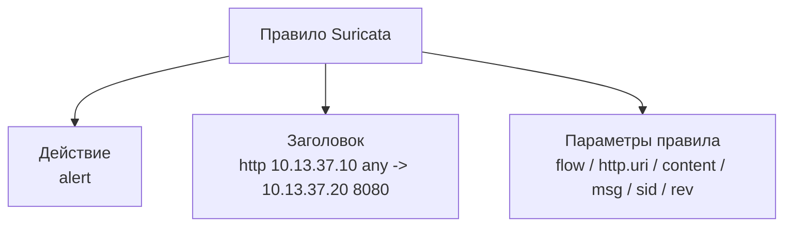
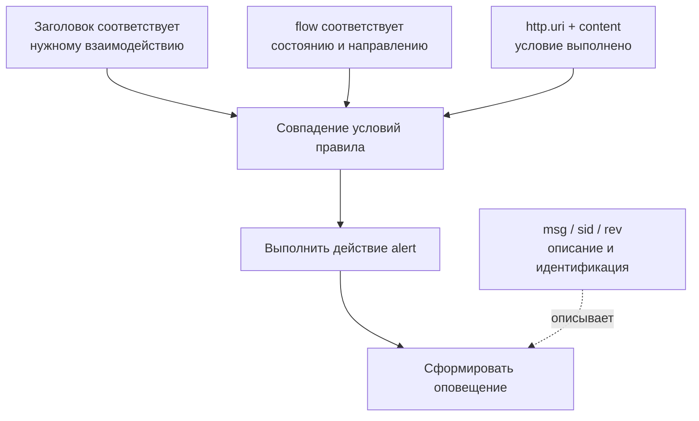
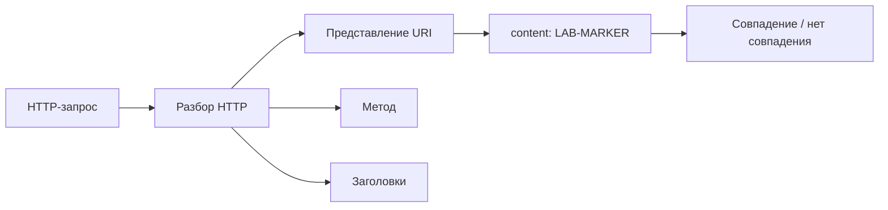
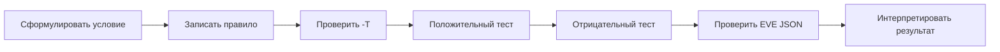

# Глава 6. Что такое правила и как они устроены

<div class="chapter-lead">
<p>В Главе 5 мы разбирали <strong>основания обнаружения</strong>: заранее известный признак, состояние протокола, условие над серией событий и отклонение от базовой линии. Теперь нужно сделать следующий шаг — понять, как часть такой логики формализуется в реальном движке IDS/IPS.</p>

<p>В этой главе в качестве основной реализации используется Suricata. Цель не в запоминании десятков ключевых слов. Студент должен научиться <strong>читать простое правило слева направо, связывать его части с техническим смыслом и проверять правило экспериментом</strong>.</p>
</div>

<div class="chapter-outcomes">
<strong>После этой главы вы должны уметь:</strong>
<p>разобрать простое правило Suricata на действие, заголовок и параметры; объяснить роль адресов, портов и направления; понимать назначение <code>flow</code>, <code>http.uri</code>, <code>content</code>, <code>msg</code>, <code>sid</code> и <code>rev</code>; отличить область применения правила от условия обнаружения; проверить синтаксис правила; и объяснить, почему синтаксически корректное правило ещё не является доказательством качественного обнаружения.</p>
</div>

---

## 1. От идеи обнаружения к формальному правилу

До сих пор условия записывались человеческим языком:

```text
если URI содержит LAB-MARKER → выделить событие
```

Чтобы IDS могла выполнить такое условие, его необходимо выразить в форме, понятной конкретному движку.

Для Suricata простое правило может выглядеть так:

```suricata
alert http 10.13.37.10 any -> 10.13.37.20 8080 (msg:"LAB URI marker"; flow:established,to_server; http.uri; content:"LAB-MARKER"; sid:1000501; rev:1;)
```

Правило — это не «описание атаки вообще». Это формализованное условие, которое применяется к определённой области наблюдаемой активности.

<div class="principle-box">
<strong>У трёх частей правила разные задачи</strong>
<p><strong>Что сделать при совпадении?</strong> — задаёт действие. <strong>К какой активности применять правило?</strong> — задаёт заголовок. <strong>Какие дополнительные условия проверить и как описать правило?</strong> — задают параметры.</p>
</div>

---

## 2. Базовая анатомия правила

Официальная документация Suricata делит правило на три крупные части: действие, заголовок и параметры правила.

<div class="teaching-figure" markdown="1">
<div class="figure-label">СХЕМА 1 · АНАТОМИЯ ПРОСТОГО ПРАВИЛА</div>



<div class="figure-caption">Схема показывает <strong>состав записи правила</strong>, а не порядок внутренней обработки Suricata. Действие, заголовок и параметры — три разные части синтаксиса правила.</div>
</div>

Для курса удобно записать:

!!! abstract "Учебная модель структуры"
    `Правило = действие + заголовок + параметры`

А заголовок разложить так:

!!! abstract "Учебная модель заголовка"
    `протокол + источник + порт_источника + направление + назначение + порт_назначения`

Это не новая грамматика Suricata, а способ быстро читать базовое правило.

---

# 3. Действие: что должна сделать система при совпадении

Первое слово нашего правила:

```text
alert
```

означает, что при выполнении условий Suricata должна сформировать оповещение.

Suricata поддерживает и другие действия, например `drop`, `reject` и `pass`. Но здесь легко совершить старую ошибку курса:

```text
в правиле написано drop
        ≠
трафик обязательно будет заблокирован
```

Чтобы сетевое предотвращение действительно происходило, движок должен работать в соответствующем режиме и находиться в подходящем контуре передачи трафика. Одно ключевое слово в файле правил не превращает пассивный NIDS в inline IPS.

Поэтому в этой главе и ЛР №5 используется только:

```text
alert
```

Механизмы предотвращения будут рассматриваться как отдельная функция, а не как побочный эффект знакомства с синтаксисом.

---

# 4. Заголовок: к какой активности применять правило

После действия `alert` в нашем примере идёт заголовок:

```text
http 10.13.37.10 any -> 10.13.37.20 8080
```

Его можно прочитать слева направо:

<div class="rule-parts-grid">
  <article><span>ПРОТОКОЛ</span><strong><code>http</code></strong><p>Правило относится к активности, распознанной как HTTP.</p></article>
  <article><span>ИСТОЧНИК</span><strong><code>10.13.37.10 any</code></strong><p>Клиентский адрес фиксирован, исходный порт может быть любым.</p></article>
  <article><span>НАПРАВЛЕНИЕ</span><strong><code>-&gt;</code></strong><p>Проверяется указанное направление от источника к назначению.</p></article>
  <article><span>НАЗНАЧЕНИЕ</span><strong><code>10.13.37.20 8080</code></strong><p>Учебный сервер и его порт HTTP-сервиса.</p></article>
</div>

### Важная оговорка о портах

Номер порта сам по себе не определяет прикладной протокол.

```text
TCP/8080
   ≠
HTTP по определению
```

В нашем стенде на `10.13.37.20:8080` действительно запущен HTTP-сервис, поэтому правило использует `http` и порт `8080`. Но нельзя переносить это как универсальную истину на произвольную сеть.

---

## 5. Адреса и переменные

В учебных правилах мы пока явно указываем:

```text
10.13.37.10
10.13.37.20
```

Это делает эксперимент воспроизводимым: студент точно знает, какой поток проверяет правило.

В реальных наборах правил часто используются переменные:

```text
$HOME_NET
$EXTERNAL_NET
```

Их значения задаются конфигурацией Suricata. Поэтому правило с `$HOME_NET` нельзя интерпретировать, не зная, чему эта переменная равна на конкретной системе.

<div class="principle-box">
<strong>Переменная — это не магическое значение</strong>
<p><code>$HOME_NET</code> означает не «внутренняя сеть вообще», а то множество адресов, которое определено в конфигурации конкретного экземпляра Suricata.</p>
</div>

В ЛР №5 переменные намеренно не используются, чтобы не смешивать синтаксис правила с настройкой `suricata.yaml`.

---

# 6. Параметры правила: что именно проверяется

Теперь рассмотрим содержимое скобок:

```text
msg:"LAB URI marker";
flow:established,to_server;
http.uri;
content:"LAB-MARKER";
sid:1000501;
rev:1;
```

Здесь находятся разные по смыслу элементы. Некоторые участвуют в выборе данных и условии совпадения. Другие нужны для идентификации и описания результата.

<div class="teaching-figure" markdown="1">
<div class="figure-label">СХЕМА 2 · УСЛОВИЕ И МЕТАДАННЫЕ НЕЛЬЗЯ СМЕШИВАТЬ</div>



<div class="figure-caption">Это логическая модель условий <strong>конкретного правила</strong>, а не внутренний конвейер движка. <code>msg</code>, <code>sid</code> и <code>rev</code> описывают и идентифицируют правило/результат, но не являются признаками вредоносности.</div>
</div>

---

## 7. `flow`: контекст направления и состояния

В нашем правиле:

```text
flow:established,to_server;
```

означает, что нас интересует активность установленного соединения в направлении от клиента к серверу.

Это дополнительное ограничение по отношению к заголовку.

Важно не смешивать два понятия:

```text
->
```

задаёт направление между адресами в заголовке правила, а:

```text
to_server
```

работает с направлением потока в терминах клиента и сервера, как его понимает движок.

В нашем простом стенде оба ограничения согласованы:

```text
10.13.37.10  →  10.13.37.20:8080
клиент          сервер
```

---

# 8. `http.uri`: выбрать нужное представление

После разбора HTTP Suricata предоставляет отдельные поля, которые можно использовать в правилах.

Ключевое слово:

```text
http.uri;
```

выбирает нормализованное представление URI HTTP-запроса для последующих совместимых условий.

После него:

```text
content:"LAB-MARKER";
```

ищет заданный признак именно в выбранном URI, а не произвольно во всех байтах сетевого потока.

<div class="teaching-figure" markdown="1">
<div class="figure-label">СХЕМА 3 · ОТ HTTP-ЗАПРОСА К УСЛОВИЮ</div>



<div class="figure-caption">Схема относится только к правилу, использующему разобранные HTTP-поля. Она не утверждает, что любое обнаружение в Suricata начинается с HTTP-разбора. Здесь важно другое: <code>http.uri</code> привязывает последующее условие к конкретному представлению URI.</div>
</div>

Существует и:

```text
http.uri.raw;
```

для ненормализованного URI. Сейчас достаточно понимать сам факт наличия разных представлений. Последствия нормализации, неоднозначности представлений и обходов будут предметом Главы 7.

---

# 9. `content`: само проверяемое значение

Ключевое слово:

```text
content:"LAB-MARKER";
```

задаёт значение, которое должно быть найдено в выбранном представлении данных. В нашем примере таким представлением является `http.uri`.

В нашем примере проверяется:

```text
URI содержит LAB-MARKER
```

Поэтому для двух запросов:

```text
GET /normal HTTP/1.1
GET /lab6/LAB-MARKER HTTP/1.1
```

конкретное `content`-условие должно вести себя по-разному.

Но совпадение `content` означает только:

> заданная последовательность присутствовала в том представлении, которое проверяет правило.

Оно не означает автоматически:

```text
запрос вредоносный;
уязвимость существует;
эксплуатация удалась;
сервер скомпрометирован.
```

Тем самым сохраняется принцип первой главы:

```text
ОПОВЕЩЕНИЕ ≠ КОМПРОМЕТАЦИЯ
```

---

# 10. `msg`, `sid` и `rev`: описание и идентификация

### `msg`

```text
msg:"LAB URI marker";
```

задаёт текстовое описание, которое будет видно в оповещении.

Изменение только `msg` не меняет того, какие сетевые данные удовлетворяют остальным условиям правила.

### `sid`

```text
sid:1000501;
```

задаёт идентификатор сигнатуры. В одном наборе правил идентификатор должен быть уникальным.

В учебном курсе используются отдельные значения `sid`, чтобы результаты разных лабораторных не смешивались.

### `rev`

```text
rev:1;
```

обозначает редакцию правила.

Если правило изменяется, его редакция должна быть увеличена:

```text
sid:1000501; rev:1;
        ↓ изменение правила
sid:1000501; rev:2;
```

Так сохраняется связь между одной логической сигнатурой и её последовательными версиями.

---

# 11. Как читать правило слева направо

Вернёмся к полной строке:

```suricata
alert http 10.13.37.10 any -> 10.13.37.20 8080 (msg:"LAB URI marker"; flow:established,to_server; http.uri; content:"LAB-MARKER"; sid:1000501; rev:1;)
```

Её можно перевести на обычный язык:

> Для HTTP-активности от `10.13.37.10` с любого исходного порта к `10.13.37.20:8080`, относящейся к установленному соединению в направлении к серверу, проверить нормализованный URI. Если URI содержит `LAB-MARKER`, сформировать оповещение с указанным сообщением и идентификатором сигнатуры `1000501`, редакция `1`.

<div class="principle-box">
<strong>Умение прочитать правило важнее запоминания ключевых слов</strong>
<p>Если студент не может перевести правило на обычный язык, он пока не понимает, какое событие это правило способно выделить.</p>
</div>

---

# 12. Несколько условий означают более узкое совпадение

Для метода HTTP используется тот же принцип выбора конкретного представления. Ключевое слово `http.method` переводит последующее совместимое условие `content` на поле метода HTTP-запроса.

Рассмотрим другое правило:

```suricata
alert http 10.13.37.10 any -> 10.13.37.20 8080 (msg:"LAB GET marker"; flow:established,to_server; http.method; content:"GET"; http.uri; content:"LAB-STUDENT"; sid:1000503; rev:1;)
```

Здесь проверяются уже два прикладных условия:

```text
метод HTTP = GET
        И
URI содержит LAB-STUDENT
```

Для нашего учебного примера совпадение удобно представить так:

!!! abstract "Учебная модель совпадения конкретного правила"
    `СОВПАДЕНИЕ = Заголовок ∧ Поток ∧ Метод(GET) ∧ URI(LAB-STUDENT)`

Это именно модель **этого правила**, а не утверждение о универсальном внутреннем конвейере Suricata.

Отсюда следует полезный тест:

```text
GET  /lab/LAB-STUDENT   → условия метода и URI выполнены
POST /lab/LAB-STUDENT   → условие URI выполнено, условие метода не выполнено
GET  /normal            → условие метода выполнено, условие URI не выполнено
```

---

# 13. Синтаксическая проверка — обязательна, но недостаточна

Перед запуском правила необходимо проверить, принимает ли его Suricata:

```bash
sudo suricata -T \
  -c /etc/suricata/suricata.yaml \
  -S ./lab.rules
```

В лабораториях используется `-S`, чтобы загрузить только указанный учебный файл правил независимо от набора правил, настроенного в `suricata.yaml`.

Если `-T` завершился успешно, мы знаем:

```text
конфигурация и файл правил приняты движком
```

Но мы **не знаем**:

```text
правило получает нужный трафик;
условие соответствует нашей цели;
положительный тест даст оповещение;
отрицательный тест не даст оповещение;
правило пригодно для реальной инфраструктуры.
```

Поэтому:

```text
СИНТАКСИС ПРИНЯТ
        ≠
ЛОГИКА ПРОВЕРЕНА
```

---

# 14. Минимальный цикл работы с простым правилом

Для базового курса фиксируем следующий порядок:

<div class="teaching-figure" markdown="1">
<div class="figure-label">СХЕМА 4 · ПЕРВЫЙ ЖИЗНЕННЫЙ ЦИКЛ ПРАВИЛА</div>



<div class="figure-caption">Ни один этап не заменяет остальные: синтаксическая проверка не заменяет трафик, а наличие оповещения не заменяет интерпретацию.</div>
</div>

В Главе 7 этот цикл будет расширен вопросами ошибок, слепых зон, представления данных и ложных выводов.

---

# 15. Что правило не должно скрывать от автора

Перед созданием правила необходимо уметь ответить хотя бы на пять вопросов:

1. Какое событие мы хотим выделить?
2. Где существует наблюдаемый признак?
3. На каком сетевом взаимодействии правило должно применяться?
4. В каком представлении Suricata должна искать признак?
5. Как мы проверим положительный и отрицательный случаи?

Если ответ начинается с:

> «Просто найдём строку где-нибудь в трафике…»

то условие, скорее всего, ещё недостаточно определено.

---

# 16. Сводная карта главы

| Часть | Пример | Вопрос, на который отвечает |
|---|---|---|
| Действие | `alert` | Что сделать при совпадении? |
| Протокол | `http` | К какому классу активности относится правило? |
| Источник | `10.13.37.10 any` | Откуда идёт интересующее взаимодействие? |
| Направление | `->` | В каком направлении применяется заголовок? |
| Назначение | `10.13.37.20 8080` | К какому узлу и сервису относится правило? |
| Контекст потока | `flow:established,to_server` | Какой поток и направление клиента/сервера нужны? |
| Представление | `http.uri` | Какое поле протокола проверяем? |
| Условие | `content:"LAB-MARKER"` | Что ищем в выбранном представлении? |
| Описание | `msg` | Как подписать результат? |
| Идентификатор | `sid` | Как однозначно определить сигнатуру? |
| Редакция | `rev` | Какая версия сигнатуры используется? |

Из таблицы следует главный вывод главы:

```text
ПРАВИЛО
  =
ОБЛАСТЬ ПРИМЕНЕНИЯ
  +
КОНТЕКСТ И ПРЕДСТАВЛЕНИЕ
  +
УСЛОВИЕ
  +
ИДЕНТИФИКАЦИЯ РЕЗУЛЬТАТА
```

---

# 17. Проверка понимания

**Ситуация 1**

В правиле изменили только:

```text
msg:"A";
```

на:

```text
msg:"B";
```

Изменилось ли само условие поиска `content`?

> Нет. Изменилось описание результата, а не условие совпадения по сетевым данным.

---

**Ситуация 2**

Правило содержит:

```text
http.uri;
content:"LAB";
```

Строка `LAB` присутствует только в теле HTTP-запроса, но отсутствует в URI.

Должно ли это конкретное `content`-условие совпасть из-за строки в body?

> Нет. В данном участке правила `content` применяется к выбранному URI-представлению.

---

**Ситуация 3**

`suricata -T` завершился успешно.

Можно ли утверждать, что правило обнаружит нужное событие в реальном эксперименте?

> Нет. Подтверждена синтаксическая и конфигурационная пригодность к загрузке. Поведение правила нужно проверять отдельными тестами.

---

**Ситуация 4**

Студент пишет:

```text
drop http ...
```

и ожидает, что пассивно запущенная Suricata обязательно остановит HTTP-запрос.

В чём ошибка?

> Он смешал действие правила с архитектурой выполнения. Для реального блокирования движок должен работать в соответствующем режиме предотвращения и иметь возможность воздействовать на поток.

---

**Ситуация 5**

После изменения условия правила студент оставил:

```text
sid:1000501; rev:1;
```

Что нужно сделать с `rev`?

> Увеличить номер редакции, сохраняя тот же `sid`, если это новая версия той же логической сигнатуры.

---

# Переход к Главе 7

Теперь студент умеет:

```text
прочитать простое правило;
понять его область применения;
определить, какое представление оно проверяет;
изменить условие;
написать простое правило;
проверить его синтаксис и поведение.
```

Но даже корректно написанное правило может ошибаться или вообще не получить нужные данные.

Следующий вопрос курса:

> **Почему IDS/IPS ошибается и чего она не видит?**

В Главе 7 мы разберём ложные срабатывания, пропуски, потерю видимости, неоднозначность представлений, шифрование, reassembly и границы выводов из результатов детектора.

---

## Источники для этой главы

- OISF, *Suricata 8.0.7 — Rules Format*.
- OISF, *Suricata 8.0.7 — Flow Keywords*.
- OISF, *Suricata 8.0.7 — HTTP Keywords*.
- OISF, *Suricata — Command Line Options* (`-T`, `-S`, `-i`, `-l`, `-k`).

Актуальные ссылки приведены на странице [«Источники курса»](../resources/sources.md).
