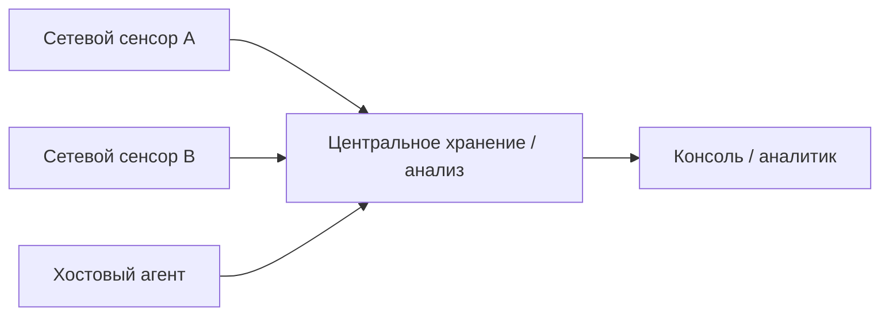

# Контекст: архитектура, интеграция и современный контекст IDS/IPS

!!! info "Связь с рабочей программой (Syllabus)"
    Углубление тем 2 и 8 и экзаменационных вопросов о DIDS, SIEM/SOAR, threat intelligence, политике и интеграции защитных систем.
    
    Нумерация внутренних глав курса и нумерация тем syllabus — разные системы. [Открыть полную карту дисциплины](../syllabus/index.md).


<div class="chapter-lead">
<p>К этому моменту мы уже разобрали источник данных, точку наблюдения, detection logic, FP/FN, эффективность и предотвращение. Теперь нужно собрать темы, которые часто появляются в архитектуре и эксплуатации современных IDS/IPS: распределённые системы, журналы и confidence, эвристика и машинное обучение, обход обнаружения, threat intelligence, SIEM, политики, стандарты, масштабирование, облака и IoT.</p>
</div>

<div class="idps-outcomes">
<strong>После этой главы студент сможет:</strong>
<p>объяснить устройство распределённой IDS; назвать типичное содержимое события и смысл confidence; отличить payload от метаданных; объяснить DPI, эвристику, машинное обучение и Zero-Day без обещания «магического обнаружения»; описать скрытые каналы и уклонение от обнаружения; объяснить роль threat intelligence, SIEM и автоматизации; описать управление политиками IDS/IPS; привести примеры открытых и коммерческих решений; объяснить масштабируемость, облачный и IoT-контекст; связать IDS/IPS с требованиями стандартов и защитой персональных данных.</p>
</div>

## 1. Распределённая IDS: несколько точек наблюдения, единый анализ

**Распределённая IDS (DIDS)** — архитектура, в которой несколько сенсоров или агентов собирают события в разных точках инфраструктуры, а результаты передаются на один или несколько центральных компонентов для хранения, сопоставления, управления или анализа.



Распределённость полезна, когда одна точка наблюдения не видит весь сценарий. Например, один сенсор видит внешнее сканирование периметра, другой — обращение к внутреннему сервису, а хостовый агент — запуск процесса после успешного входа.

Но **несколько сенсоров не создают автоматически единую истину**. Нужно учитывать время, идентификаторы, NAT, потери событий, различия конфигураций и версии detection logic. Поэтому взаимодействие компонентов DIDS требует согласованной передачи событий, времени, схем данных и управления конфигурациями.

## 2. Журналирование и событие IDS

Журналирование — это фиксация наблюдений и результатов работы IDS/IPS в структурированной или текстовой форме. Журнал нужен для расследования, поиска, корреляции, повторной проверки и отчётности.

Типичное событие может содержать:

- время;
- адреса и порты источника/назначения;
- протокол;
- направление потока;
- идентификатор правила/сигнатуры;
- сообщение и категорию;
- действие (`allowed`, `drop`, `reject` и т. п. — если конкретная реализация это фиксирует);
- поля прикладного протокола;
- идентификаторы потока/транзакции;
- приоритет, severity или confidence — если продукт их поддерживает.

В нашем стенде примером структурированного журнала является **EVE JSON Suricata**. Для централизованного поиска и корреляции события также могут поступать в SIEM. Другие распространённые средства анализа журналов — Elastic Stack, Splunk, OpenSearch, Graylog и аналогичные платформы. Название продукта не меняет доказательную модель: сначала нужно понять происхождение записи и что именно она подтверждает.

## 3. Confidence: уверенность — не вероятность компрометации

`Confidence` в IDS обычно обозначает **оценку уверенности конкретного механизма или продукта в корректности результата**. Формат и шкала зависят от реализации.

Нельзя универсально интерпретировать `confidence=90` как «90% вероятность атаки» или «90% вероятность компрометации». Нужно знать, как конкретная система вычисляет поле и к какому объекту оно относится.

```text
confidence
≠ доказательство атаки
≠ severity
≠ business impact
≠ вероятность компрометации без определения модели
```

## 4. Payload и DPI

**Payload** — полезная нагрузка протокольной единицы относительно рассматриваемого уровня. Например, для TCP-сегмента payload — данные после TCP-заголовка; для HTTP-запроса аналитик обычно уже работает с прикладным представлением, а не с понятием «payload TCP» как с единственным объектом анализа.

**DPI (Deep Packet Inspection)** — глубокая инспекция пакетов/трафика: анализ содержимого и протокольной структуры глубже базовых полей L3/L4. DPI может предоставлять данные для detection logic, но **не является сам по себе отдельной гарантией обнаружения**.

## 5. Эвристика, поведение, ML и Zero-Day

**Эвристический анализ** использует набор признаков и правил вывода, которые не обязаны совпадать с одной известной сигнатурой. Он может учитывать подозрительные комбинации свойств, структуры или поведения.

Сигнатурный подход обычно отвечает на вопрос «совпадает ли наблюдение с заранее известным признаком?». Эвристика может отвечать «похожа ли комбинация признаков на опасный сценарий?». Аномальный анализ, в свою очередь, сравнивает наблюдение с baseline или моделью ожидаемого поведения.

**Машинное обучение (ML)** может использоваться для классификации, кластеризации, построения baseline, приоритизации или поиска необычных комбинаций. В учебной литературе обычно различают:

- **supervised learning** — обучение по размеченным примерам;
- **unsupervised learning** — поиск структуры/кластеров/отклонений без готовых меток;
- **semi-supervised learning** — сочетание небольшого объёма размеченных данных с большим объёмом неразмеченных;
- статистические/профильные методы, где baseline строится без обязательной ML-модели.

Не каждая IDS «обучается»: сигнатурный или stateful detector может работать без ML. ML не делает систему автоматически точной и не отменяет ground truth, FP/FN, drift и необходимость проверки модели.

**Zero-Day** — уязвимость/атака, для которой на момент использования может отсутствовать доступная исправляющая мера или известная сигнатура. IDS может обнаружить отдельные проявления Zero-Day не потому, что «знает неизвестную уязвимость», а если наблюдаемое поведение нарушает модель протокола, baseline, эвристическое условие или иной доступный детектор.

## 6. Скрытые каналы и уклонение от обнаружения

**Скрытый канал (covert channel)** использует разрешённый или неожиданный носитель для передачи информации способом, который не соответствует обычному назначению этого канала. Примеры могут включать необычное кодирование данных в DNS-запросах, заголовках, timing-паттернах или других доступных полях.

**Evasion** — попытка изменить представление атаки так, чтобы конечная система сохранила опасный смысл, а IDS не получила или иначе интерпретировала нужный признак. Типичные группы приёмов:

- фрагментация/сегментация и различия реконструкции;
- кодирование и обфускация;
- неоднозначная нормализация URI/протокола;
- шифрование и туннелирование;
- распределение активности во времени или между источниками;
- использование разрешённых сервисов как транспортного канала.

Обнаружение маскировки опирается на корректную реконструкцию потоков, нормализацию, протокольные анализаторы, сопоставление нескольких источников и детекторы, которые проверяют семантику, а не только одну последовательность байтов.

## 7. Threat intelligence: внешний контекст для детектора

**Threat intelligence** — структурированный контекст об угрозах: индикаторы, инфраструктура, тактики/техники, кампании, вредоносные объекты, рекомендации и связи между сущностями.

Для IDS/IPS это может использоваться, например, чтобы:

- обновлять IOC/репутационные списки;
- обогащать alert контекстом;
- приоритизировать события;
- формировать новые detection rules;
- связывать наблюдение с известной кампанией или техникой — с обязательной оговоркой, что совпадение индикатора не доказывает компрометацию.

Примеры платформ и экосистем для работы с threat intelligence: **MISP** и **OpenCTI**. Они решают задачи хранения, обмена и структурирования threat intelligence; сами по себе они не являются сетевыми IDS.

## 8. IDS/IPS + SIEM и автоматизация реагирования

SIEM агрегирует и анализирует события из нескольких источников. IDS/IPS может быть одним из таких источников.

```text
IDS/IPS alert
    + identity event
    + endpoint event
    + asset context
        ↓
SIEM correlation
        ↓
case / notification / response workflow
```

Автоматизация может включать создание инцидента, уведомление, запуск playbook, запрос дополнительного контекста или изменение контроля через интеграцию. Но безопасная автоматизация требует условий, ограничений и возможности отмены: ложноположительный детектор при автоматическом блокировании способен создать отказ в обслуживании.

SIEM **не заменяет IDS/IPS**: она может агрегировать результат IDS/IPS, но не получает автоматически ту же сетевую видимость и detection logic.

### Уровни реакции: от фиксации до автоматического воздействия

Под «уровнем реагирования» полезно понимать не одну универсальную шкалу производителя, а **степень воздействия после результата обнаружения**. В учебной модели удобно различать четыре уровня:

1. **регистрация** — сохранить событие для последующего анализа;
2. **оповещение и передача контекста** — уведомить персонал, SIEM или систему управления инцидентами;
3. **ограниченное автоматическое действие** — например, временно изменить сетевую/хостовую политику или изолировать объект через интеграцию;
4. **непосредственное enforcement** — `drop`, `reject`, `reset`, блокирование или иное предотвращающее действие в пределах возможностей конкретной архитектуры.

Эти уровни не означают, что четвёртый всегда «лучше» первого. Чем сильнее воздействие, тем выше цена ложноположительного результата. Поэтому автоматическое действие должно быть привязано к проверяемому условию, scope, возможности отмены и последующей проверке фактического результата.

```text
обнаружение
→ решение по политике
→ действие
→ проверка результата
```

## 9. Управление политиками IDS/IPS

**Политика IDS/IPS** определяет, что и где наблюдается, какие правила/детекторы активны, какие исключения допустимы, какие действия выполняются и как обрабатываются результаты.

Примеры политик:

- включить определённые наборы правил только для конкретного сегмента;
- применять разные действия к серверной и пользовательской зоне;
- ограничить автоматическое блокирование только высокодостоверными условиями;
- настроить исключение для известного легитимного трафика;
- определить retention, передачу в SIEM и escalation.

Ошибочная политика может привести к FP, FN, блокированию легитимной активности, слепым зонам, перегрузке сенсора и несогласованности между узлами. Поэтому политика должна проходить контроль изменений, тестирование и повторную проверку.

## 10. Открытые и коммерческие реализации

Примеры **открытых** технологий, которые встречаются в практике: Suricata, Snort, Zeek, Wazuh. При этом они не являются взаимозаменяемыми «одинаковыми IDS»: Zeek ориентирован на сетевую телеметрию и анализ, Wazuh — на хостовую телеметрию/SIEM/XDR-контекст, Suricata и Snort — на сетевое обнаружение/предотвращение.

Коммерческие IDS/IPS-функции встречаются в NGFW, NDR, endpoint/XDR и специализированных сетевых платформах разных производителей. В качестве узнаваемых примеров можно назвать IPS/Threat Prevention функции в Cisco Secure Firewall, Palo Alto Networks NGFW и Fortinet FortiGate. Конкретные названия модулей и лицензий меняются со временем, поэтому на экзамене важнее объяснить **функцию и архитектуру**, а не перечислить бренды.

## 11. Интеграция и совместимость

IDS/IPS часто интегрируется с межсетевыми экранами, SIEM, EDR, SOAR, threat-intelligence платформами, CMDB/asset inventory и системами управления инцидентами.

Преимущества интеграции:

- больше контекста;
- централизованный поиск;
- корреляция нескольких источников;
- автоматизация повторяемых действий;
- единая эксплуатационная видимость.

Проблемы совместимости:

- разные схемы событий и идентификаторы;
- разные временные зоны/качество синхронизации;
- несовместимые форматы API;
- различия severity/confidence;
- дублирование событий;
- разные версии правил и политик;
- vendor-specific semantics.

## 12. Стандарты, PCI DSS и защита персональных данных

IDS/IPS может быть частью выполнения требований и мер безопасности, но **наличие продукта не равно соответствию стандарту**. Кроме того, важно не смешивать документы разного типа: обязательный для конкретного контекста стандарт, каталог контролей и инженерное руководство отвечают на разные вопросы.

Наиболее прямой пример из экзаменационной темы — **PCI DSS v4.0.1, Requirement 11.5.1**: он требует применять intrusion-detection и/или intrusion-prevention techniques для мониторинга трафика на периметре и критических точках CDE, оповещения персонала о предполагаемой компрометации и поддержания engines, baselines и signatures в актуальном состоянии. Здесь IDS/IPS является явно названным механизмом, а организация должна доказать его фактическое размещение, настройку и работу.

**NIST SP 800-53 Rev. 5** — не «ещё одна версия PCI DSS», а каталог security/privacy controls. Контроль **SI-4 System Monitoring** охватывает мониторинг системы и содержит расширения, связанные, в частности, с intrusion detection, автоматизированным анализом, alerting, encrypted communications, traffic anomalies и корреляцией. **NIST SP 800-94** — инженерное руководство по IDPS, а не стандарт соответствия.

**ISO/IEC 27001** задаёт риск-ориентированную систему менеджмента информационной безопасности и не следует интерпретировать как универсальное требование «обязательно установить IDS». Конкретные средства выбираются по рискам, применимым контролям и контексту организации.

Для персональных данных IDPS помогает обнаруживать подозрительные обращения и сетевые сценарии, но не заменяет правовые основания обработки, контроль доступа, классификацию данных, шифрование и иные организационные/технические меры.

## 13. Масштабируемость и большие сети

В большой инфраструктуре возникают дополнительные проблемы:

- пропускная способность и packet loss;
- большое количество событий и storage cost;
- распределённые точки наблюдения;
- синхронизация правил/версий;
- east-west traffic;
- шифрование;
- multi-tenant и сегментация;
- централизованная корреляция без потери происхождения данных.

Масштабирование обычно требует распределения сенсоров, балансировки нагрузки, фильтрации/агрегации телеметрии и управляемого жизненного цикла detection content.

### Как внедрять IDS/IPS в корпоративную инфраструктуру

Эффективное внедрение начинается не с установки продукта, а с последовательности проверяемых решений:

```text
задача и риск
→ требуемая видимость
→ точки наблюдения
→ архитектура и capacity
→ политика / detection content
→ staged deployment
→ positive / negative / boundary tests
→ эксплуатационный мониторинг
→ lifecycle и повторная проверка
```

Такой порядок снижает риск двух типичных ошибок: поставить сенсор там, где нужный поток не проходит, или включить предотвращение до того, как качество детектора и цена FP проверены в реальном контексте. В большой сети пилот и поэтапное развертывание обычно безопаснее одномоментного включения одинаковой политики на всех сегментах.

## 14. Облака и IoT

В облаке привычная физическая точка зеркалирования трафика может отсутствовать или быть заменена виртуальными механизмами mirror/flow logs, cloud-native telemetry и API. Масштаб, краткоживущие workloads, managed services и шифрование меняют доступную видимость.

В IoT дополнительные ограничения могут включать слабые устройства, нестандартные протоколы, отсутствие агента, длительный жизненный цикл оборудования и ограниченную возможность обновления. Поэтому сетевой мониторинг может быть особенно важен, но и здесь нужно понимать конкретные протоколы и нормальное поведение устройства.

## 15. Активный и пассивный подход

В учебной литературе встречается различие **пассивной** и **активной** IDS. Пассивная система ограничивается наблюдением/регистрацией/оповещением, а активная инициирует дополнительное действие после обнаружения. Это описание поведения, а не универсальная продуктовая классификация.

Активный подход полезен, когда время реакции критично и действие достаточно надёжно проверено. Пассивный предпочтительнее, когда цена ошибочного воздействия высока, когда система используется для мониторинга/расследования или когда архитектура не позволяет безопасно выполнять enforcement.

## 16. Тенденции развития IDS/IPS

Современное развитие идёт не к «одной идеальной IDS», а к сочетанию:

- сетевой и endpoint-телеметрии;
- облачных источников;
- более богатой протокольной семантики;
- threat intelligence;
- detection engineering и тестирования контента;
- ML там, где есть подходящие данные и проверяемая модель;
- автоматизации через SIEM/SOAR/XDR;
- анализа зашифрованного трафика по доступным метаданным и альтернативным observation points.

Будущая роль IDS всё больше связана с **системой доказательств и корреляции**, а не только с одной сигнатурой на одном сетевом интерфейсе.

## 17. Проверка понимания

1. Почему DIDS не означает «один большой сенсор»?
2. Какие поля типично содержит событие IDS и почему confidence нельзя автоматически читать как вероятность компрометации?
3. Чем payload отличается от структурированного прикладного поля?
4. Чем эвристика отличается от сигнатуры и anomaly detection?
5. Каким образом IDS может заметить проявление Zero-Day, не зная конкретной уязвимости?
6. Назовите три группы evasion-техник и механизм, который помогает каждой противостоять.
7. Чем MISP/OpenCTI отличаются от IDS?
8. Почему SIEM не заменяет IDS/IPS?
9. Приведите пример опасной ошибки в политике автоматического блокирования.
10. Какие проблемы возникают при масштабировании IDS на большую или облачную инфраструктуру?

<div class="idps-next-step">
<strong>Дальше:</strong> переходите к <a href="../09-protocol-visibility/">Главе 9 — «Протоколы, приложения и зашифрованный трафик глазами IDPS»</a>.
</div>
