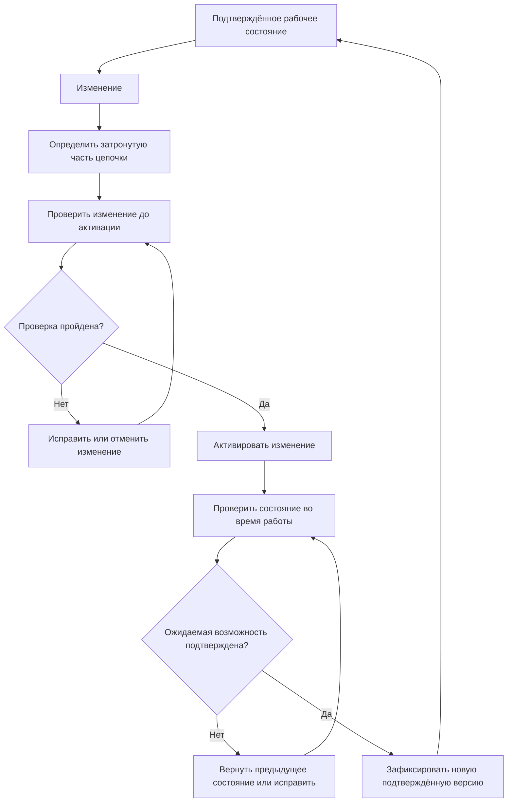

# Глава 10. Как поддерживать возможности обнаружения в рабочем состоянии

В предыдущих главах мы построили цепочку от события и точки наблюдения до представления данных, условия обнаружения и проверяемого результата. В Главе 8 научились оценивать качество на фиксированных условиях, а в Главе 9 увидели, что изменение протокола, шифрования или точки формирования телеметрии способно изменить само представление, доступное детектору.

Остаётся следующий инженерный вопрос:

> **что происходит с уже подтверждённой возможностью обнаружения после изменения системы?**

Если вчера правило сработало на контролируемом наборе данных, это не означает, что через месяц тот же вывод остаётся доказанным автоматически. За это время могли измениться набор правил, конфигурация, версия движка, протокольный анализатор, точка наблюдения, нагрузка, путь вывода событий или сама инфраструктура.

Поэтому эксплуатация IDPS — это не только «процесс запущен» и не только «обновления установлены». Нужно поддерживать **проверяемую связь** между текущим состоянием системы и теми возможностями обнаружения, которые организация считает действующими.

---

## 1. Подтверждённая возможность обнаружения существует только в конкретном состоянии

В Главе 8 мы уже фиксировали версию, конфигурацию, набор данных и условия оценки. Теперь сделаем следующий шаг.

Результат проверки относится не к абстрактной «IDS вообще», а к конкретному состоянию:

  
ДАННЫЕ<strong class="idps-card__title">Источник и точка наблюдения</strong>
Откуда система получает данные, где расположен сенсор и какой трафик или телеметрия реально проходят через эту точку.

  
ОБРАБОТКА<strong class="idps-card__title">Движок и конфигурация</strong>
Версия программы, включённые протокольные анализаторы, параметры потоков, ограничения ресурсов и другие настройки.

  
ОБНАРУЖЕНИЕ<strong class="idps-card__title">Набор правил и вывод</strong>
Активные правила, пороги, подавление, способ формирования и доставки результата.

Если меняется хотя бы один из этих элементов, прежний тест остаётся историческим доказательством **предыдущего состояния**. Он не исчезает, но его нельзя автоматически переносить на новое.

Это не означает, что после любого изменения нужно полностью повторять всю оценку системы. Масштаб повторной проверки должен соответствовать тому, **что именно могло измениться в причинной цепочке**.

---

## 2. Какие изменения способны изменить результат обнаружения

Не все изменения одинаковы. Полезно различать хотя бы пять классов.

<table class="idps-axis-table">
<thead>
<tr>
<th>Что изменилось</th>
<th>Что может измениться в IDPS</th>
<th>Какой вопрос нужно проверить</th>
</tr>
</thead>
<tbody>
<tr>
<td data-label="Что изменилось">Набор правил</td>
<td data-label="Что может измениться в IDPS">Условия совпадения, исключения, приоритеты, пороги, включённые и отключённые правила</td>
<td data-label="Что нужно проверить">Активна ли ожидаемая версия и сохраняются ли положительные/отрицательные результаты?</td>
</tr>
<tr>
<td data-label="Что изменилось">Конфигурация</td>
<td data-label="Что может измениться в IDPS">Область действия правил, переменные сети, протокольные параметры, лимиты памяти, вывод событий</td>
<td data-label="Что нужно проверить">Не изменилась ли область применимости или путь результата?</td>
</tr>
<tr>
<td data-label="Что изменилось">Движок или протокольный анализатор</td>
<td data-label="Что может измениться в IDPS">Разбор протокола, нормализация, поддерживаемые поля, состояние потоков, поведение правил</td>
<td data-label="Что нужно проверить">Совпадает ли доступное представление с тем, на котором проверялось условие?</td>
</tr>
<tr>
<td data-label="Что изменилось">Топология или точка наблюдения</td>
<td data-label="Что может измениться в IDPS">Набор реально наблюдаемого трафика, направление, место до/после шифрования или преобразования</td>
<td data-label="Что нужно проверить">Попадает ли нужный обмен в сенсор и в прежнем ли представлении?</td>
</tr>
<tr>
<td data-label="Что изменилось">Нагрузка или путь вывода</td>
<td data-label="Что может измениться в IDPS">Потери пакетов, разрывы восстановления потока, очереди, задержка и доставка оповещений</td>
<td data-label="Что нужно проверить">Получает ли движок нужные данные и доходит ли результат до потребителя?</td>
</tr>
</tbody>
</table>

<strong>Главная идея:</strong> изменение может происходить далеко от текста правила, но всё равно менять доказанную возможность обнаружения.

Поэтому «правило не меняли» ещё не означает «возможность обнаружения не менялась».

---

## 3. Жизненный цикл — это цикл подтверждения, а не список административных команд

Для курса используем следующую **инженерную модель**. Это не универсальный стандарт жизненного цикла для всех продуктов, а способ не потерять связь между изменением и доказательством.

Здесь принципиальны две разные проверки:

1. **до активации** — корректен ли сам изменённый набор правил/конфигурации и проходит ли он контролируемые тесты;
2. **после активации** — действительно ли рабочая система загрузила нужное состояние, получает данные и формирует ожидаемый результат.

Первая проверка не заменяет вторую.

---

## 4. «Файл обновлён» и «возможность обнаружения обновлена» — разные факты

Рассмотрим набор правил.

ВИЗУАЛЬНАЯ МОДЕЛЬ 1 · ЧЕТЫРЕ РАЗНЫХ ФАКТА ОБ ОБНОВЛЕНИИ

  
1<strong>Новая версия получена</strong><small>Файлы или источник правил изменились на диске.</small>

  
→

  
2<strong>Новая версия загружена</strong><small>Рабочий движок действительно активировал изменённый набор.</small>

  
→

  
3<strong>Данные достигают детектора</strong><small>Нужный источник, точка наблюдения и представление по-прежнему доступны.</small>

  
→

  
4<strong>Ожидаемый результат подтверждён</strong><small>Контролируемый тест показывает, что новая рабочая версия ведёт себя ожидаемо.</small>

Каждый шаг требует собственного свидетельства. Успех первого шага не доказывает автоматически успех четвёртого.

Например, успешная команда обновления файлов доказывает только изменение файлов. Она сама по себе не доказывает, что:

- рабочий процесс загрузил именно новую версию;
- все правила разобрались без ошибок;
- нужное правило включено;
- ожидаемый трафик достигает сенсора;
- результат не подавлен и доходит до журнала.

Это прямое применение нашей модальности:

**ВОЗМОЖНОСТЬ → КОНФИГУРАЦИЯ → НАБЛЮДЕНИЕ → ОБОСНОВАННЫЙ ВЫВОД.**

---

## 5. Что нужно фиксировать, чтобы изменение можно было воспроизвести

В Главе 8 повторяемость была свойством оценки. В эксплуатации она становится свойством рабочего состояния.

Минимальная запись об изменении должна позволять ответить:

  
Что изменили?<strong>Файл правила, набор правил, конфигурацию, движок, топологию, источник данных или путь вывода.</strong>

  
Из какого состояния?<strong>Какая версия была активна до изменения и какими тестами она была подтверждена.</strong>

  
Какое состояние стало новым?<strong>Версия движка, набор правил, конфигурация и другие параметры, влияющие на проверяемую возможность.</strong>

  
Чем подтверждено?<strong>Результаты положительных, отрицательных и при необходимости вариантных тестов, а также наблюдения рабочей системы после активации.</strong>

  
<strong>Граница доказательности:</strong> запись версии позволяет воспроизвести состояние, но сама по себе не доказывает качество обнаружения.

Для конкретного набора правил полезно иметь однозначный идентификатор версии: номер выпуска, идентификатор изменения, контрольную сумму файла или иной воспроизводимый признак. Способ зависит от среды; важно не название механизма, а возможность точно восстановить, **что было активно в момент наблюдения**.

---

## 6. Предварительная проверка изменения должна наследовать модель Главы 8

Новое правило или изменение существующего условия не следует оценивать только вопросом «синтаксис принят?». Синтаксическая корректность — необходимое, но недостаточное условие.

Минимальный набор проверок уже знаком:

  
<strong>Положительный тест</strong>Случай, для которого ожидается выполнение условия.

  
<strong>Отрицательный тест</strong>Похожий легитимный случай, который не должен давать тот же результат.

  
<strong>Вариантный тест</strong>Изменённое представление интересующего поведения, если устойчивость к варианту входит в цель правила.

  
<strong>Проверка нагрузки</strong>Нужна, если изменение способно существенно увеличить стоимость анализа или объём результатов.

Важно не превращать это в универсальное правило «каждое изменение обязано иметь ровно четыре теста». Выбор тестов определяется ожидаемым влиянием изменения.

Например, изменение только текста `msg` в правиле не требует того же объёма проверки, что изменение `content`, порога, области сети или протокольного поля.

---

## 7. Активация должна иметь собственное подтверждение

После предварительной проверки возникает вопрос: **как доказать, что рабочая система действительно перешла в новое состояние?**

Для разных продуктов механизм различается. Один продукт требует перезапуска процесса, другой умеет загружать правила без остановки основного потока, третий применяет конфигурацию централизованно к группе сенсоров.

Поэтому курс не вводит универсальную команду «обновить IDS».

Вместо этого проверяем три факта:

  
1 · АКТИВАЦИЯ<strong>Операция применения завершилась</strong><small>Есть подтверждение от конкретного продукта, а не только факт изменения файла.</small>

  
2 · СОСТОЯНИЕ<strong>Ожидаемая версия действительно активна</strong><small>Версия движка, число/состав правил или нужная конфигурация соответствуют плану.</small>

  
3 · ПРОВЕРКА<strong>Контролируемый случай даёт ожидаемый результат</strong><small>Проверяется рабочий путь от данных до результата после активации.</small>

Только после этого можно говорить, что изменение стало частью подтверждённого рабочего состояния.

---

## 8. Пример реализации: повторная загрузка правил Suricata

Suricata используется здесь как конкретная реализация, а не как универсальная модель эксплуатации IDPS.

В официальной документации Suricata 8.0.7 описана повторная загрузка правил во время обработки трафика. При такой операции Suricata создаёт новый движок обнаружения для обновлённого набора правил, переключает рабочие потоки на него и затем освобождает старый экземпляр. Документация отдельно предупреждает, что во время этого процесса временно требуется дополнительная память.

Из этого примера можно сделать несколько **ограниченных** выводов:

- Suricata умеет применять изменения правил без обязательной полной остановки обработки трафика;
- повторная загрузка затрагивает определённый набор связанных с правилами ресурсов, а не произвольно всю конфигурацию;
- факт запуска повторной загрузки не равен доказательству успешной активации всех ожидаемых правил;
- эксплуатационная проверка должна учитывать ресурсы, потому что изменение состояния движка может временно менять потребление памяти.

Конкретные команды Suricata, например `ruleset-reload-rules`, `ruleset-stats`, `ruleset-failed-rules` и `ruleset-reload-time`, полезны именно как **свидетельства конкретной реализации**. Они не становятся универсальными командами IDPS.

---

## 9. Работоспособность процесса — только первый слой

Фраза «Suricata работает» может означать только то, что процесс существует. Но нас интересует рабочая возможность обнаружения.

ВИЗУАЛЬНАЯ МОДЕЛЬ 2 · ЛЕСТНИЦА РАБОТОСПОСОБНОСТИ

  
1 · ПРОЦЕСС<strong>Движок запущен</strong><small>Это ещё ничего не говорит о нужном интерфейсе и данных.</small>

  
2 · ПОЛУЧЕНИЕ<strong>Нужные данные действительно поступают</strong><small>Проверяются интерфейсы, объём и потери.</small>

  
3 · ПРЕДСТАВЛЕНИЕ<strong>Данные обрабатываются без критических разрывов</strong><small>Нет ли потерь, ошибок или ограничений, разрушающих требуемый контекст.</small>

  
4 · ЛОГИКА<strong>Нужная версия правил активна</strong><small>Правила загружены и не отклонены движком.</small>

  
5 · РЕЗУЛЬТАТ<strong>События формируются и доставляются</strong><small>Журнал, очередь или внешняя система действительно получают результат.</small>

  
6 · ВОЗДЕЙСТВИЕ<strong>Если требуется IPS, действие тоже подтверждено</strong><small>Обнаружение и исполнительное воздействие проверяются раздельно.</small>

Проверка верхнего слоя не позволяет пропустить нижние. Процесс может быть жив, пока трафик не поступает или результаты не доставляются.

Эта лестница продолжает модель Главы 7, но теперь используется не для объяснения единичного отсутствующего оповещения, а для постоянной эксплуатации.

---

## 10. Счётчики состояния — это наблюдения, а не окончательный диагноз

Современный движок обычно предоставляет эксплуатационные счётчики. На примере Suricata это могут быть:

- количество обработанных пакетов;
- потери при захвате;
- разрывы при восстановлении TCP-потока;
- использование памяти;
- число сформированных оповещений;
- число загруженных или отклонённых правил;
- статистика интерфейса.

В официальной документации Suricata 8.0.7, например, отдельно описаны `capture.kernel_packets`, `capture.kernel_drops` и `tcp.reassembly_gap`.

Но один счётчик не объясняет всю причинную цепочку.

  
<strong>`capture.kernel_drops > 0` поддерживает вывод:</strong>часть пакетов была отброшена на соответствующем этапе захвата в данном режиме.

  
<strong>Сам по себе не доказывает:</strong>что конкретное интересующее событие было потеряно или что именно эта потеря вызвала FN.

  
<strong>`tcp.reassembly_gap > 0` поддерживает вывод:</strong>движок фиксировал отсутствующие данные в некоторых TCP-потоках.

  
<strong>Сам по себе не доказывает:</strong>что любое отсутствующее оповещение вызвано разрывом восстановления именно нужного потока.

Эксплуатационные счётчики помогают локализовать проблему, но причинная связь с конкретным результатом требует сопоставления с интересующим событием и условиями его обработки.

---

## 11. Путь вывода результата тоже является частью рабочей возможности

Детектор может корректно выделить событие, но результат всё равно не попасть к оператору или внешней системе.

Например, EVE JSON Suricata может записывать оповещения, аномалии, метаданные и протокольные события. Способ вывода, буферизация и внешняя доставка являются отдельной частью конфигурации.

Поэтому нужно различать:

ВИЗУАЛЬНАЯ МОДЕЛЬ 3 · ПУТЬ РЕЗУЛЬТАТА ДО ПОТРЕБИТЕЛЯ

  
1 · УСЛОВИЕ<strong>Условие детектора выполнилось</strong><small>Логика обнаружения получила данные в подходящем представлении и сформировала решение.</small>

  
2 · РЕЗУЛЬТАТ<strong>Движок сформировал результат</strong><small>Например, оповещение или другую запись, предусмотренную конкретной реализацией.</small>

  
3 · ВЫХОД<strong>Результат попал в настроенный выход</strong><small>Сработал выбранный механизм журналирования, очереди или передачи.</small>

  
4 · ДОСТАВКА<strong>Данные были сохранены или переданы</strong><small>Путь между IDPS и следующим компонентом не потерял запись.</small>

  
5 · ПОТРЕБИТЕЛЬ<strong>Потребитель получил и обработал запись</strong><small>Внешняя система действительно приняла результат и сделала его доступным для дальнейшего использования.</small>

Это диагностическая цепочка доставки результата, а не универсальная внутренняя архитектура всех IDPS. Разрыв на любом этапе меняет то, что увидит конечный потребитель.

Если последняя система цепочки не показывает оповещение, нельзя сразу изменять правило. Сначала нужно выяснить, на каком шаге результат перестал быть наблюдаемым.

Это особенно важно при интеграции с внешними платформами: IDPS и система, которая получает её события, имеют **разные собственные состояния и разные точки отказа**.

---

## 12. Изменение нагрузки может превратить корректную конфигурацию в некорректное рабочее состояние

В Главе 8 производительность уже была отдельным измерением оценки. В эксплуатации это означает, что та же конфигурация может вести себя по-разному при другой нагрузке.

Например:

  
ПОТОК ДАННЫХ<strong class="idps-card__title">Стало больше трафика</strong>
Растут требования к захвату, очередям, памяти и обработке.

  
ЛОГИКА<strong class="idps-card__title">Правила стали дороже</strong>
Даже без изменения объёма трафика новый набор условий может увеличить стоимость анализа.

  
ВЫВОД<strong class="idps-card__title">Стало больше событий</strong>
Рост объёма результатов нагружает журнал, канал доставки и систему-потребитель.

Поэтому «конфигурация одна и та же» не означает «рабочее состояние одно и то же».

Если изменение связано с нагрузкой, подтверждение должно включать не только наличие результата, но и признаки того, что система не теряет критически важные данные и укладывается в требуемые задержки.

---

## 13. Несогласованные версии сенсоров создают разные условия обнаружения

В распределённой среде несколько сенсоров могут получать разные версии правил или конфигурации в разное время.

Это создаёт простой, но опасный эффект:

  
<strong class="idps-card__title">Сенсор A</strong>
Версия движка X, набор правил R17, конфигурация C5.

  
≠

  
<strong class="idps-card__title">Сенсор B</strong>
Версия движка X, набор правил R18, конфигурация C5.

Даже при одинаковом наблюдаемом событии результат может различаться.

Поэтому при анализе нужно уметь ответить не только «какой сенсор видел трафик?», но и **в каком рабочем состоянии находился этот сенсор в момент события**.

Это станет особенно важным позже, когда мы будем сопоставлять результаты из нескольких источников. Пока достаточно зафиксировать принцип: версия и конфигурация являются частью контекста доказательства.

---

## 14. Интерактив: одно изменение — разные последствия

Ниже один и тот же вопрос рассматривается для разных классов изменений. Переключайте изменение и сравнивайте, **что именно надо перепроверить**, а не просто «перезапустить IDS».

  

    <strong>ИНТЕРАКТИВ · ЧТО ПЕРЕПРОВЕРЯТЬ ПОСЛЕ ИЗМЕНЕНИЯ</strong>
    
Каждая панель показывает возможный разрыв причинной цепочки и минимальное свидетельство рабочего состояния.

  

  

    <button id="chapter10-change-rules-tab" class="idps-switcher__button" data-idps-switch="rules" aria-controls="chapter10-change-rules" aria-selected="true">Набор правил</button>
    <button id="chapter10-change-config-tab" class="idps-switcher__button" data-idps-switch="config" aria-controls="chapter10-change-config" aria-selected="false">Конфигурация</button>
    <button id="chapter10-change-engine-tab" class="idps-switcher__button" data-idps-switch="engine" aria-controls="chapter10-change-engine" aria-selected="false">Движок</button>
    <button id="chapter10-change-placement-tab" class="idps-switcher__button" data-idps-switch="placement" aria-controls="chapter10-change-placement" aria-selected="false">Топология</button>
    <button id="chapter10-change-load-tab" class="idps-switcher__button" data-idps-switch="load" aria-controls="chapter10-change-load" aria-selected="false">Нагрузка / вывод</button>
  

  

    <section id="chapter10-change-rules" class="idps-switcher__panel" data-idps-panel="rules">
      <h3 class="idps-switcher__panel-title">Изменился набор правил</h3>
      

        
Что могло измениться<strong>Условие совпадения, область действия, пороги, подавление, включённые правила и стоимость анализа.</strong>

        
До активации<strong>Проверить синтаксис, положительные и отрицательные случаи, а для существенного изменения — нужные варианты и нагрузку.</strong>

        
После активации<strong>Подтвердить активную версию, отсутствие отклонённых правил и ожидаемый результат на контролируемом случае.</strong>

        
<strong>Не доказано автоматически:</strong> что новая версия «лучше» предыдущей только потому, что она новее.

      

    </section>
    <section id="chapter10-change-config" class="idps-switcher__panel" data-idps-panel="config">
      <h3 class="idps-switcher__panel-title">Изменилась конфигурация</h3>
      

        
Что могло измениться<strong>Переменные сети, лимиты, протокольные настройки, способ вывода, области применения правил.</strong>

        
До активации<strong>Определить, какие условия и источники зависят от изменённого параметра.</strong>

        
После активации<strong>Подтвердить реально действующее значение и проверить затронутый путь данных.</strong>

        
<strong>Не доказано автоматически:</strong> что процесс использует файл, который администратор только что отредактировал.

      

    </section>
    <section id="chapter10-change-engine" class="idps-switcher__panel" data-idps-panel="engine">
      <h3 class="idps-switcher__panel-title">Обновился движок или протокольный анализатор</h3>
      

        
Что могло измениться<strong>Разбор протокола, нормализация, поля, семантика состояний, поддерживаемые ключевые слова и производительность.</strong>

        
До активации<strong>Повторить тесты для критичных представлений и правил, зависящих от изменённого анализа протокола.</strong>

        
После активации<strong>Проверить версию и рабочий результат на репрезентативных контролируемых случаях.</strong>

        
<strong>Не доказано автоматически:</strong> что совместимый синтаксис правила означает идентичную семантику обработки во всех версиях.

      

    </section>
    <section id="chapter10-change-placement" class="idps-switcher__panel" data-idps-panel="placement">
      <h3 class="idps-switcher__panel-title">Изменилась топология или точка наблюдения</h3>
      

        
Что могло измениться<strong>Маршрут трафика, направление, видимость до/после TLS, NAT, прокси, туннеля или балансировщика.</strong>

        
До активации<strong>Сопоставить нужные потоки с новой точкой наблюдения и ожидаемым представлением.</strong>

        
После активации<strong>Независимо подтвердить, что контролируемый обмен действительно поступает в нужный источник.</strong>

        
<strong>Не доказано автоматически:</strong> что прежнее правило перестало работать из-за своего содержания — причина может быть в наблюдаемости.

      

    </section>
    <section id="chapter10-change-load" class="idps-switcher__panel" data-idps-panel="load">
      <h3 class="idps-switcher__panel-title">Изменилась нагрузка или путь вывода</h3>
      

        
Что могло измениться<strong>Потери при захвате, разрывы потока, очереди, задержка, объём журналов и доставка во внешнюю систему.</strong>

        
До изменения<strong>Зафиксировать базовые рабочие значения для выбранной нагрузки и пути результата.</strong>

        
После изменения<strong>Сравнить потери, задержку и доставку результата при сопоставимых условиях.</strong>

        
<strong>Не доказано автоматически:</strong> что отсутствие результата вызвано детектором — он мог потеряться до или после логики обнаружения.

      

    </section>
  

---

## 15. Возврат к предыдущему состоянию — часть проверяемого изменения

Изменение может пройти предварительную проверку и всё равно вести себя плохо в рабочей среде: другая нагрузка, непредусмотренный трафик, конфликт конфигураций или рост ложноположительных результатов проявляются только после активации.

Поэтому до существенного изменения нужно понимать:

- какое предыдущее состояние считается известным и пригодным;
- как его точно идентифицировать;
- какие данные нужно сохранить для возврата;
- каким наблюдением подтвердить, что возврат действительно состоялся;
- какие результаты, сформированные между изменением и возвратом, требуют отдельной интерпретации.

Сам факт копирования старого файла обратно ещё не является подтверждённым возвратом рабочего состояния. После возврата снова нужно проверить активную версию и затронутую возможность обнаружения.

---

## 16. Автоматизация полезна только тогда, когда автоматизирует доказательства, а не только действия

Автоматически скачать набор правил и отправить команду применения — относительно просто. Сложнее автоматизировать проверку того, что изменение стало корректным рабочим состоянием.

Поэтому полезный автоматизированный процесс должен по возможности связывать:

  
1<strong>Получить изменение</strong><small>Однозначно определить новую версию или набор файлов.</small>

  
2<strong>Проверить структуру</strong><small>Отдельно подтвердить синтаксическую и структурную корректность.</small>

  
3<strong>Выполнить контролируемые тесты</strong><small>Проверить затронутые положительные, отрицательные и иные необходимые случаи.</small>

  
4<strong>Активировать</strong><small>Применить изменение предусмотренным механизмом конкретной реализации.</small>

  
5<strong>Подтвердить активную версию</strong><small>Установить, какое состояние реально использует рабочая система.</small>

  
6<strong>Проверить получение данных</strong><small>Убедиться, что источник и точка наблюдения остаются работоспособными, а потери находятся в допустимых условиях проверки.</small>

  
7<strong>Проверить ожидаемый результат</strong><small>Повторить контролируемый случай уже на рабочем состоянии.</small>

  
8<strong>Зафиксировать артефакты</strong><small>Сохранить версию, условия и результаты, на которых основан новый вывод.</small>

Эта последовательность относится к **контролю изменения**, а не описывает обязательный внутренний конвейер обработки данных в IDPS.

Это не означает, что каждый IDPS обязан иметь полноценный конвейер автоматического развертывания. Масштаб автоматизации зависит от среды.

Критерий курса другой: **автоматизация не должна превращать непроверенное изменение в быстро распространяемое непроверенное изменение**.

---

## 17. Типичные ошибки эксплуатации

### Ошибка 1 — «процесс запущен, значит IDS работает»

Процесс может быть запущен без нужного интерфейса, без нужного трафика или с потерями. Проверять нужно весь затронутый путь.

### Ошибка 2 — «правила обновились, значит защита улучшилась»

Новая версия может добавить покрытие, изменить существующие условия, увеличить шум или стоимость обработки. Улучшение требует отдельного критерия и проверки.

### Ошибка 3 — «команда применения завершилась успешно, значит правило активно»

Нужно проверить состояние рабочей системы: загрузились ли правила, не было ли ошибок и даёт ли контролируемый случай ожидаемый результат.

### Ошибка 4 — «если тест прошёл до развертывания, после развертывания проверять нечего»

Предварительная среда не доказывает рабочий маршрут трафика, активную версию и состояние вывода на производственной системе.

### Ошибка 5 — «одинаковый продукт на всех сенсорах означает одинаковое обнаружение»

Версии правил, конфигурации, движка и точки наблюдения могут различаться.

### Ошибка 6 — «если внешний SIEM не показывает событие, правило не сработало»

Результат мог быть сформирован IDPS и потеряться или отфильтроваться дальше по пути доставки. Источник результата и потребитель результата — разные компоненты.

### Ошибка 7 — «откат — это просто вернуть старый файл»

Нужно подтвердить, что рабочая система действительно вернулась к предыдущему состоянию и что затронутая возможность снова работает ожидаемо.

---

## 18. Что нужно запомнить

1. Возможность обнаружения подтверждается для конкретного состояния источника, движка, конфигурации, набора правил и пути результата.
2. Изменение правила — только один из способов изменить обнаружение; конфигурация, движок, топология и нагрузка тоже важны.
3. «Файл обновлён», «правила загружены» и «ожидаемое обнаружение подтверждено» — три разных утверждения.
4. Предварительная проверка и проверка после активации отвечают на разные вопросы.
5. Работоспособность процесса не доказывает получение нужных данных, корректность представления или доставку результата.
6. Эксплуатационные счётчики являются наблюдениями и помогают локализовать проблему, но не заменяют причинного анализа конкретного события.
7. Версия и конфигурация сенсора являются частью контекста доказательства.
8. Существенное изменение должно иметь понятное предыдущее состояние и проверяемый путь возврата.
9. Автоматизация полезна, когда сохраняет и проверяет свидетельства, а не только ускоряет применение изменений.
10. Suricata в этой главе показывает конкретные механизмы управления правилами и рабочим состоянием, но не задаёт универсальную эксплуатационную модель всех IDPS.

---

## 19. Проверка понимания

  
<strong>Файл набора правил успешно обновлён на диске. Что это доказывает?</strong>

  <button data-choice="a" data-correct="true">A. Новая версия файлов получена; активность новой версии в рабочем движке и качество обнаружения требуют отдельных подтверждений</button>
  <button data-choice="b">B. Все новые правила уже активны</button>
  <button data-choice="c">C. Полнота обнаружения автоматически выросла</button>
  <button data-choice="d">D. Все сенсоры используют эту версию</button>
  

  
<strong>Почему положительный тест до развертывания не завершает проверку изменения?</strong>

  <button data-choice="a">A. Потому что положительные тесты всегда недостоверны</button>
  <button data-choice="b" data-correct="true">B. Он не подтверждает, что рабочая система активировала нужную версию, получает нужные данные и доставляет результат</button>
  <button data-choice="c">C. Потому что после развертывания правило всегда меняется</button>
  <button data-choice="d">D. Потому что в рабочей среде нельзя тестировать состояние системы</button>
  

  
<strong>Процесс IDS запущен, но ожидаемого оповещения нет. Какой следующий вывод корректен?</strong>

  <button data-choice="a">A. События точно не было</button>
  <button data-choice="b">B. Правило обязательно ошибочно</button>
  <button data-choice="c" data-correct="true">C. Нужно проверить получение данных, представление, активную логику и путь результата; сам статус процесса этого не доказывает</button>
  <button data-choice="d">D. Нужно сразу увеличить чувствительность всех правил</button>
  

  
<strong>Что означает рост <code>capture.kernel_drops</code> в подходящем режиме захвата Suricata?</strong>

  <button data-choice="a">A. Конкретная атака была пропущена</button>
  <button data-choice="b" data-correct="true">B. На соответствующем этапе фиксируется отбрасывание пакетов; связь с конкретным FN нужно доказывать отдельно</button>
  <button data-choice="c">C. Все правила перегружены</button>
  <button data-choice="d">D. Протокольный анализатор отключён</button>
  

  
<strong>Два сенсора наблюдают похожий трафик, но дают разные результаты. Что нужно проверить до вывода об ошибке?</strong>

  <button data-choice="a">A. Только количество процессоров</button>
  <button data-choice="b" data-correct="true">B. Точки наблюдения, версии движка и правил, конфигурацию, доступное представление и путь результата на каждом сенсоре</button>
  <button data-choice="c">C. Только текст <code>msg</code></button>
  <button data-choice="d">D. Ничего: одинаковый продукт обязан дать одинаковый результат</button>
  

  
<strong>Какой смысл у возврата к предыдущему состоянию?</strong>

  <button data-choice="a">A. Просто восстановить любой старый файл</button>
  <button data-choice="b">B. Скрыть неудачное изменение от журнала</button>
  <button data-choice="c" data-correct="true">C. Вернуть известное состояние и отдельно подтвердить, что рабочая система действительно снова использует его и затронутая возможность восстановлена</button>
  <button data-choice="d">D. Обязательно перезагрузить всю инфраструктуру</button>
  

---

## Источники и границы главы

### Общая эксплуатационная основа

- NIST SP 800-94, *Guide to Intrusion Detection and Prevention Systems (IDPS)* — исторический фундаментальный источник, который прямо охватывает проектирование, внедрение, конфигурирование, защиту, мониторинг и сопровождение IDPS: https://csrc.nist.gov/pubs/sp/800/94/final

NIST SP 800-94 опубликован в 2007 году. Он используется здесь как историческая инженерная основа эксплуатации IDPS, а не как актуальная продуктовая классификация или исчерпывающее описание современных протоколов и реализаций. Черновик редакции 1 от 2012 года был снят с дальнейшей разработки и не используется как действующий стандарт.

### Официальная документация конкретной реализации

- Suricata 8.0.7, *Rule Management with Suricata-Update* — получение, обновление и включение/отключение правил: https://docs.suricata.io/en/suricata-8.0.7/rule-management/suricata-update.html
- Suricata 8.0.7, *Rule Reloads* — повторная загрузка правил во время работы, связанные ресурсы и последовательность переключения движка обнаружения: https://docs.suricata.io/en/suricata-8.0.7/rule-management/rule-reload.html
- Suricata 8.0.7, *Statistics* — эксплуатационные счётчики, включая статистику захвата и `tcp.reassembly_gap`: https://docs.suricata.io/en/suricata-8.0.7/performance/statistics.html
- Suricata 8.0.7, *Interacting via Unix Socket* — запрос рабочей версии, статистики интерфейса, состояния набора правил и времени последней загрузки: https://docs.suricata.io/en/suricata-8.0.7/unix-socket.html
- Suricata 8.0.7, *EVE JSON Output* — конфигурация вывода событий, статистики и буферизации результата: https://docs.suricata.io/en/suricata-8.0.7/output/eve/eve-json-output.html

Дополнительная литература по эксплуатации и реагированию, включая Joshua Wright, *Dynamic Incident Response: A Framework for Security Teams* (SANS Institute, 2026), может поддерживать примеры постоянной настройки детекторов, проверки покрытий и поддержания готовности. Она не задаёт универсальный жизненный цикл IDPS и не заменяет официальную документацию конкретной реализации.

Глава не является руководством по администрированию Suricata и не задаёт обязательный для всех организаций процесс управления изменениями. Её задача — показать причинную связь **изменение → возможное изменение наблюдаемости/обработки → проверка → рабочее свидетельство → новый обоснованный статус возможности обнаружения**.

---

Следующий шаг — [Глава 11 «Как сопоставлять несколько источников и контекст угроз»](../11-multi-source-correlation/). В ней один результат перестаёт быть единственной точкой анализа: мы разберём, как связывать независимые наблюдения, сохранять происхождение каждого источника и не превращать корреляцию в ложную «единую истину».
