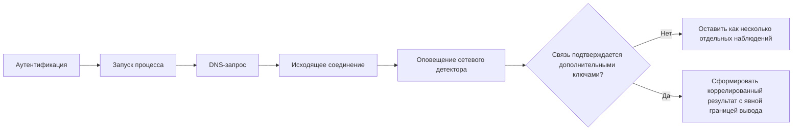

# Глава 11. Как сопоставлять несколько источников и контекст угроз

В предыдущих главах мы последовательно отделяли событие от его следов, источник данных от точки наблюдения, представление от условия обнаружения и результат от инцидента. В Главе 10 добавилось ещё одно требование: возможность обнаружения должна оставаться проверяемой после изменений системы.

Теперь возникает другой инженерный вопрос:

> **что делать, если одного источника и одного результата недостаточно для обоснованного вывода?**

Один сетевой сенсор может видеть соединение, но не локальный процесс. Журнал приложения может подтверждать запрос, но не весь сетевой путь. Событие конечного узла может показывать запуск процесса, но не доказывать, что конкретный пакет дошёл до удалённого сервера. Внешняя информация об угрозах может добавить контекст, но не превращает совпадение адреса или хэша в доказательство компрометации.

Поэтому несколько источников нужны не для того, чтобы создать «единую абсолютную истину», а чтобы **сопоставить независимые наблюдения и явно показать, какой совместный вывод они поддерживают**.

---

## 1. Несколько источников — это несколько границ доказательности

Представим один синтетический эпизод:

- сетевой сенсор выделил соединение рабочей станции с внешним адресом;
- DNS-журнал содержит запрос имени, связанный по времени с этим соединением;
- телеметрия конечного узла показывает процесс, который создал сетевое соединение;
- журнал приложения или системы идентификации содержит пользовательский контекст;
- внешний источник информации об угрозах сообщает, что адрес ранее связывался с вредоносной инфраструктурой.

<div class="idps-responsive-shell">
<div class="idps-grid idps-grid--3">
  <article class="idps-card idps-card--source"><span class="idps-card__eyebrow">СЕТЬ</span><strong class="idps-card__title">Соединение и протокольный контекст</strong><p>Подтверждает то, что реально наблюдал сетевой источник: адреса, порты, доступные поля протокола, состояние и результат конкретного детектора.</p></article>
  <article class="idps-card idps-card--sensor"><span class="idps-card__eyebrow">КОНЕЧНЫЙ УЗЕЛ / ПРИЛОЖЕНИЕ</span><strong class="idps-card__title">Локальный и пользовательский контекст</strong><p>Может связать активность с процессом, пользователем, файлом или операцией — если соответствующая телеметрия действительно собирается.</p></article>
  <article class="idps-card idps-card--result"><span class="idps-card__eyebrow">ВНЕШНИЙ КОНТЕКСТ</span><strong class="idps-card__title">Информация об угрозах</strong><p>Может сообщить, что наблюдаемый объект ранее имел определённую репутацию или связь с известной активностью. Это контекст, а не автоматическое доказательство текущего инцидента.</p></article>
</div>
</div>

Сила совместного анализа появляется только тогда, когда мы понимаем **почему эти записи относятся к одному эпизоду** и **какой вклад делает каждый источник**.

---

## 2. Агрегация, корреляция и обогащение — разные операции

Эти понятия часто смешивают, хотя они отвечают на разные вопросы.

<div class="idps-axis-table-wrap">
<table class="idps-axis-table">
<thead>
<tr>
<th>Операция</th>
<th>Что делаем</th>
<th>Что получаем</th>
<th>Чего это не доказывает автоматически</th>
</tr>
</thead>
<tbody>
<tr>
<td data-label="Операция"><strong>Агрегация</strong></td>
<td data-label="Что делаем">Собираем или группируем записи по выбранному признаку: источнику, узлу, пользователю, адресу, времени, типу события.</td>
<td data-label="Что получаем">Удобное множество записей для дальнейшего анализа.</td>
<td data-label="Не доказывает">Что все записи описывают одну причинно связанную активность.</td>
</tr>
<tr>
<td data-label="Операция"><strong>Корреляция</strong></td>
<td data-label="Что делаем">Устанавливаем проверяемую связь между наблюдениями по идентификатору, атрибутам, времени, последовательности или другому определённому правилу.</td>
<td data-label="Что получаем">Связанный набор наблюдений или новый результат, основанный на нескольких входах.</td>
<td data-label="Не доказывает">Что выбранная связь обязательно причинная или что источники подтверждают компрометацию.</td>
</tr>
<tr>
<td data-label="Операция"><strong>Обогащение контекстом</strong></td>
<td data-label="Что делаем">Добавляем сведения из инвентаризации, каталога пользователей, информации об угрозах, базы знаний или другого источника.</td>
<td data-label="Что получаем">Дополнительное описание уже наблюдаемого объекта или события.</td>
<td data-label="Не доказывает">Что внешний контекст описывает именно текущий эпизод или сохраняет актуальность.</td>
</tr>
</tbody>
</table>
<div class="idps-axis-table__note"><strong>Главная идея:</strong> корреляция — это операция над наблюдениями. Она не стирает происхождение данных и не превращает все входы в один источник.</div>
</div>

Например, «показать все события для IP-адреса за час» — это ещё не обязательно корреляция. Это может быть простая выборка. Корреляция начинается там, где определено правило связи и можно объяснить, почему записи считаются относящимися друг к другу.

---

## 3. Сначала сохраняем происхождение записи

Перед сопоставлением важно не потерять сведения о происхождении:

- какой источник сформировал запись;
- где находилась его точка наблюдения;
- каким способом данные были получены;
- в каком представлении они были доступны;
- какое условие сформировало результат;
- какое время зафиксировал источник;
- какая версия/конфигурация источника действовала в этот момент.

<div class="idps-equation idps-equation--warning">
  <div class="idps-equation__expression"><span>КОРРЕЛЯЦИЯ</span><b>≠</b><span>ПОТЕРЯ ПРОИСХОЖДЕНИЯ</span></div>
  <p>Если после объединения невозможно установить, откуда взялся конкретный факт, совместный результат становится труднее проверить и воспроизвести.</p>
</div>

Это особенно важно, когда разные системы используют одинаковые названия полей, но вкладывают в них разный смысл. Поле `src_ip` в одной записи может обозначать адрес до преобразования, в другой — после NAT, а в журнале приложения вообще отсутствовать.

---

## 4. Как можно связывать записи

Не существует одного универсального ключа корреляции. Связь зависит от источников и задачи.

<div class="idps-responsive-shell">
<div class="idps-grid idps-grid--4 idps-grid--compact">
  <article class="idps-card"><span class="idps-card__eyebrow">ТОЧНЫЙ ИДЕНТИФИКАТОР</span><strong class="idps-card__title">Одна система</strong><p>Например, идентификатор потока или транзакции, который сама реализация помещает в связанные записи.</p></article>
  <article class="idps-card"><span class="idps-card__eyebrow">СОВМЕСТНЫЙ ИДЕНТИФИКАТОР</span><strong class="idps-card__title">Несколько сетевых средств</strong><p>Если инструменты поддерживают одинаковый алгоритм идентификации потока и используют совместимые параметры.</p></article>
  <article class="idps-card"><span class="idps-card__eyebrow">НАБОР АТРИБУТОВ</span><strong class="idps-card__title">Адреса, порты, узел, пользователь</strong><p>Связь строится по нескольким признакам и обычно требует учёта времени и преобразований инфраструктуры.</p></article>
  <article class="idps-card"><span class="idps-card__eyebrow">ПОСЛЕДОВАТЕЛЬНОСТЬ</span><strong class="idps-card__title">Окно времени и порядок</strong><p>Связываются наблюдения, которые удовлетворяют заданному порядку, интервалу и дополнительным условиям.</p></article>
</div>
</div>

Чем слабее ключ, тем осторожнее должен быть итоговый вывод.

---

## 5. Идентификатор внутри одного продукта не является универсальным идентификатором

### Suricata: `flow_id` и `tx_id`

В EVE JSON поле `flow_id` используется для сопоставления записей Suricata, относящихся к одному сетевому потоку/сеансу: например, `alert`, `http`, `fileinfo`, `anomaly` и `flow`. Для протокольных транзакций отдельные записи могут дополнительно содержать `tx_id`.

Это очень полезная связь, но её область ограничена конкретной реализацией и конкретным набором EVE-записей.

<div class="idps-evidence-grid">
  <article class="idps-evidence idps-evidence--yes"><strong>Поддерживает вывод</strong><p>Несколько EVE-записей с одним <code>flow_id</code> были отнесены Suricata к одному потоку в рамках её модели.</p></article>
  <article class="idps-evidence idps-evidence--no"><strong>Не доказывает</strong><p>Что запись другого продукта с похожими адресами относится к тому же потоку, что за соединением стоял конкретный процесс или что поток был вредоносным.</p></article>
</div>

### Zeek: `uid`

Zeek использует поле `uid` как уникальный идентификатор соединения и позволяет по нему переходить между `conn.log`, `http.log`, `weird.log` и другими журналами, относящимися к одной связи в модели Zeek.

`uid` Zeek и `flow_id` Suricata нельзя просто сравнить между собой: это разные идентификаторы, создаваемые разными системами.

---

## 6. Между инструментами нужен общий способ связи — но и он имеет границы

Suricata и Zeek поддерживают поле **Community ID** — вычисляемый идентификатор сетевого потока, предназначенный для сопоставления записей разных средств при совместимых настройках. Название сохраняется без перевода, потому что именно так механизм называется в официальной документации.

Suricata указывает, что `community_id` может использоваться для сопоставления её EVE-записей с выводом других инструментов, включая Zeek. В Zeek поле `community_id` доступно при включении соответствующей политики.

<div class="idps-responsive-shell">
<div class="idps-process">
  <div class="idps-process__step idps-process__step--source"><span>1</span><strong>Один наблюдаемый сетевой поток</strong><small>Совместимый набор сетевых атрибутов в пределах модели алгоритма.</small></div>
  <div class="idps-process__arrow">→</div>
  <div class="idps-process__step idps-process__step--sensor"><span>2</span><strong>Suricata</strong><small>Формирует собственные EVE-записи и, если функция включена, <code>community_id</code>.</small></div>
  <div class="idps-process__arrow">↔</div>
  <div class="idps-process__step idps-process__step--sensor"><span>3</span><strong>Zeek</strong><small>Формирует собственные журналы и может записывать тот же тип идентификатора.</small></div>
  <div class="idps-process__arrow">→</div>
  <div class="idps-process__step idps-process__step--result"><span>4</span><strong>Кандидат на межсистемную связь</strong><small>Совпадение поддерживает связь сетевых записей при совместимых условиях, но не отменяет проверку контекста.</small></div>
</div>
</div>

Даже общий идентификатор потока не является «универсальным идентификатором события во всей инфраструктуре». NAT, прокси, балансировщики, туннели или наблюдение по разные стороны преобразования способны изменить сетевые атрибуты. Поэтому два сенсора могут видеть один прикладной эпизод в разных сетевых представлениях и получить разные идентификаторы.

---

## 7. Время помогает связывать события, но не доказывает причинность

Когда точного общего идентификатора нет, часто используют временное окно:

> сетевое оповещение в 12:00:03 + запуск процесса в 12:00:02 + DNS-запрос в 12:00:01.

Такая близость полезна, но сама по себе недостаточна.

Нужно учитывать:

- насколько синхронизированы часы источников;
- когда именно источник ставит временную метку: при начале, окончании или записи события;
- возможную задержку доставки и буферизацию;
- разную точность времени;
- высокую плотность похожих событий на загруженных системах.

<div class="idps-equation idps-equation--danger">
  <div class="idps-equation__expression"><span>БЛИЗКО ПО ВРЕМЕНИ</span><b>≠</b><span>ВЫЗВАНО ДРУГ ДРУГОМ</span></div>
  <p>Временная близость создаёт кандидата на связь. Причинный вывод требует дополнительных совместимых признаков.</p>
</div>

---

## 8. IP-адрес и имя пользователя тоже не являются абсолютными идентификаторами

### IP-адрес

Один адрес может представлять:

- конкретный узел;
- несколько узлов за NAT;
- прокси или балансировщик;
- временный адрес виртуальной машины или контейнера;
- адрес, повторно назначенный другому устройству.

Поэтому «одинаковый IP» имеет смысл только вместе с информацией о времени, сегменте и преобразованиях сети.

### Пользователь

Одно имя учётной записи может использоваться в нескольких системах, а сервисная учётная запись — сразу множеством процессов. И наоборот, один человек может работать через несколько идентификаторов.

Поэтому для корреляции полезны более конкретные контексты: идентификатор сеанса, узел, процесс, время входа, источник аутентификации, идентификатор токена или операции — если они реально доступны и их семантика известна.

---

## 9. Корреляционное правило тоже является условием обнаружения

В Главе 6 мы говорили, что правило формализует условие над доступным представлением. Для этой главы выражение **«корреляционное правило»** обозначает формализованное условие над **несколькими наблюдениями**. Это учебное обобщение, а не универсальное название механизма или единая грамматика для всех продуктов: конкретная система может называть такую логику запросом, аналитическим условием, правилом корреляции или иначе.

Пример учебной логики:

```text
ЕСЛИ
  сетевой источник выделил соединение к X
И
  хостовый источник на том же узле зафиксировал запуск процесса P
И
  соединение процесса P направлено к X
И
  временная связь укладывается в заданное окно
ТО
  сформировать коррелированный результат
```

Это не «истина из четырёх журналов». Это ещё одно формализованное условие, у которого есть:

- входные источники;
- правило сопоставления;
- окно времени;
- требования к идентификаторам;
- результат;
- FP/FN и слепые зоны;
- версия и конфигурация.

Следовательно, корреляцию тоже нужно тестировать по модели Главы 8 и сопровождать по модели Главы 10.

---

## 10. Последовательность событий — сильнее простой совместной встречаемости

Иногда важен не сам факт нескольких записей, а их порядок.



Такая последовательность может быть полезнее условия «все пять событий встретились за десять минут». Но порядок тоже не является универсальным: сетевой запрос может предшествовать записи процесса из-за особенностей журналирования, буферизации или часов.

Поэтому временная модель должна соответствовать реальным источникам.

---

## 11. Интерактив: как меняется допустимый вывод при добавлении источников

Ниже один и тот же синтетический эпизод рассматривается на четырёх уровнях. Переключатель не показывает «рост уверенности в процентах» — у нас нет основания превращать разные свидетельства в искусственную числовую оценку. Он показывает, **какой новый факт становится доступен и какая граница остаётся**.

<div class="idps-switcher idps-switcher--ops" data-idps-switcher>
  <div class="idps-switcher__header">
    <strong>ИНТЕРАКТИВ · ОДИН ЭПИЗОД, РАЗНЫЙ ОБЪЁМ СВИДЕТЕЛЬСТВ</strong>
    <p>Выберите набор доступных источников и сравните допустимый вывод.</p>
  </div>
  <div class="idps-switcher__controls" aria-label="Выбор доступных источников">
    <button id="chapter11-evidence-network-tab" class="idps-switcher__button" data-idps-switch="network" aria-controls="chapter11-evidence-network" aria-selected="true">Только сеть</button>
    <button id="chapter11-evidence-dns-tab" class="idps-switcher__button" data-idps-switch="dns" aria-controls="chapter11-evidence-dns" aria-selected="false">+ DNS</button>
    <button id="chapter11-evidence-host-tab" class="idps-switcher__button" data-idps-switch="host" aria-controls="chapter11-evidence-host" aria-selected="false">+ конечный узел</button>
    <button id="chapter11-evidence-cti-tab" class="idps-switcher__button" data-idps-switch="cti" aria-controls="chapter11-evidence-cti" aria-selected="false">+ информация об угрозах</button>
  </div>
  <div class="idps-switcher__panels">
    <section id="chapter11-evidence-network" class="idps-switcher__panel" data-idps-panel="network">
      <h3 class="idps-switcher__panel-title">Доступен только сетевой результат</h3>
      <div class="idps-question-model">
        <div class="idps-question-model__cell"><span>Наблюдение</span><strong>Сетевой сенсор выделил соединение 10.13.37.10 → 203.0.113.50:443 и сформировал оповещение по конкретному условию.</strong></div>
        <div class="idps-question-model__cell"><span>Допустимый вывод</span><strong>Условие сетевого детектора выполнилось на наблюдаемом представлении данного потока.</strong></div>
        <div class="idps-question-model__cell"><span>Неизвестно</span><strong>Какой процесс создал соединение, какой пользователь стоял за действием и соответствует ли внешний адрес актуальной вредоносной инфраструктуре.</strong></div>
        <div class="idps-question-model__boundary"><strong>Граница:</strong> оповещение не равно инциденту и не устанавливает локальную причину соединения.</div>
      </div>
    </section>
    <section id="chapter11-evidence-dns" class="idps-switcher__panel" data-idps-panel="dns">
      <h3 class="idps-switcher__panel-title">Добавлен DNS-источник</h3>
      <div class="idps-question-model">
        <div class="idps-question-model__cell"><span>Новое наблюдение</span><strong>В близком временном окне тот же внутренний узел запрашивал имя example-c2.invalid, которое разрешилось в 203.0.113.50.</strong></div>
        <div class="idps-question-model__cell"><span>Совместный вывод</span><strong>DNS-наблюдение поддерживает связь имени с адресом для этого узла и времени при известных условиях журналирования.</strong></div>
        <div class="idps-question-model__cell"><span>Неизвестно</span><strong>Доказывает ли DNS-запрос причинную связь с конкретным соединением и какой локальный процесс инициировал оба действия.</strong></div>
        <div class="idps-question-model__boundary"><strong>Граница:</strong> временная близость и общий узел усиливают связь, но не заменяют идентификатор процесса или сеанса.</div>
      </div>
    </section>
    <section id="chapter11-evidence-host" class="idps-switcher__panel" data-idps-panel="host">
      <h3 class="idps-switcher__panel-title">Добавлена телеметрия конечного узла</h3>
      <div class="idps-question-model">
        <div class="idps-question-model__cell"><span>Новое наблюдение</span><strong>Хостовый источник связывает процесс <code>client-agent</code> с исходящим соединением к 203.0.113.50 в том же интервале.</strong></div>
        <div class="idps-question-model__cell"><span>Совместный вывод</span><strong>Можно обосновать связь локального процесса с наблюдаемым сетевым соединением, если идентификаторы и временная модель источников совместимы.</strong></div>
        <div class="idps-question-model__cell"><span>Неизвестно</span><strong>Является ли процесс вредоносным и означает ли соединение успешную компрометацию или выполнение команды атакующего.</strong></div>
        <div class="idps-question-model__boundary"><strong>Граница:</strong> больше контекста делает вывод конкретнее, но не превращает наблюдение в доказательство мотивов или ущерба.</div>
      </div>
    </section>
    <section id="chapter11-evidence-cti" class="idps-switcher__panel" data-idps-panel="cti">
      <h3 class="idps-switcher__panel-title">Добавлена внешняя информация об угрозах</h3>
      <div class="idps-question-model">
        <div class="idps-question-model__cell"><span>Новое наблюдение</span><strong>Внешний источник сообщает, что 203.0.113.50 использовался как индикатор инфраструктуры в известной вредоносной активности.</strong></div>
        <div class="idps-question-model__cell"><span>Совместный вывод</span><strong>Наблюдаемое соединение получает дополнительный внешний контекст и может требовать более высокого приоритета проверки.</strong></div>
        <div class="idps-question-model__cell"><span>Неизвестно</span><strong>Принадлежит ли адрес тому же субъекту сейчас, связан ли текущий эпизод с той же кампанией и произошла ли компрометация.</strong></div>
        <div class="idps-question-model__boundary"><strong>Граница:</strong> совпадение индикатора добавляет контекст, но не является доказательством атрибуции или инцидента.</div>
      </div>
    </section>
  </div>
</div>

---

## 12. Информация об угрозах: что это даёт детектору

NIST SP 800-150 использует широкое понятие **информации о киберугрозах**: к ней могут относиться индикаторы, сведения о тактиках и техниках, рекомендации по обнаружению/сдерживанию и результаты анализа инцидентов.

В отраслевой документации для этой области часто используется выражение **Cyber Threat Intelligence (CTI)**. Английское название вводится здесь только потому, что аббревиатура `CTI` используется OASIS, MITRE и специализированными платформами. В основном объяснении курса используется русское «информация об угрозах».

Такая информация может помочь:

- добавить контекст к уже наблюдаемому адресу, домену, файлу или поведению;
- сформировать новые условия обнаружения;
- выбрать, какие источники данных нужны для проверки известной техники;
- приоритизировать расследование;
- расширить поиск связанных наблюдений.

Но информация об угрозах не отменяет проверку локальных фактов.

---

## 13. Индикатор компрометации — это индикатор, а не доказательство компрометации

В документации распространено выражение **индикатор компрометации (Indicator of Compromise, IOC)**. Английское название и `IOC` нужны для чтения отраслевых источников; далее используем русское «индикатор» там, где контекст однозначен.

Индикатором может быть, например:

- IP-адрес;
- доменное имя;
- хэш файла;
- URL;
- иной наблюдаемый шаблон.

Совпадение индикатора означает только то, что локально наблюдаемый объект совпал с определённым внешним описанием по заданному правилу.

<div class="idps-responsive-shell">
<div class="idps-claim-matrix" role="table" aria-label="Границы вывода при совпадении индикатора">
  <div class="idps-claim-matrix__head" role="row">
    <div role="columnheader">Наблюдение</div>
    <div role="columnheader">Поддерживает</div>
    <div role="columnheader">Не доказывает</div>
  </div>
  <div class="idps-claim-matrix__row" role="row">
    <div role="cell"><span class="idps-claim-matrix__mobile-label">НАБЛЮДЕНИЕ</span>Соединение к адресу из списка индикаторов</div>
    <div role="cell"><span class="idps-claim-matrix__mobile-label">ПОДДЕРЖИВАЕТ</span>факт совпадения наблюдаемого адреса с текущей записью источника индикаторов</div>
    <div role="cell"><span class="idps-claim-matrix__mobile-label">НЕ ДОКАЗЫВАЕТ</span>что удалённый адрес всё ещё контролируется тем же субъектом или что узел скомпрометирован</div>
  </div>
  <div class="idps-claim-matrix__row" role="row">
    <div role="cell"><span class="idps-claim-matrix__mobile-label">НАБЛЮДЕНИЕ</span>Хэш файла совпал с известным образцом</div>
    <div role="cell"><span class="idps-claim-matrix__mobile-label">ПОДДЕРЖИВАЕТ</span>байтовое совпадение файла с объектом, для которого рассчитан этот хэш, при корректном алгоритме и источнике значения</div>
    <div role="cell"><span class="idps-claim-matrix__mobile-label">НЕ ДОКАЗЫВАЕТ</span>что файл был выполнен, что он причинил ущерб или что вся система скомпрометирована</div>
  </div>
  <div class="idps-claim-matrix__row" role="row">
    <div role="cell"><span class="idps-claim-matrix__mobile-label">НАБЛЮДЕНИЕ</span>Домен упоминается в отчёте о кампании</div>
    <div role="cell"><span class="idps-claim-matrix__mobile-label">ПОДДЕРЖИВАЕТ</span>наличие внешнего контекста, который стоит проверить на актуальность и релевантность</div>
    <div role="cell"><span class="idps-claim-matrix__mobile-label">НЕ ДОКАЗЫВАЕТ</span>атрибуцию текущего локального события той же кампании</div>
  </div>
</div>
</div>

---

## 14. STIX и TAXII решают разные задачи

Для обмена информацией об угрозах существуют стандартизованные механизмы OASIS.

### STIX

**Структурированное представление информации об угрозах (Structured Threat Information eXpression, STIX)** — язык и модель данных для представления киберугроз и наблюдаемой информации в машинно-читаемой форме. Английское название необходимо, потому что `STIX` — официальное имя стандарта OASIS.

STIX может описывать, например, индикаторы, вредоносное ПО, инфраструктуру, отношения между объектами и другой контекст.

### TAXII

**Протокол автоматизированного обмена информацией об угрозах (Trusted Automated eXchange of Intelligence Information, TAXII)** — прикладной протокол OASIS для передачи такой информации между клиентами и серверами.

<div class="idps-equation idps-equation--primary">
  <div class="idps-equation__expression"><span>STIX</span><b>≠</b><span>TAXII</span></div>
  <p>STIX описывает структуру информации. TAXII определяет механизм её обмена. Ни один из них сам по себе не является детектором или доказательством инцидента.</p>
</div>

По состоянию на используемые в курсе первичные источники актуальными стандартами OASIS остаются STIX 2.1 и TAXII 2.1.

---

## 15. MITRE ATT&CK — база знаний, а не журнал событий

MITRE ATT&CK описывает наблюдаемые в реальном мире тактики, техники и процедуры поведения противника. Это база знаний и модель поведения, а не источник локальной телеметрии.

ATT&CK полезна для вопросов:

- какое поведение мы хотим уметь наблюдать;
- какие виды данных могут поддержать соответствующую аналитику;
- какие техники стоит учитывать при проектировании покрытия;
- как единообразно описывать поведение в отчётах и сценариях проверки.

Но указание идентификатора техники ATT&CK вида `Txxxx` рядом с оповещением не доказывает, что техника действительно выполнена, если локальные свидетельства этого не поддерживают.

<div class="idps-evidence-grid">
  <article class="idps-evidence idps-evidence--yes"><strong>Корректное применение</strong><p>Использовать ATT&CK как словарь поведения и основу для постановки задач наблюдаемости, тестирования и аналитики.</p></article>
  <article class="idps-evidence idps-evidence--no"><strong>Некорректное упрощение</strong><p>Считать метку ATT&CK отдельным доказательством атаки или автоматически выводить субъект, кампанию и компрометацию.</p></article>
</div>

---

## 16. Внешний контекст имеет собственные качество, время и происхождение

У внешней информации тоже есть границы:

- кто её опубликовал;
- когда она была получена и обновлена;
- к какому времени относится наблюдение;
- насколько объект специфичен;
- не изменилось ли назначение адреса/домена;
- есть ли независимые подтверждения;
- применима ли информация к нашей среде.

Один публичный IP-адрес может со временем сменить владельца. Домен может быть перерегистрирован. Хэш файла стабилен для байтового содержимого, но не доказывает выполнение файла. Техника ATT&CK описывает поведение, но не конкретный факт в нашей сети.

Поэтому источник внешнего контекста нужно хранить вместе с самой записью и временем её актуальности.

---

## 17. Корреляция способна создавать собственные FP и FN

В Главе 7 мы обсуждали ложноположительные и ложноотрицательные результаты отдельных детекторов. Корреляционная логика добавляет новые причины ошибок.

### Возможный ложноположительный результат

Два независимых события случайно попали в одно временное окно и имеют общий IP-адрес за NAT. Корреляционное правило ошибочно объединило их в один эпизод.

### Возможный ложноотрицательный результат

Нужное событие приложения пришло с задержкой за пределами окна или один источник временно перестал доставлять записи. Корреляционное условие не выполнилось, хотя реальный эпизод произошёл.

### Возможный разрыв представлений

Сетевой сенсор расположен до NAT, а журнал межсетевого экрана содержит адрес после преобразования. Без таблицы трансляции два наблюдения выглядят несвязанными.

Следовательно, корреляционное правило нужно оценивать не только на «идеальном полном наборе», но и на пограничных случаях, задержках, пропусках и неоднозначных идентификаторах.

---

## 18. Отсутствие события в одном источнике не отменяет наблюдение другого

Пусть сетевой сенсор зафиксировал соединение, а журнал приложения не содержит соответствующей операции.

Из этого нельзя автоматически заключить ни «сетевой сенсор ошибся», ни «приложение точно не получало запрос».

Возможные объяснения:

- запрос не дошёл до приложения;
- журналирование приложения отключено или отфильтровано;
- запись задержалась или была потеряна;
- сетевой поток относится к другому виртуальному узлу за общей точкой доступа;
- временная модель или идентификатор сопоставлены неверно;
- приложение записывает событие на другом уровне абстракции.

Корректная реакция — локализовать разрыв, а не выбирать один источник как «истину по умолчанию».

---

## 19. SIEM полезна как среда сопоставления, но не является источником истины

Система централизованного управления информацией и событиями безопасности (SIEM) может собирать, нормализовать, искать и сопоставлять события из разных источников. Аббревиатура уже введена в глоссарии курса.

Но важно помнить:

- SIEM получает только те данные, которые ей отправили;
- нормализация может терять или преобразовывать поля;
- задержка доставки влияет на временные окна;
- корреляционные правила имеют собственные версии и ошибки;
- событие, отсутствующее в SIEM, могло существовать в первичном источнике;
- коррелированный результат SIEM остаётся результатом условия, а не автоматическим инцидентом.

Поэтому при проверке серьёзного вывода полезно сохранять возможность вернуться к первичным записям.

---

## 20. Практическая модель доказательной корреляции

Для курса используем следующую последовательность:

<div class="idps-responsive-shell">
<div class="idps-gates idps-gates--eight">
  <div class="idps-gate"><span>1</span><strong>Определить вопрос</strong><small>Какой совместный факт требуется проверить?</small></div>
  <div class="idps-gate"><span>2</span><strong>Выбрать источники</strong><small>Какие независимые следы способны поддержать этот вывод?</small></div>
  <div class="idps-gate"><span>3</span><strong>Сохранить происхождение</strong><small>Источник, точка наблюдения, время, представление и версия.</small></div>
  <div class="idps-gate"><span>4</span><strong>Определить ключ связи</strong><small>Идентификатор, атрибуты, время, последовательность или комбинация.</small></div>
  <div class="idps-gate"><span>5</span><strong>Учесть преобразования</strong><small>NAT, прокси, смена идентичности, задержки, разные часы и границы источников.</small></div>
  <div class="idps-gate"><span>6</span><strong>Сопоставить</strong><small>Применить формализованное условие связи.</small></div>
  <div class="idps-gate"><span>7</span><strong>Проверить альтернативы</strong><small>Может ли набор наблюдений иметь другое объяснение?</small></div>
  <div class="idps-gate"><span>8</span><strong>Сформулировать границу</strong><small>Что совместный набор поддерживает и чего не доказывает.</small></div>
</div>
</div>

Эта последовательность не является обязательной архитектурой SIEM или IDPS. Это учебная модель рассуждения, которая помогает не потерять доказательность при объединении источников.

---

## 21. Как проверять корреляционное условие

Модель Главы 8 переносится и сюда.

<div class="idps-axis-table-wrap">
<table class="idps-axis-table">
<thead>
<tr>
<th>Проверка</th>
<th>Что меняем</th>
<th>Что хотим узнать</th>
</tr>
</thead>
<tbody>
<tr>
<td data-label="Проверка"><strong>Положительный случай</strong></td>
<td data-label="Что меняем">Все необходимые источники и ключи присутствуют</td>
<td data-label="Что хотим узнать">Формируется ли ожидаемый коррелированный результат?</td>
</tr>
<tr>
<td data-label="Проверка"><strong>Отрицательный случай</strong></td>
<td data-label="Что меняем">События похожи, но относятся к разным узлам/сеансам</td>
<td data-label="Что хотим узнать">Не объединяет ли условие независимые эпизоды?</td>
</tr>
<tr>
<td data-label="Проверка"><strong>Граница времени</strong></td>
<td data-label="Что меняем">Событие появляется около края корреляционного окна</td>
<td data-label="Что хотим узнать">Как точно реализована временная семантика?</td>
</tr>
<tr>
<td data-label="Проверка"><strong>Пропуск источника</strong></td>
<td data-label="Что меняем">Один источник не доставляет запись</td>
<td data-label="Что хотим узнать">Получим ли ожидаемый FN, деградированный результат или другой предусмотренный статус?</td>
</tr>
<tr>
<td data-label="Проверка"><strong>Преобразование идентификатора</strong></td>
<td data-label="Что меняем">NAT, прокси, другой идентификатор пользователя или процесса</td>
<td data-label="Что хотим узнать">Есть ли предусмотренный механизм разрешения идентичности?</td>
</tr>
</tbody>
</table>
</div>

Версия корреляционного правила, схема нормализации и список входных источников являются частью воспроизводимого состояния так же, как версия обычного правила обнаружения.

---

## 22. Типичные ошибки

### Ошибка 1 — «два источника согласны, значит событие доказано полностью»

Два источника могут наблюдать одну и ту же ограниченную часть эпизода. Независимость и дополнительность нужно показывать, а не предполагать.

### Ошибка 2 — «совпадение IP связывает все события»

NAT, прокси, повторное назначение адресов и облачная инфраструктура делают адрес контекстным идентификатором.

### Ошибка 3 — «совпало по времени — значит одно вызвало другое»

Временное окно создаёт кандидата на связь, но причинность требует дополнительных признаков.

### Ошибка 4 — «совпадение IOC означает компрометацию»

Совпадение индикатора является наблюдением. Компрометация — более сильный вывод, требующий дополнительных свидетельств.

### Ошибка 5 — «метка ATT&CK в оповещении доказывает выполнение техники»

Метка может отражать замысел автора аналитики. Реальный факт техники должен поддерживаться наблюдаемыми данными.

### Ошибка 6 — «STIX и TAXII — две версии одного формата»

STIX — модель представления информации, TAXII — протокол её обмена.

### Ошибка 7 — «SIEM видит всё, что есть в инфраструктуре»

SIEM ограничена источниками, доставкой, нормализацией, хранением и конфигурацией.

### Ошибка 8 — «если один источник молчит, событие не произошло»

Нужно проверить границы наблюдаемости и доставки конкретного источника.

---

## 23. Что нужно запомнить

1. Несколько источников не создают абсолютную истину; они создают несколько независимых границ доказательности.
2. Агрегация, корреляция и обогащение контекстом — разные операции.
3. Корреляция должна сохранять происхождение каждой записи.
4. `flow_id` Suricata и `uid` Zeek полезны внутри собственных моделей, но не являются универсальными межсистемными идентификаторами.
5. Community ID помогает сопоставлять сетевые потоки между совместимыми инструментами, но NAT и другие преобразования могут менять наблюдаемое представление.
6. Временная близость поддерживает гипотезу связи, но не доказывает причинность.
7. Корреляционное правило является детектором над несколькими входами и тоже имеет FP/FN, версии и условия применимости.
8. Информация об угрозах добавляет контекст, но совпадение индикатора не равно компрометации или атрибуции.
9. STIX описывает структуру информации об угрозах, TAXII — механизм её обмена.
10. MITRE ATT&CK — база знаний о поведении противника, а не первичный источник локальных событий.
11. SIEM может быть средой сопоставления, но не заменяет первичные источники и их доказательную семантику.
12. Совместный вывод должен быть сформулирован на уровне, который поддерживается всеми реально доступными свидетельствами.

---

## 24. Проверка понимания

<div class="quiz" data-question-id="chapter11-q1">
  <p><strong>Suricata и Zeek видят похожее соединение. Можно ли сравнить <code>flow_id</code> Suricata и <code>uid</code> Zeek как один универсальный идентификатор?</strong></p>
  <button data-choice="a">A. Да, оба поля всегда вычисляются одинаково</button>
  <button data-choice="b" data-correct="true">B. Нет, это внутренние идентификаторы разных реализаций; для межсистемной связи нужен совместимый общий ключ или дополнительное сопоставление</button>
  <button data-choice="c">C. Да, если порт назначения равен 443</button>
  <button data-choice="d">D. Да, если события записаны в JSON</button>
  <div class="quiz-feedback"></div>
</div>

<div class="quiz" data-question-id="chapter11-q2">
  <p><strong>Что доказывает совпадение IP-адреса с актуальной записью внешнего источника индикаторов?</strong></p>
  <button data-choice="a">A. Система точно скомпрометирована</button>
  <button data-choice="b">B. Текущий субъект атаки установлен</button>
  <button data-choice="c" data-correct="true">C. Наблюдаемый адрес совпал с записью источника и получил дополнительный контекст; компрометация и атрибуция требуют других свидетельств</button>
  <button data-choice="d">D. Все соединения с этим адресом вредоносны во все периоды времени</button>
  <div class="quiz-feedback"></div>
</div>

<div class="quiz" data-question-id="chapter11-q3">
  <p><strong>В чём различие между STIX и TAXII?</strong></p>
  <button data-choice="a">A. STIX — IDS, TAXII — IPS</button>
  <button data-choice="b" data-correct="true">B. STIX задаёт модель/структуру информации об угрозах, TAXII — прикладной протокол для её обмена</button>
  <button data-choice="c">C. Это две версии формата EVE JSON</button>
  <button data-choice="d">D. TAXII используется только для хэшей файлов</button>
  <div class="quiz-feedback"></div>
</div>

<div class="quiz" data-question-id="chapter11-q4">
  <p><strong>Два события произошли с разницей в одну секунду. Какой вывод допустим без дополнительных признаков?</strong></p>
  <button data-choice="a">A. Первое событие вызвало второе</button>
  <button data-choice="b" data-correct="true">B. Временная близость делает их кандидатами на связь, но причинность требует дополнительных свидетельств и понимания временной модели источников</button>
  <button data-choice="c">C. Они обязательно относятся к одному пользователю</button>
  <button data-choice="d">D. Они должны иметь один Community ID</button>
  <div class="quiz-feedback"></div>
</div>

<div class="quiz" data-question-id="chapter11-q5">
  <p><strong>Что означает отсутствие ожидаемой записи приложения при наличии сетевого наблюдения?</strong></p>
  <button data-choice="a">A. Сетевое событие точно ложное</button>
  <button data-choice="b">B. Приложение точно не получило данные</button>
  <button data-choice="c" data-correct="true">C. Между источниками есть разрыв, который нужно локализовать: доставка, журналирование, маршрутизация, идентификация или другая граница наблюдаемости</button>
  <button data-choice="d">D. Нужно удалить сетевой источник из корреляции</button>
  <div class="quiz-feedback"></div>
</div>

<div class="quiz" data-question-id="chapter11-q6">
  <p><strong>Как следует относиться к коррелированному результату SIEM?</strong></p>
  <button data-choice="a">A. Как к автоматически подтверждённому инциденту</button>
  <button data-choice="b" data-correct="true">B. Как к результату формализованного условия над несколькими входами, который нужно интерпретировать с учётом происхождения и границ каждого источника</button>
  <button data-choice="c">C. Как к замене первичных журналов</button>
  <button data-choice="d">D. Как к доказательству атрибуции</button>
  <div class="quiz-feedback"></div>
</div>

---

## Источники и границы главы

### Стандарты и руководства

- OASIS, *STIX Version 2.1* — стандарт представления киберугроз и наблюдаемой информации в машинно-читаемой форме: https://docs.oasis-open.org/cti/stix/v2.1/stix-v2.1.html
- OASIS, *TAXII Version 2.1* — прикладной протокол обмена информацией об угрозах: https://docs.oasis-open.org/cti/taxii/v2.1/taxii-v2.1.html
- NIST SP 800-150, *Guide to Cyber Threat Information Sharing* (2016) — используется только как фундаментальное руководство для общей модели информации о киберугрозах, источников и индикаторов; детали современных реализаций STIX/TAXII и продуктов проверяются по более новым первичным источникам: https://csrc.nist.gov/pubs/sp/800/150/final
- NIST SP 800-61 Rev. 3, *Incident Response Recommendations and Considerations for Cybersecurity Risk Management* — актуальный источник 2025 года по включению информации об угрозах и совместного анализа в более широкий процесс реагирования; он используется только для границы между обнаружением и последующим реагированием: https://csrc.nist.gov/pubs/sp/800/61/r3/final

### Базы знаний и официальная документация реализаций

- MITRE ATT&CK, *Get Started / FAQ* — ATT&CK как база знаний о поведении противника, а не как источник локальных событий: https://attack.mitre.org/resources/ и https://attack.mitre.org/resources/faq/
- MITRE ATT&CK, *ATT&CK Data & Tools* — представление ATT&CK в STIX и доступ через TAXII: https://attack.mitre.org/resources/working-with-attack/
- Suricata 8.0.7, *EVE JSON Format* — `flow_id`, `tx_id` и связь записей EVE внутри модели Suricata: https://docs.suricata.io/en/suricata-8.0.7/output/eve/eve-json-format.html
- Suricata 8.0.7, *suricata.yaml* — Community ID как необязательный механизм межинструментального сопоставления сетевых потоков: https://docs.suricata.io/en/suricata-8.0.7/configuration/suricata-yaml.html
- Zeek 9.0.0 LTS, *Connection Log / Logs* — `uid` как идентификатор соединения в журналах Zeek и необязательное поле `community_id`: https://docs.zeek.org/en/lts/scripts/base/protocols/conn/main.zeek.html и https://docs.zeek.org/en/lts/tutorial/logs.html

Дополнительная книга Joshua Wright, *Dynamic Incident Response: A Framework for Security Teams* (SANS Institute, 2026) используется только как источник эксплуатационных примеров: сочетание нескольких источников, применение информации об угрозах, проверка и расширение области расследования. Её модель реагирования, продуктовые примеры и собственная классификация не определяют структуру этой главы.

Глава не является курсом по SIEM, поиску угроз или реагированию на инциденты. Её задача — дать инженерную модель **несколько наблюдений → проверяемое правило связи → совместный результат → явная граница доказательности**.

---

Из этой главы возникает следующий вопрос: **как меняется модель наблюдения и обнаружения, когда сама инфраструктура становится динамической — облачной, контейнерной, оркестрируемой и краткоживущей?** Там идентификаторы узлов, сетевые пути и точки наблюдения могут изменяться быстрее, чем в классической статической сети, поэтому прежние способы сопоставления требуют отдельной проверки.
