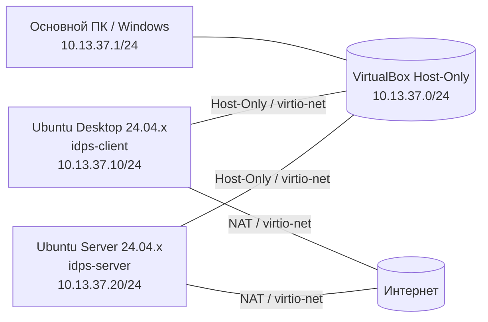

# Подготовка лабораторной среды

<div class="chapter-lead">
<p>Все практические работы курса используют один и тот же стенд из двух виртуальных машин. На этом этапе вы не «проходите отдельную лабораторную», а собираете базовую инфраструктуру, к которой затем будут подключаться разные сценарии.</p>
</div>

После настройки схема должна выглядеть так:



У каждой VM два независимых сетевых пути. NAT нужен для `apt`, репозиториев и обычного доступа в Интернет. Host-Only образует учебную сеть `10.13.37.0/24`, по которой взаимодействуют основной ПК, `idps-client` и `idps-server`. У Host-Only нет собственного default gateway: маршрут по умолчанию остаётся только через NAT.

## Что понадобится

| Компонент | `idps-client` | `idps-server` |
|---|---|---|
| ОС | Ubuntu Desktop 24.04.x LTS | Ubuntu Server 24.04.x LTS |
| vCPU | 2 | 2 |
| RAM | 4 ГБ рекомендуется, 2 ГБ минимум | 4 ГБ рекомендуется, 2 ГБ минимум |
| Диск | 25+ ГБ, динамический | 20+ ГБ, динамический |
| Сеть | NAT + Host-Only | NAT + Host-Only |

Для обеих сетевых карт используйте `Paravirtualized Network (virtio-net)`. На нашем стенде эмулируемый `Intel PRO/1000 (e1000)` приводил к `e1000_watchdog`, RCU stalls и soft lockup, поэтому он не используется в базовой конфигурации курса.

[Скачать пакет подготовки среды v1.2 (tar.gz)](../../assets/downloads/idps-environment-setup-v1.2.tar.gz){ .md-button .md-button--primary }
[ZIP-версия](../../assets/downloads/idps-environment-setup-v1.2.zip){ .md-button }

Пакет содержит bootstrap-скрипты для клиента и сервера, два checker-скрипта и `show-network-candidates.sh`. Bootstrap устанавливает нужные инструменты; checker ничего не исправляет автоматически и используется только как независимая проверка готовности.

## Виртуальные машины и сеть VirtualBox

Создайте две отдельные VM:

| VM | Роль | Адрес Host-Only |
|---|---|---|
| `IDPS-Client` | рабочее место студента, браузер, генерация запросов | `10.13.37.10/24` |
| `IDPS-Server` | Suricata, Linux Audit и учебные сервисы | `10.13.37.20/24` |

Не клонируйте одну готовую VM в две роли. Клиент и сервер должны быть отдельными установками: так меньше скрытых совпадений конфигурации и проще понимать, где именно выполняется каждое действие.

В VirtualBox создайте или выберите Host-Only network `10.13.37.0/24`. На основном Windows-хосте Host-Only интерфейс должен иметь `10.13.37.1/24`, DHCP для этой сети выключен. Проверить адрес можно в PowerShell:

```powershell
Get-NetIPAddress -AddressFamily IPv4 |
  Where-Object {$_.IPAddress -like "10.13.37.*"} |
  Format-Table InterfaceAlias,IPAddress,PrefixLength
```

Для **Adapter 1** обеих VM оставьте `Attached to: NAT`, выберите `Paravirtualized Network (virtio-net)` и включите `Cable Connected`.

Для **Adapter 2** обеих VM выберите тот же Host-Only Adapter/Network, `Paravirtualized Network (virtio-net)` и `Cable Connected`.

Адреса `.10` и `.20` назначаются уже внутри Ubuntu, а не в свойствах виртуальной карты VirtualBox.

## Установка базовых инструментов

На свежей Ubuntu может не быть `unzip`, поэтому пакет подготовки доступен и как `tar.gz`. Если файл нужно скачать прямо из терминала, достаточно:

```bash
sudo apt update
sudo apt install -y wget ca-certificates
wget https://11ndra.github.io/spvo/assets/downloads/idps-environment-setup-v1.2.tar.gz
```

На `idps-client`:

```bash
cd ~
mkdir -p idps-environment-setup
tar -xzf idps-environment-setup-v1.2.tar.gz -C idps-environment-setup
cd idps-environment-setup
sudo bash bootstrap-client.sh
```

На `idps-server`:

```bash
cd ~
mkdir -p idps-environment-setup
tar -xzf idps-environment-setup-v1.2.tar.gz -C idps-environment-setup
cd idps-environment-setup
sudo bash bootstrap-server.sh
```

Серверный bootstrap устанавливает Suricata, Linux Audit (`auditd`), `tcpdump`, `jq`, `curl`, Python 3, `ethtool` и OpenSSH Server. Системный сервис Suricata после установки останавливается и отключается: в лабораторных мы будем запускать отдельный процесс вручную на конкретном интерфейсе.

Проверьте это сразу:

```bash
systemctl is-active suricata || true
systemctl is-enabled suricata || true
```

Нормальное состояние перед лабораторными:

```text
inactive
disabled
```

## Имена узлов и роли

На клиенте:

```bash
sudo hostnamectl set-hostname idps-client
```

На сервере:

```bash
sudo hostnamectl set-hostname idps-server
```

Нижний регистр рекомендуется ради единообразия. Если узел уже называется `IDPS-client` или `IDPS-server`, это не ломает стенд: checker v1.2 сравнивает hostname без учёта регистра.

## Как отличить NAT от Host-Only

На каждой VM выполните:

```bash
cd ~/idps-environment-setup
bash show-network-candidates.sh
```

Идея проверки проста: интерфейс, через который проходит `default`, относится к NAT. Второй Ethernet-интерфейс используется для Host-Only сети. На типичном VirtualBox-стенде результат выглядит так:

```text
lo       UNKNOWN  127.0.0.1/8
enp0s3   UP       10.0.2.15/24     ← NAT
enp0s8   UP                         ← Host-Only / IDPS-LAB
```

Имя `enp0s8` — пример, а не обязательное значение. В следующих лабораторных всегда ориентируйтесь на адрес `10.13.37.10/24` или `10.13.37.20/24`, а не на номер интерфейса.

## Адрес `idps-client`

На Ubuntu Desktop откройте параметры второго проводного подключения и задайте IPv4 вручную:

| Поле | Значение |
|---|---|
| Address | `10.13.37.10` |
| Netmask / Prefix | `255.255.255.0` / `/24` |
| Gateway | пусто |
| DNS | пусто |

После применения проверьте:

```bash
ip -br -4 addr
ip route
```

Нужны три факта: на Host-Only интерфейсе есть `10.13.37.10/24`, маршрут `10.13.37.0/24` идёт через него, а единственный `default` остаётся через NAT.

## Адрес `idps-server`

На сервере сначала посмотрите текущую конфигурацию:

```bash
ip -br link
ip route show default
ls -la /etc/netplan/
sudo cat /etc/netplan/*.yaml
```

Предположим, Host-Only интерфейс называется `enp0s8`. Создайте отдельный файл `/etc/netplan/99-idps-lab.yaml` только для учебной сети:

```yaml
network:
  version: 2
  ethernets:
    enp0s8:
      dhcp4: false
      dhcp6: false
      addresses:
        - 10.13.37.20/24
      optional: true
```

Если у вас другое имя интерфейса, замените `enp0s8` на фактическое. Gateway и DNS здесь не задаются.

Проверка и применение:

```bash
sudo chmod 600 /etc/netplan/99-idps-lab.yaml
sudo netplan generate
sudo netplan try
sudo netplan apply
ip -br -4 addr
ip route
```

Правильная маршрутизация выглядит концептуально так:

```text
10.13.37.0/24  → Host-Only
0.0.0.0/0      → NAT
```

Второй default route через Host-Only создавать нельзя.

## Ручная проверка связности

С клиента к серверу:

```bash
ping -c 4 10.13.37.20
curl -I https://example.com
```

С сервера к клиенту и в Интернет:

```bash
ping -c 4 10.13.37.10
ping -c 4 8.8.8.8
getent ahostsv4 archive.ubuntu.com | head
```

Здесь мы проверяем два разных свойства. Ping между `.10` и `.20` доказывает связность учебной сети. Доступ в Интернет и DNS отдельно подтверждают, что NAT-маршрут сохранился.

## SSH с основного ПК

На сервере убедитесь, что OpenSSH запущен и слушает TCP/22:

```bash
systemctl status ssh --no-pager
sudo ss -lntp | grep ':22'
```

С Windows-хоста:

```powershell
ssh <ваш_пользователь>@10.13.37.20
```

Этот путь нужен не для трафика лабораторных, а для удобного управления сервером с основного компьютера.

## Финальная автоматическая проверка

На клиенте:

```bash
cd ~/idps-environment-setup
bash check-client-environment.sh
```

На сервере:

```bash
cd ~/idps-environment-setup
sudo bash check-server-environment.sh
```

Успешный финал:

```text
CLIENT ENVIRONMENT READY
SERVER ENVIRONMENT READY
```

Checker v1.2 дополнительно проверяет, что обе виртуальные NIC работают через `virtio_net`, учебный маршрут идёт через Host-Only, default route единственный и относится к NAT, Suricata `inactive/disabled`, Linux Audit включён, а SSH на сервере доступен на TCP/22.

## Что должно остаться в голове

После подготовки вам не нужно запоминать номера интерфейсов. Нужно понимать две роли сети: NAT обеспечивает внешний доступ, Host-Only создаёт контролируемую учебную среду. `10.13.37.10` принадлежит клиенту, `10.13.37.20` — серверу, `10.13.37.1` — основному ПК. Все дальнейшие лабораторные наследуют эту схему и не требуют пересоздавать VM.
