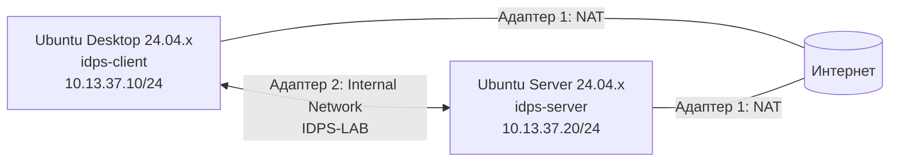

# Подготовка лабораторной среды

<div class="chapter-lead">
<p>Перед первой лабораторной студент самостоятельно поднимает базовый стенд из двух виртуальных машин. Это не отдельная «работа ради установки Ubuntu», а подготовка инфраструктуры, с которой затем будут выполняться все первые эксперименты курса.</p>
</div>

!!! note "Зачем это делаем самостоятельно"
    В реальной работе готовая лаборатория существует далеко не всегда. Специалисту приходится развернуть узлы, связать их сетью, установить необходимые инструменты и только затем переходить к анализу. Поэтому курс не скрывает этот этап, но и не превращает его в отдельную дисциплину по администрированию Linux.

После подготовки стенд должен иметь следующий вид:



**NAT** используется только для установки пакетов и доступа к документации.  
**IDPS-LAB** — отдельная учебная сеть, в которой проводятся эксперименты.

---

## 1. Что понадобится

Подходят актуальные установки Ubuntu ветки 24.04 LTS. Для текущего стенда можно использовать, например:

- Ubuntu Desktop 24.04.x LTS;
- Ubuntu Server 24.04.x LTS;
- Oracle VirtualBox 7.0.x или совместимую более новую версию.

Рекомендуемые параметры одной виртуальной машины:

| Параметр | Ubuntu Desktop | Ubuntu Server |
|---|---:|---:|
| vCPU | 2 | 2 |
| RAM | 4 ГБ | 4 ГБ |
| Минимально допустимая RAM | 2 ГБ | 2 ГБ |
| Диск | 25+ ГБ, динамический | 20+ ГБ, динамический |

Если на физическом компьютере мало памяти, сначала уменьшайте RAM виртуальных машин, а не число сетевых адаптеров и не отключайте учебную сеть.

[Скачать пакет подготовки среды v1.0 (tar.gz)](../../assets/downloads/idps-environment-setup-v1.0.tar.gz){ .md-button .md-button--primary }
[ZIP-версия](../../assets/downloads/idps-environment-setup-v1.0.zip){ .md-button }

Пакет содержит:

```text
bootstrap-client.sh
bootstrap-server.sh
show-network-candidates.sh
check-client-environment.sh
check-server-environment.sh
```

`bootstrap-*` устанавливают необходимые пакеты.  
`check-*` ничего не исправляют автоматически: они проверяют, действительно ли среда готова.

---

## 2. Создайте две виртуальные машины

Создайте в VirtualBox две отдельные виртуальные машины:

```text
IDPS-Client  → Ubuntu Desktop 24.04.x
IDPS-Server  → Ubuntu Server 24.04.x
```

Установите Ubuntu обычным способом. При создании пользователя используйте учётную запись, которой разрешено выполнять `sudo`.

!!! important
    Не клонируйте одну уже установленную виртуальную машину в две роли. Ubuntu Desktop и Ubuntu Server должны быть отдельными установками. Это уменьшает количество скрытых совпадений конфигурации и делает стенд понятнее.

После первого запуска специально переходить на другую ветку релиза Ubuntu не требуется. Сначала добейтесь воспроизводимости стенда на установленной 24.04.x.

---

## 3. Настройте VirtualBox Network

**На обеих виртуальных машинах** откройте `Settings → Network`.

### Адаптер 1

```text
Enable Network Adapter: да
Attached to: NAT
Cable Connected: да
```

Он нужен для `apt` и доступа к Интернету.

### Адаптер 2

```text
Enable Network Adapter: да
Attached to: Internal Network
Name: IDPS-LAB
Cable Connected: да
```

Имя `IDPS-LAB` должно совпадать **символ в символ** на обеих VM.

На этом этапе статические IP-адреса ещё не назначаются.

<div class="lab-evidence">
<strong>Контрольная точка</strong>
<p>У каждой виртуальной машины должны быть два виртуальных сетевых адаптера: NAT и Internal Network <code>IDPS-LAB</code>.</p>
</div>

---

## 4. Установите базовые инструменты

На свежей Ubuntu утилита `unzip` может отсутствовать, поэтому основной пакет подготовки распространяется как `tar.gz`: стандартный `tar` уже доступен в обычной установке Ubuntu.

Пакет можно скачать браузером на Ubuntu Desktop или передать на виртуальную машину любым доступным способом. Если хотите скачать его прямо из терминала, сначала достаточно минимального инструмента загрузки:

```bash
sudo apt update
sudo apt install -y wget ca-certificates
wget https://11ndra.github.io/spvo/assets/downloads/idps-environment-setup-v1.0.tar.gz
```

### Ubuntu Desktop

```bash
cd ~
mkdir -p idps-environment-setup
tar -xzf idps-environment-setup-v1.0.tar.gz -C idps-environment-setup
cd idps-environment-setup
sudo bash bootstrap-client.sh
```

Скрипт установит в том числе `curl`, `jq`, `tcpdump`, `unzip`, `iproute2` и `ping`.

### Ubuntu Server

```bash
cd ~
mkdir -p idps-environment-setup
tar -xzf idps-environment-setup-v1.0.tar.gz -C idps-environment-setup
cd idps-environment-setup
sudo bash bootstrap-server.sh
```

Скрипт устанавливает необходимый минимум, включая:

```text
Suricata
Linux Audit (auditd)
tcpdump
jq
curl
Python 3
ethtool
OpenSSH Server
```

Системный сервис Suricata после установки останавливается намеренно: в лабораторных студент будет запускать Suricata вручную на конкретном учебном интерфейсе.

!!! warning
    Для выполнения `apt` и установки Suricata нужен доступ в Интернет через NAT. Если университетская сеть ограничивает репозитории, преподаватель должен заранее предоставить локальный пакет/образ либо готовые VM.

---

## 5. Задайте имена узлов

На Ubuntu Desktop:

```bash
sudo hostnamectl set-hostname idps-client
```

На Ubuntu Server:

```bash
sudo hostnamectl set-hostname idps-server
```

Перезапустите терминал или виртуальную машину, чтобы приглашение оболочки отображало новое имя.

Имя узла не используется как доказательство сетевой связности — это только удобное обозначение системы.

---

## 6. Найдите учебный сетевой интерфейс

На **каждой** VM выполните:

```bash
cd ~/idps-environment-setup
bash show-network-candidates.sh
```

Скрипт покажет:

- все интерфейсы;
- текущие IPv4-адреса;
- интерфейс, через который проходит маршрут `default`.

Обычно интерфейс, через который проходит маршрут по умолчанию (`default`), относится к NAT. Второй Ethernet-интерфейс является кандидатом на `IDPS-LAB`.

Пример:

```text
lo       UNKNOWN  127.0.0.1/8
enp0s3   UP       10.0.2.15/24     ← NAT
enp0s8   UP                         ← IDPS-LAB
```

!!! important
    Не копируйте имя `enp0s8` вслепую. У вашей VM оно может отличаться. Сначала определите интерфейс по фактической конфигурации.

---

## 7. Настройте адрес Ubuntu Desktop

На клиенте учебный интерфейс должен получить:

```text
10.13.37.10/24
Gateway: пусто
DNS: пусто
```

Для Ubuntu Desktop проще всего использовать графический интерфейс:

1. `Settings → Network`;
2. откройте параметры **второго** проводного подключения;
3. `IPv4 → Manual`;
4. Address: `10.13.37.10`;
5. Netmask: `255.255.255.0`;
6. Gateway оставить пустым;
7. DNS оставить пустым;
8. применить настройки и переподключить интерфейс.

После этого:

```bash
ip -br -4 addr
```

должен показывать `10.13.37.10/24` на учебном интерфейсе.

Не назначайте `10.13.37.10` NAT-интерфейсу.

---

## 8. Настройте адрес Ubuntu Server

На сервере сначала определите имя второго интерфейса:

```bash
ip -br link
ip route show default
```

Предположим, что учебный интерфейс действительно называется `enp0s8`. Создайте отдельный Netplan-файл:

```bash
sudo nano /etc/netplan/60-idps-lab.yaml
```

Содержимое:

```yaml
network:
  version: 2
  ethernets:
    enp0s8:
      dhcp4: false
      dhcp6: false
      addresses:
        - 10.13.37.20/24
```

Замените `enp0s8` на **ваше реальное имя интерфейса**.

Сначала безопасно проверьте конфигурацию:

```bash
sudo netplan try
```

Если всё работает, подтвердите её и затем выполните:

```bash
sudo netplan apply
ip -br -4 addr
```

Ожидаемый результат — адрес `10.13.37.20/24` на интерфейсе IDPS-LAB.

!!! danger
    Не добавляйте второй маршрут по умолчанию (`default gateway`) для сети `10.13.37.0/24`. Выход в Интернет должен оставаться через NAT-интерфейс.

---

## 9. Проверьте связь вручную

С клиента:

```bash
ping -c 3 10.13.37.20
```

С сервера:

```bash
ping -c 3 10.13.37.10
```

Если ICMP не проходит, **не переходите к ЛР №1**. Сначала исправьте сеть.

Минимальная цепочка диагностики:

```text
оба адаптера включены?
        ↓
на обеих виртуальных машинах внутренняя сеть называется IDPS-LAB?
        ↓
назначены 10.13.37.10/24 и 10.13.37.20/24?
        ↓
интерфейсы UP?
        ↓
только после этого проверяем firewall ОС
```

---

## 10. Запустите автоматическую проверку готовности

### На клиенте

```bash
cd ~/idps-environment-setup
bash check-client-environment.sh | tee ~/idps-client-environment-check.txt
```

Финальный статус должен быть:

```text
CLIENT ENVIRONMENT READY
```

### На сервере

```bash
cd ~/idps-environment-setup
sudo bash check-server-environment.sh | tee ~/idps-server-environment-check.txt
```

Финальный статус должен быть:

```text
SERVER ENVIRONMENT READY
```

Проверяются не только IP-адреса, но и наличие инструментов, связь между виртуальными машинами, состояние Linux Audit и базовая конфигурация Suricata.

<div class="lab-evidence">
<strong>Граница готовности</strong>
<p>К ЛР №1 можно переходить только тогда, когда обе проверки завершаются статусом <code>READY</code>. Сам факт того, что две виртуальные машины Ubuntu запускаются, ещё не означает готовность лабораторной среды.</p>
</div>

---

## 11. Что студент должен понимать после подготовки

Подготовка среды считается полезной только если студент может объяснить:

- зачем виртуальные машины имеют **два** адаптера;
- почему NAT и `IDPS-LAB` выполняют разные задачи;
- где находится адрес `10.13.37.10`, а где `10.13.37.20`;
- почему наличие `ping` ещё ничего не говорит о работе IDS;
- зачем до лаборатории отдельно проверяются Suricata и Linux Audit;
- почему последующие лаборатории используют один и тот же базовый стенд вместо создания новых виртуальных машин каждую неделю.

После этого студент не просто получает «магический готовый стенд», а знает, из каких минимальных частей он собран.

---

## 12. Если преподаватель выдаёт готовые образы

Этот вариант остаётся допустимым, например при нехватке времени на первой паре.

В таком случае студент импортирует две OVA/готовые виртуальные машины и **всё равно** выполняет пункты 6, 9 и 10: определяет интерфейсы, проверяет связность и запускает `check-*`.

Готовый образ не отменяет проверку среды.

---

## Результат

Перед переходом к [ЛР №1](../lab01/) инфраструктура должна соответствовать схеме:

```text
                    Интернет
                  через NAT
                  ▲       ▲
                  │       │
        ┌─────────┘       └─────────┐
        │                           │
 idps-client                   idps-server
 Ubuntu Desktop                Ubuntu Server
 10.13.37.10                   10.13.37.20
        │                           │
        └──────── IDPS-LAB ─────────┘
               10.13.37.0/24
```

Следующий шаг — не установка ещё одного инструмента, а первый эксперимент: **доказать сетевую видимость и получить первое оповещение NIDS**.
