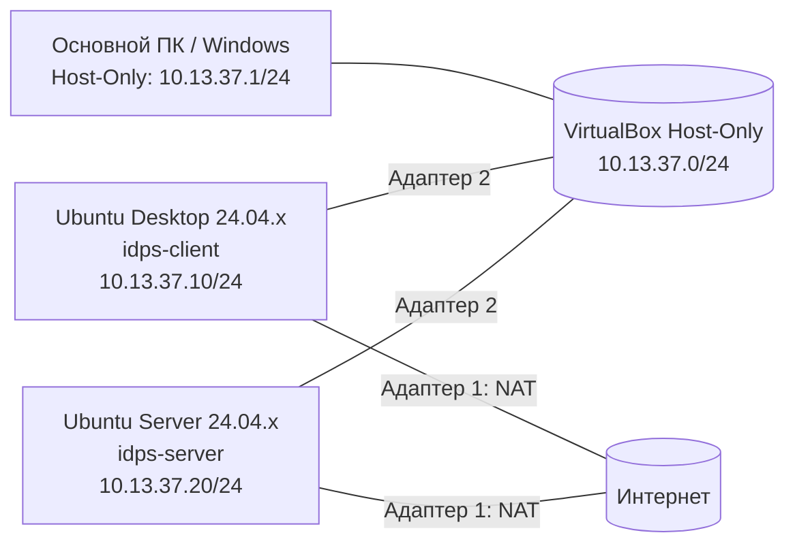

# Подготовка лабораторной среды

<div class="chapter-lead">
<p>Перед первой лабораторной студент самостоятельно поднимает базовый стенд из двух виртуальных машин. Это не отдельная «работа ради установки Ubuntu», а подготовка инфраструктуры, с которой затем будут выполняться все первые эксперименты курса.</p>
</div>

!!! note "Зачем это делаем самостоятельно"
    В реальной работе готовая лаборатория существует далеко не всегда. Специалисту приходится развернуть узлы, связать их сетью, установить необходимые инструменты и только затем переходить к анализу. Поэтому курс не скрывает этот этап, но и не превращает его в отдельную дисциплину по администрированию Linux.

После подготовки стенд должен иметь следующий вид:



**NAT** используется для установки пакетов и доступа в Интернет.  
**Host-Only `10.13.37.0/24`** — учебная сеть между основным ПК и двумя VM. Она позволяет управлять стендом с хоста и одновременно не подменяет NAT-маршрут в Интернет.

---

## 1. Что понадобится

Подходят актуальные установки Ubuntu ветки 24.04 LTS. Для текущего стенда можно использовать, например:

- Ubuntu Desktop 24.04.x LTS;
- Ubuntu Server 24.04.x LTS;
- Oracle VirtualBox 7.0.x или совместимую более новую версию.

Рекомендуемые параметры одной виртуальной машины:

| Параметр | Ubuntu Desktop | Ubuntu Server |
|---|---:|---:|
| vCPU | 2 | 2 |
| RAM | 4 ГБ | 4 ГБ |
| Минимально допустимая RAM | 2 ГБ | 2 ГБ |
| Диск | 25+ ГБ, динамический | 20+ ГБ, динамический |

Если на физическом компьютере мало памяти, сначала уменьшайте RAM виртуальных машин, а не число сетевых адаптеров и не отключайте учебную сеть.

[Скачать пакет подготовки среды v1.1 (tar.gz)](../../assets/downloads/idps-environment-setup-v1.1.tar.gz){ .md-button .md-button--primary }
[ZIP-версия](../../assets/downloads/idps-environment-setup-v1.1.zip){ .md-button }

Пакет содержит:

```text
bootstrap-client.sh
bootstrap-server.sh
show-network-candidates.sh
check-client-environment.sh
check-server-environment.sh
```

`bootstrap-*` устанавливают необходимые пакеты.  
`check-*` ничего не исправляют автоматически: они проверяют, действительно ли среда готова.

---

## 2. Создайте две виртуальные машины

Создайте в VirtualBox две отдельные виртуальные машины:

```text
IDPS-Client  → Ubuntu Desktop 24.04.x
IDPS-Server  → Ubuntu Server 24.04.x
```

Установите Ubuntu обычным способом. При создании пользователя используйте учётную запись, которой разрешено выполнять `sudo`.

!!! important
    Не клонируйте одну уже установленную виртуальную машину в две роли. Ubuntu Desktop и Ubuntu Server должны быть отдельными установками. Это уменьшает количество скрытых совпадений конфигурации и делает стенд понятнее.

После первого запуска специально переходить на другую ветку релиза Ubuntu не требуется. Сначала добейтесь воспроизводимости стенда на установленной 24.04.x.

---

## 3. Настройте VirtualBox Network

Сначала создайте или выберите в VirtualBox сеть **Host-Only**. Названия пунктов интерфейса могут немного отличаться между версиями VirtualBox; важен итоговый адресный план.

На основном ПК Host-Only-интерфейс должен иметь:

```text
IPv4: 10.13.37.1/24
DHCP: выключен
```

На Windows проверьте это в PowerShell:

```powershell
Get-NetIPAddress -AddressFamily IPv4 |
  Where-Object {$_.IPAddress -like "10.13.37.*"} |
  Format-Table InterfaceAlias,IPAddress,PrefixLength
```

Ожидается один Host-Only-адрес `10.13.37.1/24`. Адреса `10.13.37.10` и `10.13.37.20` на основном ПК использовать нельзя: они зарезервированы за VM.

**На обеих виртуальных машинах** откройте `Settings → Network`.

### Адаптер 1

```text
Enable Network Adapter: да
Attached to: NAT
Adapter Type: Paravirtualized Network (virtio-net)
Cable Connected: да
```

Он нужен для `apt`, репозиториев и доступа в Интернет.

### Адаптер 2

```text
Enable Network Adapter: да
Attached to: Host-Only Adapter / Host-Only Network
Adapter/Network: тот же Host-Only-интерфейс с сетью 10.13.37.0/24
Adapter Type: Paravirtualized Network (virtio-net)
Cable Connected: да
```

На этом этапе адреса `.10` и `.20` ещё не назначаются внутри гостевых ОС.

<div class="lab-evidence">
<strong>Контрольная точка</strong>
<p>У каждой VM два адаптера: NAT и Host-Only; оба используют <code>Paravirtualized Network (virtio-net)</code>. На основном ПК Host-Only имеет <code>10.13.37.1/24</code>, DHCP для учебной сети выключен.</p>
</div>

---

## 4. Установите базовые инструменты

На свежей Ubuntu утилита `unzip` может отсутствовать, поэтому основной пакет подготовки распространяется как `tar.gz`: стандартный `tar` уже доступен в обычной установке Ubuntu.

Пакет можно скачать браузером на Ubuntu Desktop или передать на виртуальную машину любым доступным способом. Если хотите скачать его прямо из терминала, сначала достаточно минимального инструмента загрузки:

```bash
sudo apt update
sudo apt install -y wget ca-certificates
wget https://11ndra.github.io/spvo/assets/downloads/idps-environment-setup-v1.1.tar.gz
```

### Ubuntu Desktop

```bash
cd ~
mkdir -p idps-environment-setup
tar -xzf idps-environment-setup-v1.1.tar.gz -C idps-environment-setup
cd idps-environment-setup
sudo bash bootstrap-client.sh
```

Скрипт установит в том числе `curl`, `jq`, `tcpdump`, `unzip`, `iproute2` и `ping`.

### Ubuntu Server

```bash
cd ~
mkdir -p idps-environment-setup
tar -xzf idps-environment-setup-v1.1.tar.gz -C idps-environment-setup
cd idps-environment-setup
sudo bash bootstrap-server.sh
```

Скрипт устанавливает необходимый минимум, включая:

```text
Suricata
Linux Audit (auditd)
tcpdump
jq
curl
Python 3
ethtool
OpenSSH Server
```

В лабораторных системный экземпляр Suricata не должен запускаться автоматически: студент будет запускать отдельный процесс вручную на конкретном учебном интерфейсе. После bootstrap явно зафиксируйте это состояние:

```bash
sudo systemctl disable --now suricata
systemctl is-active suricata || true
systemctl is-enabled suricata || true
```

Нормальный результат перед лабораториями:

```text
inactive
disabled
```

!!! warning
    Для выполнения `apt` и установки Suricata нужен доступ в Интернет через NAT. Если университетская сеть ограничивает репозитории, преподаватель должен заранее предоставить локальный пакет/образ либо готовые VM.

---

## 5. Задайте имена узлов

На Ubuntu Desktop:

```bash
sudo hostnamectl set-hostname idps-client
```

На Ubuntu Server:

```bash
sudo hostnamectl set-hostname idps-server
```

Перезапустите терминал или виртуальную машину, чтобы приглашение оболочки отображало новое имя.

Рекомендуется использовать именно нижний регистр. Если узел уже называется `IDPS-client` или `IDPS-server`, это функционально эквивалентно для стенда и само по себе не является причиной переделывать VM.

Имя узла не используется как доказательство сетевой связности — это только удобное обозначение системы.

---

## 6. Найдите учебный сетевой интерфейс

На **каждой** VM выполните:

```bash
cd ~/idps-environment-setup
bash show-network-candidates.sh
```

Скрипт покажет:

- все интерфейсы;
- текущие IPv4-адреса;
- интерфейс, через который проходит маршрут `default`.

Обычно интерфейс, через который проходит маршрут по умолчанию (`default`), относится к NAT. Второй Ethernet-интерфейс является кандидатом на Host-Only-сеть `10.13.37.0/24`.

Пример:

```text
lo       UNKNOWN  127.0.0.1/8
enp0s3   UP       10.0.2.15/24     ← NAT
enp0s8   UP                         ← Host-Only / IDPS-LAB
```

!!! important
    Не копируйте имя `enp0s8` вслепую. У вашей VM оно может отличаться. Сначала определите интерфейс по фактической конфигурации.

---

## 7. Настройте адрес Ubuntu Desktop

На клиенте Host-Only-интерфейс должен получить:

```text
10.13.37.10/24
Gateway: пусто
DNS: пусто
```

Для Ubuntu Desktop проще всего использовать графический интерфейс:

1. `Settings → Network`;
2. откройте параметры **второго** проводного подключения;
3. `IPv4 → Manual`;
4. Address: `10.13.37.10`;
5. Netmask: `255.255.255.0`;
6. Gateway оставить пустым;
7. DNS оставить пустым;
8. применить настройки и переподключить интерфейс.

После этого:

```bash
ip -br -4 addr
ip route
```

должны показывать `10.13.37.10/24` на Host-Only-интерфейсе, маршрут `10.13.37.0/24` через него и единственный `default` через NAT.

Не назначайте `10.13.37.10` NAT-интерфейсу и не задавайте gateway для Host-Only.

---

## 8. Настройте адрес Ubuntu Server

На сервере сначала определите имя второго интерфейса:

```bash
ip -br link
ip route show default
```

Предположим, что Host-Only-интерфейс действительно называется `enp0s8`. Сначала посмотрите существующие файлы и не переписывайте NAT-конфигурацию вслепую:

```bash
ls -la /etc/netplan/
sudo cat /etc/netplan/*.yaml
```

Создайте отдельный файл только для учебного интерфейса:

```bash
sudo nano /etc/netplan/99-idps-lab.yaml
```

Содержимое:

```yaml
network:
  version: 2
  ethernets:
    enp0s8:
      dhcp4: false
      dhcp6: false
      addresses:
        - 10.13.37.20/24
      optional: true
```

Замените `enp0s8` на **ваше реальное имя интерфейса**. Не задавайте здесь gateway или DNS.

Проверьте права и конфигурацию:

```bash
sudo chmod 600 /etc/netplan/99-idps-lab.yaml
sudo netplan generate
sudo netplan try
```

Если всё работает, подтвердите настройки и выполните:

```bash
sudo netplan apply
ip -br -4 addr
ip route
```

Ожидаемый результат — `10.13.37.20/24` на Host-Only-интерфейсе, маршрут `10.13.37.0/24` через него и единственный `default` через NAT.

!!! danger
    Не добавляйте второй маршрут по умолчанию (`default gateway`) для сети `10.13.37.0/24`. Выход в Интернет должен оставаться через NAT-интерфейс.

---

## 9. Проверьте связь вручную

С клиента:

```bash
ping -c 3 10.13.37.20
```

С сервера:

```bash
ping -c 3 10.13.37.10
```

Затем на **обеих VM** убедитесь, что NAT по-прежнему даёт доступ в Интернет и работает разрешение имён:

```bash
ping -c 3 8.8.8.8
getent hosts archive.ubuntu.com
ip route
```

Нормальная картина: `10.13.37.0/24` идёт через Host-Only, а единственный маршрут `default` — через NAT.

Если ICMP между VM не проходит или Host-Only получил маршрут `default`, **не переходите к Практикуму 0**. Сначала исправьте сеть.

Минимальная цепочка диагностики:

```text
оба адаптера включены?
        ↓
на обеих VM выбран один и тот же Host-Only Adapter?
        ↓
на хосте 10.13.37.1/24 и DHCP выключен?
        ↓
назначены 10.13.37.10/24 и 10.13.37.20/24?
        ↓
интерфейсы UP и default остаётся через NAT?
        ↓
только после этого проверяем firewall ОС
```

---

## 10. Проверьте SSH с основного ПК

`bootstrap-server.sh` устанавливает OpenSSH Server. Убедитесь, что служба включена:

```bash
sudo systemctl enable --now ssh
systemctl is-active ssh
sudo ss -ltnp | grep ':22'
```

На Windows проверьте TCP/22 через Host-Only:

```powershell
Test-NetConnection 10.13.37.20 -Port 22
ssh <имя_пользователя>@10.13.37.20
```

После входа на сервер:

```bash
echo "$SSH_CONNECTION"
```

В строке должны присутствовать адрес источника `10.13.37.1` и адрес сервера `10.13.37.20`. Это подтверждает именно management-path через Host-Only, а не доступ через NAT.

<div class="lab-evidence">
<strong>Контрольная точка</strong>
<p>С основного ПК открывается SSH-сессия к <code>10.13.37.20:22</code>. Этот шаг обязателен: дальнейшая работа с серверной VM может выполняться из нормального терминала хоста, без зависимости от VirtualBox Console или Shared Clipboard.</p>
</div>

---

## 11. Запустите автоматическую проверку готовности

### На клиенте

```bash
cd ~/idps-environment-setup
bash check-client-environment.sh | tee ~/idps-client-environment-check.txt
```

Финальный статус должен быть:

```text
CLIENT ENVIRONMENT READY
```

### На сервере

```bash
cd ~/idps-environment-setup
sudo bash check-server-environment.sh | tee ~/idps-server-environment-check.txt
```

Финальный статус должен быть:

```text
SERVER ENVIRONMENT READY
```

Проверяются не только IP-адреса, но и наличие инструментов, связь между виртуальными машинами, состояние Linux Audit, базовая конфигурация Suricata и соответствие поддерживаемой ветке Suricata 8.x.

<div class="lab-evidence">
<strong>Граница готовности</strong>
<p>К Практикуму 0 можно переходить только тогда, когда обе проверки завершаются статусом <code>READY</code>. Сам факт того, что две виртуальные машины Ubuntu запускаются, ещё не означает готовность лабораторной среды.</p>
</div>

---

## 12. Что студент должен понимать после подготовки

Подготовка среды считается полезной только если студент может объяснить:

- зачем виртуальные машины имеют **два** адаптера;
- почему NAT и Host-Only выполняют разные задачи;
- где находятся адреса `10.13.37.1`, `10.13.37.10` и `10.13.37.20`;
- почему наличие `ping` ещё ничего не говорит о работе IDS;
- зачем до лаборатории отдельно проверяются Suricata и Linux Audit;
- почему последующие лаборатории используют один и тот же базовый стенд вместо создания новых виртуальных машин каждую неделю.

После этого студент не просто получает «магический готовый стенд», а знает, из каких минимальных частей он собран.

---

## 13. Если преподаватель выдаёт готовые образы

Этот вариант остаётся допустимым, например при нехватке времени на первой паре.

В таком случае студент импортирует две OVA/готовые виртуальные машины и **всё равно** выполняет пункты 6, 9, 10 и 11: определяет интерфейсы, проверяет связность и запускает `check-*`.

Готовый образ не отменяет проверку среды.

---

## Результат

Перед переходом к [Практикуму 0 — знакомству с рабочей IDPS](../orientation/) инфраструктура должна соответствовать схеме:

```text
                    Интернет
                  через NAT
                  ▲       ▲
                  │       │
        ┌─────────┘       └─────────┐
        │                           │
 idps-client                   idps-server
 Ubuntu Desktop                Ubuntu Server
 10.13.37.10                   10.13.37.20
        │                           │
        └────── Host-Only ──────────┘
               10.13.37.0/24
                     │
               Windows host
               10.13.37.1
```

Следующий шаг — не новый эксперимент, а короткое знакомство с уже установленной системой: где находится конфигурация, как определяется интерфейс получения данных и куда Suricata записывает результаты.
