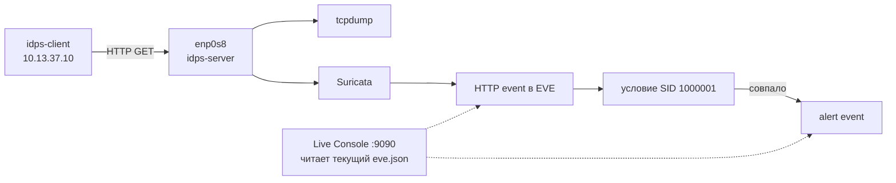
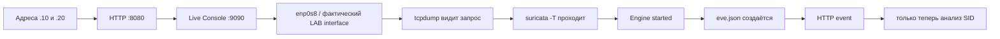

# Лабораторная работа №1 — Первое сетевое обнаружение

<div class="chapter-lead">
<p>Задача первой лабораторной — не «получить alert», а построить доказуемую цепочку от реального HTTP-запроса до конкретного события Suricata. Сначала вы подтверждаете сам поток, затем запускаете сенсор, проводите четыре контролируемых опыта и только после этого смотрите, почему правило дало именно такой результат.</p>
</div>

До начала должны быть завершены [подготовка лабораторной среды](../environment/) и [Практикум 0](../orientation/). Checker обеих VM должен завершаться статусами `CLIENT ENVIRONMENT READY` и `SERVER ENVIRONMENT READY`.

[Скачать пакет ЛР №1 v0.8.1](../../assets/downloads/idps-lab01-bundle-v0.8.1.zip){ .md-button .md-button--primary }

Работа идёт одновременно в нескольких окнах. Чтобы не гадать, где выполнять команду, используйте эту карту:

| Окно | Для чего используется |
|---|---|
| `idps-server` · SSH 1 | `tcpdump`, затем foreground-процесс Suricata |
| `idps-server` · SSH 2 | preflight, `suricata -T`, `jq`, просмотр журналов |
| `idps-client` · терминал | client check и ручной HTTP-запрос |
| `idps-client` · браузер | Live Console и четыре эксперимента |

## Развёртывание сценария

На `idps-server` во второй SSH-сессии:

```bash
cd ~
unzip idps-lab01-bundle-v0.8.1.zip
cd idps-lab01-bundle-v0.8.1
sudo bash server/setup-server.sh
sudo bash server/preflight-server.sh
```

Продолжайте только после:

```text
[ OK ] lab target is available on 10.13.37.20:8080
[ OK ] visual console is available on 10.13.37.20:9090
SERVER PRE-FLIGHT PASSED.
```

На `idps-client`:

```bash
cd ~
unzip idps-lab01-bundle-v0.8.1.zip
cd idps-lab01-bundle-v0.8.1
bash client/check-client.sh
```

Нужен `CLIENT CHECK PASSED.`

Порт `8080` принадлежит учебному HTTP-сервису. Порт `9090` — Live Console. Консоль не создаёт события сама: она показывает данные, полученные из артефактов текущего запуска Suricata.

## Сначала найдите точку наблюдения

На `idps-server`:

```bash
ip -br addr
ip route
```

Найдите интерфейс с адресом `10.13.37.20/24`. В типовой конфигурации курса это `enp0s8`. Дальнейшие команды показаны для `enp0s8`; если у вашей VM имя отличается, подставьте фактическое имя.

Почему мы начинаем именно с этого? Alert нельзя интерпретировать раньше, чем установлено, что нужный поток вообще доступен в выбранной точке наблюдения.

## Докажите наличие потока без IDS

На `idps-server` в SSH 1 запустите:

```bash
sudo tcpdump -nn -i enp0s8 'host 10.13.37.10 and tcp port 8080'
```

`tcpdump` здесь отвечает только на один вопрос: проходит ли нужный сетевой обмен через `enp0s8`. Фильтр оставляет взаимодействие учебного клиента `10.13.37.10` с TCP/8080; `-nn` сохраняет IP-адреса и номера портов в числовом виде.

Пока захват работает, на `idps-client` отправьте:

```bash
curl -sS http://10.13.37.20:8080/normal
```

В `tcpdump` должен появиться HTTP-обмен, включая `GET /normal`. После этого остановите только `tcpdump` через `Ctrl+C`.

Этот результат доказывает существование потока в выбранной точке. Он ещё ничего не говорит о Suricata, правиле или alert.

## Проверьте, что Suricata может загрузить конфигурацию и правило

На `idps-server` в SSH 2:

```bash
cd ~/idps-lab01-bundle-v0.8.1
sudo suricata -T \
  -c /etc/suricata/suricata.yaml \
  -S server/lab01.rules
```

Ожидается:

```text
Configuration provided was successfully loaded. Exiting.
```

`-T` выполняет тест конфигурации и завершает процесс. `-c` указывает основной `suricata.yaml`, а `-S` — отдельный учебный файл правил. Успешный результат означает только, что движок смог разобрать конфигурацию и правило. Трафик на этом шаге ещё не анализируется.

## Запустите сенсор

На `idps-server` в SSH 1:

```bash
cd ~/idps-lab01-bundle-v0.8.1
rm -rf "$HOME/lab01-output"
mkdir -p "$HOME/lab01-output"

sudo suricata \
  -k none \
  -c /etc/suricata/suricata.yaml \
  -S "$HOME/idps-lab01-bundle-v0.8.1/server/lab01.rules" \
  -i enp0s8 \
  -l "$HOME/lab01-output"
```

Нужен `Engine started.`. Оставьте процесс работающим в этой сессии.

Здесь `-i enp0s8` задаёт точку live-захвата, `-l` отделяет артефакты этой лаборатории от системных журналов, а `-k none` предотвращает отбрасывание учебного трафика из-за особенностей checksum/offloading в виртуальной среде.

Если в стандартном `suricata.yaml` вы видите пример `interface: eth0`, это не противоречит запуску на `enp0s8`. Интерфейс live-захвата явно передан через `-i`; если отдельного AF_PACKET-профиля для `enp0s8` нет, используются параметры `interface: default`.

## Что сейчас происходит под капотом



Это несколько разных уровней evidence. `tcpdump` подтверждает доступность потока в точке наблюдения. HTTP event показывает, что Suricata распознала и записала HTTP-транзакцию. Alert с SID связывает результат с конкретным правилом. `action` описывает действие движка в текущем режиме.

## Четыре опыта без просмотра условия правила

На `idps-client` откройте в браузере:

```text
http://10.13.37.20:9090
```

Панель должна показывать работающую Suricata и интерфейс текущего захвата.

Пока **не открывайте `server/lab01.rules`**. SID `1000001` — идентификатор подготовленного учебного правила; его условие мы намеренно посмотрим только после серии опытов. Перед каждым запросом Live Console просит спрогнозировать, появится ли alert с этим SID.

| Эксперимент | URI |
|---|---|
| A | `/normal` |
| B | `/ATTACK-LAB` |
| C | `/test/ATTACK-LAB` |
| D | `/attack-lab` |

Во всех опытах меняется только URI. После каждого запуска сначала смотрите, появился ли **HTTP event**, и только затем — появился ли SID `1000001`.

| Что видно | Что можно утверждать |
|---|---|
| HTTP event есть, SID нет | запрос наблюдался как HTTP, но это правило alert не сформировало |
| HTTP event есть, SID есть | запрос наблюдался и конкретное правило сформировало alert |
| HTTP event нет | сначала проверяйте доставку, точку наблюдения и работу сенсора; вывод о правиле делать рано |

После четырёх запросов сформулируйте собственную гипотезу: что общего у URI, для которых появился SID `1000001`.

## Теперь раскройте условие

После серии Live Console показывает две строки из того же `server/lab01.rules`, который был загружен через `-S`:

```text
http.uri;
content:"ATTACK-LAB";
```

`http.uri` выбирает представление URI, подготовленное HTTP-инспектором Suricata. Следующее условие работает именно с этим представлением. `content:"ATTACK-LAB"` ищет указанную последовательность символов внутри URI.

Результат четырёх опытов теперь объясняется без предположений:

| URI | Последовательность `ATTACK-LAB` | Ожидаемый SID 1000001 |
|---|---|---|
| `/normal` | нет | нет |
| `/ATTACK-LAB` | есть | есть |
| `/test/ATTACK-LAB` | есть внутри более длинного URI | есть |
| `/attack-lab` | другой регистр | нет |

В правиле нет `nocase`, поэтому регистр имеет значение. Важно не называть строки с совпадением «атаками»: правило проверяет конкретное условие над конкретным представлением данных.

## Проверьте тот же результат непосредственно в EVE

Live Console уже дала визуальное представление. Теперь на `idps-server` в SSH 2 посмотрите сырой источник:

```bash
tail -n 5 "$HOME/lab01-output/eve.json"
```

Каждая строка `eve.json` — отдельный JSON-объект. Чтобы не читать весь объект глазами, используем `jq` и задаём ему конкретный вопрос.

HTTP-события:

```bash
jq -c '
  select(.event_type=="http") |
  {timestamp, src_ip, dest_ip, url: .http.url, status: .http.status}
' "$HOME/lab01-output/eve.json"
```

Здесь `select()` оставляет только `event_type=http`, а объект после `|` сокращает вывод до нужных полей. В результате должны быть видны URI проведённых опытов.

Alerts нашего правила:

```bash
jq -c '
  select(.event_type=="alert" and .alert.signature_id==1000001) |
  {
    timestamp,
    src_ip,
    dest_ip,
    url: .http.url,
    sid: .alert.signature_id,
    signature: .alert.signature,
    action: .alert.action
  }
' "$HOME/lab01-output/eve.json"
```

Сопоставление с интерфейсом теперь прозрачно:

| Live Console | Поле EVE |
|---|---|
| Источник | `src_ip` |
| Назначение | `dest_ip` |
| URI | `http.url` |
| SID | `alert.signature_id` |
| Action | `alert.action` |

## Почему `action: allowed` не означает «безопасно»

В этой работе Suricata запущена как IDS. Для совпавшего правила `action: allowed` означает, что alert был сформирован, но запрос не блокировался текущим сценарием. Это поле описывает действие движка, а не смысловую оценку запроса.

## Сохраните evidence и корректно завершите процесс

В Live Console скачайте `lab01-evidence.json`. В нём должны быть сохранены состояние сенсора, сведения об учебном правиле, HTTP events проведённых опытов и соответствующие alerts.

После этого вернитесь в SSH 1 и нажмите `Ctrl+C` **один раз**. Дождитесь возврата обычной строки shell. Повторный `Ctrl+C` во время shutdown не нужен.

Финальные строки процесса можно посмотреть так:

```bash
tail -n 20 "$HOME/lab01-output/suricata.log"
```

Если вместо нормального завершения ядро сообщает `soft lockup` или `RCU stall`, это проблема состояния VM, а не ожидаемая часть лаборатории. В базовой среде курса обе виртуальные NIC должны использовать `virtio_net`.

## Какой вывод считается обоснованным

```text
tcpdump видит поток
    ↓
поток доступен в выбранной точке наблюдения

HTTP event есть в EVE
    ↓
Suricata зарегистрировала соответствующую HTTP-транзакцию

SID 1000001 есть
    ↓
конкретное учебное правило сформировало alert

HTTP event есть, SID 1000001 нет
    ↓
запрос наблюдался, но условие этого правила не выполнилось
```

Ни один из этих артефактов сам по себе не доказывает эксплуатацию или компрометацию системы.

## Что сдаётся

Используйте `report/lab01-report.md`. Достаточно компактного набора доказательств:

| Артефакт | Зачем он нужен |
|---|---|
| короткий фрагмент `tcpdump` | подтверждает видимость тестового потока |
| итоговая таблица четырёх URI | показывает контролируемое изменение входа и результата |
| один HTTP event и один alert event | связывает вывод с raw EVE |
| `lab01-evidence.json` | сохраняет результат визуального эксперимента |
| собственное объяснение закономерности | показывает понимание условия, а не копирование результата |

Весь `eve.json` и полный терминальный лог в отчёт вставлять не нужно.

## Если результат отличается от ожидаемого

Диагностируйте цепочку слева направо:


