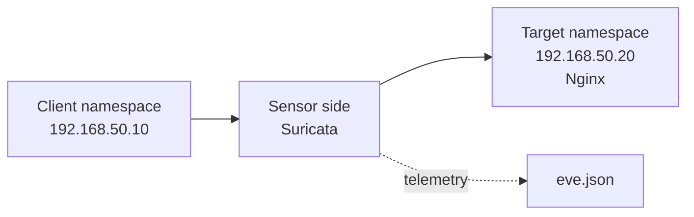

# Лабораторная работа №1

## Основы IDS/IPS и первое знакомство с Suricata

<div class="lab-header"><div><strong>Уровень:</strong> вводный</div><div><strong>Инструмент:</strong> Suricata</div><div><strong>Среда:</strong> IDPS LabBox</div></div>

## Результат обучения

После выполнения работы студент должен уметь объяснить назначение IDS и IPS, определить место NIDS в сети, установить Suricata, выполнить базовую конфигурацию, наблюдать нормальный трафик, создать правило, получить alert и найти событие в `eve.json`.


## Топология LabBox



Эта схема логическая: физически Client, Sensor и Target могут находиться внутри одной Ubuntu VM с использованием Linux network namespaces.


## Архитектура LabBox

```text
Client namespace
192.168.50.10
      ↓
Suricata Sensor
      ↓
Target namespace
192.168.50.20
```

## План практической части

1. Проверка среды.
2. Установка Suricata.
3. Настройка `HOME_NET`.
4. Нормальный HTTP baseline.
5. Первое пользовательское правило `/lab-test`.
6. Первый alert и `eve.json`.
7. Реалистичный безопасный Path Traversal pattern.
8. IDS → IPS.
9. Первый False Positive.

!!! warning "Статус"
    Практическая инструкция будет опубликована после сборки первой версии LabBox. Теоретическая подготовка и Pre-Lab Test уже готовы.


## Рабочие роли в лаборатории

=== "Sensor"

    Здесь студент:

    - устанавливает Suricata;
    - настраивает `HOME_NET`;
    - подключает `local.rules`;
    - анализирует `eve.json`.

    ```bash
    sudo tail -f /var/log/suricata/eve.json
    ```

=== "Client"

    Здесь генерируется контролируемый учебный трафик.

    ```bash
    curl http://target.lab/lab-test
    ```

=== "Target"

    Здесь работает тестовый локальный веб-сервис.

    ```bash
    systemctl status nginx
    ```

## Пример будущей конфигурации с аннотациями

```yaml
af-packet:
  - interface: eth0  # (1)!
    cluster-id: 99   # (2)!
    cluster-type: cluster_flow
    copy-mode: tap   # (3)!
    copy-iface: eth1 # (4)!
```

1. Интерфейс со стороны анализируемого сегмента.
2. Идентификатор AF_PACKET cluster; сопряжённые интерфейсы не должны использовать один и тот же `cluster-id`.
3. `tap` означает передачу трафика без применения блокирующего действия IPS.
4. Интерфейс, на который Suricata передаёт кадр в нашей лабораторной L2-схеме.

!!! warning
    Этот блок пока демонстрирует формат интерактивных пояснений. Финальные имена интерфейсов будут определены после сборки LabBox v0.1.
