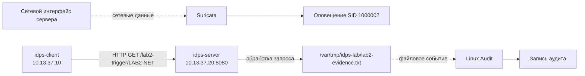

# Лабораторная работа №2

## Один эпизод — два источника данных

<div class="lab-header">
  <div><strong>Уровень:</strong> базовый</div>
  <div><strong>Инструменты:</strong> Suricata, Linux Audit, curl, jq</div>
  <div><strong>Среда:</strong> те же две VM, что и в ЛР №1</div>
</div>

<div class="chapter-lead">
<p>Один HTTP-запрос создаст два независимых следа: сетевое оповещение Suricata и хостовую запись Linux Audit. Задача — не просто получить два вывода, а объяснить, <strong>какие факты доступны каждому источнику</strong>.</p>
</div>
## Что необходимо до начала работы

Используется та же базовая среда, которую студент подготовил перед ЛР №1:

```text
idps-client   10.13.37.10   Ubuntu Desktop 24.04.x
idps-server   10.13.37.20   Ubuntu Server 24.04.x
```

Если VM были переустановлены или изменены после ЛР №1, повторно выполните проверки со страницы [«Подготовка лабораторной среды»](../environment/). На сервере должны быть доступны и работоспособны Suricata и Linux Audit (`auditd`, `auditctl`, `ausearch`).

ЛР №1 должна быть либо выполнена, либо сервер должен быть заново подготовлен скриптом из пакета ЛР №2.

[Скачать пакет ЛР №2 v0.5](../../assets/downloads/idps-lab02-bundle-v0.5.zip){ .md-button }

---

## 1. Подготовьте обе VM

На `idps-server`:

```bash
cd ~
unzip idps-lab02-bundle-v0.5.zip
cd idps-lab02-bundle-v0.5
sudo bash server/setup-server.sh
sudo bash server/preflight-server.sh
```

Продолжайте только при:

```text
SERVER PRE-FLIGHT PASSED.
```

На `idps-client`:

```bash
cd ~
unzip idps-lab02-bundle-v0.5.zip
cd idps-lab02-bundle-v0.5
bash client/check-client.sh
```

Продолжайте только при:

```text
CLIENT CHECK PASSED.
```

---

## 2. Что именно будет наблюдаться



Suricata и Linux Audit работают на одной VM, но используют **разные источники данных**.

---

## 3. Определите сетевой интерфейс

На `idps-server`:

```bash
LAB_IFACE=$(ip -o -4 addr show | awk '$4 ~ /^10\.13\.37\.20\// {print $2; exit}')
echo "$LAB_IFACE"
```

Переменная должна содержать имя интерфейса с адресом `10.13.37.20`. Если откроете новый терминал сервера, выполните эту команду в нём повторно.

---

## 4. Подготовьте Linux Audit

На `idps-server`:

```bash
sudo mkdir -p /var/tmp/idps-lab
sudo rm -f /var/tmp/idps-lab/lab2-evidence.txt
sudo auditctl -D -k idps_lab_host 2>/dev/null || true
```

Добавьте правило:

```bash
sudo auditctl \
  -a always,exit \
  -F arch=b64 \
  -F dir=/var/tmp/idps-lab/ \
  -F perm=wa \
  -F key=idps_lab_host
```

Проверьте:

```bash
sudo auditctl -l | grep idps_lab_host
```

Если строки нет — не переходите дальше.

---

## 5. Запустите Suricata

Сначала проверьте правило:

```bash
sudo suricata -T \
  -c /etc/suricata/suricata.yaml \
  -S server/lab02.rules
```

Затем:

```bash
sudo systemctl is-active --quiet suricata && sudo systemctl stop suricata || true
mkdir -p "$HOME/lab02-output"
rm -f "$HOME/lab02-output"/*

sudo suricata \
  -k none \
  -c /etc/suricata/suricata.yaml \
  -S "$HOME/idps-lab02-bundle-v0.5/server/lab02.rules" \
  -i "$LAB_IFACE" \
  -l "$HOME/lab02-output"
```

Оставьте процесс работающим.

В другом терминале сервера проверьте:

```bash
ls -l "$HOME/lab02-output/eve.json"
```

---

## 6. Выполните один контролируемый эпизод

На `idps-client` выполните **одну** команду:

```bash
curl -sS 'http://10.13.37.20:8080/lab2-trigger/LAB2-NET'
```

Ожидаемый ответ:

```text
LAB2 event created
file=/var/tmp/idps-lab/lab2-evidence.txt
```

Этот один запрос должен создать сетевой и хостовый след.

---

## 7. Получите сетевое подтверждение

На `idps-server`:

```bash
jq '
  select(.event_type=="alert" and .alert.signature_id==1000002)
  | {
      timestamp,
      src_ip,
      src_port,
      dest_ip,
      dest_port,
      signature: .alert.signature,
      sid: .alert.signature_id
    }
' "$HOME/lab02-output/eve.json"
```

Ожидаются `src_ip=10.13.37.10`, `dest_ip=10.13.37.20`, `dest_port=8080`, `sid=1000002`.

Из этого вывода можно сделать вывод о сетевой стороне эпизода. Из него самого нельзя установить, какой локальный файл изменило приложение.

---

## 8. Получите хостовое подтверждение

Проверьте файл:

```bash
sudo cat /var/tmp/idps-lab/lab2-evidence.txt
```

Затем:

```bash
sudo ausearch -k idps_lab_host -ts recent -i
```

Найдите событие, связанное с:

```text
/var/tmp/idps-lab/lab2-evidence.txt
```

В зависимости от версии `auditd` событие может состоять из нескольких связанных записей. Найдите как минимум путь, PID, имя/путь исполняемого процесса и результат операции, если он присутствует.

Из этой записи можно сделать вывод о локальной файловой операции. Сама эта запись не обязана сообщать IP удалённого клиента.

---

## 9. Сопоставьте два источника

Заполните таблицу в отчёте:

| Вопрос | Suricata | Linux Audit |
|---|---|---|
| Был ли HTTP-запрос от `10.13.37.10`? | | |
| Какой URI наблюдался? | | |
| Какой локальный файл изменён? | | |
| Какой процесс выполнил файловую операцию? | | |
| Можно ли одним источником доказать весь эпизод? | | |

Главный вывод работы:

```text
ОДИН ЭПИЗОД → РАЗНЫЕ СЛЕДЫ → РАЗНЫЕ ИСТОЧНИКИ ДАННЫХ
```

---

## 10. Что сдаётся

Используйте `report/lab02-report.md`. В отчёте должны быть сохранены исходные подтверждения из обоих источников и заполнена сравнительная таблица из раздела 9.

## Если что-то не работает

Проверяйте по цепочке:

```text
1. IP и связность двух VM
2. web-сервис :8080
3. LAB_IFACE
4. состояние auditd / auditctl -s
5. правило Linux Audit
6. suricata -T
7. eve.json
8. только затем — запрос /lab2-trigger/LAB2-NET
```
