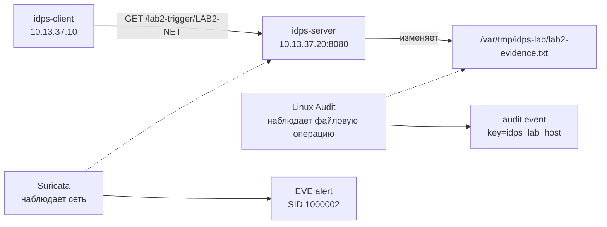
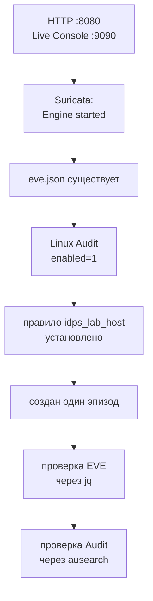

# Лабораторная работа №2 — Один эпизод, два источника данных

<div class="chapter-lead">
<p>В ЛР №1 один сетевой поток рассматривался через Suricata. Теперь тот же принцип evidence расширяется: один контролируемый HTTP-запрос оставит сетевой след в Suricata и хостовый след в Linux Audit. Цель — научиться связывать конкретный вопрос с конкретным источником и не требовать от одного артефакта того, чего он не наблюдает.</p>
</div>

Используются те же VM; пересоздавать их не нужно.

[Скачать пакет ЛР №2 v0.6.1](../../assets/downloads/idps-lab02-bundle-v0.6.1.zip){ .md-button .md-button--primary }

| Окно | Для чего используется |
|---|---|
| `idps-server` · SSH 1 | foreground-процесс Suricata |
| `idps-server` · SSH 2 | Linux Audit, preflight, `jq`, `ausearch` |
| `idps-client` · терминал | client check |
| `idps-client` · браузер | Live Console и запуск контролируемого эпизода |

## Какой эпизод мы собираемся наблюдать



Мы можем сопоставлять два следа не потому, что их timestamp похожи, а потому что сами создаём известную причинную цепочку: один конкретный запрос вызывает одну конкретную файловую операцию. В реальной инфраструктуре одной временной близости двух записей для такого вывода недостаточно.

## Развёртывание сценария

На `idps-server` в SSH 2:

```bash
cd ~
unzip idps-lab02-bundle-v0.6.1.zip
cd idps-lab02-bundle-v0.6.1
sudo bash server/setup-server.sh
sudo bash server/preflight-server.sh
```

Нужны два доступных сервиса и итог `SERVER PRE-FLIGHT PASSED.`. `setup-server.sh` обновляет только учебный сервис в `/opt/idps-lab`; базовая VM и результаты ЛР №1 не пересоздаются.

На `idps-client`:

```bash
cd ~
unzip idps-lab02-bundle-v0.6.1.zip
cd idps-lab02-bundle-v0.6.1
bash client/check-client.sh
```

Продолжайте после `CLIENT CHECK PASSED.`

## Подготовьте хостовый источник — Linux Audit

Suricata будет наблюдать сетевую сторону автоматически после запуска. Для хостовой стороны сначала нужно явно сказать Linux Audit, какую файловую область мы хотим контролировать.

На `idps-server` в SSH 2:

```bash
sudo mkdir -p /var/tmp/idps-lab
sudo rm -f /var/tmp/idps-lab/lab2-evidence.txt
sudo auditctl -D -k idps_lab_host 2>/dev/null || true

sudo auditctl \
  -a always,exit \
  -F arch=b64 \
  -F dir=/var/tmp/idps-lab/ \
  -F perm=wa \
  -F key=idps_lab_host
```

Правило не ищет «атаку». Оно просит audit subsystem фиксировать записи и изменения атрибутов в `/var/tmp/idps-lab/` и помечать соответствующие события ключом `idps_lab_host`.

| Фрагмент | Роль в этом эксперименте |
|---|---|
| `-a always,exit` | сформировать audit event при завершении подходящего syscall |
| `-F arch=b64` | использовать 64-битную таблицу syscall текущего стенда |
| `-F dir=/var/tmp/idps-lab/` | ограничить наблюдение учебным каталогом |
| `-F perm=wa` | интересуют запись и изменение атрибутов |
| `-F key=idps_lab_host` | дать событиям удобный поисковый ключ |

Проверьте состояние:

```bash
sudo auditctl -s
sudo auditctl -l -k idps_lab_host
```

В первом выводе нужен `enabled 1`, во втором — правило с `idps_lab_host`. Если правило не установлено до эпизода, последующее отсутствие audit-записи нельзя интерпретировать как отсутствие файловой операции.

## Подготовьте сетевой источник — Suricata

На сервере ещё раз посмотрите `ip -br addr` и найдите интерфейс с `10.13.37.20/24`. В типовой среде курса это `enp0s8`; команды ниже используют это имя как пример.

Сначала проверим файл правил:

```bash
cd ~/idps-lab02-bundle-v0.6.1
sudo suricata -T \
  -c /etc/suricata/suricata.yaml \
  -S server/lab02.rules
```

Успешный `-T` доказывает только, что конфигурация и `lab02.rules` разбираются движком.

Теперь в SSH 1 запустите live-процесс:

```bash
cd ~/idps-lab02-bundle-v0.6.1
rm -rf "$HOME/lab02-output"
mkdir -p "$HOME/lab02-output"

sudo suricata \
  -k none \
  -c /etc/suricata/suricata.yaml \
  -S "$HOME/idps-lab02-bundle-v0.6.1/server/lab02.rules" \
  -i enp0s8 \
  -l "$HOME/lab02-output"
```

После `Engine started.` оставьте SSH 1 открытой. Во второй сессии убедитесь, что появился EVE:

```bash
ls -l "$HOME/lab02-output/eve.json"
```

## Сделайте прогноз до запуска эпизода

На `idps-client` откройте:

```text
http://10.13.37.20:9090
```

Live Console должна показать два состояния: Suricata работает, а правило Linux Audit готово. Кнопка запуска недоступна, пока один из источников не подготовлен.

До запроса ответьте на два вопроса интерфейса: какой источник вы ожидаете использовать для удалённого IP и HTTP URI; какой — для локального пути и процесса файловой операции. Прогноз нужен не как тест на угадывание, а чтобы до появления результата связать **вопрос** с предполагаемым **источником evidence**.

## Создайте один контролируемый эпизод

Нажмите «Создать один контролируемый эпизод». Браузер отправит:

```text
GET /lab2-trigger/LAB2-NET
```

Сервер обработает запрос и изменит:

```text
/var/tmp/idps-lab/lab2-evidence.txt
```

После этого Live Console ищет два разных артефакта. Не оценивайте результат только по зелёному статусу — сравните поля.

| Вопрос | Suricata EVE | Linux Audit |
|---|---|---|
| Какой удалённый IP наблюдался? | `src_ip` | этот факт не следует из одной файловой audit-записи |
| Какой HTTP URI наблюдался? | `http.url` | этот факт не следует из одной файловой audit-записи |
| Какой локальный путь затронут? | из alert этого не следует | `PATH` / связанный audit record |
| Какой процесс связан с файловой операцией? | из alert этого не следует | PID, `exe`/`comm`, syscall |

Для сетевого артефакта ожидаются `10.13.37.10 → 10.13.37.20:8080`, URI `/lab2-trigger/LAB2-NET`, SID `1000002` и `action: allowed`.

Для хостового артефакта ожидается связь с `/var/tmp/idps-lab/lab2-evidence.txt`. В зависимости от представления Linux Audit один логический event может состоять из нескольких records — например `SYSCALL`, `PATH`, `CWD` и `PROCTITLE` — объединённых одним serial.

## Проверьте сетевой evidence без Live Console

На `idps-server` в SSH 2:

```bash
jq -c '
  select(.event_type=="alert" and .alert.signature_id==1000002) |
  {
    timestamp,
    src_ip,
    dest_ip,
    url: .http.url,
    sid: .alert.signature_id,
    action: .alert.action
  }
' "$HOME/lab02-output/eve.json"
```

`jq` уже знаком по ЛР №1: `select()` оставляет только alert нашего SID, а объект после `|` сокращает результат до полей, нужных для проверки сетевой стороны эпизода.

## Проверьте хостовый evidence через `ausearch`

Теперь новый инструмент:

```bash
sudo ausearch -k idps_lab_host -ts recent -i
```

`ausearch` ищет Linux Audit records по ключу `idps_lab_host`. Опция `-ts recent` ограничивает поиск недавними событиями, а `-i` преобразует часть числовых значений в более читаемое представление.

Не выбирайте одну случайную строку. Найдите связанный event и посмотрите на его serial, `PATH`, `SYSCALL`, PID, `exe`/`comm` и `success`, если эти поля присутствуют. Один serial объединяет несколько records, описывающих одну логическую audit-операцию.

## Граница вывода

Главный результат ЛР №2 можно выразить одной таблицей:

| Артефакт | Что он поддерживает | Чего из него самого не следует |
|---|---|---|
| EVE alert SID `1000002` | сетевой источник, назначение, HTTP URI, факт rule match | конкретный локальный файл и процесс его изменения |
| Linux Audit event `idps_lab_host` | локальный путь, процесс/PID, syscall, результат операции | удалённый сетевой источник и HTTP URI |

Мы связываем эти два артефакта с одним эпизодом, потому что эксперимент контролируемый. Это важнее, чем просто совпадение времени.

## Сохранение результата и завершение

В Live Console скачайте `lab02-evidence.json`. После этого вернитесь в SSH 1 и остановите Suricata одним `Ctrl+C`, дождавшись полного завершения.

Учебное audit-правило после сохранения evidence можно удалить:

```bash
sudo auditctl -D -k idps_lab_host
sudo auditctl -l -k idps_lab_host
```

После удаления правило `idps_lab_host` больше не должно отображаться. При обновлении Live Console оба источника должны вернуться в состояние «не готовы»: Suricata остановлена, audit-правило отсутствует.

## Что сдаётся

Используйте `report/lab02-report.md`.

| Артефакт | Что должен показать отчёт |
|---|---|
| прогноз до эксперимента | какой источник ожидался для каждого вопроса и почему |
| EVE alert SID `1000002` | сетевые поля контролируемого эпизода |
| связанный блок `ausearch` | локальный путь и процесс файловой операции |
| таблица границ источников | какие выводы поддерживает каждый артефакт |
| `lab02-evidence.json` | сохранённый результат Live Console |

## Если результат отличается от ожидаемого



Если один из двух артефактов отсутствует, сначала диагностируйте именно соответствующий источник. Отсутствие поля у одного источника не доказывает отсутствие факта в реальности.
