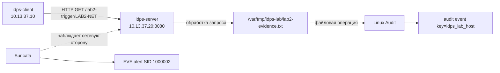

# Лабораторная работа №2

## Один эпизод — два источника данных

<div class="lab-header">
  <div><strong>Уровень:</strong> базовый</div>
  <div><strong>Инструменты:</strong> Suricata, Linux Audit, jq, ausearch, Live Console</div>
  <div><strong>Среда:</strong> те же две VM, что и в ЛР №1</div>
</div>

<div class="chapter-lead">
<p>В ЛР №1 вы доказали цепочку «трафик → HTTP event → условие правила → alert». Теперь задача меняется: один контролируемый HTTP-запрос оставит <strong>два разных артефакта</strong> — сетевой в Suricata и хостовый в Linux Audit. Цель работы — научиться отвечать не «какой источник лучше», а <strong>какой конкретный факт подтверждается каким конкретным источником и где заканчивается граница этого вывода</strong>.</p>
</div>

## Что должно быть готово

Используется постоянная лабораторная среда курса:

```text
idps-client   10.13.37.10/24
idps-server   10.13.37.20/24
```

До начала должны быть завершены [подготовка лабораторной среды](../environment/) и ЛР №1. Обе VM пересоздавать не нужно.

Перед работой студент уже должен понимать разницу между источником данных, наблюдаемым событием и результатом обнаружения. Для теоретической опоры используйте [Главу 2](../../course/02-classification/) и [Главу 3](../../course/03-detection/).

[Скачать пакет ЛР №2 v0.6](../../assets/downloads/idps-lab02-bundle-v0.6.zip){ .md-button .md-button--primary }

### Где выполнять команды

В работе одновременно используются две VM и несколько окон:

- **`idps-server` · SSH-сессия 1** — ручной процесс Suricata;
- **`idps-server` · SSH-сессия 2** — подготовка Linux Audit, проверки `jq` и `ausearch`;
- **`idps-client` · терминал** — client preflight;
- **`idps-client` · браузер** — Live Console и запуск контролируемого эпизода.

Если шаг переносится на другую VM или в другое окно, это указано явно.

---

## 1. Разверните сценарий ЛР №2

Пакет нужен на обеих VM. Он не перестраивает базовую среду: на сервере обновляется только учебный сервис в `/opt/idps-lab`, а результаты ЛР №2 сохраняются отдельно в `~/lab02-output/`.

**Где выполнять: `idps-server` · SSH-сессия 2.**

```bash
cd ~
rm -rf ~/idps-lab02-bundle-v0.6
unzip idps-lab02-bundle-v0.6.zip
cd ~/idps-lab02-bundle-v0.6

sudo bash server/setup-server.sh
sudo bash server/preflight-server.sh
```

Продолжайте только после:

```text
[ OK ] lab target is available on 10.13.37.20:8080
[ OK ] visual console is available on 10.13.37.20:9090
SERVER PRE-FLIGHT PASSED.
```

`setup-server.sh` намеренно **не добавляет** правило Linux Audit. В этой работе студент должен самостоятельно создать источник хостовой телеметрии и понимать, что именно он наблюдает.

Теперь переключитесь на клиент.

**Где выполнять: `idps-client` · терминал.**

```bash
cd ~
rm -rf ~/idps-lab02-bundle-v0.6
unzip idps-lab02-bundle-v0.6.zip
cd ~/idps-lab02-bundle-v0.6

bash client/check-client.sh
```

Продолжайте только после:

```text
CLIENT CHECK PASSED.
```

---

## 2. Сначала разберитесь, какой эпизод мы создаём

Во время эксперимента произойдёт одна контролируемая цепочка:



Почему здесь можно сопоставлять два следа? Потому что **мы сами создаём контролируемый эпизод**: заранее знаем запрос, серверный обработчик и файл, который он изменяет. В реальной инфраструктуре два события с близкими timestamp сами по себе ещё не доказывают причинную связь.

---

## 3. Подготовьте Linux Audit

Linux Audit — новый инструмент этой лаборатории. Его задача здесь не «искать атаку», а фиксировать локальную файловую операцию на сервере.

Сначала создадим каталог, который будем наблюдать, удалим результат предыдущего запуска и уберём старое правило с тем же учебным ключом.

**Где выполнять: `idps-server` · SSH-сессия 2.**

```bash
sudo mkdir -p /var/tmp/idps-lab
sudo rm -f /var/tmp/idps-lab/lab2-evidence.txt
sudo auditctl -D -k idps_lab_host 2>/dev/null || true
```

Теперь добавьте правило:

```bash
sudo auditctl \
  -a always,exit \
  -F arch=b64 \
  -F dir=/var/tmp/idps-lab/ \
  -F perm=wa \
  -F key=idps_lab_host
```

Что означает эта команда:

| Часть | Смысл |
|---|---|
| `-a always,exit` | проверять подходящие системные вызовы при их завершении и формировать audit event |
| `-F arch=b64` | использовать 64-битную таблицу системных вызовов текущего стенда |
| `-F dir=/var/tmp/idps-lab/` | ограничить наблюдение файловыми объектами внутри учебного каталога |
| `-F perm=wa` | интересуют запись (`w`) и изменение атрибутов (`a`) |
| `-F key=idps_lab_host` | добавить удобный поисковый ключ к создаваемым audit events |

Проверьте состояние подсистемы и наличие конкретного правила:

```bash
sudo auditctl -s
sudo auditctl -l -k idps_lab_host
```

В `auditctl -s` должно быть:

```text
enabled 1
```

А в списке правил должна присутствовать строка с:

```text
idps_lab_host
```

Практический смысл: пока правило не установлено, отсутствие записи Linux Audit ничего не говорит о том, была ли файловая операция. Сначала мы создаём механизм наблюдения, затем проводим эксперимент.

<div class="lab-evidence">
<strong>Контрольная точка 1</strong>
<p>Linux Audit включён, а правило с ключом <code>idps_lab_host</code> установлено до создания эпизода.</p>
</div>

---

## 4. Определите сетевую точку наблюдения

Suricata должна получать сетевую сторону того же эпизода с Host-Only-интерфейса сервера.

**Где выполнять: `idps-server` · SSH-сессия 2.**

```bash
LAB_IFACE=$(ip -o -4 addr show | awk '$4 ~ /^10\.13\.37\.20\/24$/ {print $2; exit}')
echo "$LAB_IFACE"
```

В текущем стенде обычно получится:

```text
enp0s8
```

Важно не имя `enp0s8`, а факт, что это интерфейс с адресом `10.13.37.20/24` в учебной сети.

---

## 5. Проверьте правило Suricata

Файл `server/lab02.rules` содержит подготовленное учебное правило с SID `1000002`. Сейчас мы проверяем только техническую возможность загрузить его; разбирать его условие для цели этой ЛР не требуется.

**Где выполнять: `idps-server` · SSH-сессия 2.**

```bash
cd ~/idps-lab02-bundle-v0.6

sudo suricata -T \
  -c /etc/suricata/suricata.yaml \
  -S server/lab02.rules
```

Ожидается:

```text
Configuration provided was successfully loaded. Exiting.
```

Это подтверждает корректность конфигурации и файла правил. Оно ещё не доказывает, что Suricata видит будущий HTTP-запрос.

---

## 6. Запустите Suricata

**Где выполнять: `idps-server` · SSH-сессия 1.**

```bash
cd ~/idps-lab02-bundle-v0.6

LAB_IFACE=$(ip -o -4 addr show | awk '$4 ~ /^10\.13\.37\.20\/24$/ {print $2; exit}')

rm -rf "$HOME/lab02-output"
mkdir -p "$HOME/lab02-output"

sudo suricata \
  -k none \
  -c /etc/suricata/suricata.yaml \
  -S "$HOME/idps-lab02-bundle-v0.6/server/lab02.rules" \
  -i "$LAB_IFACE" \
  -l "$HOME/lab02-output"
```

Ожидается:

```text
Engine started.
```

Оставьте эту SSH-сессию открытой. Suricata работает в foreground.

Теперь во второй серверной сессии убедитесь, что EVE создан:

**Где выполнять: `idps-server` · SSH-сессия 2.**

```bash
ls -l "$HOME/lab02-output/eve.json"
```

---

## 7. Откройте Live Console и сделайте прогноз

**Где выполнять: `idps-client` · браузер.**

Откройте:

```text
http://10.13.37.20:9090
```

В верхней части должны быть готовы оба источника:

```text
Suricata: работает
Linux Audit: правило готово
```

Если Linux Audit сообщает, что нужно добавить `idps_lab_host`, вернитесь к разделу 3. Если Suricata не запущена — вернитесь к разделу 6.

До запуска эпизода Live Console попросит сделать два прогноза:

```text
Какой источник должен подтвердить удалённый IP и HTTP URI?
Какой источник должен подтвердить локальный путь и процесс?
```

Зачем делать прогноз до запроса: вы заранее связываете **вопрос** с предполагаемым **источником**, а затем проверяете гипотезу реальными артефактами. Интерфейс не должен подменять эту мыслительную работу готовым ответом.

---

## 8. Создайте один контролируемый эпизод

После двух прогнозов нажмите в Live Console:

```text
Создать один контролируемый эпизод
```

Браузер отправит один запрос:

```text
GET /lab2-trigger/LAB2-NET
```

на `10.13.37.20:8080`. Сервер обработает его и запишет файл:

```text
/var/tmp/idps-lab/lab2-evidence.txt
```

После этого Live Console ищет **два отдельных артефакта**:

```text
Suricata     → EVE alert SID 1000002
Linux Audit  → event с key=idps_lab_host
```

Если оба найдены, сравните панели по полям, а не только по зелёному статусу.

### На что смотреть в Suricata

Ожидаются, как минимум:

```text
src_ip       10.13.37.10
dest_ip      10.13.37.20
dest_port    8080
http.url     /lab2-trigger/LAB2-NET
SID          1000002
action       allowed
```

Это поддерживает вывод о **наблюдаемой сетевой стороне** эпизода. Из этого alert самого по себе не следует локальный путь файла, изменённого приложением.

### На что смотреть в Linux Audit

Ожидается событие, связанное с:

```text
/var/tmp/idps-lab/lab2-evidence.txt
```

В нём ищите путь, PID, `exe` или `comm`, syscall и `success`, если эти поля присутствуют в вашей версии/представлении audit event.

Эта запись поддерживает вывод о **локальной файловой операции**. Из неё самой не следует удалённый IP `10.13.37.10`.

<div class="lab-evidence">
<strong>Контрольная точка 2</strong>
<p>Один контролируемый запрос дал два разных артефакта. Теперь задача — доказать те же факты без визуального слоя.</p>
</div>

---

## 9. Посмотрите сетевой evidence напрямую через `jq`

В ЛР №1 вы уже использовали `jq`, поэтому здесь подсказка короче.

**Где выполнять: `idps-server` · SSH-сессия 2.**

```bash
jq -c '
  select(.event_type=="alert" and .alert.signature_id==1000002) |
  {
    timestamp,
    src_ip,
    dest_ip,
    url: .http.url,
    sid: .alert.signature_id,
    action: .alert.action
  }
' "$HOME/lab02-output/eve.json"
```

Здесь `select(...)` оставляет только alert с нашим SID, а блок `{...}` сокращает большую EVE-запись до полей, которые нужны для ответа на конкретные сетевые вопросы.

Ожидается одна компактная запись с URI `/lab2-trigger/LAB2-NET` и SID `1000002`.

---

## 10. Посмотрите хостовый evidence через `ausearch`

`ausearch` — новый инструмент этой ЛР. Он ищет audit events по данным, которые собирает Linux Audit.

**Где выполнять: `idps-server` · SSH-сессия 2.**

```bash
sudo ausearch -k idps_lab_host -ts recent -i
```

Что здесь означает:

| Часть | Смысл |
|---|---|
| `-k idps_lab_host` | искать события по учебному ключу правила |
| `-ts recent` | ограничить поиск недавними событиями |
| `-i` | интерпретировать ряд числовых полей в более читаемый вид |

Linux Audit часто представляет **одно логическое событие несколькими records** с одним serial. Например, в связанном блоке могут встречаться записи типов `SYSCALL`, `PATH`, `CWD`, `PROCTITLE`. Не выбирайте одну строку случайно — рассматривайте связанный event как набор записей.

Найдите блок, где фигурирует:

```text
/var/tmp/idps-lab/lab2-evidence.txt
```

и сопоставьте его с панелью Live Console.

---

## 11. Сопоставьте границы двух источников

Заполните в отчёте таблицу:

| Вопрос | Suricata | Linux Audit |
|---|---|---|
| Удалённый IP клиента | | |
| HTTP URI | | |
| Локальный путь файла | | |
| Процесс / PID | | |
| Результат операции | | |

Главный смысл работы:

```text
ОДИН КОНТРОЛИРУЕМЫЙ ЭПИЗОД
          ↓
РАЗНЫЕ НАБЛЮДАЕМЫЕ ПРЕДСТАВЛЕНИЯ
          ↓
РАЗНЫЕ ИСТОЧНИКИ ДАННЫХ
          ↓
РАЗНЫЕ ДОПУСТИМЫЕ ВЫВОДЫ
```

Не формулируйте абсолюты вроде «Suricata ничего не знает о хосте» или «Linux Audit ничего не знает о сети». Корректнее: **конкретный артефакт, который мы рассматриваем в этой работе, не поддерживает данный вывод**.

---

## 12. Сохраните evidence и завершите работу

В Live Console нажмите:

```text
Скачать lab02-evidence.json
```

Файл объединяет данные для удобства сдачи, но сохраняет их раздельно как `network`, `audit` и `file`. Само объединение в один JSON не превращает два источника в один.

Теперь вернитесь в **`idps-server` · SSH-сессию 1**, где работает Suricata, и нажмите `Ctrl+C` **один раз**. Дождитесь, пока снова появится приглашение оболочки.

После сохранения всех материалов можно удалить временное правило Lab02:

**Где выполнять: `idps-server` · SSH-сессия 2.**

```bash
sudo auditctl -D -k idps_lab_host
sudo auditctl -l -k idps_lab_host
```

После удаления вторая команда не должна показывать правило `idps_lab_host`.

---

## 13. Что сдаётся

Используйте шаблон:

```text
report/lab02-report.md
```

Отчёт должен содержать прогноз, raw evidence из Suricata и Linux Audit, заполненную сравнительную таблицу и объяснение границ выводов.

## Если что-то не работает

Проверяйте цепочку сверху вниз:

```text
1. SERVER PRE-FLIGHT PASSED / CLIENT CHECK PASSED
2. Linux Audit: enabled 1
3. auditctl -l -k idps_lab_host показывает правило
4. LAB_IFACE соответствует 10.13.37.20/24
5. suricata -T проходит
6. Suricata показывает Engine started
7. Live Console видит оба источника как готовые
8. только после этого создаётся /lab2-trigger/LAB2-NET
9. затем отдельно проверяются eve.json и ausearch
```

Если один из источников не дал ожидаемый артефакт, не объявляйте автоматически, что соответствующего действия «не было». Сначала проверьте, был ли сам механизм наблюдения подготовлен и работал ли он в момент эксперимента.
