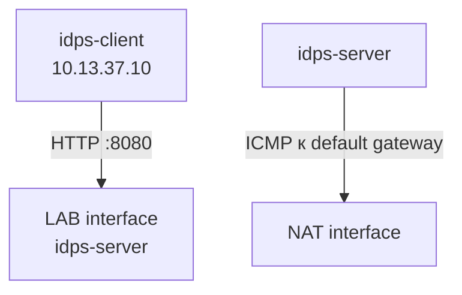

# Лабораторная работа №3 — Точка наблюдения

<div class="chapter-lead">
<p>Один и тот же сенсор не видит «всю сеть вообще». Он получает только тот трафик, который доступен выбранной точке захвата. В этой работе вы сравните два реальных пути на одном сервере: внутренний HTTP через Host-Only и исходящий ICMP через NAT.</p>
</div>

[Скачать пакет ЛР №3 v0.2](../../assets/downloads/idps-lab03-bundle-v0.2.zip){ .md-button .md-button--primary }



Ожидаем не «правильный» и «неправильный» интерфейс, а зеркальную картину: внутренний HTTP доступен на LAB interface и не появляется на NAT interface; исходящий ICMP к NAT gateway доступен на NAT interface и не появляется на LAB interface.

## Подготовка стенда

На `idps-server`:

```bash
cd ~
unzip idps-lab03-bundle-v0.2.zip
cd idps-lab03-bundle-v0.2
sudo bash server/setup-server.sh
sudo bash server/prepare-capture.sh
sudo bash server/preflight-server.sh
```

Продолжайте после `SERVER PRE-FLIGHT PASSED.`. `prepare-capture.sh` пытается уменьшить влияние offloading на внешний вид пакетов в виртуальном сетевом стеке. Глобальный `suricata.yaml` при этом не переписывается; live-запуски дополнительно используют `-k none`.

На `idps-client`:

```bash
cd ~
unzip idps-lab03-bundle-v0.2.zip
cd idps-lab03-bundle-v0.2
bash client/check-client.sh
```

Нужен `CLIENT CHECK PASSED.`

## Определите два сетевых пути

На сервере:

```bash
cd ~/idps-lab03-bundle-v0.2
bash server/show-observation-points.sh
```

Типовой результат:

```text
LAB_IFACE=enp0s8
NAT_IFACE=enp0s3
NAT_GW=10.0.2.2
```

Имена интерфейсов и адрес шлюза зависят от VM. В этой лаборатории три значения повторяются много раз, поэтому переменные здесь действительно полезны. В каждом новом серверном терминале загрузите их одной командой:

```bash
cd ~/idps-lab03-bundle-v0.2
source server/load-vars.sh
```

`LAB_IFACE` — интерфейс сети `10.13.37.0/24`, `NAT_IFACE` — интерфейс default route, `NAT_GW` — шлюз этого маршрута. Скрипт также показывает `ip route get`, поэтому ещё до запуска IDS видно, каким путём ядро собирается отправить каждый поток.

## Внутренний HTTP: сначала докажите доставку приложением

На `idps-client`:

```bash
curl -sS 'http://10.13.37.20:8080/LAB3-PLACEMENT?stage=ground-truth'
```

На `idps-server`:

```bash
grep 'stage=ground-truth' /var/tmp/idps-lab/lab3-access.log | tail -n 1
```

Ожидаются поля вида `src=10.13.37.10:<port>`, `dst=10.13.37.20:8080`, `method=GET`, `uri=/LAB3-PLACEMENT?...`. Это независимое подтверждение того, что приложение действительно обработало запрос. Оно не заменяет сетевой захват.

## Где виден этот HTTP-поток

Сначала проверим NAT interface. На сервере:

```bash
sudo timeout 8 tcpdump -nn -i "$NAT_IFACE" \
  'host 10.13.37.10 and tcp port 8080'
```

Пока capture активен, на клиенте:

```bash
curl -sS 'http://10.13.37.20:8080/LAB3-PLACEMENT?stage=http-nat'
```

Соответствующих пакетов на `NAT_IFACE` быть не должно. Сам факт запроса можно подтвердить приложением:

```bash
grep 'stage=http-nat' /var/tmp/idps-lab/lab3-access.log
```

Теперь тот же подход для LAB interface:

```bash
sudo timeout 8 tcpdump -nn -i "$LAB_IFACE" \
  'host 10.13.37.10 and tcp port 8080'
```

На клиенте:

```bash
curl -sS 'http://10.13.37.20:8080/LAB3-PLACEMENT?stage=http-lab'
```

Здесь обмен `10.13.37.10 ↔ 10.13.37.20:8080` должен быть виден.

Правильный вывод ограничен конкретным потоком: **для внутреннего HTTP LAB interface является подходящей точкой наблюдения, NAT interface — нет**. Не обобщайте это до «NAT interface слепой».

## Исходящий ICMP: зеркальная проверка

На `idps-server`:

```bash
ip route get "$NAT_GW"
```

Сначала слушаем LAB interface:

```bash
sudo timeout 8 tcpdump -nn -i "$LAB_IFACE" "icmp and host $NAT_GW"
```

Во втором серверном терминале:

```bash
cd ~/idps-lab03-bundle-v0.2
source server/load-vars.sh
ping -c 1 -W 1 "$NAT_GW" || true
```

Исходящий echo request на LAB interface наблюдаться не должен.

Теперь слушаем NAT interface:

```bash
sudo timeout 8 tcpdump -nn -i "$NAT_IFACE" "icmp and host $NAT_GW"
```

И повторяем:

```bash
ping -c 1 -W 1 "$NAT_GW" || true
```

На NAT interface должен быть виден как минимум исходящий ICMP echo request. Ответ шлюза полезен, но для задачи размещения не обязателен: мы проверяем путь созданного пакета.

## Повторите сравнение с Suricata

В пакете два учебных правила:

| SID | Что отмечает |
|---|---|
| `1000003` | HTTP URI с `LAB3-PLACEMENT` |
| `1000004` | ICMP echo request |

Проверка файла правил:

```bash
sudo suricata -T \
  -c /etc/suricata/suricata.yaml \
  -S "$HOME/idps-lab03-bundle-v0.2/server/lab03.rules"
```

### Запуск на NAT interface

```bash
sudo rm -rf "$HOME/lab03-nat-run"
mkdir -p "$HOME/lab03-nat-run"

sudo suricata \
  -k none \
  -c /etc/suricata/suricata.yaml \
  -S "$HOME/idps-lab03-bundle-v0.2/server/lab03.rules" \
  -i "$NAT_IFACE" \
  -l "$HOME/lab03-nat-run"
```

Пока Suricata работает, создайте оба события: на клиенте отправьте

```bash
curl -sS 'http://10.13.37.20:8080/LAB3-PLACEMENT?stage=suricata-nat'
```

а на сервере во втором терминале:

```bash
ping -c 1 -W 1 "$NAT_GW" || true
```

Проверьте текущий EVE:

```bash
jq '
  select(.event_type=="alert" and (.alert.signature_id==1000003 or .alert.signature_id==1000004))
  | {timestamp, src_ip, dest_ip, sid: .alert.signature_id, signature: .alert.signature}
' "$HOME/lab03-nat-run/eve.json"
```

Ожидается SID `1000004`, но не `1000003`. После фиксации результата остановите Suricata одним `Ctrl+C`.

### Запуск на LAB interface

```bash
sudo rm -rf "$HOME/lab03-lab-run"
mkdir -p "$HOME/lab03-lab-run"

sudo suricata \
  -k none \
  -c /etc/suricata/suricata.yaml \
  -S "$HOME/idps-lab03-bundle-v0.2/server/lab03.rules" \
  -i "$LAB_IFACE" \
  -l "$HOME/lab03-lab-run"
```

Снова создайте оба события. На клиенте:

```bash
curl -sS 'http://10.13.37.20:8080/LAB3-PLACEMENT?stage=suricata-lab'
```

На сервере:

```bash
ping -c 1 -W 1 "$NAT_GW" || true
```

Проверка:

```bash
jq '
  select(.event_type=="alert" and (.alert.signature_id==1000003 or .alert.signature_id==1000004))
  | {timestamp, src_ip, dest_ip, sid: .alert.signature_id, signature: .alert.signature}
' "$HOME/lab03-lab-run/eve.json"
```

Теперь ожидается SID `1000003`, но не `1000004`.

## Сводная картина

| Точка / источник | Внутренний HTTP | ICMP к NAT gateway | Что подтверждается |
|---|---|---|---|
| `lab3-access.log` | есть запись | не применяется | приложение обработало HTTP-запрос |
| `tcpdump` на LAB interface | видит | не видит | наличие соответствующего пакета в этой точке захвата |
| `tcpdump` на NAT interface | не видит | видит | наличие соответствующего пакета в этой точке захвата |
| Suricata на LAB interface | SID `1000003` | нет SID `1000004` | правила получают только доступные этой точке данные |
| Suricata на NAT interface | нет SID `1000003` | SID `1000004` | та же логика даёт другой результат из-за другого набора данных |

`tcpdump` внутри VM подтверждает наличие пакетов в конкретной точке виртуализированного сетевого стека. Это не следует описывать как доказательство физического прохождения по проводу.

## Что сдаётся

Используйте `report/lab03-report.md`. Нужны компактные доказательства двух зеркальных гипотез: HTTP виден на LAB interface и не виден на NAT interface; ICMP к default gateway виден на NAT interface и не виден на LAB interface.

В выводе отдельно объясните, почему application log является независимым evidence только для HTTP-теста, зачем используются отдельные каталоги `lab03-nat-run` и `lab03-lab-run`, и почему `-k none` — локальная мера учебной виртуальной среды, а не универсальная рекомендация.

## Если результат расходится с моделью

| Вопрос | Что проверить |
|---|---|
| Два интерфейса действительно разные? | вывод `show-observation-points.sh` |
| Куда ядро направляет поток? | `ip route get` для конкретного назначения |
| HTTP-сервис слушает нужный адрес? | `10.13.37.20:8080` |
| Нужный поток виден без IDS? | `tcpdump` на предполагаемой точке |
| Правила загружаются? | `suricata -T` |
| Suricata слушает ту же точку? | параметр `-i` текущего процесса |
| Вы смотрите текущий запуск? | правильный `lab03-*-run/eve.json` |

Только после этих проверок имеет смысл обсуждать логику правила.
