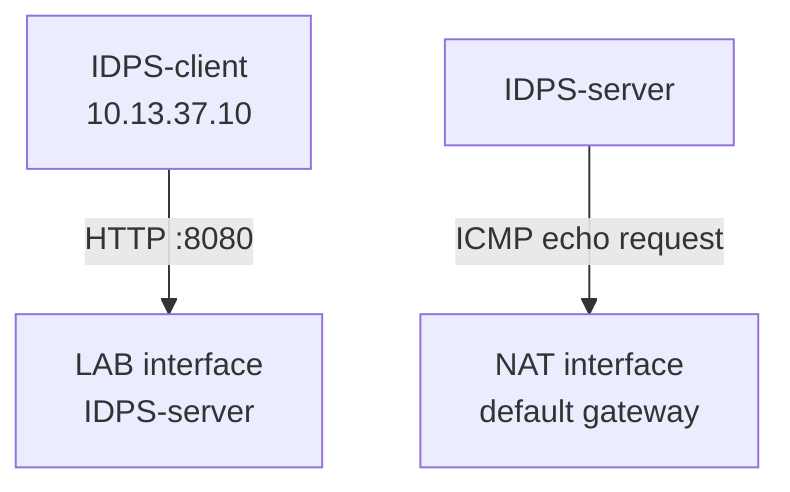

# Лабораторная работа №3 — Точка наблюдения

<div class="chapter-lead">
<p>В ЛР №1 вы отделили наличие сетевого трафика от HTTP-события и alert. В ЛР №2 один контролируемый эпизод дал два разных источника evidence. Теперь проверяется следующий слой: <strong>какие данные вообще доступны сенсору в выбранной точке наблюдения</strong>. Правила остаются простыми; меняется интерфейс, с которого Suricata получает пакеты.</p>
</div>

[Скачать пакет ЛР №3 v0.3.3](../../assets/downloads/idps-lab03-bundle-v0.3.3.zip){ .md-button .md-button--primary }

Работа использует уже существующий стенд. `IDPS-client` имеет `10.13.37.10`, `IDPS-server` — `10.13.37.20` в сети IDPS-LAB. На сервере есть второй интерфейс, через который проходит default route VirtualBox NAT. Мы не называем один интерфейс «правильным», а другой «неправильным»: пригодность точки определяется относительно конкретного потока.



В эксперименте будут два контролируемых потока. Внутренний HTTP идёт от клиента к серверу. Второй поток — ICMP echo request от сервера к шлюзу default route. Для каждого сначала получаем положительное наблюдение в ожидаемой точке, а уже затем проверяем контрастную точку. Поэтому отрицательный результат никогда не остаётся единственным evidence.

## Подготовка и карта точек

На `IDPS-server` разверните сценарий:

```bash
cd ~
unzip idps-lab03-bundle-v0.3.3.zip
cd idps-lab03-bundle-v0.3.3
sudo bash server/setup-server.sh
sudo bash server/prepare-capture.sh
sudo bash server/preflight-server.sh
bash server/show-observation-points.sh
source server/load-vars.sh
```

`setup-server.sh` поднимает учебный HTTP target на `10.13.37.20:8080` и Live Console на `10.13.37.20:9090`. `prepare-capture.sh` best-effort отключает поддерживаемые механизмы разгрузки, чтобы представление пакетов в виртуальной машине было воспроизводимее. `preflight-server.sh` проверяет сервисы, правила Suricata и состояние стенда, но сам по себе ещё не доказывает прохождение нужного потока.

`show-observation-points.sh` показывает фактические интерфейсы и решения маршрутизации. На текущем учебном стенде это `enp0s8` для сети `10.13.37.0/24` и `enp0s3` для default route, однако в командах ниже используются `LAB_IFACE`, `NAT_IFACE` и `NAT_GW`: эти значения повторяются много раз и действительно зависят от VM.

На `IDPS-client`:

```bash
cd ~
unzip idps-lab03-bundle-v0.3.3.zip
cd idps-lab03-bundle-v0.3.3
bash client/check-client.sh
```

Продолжайте после `SERVER PRE-FLIGHT PASSED.` и `CLIENT CHECK PASSED.`

Теперь в браузере на `IDPS-client` откройте:

```text
http://10.13.37.20:9090
```

До запуска Suricata Console должна показывать две найденные observation points, а состояние сенсора — «не запущена». Сохраните в блоке Prediction своё ожидание: какой SID должен появиться при capture на LAB и какой — при capture на NAT. Это прогноз, а не источник истины; дальше он будет проверен `tcpdump` и EVE.

Live Console в этой работе не запускает Suricata и не генерирует трафик. В браузере студент делает только три вещи: фиксирует prediction, следит за текущим capture interface и после команд в терминалах сравнивает появившийся evidence. Блок **«Что делать сейчас»** всегда показывает следующий checkpoint и явно указывает, где выполнить команду.

| Где | Роль в эксперименте |
|---|---|
| `IDPS-client` · браузер | Prediction, состояние сенсора, LAB/NAT evidence и итоговое сравнение |
| `IDPS-client` · терминал | создаёт поток A — HTTP `LAB3-PLACEMENT` |
| `IDPS-server` · терминал Suricata | запускает foreground Suricata сначала на LAB, затем на NAT |
| `IDPS-server` · второй терминал | создаёт поток B — ICMP echo request к `NAT_GW` |

Кнопки `Копировать` в Live Console только копируют показанную команду. Выполнение остаётся явным действием студента в нужной VM/терминале.

## Поток A — внутренний HTTP

Сначала подтверждаем знакомый путь через LAB. На `IDPS-server`:

```bash
sudo tcpdump -nn -i "$LAB_IFACE" 'host 10.13.37.10 and tcp port 8080'
```

Пока capture работает, на `IDPS-client` отправьте контролируемый запрос:

```bash
curl -sS 'http://10.13.37.20:8080/LAB3-PLACEMENT?stage=http-lab'
```

На сервере должны появиться пакеты `10.13.37.10 ↔ 10.13.37.20:8080`, включая HTTP GET. Остановите только `tcpdump` через `Ctrl+C`.

Приложение независимо фиксирует обработку запроса:

```bash
grep 'stage=http-lab' /var/tmp/idps-lab/lab3-access.log | tail -n 1
```

Эта строка подтверждает прикладную доставку, но не сообщает, какой интерфейс видел пакеты.

Теперь проверяем тот же тип потока на NAT observation point. На `IDPS-server`:

```bash
sudo timeout 15 tcpdump -nn -i "$NAT_IFACE" \
  'host 10.13.37.10 and tcp port 8080'
```

Пока capture активен, на `IDPS-client`:

```bash
curl -sS 'http://10.13.37.20:8080/LAB3-PLACEMENT?stage=http-nat-check'
```

Если соответствующих пакетов на NAT interface нет, допустимый вывод ограничен условиями теста: внутренний HTTP наблюдался на LAB point и не наблюдался на NAT point выбранным способом захвата. Формулировка «HTTP не существовал» была бы неверной — его существование уже подтверждено приложением и положительным LAB capture.

## Поток B — ICMP к default gateway

Для второго потока назначение другое. На `IDPS-server`:

```bash
ip route get "$NAT_GW"
```

Маршрут должен указывать на `NAT_IFACE`. Сначала слушаем именно эту точку:

```bash
sudo tcpdump -nn -i "$NAT_IFACE" "icmp and host $NAT_GW"
```

Во втором терминале `IDPS-server` загрузите переменные один раз:

```bash
cd ~/idps-lab03-bundle-v0.3.3
source server/load-vars.sh
```

и создайте пакет:

```bash
ping -c 1 -W 1 "$NAT_GW"
```

Для цели лаборатории достаточно увидеть исходящий echo request. Ответ шлюза полезен, но не является обязательным доказательством маршрута созданного пакета. После фиксации результата остановите `tcpdump`.

Теперь сравните LAB point:

```bash
sudo timeout 15 tcpdump -nn -i "$LAB_IFACE" "icmp and host $NAT_GW"
```

Во втором серверном терминале повторите тот же `ping`. Если matching echo request здесь не появляется, вывод снова относится только к этому потоку: ICMP к default gateway наблюдался на NAT point и не наблюдался на LAB point.

К этому моменту `tcpdump` уже ответил на вопрос размещения. Следующий этап проверяет, даст ли тот же выбор observation point ожидаемо разный detection evidence при одном и том же ruleset.

## Suricata и Live Console

К этому этапу пути уже подтверждены `tcpdump`. Теперь выполняются два последовательных Suricata-run. В каждом run создаются **одни и те же два потока**: HTTP с `IDPS-client` и ICMP с `IDPS-server`. Меняется только `-i`. Именно поэтому различие между EVE двух запусков можно обсуждать как эффект observation point, а не как следствие разных тестовых входов.

В `server/lab03.rules` два учебных правила:

| SID | Наблюдаемое условие |
|---|---|
| `1000003` | HTTP URI содержит `LAB3-PLACEMENT` |
| `1000004` | наблюдается ICMP echo request (`itype:8`) |

`preflight-server.sh` уже выполнил `suricata -T` с этим файлом. Этот результат подтверждает разбор конфигурации и правил, но не capture нужного трафика, поэтому отдельно повторять `-T` сейчас не требуется.

### Suricata на LAB observation point

На `IDPS-server`:

```bash
rm -rf "$HOME/lab03-lab-run"
mkdir -p "$HOME/lab03-lab-run"

sudo suricata \
  -k none \
  -c /etc/suricata/suricata.yaml \
  -S "$HOME/idps-lab03-bundle-v0.3.3/server/lab03.rules" \
  -i "$LAB_IFACE" \
  -l "$HOME/lab03-lab-run"
```

После `Engine started.` оставьте этот терминал открытым. Live Console должна показать реальный PID `Suricata-Main`, capture interface и определить его как LAB point. Поле «Как определено» показывает, откуда Console получила привязку интерфейса: из аргумента `-i` процесса или из его AF_PACKET socket. Это диагностическая подсказка UI, а не замена сетевому evidence.

Создайте оба уже проверенных потока. На `IDPS-client`:

```bash
curl -sS 'http://10.13.37.20:8080/LAB3-PLACEMENT?stage=suricata-lab'
```

Во втором терминале `IDPS-server`:

```bash
ping -c 1 -W 1 "$NAT_GW"
```

Вернитесь в браузер. Console обновляется автоматически; при необходимости нажмите **«Обновить evidence»**. В карточке LAB run должны появиться фактические HTTP/alert evidence, а блок «Что делать сейчас» подскажет остановить foreground Suricata после фиксации результата. Сравните наблюдаемое с прогнозом. Затем проверьте те же alert-события напрямую в EVE:

```bash
jq -c '
  select(.event_type=="alert" and (.alert.signature_id==1000003 or .alert.signature_id==1000004))
  | {timestamp, src_ip, dest_ip, sid: .alert.signature_id, signature: .alert.signature, action: .alert.action}
' "$HOME/lab03-lab-run/eve.json"
```

Console показывает соответствующие строки EVE JSONL, но командная проверка остаётся самостоятельным evidence. После фиксации результата остановите Suricata одним `Ctrl+C` и дождитесь возврата shell prompt.

### Suricata на NAT observation point

На `IDPS-server`:

```bash
rm -rf "$HOME/lab03-nat-run"
mkdir -p "$HOME/lab03-nat-run"

sudo suricata \
  -k none \
  -c /etc/suricata/suricata.yaml \
  -S "$HOME/idps-lab03-bundle-v0.3.3/server/lab03.rules" \
  -i "$NAT_IFACE" \
  -l "$HOME/lab03-nat-run"
```

После `Engine started.` Live Console должна сменить capture interface на NAT point. Блок **«Что делать сейчас»** покажет те же два controlled inputs уже для NAT run. Снова создайте оба потока: на `IDPS-client` отправьте запрос с marker `stage=suricata-nat`, а на `IDPS-server` выполните тот же `ping` к `NAT_GW`.

Raw alert evidence:

```bash
jq -c '
  select(.event_type=="alert" and (.alert.signature_id==1000003 or .alert.signature_id==1000004))
  | {timestamp, src_ip, dest_ip, sid: .alert.signature_id, signature: .alert.signature, action: .alert.action}
' "$HOME/lab03-nat-run/eve.json"
```

После появления NAT evidence остановите Suricata одним `Ctrl+C`. После остановки блок Compare разблокируется и покажет рядом ваш prediction и фактический alert-набор для LAB/NAT. Только затем переходите к CLI-проверке EVE и итоговому выводу.

## Что доказал каждый артефакт

| Evidence | Что поддерживает | Чего сам по себе не доказывает |
|---|---|---|
| `ip route get` | решение маршрутизации ядра для указанного назначения | что пакет действительно был захвачен |
| `lab3-access.log` | приложение обработало конкретный HTTP-запрос | через какой интерфейс этот запрос наблюдался |
| `tcpdump` на LAB/NAT | соответствующие пакеты наблюдались либо не наблюдались в конкретной точке во время теста | свойства интерфейса «вообще» |
| EVE LAB/NAT | что Suricata получила/разобрала и какие правила дали результат в конкретном run | отсутствие трафика за пределами dataset сенсора |
| Live Console | визуальное представление PID, capture point и тех же EVE/application artifacts | отдельный независимый источник истины |

Главная цепочка работы остаётся прежней: `capability → configuration → observation → justified conclusion`. Запущенная Suricata подтверждает состояние процесса. Параметр `-i` задаёт конфигурацию capture. `tcpdump` и EVE дают наблюдение. Только их совместная интерпретация позволяет сформулировать вывод о конкретном потоке и точке.

## Завершение

После второго run Suricata должна быть остановлена. На `IDPS-server`:

```bash
pgrep -a Suricata-Main || echo 'Suricata-Main не запущен'
```

Live Console при следующем обновлении должна показать `Suricata: не запущена`, при этом EVE обоих запусков остаются доступными для сравнения. Не удаляйте `~/lab03-lab-run` и `~/lab03-nat-run`: это результаты работы.

Для отчёта используйте `report/lab03-report.md`. В нём нужны прогноз, минимальные фрагменты route/tcpdump, фактическая Suricata-матрица, пути к EVE и ограниченный вывод без формулировок «нет alert — нет трафика» или «интерфейс слепой».
