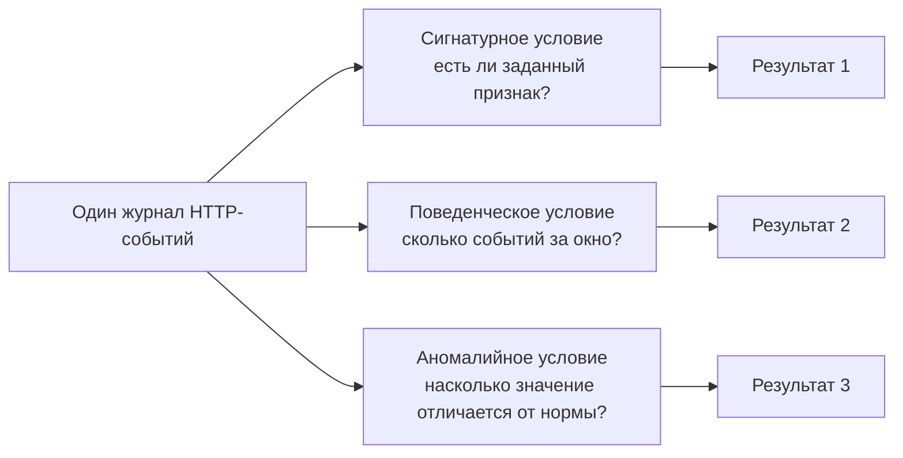

# Лабораторная работа №4

## Разные основания обнаружения

<div class="lab-header">
  <div><strong>Уровень:</strong> базовый / средний</div>
  <div><strong>Инструменты:</strong> curl, jq, Python 3</div>
  <div><strong>Теория:</strong> Глава 5 — методы обнаружения</div>
</div>

<div class="chapter-lead">
<p>В этой работе вы не пишете правила Suricata. Вместо этого один контролируемый журнал событий анализируется тремя разными способами: по точному признаку, по серии событий во временном окне и по отклонению от базовой линии.</p>

<p>Так мы меняем именно <strong>основание решения</strong>, а не источник или формат данных. В Главе 6 те же идеи будут переведены в синтаксис реальных правил IDS.</p>
</div>

---

## Что должна доказать работа

<div class="teaching-figure" markdown="1">
<div class="figure-label">СХЕМА · ОДИН ЖУРНАЛ — ТРИ ВОПРОСА</div>



<div class="figure-caption">Источник и структура записей остаются одинаковыми. Меняется только условие, по которому выделяется событие.</div>
</div>

В Главе 5 также рассматривается анализ состояния протокола. **В этой работе он намеренно не имитируется.** Для корректного эксперимента с состоянием протокола потребуется отдельно контролировать протокольную последовательность и представление, которое формирует анализатор. Мы вернёмся к этому при изучении представления данных и ограничений сетевого анализа.

!!! note "Что представляет собой учебный анализатор"
    Скрипт `detectors.py` не является IDS и не имитирует конкретный продукт. Это прозрачная учебная модель трёх условий над одним набором записей. Она нужна, чтобы сначала понять принцип решения, а уже в следующей главе перейти к синтаксису Suricata.

---

## Что необходимо до начала

Должны быть завершены:

- [подготовка лабораторной среды](../environment/);
- Глава 5;
- ЛР №1–3.

Стенд:

```text
idps-client   10.13.37.10/24
       │
       │ IDPS-LAB
       ▼
idps-server   10.13.37.20/24
       │
       └─ учебный HTTP-сервис :8080
             │
             ▼
   /var/tmp/idps-lab/lab4-access.jsonl
```

[Скачать пакет ЛР №4 v0.2](../../assets/downloads/idps-lab04-bundle-v0.2.zip){ .md-button .md-button--primary }

---

# 1. Подготовьте сервер

На `idps-server`:

```bash
cd ~
unzip idps-lab04-bundle-v0.2.zip
cd idps-lab04-bundle-v0.2
sudo bash server/setup-server.sh
sudo bash server/preflight-server.sh
```

Продолжайте только после:

```text
SERVER PRE-FLIGHT PASSED.
```

Что проверяет предварительная проверка:

- адрес `10.13.37.20/24` существует;
- есть маршрут к клиенту `10.13.37.10`;
- учебный web-сервис запущен;
- сервис слушает именно `10.13.37.20:8080`, а не `0.0.0.0:8080`;
- существует журнал событий;
- установлен учебный анализатор.

---

# 2. Проверьте клиент

На `idps-client`:

```bash
cd ~
unzip idps-lab04-bundle-v0.2.zip
cd idps-lab04-bundle-v0.2
bash client/check-client.sh
```

Продолжайте только после:

```text
CLIENT CHECK PASSED.
```

---

# 3. Сначала посмотрите на исходные данные

На сервере очистите журнал:

```bash
cd ~/idps-lab04-bundle-v0.2
sudo bash server/reset-log.sh
```

На клиенте отправьте обычный запрос:

```bash
curl -sS 'http://10.13.37.20:8080/normal'
```

На сервере:

```bash
jq . /var/tmp/idps-lab/lab4-access.jsonl
```

Вы должны увидеть запись с полями наподобие:

```text
timestamp
src_ip
src_port
dst_ip
dst_port
method
path
query
uri
phase
value_length
```

Это **общее представление данных**, которое будет читать каждый из трёх учебных детекторов.

<div class="callout-banner">
<strong>Зафиксируйте:</strong> дальше меняется логика анализа, но не формат входных записей.
</div>

---

# Часть A. Сигнатурное условие

## 4. Создайте два события

Снова очистите журнал:

```bash
sudo bash server/reset-log.sh
```

На клиенте выполните обычный запрос:

```bash
curl -sS 'http://10.13.37.20:8080/normal'
```

Затем запрос с учебным маркером:

```bash
curl -sS 'http://10.13.37.20:8080/lab4/LAB4-SIGNATURE'
```

Убедитесь, что в журнале ровно те события, которые вы создали:

```bash
jq -c '{timestamp,src_ip,uri}' \
  /var/tmp/idps-lab/lab4-access.jsonl
```

---

## 5. Примените сигнатурное условие

На сервере:

```bash
python3 server/detectors.py signature
```

Условие анализатора:

```text
uri содержит "LAB4-SIGNATURE"
```

Ожидаемый смысл результата:

```text
обычный URI
→ условие не выполнено

URI с LAB4-SIGNATURE
→ условие выполнено
```

!!! warning "Граница вывода"
    Срабатывание подтверждает только совпадение заданного признака с полем `uri`. Оно не доказывает наличие уязвимости, вредоносность клиента или успешную эксплуатацию.

---

# Часть B. Детерминированное поведенческое условие

## 6. Проверьте одно событие

Очистите журнал:

```bash
sudo bash server/reset-log.sh
```

На клиенте отправьте **один** запрос:

```bash
curl -sS \
  'http://10.13.37.20:8080/lab4-fail-login?attempt=single'
```

На сервере:

```bash
python3 server/detectors.py behavior
```

Условие анализатора:

```text
не менее 5 запросов к /lab4-fail-login
от одного src_ip
в пределах 10 секунд
```

После одного события ожидается:

```text
ИТОГ: НЕ ОБНАРУЖЕНО
```

---

## 7. Создайте серию событий

Чтобы старое одиночное событие не попало в новое 10-секундное окно, подождите:

```bash
sleep 11
```

На клиенте быстро отправьте шесть запросов:

```bash
for i in 1 2 3 4 5 6; do
  curl -sS \
    "http://10.13.37.20:8080/lab4-fail-login?attempt=$i" \
    >/dev/null
done
```

На сервере повторите:

```bash
python3 server/detectors.py behavior
```

Теперь ожидается:

```text
ИТОГ: ОБНАРУЖЕНО
```

Посмотрите сами события:

```bash
jq -c '
  select(.path=="/lab4-fail-login")
  | {timestamp,src_ip,uri}
' /var/tmp/idps-lab/lab4-access.jsonl
```

Здесь нет профиля «нормального пользователя». Событие, временное окно и порог заранее заданы в условии.

Поэтому:

```text
ПОВЕДЕНЧЕСКОЕ УСЛОВИЕ
≠
АНОМАЛИЙНЫЙ МЕТОД
```

---

# Часть C. Аномалийное условие

## 8. Создайте базовую линию

Очистите журнал:

```bash
sudo bash server/reset-log.sh
```

На клиенте создайте пять контролируемых наблюдений:

```bash
for value in home docs status product catalogue; do
  curl -sS -G \
    --data-urlencode 'phase=baseline' \
    --data-urlencode "value=$value" \
    'http://10.13.37.20:8080/lab4-anomaly' \
    >/dev/null
done
```

В этой учебной модели признаком является **длина параметра `value`**.

Проверьте полученные значения на сервере:

```bash
jq -c '
  select(.path=="/lab4-anomaly")
  | {phase,value_length}
' /var/tmp/idps-lab/lab4-access.jsonl
```

---

## 9. Добавьте тестовое наблюдение

На клиенте:

```bash
LONG_VALUE=$(printf 'A%.0s' {1..120})

curl -sS -G \
  --data-urlencode 'phase=test' \
  --data-urlencode "value=$LONG_VALUE" \
  'http://10.13.37.20:8080/lab4-anomaly' \
  >/dev/null
```

---

## 10. Примените аномалийное условие

На сервере:

```bash
python3 server/detectors.py anomaly
```

Используемая учебная модель:

```text
mean  = среднее значение базовой линии
stdev = стандартное отклонение базовой линии
score = |x - mean| / max(stdev, 1)

если score > 3
→ пометить наблюдение как аномалию
```

Ожидается, что значение длиной 120 символов будет отмечено как:

```text
АНОМАЛИЯ
```

!!! warning "Граница вывода"
    Здесь «аномалия» означает только сильное отклонение по **одному выбранному признаку** относительно **конкретной учебной базовой линии**. Это не доказательство атаки.

---

# 11. Сведите результаты

| Эксперимент | Один и тот же источник | Что меняется | Что означает результат |
|---|---|---|---|
| Сигнатурный | `lab4-access.jsonl` | поиск заранее заданного маркера в `uri` | найдено конкретное условие |
| Поведенческий | `lab4-access.jsonl` | число событий одного типа в окне 10 с | выполнен заданный порог поведения |
| Аномалийный | `lab4-access.jsonl` | сравнение `value_length` с базовой линией | наблюдение вышло за границу выбранной модели |

Теперь утверждение главы можно проверить экспериментально:

```text
ИСТОЧНИК ДАННЫХ
       ≠
МЕТОД ОБНАРУЖЕНИЯ
```

И ещё одно:

```text
ОДИН ФОРМАТ СОБЫТИЙ
        ↓
РАЗНЫЕ ВОПРОСЫ К ДАННЫМ
        ↓
РАЗНЫЕ УСЛОВИЯ ОБНАРУЖЕНИЯ
```

---

# 12. Что сдаётся

Используйте шаблон:

```text
report/lab04-report.md
```

К отчёту приложите текстовый вывод трёх запусков:

```bash
python3 server/detectors.py signature
python3 server/detectors.py behavior
python3 server/detectors.py anomaly
```

В отчёте обязательно объясните:

- какое поле или набор событий использовал каждый детектор;
- какое условие применялось;
- требовалась ли базовая линия;
- что срабатывание подтверждает;
- чего оно не подтверждает.

Скриншоты без объяснения не считаются достаточным результатом.

---

# 13. Короткая защита

Преподаватель выбирает один из трёх режимов. Студент должен на месте:

1. создать требуемые события;
2. показать их в `lab4-access.jsonl`;
3. запустить соответствующий режим анализатора;
4. объяснить условие решения;
5. изменить **один параметр** по просьбе преподавателя, например:
   - маркер `--marker`;
   - порог количества `--count`;
   - окно `--window`;
   - порог аномалии `--threshold`;
6. объяснить, почему результат изменился или не изменился.

Это проверяет понимание логики, а не наличие заранее подготовленного отчёта.

---

## Технический статус

HTTP-сервис и анализатор являются контролируемыми учебными компонентами. Их синтаксис и локальная логика проходят статическую и автономную проверку.

При этом полный сценарий с двумя VirtualBox VM сохраняет статус:

```text
ТРЕБУЕТСЯ ПРОВЕРКА НА ЭТАЛОННОМ СТЕНДЕ
```

до полного прогона инструкции на Ubuntu Desktop/Server 24.04.x.

---

# Переход к Главе 6

В этой работе условия были записаны понятным человеку образом и исполнялись прозрачным учебным анализатором.

Следующий шаг — выразить условия в языке реальной IDS:

```text
условие над данными
        ↓
структура правила Suricata
        ↓
проверка синтаксиса
        ↓
положительные и отрицательные тесты
```

Именно этому посвящены Глава 6 и следующая лабораторная работа.
