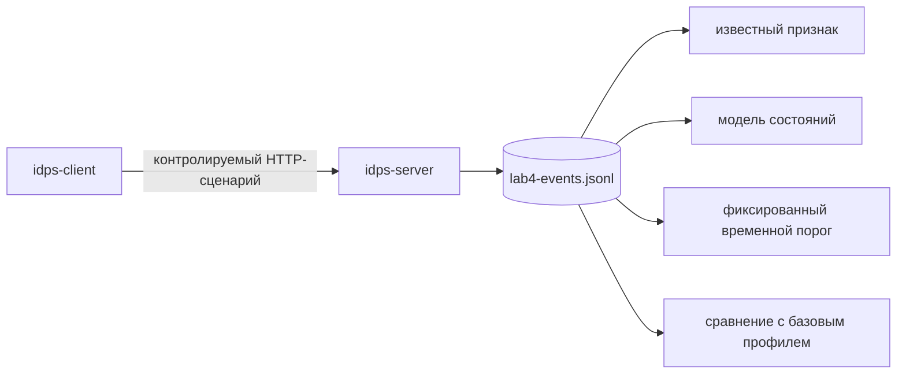

# Лабораторная работа №4

## Один набор событий — четыре основания решения

<div class="lab-header">
<strong>Цель:</strong> экспериментально сравнить четыре основания решения на одном наборе событий: сигнатурное совпадение, нарушение модели состояния, фиксированный порог над серией событий и отклонение от базового профиля.
</div>

<div class="chapter-lead">
<p>В этой работе мы специально <strong>не пишем собственные правила Suricata</strong>. Это будет темой следующей главы. Здесь важнее увидеть, что один и тот же набор событий может анализироваться по разным основаниям, а результат каждого детектора поддерживает разные выводы.</p>
</div>
## Что необходимо до начала работы

Должны быть выполнены:

```text
Глава 1;
Шаг 00 — подготовка двух VM;
Практикум 0 — знакомство с рабочей IDPS;
Глава 2;
Глава 3;
ЛР №1;
ЛР №2;
Глава 4;
ЛР №3;
Глава 5.
```

Схема стенда остаётся прежней:

```text
idps-client  10.13.37.10
      |
      | IDPS-LAB
      v
idps-server  10.13.37.20:8080
```

Скачайте пакет:

[**idps-lab04-bundle-v0.2.zip**](../../assets/downloads/idps-lab04-bundle-v0.2.zip){ .md-button .md-button--primary }

Распакуйте его на обе VM или перенесите каталог `client/` на клиент, а `server/` и `report/` — на сервер.

---

## 1. Что именно мы меняем в эксперименте

В предыдущих работах мы меняли источник или точку наблюдения. Здесь они фиксированы.

<div class="teaching-figure" markdown="1">
<div class="figure-label">СХЕМА 1 · ОДИН ФАЙЛ СОБЫТИЙ, ЧЕТЫРЕ ВОПРОСА</div>



<div class="figure-caption">Источник данных и набор событий не меняются. Меняется только принцип анализа. Это позволяет не смешивать основание решения с наблюдаемостью или размещением.</div>
</div>

Учебный журнал содержит:

```text
временную метку;
источник и назначение;
HTTP method;
path и query;
метку фазы контролируемого эксперимента.
```

Поле `phase` нужно только для разделения базового профиля и всплеска в аномальном тесте. Оно не является признаком атаки.

---

## 2. Подготовьте сервер

На `idps-server`:

```bash
cd idps-lab04-bundle-v0.2
sudo bash server/setup-server.sh
sudo bash server/preflight-server.sh
sudo bash server/reset-evidence.sh
```

Ожидаемый итог:

```text
SERVER PRE-FLIGHT PASSED.
[ OK ] lab4-events.jsonl очищен.
```

Проверьте, что журнал пуст:

```bash
wc -l /var/tmp/idps-lab/lab4-events.jsonl
```

Ожидается:

```text
0 /var/tmp/idps-lab/lab4-events.jsonl
```

<div class="lab-evidence">
<strong>Почему очистка обязательна</strong>
<p>Каждый запуск должен иметь собственную временную границу. Иначе детекторы могут анализировать события предыдущего эксперимента, а выводы перестанут относиться к одному контролируемому сценарию.</p>
</div>

---

## 3. Проверьте клиент

На `idps-client`:

```bash
cd idps-lab04-bundle-v0.2
bash client/check-client.sh
```

Ожидается:

```text
CLIENT CHECK PASSED.
```

После этой проверки снова очистите журнал на сервере, потому что `check-client.sh` сам создаёт один технический HTTP-запрос:

```bash
sudo bash server/reset-evidence.sh
```

---

## 4. Выполните один контролируемый сценарий

На `idps-client`:

```bash
bash client/run-scenario.sh
```

Сценарий создаёт четыре части:

```text
1. базовый профиль:
   6 запросов /catalog с интервалом около 0.8 с;

2. known marker:
   1 запрос /download/LAB4-KNOWN-BAD;

3. проверка состояния:
   DATA до START, затем корректные START → DATA → END;

4. всплеск:
   после технической паузы 2.2 с — 8 запросов /catalog без искусственной задержки.
```

Пауза перед всплеском нужна только для чистоты эксперимента: она гарантирует, что двухсекундное окно фиксированного порога не содержит хвост базового профиля. Внутри всплеска искусственная задержка не добавляется.

Ожидаемое завершение:

```text
SCENARIO COMPLETE. Ожидается 19 событий в чистом журнале.
```

На сервере:

```bash
wc -l /var/tmp/idps-lab/lab4-events.jsonl
```

Ожидается `19` строк.

Если число другое, не продолжайте интерпретацию. Сначала выясните, был ли журнал действительно очищен и завершился ли сценарий полностью.

---

## 5. Сначала посмотрите на исходные события

На сервере:

```bash
sed -n '1,25p' /var/tmp/idps-lab/lab4-events.jsonl
```

Не пытайтесь пока решить, какие события «опасные». Ваша задача — подтвердить, что детекторы дальше получают **один и тот же исходный набор данных**.

Проверьте порядок session-событий:

```bash
grep '"path": "/session/' /var/tmp/idps-lab/lab4-events.jsonl
```

Вы должны увидеть:

```text
/session/data
/session/start
/session/data
/session/end
```

Первое `DATA` намеренно идёт раньше `START`.

---

# Часть A. Сигнатурный метод

## 6. Примените детектор известного признака

```bash
python3 server/analyze-methods.py --method signature
```

Ключевой ожидаемый результат:

```text
METHOD=signature
CONDITION=path == /download/LAB4-KNOWN-BAD
MATCHES=1
SIGNATURE MATCH ...
```

Детектор не анализирует частоту, базовый профиль или состояние учебной сессии. Он отвечает на один вопрос:

> присутствует ли заранее определённый признак?

<div class="lab-evidence">
<strong>Допустимый вывод</strong>
<p>В журнале присутствует событие, которое совпало с заранее определённым условием сигнатурного детектора.</p>
</div>

Нельзя делать вывод:

```text
совпадение маркера → доказана компрометация
```

`LAB4-KNOWN-BAD` — синтетический учебный маркер.

---

# Часть B. Состояние и семантика

## 7. Примените детектор состояния

```bash
python3 server/analyze-methods.py --method protocol
```

Используется учебная модель:

```text
IDLE --START--> OPEN
OPEN --DATA--> OPEN
OPEN --END--> IDLE
```

Ключевой ожидаемый результат:

```text
METHOD=protocol
VIOLATIONS=1
STATE VIOLATION ... state=IDLE action=DATA
```

Первое `DATA` синтаксически является обычным HTTP-запросом, но нарушает **состояние синтетического прикладного протокола**, заданного для лаборатории.

!!! important
    `START → DATA → END` не является правилом стандарта HTTP. Это специально созданный учебный протокол поверх HTTP-маршрутов, позволяющий сделать состояние явным и воспроизводимым.

<div class="lab-evidence">
<strong>Допустимый вывод</strong>
<p>Наблюдаемая последовательность нарушила заданную модель состояний учебного протокола.</p>
</div>

Нельзя делать вывод:

```text
state violation → HTTP-атака доказана
```

---

# Часть C. Фиксированное условие над серией событий

## 8. Примените фиксированный временной порог

```bash
python3 server/analyze-methods.py --method threshold
```

Детектор использует условие:

```text
один источник
+ /catalog
+ не менее 5 запросов
+ в пределах 2 секунд
```

Ключевой ожидаемый результат:

```text
METHOD=threshold
CONDITION=>=5 /catalog requests from one source within 2.0s
MATCHES=1
THRESHOLD MATCH ...
```

Обратите внимание: базовый профиль для принятия решения не использовался.

Порог `5 за 2 секунды` был определён **до анализа**.

<div class="lab-evidence">
<strong>Допустимый вывод</strong>
<p>В контролируемом наборе событий выполнено заранее заданное условие над серией событий.</p>
</div>

Нельзя утверждать:

```text
threshold match → активность доказанно аномальна для реальной организации
```

Для этого пока нет модели реальной нормы.

---

# Часть D. Аномальное обнаружение

## 9. Сравните всплеск с базовым профилем

Теперь используется тот же `/catalog`, но принцип решения другой.

```bash
python3 server/analyze-methods.py --method anomaly
```

Детектор берёт события с меткой `базовый профиль`, вычисляет медианный интервал между ними и сравнивает его со всплеском.

Ожидаемая форма результата:

```text
METHOD=anomaly
BASELINE_EVENTS=6 BURST_EVENTS=8
BASELINE_MEDIAN_INTERVAL=...
BURST_MEDIAN_INTERVAL=...
SPEED_RATIO=... THRESHOLD=3.00x
ANOMALY=YES
```

Точные значения интервалов зависят от скорости VM. Важен принцип: всплеск должен быть как минимум в три раза быстрее базового профиля по медианному интервалу.

Если `ANOMALY=NO`, повторите эксперимент после очистки журнала и убедитесь, что базовый профиль действительно создавался с задержкой, а всплеск — без неё.

<div class="lab-evidence">
<strong>Допустимый вывод</strong>
<p>В данном контролируемом прогоне временная структура всплеска существенно отклонилась от измеренного базового профиля по выбранному критерию.</p>
</div>

Нельзя делать вывод:

```text
ANOMALY=YES → вредоносность доказана
```

И нельзя утверждать, что шесть учебных запросов являются репрезентативной моделью рабочей среды. Это только лабораторная базовая линия для демонстрации принципа.

---

## 10. Сопоставьте четыре основания решения

```bash
python3 server/analyze-methods.py --method all
```

В конце должен появиться сводный блок:

```text
=== SUMMARY ===
SIGNATURE=DETECTED
PROTOCOL=DETECTED
THRESHOLD=DETECTED
ANOMALY=DETECTED
```

Все четыре результата получены из **одного файла событий**, но основания решений различаются.

| Основание | Что проверяется | Нужна история нескольких событий? | Нужен базовый профиль? |
|---|---|---:|---:|
| Сигнатурный | заранее известный признак | не обязательно | нет |
| Состояние/семантика | допустимое состояние и переход | да, если состояние зависит от истории | нет |
| Фиксированный порог | заранее заданное условие над серией | обычно да | нет |
| Аномальный | отклонение от ожидаемой модели | часто да | да, в этой лабораторной |

Главный экспериментальный вывод:

<div class="principle-box">
<strong>ФИКСИРОВАННЫЙ ПОРОГ ≠ АНОМАЛИЯ</strong>
<p>Оба детектора анализировали частоту `/catalog`, но первый применял заранее заданный порог, а аномальный сравнивал всплеск с измеренным базовым профилем.</p>
</div>

---

## 11. Что нужно сдать

Из каталога `report/` заполните `lab04-report.md`.

Приложите:

```text
lab4-events.jsonl;
вывод --method signature;
вывод --method protocol;
вывод --method threshold;
вывод --method anomaly;
сводный вывод --method all;
заполненный отчёт.
```

Не заменяйте исходный журнал только скриншотами. Нужен сам набор событий, из которого были получены результаты.

---

## Если результат отличается от ожидаемого

| Симптом | Что проверить |
|---|---|
| В журнале больше 19 строк | Был ли выполнен `sudo bash server/reset-evidence.sh` после client check |
| В журнале меньше 19 строк | Завершился ли `run-scenario.sh`; доступен ли `10.13.37.20:8080` |
| `MATCHES=0` для signature | Есть ли строка `/download/LAB4-KNOWN-BAD` в JSONL |
| `VIOLATIONS=0` | Идёт ли первое `/session/data` раньше `/session/start` |
| `MATCHES=0` для threshold | Выполнялся ли всплеск без искусственной задержки |
| `ANOMALY=NO` | Сравните интервалы базового профиля и всплеска; повторите чистый эксперимент на ненагруженных VM |
| `ANOMALY=INDETERMINATE` | Достаточно ли минимум двух событий в обеих фазах |

---

## Связь с теорией

ЛР №4 удерживает неизменными источник, точку наблюдения и набор событий, а меняет только **основание принятия решения**.

```text
одна среда
+ один сервис
+ один журнал событий
+ один контролируемый сценарий
        ↓
четыре разных основания решения
```

Это напрямую закрепляет Главу 5 и подготавливает Главу 6: после того как студент понимает, **какое условие или принцип** хочет реализовать, можно переходить к вопросу, **как выразить условие в правиле конкретного движка**.
