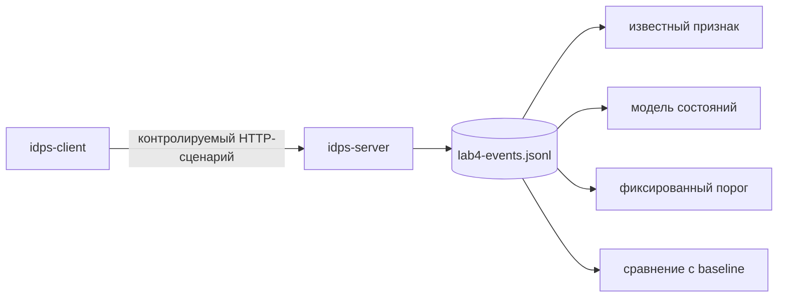

# Лабораторная работа №4 — Четыре основания решения

<div class="chapter-lead">
<p>В этой работе источник данных и сам набор событий остаются неизменными. Меняется только принцип анализа. Это позволяет на одном контролируемом журнале сравнить сигнатурное совпадение, нарушение модели состояния, фиксированный временной порог и отклонение от базового профиля.</p>
</div>

[Скачать пакет ЛР №4 v0.2](../../assets/downloads/idps-lab04-bundle-v0.2.zip){ .md-button .md-button--primary }



Здесь важно не перепутать разные вопросы. Сигнатурный детектор ищет известный признак. State detector проверяет допустимость последовательности. Threshold detector применяет заранее установленное условие к серии событий. Anomaly detector сравнивает наблюдение с измеренным baseline.

## Подготовьте один чистый набор событий

На `idps-server`:

```bash
cd idps-lab04-bundle-v0.2
sudo bash server/setup-server.sh
sudo bash server/preflight-server.sh
sudo bash server/reset-evidence.sh
```

Нужны `SERVER PRE-FLIGHT PASSED.` и сообщение об очистке `lab4-events.jsonl`. Убедитесь, что журнал действительно пуст:

```bash
wc -l /var/tmp/idps-lab/lab4-events.jsonl
```

Ожидается `0`. Эта очистка принципиальна: все четыре метода должны анализировать один и тот же текущий эксперимент, а не смесь старых и новых данных.

На `idps-client`:

```bash
cd idps-lab04-bundle-v0.2
bash client/check-client.sh
```

После `CLIENT CHECK PASSED.` снова очистите журнал на сервере:

```bash
sudo bash server/reset-evidence.sh
```

Client check сам делает технический HTTP-запрос, поэтому его след не должен остаться в основном наборе.

## Создайте сценарий

На `idps-client`:

```bash
bash client/run-scenario.sh
```

Сценарий формирует четыре логические части, но записывает их в один JSONL:

| Фаза | Что происходит | Зачем это нужно |
|---|---|---|
| baseline | 6 запросов `/catalog` с интервалом около 0.8 с | дать измеряемый базовый профиль |
| known marker | один `/download/LAB4-KNOWN-BAD` | дать известный признак |
| state sequence | `DATA` до `START`, затем корректные `START → DATA → END` | создать одно нарушение модели состояния |
| burst | после технической паузы 8 быстрых `/catalog` | проверить fixed threshold и сравнение с baseline |

Пауза перед burst отделяет его от хвоста baseline. Она нужна для чистоты эксперимента, а не является признаком обнаружения.

После завершения ожидается сообщение о 19 событиях. На сервере подтвердите:

```bash
wc -l /var/tmp/idps-lab/lab4-events.jsonl
```

Если строк не 19, анализировать детекторы рано: сначала исправьте сам эксперимент.

## Посмотрите исходный журнал до любого решения

```bash
sed -n '1,25p' /var/tmp/idps-lab/lab4-events.jsonl
```

Журнал содержит timestamp, источник и назначение, HTTP method, path/query и техническую метку `phase`. `phase` используется для разделения частей контролируемого сценария и сама по себе не является индикатором атаки.

Порядок synthetic session events:

```bash
grep '"path": "/session/' /var/tmp/idps-lab/lab4-events.jsonl
```

Должно быть видно:

```text
/session/data
/session/start
/session/data
/session/end
```

Первое `DATA` специально идёт раньше `START`.

## Известный признак

```bash
python3 server/analyze-methods.py --method signature
```

Ожидаемая форма:

```text
METHOD=signature
CONDITION=path == /download/LAB4-KNOWN-BAD
MATCHES=1
SIGNATURE MATCH ...
```

Здесь решение опирается на заранее известный признак. Из такого совпадения можно утверждать только, что в журнале есть событие, удовлетворившее этому условию. `LAB4-KNOWN-BAD` — синтетический маркер; сам факт совпадения не доказывает компрометацию.

## Модель состояния

```bash
python3 server/analyze-methods.py --method protocol
```

Учебная модель:

```text
IDLE --START--> OPEN
OPEN --DATA--> OPEN
OPEN --END--> IDLE
```

Ожидается одна state violation для `DATA` в состоянии `IDLE`:

```text
METHOD=protocol
VIOLATIONS=1
STATE VIOLATION ... state=IDLE action=DATA
```

Это не правило стандарта HTTP. Мы намеренно построили маленький синтетический протокол поверх HTTP-маршрутов, чтобы состояние было явным и воспроизводимым. Допустимый вывод: наблюдаемая последовательность нарушила заданную модель этого учебного протокола.

## Фиксированный временной порог

```bash
python3 server/analyze-methods.py --method threshold
```

Детектор применяет заранее заданное условие:

```text
один источник + /catalog + не менее 5 запросов + окно 2 секунды
```

Ожидается один match. Важная деталь: baseline здесь не используется вообще. Порог был задан до анализа и применяется напрямую к серии событий.

Поэтому `threshold match` означает выполнение конкретного фиксированного условия, а не доказанную аномальность относительно реальной организации.

## Отклонение от baseline

```bash
python3 server/analyze-methods.py --method anomaly
```

Этот детектор уже использует baseline: вычисляет медианный интервал между baseline-событиями `/catalog`, затем сравнивает его с burst.

Ожидаемая форма:

```text
METHOD=anomaly
BASELINE_EVENTS=6 BURST_EVENTS=8
BASELINE_MEDIAN_INTERVAL=...
BURST_MEDIAN_INTERVAL=...
SPEED_RATIO=... THRESHOLD=3.00x
ANOMALY=YES
```

Точные интервалы зависят от VM. Важно, чтобы burst был как минимум в три раза быстрее baseline по выбранной метрике. Даже при `ANOMALY=YES` нельзя утверждать вредоносность: шесть учебных запросов — демонстрационный baseline, а не репрезентативная модель рабочей инфраструктуры.

## Сопоставьте основания, а не названия детекторов

```bash
python3 server/analyze-methods.py --method all
```

В конце ожидается сводка с `DETECTED` для всех четырёх методов. Они работают с одним файлом событий, но принимают решение по разным основаниям:

| Метод | На чём основано решение | Нужна история событий | Нужен baseline |
|---|---|---:|---:|
| signature | заранее известный признак | не обязательно | нет |
| state/protocol | допустимое состояние и переход | да | нет |
| threshold | заранее установленное условие над серией | да | нет |
| anomaly | отклонение от измеренной модели | да | да |

Самое важное различие этой работы: **фиксированный порог и anomaly detection — не одно и то же**, даже если оба анализируют частоту `/catalog`.

## Что сдаётся

Используйте `report/lab04-report.md` и приложите исходный `lab4-events.jsonl`. Скриншоты сами по себе недостаточны: преподавателю нужен тот набор данных, на котором запускались все четыре анализа.

| Evidence | Что подтверждает |
|---|---|
| `lab4-events.jsonl` | единый исходный набор событий |
| `--method signature` | результат известного признака |
| `--method protocol` | результат state model |
| `--method threshold` | fixed threshold |
| `--method anomaly` | сравнение с baseline |
| `--method all` | согласованную сводку одного эксперимента |

## Если результат отличается от ожидаемого

| Симптом | Что проверить |
|---|---|
| больше 19 строк | журнал не был очищен после client check |
| меньше 19 строк | сценарий не завершился или HTTP-сервис недоступен |
| signature `MATCHES=0` | есть ли `/download/LAB4-KNOWN-BAD` в JSONL |
| protocol `VIOLATIONS=0` | действительно ли первое `/session/data` идёт до `/session/start` |
| threshold `MATCHES=0` | burst создавался без искусственной задержки |
| `ANOMALY=NO` | сравните интервалы baseline и burst; повторите чистый прогон на ненагруженных VM |
| `ANOMALY=INDETERMINATE` | хватает ли событий в обеих фазах |

Итоговая идея ЛР №4 проста: один и тот же источник данных может поддерживать разные detection decisions, если меняется основание анализа. Это подготавливает следующую работу, где условие уже будет выражено в конкретном правиле Suricata.
