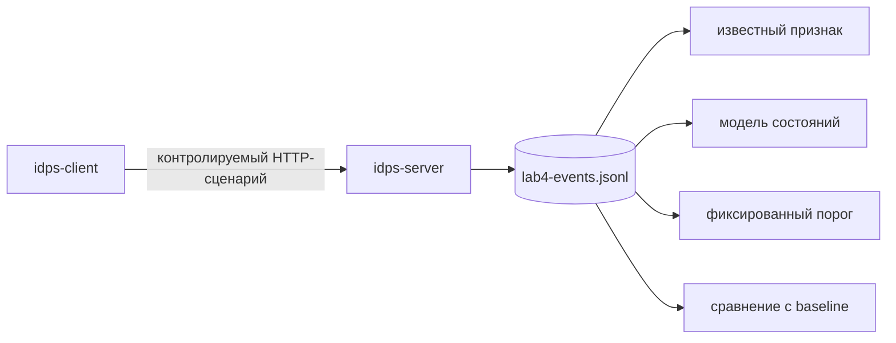

# Лабораторная работа №4 — Один набор данных, разные основания аналитического решения

<div class="chapter-lead">
<p>В этой работе источник данных и сам набор событий остаются неизменными. Меняется основание, по которому аналитическая логика выделяет событие или серию событий. На одном контролируемом журнале мы сравним известный признак, нарушение модели состояния, фиксированное условие над серией событий и отклонение от базового профиля. Это не четыре универсальных типа IDS и не единая таксономия методов обнаружения: это четыре разных вопроса, которые можно задать одному набору наблюдений.</p>
</div>

[Скачать пакет ЛР №4 v0.2](../../assets/downloads/idps-lab04-bundle-v0.2.zip){ .md-button .md-button--primary }
[SHA-256](../../assets/downloads/idps-lab04-bundle-v0.2.zip.sha256){ .md-button }

!!! note "Проверьте пакет перед распаковкой"
    Поместите ZIP и файл `.sha256` в один каталог и выполните `sha256sum -c idps-lab04-bundle-v0.2.zip.sha256`. После `OK` просмотрите содержимое командой `unzip -l idps-lab04-bundle-v0.2.zip`. Контрольная сумма с того же сайта подтверждает целостность и соответствие опубликованной версии, но не является независимой цифровой подписью происхождения.



```mermaid
flowchart LR
    C["idps-client"] -->|контролируемый HTTP-сценарий| S["idps-server"]
    S --> J[("lab4-events.jsonl")]
    J --> SG["известный признак"]
    J --> ST["модель состояний"]
    J --> TH["фиксированный порог"]
    J --> AN["сравнение с baseline"]
```

Здесь важно не перепутать разные уровни. Известный признак и anomaly detection описывают разные способы получения аналитического решения; state/context требует истории и семантики последовательности; threshold/window/count — это конкретное условие над серией наблюдений, которое может использоваться внутри разных аналитических моделей. В этой лаборатории они специально сведены к одному dataset, чтобы сравнить основания решения, а не построить классификацию IDS.

## Подготовьте один чистый набор событий

На `idps-server`:

```bash
cd idps-lab04-bundle-v0.2
sudo bash server/setup-server.sh
sudo bash server/preflight-server.sh
sudo bash server/reset-evidence.sh
```

Нужны `SERVER PRE-FLIGHT PASSED.` и сообщение об очистке `lab4-events.jsonl`. Убедитесь, что журнал действительно пуст:

```bash
wc -l /var/tmp/idps-lab/lab4-events.jsonl
```

Ожидается `0`. Эта очистка принципиальна: все четыре анализа должны использовать один и тот же текущий эксперимент, а не смесь старых и новых данных.

На `idps-client`:

```bash
cd idps-lab04-bundle-v0.2
bash client/check-client.sh
```

После `CLIENT CHECK PASSED.` снова очистите журнал на сервере:

```bash
sudo bash server/reset-evidence.sh
```

Client check сам делает технический HTTP-запрос, поэтому его след не должен остаться в основном наборе.

## Создайте сценарий

На `idps-client`:

```bash
bash client/run-scenario.sh
```

Сценарий формирует четыре логические части, но записывает их в один JSONL:

| Фаза | Что происходит | Зачем это нужно |
|---|---|---|
| baseline | 6 запросов `/catalog` с интервалом около 0.8 с | дать измеряемый базовый профиль |
| known marker | один `/download/LAB4-KNOWN-BAD` | дать известный признак |
| state sequence | `DATA` до `START`, затем корректные `START → DATA → END` | создать одно нарушение модели состояния |
| burst | после технической паузы 8 быстрых `/catalog` | проверить fixed threshold и сравнение с baseline |

Пауза перед burst отделяет его от хвоста baseline. Она нужна для чистоты эксперимента, а не является признаком обнаружения.

После завершения ожидается сообщение о 19 событиях. На сервере подтвердите:

```bash
wc -l /var/tmp/idps-lab/lab4-events.jsonl
```

Если строк не 19, анализировать детекторы рано: сначала исправьте сам эксперимент.

## Посмотрите исходный журнал до любого решения

```bash
sed -n '1,25p' /var/tmp/idps-lab/lab4-events.jsonl
```

Журнал содержит timestamp, источник и назначение, HTTP method, path/query и техническую метку `phase`. `phase` используется для разделения частей контролируемого сценария и сама по себе не является индикатором атаки.

Порядок synthetic session events:

```bash
grep '"path": "/session/' /var/tmp/idps-lab/lab4-events.jsonl
```

Должно быть видно:

```text
/session/data
/session/start
/session/data
/session/end
```

Первое `DATA` специально идёт раньше `START`.

## Известный признак

```bash
python3 server/analyze-methods.py --method signature
```

Ожидаемая форма:

```text
METHOD=signature
CONDITION=path == /download/LAB4-KNOWN-BAD
MATCHES=1
SIGNATURE MATCH ...
```

Здесь решение опирается на заранее известный признак. Из такого совпадения можно утверждать только, что в журнале есть событие, удовлетворившее этому условию. `LAB4-KNOWN-BAD` — синтетический маркер; сам факт совпадения не доказывает компрометацию.

## Модель состояния

```bash
python3 server/analyze-methods.py --method protocol
```

Учебная модель:

```text
IDLE --START--> OPEN
OPEN --DATA--> OPEN
OPEN --END--> IDLE
```

Ожидается одна state violation для `DATA` в состоянии `IDLE`:

```text
METHOD=protocol
VIOLATIONS=1
STATE VIOLATION ... state=IDLE action=DATA
```

Это не правило стандарта HTTP. Мы намеренно построили маленький синтетический протокол поверх HTTP-маршрутов, чтобы состояние было явным и воспроизводимым. Допустимый вывод: наблюдаемая последовательность нарушила заданную модель этого учебного протокола.


## Как эта учебная модель связана с реальным IDPS

Синтетическая state machine выше нужна для прозрачного эксперимента: студент заранее знает допустимые переходы и может точно объяснить причину violation. Она **не является моделью внутреннего устройства Suricata**. В реальном сетевом IDPS контекст формируется несколькими механизмами одновременно:

| Механизм | Что он добавляет к наблюдению |
|---|---|
| flow / stream tracking | направление, состояние и контекст сетевого потока |
| app-layer parser | протокольные транзакции и семантические поля, например HTTP URI |
| `flow` в правиле | ограничение match по направлению и состоянию потока, например `established,to_server` |
| `flowbits` | возможность помечать и проверять состояние внутри потока между связанными правилами; это не замена TCP- или app-layer state machine |

Поэтому правильный перенос идеи из этой лаборатории выглядит так:

```text
учебная последовательность START → DATA → END
        ↓
контекст меняет смысл следующего события
        ↓
в реальном IDPS контекст может приходить
из stream/flow state, app-layer parser и связанных rule conditions
```

Задача ЛР №4 — понять сам принцип: **одинаковое наблюдение может оцениваться по разным основаниям, а история и контекст иногда являются частью входа в решение**. Следующая ЛР переводит эту идею в конкретное правило Suricata.

## Фиксированный временной порог

```bash
python3 server/analyze-methods.py --method threshold
```

Детектор применяет заранее заданное условие:

```text
один источник + /catalog + не менее 5 запросов + окно 2 секунды
```

Ожидается один match. Важная деталь: baseline здесь не используется вообще. Порог был задан до анализа и применяется напрямую к серии событий.

Поэтому `threshold match` означает выполнение конкретного фиксированного условия, а не доказанную аномальность относительно реальной организации.

## Отклонение от baseline

```bash
python3 server/analyze-methods.py --method anomaly
```

Этот детектор уже использует baseline: вычисляет медианный интервал между baseline-событиями `/catalog`, затем сравнивает его с burst.

Ожидаемая форма:

```text
METHOD=anomaly
BASELINE_EVENTS=6 BURST_EVENTS=8
BASELINE_MEDIAN_INTERVAL=...
BURST_MEDIAN_INTERVAL=...
SPEED_RATIO=... THRESHOLD=3.00x
ANOMALY=YES
```

Точные интервалы зависят от VM. Важно, чтобы burst был как минимум в три раза быстрее baseline по выбранной метрике. Даже при `ANOMALY=YES` нельзя утверждать вредоносность: шесть учебных запросов — демонстрационный baseline, а не репрезентативная модель рабочей инфраструктуры.

## Сопоставьте основания аналитического решения, а не «типы IDS»

```bash
python3 server/analyze-methods.py --method all
```

В конце ожидается сводка с `DETECTED` для всех четырёх анализов. Аргумент CLI `--method` здесь является только именем режима учебного скрипта; он не объявляет четыре универсальные методологии IDS. Все режимы работают с одним файлом событий, но принимают решение по разным основаниям:

| Режим учебного анализа | На чём основано решение | Нужна история событий | Нужен baseline |
|---|---|---:|---:|
| signature | заранее известный признак | не обязательно | нет |
| state/protocol | допустимое состояние и переход | да | нет |
| threshold | заранее установленное условие над серией | да | нет |
| anomaly | отклонение от измеренной модели | да | да |

Самое важное различие этой работы: **фиксированный порог и anomaly detection — не одно и то же**, даже если оба анализируют частоту `/catalog`.

## Что сдаётся

Используйте `report/lab04-report.md` и приложите исходный `lab4-events.jsonl`. Скриншоты сами по себе недостаточны: преподавателю нужен тот набор данных, на котором запускались все четыре анализа.

| Evidence | Что подтверждает |
|---|---|
| `lab4-events.jsonl` | единый исходный набор событий |
| `--method signature` | результат известного признака |
| `--method protocol` | результат state model |
| `--method threshold` | fixed threshold |
| `--method anomaly` | сравнение с baseline |
| `--method all` | согласованную сводку одного эксперимента |

## Если результат отличается от ожидаемого

| Симптом | Что проверить |
|---|---|
| больше 19 строк | журнал не был очищен после client check |
| меньше 19 строк | сценарий не завершился или HTTP-сервис недоступен |
| signature `MATCHES=0` | есть ли `/download/LAB4-KNOWN-BAD` в JSONL |
| protocol `VIOLATIONS=0` | действительно ли первое `/session/data` идёт до `/session/start` |
| threshold `MATCHES=0` | burst создавался без искусственной задержки |
| `ANOMALY=NO` | сравните интервалы baseline и burst; повторите чистый прогон на ненагруженных VM |
| `ANOMALY=INDETERMINATE` | хватает ли событий в обеих фазах |

Итоговая идея ЛР №4 проста: один и тот же источник данных может поддерживать разные detection decisions, если меняется основание анализа. Это подготавливает следующую работу, где условие уже будет выражено в конкретном правиле Suricata.
