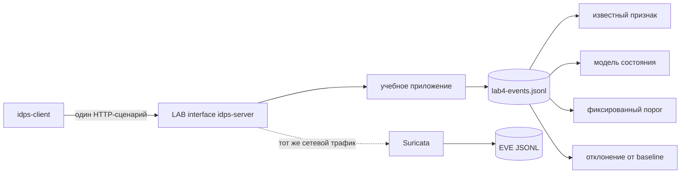

# Лабораторная работа №4 — Один набор данных, разные основания аналитического решения

<div class="chapter-lead">
<p>В этой работе вы проверите, почему один и тот же набор наблюдений может приводить к разным аналитическим решениям. Источник и dataset остаются неизменными, а detector задаёт к данным другой вопрос: ищет известный признак, проверяет допустимость последовательности, применяет фиксированный порог или сравнивает наблюдение с baseline. Цель — не запомнить четыре названия, а понять, какие входные факты и контекст нужны каждому решению и какие выводы из результата допустимы.</p>
</div>

[Скачать пакет ЛР №4 v0.3.1](../../assets/downloads/idps-lab04-bundle-v0.3.1.zip){ .md-button .md-button--primary }
[SHA-256](../../assets/downloads/idps-lab04-bundle-v0.3.1.zip.sha256){ .md-button }

!!! note "Проверьте пакет перед распаковкой"
    Поместите ZIP и файл `.sha256` в один каталог и выполните `sha256sum -c idps-lab04-bundle-v0.3.1.zip.sha256`. После `OK` просмотрите содержимое командой `unzip -l idps-lab04-bundle-v0.3.1.zip`. Контрольная сумма с того же сайта подтверждает целостность и соответствие опубликованной версии, но не является независимой цифровой подписью происхождения.


```mermaid
flowchart LR
    C["idps-client"] -->|"один HTTP-сценарий"| I["LAB interface idps-server"]
    I --> A["учебное приложение"]
    A --> J[("lab4-events.jsonl")]
    I -. "тот же сетевой трафик" .-> S["Suricata"]
    S --> E[("EVE JSONL")]
    J --> SG["известный признак"]
    J --> ST["модель состояния"]
    J --> TH["фиксированный порог"]
    J --> AN["отклонение от baseline"]
```

В этой работе есть два уровня evidence:

1. `lab4-events.jsonl` — application evidence, на котором работают четыре прозрачных учебных анализа;
2. EVE Suricata — независимый сетевой evidence для готового правила SID `1000005` на известный HTTP-marker.

Suricata здесь не заменяет Python-модель. Она нужна как мост к реальному IDPS. Изменять правило студент будет уже в ЛР №5.

## 0. Зачем нужна эта лабораторная

К этому моменту из Главы 5 известно, что detector может принимать решение на разных основаниях. В ЛР №4 эти различия проверяются **на одном и том же dataset**, чтобы не спутать изменение входных данных с изменением логики анализа.

Главный вопрос работы:

```text
если исходные данные одинаковы,
почему разные detector logic выделяют разные части набора?
```

После работы вы должны уметь:

- объяснить разницу между известным признаком, состоянием/последовательностью, фиксированным порогом и отклонением от baseline;
- определить, какие входные данные и контекст нужны каждому решению;
- объяснить, почему разные detector logic могут сработать на разных частях одного dataset;
- отделить факт срабатывания detector от вывода «атака доказана».

## 1. Что нужно помнить из Главы 5

Здесь не вводится новая классификация IDS. Ниже — четыре разных **вопроса к данным**, которые уже разбирались в Главе 5.

| Понятие | Что означает в этой работе | Чего из него нельзя заключать автоматически |
|---|---|---|
| известный признак / marker | заранее определённое условие, которое можно проверить в наблюдаемом поле | совпадение само по себе не доказывает компрометацию |
| состояние / последовательность | смысл текущего события зависит от того, что происходило раньше | нарушение учебной модели не равно доказанной атаке |
| фиксированный порог | заранее заданное условие над серией событий в окне времени | наличие счётчика или окна не превращает detector в anomaly-based |
| baseline и отклонение | текущая серия сравнивается с измеренной базовой моделью | «необычно» не означает «вредоносно» |

В Live Console вы встретите короткие подписи `marker`, `state`, `threshold`, `anomaly` и `burst`. Они обозначают эти же понятия, а не новые темы.

## 2. Подготовьте стенд

На `IDPS-server`:

```bash
cd ~/idps-lab04-bundle-v0.3.1
sudo bash server/setup-server.sh
sudo bash server/preflight-server.sh
sudo bash server/reset-evidence.sh
```

Нужен результат:

```text
SERVER PRE-FLIGHT PASSED.
```

Проверьте, что application journal пуст:

```bash
wc -l /var/tmp/idps-lab/lab4-events.jsonl
```

Ожидается `0`.

На `IDPS-client`:

```bash
cd ~/idps-lab04-bundle-v0.3.1
bash client/check-client.sh
```

`check-client.sh` делает технический HTTP-запрос. Поэтому после `CLIENT CHECK PASSED.` снова выполните на сервере:

```bash
sudo bash server/reset-evidence.sh
```

## 3. Изучите условия контролируемого сценария

**Prediction делается не вслепую.** До запуска трафика вам известны и состав dataset, и условия, по которым работают учебные detector.

Сценарий создаст один JSONL из четырёх частей:

| phase | Что произойдёт | Зачем это нужно |
|---|---|---|
| `baseline` | 6 запросов `/catalog` с интервалом около 0.8 с | получить измеряемый базовый темп |
| `marker` | один `/download/LAB4-KNOWN-BAD` | создать заранее известный признак |
| `state` | `DATA` до `START`, затем `START → DATA → END` | получить одно нарушение и одну допустимую последовательность |
| `burst` | 8 быстрых `/catalog` после паузы | создать серию для fixed threshold и сравнения с baseline |

Поле `phase` — **разметка контролируемого эксперимента**. Оно помогает нам знать ground truth при проверке результатов, но не является признаком вредоносности и не подаётся detector как готовый ответ.

Условия анализаторов также известны заранее:

| Detector | Какой вопрос он задаёт | Нужна история | Нужен baseline |
|---|---|---:|---:|
| известный признак | `path == /download/LAB4-KNOWN-BAD`? | нет | нет |
| состояние | допустимо ли текущее действие в текущем состоянии? `DATA/END` в `IDLE` считаются нарушением | да | нет |
| fixed threshold | есть ли от одного источника не менее 5 запросов `/catalog` за 2 секунды? | да | нет |
| anomaly | стал ли burst не менее чем в 3 раза быстрее baseline по медианному интервалу между событиями? | да | да |

Отдельно Suricata применит готовое правило SID `1000005` к HTTP URI с `LAB4-KNOWN-BAD`. Это реальный IDPS bridge для известного признака, а не пятый аналитический метод.

## 4. Сделайте prediction

Откройте в браузере хоста:

```text
http://10.13.37.20:9090
```

Не запускайте сценарий сразу. Сначала, используя условия выше, зафиксируйте прогноз в Live Console и в отчёте. Ответьте себе на конкретные вопросы:

1. Должен ли detector известного признака сработать? На каком событии?
2. Какое событие должно нарушить state model?
3. Должен ли **baseline** выполнить условие `≥5 /catalog за 2 секунды`?
4. Должен ли **burst** выполнить то же fixed-threshold условие?
5. Ожидаете ли `ANOMALY=YES` при сравнении burst с baseline? Почему?
6. Должна ли Suricata создать alert SID `1000005`, если marker будет захвачен на LAB-интерфейсе?
7. Доказывает ли любое ожидаемое срабатывание реальную атаку?

Live Console сохраняет prediction в браузере. Она **не создаёт трафик, не запускает Suricata и не является источником истины**. Фактический результат появится только после эксперимента и будет проверяться по raw evidence.

## 5. Запустите реальный сетевой сенсор

На `IDPS-server` в отдельном терминале:

```bash
cd ~/idps-lab04-bundle-v0.3.1
source server/load-vars.sh
rm -rf "$HOME/lab04-suricata-run"
mkdir -p "$HOME/lab04-suricata-run"

sudo suricata -k none -c /etc/suricata/suricata.yaml \
  -S "$PWD/server/lab04.rules" \
  -i "$LAB_IFACE" \
  -l "$HOME/lab04-suricata-run"
```

Что эта команда подтверждает и чего не подтверждает:

- `-i "$LAB_IFACE"` задаёт observation point;
- `-S .../lab04.rules` загружает готовое учебное правило;
- `-l ...` задаёт каталог EVE;
- сам факт запуска Suricata **ещё не доказывает**, что нужный запрос был захвачен или что правило сработало.

Оставьте Suricata работать в foreground.

## 6. Создайте контролируемый сценарий

На `IDPS-client`:

```bash
bash client/run-scenario.sh
```

Скрипт реализует именно тот contract, который был описан **до prediction**. После `SCENARIO COMPLETE` остановите Suricata одним `Ctrl+C`.

Теперь prediction зафиксирован, dataset создан, и можно переходить от гипотезы к наблюдению.

## 7. Сначала проверьте исходные данные

На `IDPS-server`:

```bash
wc -l /var/tmp/idps-lab/lab4-events.jsonl
```

Ожидается:

```text
19 /var/tmp/idps-lab/lab4-events.jsonl
```

Если событий не 19, анализировать решения рано. Сначала исправьте эксперимент.

Посмотрите raw JSONL:

```bash
sed -n '1,25p' /var/tmp/idps-lab/lab4-events.jsonl
```

Проверьте последовательность session events:

```bash
grep '"path": "/session/' /var/tmp/idps-lab/lab4-events.jsonl
```

Должно быть:

```text
/session/data
/session/start
/session/data
/session/end
```

Первое `DATA` специально появляется при состоянии `IDLE`.

## 8. Известный признак

```bash
python3 server/analyze-methods.py --method signature
```

Ожидаемая форма:

```text
METHOD=signature
CONDITION=path == /download/LAB4-KNOWN-BAD
MATCHES=1
SIGNATURE MATCH ...
```

Допустимый вывод: в application journal есть событие, удовлетворившее заранее заданному условию.

Недопустимый вывод: «узел скомпрометирован». `LAB4-KNOWN-BAD` — синтетический marker.

## 9. Состояние и семантика последовательности

```bash
python3 server/analyze-methods.py --method protocol
```

Учебная модель:

```text
IDLE --START--> OPEN
OPEN --DATA--> OPEN
OPEN --END--> IDLE
```

Ожидается:

```text
VIOLATIONS=1
STATE VIOLATION ... state=IDLE action=DATA
```

Это не модель HTTP и не модель внутреннего устройства Suricata. Она делает зависимость результата от истории событий максимально прозрачной.

В реальном IDPS аналогичный контекст может формироваться за счёт:

| Механизм | Что он добавляет |
|---|---|
| flow / stream tracking | направление и состояние сетевого потока |
| app-layer parser | транзакции и семантические поля протокола |
| `flow` в правиле | условия по направлению и состоянию потока |
| `flowbits` | состояние между связанными rule conditions внутри потока |

`flowbits` не является заменой TCP state machine или app-layer parser.

## 10. Фиксированный порог

```bash
python3 server/analyze-methods.py --method threshold
```

Условие задано **до анализа**:

```text
один источник
+ /catalog
+ не менее 5 запросов
+ окно 2 секунды
```

Ожидается один `THRESHOLD MATCH`.

Baseline этому detector не нужен. Следовательно, выполнение fixed threshold **не равно** anomaly detection.

## 11. Отклонение от baseline

```bash
python3 server/analyze-methods.py --method anomaly
```

Ожидаемая форма:

```text
BASELINE_EVENTS=6 BURST_EVENTS=8
BASELINE_MEDIAN_INTERVAL=...
BURST_MEDIAN_INTERVAL=...
SPEED_RATIO=... THRESHOLD=3.00x
ANOMALY=YES
```

Здесь baseline используется явно. `ANOMALY=YES` означает только, что burst по выбранной метрике отличается от учебного baseline не меньше заданного коэффициента.

Шесть запросов — демонстрационный baseline, а не репрезентативная модель рабочей инфраструктуры. Поэтому `ANOMALY=YES` не означает `malicious=yes`.

## 12. Сравните все четыре основания

```bash
python3 server/analyze-methods.py --method all
```

В чистом сценарии ожидается `DETECTED` во всех четырёх режимах.

| Режим | Основание решения | История событий | Baseline |
|---|---|---:|---:|
| signature | заранее известный признак | нет | нет |
| protocol/state | допустимое состояние и переход | да | нет |
| threshold | заранее установленное условие над серией | да | нет |
| anomaly | отклонение от измеренной модели | да | да |

Эта таблица **не является классификацией типов IDS**. Она сравнивает, какие входные факты нужны разной аналитической логике.

## 13. Проверьте мост к Suricata

Сначала подтвердите наличие HTTP representation в EVE:

```bash
jq 'select(.event_type=="http" and (.http.url // "" | contains("LAB4-KNOWN-BAD")))' \
  "$HOME/lab04-suricata-run/eve.json"
```

Затем alert готового правила:

```bash
jq 'select(.event_type=="alert" and .alert.signature_id==1000005)' \
  "$HOME/lab04-suricata-run/eve.json"
```

Ожидается SID:

```text
1000005
```

Теперь у вас есть два независимых слоя evidence:

- `lab4-events.jsonl` подтверждает, что запрос обработало приложение;
- EVE подтверждает, что Suricata наблюдала сетевое представление и готовое правило сформировало alert.

Ни один из этих фактов сам по себе не доказывает компрометацию.

## 14. Вернитесь в Live Console

Live Console должна показать:

- `19/19` application events;
- распределение `baseline=6`, `marker=1`, `state=4`, `burst=8`;
- результаты четырёх анализов;
- EVE текущей сессии;
- HTTP event с marker;
- alert SID `1000005`;
- сравнение вашего prediction с фактическим evidence.

Если raw CLI и Live Console расходятся, доверяйте raw evidence и зафиксируйте расхождение как дефект лаборатории.

## Что сдаётся

Используйте `report/lab04-report.md` и приложите:

- `lab4-events.jsonl`;
- CLI-вывод `--method all`;
- raw EVE alert SID `1000005`;
- заполненное сравнение оснований решения.

Скриншот Live Console может быть дополнительным evidence, но не заменяет raw JSONL.

## Если результат отличается от ожидаемого

| Симптом | Что проверить |
|---|---|
| больше 19 строк | журнал не был очищен после client check |
| меньше 19 строк | сценарий не завершился или target недоступен |
| signature `MATCHES=0` | есть ли `/download/LAB4-KNOWN-BAD` в application JSONL |
| protocol `VIOLATIONS=0` | действительно ли первое `/session/data` идёт до `/session/start` |
| threshold `MATCHES=0` | burst создавался без искусственной задержки |
| `ANOMALY=NO` | сравните интервалы baseline/burst; повторите чистый прогон на ненагруженной VM |
| EVE отсутствует | был ли Suricata запущен до сценария и указан ли правильный `$LAB_IFACE` |
| SID `1000005` отсутствует, но HTTP event есть | проверьте, что использовался именно `server/lab04.rules` и `suricata -T` проходил |
| Live Console показывает старый EVE | выполните `sudo bash server/reset-evidence.sh` перед новым прогоном |

Итоговая идея ЛР №4: **один dataset не диктует единственный способ анализа. Решение зависит от того, какие признаки, история, baseline и логика входят в detector; а каждый результат имеет свои границы допустимого вывода.**
