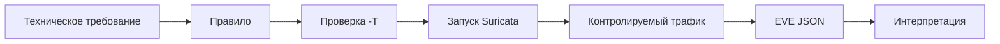

# Лабораторная работа №5

## Первое собственное правило Suricata

<div class="lab-header">
  <div><strong>Уровень:</strong> базовый</div>
  <div><strong>Инструменты:</strong> Suricata 8.x, curl, jq, nano</div>
  <div><strong>Теория:</strong> Глава 6 — правила Suricata</div>
</div>

<div class="chapter-lead">
<p>В предыдущих работах правила были подготовлены заранее. Теперь впервые вы будете работать с правилом как с формальным объектом: сначала прочитаете готовую сигнатуру, затем измените одну существующую сигнатуру и, наконец, самостоятельно запишете простое правило по техническому требованию.</p>

<p>Цель работы — не написать «сложную сигнатуру», а доказать, что вы понимаете связь <strong>условие → синтаксис → тест → результат</strong>.</p>
</div>

---

## Что должна доказать работа

После выполнения вы должны уметь показать три разных результата:

```text
1. Я могу прочитать правило и объяснить каждую его часть.
2. Я могу изменить условие и предсказать, как изменится результат.
3. Я могу записать простое правило с нуля и проверить его положительным и отрицательным тестами.
```

<div class="teaching-figure" markdown="1">
<div class="figure-label">СХЕМА · ОТ ТРЕБОВАНИЯ К ПРОВЕРЕННОМУ ПРАВИЛУ</div>



<div class="figure-caption">Успешный <code>-T</code> подтверждает загрузку правила, но только контролируемый трафик показывает, как правило ведёт себя в эксперименте.</div>
</div>

---

## Что необходимо до начала

Должны быть завершены:

- [Шаг 0 — подготовка лабораторной среды](../environment/);
- Глава 6;
- ЛР №1–4.

Стенд:

```text
idps-client
10.13.37.10
     │
     │ HTTP
     ▼
idps-server
10.13.37.20:8080
     │
     └── Suricata слушает учебный интерфейс
```

[Скачать пакет ЛР №5 v0.1](../../assets/downloads/idps-lab05-bundle-v0.1.zip){ .md-button .md-button--primary }

!!! important "Работаем только в учебной сети"
    Все адреса и маркеры этой лабораторной относятся к изолированному стенду `IDPS-LAB`. Не переносите правила из работы в реальную инфраструктуру как готовые правила для рабочей инфраструктуры.

---

# 1. Распакуйте пакет на обеих VM

На `idps-server` и `idps-client`:

```bash
cd ~
unzip idps-lab05-bundle-v0.1.zip
cd idps-lab05-bundle-v0.1
```

Структура:

```text
client/
server/
rules/
report/
```

---

# 2. Подготовьте сервер

На `idps-server`:

```bash
cd ~/idps-lab05-bundle-v0.1
sudo bash server/setup-server.sh
sudo bash server/preflight-server.sh
```

Продолжайте только после:

```text
SERVER PRE-FLIGHT PASSED.
```

Если предварительная проверка сообщает о включённых механизмах разгрузки сетевого стека, выполните:

```bash
sudo bash server/prepare-capture.sh
```

В каждом новом терминале сервера загрузите имя учебного интерфейса:

```bash
cd ~/idps-lab05-bundle-v0.1
source server/load-vars.sh
```

После этого должна существовать переменная:

```bash
echo "$LAB_IFACE"
```

и вывод должен указывать на интерфейс с адресом `10.13.37.20/24`.

---

# 3. Проверьте клиент

На `idps-client`:

```bash
cd ~/idps-lab05-bundle-v0.1
bash client/check-client.sh
```

Продолжайте только после:

```text
CLIENT CHECK PASSED.
```

---

# Часть A. Прочитать готовое правило

## 4. Откройте базовое правило

На сервере:

```bash
cat rules/01-base.rules
```

Вы увидите:

```suricata
alert http 10.13.37.10 any -> 10.13.37.20 8080 (msg:"LAB5 base URI marker"; flow:established,to_server; http.uri; content:"LAB5-BASE"; sid:1000501; rev:1;)
```

Не запускайте его сразу. Сначала заполните в отчёте таблицу разбора:

- действие;
- протокол;
- источник и исходный порт;
- направление;
- назначение и порт;
- `flow`;
- выбранное представление;
- проверяемое значение;
- `msg`;
- `sid`;
- `rev`.

<div class="callout-banner">
<strong>Перед экспериментом сформулируйте прогноз:</strong> какой запрос должен вызвать SID 1000501, а какой — не должен?
</div>

---

## 5. Проверьте синтаксис

На сервере:

```bash
sudo suricata -T \
  -c /etc/suricata/suricata.yaml \
  -S "$PWD/rules/01-base.rules"
```

Если команда завершается успешно, можно утверждать только следующее:

> Suricata приняла конфигурацию и данный файл правил.

Нельзя пока утверждать, что правило действительно увидит нужный HTTP-запрос.

---

## 6. Запустите Suricata для первого эксперимента

### Терминал Server A

```bash
cd ~/idps-lab05-bundle-v0.1
source server/load-vars.sh
sudo rm -rf "$HOME/lab05-base-run"
mkdir -p "$HOME/lab05-base-run"

sudo suricata \
  -c /etc/suricata/suricata.yaml \
  -S "$PWD/rules/01-base.rules" \
  -i "$LAB_IFACE" \
  -l "$HOME/lab05-base-run" \
  -k none
```

Оставьте процесс работающим.

!!! note "Почему отдельный каталог"
    Каждый этап пишет результаты в свой каталог. Так оповещение из предыдущего эксперимента не может быть ошибочно принято за результат нового запуска.

---

## 7. Выполните отрицательный и положительный тесты

### Терминал Client

Сначала обычный запрос:

```bash
curl -sS 'http://10.13.37.20:8080/normal'
```

Затем запрос с маркером:

```bash
curl -sS 'http://10.13.37.20:8080/lab5/LAB5-BASE'
```

Вернитесь в `Server A` и остановите Suricata:

```text
Ctrl+C
```

### Терминал Server B

Проверьте только SID `1000501`:

```bash
jq -c 'select(.event_type=="alert" and .alert.signature_id==1000501)
       | {timestamp,src_ip,dest_ip,http,alert}' \
  "$HOME/lab05-base-run/eve.json"
```

Ожидание:

```text
/normal
→ нет SID 1000501

/lab5/LAB5-BASE
→ есть SID 1000501
```

Если результат отличается — не переходите дальше. Сначала используйте раздел [«Если результат не совпал с ожиданием»](#если-результат-не-совпал-с-ожиданием).

---

# Часть B. Изменить существующее правило

## 8. Создайте рабочую копию

На сервере:

```bash
cd ~/idps-lab05-bundle-v0.1
cp rules/02-modify-starter.rules rules/02-modify.rules
nano rules/02-modify.rules
```

Исходная сигнатура содержит:

```text
content:"LAB5-OLD";
sid:1000502;
rev:1;
```

Измените правило так, чтобы:

```text
старый маркер: LAB5-OLD
новый маркер:  LAB5-NEW
```

Требования:

1. `sid` должен остаться `1000502`;
2. `content` должен искать `LAB5-NEW`;
3. текст `msg` должен отражать новый маркер;
4. `rev` должен стать `2`.

Не изменяйте остальные части правила.

---

## 9. Сначала снова выполните `-T`

```bash
sudo suricata -T \
  -c /etc/suricata/suricata.yaml \
  -S "$PWD/rules/02-modify.rules"
```

Если есть синтаксическая ошибка, исправьте её до запуска трафика.

---

## 10. Проверьте, что изменение действительно изменило поведение

### Server A

```bash
source server/load-vars.sh
sudo rm -rf "$HOME/lab05-modified-run"
mkdir -p "$HOME/lab05-modified-run"

sudo suricata \
  -c /etc/suricata/suricata.yaml \
  -S "$PWD/rules/02-modify.rules" \
  -i "$LAB_IFACE" \
  -l "$HOME/lab05-modified-run" \
  -k none
```

### Client

Сначала отправьте **старый** маркер:

```bash
curl -sS 'http://10.13.37.20:8080/lab5/LAB5-OLD'
```

Затем **новый**:

```bash
curl -sS 'http://10.13.37.20:8080/lab5/LAB5-NEW'
```

Остановите Suricata через `Ctrl+C`.

### Server B

```bash
jq -c 'select(.event_type=="alert" and .alert.signature_id==1000502)
       | {timestamp,http,alert}' \
  "$HOME/lab05-modified-run/eve.json"
```

Ожидание после правильного изменения:

```text
LAB5-OLD → нет SID 1000502
LAB5-NEW → есть SID 1000502, rev 2
```

В отчёте объясните, почему `sid` сохранился, а `rev` изменился.

---

# Часть C. Написать собственное правило

## 11. Получите техническое требование

Создайте правило со следующей логикой:

> Сформировать оповещение только для установленного HTTP-взаимодействия от `10.13.37.10` к `10.13.37.20:8080`, когда метод запроса — `GET`, а нормализованный URI содержит `LAB5-STUDENT`.

Метаданные:

```text
msg = LAB5 student GET marker
sid = 1000503
rev = 1
```

Файл уже создан как шаблон:

```bash
nano rules/03-student.rules
```

Запишите правило самостоятельно.

!!! important
    Сначала переведите требование на обычные части правила: заголовок → `flow` → поле метода → поле URI → метаданные. Не копируйте правило из предыдущей части и не меняйте строки наугад.

---

## 12. Проверьте правило до запуска

```bash
sudo suricata -T \
  -c /etc/suricata/suricata.yaml \
  -S "$PWD/rules/03-student.rules"
```

Если `-T` не проходит, прочитайте первую ошибку Suricata и исправьте её. Не переходите к HTTP-тестам с правилом, которое движок не принимает.

---

## 13. Запустите третий изолированный эксперимент

### Server A

```bash
source server/load-vars.sh
sudo rm -rf "$HOME/lab05-student-run"
mkdir -p "$HOME/lab05-student-run"

sudo suricata \
  -c /etc/suricata/suricata.yaml \
  -S "$PWD/rules/03-student.rules" \
  -i "$LAB_IFACE" \
  -l "$HOME/lab05-student-run" \
  -k none
```

### Client

Выполните три теста в указанном порядке.

**Тест 1 — GET + нужный URI:**

```bash
curl -sS 'http://10.13.37.20:8080/lab5/LAB5-STUDENT'
```

**Тест 2 — POST + тот же URI:**

```bash
curl -sS -X POST 'http://10.13.37.20:8080/lab5/LAB5-STUDENT'
```

**Тест 3 — GET без маркера:**

```bash
curl -sS 'http://10.13.37.20:8080/normal'
```

Остановите Suricata через `Ctrl+C`.

### Server B

```bash
jq -c 'select(.event_type=="alert" and .alert.signature_id==1000503)
       | {timestamp,src_ip,dest_ip,http,alert}' \
  "$HOME/lab05-student-run/eve.json"
```

Для правила, соответствующего требованию, ожидается:

| Тест | Ожидаемый SID 1000503 |
|---|---:|
| GET + `LAB5-STUDENT` | есть |
| POST + `LAB5-STUDENT` | нет |
| GET `/normal` | нет |

Эта матрица важнее одного положительного запроса: она проверяет, что вы действительно выразили **оба** прикладных условия — метод и URI.

---

# 14. Сопоставьте сетевой результат с журналом приложения

Сервер также записывает принятые HTTP-запросы в:

```text
/var/tmp/idps-lab/lab5-access.jsonl
```

Посмотрите последние записи:

```bash
jq -c '{timestamp,src_ip,dst_ip,method,uri}' \
  /var/tmp/idps-lab/lab5-access.jsonl | tail -10
```

Это позволяет отличить две ситуации:

```text
запрос не дошёл до приложения
```

и:

```text
запрос дошёл, но конкретное правило не совпало
```

Журнал приложения здесь используется только как независимое подтверждение валидных HTTP-запросов. Он не является универсальным источником истины для любого L3/L4-события.

---

# Если результат не совпал с ожиданием

Проверяйте цепочку последовательно.

| Проверка | Команда / источник | Что устанавливаем |
|---|---|---|
| Сервер работает | `curl http://10.13.37.20:8080/health` | доступен ли HTTP-сервис |
| Запрос дошёл | `lab5-access.jsonl` | обработало ли приложение конкретный HTTP-запрос |
| Интерфейс выбран | `echo "$LAB_IFACE"` | слушаем ли интерфейс `10.13.37.20/24` |
| Трафик виден | `tcpdump -ni "$LAB_IFACE" tcp port 8080` | доступны ли пакеты в точке захвата |
| Правило загружается | `suricata -T ... -S rule.rules` | принят ли синтаксис |
| Правило использовалось | отдельный каталог `-l` | не смешаны ли результаты запусков |
| SID найден | `jq` по `signature_id` | сформировала ли именно эта сигнатура оповещение |

Не исправляйте всё одновременно. Если меняются и правило, и интерфейс, и тестовый запрос, причина результата становится неясной.

---

# 15. Что сдаётся

Скопируйте шаблон:

```bash
cp report/lab05-report.md ~/lab05-report.md
```

В отчёте должны быть:

1. разбор SID `1000501` по частям;
2. подтверждение отрицательного и положительного тестов базового правила;
3. изменённое правило SID `1000502` и объяснение `sid/rev`;
4. собственное правило SID `1000503`;
5. результаты трёх тестов собственного правила;
6. один фрагмент EVE JSON для собственного правила;
7. объяснение того, что подтверждает `-T`, что подтверждает оповещение и чего оно не доказывает.

Сохранять весь `eve.json` в отчёт не нужно.

---

# 16. Короткая защита

На защите преподаватель выбирает **одно** изменение, например:

```text
изменить маркер;
изменить метод GET → POST;
изменить порт назначения;
изменить msg;
```

До запуска студент должен сказать:

1. изменится ли условие совпадения;
2. какой тест теперь должен стать положительным или отрицательным;
3. нужно ли менять `sid` или `rev` и почему.

После этого изменение проверяется через `-T` и один контролируемый запрос.

<div class="assessment-note">
<strong>Что оценивается</strong>
<p>Не скорость набора синтаксиса, а способность связать техническое требование, конкретную часть правила и наблюдаемый результат эксперимента.</p>
</div>

---

# 17. Итог работы

После ЛР №5 студент должен уметь провести цепочку:

```text
техническое требование
        ↓
область применения правила
        ↓
выбранное представление данных
        ↓
условие
        ↓
msg / sid / rev
        ↓
проверка -T
        ↓
положительный + отрицательный тест
        ↓
EVE JSON
        ↓
корректная интерпретация
```

Следующая глава будет посвящена тому, почему даже такое проверенное правило может ошибаться, пропускать интересующее событие или работать с представлением данных, отличающимся от ожиданий автора.

!!! warning "Статус воспроизводимости"
    Скрипты и структура пакета проходят статическую проверку. Полный статус `«проверена полным прогоном»` присваивается только после сквозного прогона на эталонной паре Ubuntu Desktop/Server 24.04.x с фактической версией Suricata аудитории.
