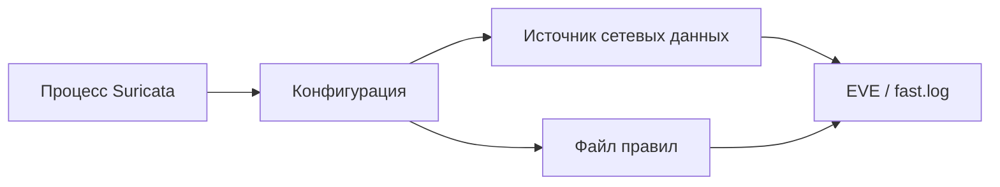

# Практикум 0 — Знакомство с рабочей IDPS

<div class="chapter-lead">
<p>Перед первой лабораторной полезно один раз увидеть Suricata как рабочую систему, а не как одну команду. Здесь мы не ищем атаки и не изучаем синтаксис правил. Задача — связать процесс, конфигурацию, источник данных, правила и результаты в одну операционную картину.</p>
</div>



Практикум выполняется на `idps-server` после подготовки среды. Перед началом checker должен завершаться строкой `SERVER ENVIRONMENT READY`.

## Что именно установлено

Версию покажет:

```bash
suricata -V
```

Сведения о сборке:

```bash
suricata --build-info | sed -n '1,20p'
```

`--build-info` отвечает на вопрос «что эта сборка технически поддерживает». Он не говорит, что соответствующая возможность уже включена в текущем запуске.

## Основная конфигурация

Проверьте файл:

```bash
sudo test -r /etc/suricata/suricata.yaml && echo 'suricata.yaml: readable'
sudo grep -n '^af-packet:' /etc/suricata/suricata.yaml | head
sudo grep -n '^outputs:' /etc/suricata/suricata.yaml | head
```

`/etc/suricata/suricata.yaml` описывает, как Suricata должна работать: capture, outputs, protocol parsers и другие параметры. Само существование файла не означает, что процесс уже запущен.

## Почему системная служба остановлена

Проверьте:

```bash
systemctl is-active suricata || true
systemctl is-enabled suricata || true
```

Перед лабораториями ожидается:

```text
inactive
disabled
```

Это сделано намеренно. В практических работах Suricata запускается вручную с конкретным `-i`, отдельным файлом правил и отдельным каталогом вывода. Так студент видит, какой именно процесс анализирует какой именно поток.

## Интерфейс учебной сети

Посмотрите адреса и маршруты:

```bash
ip -br addr
ip route
```

Найдите интерфейс с `10.13.37.20/24`. На типовом стенде это `enp0s8`, но важен адрес, а не имя.

Здесь нужно различать два утверждения:

| Наблюдение | Что оно подтверждает |
|---|---|
| Интерфейс существует и имеет `10.13.37.20/24` | сервер подключён к учебной сети |
| Suricata запущена с `-i <этот интерфейс>` | процесс получает данные из этой точки наблюдения |

Второе утверждение появится только в ЛР №1.

## Где находятся условия обнаружения

В стандартной установке Suricata знает о каталогах правил через конфигурацию, но в лабораторных мы не полагаемся на общий системный набор. Каждая работа поставляет свой небольшой `.rules` и передаёт его Suricata параметром `-S`.

До скачивания ЛР №1 никакого `lab01.rules` на сервере ещё быть не обязано. Сейчас достаточно понять роль файла правил: он содержит условия, которые движок применяет к доступным ему данным.

## Где появляется результат

Проверим, что базовая конфигурация вообще принимается движком. Создадим временный пустой файл правил:

```bash
touch /tmp/empty.rules
sudo suricata -T \
  -c /etc/suricata/suricata.yaml \
  -S /tmp/empty.rules
```

Сообщение о том, что rules не загружены, здесь ожидаемо: файл специально пустой. Нас интересует успешная загрузка конфигурации.

Когда Suricata будет реально запущена в лаборатории, результаты появятся в отдельном каталоге запуска. Основной структурированный журнал — `eve.json`; `fast.log` содержит компактные alert-записи; `suricata.log` описывает работу самого процесса.

## А где графический интерфейс?

Suricata сама по себе не требует GUI. В ЛР №1 и ЛР №2 курс добавляет Live Console как учебный визуальный слой. Она не заменяет движок и не создаёт события: консоль читает те же артефакты, которые потом можно проверить через `jq`, `tail` или `ausearch`.

## Операционная карта перед ЛР №1

```text
suricata -V
    → какая версия установлена

/etc/suricata/suricata.yaml
    → как движок настроен

10.13.37.20/24 на Host-Only
    → где находится учебная сеть

-S <lab.rules>
    → какие условия обнаружения загружены

-l <output-dir>
    → куда пишутся артефакты конкретного запуска
```

Этого достаточно для перехода к ЛР №1. Там каждый из этих элементов будет использован уже на реальном HTTP-потоке.
