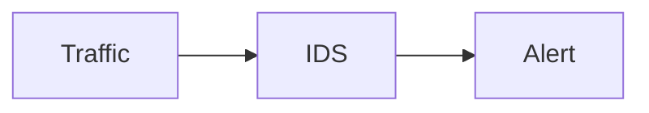

# Визуальные элементы курса

Курс использует несколько типов визуализации.

| Тип | Когда использовать |
|---|---|
| Mermaid | Простые архитектурные схемы, flowchart, sequence diagram |
| SVG | Сложные сетевые топологии и тщательно оформленные учебные схемы |
| PNG/WebP | Скриншоты Wireshark, Suricata, Wazuh |
| GIF/animated WebP | Короткая демонстрация динамического процесса |
| Content Tabs | Разделение ролей, ОС, Client/Sensor/Target |
| Code Annotations | Пояснение отдельных параметров конфигурации |

!!! tip
    Mermaid используется для схем, которые часто меняются вместе с текстом. Сложные схемы не следует насильно помещать в Mermaid: читабельность важнее унификации.

## Пример Mermaid

## Пример изображения

  
  
Подпись к учебной схеме.

