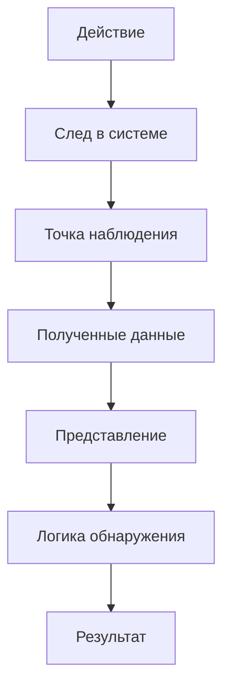
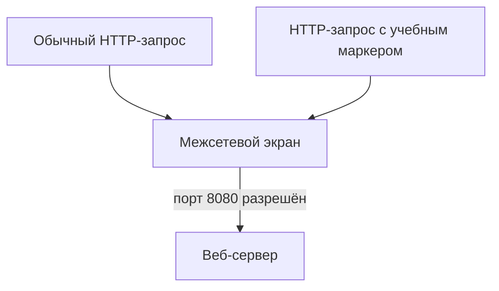

# 01. Введение в кибербезопасность. Типы угроз информационной безопасности

Кибербезопасность начинается с понимания того, **что защищается**, от каких событий и почему. Активом может быть информация, сервис, учётная запись, вычислительный ресурс или иной объект, потеря конфиденциальности, целостности или доступности которого создаёт ущерб.

Угроза — потенциальная причина нежелательного события. Уязвимость или слабость создаёт условия, при которых угроза может реализоваться. Атака — уже конкретное действие или последовательность действий. Риск связывает возможный сценарий с вероятностью и последствиями. Эти понятия нельзя использовать как взаимозаменяемые.

Для IDS/IPS особенно важно последнее звено: реальное действие оставляет **наблюдаемый след**. Система обнаружения не видит «угрозу вообще» — она получает конкретные сетевые, хостовые или прикладные данные и делает вывод только в пределах доступной телеметрии.

## Какие следы действительно видит IDS

Кража данных, отказ в обслуживании и подмена информации различаются по последствиям и по доступным следам. Сетевая IDS не измеряет конфиденциальность напрямую: она анализирует доступные пакеты, потоки или протокольные события. Наблюдение подозрительного обращения повышает необходимость проверки, но не доказывает утечку данных. Сформулируйте отдельно защищаемый актив, предполагаемый сценарий, точку наблюдения и предел вывода.

## Контекст угроз, риска и следов

### Что такое кибербезопасность и что именно мы защищаем

В рамках этого курса **кибербезопасность** рассматривается как совокупность организационных и технических мер, направленных на защиту информационных систем, сетей, сервисов и данных от нежелательных событий и действий. Защищаются не абстрактные «компьютеры вообще», а конкретные **активы**: данные, учётные записи, сервисы, вычислительные ресурсы, сетевые устройства, программное обеспечение, конфигурация и другие элементы, имеющие ценность для организации или пользователя.

Три базовые цели защиты удобно описывать через свойства информации и системы:

<div class="idps-grid idps-grid--3">
  <article class="idps-card idps-card--primary"><span class="idps-card__eyebrow">КОНФИДЕНЦИАЛЬНОСТЬ</span><strong class="idps-card__title">Кто может получить данные?</strong><p>Несанкционированное раскрытие информации нарушает конфиденциальность.</p></article>
  <article class="idps-card idps-card--sensor"><span class="idps-card__eyebrow">ЦЕЛОСТНОСТЬ</span><strong class="idps-card__title">Можно ли доверять содержимому?</strong><p>Несанкционированное изменение данных, конфигурации или состояния системы нарушает целостность.</p></article>
  <article class="idps-card idps-card--warning"><span class="idps-card__eyebrow">ДОСТУПНОСТЬ</span><strong class="idps-card__title">Можно ли воспользоваться ресурсом?</strong><p>Отказ в обслуживании, уничтожение ресурса или критический сбой нарушают доступность.</p></article>
</div>

Эти свойства не являются классификацией IDS/IPS. Они отвечают на другой вопрос: **какое защищаемое свойство может пострадать**.

### Защита не сводится к одному средству

Один и тот же сценарий может требовать нескольких мер. Типовые меры включают:

- управление доступом и многофакторную аутентификацию;
- безопасную конфигурацию, обновления и исправления;
- сегментацию и межсетевое экранирование;
- шифрование данных при хранении и передаче;
- мониторинг, IDS/IPS и анализ журналов;
- резервное копирование и восстановление;
- обучение пользователей и организационные правила.

<div class="principle-box">
<strong>ЗАЩИТА ≠ ОДНА «КОРОБКА»</strong>
<p>Меры предотвращения, обнаружения, реагирования и восстановления работают совместно. IDPS отвечает только за часть этой системы и не заменяет управление доступом, патчи, резервное копирование или обучение сотрудников.</p>
</div>

---


### Угроза, уязвимость, атака и риск — разные понятия

Удобнее не строить линейную цепочку «угроза → уязвимость → риск», а разделить сам сценарий и его оценку:

```text
защищаемый актив
      │
      ├── источник / сценарий угрозы
      │
      └── уязвимость, слабость или небезопасное условие
                    │
                    ↓
         возможное нежелательное событие
                    │
                    ↓
          потенциальное воздействие

Риск оценивается для такого сценария с учётом
правдоподобия/вероятности реализации и последствий.
```

**Источник угрозы** — субъект, обстоятельство или явление, способное инициировать нежелательный сценарий. **Угроза** — потенциальная причина нежелательного события. **Уязвимость** — слабость или условие, которое может быть использовано либо случайно активировано. **Атака** — намеренное действие или последовательность действий, направленных на достижение нежелательного результата. **Последствие** — влияние события на актив, процесс или организацию. **Риск** — оценка подверженности потенциальному событию с учётом условий его реализации и возможного воздействия.

!!! warning "Не превращайте модель в формулу"
    Риск существует до того, как событие действительно произошло: это оценка потенциального сценария, а не финальный шаг после последствия. В реальной практике используются разные методики оценки риска. IDS/IPS не «измеряет риск» автоматически только потому, что сформировала оповещение.

### Какие бывают уязвимости и слабости

Для первичного анализа полезно различать как минимум три группы:

| Группа | Что это означает | Примеры |
|---|---|---|
| Технические | слабость в программном обеспечении, оборудовании или конфигурации | уязвимый сервис, ошибка аутентификации, небезопасная конфигурация, отсутствие исправления |
| Организационные | слабость процесса, правил или управления | избыточные права, отсутствие контроля изменений, слабая политика паролей, недостаточное обучение |
| Физические | слабость, связанная с физическим доступом и средой | неограниченный доступ к серверной, незащищённый носитель, отсутствие контроля доступа к оборудованию |

Граница между категориями не всегда идеальна. Например, слабый пароль может быть одновременно технической характеристикой учётной записи и следствием организационной политики.

### Как выглядит минимальный анализ риска

Рассмотрим веб-сервис с административной учётной записью без MFA:

```text
актив
→ административный доступ к сервису

источник / сценарий угрозы
→ внешний нарушитель получает пароль

слабость
→ отсутствует MFA

возможное действие
→ вход под скомпрометированной учётной записью

последствие
→ изменение конфигурации / доступ к данным

оценка риска
→ зависит от вероятности сценария и тяжести воздействия
```

После этого выбираются меры обработки: уменьшить вероятность, уменьшить воздействие, исключить сценарий либо осознанно принять остаточный риск в допустимых рамках. Для данного примера возможны MFA, ограничение административного доступа, мониторинг аутентификации и резервное копирование конфигурации.

<div class="idps-equation">
  <div class="idps-equation__expression"><span>ALERT</span><b>≠</b><span>РИСК</span></div>
  <p>Оповещение подтверждает выполнение конкретного условия детектора. Для оценки риска нужны контекст актива, сценарий угрозы, условия реализации и последствия.</p>
</div>

---


### От сценария угрозы к наблюдаемому следу

IDPS не получает абстрактный объект «атака» в готовом виде. Она получает **следы**, которые доступны её источнику данных и точке наблюдения.

<div class="idps-figure" markdown="1">
<div class="idps-figure__label">СХЕМА · ОТ ДЕЙСТВИЯ К ДАННЫМ ДЕТЕКТОРА</div>



<div class="idps-figure__caption">Курс будет постоянно возвращаться к этой цепочке. Между реальным действием и результатом IDPS есть несколько этапов, на каждом из которых возможны ограничения и потери наблюдаемости.</div>
</div>

Например, подбор паролей к веб-сервису может оставить серию HTTP-запросов, записи об ошибках аутентификации и события учётной записи. Сетевой сенсор, журнал приложения и хостовый агент получают **разные представления одного эпизода**. Ни одно из них автоматически не становится полной истиной о происходящем.

---


### Основные классы угроз и атак

Для базового анализа полезно различать не только названия атак, но и **какое свойство они затрагивают, какие слабости используют и какие следы оставляют**.

| Класс угрозы / сценария | Что происходит | Возможный наблюдаемый след | Какие меры могут снижать риск |
|---|---|---|---|
| Вредоносное ПО | запуск или распространение вредоносного кода | процесс, файл, сетевое соединение, изменение системы | обновления, защита конечных систем, ограничение привилегий, сегментация |
| Фишинг / социальная инженерия | пользователя убеждают раскрыть данные или выполнить действие | почтовые/веб-события, последующая аутентификация; сам разговор может быть вне телеметрии | обучение, MFA, фильтрация, контроль аутентификации |
| Подбор учётных данных | многократные попытки получить доступ | серия ошибок входа, множество запросов, блокировка учётной записи | MFA, rate limiting, блокировки, мониторинг |
| Перехват / подмена трафика | чтение или изменение сетевого обмена | изменения маршрута/сертификата/сеанса, необычные сетевые события — если источник способен их показать | шифрование, аутентификация узлов, защищённые протоколы |
| Инъекционные атаки | данные ввода интерпретируются как команда или запрос; типовой пример — SQL-инъекция | необычные HTTP/API-поля, ошибки приложения, SQL-журнал | безопасная разработка, параметризация, WAF как дополнительный слой |
| DoS / DDoS | ресурс перегружается запросами или потоками | рост частоты/объёма, исчерпание ресурсов, ошибки доступности | фильтрация, rate limiting, резервирование, anti-DDoS |
| Внутренняя угроза | легитимный пользователь злоупотребляет доступом или ошибается | массовый доступ, копирование, изменение конфигурации | наименьшие привилегии, аудит, DLP/EDR, разделение обязанностей |
| Облачный сценарий | ошибки доступа, секретов, конфигурации или внешних зависимостей | облачные audit logs, события IAM/API, сетевые и прикладные логи | IAM, MFA, безопасная конфигурация, журналирование, шифрование |
| IoT-сценарий | слабозащищённое устройство используется для доступа или ботнета | новые соединения, необычный трафик, изменение поведения устройства | инвентаризация, сегментация, обновления, контроль доступа |

### Атака и нарушаемое свойство

Один сценарий может затрагивать несколько свойств сразу. Но для первичного объяснения полезна такая карта:

- атаки на **конфиденциальность**: несанкционированное чтение, кража данных, шпионаж;
- атаки на **целостность**: изменение данных, конфигурации, маршрутизации или программного состояния; примером сетевой подмены может быть изменение DNS-ответа/направления разрешения имён;
- атаки на **доступность**: DoS/DDoS, уничтожение ресурсов, блокирование данных;
- атаки на **контроль доступа**: подбор паролей, кража учётных данных, обход аутентификации.

Не следует превращать эту карту в жёсткую классификацию: например, ransomware одновременно затрагивает доступность, целостность и иногда конфиденциальность.

---


### Мини-кейс: от угрозы до решения по защите

**Ситуация:** организация публикует веб-сервис. Пользователь получает фишинговое письмо, вводит пароль на поддельной странице, после чего злоумышленник входит в сервис и начинает массово выгружать данные.

Разложим сценарий:

| Вопрос | Ответ в кейсе |
|---|---|
| Актив | учётная запись и данные веб-сервиса |
| Угроза | несанкционированный доступ и кража данных |
| Слабость / условие | украденный пароль, отсутствие MFA, возможно избыточные права |
| Действие | вход и массовый доступ к данным |
| Воздействие | нарушение конфиденциальности, возможный финансовый/репутационный ущерб |
| Возможные меры | MFA, least privilege, мониторинг входов, rate/behavior controls, реагирование |
| Сетевой след | HTTP/TLS-сеансы, адреса, частота запросов — в зависимости от точки наблюдения |
| Прикладной след | успешная аутентификация, обращения к объектам, объём выгрузки |
| Что может сделать IDPS | обнаружить доступный технический признак и сформировать результат |
| Чего IDPS не решает одна | юридическую квалификацию, полный риск, личность и мотив нарушителя |

Этот кейс связывает базовую кибербезопасность с основной моделью курса:

```text
сценарий угрозы
→ действие
→ след
→ наблюдение
→ представление
→ логика обнаружения
→ результат
→ интерпретация / реагирование
```

---


## Назначение IDS/IPS и интерпретация событий

### Перед IDS/IPS: что именно мы пытаемся защитить

IDS/IPS — один из механизмов защиты, а не самостоятельная цель. Защищаемые активы должны сохранять конфиденциальность, целостность и доступность, а задача IDPS — работать не с этими абстрактными свойствами напрямую, а с доступными наблюдаемыми данными.

```text
защищаемый актив
      ↓
нежелательный сценарий
      ↓
наблюдаемый след
      ↓
данные IDPS
      ↓
результат обнаружения
```

Понятия **актив, угроза, уязвимость, атака и риск**, а также сами свойства конфиденциальности, целостности и доступности вынесены в отдельный короткий модуль [«Контекст угроз: от события безопасности к наблюдаемому следу»](../course/01a-threat-context.md). Здесь достаточно понимать главное: IDPS получает не «уровень риска» и не «нарушение конфиденциальности» как готовый факт, а конкретные данные, к которым затем применяется логика обнаружения.

---


### Где возникает задача обнаружения

!!! note "Учебная модель / синтетический сценарий"
    В этой главе намеренно используется обычный **HTTP (Hypertext Transfer Protocol)** без защиты протоколом **TLS (Transport Layer Security)**. Эти английские названия приведены только потому, что `HTTP` и `TLS` — стандартные обозначения протоколов в технических спецификациях и документации; далее используются их общепринятые сокращения. Здесь мы изолируем один механизм: различие между контролем допустимости взаимодействия и обнаружением. Ограничения видимости зашифрованного трафика будут изучаться позднее.

<div class="idps-figure" markdown="1">
<div class="idps-figure__label">СХЕМА 2 · РАЗРЕШЁННЫЙ ВЕБ-ПУТЬ</div>



<div class="idps-figure__caption">Политика разрешает сам сетевой путь к сервису. Смысл конкретного HTTP-запроса — отдельный вопрос, который требует наблюдения и анализа.</div>
</div>

<div class="idps-grid idps-grid--2">
  <article class="idps-card idps-code-card">
    <span class="idps-card__eyebrow">ШТАТНЫЙ ЗАПРОС</span>
    <pre><code>GET /lab-test HTTP/1.1
Host: web.lab</code></pre>
    <p>Запрос использует разрешённый веб-сервис.</p>
  </article>
  <article class="idps-card idps-card--primary idps-code-card">
    <span class="idps-card__eyebrow">ЗАПРОС С УЧЕБНЫМ МАРКЕРОМ</span>
    <pre><code>GET /admin-test?marker=ATTACK-LAB HTTP/1.1
Host: web.lab</code></pre>
    <p>Сетевой путь тот же, но наблюдаемая активность отличается.</p>
  </article>
</div>

С точки зрения рассмотренной сетевой политики оба запроса используют разрешённое взаимодействие с опубликованным сервисом.

Мы не предполагаем, что межсетевой экран умеет только проверять номер порта. В конкретной инфраструктуре он может обладать дополнительными функциями инспекции. Но сам факт разрешённости взаимодействия не отвечает на другой вопрос:

> **Содержит ли наблюдаемая активность признаки, которые система безопасности должна обнаружить?**

Это уже задача **обнаружения вторжений**.

---


### Событие и оповещение — не одно и то же

<div class="idps-grid idps-grid--2 idps-grid--compact">
  <article class="idps-card">
    <span class="idps-card__eyebrow">СОБЫТИЕ</span>
    <strong class="idps-card__title">Зафиксированное событие</strong>
    <p>Например: соединение установлено, запрос к службе доменных имён получен, процесс запущен, файл изменён.</p>
  </article>
  <article class="idps-card idps-card--result">
    <span class="idps-card__eyebrow">ОПОВЕЩЕНИЕ</span>
    <strong class="idps-card__title">Выделенный результат обнаружения</strong>
    <p>Наблюдаемая активность удовлетворила условию, которое требует внимания или дальнейшей обработки.</p>
  </article>
</div>

В англоязычной документации результаты работы средств обнаружения могут называться `event`, `alert`, `finding` или `detection`. Эти слова приведены только потому, что студент встретит их в документации разных продуктов. В курсе основными остаются русские термины: **событие**, **оповещение** и **результат обнаружения**. Для первой главы достаточно различать факт наблюдения и результат работы детектора.

---


## Проверьте себя

Выберите ответ. После выбора появится пояснение. При необходимости перечитайте соответствующий раздел этой же темы.

<div class="quiz" data-question-id="topic01-q1">
  <p><strong>Что лучше всего описывает связь IDS и угрозы?</strong></p>
  <button type="button" data-choice="0">А. IDS оценивает риск без данных</button>
  <button type="button" data-choice="1" data-correct="true">Б. IDS исследует доступные следы</button>
  <button type="button" data-choice="2">В. IDS сама устанавливает виновность</button>
  <button type="button" data-choice="3">Г. IDS гарантирует отсутствие утечек</button>
  <div class="quiz-feedback" data-explanation="IDS оценивает доступные наблюдения; юридический или бизнес-вывод требует иных подтверждений." aria-live="polite"></div>
</div>

<div class="quiz" data-question-id="topic01-q2">
  <p><strong>Что подтверждает одно сетевое оповещение?</strong></p>
  <button type="button" data-choice="0" data-correct="true">А. Наличие признака по правилу</button>
  <button type="button" data-choice="1">Б. Подтверждённую утечку файла</button>
  <button type="button" data-choice="2">В. Полный состав злоумышленников</button>
  <button type="button" data-choice="3">Г. Успешное нарушение доступа</button>
  <div class="quiz-feedback" data-explanation="Оповещение подтверждает результат условия детектора в конкретных условиях наблюдения." aria-live="polite"></div>
</div>

<div class="quiz" data-question-id="topic01-q3">
  <p><strong>Что нужно определить до настройки детектора?</strong></p>
  <button type="button" data-choice="0">А. Только перечень событий без описания угроз</button>
  <button type="button" data-choice="1">Б. Только общий список сетевых интерфейсов</button>
  <button type="button" data-choice="2" data-correct="true">В. Актив, сценарий и видимые следы</button>
  <button type="button" data-choice="3">Г. Заранее назначенную блокировку всех потоков</button>
  <div class="quiz-feedback" data-explanation="От защищаемого актива и сценария переходят к требуемым следам и точкам наблюдения." aria-live="polite"></div>
</div>

## Навигация

[Все 15 тем](../syllabus/index.md) · [Тема 02 →](./02-ids-principles.md)

