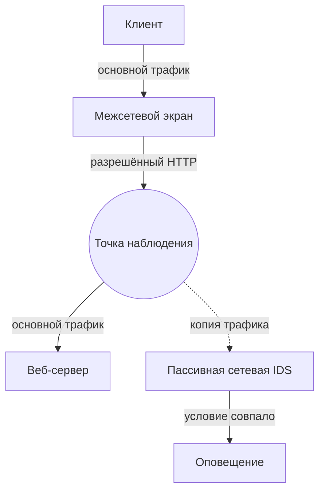
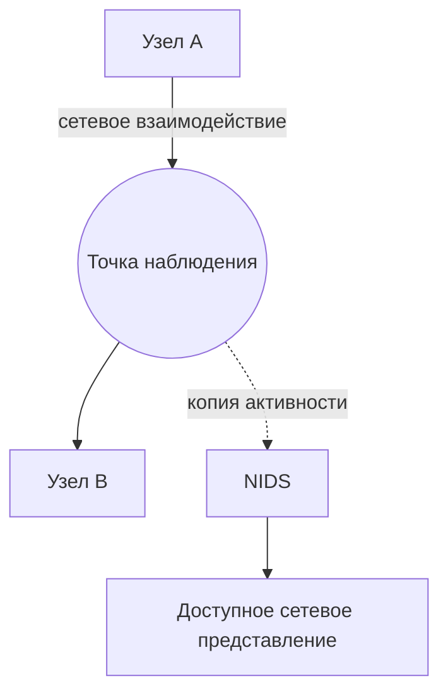
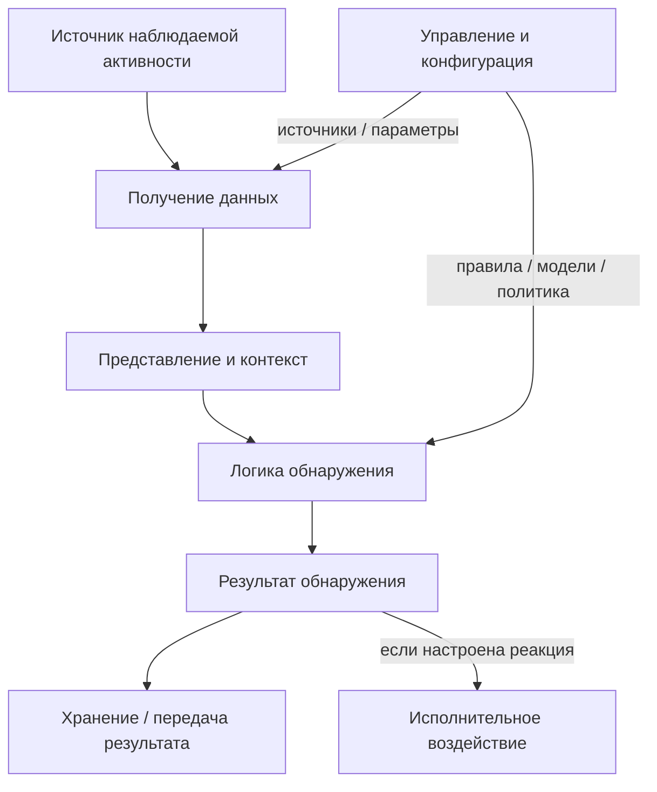
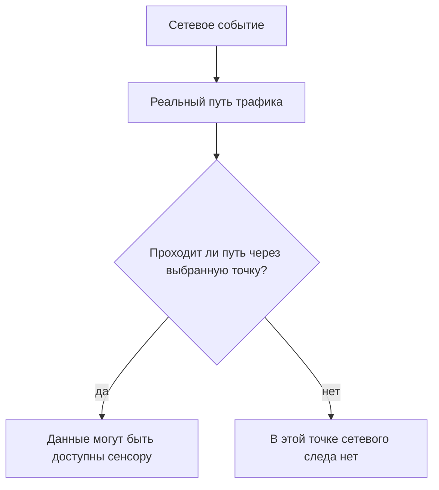

# 02. Принципы работы системы обнаружения вторжений

IDS получает доступную телеметрию, формирует из неё представление для анализа и применяет логику обнаружения (detection logic) — сигнатурную, stateful, threshold-, anomaly- или иную. Результатом может быть событие, alert или другой аналитический вывод. Сам по себе alert не доказывает компрометацию.

Сетевая IDS наблюдает сетевые данные в доступной ей точке наблюдения. Хостовая IDS использует телеметрию конкретного узла. Распределённая архитектура объединяет несколько источников, но не превращает их автоматически в единую «истину»: важны время, идентификаторы, потери данных и согласованность конфигурации.

Работу IDS полезно мыслить как цепочку: **источник → получение данных → представление → логика обнаружения → результат → интерпретация**.

## От пакета к обоснованному выводу

При проверке IDS задайте четыре независимых вопроса: была ли активирована нужная конфигурация; попал ли нужный поток в точку наблюдения; какое представление сформировал анализатор; какое условие детектора совпало. Даже зарегистрированное оповещение само по себе не подтверждает взлом. Это причинная цепочка, которой далее подчиняются лабораторные работы.

## Назначение IDS/IPS и интерпретация событий

### Что такое IDS

**IDS — система обнаружения вторжений** — автоматизирует задачу обнаружения.

В общем виде IDS получает доступные ей сведения о происходящей активности и анализирует их на наличие заданных признаков возможных инцидентов или иной активности, значимой для безопасности.

<div class="idps-process" aria-label="Базовая модель работы IDS">
  <div class="idps-process__step"><span>1</span><strong>Активность</strong><small>в системе или сети</small></div>
  <b class="idps-process__arrow" aria-hidden="true">→</b>
  <div class="idps-process__step idps-process__step--source"><span>2</span><strong>Доступные данные</strong><small>то, что реально получает IDS</small></div>
  <b class="idps-process__arrow" aria-hidden="true">→</b>
  <div class="idps-process__step idps-process__step--sensor"><span>3</span><strong>Анализ</strong><small>применение логики обнаружения</small></div>
  <b class="idps-process__arrow" aria-hidden="true">→</b>
  <div class="idps-process__step idps-process__step--result"><span>4</span><strong>Результат</strong><small>например, оповещение</small></div>
</div>

Ключевое выражение — **«доступные системе данные»**. IDS не обладает абсолютной наблюдаемостью. Что именно она сможет получить, зависит от типа системы, места размещения, способа получения данных, шифрования и конфигурации.

---


### Событие и оповещение — не одно и то же

<div class="idps-grid idps-grid--2 idps-grid--compact">
  <article class="idps-card">
    <span class="idps-card__eyebrow">СОБЫТИЕ</span>
    <strong class="idps-card__title">Зафиксированное событие</strong>
    <p>Например: соединение установлено, запрос к службе доменных имён получен, процесс запущен, файл изменён.</p>
  </article>
  <article class="idps-card idps-card--result">
    <span class="idps-card__eyebrow">ОПОВЕЩЕНИЕ</span>
    <strong class="idps-card__title">Выделенный результат обнаружения</strong>
    <p>Наблюдаемая активность удовлетворила условию, которое требует внимания или дальнейшей обработки.</p>
  </article>
</div>

В англоязычной документации результаты работы средств обнаружения могут называться `event`, `alert`, `finding` или `detection`. Эти слова приведены только потому, что студент встретит их в документации разных продуктов. В курсе основными остаются русские термины: **событие**, **оповещение** и **результат обнаружения**. Для первой главы достаточно различать факт наблюдения и результат работы детектора.

---


### Что означает оповещение

Добавим к стенду пассивный сетевой сенсор.

<div class="idps-figure" markdown="1">
<div class="idps-figure__label">СХЕМА 3 · ПАССИВНАЯ СЕТЕВАЯ IDS НЕ НАХОДИТСЯ В ТРАНЗИТНОМ ПУТИ</div>



<div class="idps-figure__caption">Сплошные стрелки — физический путь основного трафика. Пунктирная стрелка — копия данных в пассивную сетевую IDS. Оповещение является результатом анализа копии и не находится в пути передачи.</div>
</div>

Пусть детектор ищет маркер `ATTACK-LAB` в определённом поле HTTP-запроса. При получении запроса с этим маркером система формирует оповещение.

<div class="idps-result-card">
  <span class="idps-card__eyebrow">РЕЗУЛЬТАТ ОБНАРУЖЕНИЯ</span>
  <strong>LAB1: обнаружен учебный HTTP-маркер</strong>
  <code>идентификатор правила: 1000001 · маркер: ATTACK-LAB</code>
</div>

<div class="idps-evidence-grid">
  <article class="idps-evidence idps-evidence--supported">
    <span>ПОДТВЕРЖДЕНО</span>
    <p>В анализируемом системой представлении запроса присутствовал признак, удовлетворивший условию детектора.</p>
  </article>
  <article class="idps-evidence idps-evidence--not-proven">
    <span>НЕ ПОДТВЕРЖДЕНО</span>
    <p>Что приложение уязвимо, эксплуатация была успешной, атакующий получил доступ или сервер был скомпрометирован.</p>
  </article>
</div>

<div class="idps-equation idps-equation--danger">
  <div class="idps-equation__expression"><span>ОПОВЕЩЕНИЕ</span><b>≠</b><span>КОМПРОМЕТАЦИЯ</span></div>
  <p>Оповещение сообщает о результате обнаружения, но само по себе не доказывает успешный взлом.</p>
</div>

---


## Классы IDS/IPS и источники данных

### Классическая классификация IDPS

**NIST** — Национальный институт стандартов и технологий США (National Institute of Standards and Technology). Английское название приведено для происхождения аббревиатуры, под которой публикуются документы института. В NIST SP 800-94 выделялись четыре основных типа IDPS. Эту классификацию важно знать, потому что она встречается в учебной и профессиональной литературе. В оригинале используются названия `Network-Based`, `Wireless`, `Network Behavior Analysis` и `Host-Based`; английские формы приведены здесь один раз, потому что от них образованы распространённые сокращения NIDS/NIPS, WIDS/WIPS, NBA и HIDS/HIPS. Далее в объяснении используются русские названия и сокращения.

<div class="idps-switcher" data-idps-switcher>
  <div class="idps-switcher__header">
    <strong>Четыре типа в классической модели NIST</strong>
    <p>Переключатель показывает область наблюдения, типичные данные и границу допустимого вывода для каждого класса.</p>
  </div>
  <div class="idps-switcher__controls" aria-label="Классическая классификация IDPS">
    <button id="chapter2-control-network" class="idps-switcher__button" type="button" aria-controls="chapter2-panel-network" data-idps-switch="network">Сетевая</button>
    <button id="chapter2-control-wireless" class="idps-switcher__button" type="button" aria-controls="chapter2-panel-wireless" data-idps-switch="wireless">Беспроводная</button>
    <button id="chapter2-control-nba" class="idps-switcher__button" type="button" aria-controls="chapter2-panel-nba" data-idps-switch="nba">NBA</button>
    <button id="chapter2-control-host" class="idps-switcher__button" type="button" aria-controls="chapter2-panel-host" data-idps-switch="host">Хостовая</button>
  </div>
  <div class="idps-switcher__panels">
    <section id="chapter2-panel-network" class="idps-switcher__panel" data-idps-panel="network">
      <h3 class="idps-switcher__panel-title">Сетевая IDS/IPS</h3>
      <div class="idps-question-model">
        <div class="idps-question-model__cell"><span>Область наблюдения</span><strong>Доступная сетевой системе активность в конкретной точке наблюдения</strong></div>
        <div class="idps-question-model__cell"><span>Типичные данные</span><strong>Адреса, порты, протоколы, поля сообщений, характеристики потоков</strong></div>
        <div class="idps-question-model__cell"><span>Класс</span><strong>Сетевая IDS/IPS — NIDS/NIPS</strong></div>
        <div class="idps-question-model__boundary"><strong>Граница вывода:</strong> сетевые данные сами по себе не раскрывают автоматически локальный процесс, пользователя или изменение файла на узле.</div>
      </div>
    </section>
    <section id="chapter2-panel-wireless" class="idps-switcher__panel" data-idps-panel="wireless">
      <h3 class="idps-switcher__panel-title">Беспроводная IDS/IPS</h3>
      <div class="idps-question-model">
        <div class="idps-question-model__cell"><span>Область наблюдения</span><strong>Радиосреда и протоколы семейства IEEE 802.11</strong></div>
        <div class="idps-question-model__cell"><span>Типичные данные</span><strong>Точки доступа, клиенты, служебные кадры и другие доступные признаки радиообмена</strong></div>
        <div class="idps-question-model__cell"><span>Класс</span><strong>Беспроводная IDS/IPS — WIDS/WIPS</strong></div>
        <div class="idps-question-model__boundary"><strong>Граница вывода:</strong> представление радиообмена не тождественно картине проводного сетевого трафика за точкой доступа.</div>
      </div>
    </section>
    <section id="chapter2-panel-nba" class="idps-switcher__panel" data-idps-panel="nba">
      <h3 class="idps-switcher__panel-title">Анализ сетевого поведения</h3>
      <div class="idps-question-model">
        <div class="idps-question-model__cell"><span>Область наблюдения</span><strong>Сетевой трафик, потоки и статистика сетевой активности</strong></div>
        <div class="idps-question-model__cell"><span>Акцент анализа</span><strong>Объём, частота, направления, структура и изменения поведения</strong></div>
        <div class="idps-question-model__cell"><span>Класс NIST</span><strong>Анализ сетевого поведения — NBA</strong></div>
        <div class="idps-question-model__boundary"><strong>Важная оговорка:</strong> NBA не образует идеально независимую от NIDS «среду». Здесь класс сильнее характеризует вид сетевой телеметрии и характер анализа.</div>
      </div>
    </section>
    <section id="chapter2-panel-host" class="idps-switcher__panel" data-idps-panel="host">
      <h3 class="idps-switcher__panel-title">Хостовая IDS/IPS</h3>
      <div class="idps-question-model">
        <div class="idps-question-model__cell"><span>Область наблюдения</span><strong>События и характеристики конкретного вычислительного узла</strong></div>
        <div class="idps-question-model__cell"><span>Типичные данные</span><strong>Процессы, пользователи, файлы, конфигурация, журналы и локальные соединения</strong></div>
        <div class="idps-question-model__cell"><span>Класс</span><strong>Хостовая IDS/IPS — HIDS/HIPS</strong></div>
        <div class="idps-question-model__boundary"><strong>Граница вывода:</strong> агент видит только реально доступные ему и настроенные источники данных на конкретном узле.</div>
      </div>
    </section>
  </div>
</div>

Классификация NIST не идеально симметрична: сетевая, хостовая и беспроводная категории в основном различаются средой наблюдения, тогда как NBA сильнее характеризует вид сетевой телеметрии и характер анализа.

<div class="idps-equation idps-equation--warning">
  <div class="idps-equation__expression"><span>ИСТОЧНИК ДАННЫХ</span><b>≠</b><span>МЕТОД АНАЛИЗА</span></div>
  <p>Откуда система получает сведения и как она принимает решение — два разных вопроса.</p>
</div>

---


### Сетевая IDS/IPS — NIDS/NIPS

**Сетевая IDS/IPS (NIDS/NIPS)** анализирует доступную ей сетевую активность. Обозначение `NIPS` добавляет возможность предотвращающего воздействия на сетевое взаимодействие, но не означает, что любой сетевой сенсор обязательно включён в разрыв или блокирует каждый результат обнаружения.

В сетевых примерах дальше используются стандартные обозначения протоколов из сетевого пререквизита курса: **IP (Internet Protocol)**, **TCP (Transmission Control Protocol)**, **UDP (User Datagram Protocol)**, **ICMP (Internet Control Message Protocol)** и **DNS (Domain Name System)**. Английские названия приведены только для происхождения официальных сокращений из спецификаций; далее используются сами сокращения. `HTTP` и `TLS` уже были введены в Главе 1.

<div class="idps-figure" markdown="1">
<div class="idps-figure__label">СХЕМА 2 · СЕТЕВОЙ ВЗГЛЯД</div>



<div class="idps-figure__caption">Сплошные стрелки показывают основной путь сетевого взаимодействия. Пунктир означает копию наблюдаемых данных в NIDS. Система получает только ту активность, которая доступна в выбранной точке и фактически захвачена.</div>
</div>

В зависимости от точки наблюдения, конфигурации и возможностей системы NIDS может получать адреса, порты, признаки TCP/UDP/ICMP, DNS- и HTTP-поля, сведения о TLS-сеансе, характеристики сетевых потоков и другие доступные признаки.

<div class="idps-evidence-grid idps-evidence-grid--compact">
  <article class="idps-evidence idps-evidence--supported"><span>СЕТЕВОЙ ИСТОЧНИК МОЖЕТ ПОДДЕРЖАТЬ ВЫВОД</span><p>Наблюдалось соединение <code>10.10.1.15 → 10.10.2.20:445</code> — если соответствующий обмен действительно попал в точку наблюдения и был захвачен.</p></article>
  <article class="idps-evidence idps-evidence--not-proven"><span>ЭТО НЕ ДОКАЗЫВАЕТ АВТОМАТИЧЕСКИ</span><p>Какой локальный процесс создал соединение, от какого пользователя он работал и что произошло внутри операционной системы.</p></article>
</div>

---


### Хостовая IDS/IPS — HIDS/HIPS

**Хостовая IDS/IPS (HIDS/HIPS)** работает с событиями и характеристиками конкретного вычислительного узла. Вариант `HIPS` может дополнительно применять локальную политику предотвращения к поддерживаемым действиям или объектам — например, запрещать определённые изменения файлов/конфигурации, запуск действий или сетевую активность приложения, если конкретная реализация умеет это контролировать. Набор контролируемых действий всегда определяется продуктом, правами и конфигурацией.

<div class="idps-figure">
  <div class="idps-figure__label">СХЕМА 3 · ХОСТОВЫЕ ИСТОЧНИКИ СХОДЯТСЯ К АГЕНТУ, НО НЕ ПОЯВЛЯЮТСЯ АВТОМАТИЧЕСКИ</div>
  <div class="idps-source-hub">
    <div class="idps-source-hub__sources">
      <div class="idps-source-hub__source"><strong>Процессы</strong><small>Запуск, завершение и доступный контекст процесса.</small></div>
      <div class="idps-source-hub__source"><strong>Пользователи</strong><small>Аутентификация и действия, если соответствующие события формируются.</small></div>
      <div class="idps-source-hub__source"><strong>Файлы и конфигурация</strong><small>Изменения объектов, которые включены в контроль.</small></div>
      <div class="idps-source-hub__source"><strong>Журналы и аудит</strong><small>Системные и прикладные события, которые реально журналируются.</small></div>
      <div class="idps-source-hub__source"><strong>Локальные соединения</strong><small>Сетевой контекст, доступный на самом наблюдаемом узле.</small></div>
    </div>
    <div class="idps-source-hub__arrow" aria-hidden="true">→</div>
    <div class="idps-source-hub__core"><strong>Агент HIDS/HIPS</strong><small>Получает только доступную и настроенную телеметрию. Конкретный продукт может собирать не все перечисленные источники.</small></div>
    <div class="idps-source-hub__boundary"><strong>Граница наблюдаемости</strong><small>Установленный агент ≠ полная видимость узла. Реальный набор данных определяется ОС, правами, аудитом, конфигурацией и возможностями реализации.</small></div>
  </div>
  <div class="idps-figure__caption">Схема показывает отношение «источники → агент», а не обязательную внутреннюю архитектуру продукта. Каждый показанный источник должен существовать и быть доступен отдельно.</div>
</div>

### Один эпизод глазами NIDS и HIDS

Пусть веб-сервер устанавливает соединение `Веб-сервер → 203.0.113.50:443`.

<div class="idps-grid idps-grid--2">
  <article class="idps-card idps-card--sensor"><span class="idps-card__eyebrow">NIDS</span><strong class="idps-card__title">Сетевой контекст</strong><p>Кто с кем взаимодействовал, когда, по какому протоколу и какие доступные сетевые признаки наблюдались.</p></article>
  <article class="idps-card idps-card--source"><span class="idps-card__eyebrow">HIDS</span><strong class="idps-card__title">Контекст узла</strong><p>Какой процесс инициировал действие, от какого пользователя, какой файл или конфигурация были затронуты — если эти данные собираются.</p></article>
</div>

Один источник не является автоматически «лучше» другого: они отвечают на разные вопросы.

---


### Тип системы и метод обнаружения — не одно и то же

<div class="idps-figure">
  <div class="idps-figure__label">СХЕМА 5 · ИСТОЧНИК ДАННЫХ И СПОСОБ АНАЛИЗА — ДВЕ РАЗНЫЕ ОСИ</div>
  <div class="idps-axis-table-wrap">
    <table class="idps-axis-table">
      <thead>
        <tr><th>Источник / область наблюдения ↓</th><th>Известный признак</th><th>Состояние / семантика</th><th>Отклонение от ожидаемой модели</th></tr>
      </thead>
      <tbody>
        <tr><th>Сетевые данные</th><td data-label="Известный признак"><span class="idps-axis-table__possible">Возможна комбинация</span><div class="idps-axis-table__note">Например, условие по доступному сетевому признаку.</div></td><td data-label="Состояние / семантика"><span class="idps-axis-table__possible">Возможна комбинация</span><div class="idps-axis-table__note">Если реализация строит нужный протокольный контекст.</div></td><td data-label="Отклонение от ожидаемой модели"><span class="idps-axis-table__possible">Возможна комбинация</span><div class="idps-axis-table__note">Потоки и статистика могут сравниваться с моделью поведения.</div></td></tr>
        <tr><th>Хостовые данные</th><td data-label="Известный признак"><span class="idps-axis-table__possible">Возможна комбинация</span><div class="idps-axis-table__note">Например, известный признак в событии или объекте.</div></td><td data-label="Состояние / семантика"><span class="idps-axis-table__possible">Возможна комбинация</span><div class="idps-axis-table__note">Анализ последовательности или контекста событий узла.</div></td><td data-label="Отклонение от ожидаемой модели"><span class="idps-axis-table__possible">Возможна комбинация</span><div class="idps-axis-table__note">Сравнение активности узла с ожидаемым профилем.</div></td></tr>
        <tr><th>Беспроводные данные</th><td data-label="Известный признак"><span class="idps-axis-table__possible">Возможна комбинация</span><div class="idps-axis-table__note">Известные признаки кадров, точек доступа или клиентов.</div></td><td data-label="Состояние / семантика"><span class="idps-axis-table__possible">Возможна комбинация</span><div class="idps-axis-table__note">Контекст состояния беспроводного протокола.</div></td><td data-label="Отклонение от ожидаемой модели"><span class="idps-axis-table__possible">Возможна комбинация</span><div class="idps-axis-table__note">Отклонения от ожидаемой картины радиоокружения.</div></td></tr>
      </tbody>
    </table>
  </div>
  <div class="idps-figure__caption">Матрица показывает логическую независимость осей, а не обещает наличие каждой комбинации в любом продукте. Реальная возможность зависит от доступных данных, представления и реализации детектора.</div>
</div>

<div class="idps-equation idps-equation--warning">
  <div class="idps-equation__expression"><span>ТИП ИСТОЧНИКА</span><b>≠</b><span>МЕТОД ОБНАРУЖЕНИЯ</span></div>
  <p>Например, хостовые и сетевые данные могут анализироваться разными методами. Нельзя строить одну плоскую классификацию из понятий разных уровней.</p>
</div>

---


## Компоненты и обработка данных

### IDS/IPS — это не одна «коробка»

В первой главе мы использовали простую схему:

```text
трафик → IDS → оповещение
```

Она полезна для знакомства с идеей обнаружения, но ничего не говорит о внутреннем устройстве системы.

В реальной IDS/IPS можно выделить несколько **функциональных задач**.

<div class="idps-figure" markdown="1">
<div class="idps-figure__label">СХЕМА 1 · ФУНКЦИОНАЛЬНАЯ ДЕКОМПОЗИЦИЯ IDS/IPS</div>



<p class="idps-figure__caption">Это функциональная схема, а не обязательная внутренняя цепочка конкретного продукта. Реализация может объединять функции в одном процессе или распределять их между несколькими компонентами.</p>
</div>

Главная идея:

<div class="idps-equation idps-equation--primary">
  <div class="idps-equation__expression">
    <span>ФУНКЦИЯ</span><b>≠</b><span>ФИЗИЧЕСКИЙ КОМПОНЕНТ</span>
  </div>
  <p>Несколько функций могут выполняться одним процессом или устройством, а одна функция может быть распределена между несколькими узлами.</p>
</div>

В блоке хранения ниже используется аббревиатура **SIEM** — система централизованного управления информацией и событиями безопасности (Security Information and Event Management). Английское раскрытие приведено только для происхождения общепринятой аббревиатуры; далее достаточно `SIEM`.

<div class="idps-switcher" data-idps-switcher>
  <div class="idps-switcher__header">
    <strong>Разберите функциональную схему по одной задаче</strong>
    <p>Переключатель не показывает обязательный порядок исполнения конкретного продукта. Он помогает отделить назначение функций и границы выводов.</p>
  </div>
  <div class="idps-switcher__controls" aria-label="Функциональные задачи IDS/IPS">
    <button id="chapter3-control-acquire" class="idps-switcher__button" type="button" aria-controls="chapter3-panel-acquire" data-idps-switch="acquire">Получение</button>
    <button id="chapter3-control-represent" class="idps-switcher__button" type="button" aria-controls="chapter3-panel-represent" data-idps-switch="represent">Представление</button>
    <button id="chapter3-control-detect" class="idps-switcher__button" type="button" aria-controls="chapter3-panel-detect" data-idps-switch="detect">Обнаружение</button>
    <button id="chapter3-control-result" class="idps-switcher__button" type="button" aria-controls="chapter3-panel-result" data-idps-switch="result">Результат</button>
    <button id="chapter3-control-store" class="idps-switcher__button" type="button" aria-controls="chapter3-panel-store" data-idps-switch="store">Хранение</button>
    <button id="chapter3-control-act" class="idps-switcher__button" type="button" aria-controls="chapter3-panel-act" data-idps-switch="act">Воздействие</button>
  </div>
  <div class="idps-switcher__panels">
    <section id="chapter3-panel-acquire" class="idps-switcher__panel" data-idps-panel="acquire"><h3 class="idps-switcher__panel-title">Получение данных</h3><div class="idps-question-model"><div class="idps-question-model__cell"><span>Вход</span><strong>Трафик, события ОС, журналы, радиокадры или другой доступный источник</strong></div><div class="idps-question-model__cell"><span>Функция</span><strong>Доставить наблюдаемое представление в систему</strong></div><div class="idps-question-model__cell"><span>Не доказывает</span><strong>Что угроза уже обнаружена</strong></div><div class="idps-question-model__boundary"><strong>Проверяемый вопрос:</strong> нужные данные вообще дошли до системы?</div></div></section>
    <section id="chapter3-panel-represent" class="idps-switcher__panel" data-idps-panel="represent"><h3 class="idps-switcher__panel-title">Представление и контекст</h3><div class="idps-question-model"><div class="idps-question-model__cell"><span>Вход</span><strong>Полученные данные</strong></div><div class="idps-question-model__cell"><span>Функция</span><strong>Сформировать подходящее представление: пакет, поток, событие, протокольный контекст и т. п.</strong></div><div class="idps-question-model__cell"><span>Не доказывает</span><strong>Что условие обнаружения совпало</strong></div><div class="idps-question-model__boundary"><strong>Проверяемый вопрос:</strong> существует ли представление, к которому применима нужная логика?</div></div></section>
    <section id="chapter3-panel-detect" class="idps-switcher__panel" data-idps-panel="detect"><h3 class="idps-switcher__panel-title">Логика обнаружения</h3><div class="idps-question-model"><div class="idps-question-model__cell"><span>Вход</span><strong>Подходящее представление данных</strong></div><div class="idps-question-model__cell"><span>Функция</span><strong>Применить правило, условие или модель</strong></div><div class="idps-question-model__cell"><span>Не доказывает</span><strong>Инцидент или компрометацию</strong></div><div class="idps-question-model__boundary"><strong>Проверяемый вопрос:</strong> логика загружена, применима и её условие действительно совпало?</div></div></section>
    <section id="chapter3-panel-result" class="idps-switcher__panel" data-idps-panel="result"><h3 class="idps-switcher__panel-title">Результат обнаружения</h3><div class="idps-question-model"><div class="idps-question-model__cell"><span>Форма</span><strong>Оповещение, событие, оценка, метка или дополнительный контекст</strong></div><div class="idps-question-model__cell"><span>Функция</span><strong>Зафиксировать вывод детектора относительно доступных данных</strong></div><div class="idps-question-model__cell"><span>Не равно</span><strong>Месту хранения результата</strong></div><div class="idps-question-model__boundary"><strong>Проверяемый вопрос:</strong> какой именно результат сформирован и на основании каких данных?</div></div></section>
    <section id="chapter3-panel-store" class="idps-switcher__panel" data-idps-panel="store"><h3 class="idps-switcher__panel-title">Хранение и передача</h3><div class="idps-question-model"><div class="idps-question-model__cell"><span>Вход</span><strong>Сформированный результат и сопутствующие события</strong></div><div class="idps-question-model__cell"><span>Функция</span><strong>Записать или передать их в файл, хранилище, SIEM, консоль или API</strong></div><div class="idps-question-model__cell"><span>Не является</span><strong>Самим механизмом обнаружения</strong></div><div class="idps-question-model__boundary"><strong>Проверяемый вопрос:</strong> где искать результат и мог ли он потеряться на этапе вывода?</div></div></section>
    <section id="chapter3-panel-act" class="idps-switcher__panel" data-idps-panel="act"><h3 class="idps-switcher__panel-title">Исполнительное воздействие</h3><div class="idps-question-model"><div class="idps-question-model__cell"><span>Основание</span><strong>Результат обнаружения + политика реакции</strong></div><div class="idps-question-model__cell"><span>Функция</span><strong>Выполнить предусмотренное действие локально или через внешний механизм</strong></div><div class="idps-question-model__cell"><span>Не обязано</span><strong>Находиться в том же компоненте, где выполнено обнаружение</strong></div><div class="idps-question-model__boundary"><strong>Проверяемый вопрос:</strong> какое средство реально выполнило воздействие и подтверждено ли оно?</div></div></section>
  </div>
</div>

Например, небольшая IDS может работать на одной машине: она получает трафик, анализирует его и пишет события локально. В крупной инфраструктуре сенсоры могут передавать результаты на отдельные серверы управления и хранения.

---


### Сенсор и агент: кто получает наблюдаемую активность

В классической терминологии IDPS обычно используют два слова:

<div class="idps-grid idps-grid--2">
  <article class="idps-card idps-card--sensor">
    <span class="idps-card__eyebrow">СЕНСОР</span>
    <strong class="idps-card__title">Наблюдает среду</strong>
    <p>Чаще используется для сетевых и беспроводных систем: получает доступное представление трафика или радиообмена.</p>
  </article>
  <article class="idps-card idps-card--sensor">
    <span class="idps-card__eyebrow">АГЕНТ</span>
    <strong class="idps-card__title">Работает на узле</strong>
    <p>Чаще используется для хостовых систем: получает доступ к настроенным событиям конкретной операционной системы или приложения.</p>
  </article>
</div>

В NIST SP 800-94 используются соответствующие английские термины `sensor` и `agent`; далее в курсе мы используем русские термины **сенсор** и **агент**.

Но важно не превращать терминологию в физический закон. Нас интересует функция:

> **какой компонент реально получает данные о наблюдаемой активности?**

### Сетевой пример

<div class="idps-grid idps-grid--3">
  <article class="idps-card idps-card--endpoint">
    <span class="idps-card__eyebrow">ОСНОВНОЙ ПОТОК</span>
    <strong class="idps-card__title">Клиент ↔ сервер</strong>
    <p>Сетевое взаимодействие существует независимо от сенсора.</p>
  </article>
  <article class="idps-card idps-card--observation">
    <span class="idps-card__eyebrow">ТОЧКА НАБЛЮДЕНИЯ</span>
    <strong class="idps-card__title">Доступный сетевой след</strong>
    <p>Именно здесь определяется, какое представление трафика вообще может быть передано сенсору.</p>
  </article>
  <article class="idps-card idps-card--sensor">
    <span class="idps-card__eyebrow">СЕНСОР NIDS</span>
    <strong class="idps-card__title">Получает доступные данные</strong>
    <p>Сенсор не создаёт сетевое событие: он анализирует доступное ему представление уже происходящего взаимодействия.</p>
  </article>
</div>

### Хостовый пример

<div class="idps-grid idps-grid--3">
  <article class="idps-card idps-card--source">
    <span class="idps-card__eyebrow">ИСТОЧНИК</span>
    <strong class="idps-card__title">ОС и приложения</strong>
    <p>Процессы, файлы, аудит, журналы и другие локальные события существуют на наблюдаемом узле.</p>
  </article>
  <article class="idps-card idps-card--sensor">
    <span class="idps-card__eyebrow">АГЕНТ HIDS</span>
    <strong class="idps-card__title">Получает настроенную телеметрию</strong>
    <p>Агент имеет только тот доступ и тот набор источников, которые реально предоставлены ему конфигурацией.</p>
  </article>
  <article class="idps-card idps-card--interpretation">
    <span class="idps-card__eyebrow">ГРАНИЦА</span>
    <strong class="idps-card__title">Установлен ≠ видит всё</strong>
    <p>Наличие агента само по себе не доказывает наблюдаемость всех процессов, файлов и действий пользователя.</p>
  </article>
</div>

### Один эпизод — несколько наблюдаемых следов

Один и тот же HTTP-запрос может быть представлен разными артефактами в зависимости от точки наблюдения и включённых источников данных. При этом результат обнаружения, запись приложения и событие аудита — не одно и то же: каждый артефакт имеет собственную доказательную силу и должен интерпретироваться в контексте своей точки наблюдения. В примере хостовым источником выступает **подсистема аудита Linux**; в англоязычной документации она называется `Linux Audit`, поэтому это название приводится один раз для узнавания источника.

<div class="idps-figure">
  <div class="idps-figure__label">СХЕМА · ОДИН HTTP-ЗАПРОС — ТРИ НЕЗАВИСИМЫХ СВИДЕТЕЛЬСТВА</div>
  <div class="idps-observation-story">
    <div class="idps-observation-story__path">
      <div class="idps-route-node idps-route-node--endpoint">Клиент<br><small>отправляет HTTP-запрос</small></div>
      <div class="idps-route-arrow">→</div>
      <div class="idps-route-node idps-route-node--observation">Точка наблюдения<br><small>видит сетевой путь</small></div>
      <div class="idps-route-arrow">→</div>
      <div class="idps-route-node idps-route-node--endpoint">Сервер / приложение<br><small>получает запрос</small></div>
    </div>
    <div class="idps-observation-story__evidence">
      <article class="idps-card idps-card--sensor">
        <span class="idps-card__eyebrow">СЕТЕВОЕ СВИДЕТЕЛЬСТВО</span>
        <strong class="idps-card__title">Копия трафика → NIDS</strong>
        <p>При совпадении условия система может сформировать оповещение. Оно подтверждает результат обнаружения, а не инцидент сам по себе.</p>
      </article>
      <article class="idps-card idps-card--source">
        <span class="idps-card__eyebrow">ПРИКЛАДНОЕ СВИДЕТЕЛЬСТВО</span>
        <strong class="idps-card__title">Лог приложения</strong>
        <p>Может подтвердить получение или обработку запроса, если соответствующее событие действительно журналируется.</p>
      </article>
      <article class="idps-card idps-card--source">
        <span class="idps-card__eyebrow">ХОСТОВОЕ СВИДЕТЕЛЬСТВО</span>
        <strong class="idps-card__title">Подсистема аудита Linux</strong>
        <p>Может подтвердить действие процесса или изменение объекта, если это действие входит в настроенную область аудита.</p>
      </article>
    </div>
    <div class="idps-observation-story__boundary">
      <strong>Интерпретация:</strong>
      <span>каждый артефакт подтверждает только зафиксированный им факт; оповещение ≠ инцидент; отсутствие оповещения ≠ отсутствие трафика; причинную связь между артефактами нужно обосновывать отдельно.</span>
    </div>
  </div>
  <div class="idps-figure__caption">Точка наблюдения — логическое место на пути трафика. NIDS, журнал приложения и подсистема аудита Linux дают разные виды свидетельств и не заменяют друг друга.</div>
</div>

---


### Получение данных и обнаружение — не одно и то же

Пусть NIDS подключена к нужному сетевому сегменту.

Это означает только, что система **может получить** некоторый трафик при корректной конфигурации.

Но ещё не означает, что выполнены все условия, необходимые для ожидаемого результата.

<div class="idps-figure">
  <div class="idps-figure__label">ДИАГНОСТИЧЕСКИЕ ВОРОТА · ЧТО ПРОВЕРЯЕТСЯ ПЕРЕД ВЫВОДОМ «ДЕТЕКТОР НЕ СРАБОТАЛ»</div>
  <div class="idps-gates idps-gates--six">
    <div class="idps-gate"><span>1 · ИСТОЧНИК</span><strong>Нужная активность доступна?</strong><small>Событие вообще проходит через выбранную область наблюдения.</small></div>
    <div class="idps-gate"><span>2 · ПОЛУЧЕНИЕ</span><strong>Данные реально захвачены?</strong><small>Выбран правильный интерфейс, агент или другой источник.</small></div>
    <div class="idps-gate"><span>3 · ПРЕДСТАВЛЕНИЕ</span><strong>Есть нужный контекст?</strong><small>Система смогла сформировать представление, требуемое условию.</small></div>
    <div class="idps-gate"><span>4 · ЛОГИКА</span><strong>Детектор загружен и применим?</strong><small>Правило, модель или другая логика действительно активны.</small></div>
    <div class="idps-gate"><span>5 · СОВПАДЕНИЕ</span><strong>Условие выполнено?</strong><small>Наблюдаемые значения действительно соответствуют условию.</small></div>
    <div class="idps-gate"><span>6 · ВЫВОД</span><strong>Результат доступен там, где его ищут?</strong><small>Проверьте канал записи, хранение и способ поиска.</small></div>
  </div>
  <div class="idps-figure__caption">Это порядок диагностических вопросов для конкретного ожидаемого результата, а не утверждение об обязательном внутреннем конвейере обработки каждой IDS/IPS.</div>
</div>

Поэтому полезно разделять два вопроса:

<div class="idps-grid idps-grid--2">
  <article class="idps-card idps-card--source">
    <span class="idps-card__eyebrow">СБОР</span>
    <strong class="idps-card__title">Какие данные получила система?</strong>
    <p>Интерфейс, агент, журнал, поток событий, радиоканал, API или другой источник.</p>
  </article>
  <article class="idps-card">
    <span class="idps-card__eyebrow">АНАЛИЗ</span>
    <strong class="idps-card__title">Что система сделала с полученными данными?</strong>
    <p>Построила контекст, применила правило или модель, сформировала результат.</p>
  </article>
</div>

<div class="idps-equation idps-equation--warning">
  <div class="idps-equation__expression">
    <span>ДАННЫЕ ПОЛУЧЕНЫ</span><b>≠</b><span>УГРОЗА ОБНАРУЖЕНА</span>
  </div>
  <p>Система может успешно собирать телеметрию и не иметь условия, которое выделяет конкретную активность.</p>
</div>

И наоборот, корректная логика обнаружения бесполезна для конкретного события, если нужные данные до механизма анализа не дошли.

---


### Представление данных: система анализирует не только «сырые пакеты»

Полученная информация часто преобразуется в более удобную структуру.

Для сети одно и то же полученное взаимодействие может быть представлено на разных уровнях — в зависимости от возможностей реализации и задачи детектора.

<div class="idps-figure">
  <div class="idps-figure__label">СЕТЕВЫЕ ПРЕДСТАВЛЕНИЯ · ВЕТВЛЕНИЕ, А НЕ ОБЯЗАТЕЛЬНЫЙ ЛИНЕЙНЫЙ КОНВЕЙЕР</div>
  <div class="idps-fanout">
    <div class="idps-fanout__origin"><strong>Полученные сетевые данные</strong><small>То, что реально доступно системе в выбранной точке наблюдения.</small></div>
    <div class="idps-fanout__arrow" aria-hidden="true">↠</div>
    <div class="idps-fanout__targets">
      <div class="idps-fanout__target"><strong>Поля пакета</strong><small>Адреса, флаги, типы и другие доступные признаки.</small></div>
      <div class="idps-fanout__target"><strong>Поток / состояние соединения</strong><small>Агрегированный или контекстный взгляд на взаимодействие.</small></div>
      <div class="idps-fanout__target"><strong>Восстановленные TCP-данные</strong><small>Контекст, формируемый из нескольких сегментов, если это требуется и возможно.</small></div>
      <div class="idps-fanout__target"><strong>Прикладной контекст</strong><small>Например, HTTP, DNS или доступные свойства TLS-сеанса.</small></div>
    </div>
  </div>
  <div class="idps-figure__caption">Стрелка означает «из доступных данных могут быть получены разные представления», а не «каждый пакет обязан последовательно пройти все четыре стадии».</div>
</div>

Для хоста действует тот же принцип: агент или другой механизм может работать с несколькими типами локальных представлений.

<div class="idps-fanout">
  <div class="idps-fanout__origin"><strong>Доступная хостовая телеметрия</strong><small>Набор зависит от ОС, аудита, прав и конфигурации.</small></div>
  <div class="idps-fanout__arrow" aria-hidden="true">↠</div>
  <div class="idps-fanout__targets">
    <div class="idps-fanout__target"><strong>Событие аудита</strong><small>Зафиксированное действие, если соответствующий аудит включён.</small></div>
    <div class="idps-fanout__target"><strong>Сведения о процессе</strong><small>Процесс, пользователь и другие доступные атрибуты.</small></div>
    <div class="idps-fanout__target"><strong>Изменение файла</strong><small>Событие или состояние контролируемого объекта.</small></div>
    <div class="idps-fanout__target"><strong>Журнал / аутентификация</strong><small>Запись, которую реально сформировал и сохранил источник.</small></div>
  </div>
</div>

Это исправляет распространённую ошибку: обнаружение не обязано начинаться только после восстановления TCP-потока и разбора прикладного протокола. В документации сетевых движков восстановление потока часто называется `reassembly`; английский термин нужен только для чтения такой документации. Например, интересующее условие может относиться непосредственно к IP/TCP-полям или событию декодирования.

### Где в этой модели находится DPI

В материалах по сетевым IPS часто используется термин **глубокий анализ пакетов (Deep Packet Inspection, DPI)**. Он полезен как общее название способности анализировать не только адреса и порты, но и доступное содержимое, состояние и протокольный контекст.

Но `DPI` не отвечает на вопрос, **почему система решила, что активность подозрительна**. Это уже вопрос логики обнаружения. Один и тот же доступный HTTP-контекст может анализироваться сигнатурным условием, моделью состояния, порогом или другой логикой.

Поэтому в курсе:

```text
DPI / протокольный анализ
→ формирует или предоставляет более содержательное представление

логика обнаружения
→ принимает решение над этим представлением
```

Шифрование, неполная точка наблюдения или невозможность корректно разобрать протокол могут ограничить доступное представление независимо от качества правила.

---


### Где находится логика обнаружения

После того как системе доступно нужное представление, применяется **логика обнаружения**.

Она отвечает на вопрос:

> **какое условие должно быть выполнено, чтобы система выделила активность как интересующую?**

Логика может быть представлена в разных формах:

<div class="idps-chip-list" aria-label="Примеры форм логики обнаружения">
  <span class="idps-chip">правило</span>
  <span class="idps-chip">сигнатура</span>
  <span class="idps-chip">пороговое условие</span>
  <span class="idps-chip">модель состояния протокола</span>
  <span class="idps-chip">поведенческая последовательность</span>
  <span class="idps-chip">статистическая или иная модель</span>
</div>

Подробно методы обнаружения разбираются в Главе 5. Здесь важно другое:

<div class="idps-equation idps-equation--primary">
  <div class="idps-equation__expression">
    <span>ЛОГИКА ОБНАРУЖЕНИЯ</span><b>+</b><span>ПОДХОДЯЩИЕ ДАННЫЕ</span>
  </div>
  <p>Ожидаемый результат возможен только тогда, когда системе одновременно доступны нужное представление и применимая к нему логика.</p>
</div>

### Почему правила вообще нужны

Без формализованного условия система не знает, какую активность из огромного потока данных необходимо выделить.

Простейший учебный пример:

```text
если путь HTTP-запроса содержит LAB-MARKER
→ сформировать оповещение
```

Сейчас нас не интересует синтаксис Suricata. Важно понять назначение правила: оно превращает человеческую идею «обрати внимание на такой признак» в условие, которое может выполнить машина.

---


### Как это выглядит на примере Suricata

Suricata в нашем курсе — не определение IDS, а удобная реализация для экспериментов. В её документации структурированный формат событий называется **EVE JSON**; это буквальное имя формата продукта, поэтому оно сохраняется без перевода. Файл `eve.json` — один из возможных каналов записи таких событий, а не сам механизм обнаружения.

Упрощённое соответствие функций выглядит так:

<div class="idps-axis-table-wrap">
  <table class="idps-axis-table">
    <thead><tr><th>Функциональная задача</th><th>Пример в Suricata</th><th>Что важно не перепутать</th></tr></thead>
    <tbody>
      <tr><th>Получение данных</th><td data-label="Пример в Suricata">Сетевой интерфейс или файл захвата пакетов в формате pcap (`PCAP`, от англ. *packet capture*; обозначение сохраняется для связи с инструментами и документацией анализа трафика)</td><td data-label="Что важно не перепутать">Сам источник трафика ещё не является детектором.</td></tr>
      <tr><th>Представление</th><td data-label="Пример в Suricata">Пакеты, потоки, состояние, доступный протокольный контекст</td><td data-label="Что важно не перепутать">Это не один универсальный обязательный путь для каждого условия.</td></tr>
      <tr><th>Обнаружение</th><td data-label="Пример в Suricata">Правила и встроенная логика движка</td><td data-label="Что важно не перепутать">Условие работает только с тем представлением, к которому оно применимо.</td></tr>
      <tr><th>Результат обнаружения</th><td data-label="Пример в Suricata">Сформированное движком оповещение, событие или иной результат выполненной логики</td><td data-label="Что важно не перепутать">Результат — это семантический итог детектора, а не имя файла или канала вывода.</td></tr>
      <tr><th>Вывод / хранение</th><td data-label="Пример в Suricata">EVE JSON и другие настроенные выходы</td><td data-label="Что важно не перепутать"><code>eve.json</code> сериализует и хранит настроенные записи; сам файл не выполняет обнаружение.</td></tr>
    </tbody>
  </table>
</div>

Это не означает, что каждый блок соответствует отдельному процессу ОС. Это **функциональное отображение**, помогающее понять эксперимент.

---


### Почему отсутствие оповещения нельзя объяснять одной причиной

Представим:

> тестовый HTTP-запрос отправлен, но ожидаемого оповещения нет.

Возможны совершенно разные причины:

Вернитесь к диагностическим воротам выше и проверяйте цепочку **слева направо по фактам**, не начиная сразу с переписывания правила:

<div class="idps-grid idps-grid--3 idps-grid--compact">
  <article class="idps-card idps-card--observation"><span class="idps-card__eyebrow">1 · ДАННЫЕ</span><strong class="idps-card__title">Событие попало в область наблюдения?</strong><p>Проверьте путь, источник и фактическое получение данных.</p></article>
  <article class="idps-card idps-card--sensor"><span class="idps-card__eyebrow">2 · ДЕТЕКТОР</span><strong class="idps-card__title">Нужное представление и логика доступны?</strong><p>Проверьте протокольный контекст, правило или модель и область их применения.</p></article>
  <article class="idps-card idps-card--result"><span class="idps-card__eyebrow">3 · РЕЗУЛЬТАТ</span><strong class="idps-card__title">Совпадение и вывод действительно произошли?</strong><p>Сравните данные с условием и проверьте канал записи или поиска результата.</p></article>
</div>

Одинаковый внешний симптом — «нет оповещения» — может возникнуть на разных этапах. Эта последовательность станет основой диагностики в лабораторных работах.

---


## Размещение сенсоров и точки наблюдения

### Размещение определяет, какие данные вообще могут попасть в систему

В предыдущих главах мы разделили источник данных, обработку и логику обнаружения. Теперь появляется ещё одно условие, которое предшествует анализу.

<div class="idps-figure" markdown="1">
<div class="idps-figure__label">СХЕМА 1 · УСЛОВИЕ СЕТЕВОЙ НАБЛЮДАЕМОСТИ</div>



<div class="idps-figure__caption">Сначала проверяется физический или логический путь трафика. Настройка правила имеет смысл только после того, как нужные данные доступны в выбранной точке.</div>
</div>

Это не означает, что любое событие, прошедшее через точку, обязательно будет обнаружено. Между «трафик доступен» и «оповещение сформировано» остаются получение данных, представление и логика обнаружения.

<div class="idps-contrast">
  <div class="idps-card idps-card--observation">
    <span class="idps-card__eyebrow">РАЗМЕЩЕНИЕ</span>
    <strong class="idps-card__title">Видит ли выбранная точка нужный поток?</strong>
    <p>Это вопрос маршрута, интерфейса и способа получения данных.</p>
  </div>
  <div class="idps-contrast__arrow">≠</div>
  <div class="idps-card idps-card--sensor">
    <span class="idps-card__eyebrow">ОБНАРУЖЕНИЕ</span>
    <strong class="idps-card__title">Сработает ли на этих данных нужный детектор?</strong>
    <p>Это отдельный вопрос условий, правил и доступного представления данных.</p>
  </div>
</div>

Первый вопрос относится к размещению и получению данных. Второй — к обнаружению. Смешение этих вопросов приводит к типичной ошибке: отсутствие оповещения принимают за доказательство отсутствия трафика.

---


### Что такое точка наблюдения

**Точка наблюдения** — конкретное место, в котором система получает интересующие данные о сетевом взаимодействии.

Для инженерного описания фразы «IDS стоит в сети» недостаточно. Нужно описать точку так, чтобы другой специалист понимал, **какой именно поток и где мы ожидаем увидеть**.

<div class="idps-figure">
  <div class="idps-figure__label">СХЕМА · ПАСПОРТ ТОЧКИ НАБЛЮДЕНИЯ</div>
  <div class="idps-placement-spec">
    <div><span>01</span><strong>Сегмент / интерфейс</strong><small>Где физически или логически получаются данные?</small></div>
    <div><span>02</span><strong>Направление</strong><small>Какой обмен нас интересует: A → B, B → A или оба направления?</small></div>
    <div><span>03</span><strong>Положение</strong><small>До/после какого сетевого устройства или границы находится точка?</small></div>
    <div><span>04</span><strong>Конкретный поток</strong><small>Какой адрес, сервис или сетевое взаимодействие должно здесь проходить?</small></div>
  </div>
  <div class="idps-figure__caption">Название продукта или сервера не описывает точку наблюдения. Нужна привязка к пути конкретного трафика.</div>
</div>

Например, запись:

```text
NIDS на сервере
```

почти ничего не объясняет.

Гораздо точнее:

```text
интерфейс учебной сети idps-server;
сегмент 10.13.37.0/24;
наблюдается трафик idps-client → idps-server:8080.
```

<div class="callout-banner">
<strong>Главное правило:</strong> точку наблюдения выбирают относительно конкретного сетевого пути, а не относительно абстрактного понятия «периметр» или «серверная».
</div>

---


## Проверьте себя

Выберите ответ. После выбора появится пояснение. При необходимости перечитайте соответствующий раздел этой же темы.

<div class="quiz" data-question-id="topic02-q1">
  <p><strong>Нет alert для тестового HTTP-запроса. Что проверять сначала?</strong></p>
  <button type="button" data-choice="0">А. Только результаты вчерашней проверки сигнатур</button>
  <button type="button" data-choice="1" data-correct="true">Б. Получение трафика и правило</button>
  <button type="button" data-choice="2">В. Только наличие приложения на целевом сервере</button>
  <button type="button" data-choice="3">Г. Только заданную критичность оповещений</button>
  <div class="quiz-feedback" data-explanation="Нужно проверить observation point, доступность потока, конфигурацию и условие правила." aria-live="polite"></div>
</div>

<div class="quiz" data-question-id="topic02-q2">
  <p><strong>Что различает сетевую и хостовую IDS?</strong></p>
  <button type="button" data-choice="0">А. Способ отображения уже полученных событий</button>
  <button type="button" data-choice="1" data-correct="true">Б. Тип используемой телеметрии</button>
  <button type="button" data-choice="2">В. Наличие универсальных правил для всех узлов</button>
  <button type="button" data-choice="3">Г. Механизм отчётности аналитической платформы</button>
  <div class="quiz-feedback" data-explanation="NIDS работает с доступными сетевыми данными, HIDS — с телеметрией конкретного узла." aria-live="polite"></div>
</div>

<div class="quiz" data-question-id="topic02-q3">
  <p><strong>Как трактовать событие после совпадения правила?</strong></p>
  <button type="button" data-choice="0">А. Как подтверждённый взлом</button>
  <button type="button" data-choice="1">Б. Как доказанную уязвимость</button>
  <button type="button" data-choice="2" data-correct="true">В. Как исход логики обнаружения</button>
  <button type="button" data-choice="3">Г. Как окончательное заключение по расследованию</button>
  <div class="quiz-feedback" data-explanation="Результат детектора нужно интерпретировать отдельно от факта компрометации." aria-live="polite"></div>
</div>

## Навигация

[← Тема 01](./01-cybersecurity-threats.md) · [Все 15 тем](../syllabus/index.md) · [Тема 03 →](./03-security-services.md)

