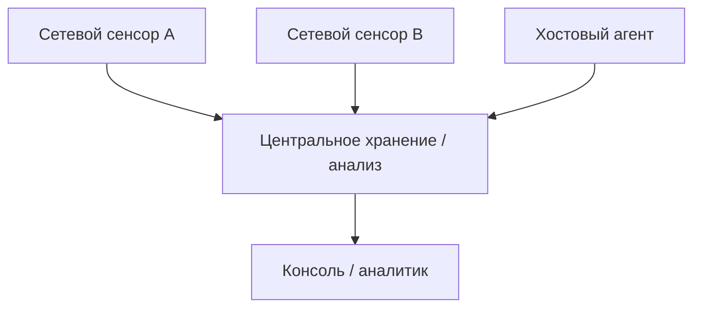

# 03. Сервисы кибербезопасности. Решения по вопросам безопасности

Защита информации не обеспечивается одним продуктом. Конфиденциальность, целостность, доступность, аутентификация, авторизация, журналирование, мониторинг, резервирование и реагирование требуют разных механизмов и источников данных.

Firewall, IDS/IPS, HIDS/HIPS, EDR, антивирус, SIEM и другие средства могут работать совместно, но выполняют разные функции. Нельзя приравнивать название продукта к одной защитной функции: современное решение может объединять несколько механизмов, а одна и та же функция может реализовываться разными продуктами.

При выборе меры сначала формулируют защищаемый актив, сценарий угрозы и требуемый результат, а уже затем определяют подходящий контроль и способ проверки его работы.

## Не путайте сервис безопасности с устройством

Конфиденциальность, аутентификация и управление доступом — цели и функции защиты, но IDS не заменяет их. Например, ошибка входа может быть записана системой аутентификации, обнаружена хостовым агентом и затем сопоставлена в SIEM с сетевым событием. Эти средства решают разные задачи; централизованное событие не следует автоматически считать независимым подтверждением атаки.

## Классы IDS/IPS и источники данных

### Где IDPS находится среди других защитных функций

Одна из типичных ошибок — пытаться описать всю защиту организации через один класс средств. Для разговора об IDPS удобно сначала выделить несколько **защитных функций**, а уже потом смотреть, какие продукты их реализуют. Это учебная группировка для текущей главы, а не исчерпывающая модель кибербезопасности.

<div class="idps-grid idps-grid--4 idps-grid--compact">
  <article class="idps-card idps-card--primary"><span class="idps-card__eyebrow">ПРЕДОТВРАЩЕНИЕ</span><strong class="idps-card__title">Снизить вероятность или возможность нежелательного действия</strong><p>Например: безопасная настройка, контроль доступа, сегментация, межсетевой экран, IPS при реально включённом блокировании.</p></article>
  <article class="idps-card idps-card--sensor"><span class="idps-card__eyebrow">ОБНАРУЖЕНИЕ</span><strong class="idps-card__title">Выделить признаки интересующей активности</strong><p>Например: IDS, HIDS/EDR, мониторинг журналов, аналитика сетевого поведения.</p></article>
  <article class="idps-card idps-card--warning"><span class="idps-card__eyebrow">РЕАГИРОВАНИЕ</span><strong class="idps-card__title">Оценить событие и выполнить ответное действие</strong><p>Например: работа аналитика, изоляция узла, изменение политики, расследование.</p></article>
  <article class="idps-card idps-card--result"><span class="idps-card__eyebrow">ВОССТАНОВЛЕНИЕ</span><strong class="idps-card__title">Вернуть систему к приемлемому состоянию</strong><p>Например: восстановление конфигурации, данных или сервиса после инцидента.</p></article>
</div>

Эта схема не классифицирует продукты раз и навсегда. Один продукт может совмещать несколько функций, а одна функция может реализовываться разными средствами. Поэтому корректнее спрашивать не «что это за коробка?», а:

```text
какие данные доступны?
какая логика применяется?
какой результат формируется?
может ли система инициировать воздействие?
```

<div class="principle-box">
<strong>ПРОДУКТ ≠ ОДНА ЗАЩИТНАЯ ФУНКЦИЯ</strong>
<p>NGFW может выполнять контроль доступа и инспекцию, EDR — обнаружение и изоляцию, IPS — обнаружение и блокирование. В курсе функции оцениваются по фактическим возможностям и конфигурации.</p>
</div>

---


### Комплексная защита: что находится рядом с IDPS

IDS/IPS является только частью системы кибербезопасности. Для понимания роли IDPS полезно знать основные организационные и технические меры, которые встречаются рядом с ней.

| Мера / функция | Основная задача | Связь с IDPS |
|---|---|---|
| Политика безопасности и оценка рисков | определить правила, приоритеты и допустимый уровень риска | задают контекст: что именно важно обнаруживать и защищать |
| Управление доступом и MFA | ограничить доступ и усилить проверку личности | события аутентификации могут становиться источником для обнаружения |
| VPN и шифрование | защищать передаваемые данные и удалённый доступ | шифрование одновременно снижает доступность содержимого для внешнего сетевого сенсора |
| Защита облачной среды | управлять облачными идентификаторами, конфигурацией, секретами, журналированием и сетевыми границами | облачные audit/API logs могут дополнять сетевые и хостовые данные IDPS |
| Межсетевые экраны и сегментация | ограничивать разрешённые направления взаимодействия | сокращают поверхность взаимодействия; IDS/IPS анализирует то, что остаётся доступным в её точке наблюдения |
| Антивирус / защита конечных систем | выявлять и блокировать вредоносную активность на узле | даёт хостовую телеметрию, которую можно сопоставлять с сетевыми событиями |
| SIEM и мониторинг безопасности | собирать и сопоставлять события из нескольких источников | позволяют объединять результаты IDPS с журналами других систем |
| Threat intelligence / управление информацией об угрозах | поддерживать контекст об известных инфраструктурах, техниках, индикаторах и кампаниях | может обогащать результаты обнаружения, но не превращает индикатор в доказательство компрометации |
| SOC | организационно обеспечивать постоянный мониторинг и разбор событий | использует результаты защитных средств, но сам по себе не является одним детектором |
| Реагирование и форензика | подтвердить масштаб события, ограничить последствия, сохранить и анализировать доказательства | начинается после первичного сигнала, но не сводится к автоматическому alert |
| Резервное копирование и восстановление / DRP | вернуть данные и сервисы в рабочее состояние после сбоя или инцидента | не обнаруживает атаку, но снижает последствия и поддерживает восстановление |
| Обучение пользователей | уменьшить вероятность ошибок и успешной социальной инженерии | воздействует на причину риска, которую технический детектор может вообще не видеть |
| Тестирование безопасности | выявлять слабости до реальной эксплуатации | помогает проверять, какие сценарии должны наблюдаться и какие детекторы требуется развивать |

<div class="principle-box">
<strong>КОМПЛЕКСНАЯ ЗАЩИТА ≠ НАБОР НЕЗАВИСИМЫХ «КОРОБОК»</strong>
<p>Политика, контроль доступа, VPN, межсетевой экран, IDPS, защита конечных систем, SIEM, SOC, реагирование и восстановление решают разные задачи и обмениваются контекстом. Наличие одного элемента не делает остальные ненужными.</p>
</div>

### Сервис, мера и продукт — не одно и то же

В учебных материалах рядом могут встречаться слова «сервис безопасности», «мера защиты» и название конкретного продукта. Их полезно развести:

| Уровень | Вопрос | Пример |
|---|---|---|
| Защитная функция / сервис | какую задачу решаем? | предотвращение, обнаружение, реагирование, восстановление |
| Мера / механизм | каким способом решаем? | MFA, резервное копирование, сегментация, шифрование, анализ журналов |
| Продукт / платформа | чем реализуем в инфраструктуре? | межсетевой экран, IDPS, SIEM, EDR, VPN-шлюз |

Один продукт может реализовать несколько функций, а одна функция обычно требует нескольких мер. Поэтому выражение «у нас есть SIEM/Firewall/EDR, значит функция закрыта» без проверки конфигурации и процесса недостаточно.

### Проактивные и реактивные меры

**Проактивные** меры уменьшают вероятность или поверхность сценария до инцидента: патчи, безопасная конфигурация, MFA, сегментация, обучение, тестирование безопасности. **Реактивные** меры вступают в работу после появления события или инцидента: анализ alert, изоляция узла, форензика, восстановление. Некоторые механизмы работают на обеих сторонах: например, мониторинг поддерживает раннее обнаружение, а накопленные журналы — последующее расследование.

### Как связаны мониторинг, SIEM и SOC

- **мониторинг безопасности** — процесс наблюдения и анализа доступной телеметрии;
- **SIEM** — технологическая платформа для сбора, нормализации, поиска, корреляции и хранения событий в пределах её реализации и настройки;
- **SOC** — организационная функция/команда, которая использует процессы, людей и инструменты для мониторинга и реагирования.

<div class="idps-equation idps-equation--warning">
  <div class="idps-equation__expression"><span>SIEM</span><b>≠</b><span>SOC</span></div>
  <p>Платформа не заменяет организационный процесс, а SOC не является одним детектором.</p>
</div>

---


### Почему одной IDS недостаточно

Рассмотрим один эпизод: сетевой запрос приводит к запуску процесса на сервере, процесс изменяет файл и устанавливает исходящее соединение.

<div class="idps-figure">
  <div class="idps-figure__label">СХЕМА 1 · ОДИН ЭПИЗОД ОСТАВЛЯЕТ РАЗНЫЕ СЛЕДЫ</div>
  <article class="idps-card idps-card--primary">
    <span class="idps-card__eyebrow">УЧЕБНЫЙ ЭПИЗОД</span>
    <strong class="idps-card__title">Запрос → запуск процесса → изменение файла + исходящее соединение</strong>
    <p>Это одна причинная цепочка в учебном сценарии, но наблюдать её части можно в разных средах.</p>
  </article>
  <div class="idps-grid idps-grid--2 idps-grid--compact">
    <article class="idps-card idps-card--source">
      <span class="idps-card__eyebrow">СЕТЕВОЙ СЛЕД</span>
      <strong class="idps-card__title">Сеть</strong>
      <p>Адреса, порты, соединения, протоколы, объёмы, время передачи и другие доступные сетевые признаки.</p>
    </article>
    <article class="idps-card idps-card--source">
      <span class="idps-card__eyebrow">ХОСТОВЫЙ СЛЕД</span>
      <strong class="idps-card__title">Операционная система</strong>
      <p>Процессы, пользователи, файлы, системные события и локальный контекст — если соответствующая телеметрия собирается.</p>
    </article>
  </div>
  <div class="idps-figure__caption">Сетевой сенсор и агент на хосте получают не одинаковые представления одного эпизода. Каждый источник подтверждает только тот факт, который реально зафиксирован.</div>
</div>

<div class="idps-equation idps-equation--primary">
  <div class="idps-equation__expression"><span>РАЗНЫЕ СЛЕДЫ</span><b>→</b><span>РАЗНЫЕ ИСТОЧНИКИ НАБЛЮДЕНИЯ</span></div>
  <p>Чтобы увидеть разные стороны эпизода, могут потребоваться разные источники данных. Это не означает, что один источник автоматически «лучше» другого.</p>
</div>

---


### Прикладная IDS — это пятый тип?

В NIST SP 800-94 встречается категория **прикладной IDPS** (`Application-Based IDPS`), ориентированная на конкретный сервис, например веб-сервер или СУБД. Английское название приведено только потому, что именно так категория названа в первичном источнике. В классической модели NIST она рассматривается как разновидность хостовой IDS/IPS.

Поэтому мы не создаём отдельную пятую равноправную категорию, но фиксируем идею: источник данных может находиться очень близко к самому приложению.

---


## Интеграция с другими системами

### Распределённая IDS: несколько точек наблюдения, единый анализ

**Распределённая IDS (DIDS)** — архитектура, в которой несколько сенсоров или агентов собирают события в разных точках инфраструктуры, а результаты передаются на один или несколько центральных компонентов для хранения, сопоставления, управления или анализа.



Распределённость полезна, когда одна точка наблюдения не видит весь сценарий. Например, один сенсор видит внешнее сканирование периметра, другой — обращение к внутреннему сервису, а хостовый агент — запуск процесса после успешного входа.

Но **несколько сенсоров не создают автоматически единую истину**. Нужно учитывать время, идентификаторы, NAT, потери событий, различия конфигураций и версии detection logic. Поэтому взаимодействие компонентов DIDS требует согласованной передачи событий, времени, схем данных и управления конфигурациями.


### Журналирование и событие IDS

Журналирование — это фиксация наблюдений и результатов работы IDS/IPS в структурированной или текстовой форме. Журнал нужен для расследования, поиска, корреляции, повторной проверки и отчётности.

Типичное событие может содержать:

- время;
- адреса и порты источника/назначения;
- протокол;
- направление потока;
- идентификатор правила/сигнатуры;
- сообщение и категорию;
- действие (`allowed`, `drop`, `reject` и т. п. — если конкретная реализация это фиксирует);
- поля прикладного протокола;
- идентификаторы потока/транзакции;
- приоритет, severity или confidence — если продукт их поддерживает.

В нашем стенде примером структурированного журнала является **EVE JSON Suricata**. Для централизованного поиска и корреляции события также могут поступать в SIEM. Другие распространённые средства анализа журналов — Elastic Stack, Splunk, OpenSearch, Graylog и аналогичные платформы. Название продукта не меняет доказательную модель: сначала нужно понять происхождение записи и что именно она подтверждает.


### IDS/IPS + SIEM и автоматизация реагирования

SIEM агрегирует и анализирует события из нескольких источников. IDS/IPS может быть одним из таких источников.

```text
IDS/IPS alert
    + identity event
    + endpoint event
    + asset context
        ↓
SIEM correlation
        ↓
case / notification / response workflow
```

Автоматизация может включать создание инцидента, уведомление, запуск playbook, запрос дополнительного контекста или изменение контроля через интеграцию. Но безопасная автоматизация требует условий, ограничений и возможности отмены: ложноположительный детектор при автоматическом блокировании способен создать отказ в обслуживании.

SIEM **не заменяет IDS/IPS**: она может агрегировать результат IDS/IPS, но не получает автоматически ту же сетевую видимость и detection logic.

### Уровни реакции: от фиксации до автоматического воздействия

Под «уровнем реагирования» полезно понимать не одну универсальную шкалу производителя, а **степень воздействия после результата обнаружения**. В учебной модели удобно различать четыре уровня:

1. **регистрация** — сохранить событие для последующего анализа;
2. **оповещение и передача контекста** — уведомить персонал, SIEM или систему управления инцидентами;
3. **ограниченное автоматическое действие** — например, временно изменить сетевую/хостовую политику или изолировать объект через интеграцию;
4. **непосредственное enforcement** — `drop`, `reject`, `reset`, блокирование или иное предотвращающее действие в пределах возможностей конкретной архитектуры.

Эти уровни не означают, что четвёртый всегда «лучше» первого. Чем сильнее воздействие, тем выше цена ложноположительного результата. Поэтому автоматическое действие должно быть привязано к проверяемому условию, scope, возможности отмены и последующей проверке фактического результата.

```text
обнаружение
→ решение по политике
→ действие
→ проверка результата
```


### Интеграция и совместимость

IDS/IPS часто интегрируется с межсетевыми экранами, SIEM, EDR, SOAR, threat-intelligence платформами, CMDB/asset inventory и системами управления инцидентами.

Преимущества интеграции:

- больше контекста;
- централизованный поиск;
- корреляция нескольких источников;
- автоматизация повторяемых действий;
- единая эксплуатационная видимость.

Проблемы совместимости:

- разные схемы событий и идентификаторы;
- разные временные зоны/качество синхронизации;
- несовместимые форматы API;
- различия severity/confidence;
- дублирование событий;
- разные версии правил и политик;
- vendor-specific semantics.


## Проверьте себя

Выберите ответ. После выбора появится пояснение. При необходимости перечитайте соответствующий раздел этой же темы.

<div class="quiz" data-question-id="topic03-q1">
  <p><strong>Как соотносятся IDS и SIEM?</strong></p>
  <button type="button" data-choice="0">А. SIEM самостоятельно получает все сетевые пакеты</button>
  <button type="button" data-choice="1" data-correct="true">Б. IDS доставляет исходный сигнал</button>
  <button type="button" data-choice="2">В. IDS обеспечивает только хранение сырых журналов</button>
  <button type="button" data-choice="3">Г. SIEM проверяет каждое событие как подтверждённый инцидент</button>
  <div class="quiz-feedback" data-explanation="IDS формирует события по доступной телеметрии; SIEM может объединять их с другими источниками." aria-live="polite"></div>
</div>

<div class="quiz" data-question-id="topic03-q2">
  <p><strong>Что является источником события входа в систему?</strong></p>
  <button type="button" data-choice="0" data-correct="true">А. Журнал аутентификации</button>
  <button type="button" data-choice="1">Б. Сетевой сенсор без endpoint-интеграции</button>
  <button type="button" data-choice="2">В. Список включённых правил IDS по URI</button>
  <button type="button" data-choice="3">Г. Сводное событие SIEM без ссылки на первичный источник</button>
  <div class="quiz-feedback" data-explanation="Факт входа фиксирует соответствующий журнал/источник, а не сама IDS по умолчанию." aria-live="polite"></div>
</div>

<div class="quiz" data-question-id="topic03-q3">
  <p><strong>Что следует из наличия NGFW с IPS?</strong></p>
  <button type="button" data-choice="0">А. Все функции NGFW являются одним методом обнаружения</button>
  <button type="button" data-choice="1" data-correct="true">Б. Устройство совмещает функции</button>
  <button type="button" data-choice="2">В. Функция IPS заменяет контроль сетевого доступа</button>
  <button type="button" data-choice="3">Г. SIEM обязательно участвует в блокировании потока</button>
  <div class="quiz-feedback" data-explanation="Один продукт способен реализовывать различные защитные функции." aria-live="polite"></div>
</div>

## Навигация

[← Тема 02](./02-ids-principles.md) · [Все 15 тем](../syllabus/index.md) · [Тема 04 →](./04-vulnerabilities-risks-attacks.md)

