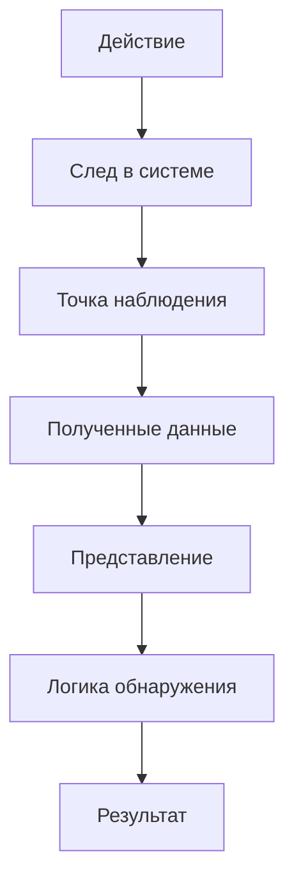

# 04. Уязвимости, риски и атаки. Типы кибератак

Уязвимость — это слабость или условие, которое может быть использовано. Риск появляется не из самого факта существования уязвимости, а из сценария: **актив → угроза → уязвимость/условие → действие → последствие**.

Атаки удобно анализировать не только по названию, но и по тому, какое действие выполняется и какой след оно оставляет. Сканирование, подбор учётных данных, эксплуатация уязвимости, отказ в обслуживании, подмена, перехват или внедрение данных создают разные наблюдаемые признаки и требуют разных мер защиты.

Для оценки риска важно отделять техническую возможность от фактически подтверждённого события. Результат сканера (finding), открытый порт или alert — это ещё не доказательство успешной эксплуатации.

## Как IDS подтверждает или ограничивает гипотезу

Открытый TCP-порт доказывает достижимость сервиса в условиях проверки, но не уязвимость. Срабатывание правила показывает совпадение условия обнаружения, но не факт эксплуатации. Если предполагается риск, отдельно зафиксируйте актив, слабость, вероятность/условия воздействия, последствия и доступные артефакты. Чем сильнее вывод, тем более независимая проверка требуется.

## Контекст угроз, риска и следов

### Угроза, уязвимость, атака и риск — разные понятия

Удобнее не строить линейную цепочку «угроза → уязвимость → риск», а разделить сам сценарий и его оценку:

```text
защищаемый актив
      │
      ├── источник / сценарий угрозы
      │
      └── уязвимость, слабость или небезопасное условие
                    │
                    ↓
         возможное нежелательное событие
                    │
                    ↓
          потенциальное воздействие

Риск оценивается для такого сценария с учётом
правдоподобия/вероятности реализации и последствий.
```

**Источник угрозы** — субъект, обстоятельство или явление, способное инициировать нежелательный сценарий. **Угроза** — потенциальная причина нежелательного события. **Уязвимость** — слабость или условие, которое может быть использовано либо случайно активировано. **Атака** — намеренное действие или последовательность действий, направленных на достижение нежелательного результата. **Последствие** — влияние события на актив, процесс или организацию. **Риск** — оценка подверженности потенциальному событию с учётом условий его реализации и возможного воздействия.

!!! warning "Не превращайте модель в формулу"
    Риск существует до того, как событие действительно произошло: это оценка потенциального сценария, а не финальный шаг после последствия. В реальной практике используются разные методики оценки риска. IDS/IPS не «измеряет риск» автоматически только потому, что сформировала оповещение.

### Какие бывают уязвимости и слабости

Для первичного анализа полезно различать как минимум три группы:

| Группа | Что это означает | Примеры |
|---|---|---|
| Технические | слабость в программном обеспечении, оборудовании или конфигурации | уязвимый сервис, ошибка аутентификации, небезопасная конфигурация, отсутствие исправления |
| Организационные | слабость процесса, правил или управления | избыточные права, отсутствие контроля изменений, слабая политика паролей, недостаточное обучение |
| Физические | слабость, связанная с физическим доступом и средой | неограниченный доступ к серверной, незащищённый носитель, отсутствие контроля доступа к оборудованию |

Граница между категориями не всегда идеальна. Например, слабый пароль может быть одновременно технической характеристикой учётной записи и следствием организационной политики.

### Как выглядит минимальный анализ риска

Рассмотрим веб-сервис с административной учётной записью без MFA:

```text
актив
→ административный доступ к сервису

источник / сценарий угрозы
→ внешний нарушитель получает пароль

слабость
→ отсутствует MFA

возможное действие
→ вход под скомпрометированной учётной записью

последствие
→ изменение конфигурации / доступ к данным

оценка риска
→ зависит от вероятности сценария и тяжести воздействия
```

После этого выбираются меры обработки: уменьшить вероятность, уменьшить воздействие, исключить сценарий либо осознанно принять остаточный риск в допустимых рамках. Для данного примера возможны MFA, ограничение административного доступа, мониторинг аутентификации и резервное копирование конфигурации.

<div class="idps-equation">
  <div class="idps-equation__expression"><span>ALERT</span><b>≠</b><span>РИСК</span></div>
  <p>Оповещение подтверждает выполнение конкретного условия детектора. Для оценки риска нужны контекст актива, сценарий угрозы, условия реализации и последствия.</p>
</div>

---


### От сценария угрозы к наблюдаемому следу

IDPS не получает абстрактный объект «атака» в готовом виде. Она получает **следы**, которые доступны её источнику данных и точке наблюдения.

<div class="idps-figure" markdown="1">
<div class="idps-figure__label">СХЕМА · ОТ ДЕЙСТВИЯ К ДАННЫМ ДЕТЕКТОРА</div>



<div class="idps-figure__caption">Курс будет постоянно возвращаться к этой цепочке. Между реальным действием и результатом IDPS есть несколько этапов, на каждом из которых возможны ограничения и потери наблюдаемости.</div>
</div>

Например, подбор паролей к веб-сервису может оставить серию HTTP-запросов, записи об ошибках аутентификации и события учётной записи. Сетевой сенсор, журнал приложения и хостовый агент получают **разные представления одного эпизода**. Ни одно из них автоматически не становится полной истиной о происходящем.

---


### Основные классы угроз и атак

Для базового анализа полезно различать не только названия атак, но и **какое свойство они затрагивают, какие слабости используют и какие следы оставляют**.

| Класс угрозы / сценария | Что происходит | Возможный наблюдаемый след | Какие меры могут снижать риск |
|---|---|---|---|
| Вредоносное ПО | запуск или распространение вредоносного кода | процесс, файл, сетевое соединение, изменение системы | обновления, защита конечных систем, ограничение привилегий, сегментация |
| Фишинг / социальная инженерия | пользователя убеждают раскрыть данные или выполнить действие | почтовые/веб-события, последующая аутентификация; сам разговор может быть вне телеметрии | обучение, MFA, фильтрация, контроль аутентификации |
| Подбор учётных данных | многократные попытки получить доступ | серия ошибок входа, множество запросов, блокировка учётной записи | MFA, rate limiting, блокировки, мониторинг |
| Перехват / подмена трафика | чтение или изменение сетевого обмена | изменения маршрута/сертификата/сеанса, необычные сетевые события — если источник способен их показать | шифрование, аутентификация узлов, защищённые протоколы |
| Инъекционные атаки | данные ввода интерпретируются как команда или запрос; типовой пример — SQL-инъекция | необычные HTTP/API-поля, ошибки приложения, SQL-журнал | безопасная разработка, параметризация, WAF как дополнительный слой |
| DoS / DDoS | ресурс перегружается запросами или потоками | рост частоты/объёма, исчерпание ресурсов, ошибки доступности | фильтрация, rate limiting, резервирование, anti-DDoS |
| Внутренняя угроза | легитимный пользователь злоупотребляет доступом или ошибается | массовый доступ, копирование, изменение конфигурации | наименьшие привилегии, аудит, DLP/EDR, разделение обязанностей |
| Облачный сценарий | ошибки доступа, секретов, конфигурации или внешних зависимостей | облачные audit logs, события IAM/API, сетевые и прикладные логи | IAM, MFA, безопасная конфигурация, журналирование, шифрование |
| IoT-сценарий | слабозащищённое устройство используется для доступа или ботнета | новые соединения, необычный трафик, изменение поведения устройства | инвентаризация, сегментация, обновления, контроль доступа |

### Атака и нарушаемое свойство

Один сценарий может затрагивать несколько свойств сразу. Но для первичного объяснения полезна такая карта:

- атаки на **конфиденциальность**: несанкционированное чтение, кража данных, шпионаж;
- атаки на **целостность**: изменение данных, конфигурации, маршрутизации или программного состояния; примером сетевой подмены может быть изменение DNS-ответа/направления разрешения имён;
- атаки на **доступность**: DoS/DDoS, уничтожение ресурсов, блокирование данных;
- атаки на **контроль доступа**: подбор паролей, кража учётных данных, обход аутентификации.

Не следует превращать эту карту в жёсткую классификацию: например, ransomware одновременно затрагивает доступность, целостность и иногда конфиденциальность.

---


### Мини-кейс: от угрозы до решения по защите

**Ситуация:** организация публикует веб-сервис. Пользователь получает фишинговое письмо, вводит пароль на поддельной странице, после чего злоумышленник входит в сервис и начинает массово выгружать данные.

Разложим сценарий:

| Вопрос | Ответ в кейсе |
|---|---|
| Актив | учётная запись и данные веб-сервиса |
| Угроза | несанкционированный доступ и кража данных |
| Слабость / условие | украденный пароль, отсутствие MFA, возможно избыточные права |
| Действие | вход и массовый доступ к данным |
| Воздействие | нарушение конфиденциальности, возможный финансовый/репутационный ущерб |
| Возможные меры | MFA, least privilege, мониторинг входов, rate/behavior controls, реагирование |
| Сетевой след | HTTP/TLS-сеансы, адреса, частота запросов — в зависимости от точки наблюдения |
| Прикладной след | успешная аутентификация, обращения к объектам, объём выгрузки |
| Что может сделать IDPS | обнаружить доступный технический признак и сформировать результат |
| Чего IDPS не решает одна | юридическую квалификацию, полный риск, личность и мотив нарушителя |

Этот кейс связывает базовую кибербезопасность с основной моделью курса:

```text
сценарий угрозы
→ действие
→ след
→ наблюдение
→ представление
→ логика обнаружения
→ результат
→ интерпретация / реагирование
```

---


## Слепые зоны и границы выводов

### IDS/IPS видит не «реальность», а доступный ей след

В инженерном смысле IDS/IPS никогда не получает полную картину происходящего. Она получает только те данные, которые:

```text
возникли в результате события;
прошли через доступную точку наблюдения;
были получены системой без критической потери;
были корректно декодированы или представлены;
попали в область применимости выбранной логики;
привели к наблюдаемому результату.
```

Поэтому между реальным событием и оповещением находится несколько независимых условий.

<div class="teaching-figure">
<div class="figure-label">ВИЗУАЛЬНАЯ МОДЕЛЬ 1 · ЦЕПОЧКА, В КОТОРОЙ МОЖЕТ ВОЗНИКНУТЬ РАЗРЫВ</div>
<div class="idps-gates">
  <div class="idps-gate"><span>1 · СОБЫТИЕ</span><strong>Что-то действительно произошло</strong><small>Запрос, соединение, изменение файла, запуск процесса или иной факт.</small></div>
  <div class="idps-gate"><span>2 · НАБЛЮДЕНИЕ</span><strong>След прошёл через доступную точку</strong><small>Сенсор или агент вообще имел возможность получить соответствующие данные.</small></div>
  <div class="idps-gate"><span>3 · ПОЛУЧЕНИЕ</span><strong>Данные не были потеряны</strong><small>Захват, очередь, память и другие ресурсы позволили принять нужный фрагмент наблюдения.</small></div>
  <div class="idps-gate"><span>4 · ПРЕДСТАВЛЕНИЕ</span><strong>Данные стали пригодны для проверки</strong><small>Поток собран, протокол распознан, нужное поле доступно и не скрыто шифрованием.</small></div>
  <div class="idps-gate"><span>5 · ЛОГИКА</span><strong>Условие обнаружения выполнилось</strong><small>Правило, модель или другой детектор получил именно тот контекст, который ему нужен.</small></div>
  <div class="idps-gate"><span>6 · РЕЗУЛЬТАТ</span><strong>Результат сохранился и доступен</strong><small>Оповещение не было подавлено, потеряно в очереди или исключено настройкой вывода.</small></div>
</div>
<div class="figure-caption">Отсутствие результата на последнем шаге не объясняет автоматически, на каком именно шаге произошёл разрыв.</div>
</div>

Это центральная идея главы:

<div class="principle-box">
<strong>НЕТ ОПОВЕЩЕНИЯ ≠ НЕТ СОБЫТИЯ</strong>
<p>Чтобы объяснить отсутствие оповещения, нужно определить, существовало ли событие, было ли оно наблюдаемо, какие данные реально получила система, какое представление использовал детектор и дошёл ли результат до журнала.</p>
</div>

---


### Ошибка результата и слепая зона — не одно и то же

Для контролируемой оценки детектор обычно рассматривают как систему, которая принимает решение относительно заранее определённого объекта оценки.

Если объект должен считаться положительным, а детектор его не выделил, получаем **ложноотрицательный результат (False Negative, FN)**.

Если объект должен считаться отрицательным, но детектор его выделил, получаем **ложноположительный результат (False Positive, FP)**.

Английские названия `False Positive` и `False Negative` приведены потому, что от них образованы общепринятые сокращения `FP` и `FN`, используемые в документации и литературе. Дальше основной текст использует русские названия и сокращения.

<div class="idps-grid idps-grid--2">
  <div class="idps-card idps-card--danger"><span class="idps-card__eyebrow">ЛОЖНОПОЛОЖИТЕЛЬНЫЙ · FP</span><strong class="idps-card__title">Детектор выделил отрицательный объект</strong><p>Например, легитимная административная активность удовлетворила слишком широкому условию.</p></div>
  <div class="idps-card idps-card--warning"><span class="idps-card__eyebrow">ЛОЖНООТРИЦАТЕЛЬНЫЙ · FN</span><strong class="idps-card__title">Детектор не выделил положительный объект</strong><p>Причиной может быть логика, слепая зона, потеря данных, шифрование, неполное состояние или неверная конфигурация.</p></div>
</div>

Но **слепая зона** описывает не результат классификации, а ограничение наблюдаемости или доступности данных.

<div class="idps-contrast">
  <div class="idps-node idps-node--observation"><strong>Слепая зона</strong><small>система не располагает нужным наблюдением или представлением</small></div>
  <div class="idps-contrast__arrow">≠</div>
  <div class="idps-node idps-node--result"><strong>Ложноотрицательный результат (FN)</strong><small>положительный объект оценки не был обнаружен</small></div>
</div>

Слепая зона **может привести** к FN, но это не единственная возможная причина FN.

И наоборот, не каждый случай отсутствия оповещения можно уже назвать FN: сначала нужен **эталон истинного состояния (ground truth)**, то есть независимое основание считать конкретную единицу оценки положительной. Английское выражение `ground truth` сохраняется только потому, что оно широко используется в литературе по оценке детекторов; далее в основном тексте используется «эталон» или «эталон истинного состояния». Полный контракт оценки и расчёт метрик разбираются в материале [«Оценка эффективности IDS/IPS и предотвращения»](../../course/08-effectiveness/).

---


### Первая естественная граница — точка наблюдения

Ранее мы уже установили:

```text
точка наблюдения относится к конкретному потоку;
одна точка не даёт автоматически видимость всей инфраструктуры.
```

Если интересующий трафик прошёл другим маршрутом, локальное изменение произошло только на хосте или событие возникло внутри сервиса после сетевого обмена, сетевой сенсор может не получить нужный след вообще.

<div class="idps-source-hub">
  <div class="idps-source-hub__sources">
    <div class="idps-source-hub__source"><strong>Сетевой путь A</strong><small>проходит через сенсор</small></div>
    <div class="idps-source-hub__source"><strong>Сетевой путь B</strong><small>обходит точку наблюдения</small></div>
    <div class="idps-source-hub__source"><strong>Хостовое действие</strong><small>может не иметь достаточного сетевого следа</small></div>
    <div class="idps-source-hub__source"><strong>Внутреннее событие приложения</strong><small>видно в журнале сервиса, но не обязательно в сети</small></div>
  </div>
  <div class="idps-source-hub__arrow">→</div>
  <div class="idps-source-hub__core"><strong>Конкретная IDS/IPS</strong><small>получает только доступные ей источники и пути</small></div>
  <div class="idps-source-hub__boundary"><strong>Граница:</strong><small>если нужный след не достигает источника данных системы, последующая логика обнаружения не может восстановить его из ничего.</small></div>
</div>

Отсюда важный инженерный вопрос:

> **До анализа правила сначала нужно доказать, что нужное событие вообще могло попасть в наблюдаемую область системы.**

---


### Что можно заключить из отсутствия оповещения

<div class="idps-proof-map">
  <div class="idps-proof-map__fact idps-proof-map__fact--source"><strong>Независимо подтверждено событие</strong><span>например, сервер зарегистрировал запрос или PCAP содержит нужный поток</span></div>
  <div class="idps-proof-map__operator" aria-hidden="true">+</div>
  <div class="idps-proof-map__fact idps-proof-map__fact--observation"><strong>Подтверждена пригодная точка наблюдения</strong><span>трафик действительно достиг интерфейса сенсора</span></div>
  <div class="idps-proof-map__operator" aria-hidden="true">+</div>
  <div class="idps-proof-map__fact"><strong>Подтверждены данные и состояние</strong><span>нет релевантной потери, нужное представление доступно, правило загружено</span></div>
  <div class="idps-proof-map__operator" aria-hidden="true">⇒</div>
  <div class="idps-proof-map__conclusion"><strong>Только после этого</strong><span>отсутствие ожидаемого оповещения становится содержательным фактом для анализа логики детектора.</span></div>
</div>

Даже тогда корректная формулировка обычно звучит так:

> «При зафиксированных условиях теста детектор не сформировал ожидаемый результат для данного объекта оценки».

Это намного точнее, чем:

> «IDS не видит атаку».

---


## Проверьте себя

Выберите ответ. После выбора появится пояснение. При необходимости перечитайте соответствующий раздел этой же темы.

<div class="quiz" data-question-id="topic04-q1">
  <p><strong>Сканер показывает открыт TCP-порт. Что доказано?</strong></p>
  <button type="button" data-choice="0">А. Наличие эксплуатируемой CVE</button>
  <button type="button" data-choice="1" data-correct="true">Б. Доступность порта в тесте</button>
  <button type="button" data-choice="2">В. Факт удалённого проникновения</button>
  <button type="button" data-choice="3">Г. Наличие вредоносного процесса</button>
  <div class="quiz-feedback" data-explanation="Открытый порт — факт сетевой доступности, а не доказательство уязвимости." aria-live="polite"></div>
</div>

<div class="quiz" data-question-id="topic04-q2">
  <p><strong>Что нужно для обоснования риска?</strong></p>
  <button type="button" data-choice="0">А. Только CVSS-балл уязвимости</button>
  <button type="button" data-choice="1" data-correct="true">Б. Сценарий, актив и последствия</button>
  <button type="button" data-choice="2">В. Только один firewall alert</button>
  <button type="button" data-choice="3">Г. Только совпадение имени сервиса с базой CVE</button>
  <div class="quiz-feedback" data-explanation="Риск соотносит угрозу, актив, условия и последствия." aria-live="polite"></div>
</div>

<div class="quiz" data-question-id="topic04-q3">
  <p><strong>Почему alert не равен факту эксплуатации?</strong></p>
  <button type="button" data-choice="0">А. Потому что всегда связан с подтверждённым сканером</button>
  <button type="button" data-choice="1" data-correct="true">Б. Он отражает совпадение условия</button>
  <button type="button" data-choice="2">В. Потому что не содержит условий для анализа</button>
  <button type="button" data-choice="3">Г. Потому что всё приложение обязательно заблокировано</button>
  <div class="quiz-feedback" data-explanation="Срабатывание требует отдельной проверки результата атаки." aria-live="polite"></div>
</div>

## Навигация

[← Тема 03](./03-security-services.md) · [Все 15 тем](../syllabus/index.md) · [Тема 05 →](./05-cybercrime.md)

